# 提交慣例與 commitlint

:::info
大多數提交訊息無法有效溝通：「fix stuff」、「wip」、「update」、「changes」只記錄了某件事發生過，讀者仍得自行開啟差異內容才能知道改了什麼、為什麼改。Conventional Commits 用結構化格式 `type(scope): description` 解決這個問題，讓機器可以解析、人類也能閱讀。commitlint 會在 `commit-msg` Git hook 中強制執行這個格式，在格式錯誤的訊息進入版本庫之前就將其拒絕。由於提交 type 對部分發布工具帶有版本提升的意義，這項紀律的效益會延續到後續流程：`semantic-release` 直接從提交 type 推導版本號，`changesets` 則是為每次變更寫入各自的明確檔案，完全不解析提交訊息。
:::

## 背景

Conventional Commits 將提交結構正規化為 `type(scope): description`。type 欄位標示變更的種類：`feat`、`fix`、`chore`、`refactor`、`perf`、`revert`、`ci`、`docs`、`test`、`build`、`style`。scope 將變更範圍縮小到程式碼庫的特定區域，description 則完成「如果套用這個提交，它將會……[description]」這句話。最終產生的訊息同時對人類可讀、對機器可解析。

機器可解析性讓建立在這個格式之上的發布工具得以運作，但這些工具讀取提交的方式並不相同。`semantic-release` 直接解析提交歷史：它讀取每個提交的 `type`，`feat` 提交觸發 minor 版本提升，`fix` 提交觸發 patch 版本提升，帶有 `BREAKING CHANGE` footer 或 `!` 後綴的提交則觸發 major 版本提升。`changesets` 的運作方式不同：它從不解析提交訊息。貢獻者執行 `pnpm changeset`，寫入一份明確的 markdown 檔案來聲明這次變更的 semver 提升幅度與 changelog 條目，之後 `changeset version` 再讀取這些檔案，計算下一個版本號。Conventional Commits 對採用 changesets 的版本庫仍然有幫助，能讓提交歷史保持一致、方便分組，但 type 欄位在那裡不具備決定版本提升的效力。（下方「與發布自動化的整合」小節會逐步走過這兩種流程。）

commitlint 在撰寫的當下強制執行 Conventional Commits 的約定。它在 `commit-msg` Git hook 中執行，於開發者寫完訊息之後、提交物件建立之前進行檢查，格式錯誤的訊息會立即被拒絕，並附上錯誤說明。開發者修正訊息後重新提交即可。

## 視覺呈現

### commitlint 驗證流程

以下流程圖顯示在 `commit-msg` hook 中執行的 commitlint 驗證序列。每個提交都會通過這個序列；在任何步驟被拒絕都會讓開發者回到編輯階段。這裡顯示的 72 字元標頭上限，是本文稍後設定的專案特定選擇；`@commitlint/config-conventional` 本身的預設值是 100 字元。

```mermaid
flowchart TD
    A[開發者寫提交訊息] --> B[commitlint 解析：type&#40;scope&#41;: description]
    B --> C{type 在允許列表中嗎？}
    C -- 否 --> D[Hook 拒絕：未知 type]
    C -- 是 --> E{提供了 scope 但\n不在允許清單中？}
    E -- 是 --> F[Hook 拒絕：\nscope 不在列舉中]
    E -- 否 --> G{description 非空且標頭 <= 72 字元嗎？}
    G -- 否 --> H[Hook 拒絕並顯示字元數]
    G -- 是 --> I[提交被接受]

    style D fill:#fee2e2,stroke:#ef4444
    style F fill:#fee2e2,stroke:#ef4444
    style H fill:#fee2e2,stroke:#ef4444
    style I fill:#dcfce7,stroke:#22c55e
```



## 範例

### 安裝

```bash
npm install --save-dev @commitlint/cli @commitlint/config-conventional
```

將 commitlint 連接到 `commit-msg` hook。如果使用 Husky（參見 [FEE-1603：Git Hooks 與提交前自動化](./1603.md)）：

```sh
# .husky/commit-msg
#!/bin/sh
npx --no -- commitlint --edit "$1"
```

`$1` 引數是包含提交訊息的臨時檔案路徑。`--edit` 從該檔案讀取。`--no` 旗標可防止 npx 在 commitlint 缺失時靜默安裝它：它會直接顯示明確的錯誤並結束。

### commitlint.config.js

```js
// commitlint.config.js  (requires "type": "module" in package.json)
// For CommonJS projects, use commitlint.config.cjs with module.exports instead
/** @type {import("@commitlint/types").UserConfig} */
export default {
  extends: ["@commitlint/config-conventional"],
  rules: {
    "scope-enum": [
      2,
      "always",
      ["ui", "api", "auth", "dashboard", "infra", "deps", "ci"],
    ],
    "header-max-length": [2, "always", 72],
    "body-max-line-length": [2, "always", 100],
  },
};
```

```js
// commitlint.config.cjs  (for CommonJS projects without "type": "module")
/** @type {import("@commitlint/types").UserConfig} */
module.exports = {
  extends: ["@commitlint/config-conventional"],
  rules: {
    "scope-enum": [
      2,
      "always",
      ["ui", "api", "auth", "dashboard", "infra", "deps", "ci"],
    ],
    "header-max-length": [2, "always", 72],
    "body-max-line-length": [2, "always", 100],
  },
};
```

### 有效與無效提交訊息

```
# 有效
feat(auth): add OAuth 2.0 PKCE flow for SPA login
fix(api): correct 401 response when refresh token is expired
chore(deps): update eslint to v9.0.0
docs(ui): add usage examples to Button component

# 破壞性變更——! 後綴和 BREAKING CHANGE footer 都必須有
feat(api)!: replace userId with sub claim in JWT payload

BREAKING CHANGE: The userId field in the JWT response has been renamed
to sub to align with the OIDC specification. Consumers must update
token parsing logic to read sub instead of userId.

# 無效——commitlint 將拒絕這些
fixed stuff                    # 沒有 type，沒有 scope
feat: update the thing         # 模糊的 description（通過格式但不通過品質）
Feature(Auth): Add login       # 錯誤大小寫，scope 不在允許列表中
fix(payments): resolve the issue   # 'payments' 不在 scope-enum 中——被拒絕
```

### 在本地驗證 commitlint

```bash
# lint 最近的提交訊息
echo "feat(auth): add PKCE flow" | npx commitlint

# lint 最後 N 個提交的訊息
npx commitlint --from HEAD~3 --to HEAD

# lint 自從從 main 分支後的所有提交
npx commitlint --from main
```

最後一種形式在 CI 中很有用，可驗證 pull request 中的所有提交是否遵循慣例，而不僅僅是最新的那個。

### CI 整合

在 CI pipeline 中添加 commitlint 步驟，以捕獲任何繞過本地 hook 的提交（通過 `--no-verify` 或非 Husky 設置）：

```yaml
# .github/workflows/ci.yml
- name: Validate commit messages
  run: npx commitlint --from ${{ github.event.pull_request.base.sha }} --to ${{ github.event.pull_request.head.sha }}
```

這驗證 pull request 中的每個提交是否符合配置的規則。它是捕獲繞過本地 `commit-msg` hook 訊息的 CI 後備。

### Squash-merge 與 PR 標題

逐一驗證提交，只有在每個提交都真的進入 `main` 時才能保護 `main`。大多數 GitHub 版本庫使用「Squash and merge」合併 pull request，這種方式會捨棄各個提交訊息，改用 PR 標題建立單一提交。之後 `semantic-release` 讀取的是這個 squash 提交，而不是 commitlint 一路驗證過的那些格式良好的提交。一個完全由合規提交組成的 PR，如果從未檢查過 PR 標題本身，合併後仍可能產生不合規的 squash 提交。

要補上這個缺口，需要兩項調整。第一，在版本庫的合併設定中啟用「Default to PR title for squash merge commits」，讓 squash 提交使用 PR 標題，而不是通用的合併訊息。第二，不只驗證提交，也要驗證 PR 標題本身，例如將 [amannn/action-semantic-pull-request](https://github.com/amannn/action-semantic-pull-request) 設為必要的狀態檢查。有個關於標頭長度的細節需要留意：GitHub 會在 squash 後的提交訊息中附加 PR 編號（例如 `(#482)`），因此一個原本符合 commitlint 100 字元預設值、或專案收緊後 72 字元限制的標題，合併後可能超出上限；設定 `header-max-length` 時務必把這個後綴的長度也算進去。

### Monorepo scope 配置

對於 `packages/` 下有套件的 monorepo，將 scope 名稱與套件目錄名稱對齊：

```js
// commitlint.config.js
/** @type {import("@commitlint/types").UserConfig} */
export default {
  extends: ["@commitlint/config-conventional"],
  rules: {
    "scope-enum": [
      2,
      "always",
      // 套件 scopes
      ["ui", "api-client", "server", "docs",
       // 跨領域 scopes
       "deps", "ci", "infra", "release"],
    ],
    "header-max-length": [2, "always", 72],
  },
};
```

跨領域 scopes（`deps`、`ci`、`infra`、`release`）用來處理不屬於任何單一套件的提交：跨所有套件的依賴更新、CI pipeline 變更、基礎設施配置。

## 最佳實踐

**必須（MUST）繼承 `@commitlint/config-conventional` 並新增列舉專案特定 scopes 的 `scope-enum` 規則。** 基礎設定強制執行 type、格式和長度限制；`scope-enum` 規則使這些限制符合專案特定，並防止不受約束的 scope 值進入歷史。對於預期阻止提交的規則，嚴重性必須（MUST）設為 `2`（錯誤），禁止（MUST NOT）對本應為強制要求的規則保留 `1`（警告）。

**應該（SHOULD）撰寫能完成「如果套用這個提交，它將會……」這個句子的 description 欄位。** 「update」、「fix bug」或「WIP」這樣的 description 通過最低驗證但什麼都沒傳達，並破壞自動生成的 changelog。當 description 本身不足夠時，團隊應該（SHOULD）新增以空白行與標頭分隔的提交正文，解釋為何選擇這種方式、考慮了哪些替代方案，以及驅動決策的限制。這些資訊都不會顯示在差異內容中。

**必須（MUST）在每個破壞性變更提交中包含三個要素：標頭中的 `!` 後綴、`BREAKING CHANGE:` footer，以及遷移描述。** Footer 值將逐字包含在生成的 CHANGELOG 中，必須（MUST）為需要九十秒時間理解在消費程式碼中確切需要更改什麼的開發者而寫。省略這三個要素中的任何一個，都會阻止自動化工具正確識別和記錄破壞性變更。

**必須（MUST）根據精確定義使用提交 type，禁止（MUST NOT）混淆 `feat`、`fix`、`refactor` 和 `docs`。** 將重構標記為 `feat` 會破壞 minor 版本提升信號；將文件修復標記為 `fix` 會破壞 patch 版本提升信號。正確的對應是：`feat` 用於使用者可見或 API 可見的新行為，`fix` 用於損壞行為的修正，`refactor` 用於無行為變更的重構，`docs` 用於僅文件的變更。

**應該（SHOULD）以明確的外掛清單配置 `semantic-release`，而不是依賴預設值；需要逐套件控制版本提升幅度的 monorepo，則應該（SHOULD）改採 `changesets`。** 所需的 `semantic-release` 外掛包括 `@semantic-release/commit-analyzer`、`@semantic-release/release-notes-generator`、`@semantic-release/changelog`、`@semantic-release/npm` 和 `@semantic-release/git`。有了這個配置，`feat` 觸發 minor 發布，`fix` 和 `perf` 觸發 patch 發布，任何帶有 `BREAKING CHANGE` footer 的提交則觸發 major 發布。改用 `changesets` 的團隊應該（SHOULD）執行 `pnpm changeset`，為每次變更寫下明確的版本提升聲明；Conventional Commits 的 type 在那裡仍然有幫助，但只用於讓提交歷史與 changelog 分組保持可讀，並不用於決定版本號。

## 設計思維

### type 欄位作為版本控制信號

type 欄位是一項版本控制指令：`feat` 對應 minor 版本提升，`fix` 對應 patch 版本提升。但完整的對應關係分別由規範和工具兩者共同決定。Conventional Commits 規範本身只固定了兩種對應，再加上破壞性變更這個特例：

- `feat` → MINOR 版本提升（規範定義）
- `fix` → PATCH 版本提升（規範定義）
- `BREAKING CHANGE` footer 或 `!` 後綴 → MAJOR 版本提升，無論 type 為何（規範定義）
- 其他所有 type → 規範說明它們「對語意化版本沒有隱含影響」

大多數團隊實際觀察到的版本提升行為，來自發布工具的預設規則，而非規範本身。`semantic-release` 的預設發布規則額外會將 `perf` 提交與任何 `revert` 提交提升為 PATCH。其餘的 type，也就是 `chore`、`refactor`、`ci`、`docs`、`test`、`build`、`style`，在這些預設規則下都不會觸發發布。

`semantic-release` 會照字面讀取這個對應關係來分析提交歷史。若版本庫將 `feat` 用於重構、雜事或文件變更，就會產生不正確的版本號。一個從 2.3.1 提升到 2.4.0 的依賴，會向使用者發出新增功能的信號；如果 2.4.0 實際上只是沒有使用者可見變更的重構，這個信號就是錯的，而依賴 CHANGELOG 條目決定是否升級的使用者會因此被誤導。

Type 紀律讓版本信號維持可靠：使用者不必先檢查差異內容，就能安心安裝一次 minor 版本提升。一旦持續用錯，無論版本號寫的是什麼，每次更新都得手動檢查。

### Scope 設計：單一應用程式 vs. monorepo

`scope` 欄位的含義因版本庫結構而異：

在**單一應用程式版本庫**中，scope 通常是功能區域或架構層次：
- `auth`：認證與授權
- `dashboard`：儀表板功能區域
- `api`：API 客戶端或服務層
- `ui`：共用 UI 元件庫
- `infra`：基礎設施層程式碼（建置配置、環境）

在 **monorepo** 中，scope 通常是套件名稱：
- `@acme/ui` 或直接用 `ui`：一個 UI 套件
- `@acme/api-client` 或 `api-client`：API 客戶端套件
- `server`：後端伺服器套件
- `docs`：文件套件

兩種情況下的關鍵原則都是 scope 必須（MUST）保持一致。`auth` scope 的變更日誌，只有在每個提交都使用同一個 scope 字串時才有用：一律用 `auth`，不要用 `Auth` 或 `authentication`。commitlint 中的 `scope-enum` 規則會強制執行允許清單，並拒絕 scope 超出清單範圍的提交。

對於某些提交確實是跨領域的版本庫（例如影響所有套件的依賴更新、CI 配置變更），`deps` 和 `ci` scope 可以作為這些提交的收集點。

### `!` 後綴與 BREAKING CHANGE footer

破壞性變更是指任何需要消費者在升級前更新其程式碼、配置或資料的變更。Conventional Commits 提供兩種機制來傳達這一點：

1. type/scope 上的 `!` 後綴：`feat(api)!: replace userId with sub claim in JWT payload`
2. 提交正文中的 `BREAKING CHANGE:` footer

`!` 後綴是 `git log` 輸出中的視覺警告。掃描提交歷史且看到 `!` 的任何開發者都知道要注意。`BREAKING CHANGE:` footer 由工具解析。`semantic-release` 讀取 footer 值，並將其包含在生成的 CHANGELOG 的破壞性變更部分，以便閱讀變更日誌的消費者知道具體更改了什麼以及他們需要做什麼來遷移。

兩種機制服務不同的受眾，應始終一起使用。帶有 `!` 但沒有 `BREAKING CHANGE:` footer 的提交給人類讀者一個警告，但給工具沒有任何可在變更日誌中包含的內容。帶有 `BREAKING CHANGE:` footer 但沒有 `!` 的提交是可解析的，但在 git log 中不顯眼。

footer 值應解釋更改了什麼以及消費者應如何適應：

```
BREAKING CHANGE: The userId field in the JWT response has been renamed
to sub to align with the OIDC specification. Consumers must update
token parsing logic to read sub instead of userId.
```

只寫「API changed」的 footer 並不足夠：它指出有東西壞了，卻沒有提供遷移路徑。

### Commitizen 作為可選的入門輔助工具

Commitizen（`cz-cli`）是一個互動式 CLI，透過提示 type、scope、description、破壞性變更標記和議題參照，引導開發者完成 Conventional Commits 格式。執行 `git cz` 而不是 `git commit` 會啟動互動式提示。

Commitizen 對剛接觸 Conventional Commits 的團隊很有用：此時格式還沒有被內化，開發者常常出於習慣寫自由格式的訊息。這些提示能強制執行結構，開發者不需要記住格式。

對於格式已成為第二本能的資深團隊，Commitizen 反而為原本快速的操作增加了互動開銷。知道要輸入 `feat(auth): add PKCE flow` 的開發者，不會從四個額外的互動提示中得到任何好處。這種情況下，commitlint 才是正確的工具：一個事後驗證的毫秒級檢查。

典型的團隊生命週期是：在初期導入階段採用 Commitizen，等格式內化後就捨棄它，並永久保留 commitlint 作為強制執行層。

### commitlint 如何融入 Git hook 鏈

commitlint 在 `commit-msg` hook 中執行，Git 會在開發者寫完提交訊息之後、提交物件建立之前呼叫這個 hook。hook 收到的是包含訊息的暫存檔案路徑。commitlint 讀取檔案，依照配置的規則解析訊息，一旦有規則被違反，就以非零值結束並附上錯誤說明。

這個檢查很快：commitlint 只讀取單一檔案並執行解析器，遠遠不到一秒就能完成。開發者會立即看到錯誤，修正訊息後重新執行 `git commit`。整個來回以秒計，而不是分鐘。

commitlint 在 hook 鏈中的位置很重要。它在 `pre-commit`（用 lint-staged 檢查已暫存檔案品質）之後、提交建立之前執行。通過了 `pre-commit` 卻沒通過 `commit-msg` 的提交不會建立提交物件。開發者只需要修正訊息並重新提交，不必重新暫存檔案，也不必重新執行 lint。

### 與發布自動化的整合

從提交到發布的端到端流程，取決於版本庫使用哪一種發布工具，因為 `semantic-release` 和 `changesets` 決定版本提升的方式截然不同。

**使用 `semantic-release` 時：**

1. 開發者依照 Conventional Commits 格式撰寫提交。
2. commitlint 在 `commit-msg` hook 中驗證訊息。
3. 提交進入版本庫。
4. 合併到主分支時，`semantic-release` 會讀取自上次發布以來的提交歷史，並檢查每個提交的 `type`：`feat` 觸發 minor 版本提升，`fix` 和 `perf` 觸發 patch 版本提升，帶有 `BREAKING CHANGE` footer 或 `!` 後綴的提交則觸發 major 版本提升。
5. 它會產生按提交 type 分組的 CHANGELOG，提升版本號、標記發布，並發布出去。

**使用 `changesets` 時：**

1. 開發者完成變更後執行 `pnpm changeset`，依提示回答 semver 提升幅度與 changelog 摘要，這會在 `.changeset/` 目錄下寫入一份 markdown 檔案。
2. 這個提交（可能仍依 Conventional Commits 格式撰寫以維持可讀性）與 changeset 檔案會一起進入版本庫，通常在同一個 pull request 中。
3. `changeset version` 會讀取累積的 changeset 檔案，為每個受影響的套件計算下一個版本號，並寫入 CHANGELOG。
4. 發布步驟（`changeset publish`）負責標記並發布這次發布。

在 `semantic-release` 流程中，提交 type 就是版本提升的決策依據。在 `changesets` 流程中，版本提升的決策依據是 changeset 檔案，提交 type 只用於維持 git 歷史的可讀性。沒有格式良好的提交，`semantic-release` 就無法運作；沒有 changeset 檔案，`changesets` 同樣如此。這兩種情況下，發布步驟都會退回人工整理：由人檢查差異、決定版本號，並手動撰寫 changelog 條目。

## 常見錯誤

### 寫模糊的 description

commitlint 驗證的是格式，不是含義。「feat(auth): update」能通過 `@commitlint/config-conventional` 的驗證：它具備有效的 type、有效的 scope，以及非空的 description。但它什麼都沒有傳達。

好 description 的測試：團隊成員能在不閱讀差異的情況下理解更改了什麼嗎？「add OAuth 2.0 PKCE flow for SPA login」通過這個測試。「update」不通過。

模糊的 description 會在提交歷史中不斷累積，永久失去用處。六個月後，「fix(api): fix the issue」只告訴讀者 API 中有東西被修好了，卻沒有說明問題是什麼、成因為何，或修復改變了什麼。差異雖然還在，但意圖已經不存在了。

### 在 CI 中跳過 commitlint

一些團隊只將 commitlint 安裝為本地 hook，不將其添加到 CI。這產生了一個缺口：使用 `--no-verify` 的開發者可以推送格式錯誤訊息的提交，然後這些提交以不可預測的結果出現在變更日誌生成步驟中。

在 CI 中添加驗證 pull request 中每個提交的 commitlint 步驟。CI 檢查是最終的強制執行；本地 hook 是快速回饋的便利。如果 CI 不驗證提交，格式錯誤的訊息可能到達主分支。

### 誤信 squash-merge 下的逐一提交驗證

驗證 pull request 中的每個提交，並不保證真的有合規的提交進入 `main`。如果版本庫使用「Squash and merge」合併，GitHub 會捨棄各個提交訊息，改用 PR 標題建立單一提交，而 `semantic-release` 讀取的正是這個 squash 提交，不是 commitlint 檢查過的那些提交。解法是驗證 PR 標題本身（參見上方「範例」小節中的「Squash-merge 與 PR 標題」），並在版本庫設定中啟用「Default to PR title for squash merge commits」。

## 延伸閱讀

- [FEE-1600：開發者體驗與工具總覽](./1600.md) — 分類背景：提交慣例在 DX 生命週期的提交層被強制執行
- [FEE-1603：Git Hooks 與提交前自動化](./1603.md) — `commit-msg` hook 是 commitlint 執行的地方；Husky 管理 hook 安裝
- [FEE-1507：發布自動化：語意化版本與變更日誌](../CI%20CD%20and%20Deployment/1507.md) — Conventional Commits 是驅動自動化語意化版本和變更日誌生成的結構化輸入

## 參考資料

- Conventional Commits, "Conventional Commits 1.0.0," conventionalcommits.org (2023). https://www.conventionalcommits.org/en/v1.0.0/
- commitlint, "commitlint documentation," commitlint.js.org. https://commitlint.js.org/
- conventional-changelog, "@commitlint/config-conventional source," GitHub. https://github.com/conventional-changelog/commitlint/tree/master/%40commitlint/config-conventional
- semantic-release, "Getting Started," semantic-release.org. https://semantic-release.org/intro/
- semantic-release, "commit-analyzer default release rules," GitHub. https://github.com/semantic-release/commit-analyzer/blob/master/lib/default-release-rules.js
- Changesets, "Intro to using changesets," GitHub. https://github.com/changesets/changesets/blob/main/docs/intro-to-using-changesets.md
- amannn, "action-semantic-pull-request," GitHub. https://github.com/amannn/action-semantic-pull-request
