# 提交慣例與 commitlint

一則提交訊息是一個溝通單元。它告訴下一個人——或自動化工具——改變了什麼，以及為什麼。大多數提交訊息在這方面失敗了。「fix stuff」、「wip」、「update」、「changes」——這些都是雜訊，不是溝通。它們告訴讀者提交發生了，卻沒有說明它做了什麼或為什麼重要。

Conventional Commits 藉由指定結構來使這種溝通正規化：`type(scope): description`。type 欄位編碼了變更的種類——`feat`、`fix`、`chore`、`refactor`、`perf`、`ci`、`docs`、`test`、`build`、`style`。scope 將焦點縮小到程式碼庫的特定區域。description 完成一個句子：「如果套用這個提交，它將會……[description]。」它們共同產生一條同時可被人類閱讀和機器讀取的提交訊息。

機器可讀性使工具生態系統成為可能。`semantic-release` 和 `changesets` 都讀取提交歷史來決定版本提升：`feat` 提交觸發 minor 版本提升，`fix` 提交觸發 patch 版本提升，帶有 `BREAKING CHANGE` footer 或 `!` 後綴的提交觸發 major 版本提升。變更日誌生成器從提交日誌生成結構化的發布說明，按 type 分組。這一切在自由格式提交訊息下都不可能實現。Conventional Commits 是開發者與工具之間的契約。

commitlint 在編寫時刻——在 `commit-msg` Git hook 中——強制執行這個契約，在提交進入版本庫之前。格式錯誤的訊息立即被拒絕，並附帶解釋說明出了什麼問題。開發者修正訊息後重新提交。當遵守約定時，這個限制是無形的；只有在被違反時才會浮現。

## 設計思維

### type 欄位作為版本控制信號

Conventional Commits 中的 `type` 欄位不是標籤——它是版本控制指令。映射是固定的：

- `feat` → minor 版本提升（新功能，向後相容）
- `fix` → patch 版本提升（錯誤修正，向後相容）
- `BREAKING CHANGE` footer 或 `!` 後綴 → major 版本提升（向後不相容的變更）
- 所有其他類型（`chore`、`refactor`、`perf`、`ci`、`docs`、`test`、`build`、`style`）→ 不觸發發布

`semantic-release` 和 `changesets` 等工具字面上讀取這個映射。一個鬆散使用 `feat` 的版本庫——用於重構、雜事、文件——將產生不正確的版本號。從 2.3.1 提升到 2.4.0 的依賴向其消費者發出信號，表示新增了功能。如果 2.4.0 實際上是沒有使用者可見變更的重構，這個信號是錯誤的，閱讀 CHANGELOG 條目來決定是否升級的消費者會被誤導。

Type 紀律不是關於迂腐地遵守規則——而是保持版本信號的可靠性。當信號可靠時，消費者可以信任 minor 版本提升並安全地應用它們。當它不可靠時，每次更新都需要手動檢查差異。

### Scope 設計：單一應用程式 vs. monorepo

`scope` 欄位的含義因版本庫結構而異：

在**單一應用程式版本庫**中，scopes 通常是功能區域或架構層次：
- `auth` — 認證和授權
- `dashboard` — 儀表板功能區域
- `api` — API 客戶端或服務層
- `ui` — 共用 UI 元件庫
- `infra` — 基礎設施層程式碼（建置配置、環境）

在 **monorepo** 中，scopes 通常是套件名稱：
- `@acme/ui` 或只是 `ui` — 一個 UI 套件
- `@acme/api-client` 或 `api-client` — API 客戶端套件
- `server` — 後端伺服器套件
- `docs` — 文件套件

在兩種情況下的關鍵原則是 scopes 必須（MUST）一致。`auth` scope 的變更日誌只有在每個與認證相關的提交都使用 `auth`——而不是 `Auth`、`authentication` 或 `login`——時才有用。commitlint 中的 `scope-enum` 規則強制執行允許列表，並拒絕 scope 超出其範圍的提交。

對於某些提交確實是跨領域的版本庫（影響所有套件的依賴更新、CI 配置變更），`deps` 和 `ci` scopes 作為這些提交的收集器。

### `!` 後綴與 BREAKING CHANGE footer

破壞性變更是指任何需要消費者在升級前更新其程式碼、配置或資料的變更。Conventional Commits 提供兩種機制來傳達這一點：

1. type/scope 上的 `!` 後綴：`feat(api)!: replace userId with sub claim in JWT payload`
2. 提交正文中的 `BREAKING CHANGE:` footer

`!` 後綴是 `git log` 輸出中的視覺警告。掃描提交歷史且看到 `!` 的任何開發者都知道要注意。`BREAKING CHANGE:` footer 由工具解析。`semantic-release` 讀取 footer 值，並將其包含在生成的 CHANGELOG 的破壞性變更部分，以便閱讀變更日誌的消費者知道具體更改了什麼以及他們需要做什麼來遷移。

兩種機制服務不同的受眾，應始終一起使用。帶有 `!` 但沒有 `BREAKING CHANGE:` footer 的提交給人類讀者一個警告，但給工具沒有任何可在變更日誌中包含的內容。帶有 `BREAKING CHANGE:` footer 但沒有 `!` 的提交是可解析的，但在 git log 中不顯眼。

footer 值應解釋更改了什麼以及消費者應如何適應：

```
BREAKING CHANGE: The userId field in the JWT response has been renamed
to sub to align with the OIDC specification. Consumers must update
token parsing logic to read sub instead of userId.
```

只寫「API changed」的 footer 是不足夠的——它識別出某些東西壞了，但沒有提供遷移路徑。

### Commitizen 作為可選的入門輔助工具

Commitizen（`cz-cli`）是一個互動式 CLI，通過提示 type、scope、description、破壞性變更標記和問題引用來引導開發者完成 Conventional Commits 格式。執行 `git cz` 而不是 `git commit` 啟動互動式提示。

Commitizen 對剛接觸 Conventional Commits 的團隊很有用，此時格式還未被內化，開發者經常出於習慣寫自由格式訊息。提示強制執行結構，無需開發者記憶格式。

對於格式已成為第二本能的有經驗團隊，Commitizen 為原本快速的操作增加了互動開銷。知道輸入 `feat(auth): add PKCE flow` 的開發者不會受益於四個額外的互動提示來產生相同的輸出。在這種情況下，僅 commitlint——一個事後驗證的毫秒級檢查——才是正確的工具。

典型的團隊生命週期：在初始入門期採用 Commitizen，一旦格式被內化就放棄它，永久保留 commitlint 作為強制執行層。

### commitlint 如何融入 Git hook 鏈

commitlint 在 `commit-msg` hook 中執行，Git 在開發者寫完提交訊息後、提交物件創建前呼叫此 hook。hook 接收包含訊息的臨時檔案路徑。commitlint 讀取檔案，根據配置的規則解析訊息，如果任何規則被違反，就以非零值退出並附帶錯誤解釋。

檢查是即時的——commitlint 讀取單個檔案並執行解析器，在 100 毫秒內完成。這使它牢固地在 `commit-msg` 階段的延遲預算內，實際上為零。開發者立即看到錯誤，修正訊息，然後重新執行 `git commit`。往返時間以秒計算。

commitlint 在 hook 鏈中的位置很重要。它在 `pre-commit`（用 lint-staged 檢查已暫存檔案品質）之後但在提交創建之前執行。通過 `pre-commit` 但未通過 `commit-msg` 的提交不會創建提交物件——開發者只需修正訊息並重新提交，而不需要重新暫存檔案或重新執行 lint。

### 與發布自動化的整合

從提交到發布的端到端流程如下：

1. 開發者按照 Conventional Commits 格式寫提交訊息
2. commitlint 在 `commit-msg` hook 中驗證訊息
3. 提交進入版本庫
4. 當觸發發布時（通常在合併到主分支時），`semantic-release` 或 `changesets` 讀取自上次發布以來的提交歷史
5. 它分析每個提交的 `type` 來決定版本提升：`feat` → minor，`fix` → patch，`BREAKING CHANGE` → major
6. 它生成按提交 type 分組的 CHANGELOG
7. 它提升版本，標記發布，並發布

沒有格式良好的提交，步驟 4-7 需要人工整理。開發者必須手動檢查差異，決定版本號，並寫 CHANGELOG 條目。有了 Conventional Commits，整個過程是自動化且確定性的。人類的決策是：「這個變更是 feat、fix，還是其他？」——一個在編寫時做出的決策，而不是在發布時。

## 最佳實踐

**必須（MUST）繼承 `@commitlint/config-conventional` 並新增列舉專案特定 scopes 的 `scope-enum` 規則。** 基礎設定強制執行 type、格式和長度限制；`scope-enum` 規則使這些限制符合專案特定，並防止不受約束的 scope 值進入歷史。對於預期阻止提交的規則，嚴重性必須（MUST）設為 `2`（錯誤），禁止（MUST NOT）對本應為強制要求的規則保留 `1`（警告）。

**應該（SHOULD）撰寫能完成「如果套用這個提交，它將會……」這個句子的 description 欄位。** 「update」、「fix bug」或「WIP」這樣的 description 通過最低驗證但什麼都沒傳達，並破壞自動生成的 changelog。當 description 本身不足夠時，團隊應該（SHOULD）新增以空白行與標頭分隔的提交正文，解釋為何選擇這種方式、考慮了哪些替代方案，以及驅動決策的限制——這些在差異中不可見的資訊。

**必須（MUST）在每個破壞性變更提交中包含三個要素：標頭中的 `!` 後綴、`BREAKING CHANGE:` footer，以及遷移描述。** Footer 值將逐字包含在生成的 CHANGELOG 中，必須（MUST）為需要九十秒時間理解在消費程式碼中確切需要更改什麼的開發者而寫。省略這三個要素中的任何一個，都會阻止自動化工具正確識別和記錄破壞性變更。

**必須（MUST）根據精確定義使用提交 type，禁止（MUST NOT）混淆 `feat`、`fix`、`refactor` 和 `docs`。** 將重構標記為 `feat` 會破壞 minor 版本提升信號；將文件修復標記為 `fix` 會破壞 patch 版本提升信號。正確的對應是：`feat` 用於使用者可見或 API 可見的新行為，`fix` 用於損壞行為的修正，`refactor` 用於無行為變更的重構，`docs` 用於僅文件的變更。

**應該（SHOULD）以明確的外掛清單配置 `semantic-release`，而不是依賴預設值。** 所需的外掛包括 `@semantic-release/commit-analyzer`、`@semantic-release/release-notes-generator`、`@semantic-release/changelog`、`@semantic-release/npm` 和 `@semantic-release/git`。有了這個配置，`feat` 觸發 minor 發布，`fix` 觸發 patch 發布，任何帶有 `BREAKING CHANGE` footer 的提交觸發 major 發布。使用 monorepo changesets 的團隊應該（SHOULD）使用 `pnpm changeset` 進行明確的提升聲明，同時仍然使用 Conventional Commits type 進行 changelog 分組。

## 視覺呈現

### commitlint 驗證流程

以下流程圖顯示在 `commit-msg` hook 中執行的 commitlint 驗證序列。每個提交都通過這個序列；在任何步驟的拒絕都會讓開發者回到編輯階段。



```mermaid
flowchart TD
    A[開發者寫提交訊息] --> B[commitlint 解析：type&#40;scope&#41;: description]
    B --> C{type 在允許列表中嗎？}
    C -- 否 --> D[Hook 拒絕：未知 type]
    C -- 是 --> E{提供了 scope 但\n不在允許清單中？}
    E -- 是 --> F[Hook 拒絕：\nscope 不在列舉中]
    E -- 否 --> G{description 非空且標頭 <= 72 字元嗎？}
    G -- 否 --> H[Hook 拒絕並顯示字元數]
    G -- 是 --> I[提交被接受]

    style D fill:#fee2e2,stroke:#ef4444
    style F fill:#fee2e2,stroke:#ef4444
    style H fill:#fee2e2,stroke:#ef4444
    style I fill:#dcfce7,stroke:#22c55e
```

## 範例

### 安裝

```bash
npm install --save-dev @commitlint/cli @commitlint/config-conventional
```

將 commitlint 連接到 `commit-msg` hook。如果使用 Husky（參見 [FEE-1603：Git Hooks 與提交前自動化](./1603.md)）：

```sh
# .husky/commit-msg
#!/bin/sh
npx --no -- commitlint --edit "$1"
```

`$1` 引數是包含提交訊息的臨時檔案路徑。`--edit` 從該檔案讀取。`--no` 旗標防止 npx 在 commitlint 缺失時靜默安裝它——它以明確的錯誤失敗。

### commitlint.config.js

```js
// commitlint.config.js  (requires "type": "module" in package.json)
// For CommonJS projects, use commitlint.config.cjs with module.exports instead
/** @type {import("@commitlint/types").UserConfig} */
export default {
  extends: ["@commitlint/config-conventional"],
  rules: {
    "scope-enum": [
      2,
      "always",
      ["ui", "api", "auth", "dashboard", "infra", "deps", "ci"],
    ],
    "header-max-length": [2, "always", 72],
    "body-max-line-length": [2, "always", 100],
  },
};
```

```js
// commitlint.config.cjs  (for CommonJS projects without "type": "module")
/** @type {import("@commitlint/types").UserConfig} */
module.exports = {
  extends: ["@commitlint/config-conventional"],
  rules: {
    "scope-enum": [
      2,
      "always",
      ["ui", "api", "auth", "dashboard", "infra", "deps", "ci"],
    ],
    "header-max-length": [2, "always", 72],
    "body-max-line-length": [2, "always", 100],
  },
};
```

### 有效與無效提交訊息

```
# 有效
feat(auth): add OAuth 2.0 PKCE flow for SPA login
fix(api): correct 401 response when refresh token is expired
chore(deps): update eslint to v9.0.0
docs(ui): add usage examples to Button component

# 破壞性變更——! 後綴和 BREAKING CHANGE footer 都必須有
feat(api)!: replace userId with sub claim in JWT payload

BREAKING CHANGE: The userId field in the JWT response has been renamed
to sub to align with the OIDC specification. Consumers must update
token parsing logic to read sub instead of userId.

# 無效——commitlint 將拒絕這些
fixed stuff                    # 沒有 type，沒有 scope
feat: update the thing         # 模糊的 description（通過格式但不通過品質）
Feature(Auth): Add login       # 錯誤大小寫，scope 不在允許列表中
fix(payments): resolve the issue   # 'payments' 不在 scope-enum 中——被拒絕
```

### 在本地驗證 commitlint

```bash
# lint 最近的提交訊息
echo "feat(auth): add PKCE flow" | npx commitlint

# lint 最後 N 個提交的訊息
npx commitlint --from HEAD~3 --to HEAD

# lint 自從從 main 分支後的所有提交
npx commitlint --from main
```

最後一種形式在 CI 中很有用，可驗證 pull request 中的所有提交是否遵循慣例，而不僅僅是最新的那個。

### CI 整合

在 CI pipeline 中添加 commitlint 步驟，以捕獲任何繞過本地 hook 的提交（通過 `--no-verify` 或非 Husky 設置）：

```yaml
# .github/workflows/ci.yml
- name: Validate commit messages
  run: npx commitlint --from ${{ github.event.pull_request.base.sha }} --to ${{ github.event.pull_request.head.sha }}
```

這驗證 pull request 中的每個提交是否符合配置的規則。它是捕獲繞過本地 `commit-msg` hook 訊息的 CI 後備。

### Monorepo scope 配置

對於 `packages/` 下有套件的 monorepo，將 scope 名稱與套件目錄名稱對齊：

```js
// commitlint.config.js
/** @type {import("@commitlint/types").UserConfig} */
export default {
  extends: ["@commitlint/config-conventional"],
  rules: {
    "scope-enum": [
      2,
      "always",
      // 套件 scopes
      ["ui", "api-client", "server", "docs",
       // 跨領域 scopes
       "deps", "ci", "infra", "release"],
    ],
    "header-max-length": [2, "always", 72],
  },
};
```

跨領域 scopes（`deps`、`ci`、`infra`、`release`）處理不屬於任何單一套件的提交——跨所有套件的依賴更新、CI pipeline 變更、基礎設施配置。

## 常見錯誤

### 寫模糊的 description

commitlint 驗證格式，而不是含義。「feat(auth): update」通過 `@commitlint/config-conventional` 驗證——它有有效的 type、有效的 scope 和非空的 description。但它什麼都沒有傳達。

好 description 的測試：團隊成員能在不閱讀差異的情況下理解更改了什麼嗎？「add OAuth 2.0 PKCE flow for SPA login」通過這個測試。「update」不通過。

模糊的 description 在提交歷史中積累，永久變得無用。六個月後，「fix(api): fix the issue」告訴讀者 API 中某些東西被修復了——沒有關於問題是什麼、是什麼造成的、修復改變了什麼。差異仍然可用，但意圖消失了。

### 在 CI 中跳過 commitlint

一些團隊只將 commitlint 安裝為本地 hook，不將其添加到 CI。這產生了一個缺口：使用 `--no-verify` 的開發者可以推送格式錯誤訊息的提交，然後這些提交以不可預測的結果出現在變更日誌生成步驟中。

在 CI 中添加驗證 pull request 中每個提交的 commitlint 步驟。CI 檢查是最終的強制執行；本地 hook 是快速回饋的便利。如果 CI 不驗證提交，格式錯誤的訊息可能到達主分支。

## 相關 FEE

- [FEE-1600：開發者體驗與工具總覽](./1600.md) — 分類背景：提交慣例在 DX 生命週期的提交層被強制執行
- [FEE-1603：Git Hooks 與提交前自動化](./1603.md) — `commit-msg` hook 是 commitlint 執行的地方；Husky 管理 hook 安裝
- [FEE-1507：發布自動化：語意化版本與變更日誌](../CI%20CD%20and%20Deployment/1507.md) — Conventional Commits 是驅動自動化語意化版本和變更日誌生成的結構化輸入

## 參考資料

- [Conventional Commits 規範](https://www.conventionalcommits.org/)
- [commitlint 文件](https://commitlint.js.org/)
- [@commitlint/config-conventional](https://github.com/conventional-changelog/commitlint/tree/master/%40commitlint/config-conventional)
- [semantic-release 文件](https://semantic-release.gitbook.io/semantic-release/)
- [changesets 文件](https://github.com/changesets/changesets)
