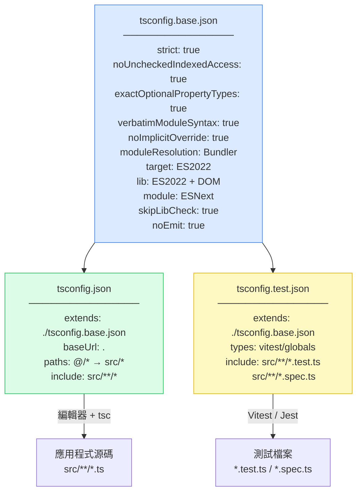

# TypeScript 設定

`tsconfig.json` 是你的原始碼與 TypeScript 編譯器之間的契約。它決定了編譯器將捕獲哪些類型錯誤、輸出針對什麼語法、模組如何解析，以及建置是否為增量模式。每個團隊都有一個——但大多數團隊把它當作樣板，從專案起始器複製過來後幾乎不再回頭檢視。

這種預設做法讓類型安全白白流失。TypeScript 預設不啟用 `strict` 旗標。`noUncheckedIndexedAccess` 可以防止對陣列和索引簽名的靜默 `undefined` 讀取，但它不在 `strict` 的範疇內。`verbatimModuleSyntax` 可以防止在僅轉譯的管線中出現 import/export 不匹配導致的運行時失敗，預設也是停用的。這些缺口不是晦澀的邊緣案例——而是編譯器本可捕獲卻沒有捕獲的整個錯誤類別。

現代 TypeScript 生態系也引入了兩年前還不存在的配置選項：`moduleResolution: "Bundler"`（TypeScript 5.0）正確地模擬了 Vite、esbuild 和其他打包工具解析模組的方式，取代了仍出現在大多數專案起始器中的舊版 `"node"` 設定。`verbatimModuleSyntax` 取代了舊版的 `importsNotUsedAsValues` 和 `preserveValueImports` 旗標，將類型 import 紀律整合成一個更清晰的單一選項。

配置不是一次性的設定任務，而是一份活的文件——當 TypeScript 編譯器新增了新的檢查、模組系統演進，以及專案的建置管線改變時，都必須更新它。2022 年正確的 `tsconfig.json` 在 2024 年可能靜默地遺漏了錯誤。

## 原則

每個 `tsconfig.json` 選項都必須（MUST）被視為類型安全契約，而不是偏好。放寬一個編譯器旗標會永久消除整個類別的類型錯誤——團隊必須（MUST）明確地為每個放寬的旗標說明理由，並在注釋中記錄原因。

`strict` 旗標必須（MUST）在所有應用程式碼中啟用。停用 `strict` 並選擇性地重新啟用個別旗標（`strictNullChecks`、`strictFunctionTypes` 等）並不等同——`strict` 啟用的檢查超出那些個別旗標的範疇，而且未來 TypeScript 版本中新增的嚴格旗標在 `strict: true` 時會自動包含。

`noUncheckedIndexedAccess` 必須（MUST）與 `strict` 一起啟用。在這個旗標下，陣列索引存取和索引簽名查找返回 `T | undefined`，而不是 `T`。沒有這個旗標執行的索引程式碼，是在對索引有效性做出編譯器無法驗證的隱含假設。

`verbatimModuleSyntax` 必須（MUST）在使用僅轉譯建置工具（esbuild、SWC、Babel、Vite）的專案中啟用。這些工具不執行 TypeScript 類型檢查——它們機械式地剝離類型標註。沒有 `verbatimModuleSyntax`，僅用作類型的值 import 會保留到 JavaScript 輸出中，在運行時引用一個該模組可能未匯出的值，或造成僅在運行時才顯現的循環依賴。

`moduleResolution` 必須（MUST）與運行時或打包工具的實際模組解析演算法匹配。在現代 Vite 和 Next.js 專案中，`moduleResolution: "Bundler"`（TypeScript 5.0+）是正確的設定。在基於打包工具的專案中使用 `"node"` 意味著 TypeScript 模擬了打包工具實際上不使用的解析演算法，導致假陰性：TypeScript 對將在打包時失敗的 import 不報錯。

`paths` 中定義的路徑別名必須（MUST）在打包工具配置中鏡像。TypeScript 的 `paths` 僅是類型檢查時的構造——它不影響輸出的 JavaScript。存在於 `tsconfig.json` 但不存在於 `vite.config.ts` 或 `webpack.config.js` 中的別名，將通過類型檢查但在運行時失敗。

`tsconfig.json` 檔案應該（SHOULD）分層：一個強制嚴格性的共享基礎配置、一個添加專案特定路徑和包含的應用程式配置，以及一個啟用測試框架特定全域的測試配置。

## 設計思維

### strict 傘形結構，以及為何部分旗標不等同

TypeScript 的 `--strict` 旗標是啟用一組個別嚴格旗標的縮寫：`strictNullChecks`、`strictFunctionTypes`、`strictBindCallApply`、`strictPropertyInitialization`、`noImplicitAny`、`noImplicitThis`、`alwaysStrict` 和 `useUnknownInCatchVariables`。停用 `strict` 並手動啟用僅 `strictNullChecks` 的開發者認為他們已復製了嚴格模式的重要部分——但他們沒有。

個別旗標遺漏了兩件事。首先，`strict` 具有向前相容性：當 TypeScript 在未來版本中新增新的嚴格旗標時，它們會在 `strict: true` 下自動包含。手動列出個別旗標的專案將靜默地不接收新的檢查。其次，`strict` 包含旗標之間的交互，這些交互無法通過個別選項重新建立。正確的做法始終是從 `strict: true` 開始，然後在其上添加額外旗標——絕不要組裝一個臨時的個別嚴格選項集合。

無法立即修復所有嚴格錯誤的專案的遷移路徑是在特定行上使用 `// @ts-ignore` 或帶有解釋的 `@ts-expect-error`，而不是全局禁用 `strict`。一個有 `strict: true` 和 20 個被壓制錯誤的專案，比一個有 `strict: false` 的專案處於更好的狀態——那 20 個壓制是可見的、可追蹤的，並且可以增量解決。

### target vs. lib vs. module：常見誤解

三個 `tsconfig.json` 欄位控制輸出，它們常常被混淆：

- `target` — TypeScript 輸出的 JavaScript 語法版本。`"ES2022"` 意味著 TypeScript 將輸出 ES2022 語法（箭頭函數、可選鏈等保持原樣；舊版語法會被降級）。它不意味著你可以使用 ES2022 API。
- `lib` — 為運行時環境包含的類型定義。`lib` 中的 `"ES2022"` 意味著 TypeScript 知道 `Array.prototype.at()`、`Object.hasOwn()` 和其他 ES2022 API。沒有匹配的 `lib` 條目，TypeScript 會將這些報告為未知。
- `module` — 輸出的 JavaScript 的模組格式。`"ESNext"` 輸出 ES module 語法（`import`/`export`）。`"CommonJS"` 輸出 `require()`/`module.exports`。

有 `target: "ES2022"` 但沒有 `lib: ["ES2022"]` 的專案在使用 `Array.prototype.at()` 時會看到錯誤，即使運行時支援它。有 `lib: ["ES2022"]` 但 `target: "ES5"` 的專案將有類型安全的 `Array.prototype.at()` 存取，但在 ES5 套件中輸出調用它的程式碼——如果沒有 polyfill 就是運行時錯誤。

實際上：對於使用現代打包工具的瀏覽器應用程式，設定 `target: "ES2022"`、`lib: ["ES2022", "DOM", "DOM.Iterable"]` 和 `module: "ESNext"`。讓打包工具通過自己的配置（例如 Vite 的 `build.target` 或 Babel 的 `@babel/preset-env`）處理到實際瀏覽器目標的轉譯。

### 路徑別名：類型檢查層 vs. 運行時解析

TypeScript 的 `paths` 欄位在類型檢查時將 import 別名映射到檔案路徑。當編譯器看到 `import { Button } from '@/components/Button'` 時，它在 `paths` 中查找 `@/*`，將其解析為 `['src/*']`，並找到 `src/components/Button.ts`。Import 類型檢查通過。

但這些都不影響輸出的 JavaScript。編譯後的輸出仍然包含 `import { Button } from '@/components/Button'`——一個 Node.js 或瀏覽器不知道如何解析的裸指定符。打包工具也必須配置以解析同一別名。

這種雙層架構是一種隱匿錯誤類別的頻繁來源：TypeScript 編譯器通過，CI 通過，應用程式在運行時或打包時失敗，出現「Cannot find module '@/components/Button'」錯誤。修復方法是始終在兩個地方配置別名——並在 Vite 專案中使用 `vite-tsconfig-paths`，它自動讀取 `tsconfig.json` 的 `paths` 並將其應用於 Vite 的模組解析，消除了重複。

### verbatimModuleSyntax 與僅轉譯管線

TypeScript 的傳統編譯模型在輸出前執行完整的類型檢查。僅轉譯工具（esbuild、SWC、Babel、Vite 的轉換管線）不這樣做——它們逐檔案機械式地剝離類型標註，沒有完整的程式分析。這為類型 import 創建了一個特定的失敗模式。

考慮以下情況：

```typescript
import { UserRole } from './types'

const check = (role: UserRole) => role === 'admin'
```

如果 `UserRole` 是類型（不是值），傳統的 TypeScript 編譯器在類型擦除期間會刪除這個 import。逐檔案剝離類型的僅轉譯工具可能會也可能不會刪除這個 import，取決於其實現——它可能會將 `import { UserRole } from './types'` 輸出到 JavaScript 中，創建一個在運行時對不作為值存在的符號的 import。

`verbatimModuleSyntax` 通過要求對僅類型 import 使用明確的 `import type` 語法來解決這個問題。編譯器錯誤立即且可見：「這個 import 從未用作值，必須使用 'import type'，因為指定了 'verbatimModuleSyntax'。」開發者學習了這個區別，寫了 `import type { UserRole } from './types'`，僅轉譯工具就有了明確的信號來剝離這個 import。

## 最佳實踐

### 從嚴格開始：strict、noUncheckedIndexedAccess、exactOptionalPropertyTypes

啟用 `strict: true` 作為基線，並添加三個不在 `strict` 傘形結構中但能捕獲重要錯誤類別的額外旗標：

**`noUncheckedIndexedAccess`**：為任何陣列索引存取（`arr[0]`）和索引簽名查找（`obj[key]`）添加 `| undefined`。沒有這個旗標，`const first = arr[0]` 將 `first` 的類型為 `T`，即使陣列可能為空。有這個旗標，`first` 的類型為 `T | undefined`，強制進行顯式的空值檢查。

```typescript
const arr: string[] = getData()

// 沒有 noUncheckedIndexedAccess：first 是 string——沒有錯誤
// 有 noUncheckedIndexedAccess：first 是 string | undefined——必須檢查
const first = arr[0]
if (first !== undefined) {
  console.log(first.toUpperCase()) // 安全
}
```

**`exactOptionalPropertyTypes`**：區分屬性為 `undefined` 和屬性不存在。沒有這個旗標，`{ key?: string }` 接受 `{ key: undefined }` 等同於省略 `key`。有這個旗標，它們是不同的：類型為 `string | undefined` 的屬性必須顯式賦值 `undefined`；可選屬性 `string | undefined` 可以不存在。

**`noImplicitOverride`**：要求覆寫基底類別方法的方法上有 `override` 關鍵字。防止當基底類別方法被重命名時的靜默失敗——派生類別的方法不再覆寫任何東西，但沒有這個旗標，TypeScript 不會發出警告。

### verbatimModuleSyntax：強制執行 import type 紀律

在任何使用僅轉譯建置工具的專案中啟用 `verbatimModuleSyntax: true`。這個旗標強制要求僅類型 import 使用 `import type`，僅類型重新匯出使用 `export type`。

```typescript
// 啟用 verbatimModuleSyntax 之前——對轉譯器而言不明確
import { User, UserRole } from './types'
import { createUser } from './api'

// 啟用 verbatimModuleSyntax 之後——明確
import type { User, UserRole } from './types'
import { createUser } from './api'

// 行內 type import（也有效）
import { type User, createUser } from './api'
```

行內 `import { type Foo }` 語法允許在單個 import 語句中混合來自同一模組的類型和值 import——當模組同時匯出類型和值時很有用。

從舊版 `importsNotUsedAsValues: "error"` 設定遷移到 `verbatimModuleSyntax` 的專案應該知道，`verbatimModuleSyntax` 是一個超集：它還要求對僅類型重新匯出使用 `export type`。遷移很直接——執行 `tsc`，修復報告的錯誤，提交。

### 別名同步：tsconfig 中的 paths 必須與 vite.config.ts 匹配

在 `tsconfig.json` 中定義路徑別名用於類型檢查，並將它們同步到打包工具配置。在 Vite 專案中，使用 `vite-tsconfig-paths` 外掛來消除重複：

```typescript
// vite.config.ts
import { defineConfig } from 'vite'
import tsconfigPaths from 'vite-tsconfig-paths'

export default defineConfig({
  plugins: [tsconfigPaths()],
})
```

有了 `vite-tsconfig-paths`，`tsconfig.json` 的 `paths` 下定義的任何別名都會在 Vite 的模組解析中自動可用。不需要在 `resolve.alias` 中手動重複。

對於不使用 `vite-tsconfig-paths` 的專案，別名必須顯式鏡像：

```typescript
// vite.config.ts——手動同步（容易出錯）
import path from 'path'

export default defineConfig({
  resolve: {
    alias: {
      '@': path.resolve(__dirname, 'src'),
      '@components': path.resolve(__dirname, 'src/components'),
    },
  },
})
```

這種手動方法製造了一個同步危險：在 `tsconfig.json` 中添加別名而不在 `vite.config.ts` 中添加，會導致類型檢查成功和運行時失敗。`vite-tsconfig-paths` 外掛消除了這類錯誤。

### tsconfig 分層：base、app、test

以三層結構配置：

1. **`tsconfig.base.json`** — 嚴格性、編譯器行為、模組系統。沒有 `include`/`exclude`（這些是專案特定的）。在 monorepo 的所有套件之間共享。

2. **`tsconfig.json`** — 繼承自 base。添加應用程式源碼的 `baseUrl`、`paths` 和 `include`。這是編輯器和 `tsc` 用於主程式碼庫的檔案。

3. **`tsconfig.test.json`** — 繼承自 base（不是 app）。添加測試框架類型（`vitest/globals`、`@types/jest`）和包含測試檔案模式。不繼承應用程式路徑以保持測試配置隔離。

base-extends-nothing 的模式是有意為之的：base 檔案定義不應該在派生配置中被覆寫的行為。應用程式特定的設定放在 app 配置中，在不同專案間可以有所不同。

### Project References 用於 Monorepo

在有多個 TypeScript 套件的 monorepo 中，使用帶有 `composite: true` 的 project references 來啟用增量建置和跨套件類型檢查：

```json
// packages/ui/tsconfig.json
{
  "compilerOptions": {
    "composite": true,
    "declaration": true,
    "declarationMap": true
  }
}
```

```json
// apps/web/tsconfig.json
{
  "references": [
    { "path": "../../packages/ui" }
  ]
}
```

在根目錄執行 `tsc --build` 使用專案圖只重新建置已更改的套件及其依賴項。`packages/ui` 中的類型錯誤在建置 `apps/web` 時被報告——完整的類型檢查鏈跨套件邊界工作，無需為每個套件執行單獨的建置步驟。

`declarationMap: true` 使「跳轉到定義」導航到源文件而不是 `.d.ts` 聲明——在套件與使用它的 app 並行開發的 monorepo 中，對開發者體驗至關重要。

## 視覺呈現

### tsconfig 繼承鏈

以下圖表顯示三層 tsconfig 繼承鏈的結構，以及每層貢獻的內容。



## 範例

### 完整的 tsconfig 設定

以下範例展示了 Vite + Vitest 應用程式的完整、可投入生產的 tsconfig 設定。

```json
// tsconfig.base.json
{
  "compilerOptions": {
    "strict": true,
    "noUncheckedIndexedAccess": true,
    "exactOptionalPropertyTypes": true,
    "noImplicitOverride": true,
    "verbatimModuleSyntax": true,

    "target": "ES2022",
    "lib": ["ES2022", "DOM", "DOM.Iterable"],
    "module": "ESNext",
    "moduleResolution": "Bundler",

    "skipLibCheck": true,
    "noEmit": true,
    "resolveJsonModule": true,
    // isolatedModules 已省略：verbatimModuleSyntax 涵蓋其所有限制，TypeScript 5.5+ 已棄用 isolatedModules

    "jsx": "react-jsx"
  }
}
```

注意：`moduleResolution: "Bundler"` 在 TypeScript 5.0 中引入。它正確地模擬了 Vite、esbuild 和其他打包工具使用的模組解析演算法——它們支援 index 檔案、省略副檔名，以及 `package.json` 中的 `exports` 欄位，而舊版的 `"node"` 設定無法準確模擬這些。

```json
// tsconfig.json（應用程式配置，供編輯器和 tsc 使用）
{
  "extends": "./tsconfig.base.json",
  "compilerOptions": {
    "baseUrl": ".",
    "paths": {
      "@/*": ["src/*"],
      "@components/*": ["src/components/*"],
      "@lib/*": ["src/lib/*"]
    }
  },
  "include": ["src/**/*", "vite.config.ts"]
}
```

```typescript
// vite.config.ts
import { defineConfig } from 'vite'
import react from '@vitejs/plugin-react'
import tsconfigPaths from 'vite-tsconfig-paths'

export default defineConfig({
  plugins: [
    react(),
    tsconfigPaths(), // 自動從 tsconfig.json 讀取 paths
  ],
  build: {
    target: 'es2022',
  },
})
```

```json
// tsconfig.test.json（測試配置，供 Vitest 使用）
{
  "extends": "./tsconfig.base.json",
  "compilerOptions": {
    "types": ["vitest/globals"]
  },
  "include": [
    "src/**/*.test.ts",
    "src/**/*.test.tsx",
    "src/**/*.spec.ts",
    "src/**/*.spec.tsx"
  ]
}
```

配置 Vitest 並加入 `vite-tsconfig-paths`，讓 `tsconfig.json` 中的路徑別名在測試中也能解析。Vitest 會自動找到最近的 `tsconfig.json`——不需要在設定中加入 `tsconfig` 鍵：

```typescript
// vitest.config.ts
import { defineConfig } from "vitest/config";
import tsconfigPaths from "vite-tsconfig-paths";

export default defineConfig({
  plugins: [tsconfigPaths()],
  test: {
    globals: true,
    environment: "jsdom",
  },
});
```

### 在程式碼中使用配置

啟用 `noUncheckedIndexedAccess` 後，陣列索引存取現在返回 `T | undefined`：

```typescript
// src/lib/users.ts
import type { User } from '@/types'  // verbatimModuleSyntax 要求使用 import type

const users: User[] = fetchUsers()

// 沒有 undefined 保護的 TypeScript 錯誤：
// const name = users[0].name  — Object is possibly 'undefined'

const first = users[0]
if (first !== undefined) {
  console.log(first.name)  // 安全：first 在這裡是 User
}

// 或使用可選鏈：
const name = users[0]?.name  // string | undefined
```

啟用 `exactOptionalPropertyTypes` 後，可選屬性賦值更嚴格：

```typescript
interface Config {
  timeout?: number  // 可以不存在，但不能顯式為 undefined
}

// 使用 exactOptionalPropertyTypes 會出錯：
// const cfg: Config = { timeout: undefined }

// 正確：
const cfg1: Config = {}             // 屬性不存在——OK
const cfg2: Config = { timeout: 5000 }  // 屬性存在——OK

// 如果你需要允許顯式 undefined：
interface Config2 {
  timeout?: number | undefined      // 明確允許 undefined 賦值
}
```

## 常見錯誤

### strict: false 加上手動旗標

舊有程式碼庫的常見遷移模式是停用 `strict` 並手動只啟用目前能通過的旗標：

```json
// 反模式——不要這樣做
{
  "compilerOptions": {
    "strict": false,
    "strictNullChecks": true,
    "noImplicitAny": true
  }
}
```

這製造了一種虛假的安全感。`strictFunctionTypes`、`strictBindCallApply`、`strictPropertyInitialization`、`useUnknownInCatchVariables` 和 `strict` 傘形結構中的其他旗標都沒有啟用。更關鍵的是，未來的 TypeScript 版本可能在 `strict` 下添加新的嚴格旗標——使用 `strict: false` 的專案永遠不會收到它們。

正確的遷移路徑：啟用 `strict: true`，並用帶有解釋的 `// @ts-expect-error` 注釋來壓制個別失敗的位置。這些壓制是可見的、可審查的，並且可以增量移除。它們不會靜默地停用整個類別的類型檢查。

### paths 在 tsconfig 中但不在打包工具中

`tsconfig.json` 中定義的類型別名是僅 TypeScript 的構造。TypeScript 編譯器解析它們用於類型檢查，但不轉換輸出的 `import` 語句。這意味著：

```json
// tsconfig.json——有 @/* 別名
{
  "compilerOptions": {
    "paths": { "@/*": ["src/*"] }
  }
}
```

```typescript
// src/App.tsx——使用別名 import
import { Button } from '@/components/Button'
```

```typescript
// vite.config.ts——別名未配置
export default defineConfig({
  // 沒有 resolve.alias，沒有 vite-tsconfig-paths
})
```

結果：TypeScript 不報錯。Vite 打包失敗，顯示「Cannot find module '@/components/Button'」。這類錯誤特別危險，因為它對 `tsc --noEmit` 不可見，只在建置時或瀏覽器中顯現。

修復方法：始終使用 `vite-tsconfig-paths`，或在打包工具配置中手動鏡像每個別名。

### ts-node 未設定 `esm: true`

在設定了 `"module": "ESNext"` 的專案中直接使用 `ts-node` 執行 TypeScript 檔案，即使 `tsc` 回報無錯誤，在執行期也會出現 `SyntaxError: Cannot use import statement in a module`。解決方法是在 `tsconfig.json` 中加入 `ts-node` 設定：

```json
{
  "compilerOptions": {
    "module": "ESNext",
    "moduleResolution": "Bundler"
  },
  "ts-node": {
    "esm": true,
    "experimentalSpecifierResolution": "node"
  }
}
```

> **注意：** `experimentalSpecifierResolution` 已在 Node.js 21 中移除。在 Node.js 21+ 環境下，建議改用 `tsx`（見下方），或在 `package.json` 中設定 `"type": "module"`。

或者改用 `tsx`（以 esbuild 為底層的 `ts-node` 替代品），無需額外設定即可處理 ESM 專案。

### moduleResolution: "node" 在 Vite 或 Next.js 專案中

`moduleResolution: "node"` 模擬了 Node.js 12 及更早版本的 CommonJS 解析演算法。它不理解：

- `package.json` 中的 `exports` 欄位（大多數現代 ESM 套件用於子路徑匯出）
- 無副檔名的 `.ts` 檔案 import（打包工具允許，Node.js CJS 解析器不允許）
- 在某些情況下沒有顯式副檔名的 `index` 檔案解析

在 Vite 專案中使用 `"node"` 意味著 TypeScript 靜默地接受將在打包時失敗的 import，並靜默地拒絕將會成功的 import——雙重失敗模式。這也意味著 TypeScript 無法正確地對使用 `exports` 欄位子路徑條件（`package.json` `exports` 中的 `"types"` 條件）的套件進行類型檢查。

Vite 專案的正確設定是 `moduleResolution: "Bundler"`（TypeScript 5.0+）。對於必須停留在 TypeScript 4.x 的專案，`"node16"` 或 `"nodenext"` 比 `"node"` 更好，儘管這些需要在相對 import 上使用 `.js` 副檔名，這可能會造成困擾。

## 相關 FEE

- [FEE-1600：開發者體驗與工具概覽](./1600.md) — 分類背景：TypeScript 設定是 DX 生命週期中類型安全層的基礎
- [FEE-1601：程式碼檢查與靜態分析](./1601.md) — 類型感知的 ESLint 規則（`@typescript-eslint/recommended-type-checked`）需要配置了 `project` 路徑的 `tsconfig.json`；嚴格的 tsconfig 產生更準確的 lint 結果
- [FEE-803：轉譯](../Build%20Tooling%20and%20Module%20Systems/803.md) — esbuild、SWC 和 Babel 是僅轉譯工具，不進行類型檢查就剝離 TypeScript；`verbatimModuleSyntax` 和 `isolatedModules` 是將 TypeScript 模型與轉譯器行為對齊的 tsconfig 旗標
- [FEE-805：Monorepo 工具](../Build%20Tooling%20and%20Module%20Systems/805.md) — 帶有 `composite: true` 的 project references 是 TypeScript 原生的方法，用於 monorepo 中的增量建置和跨套件類型檢查

## 參考資料

- [TypeScript tsconfig 參考](https://www.typescriptlang.org/tsconfig)
- [TypeScript 5.0 發布——moduleResolution: "Bundler"](https://devblogs.microsoft.com/typescript/announcing-typescript-5-0/#moduleresolution-bundler)
- [verbatimModuleSyntax 文件](https://www.typescriptlang.org/tsconfig#verbatimModuleSyntax)
- [noUncheckedIndexedAccess 文件](https://www.typescriptlang.org/tsconfig#noUncheckedIndexedAccess)
- [vite-tsconfig-paths](https://github.com/aleclarson/vite-tsconfig-paths)
- [TypeScript project references](https://www.typescriptlang.org/docs/handbook/project-references.html)
