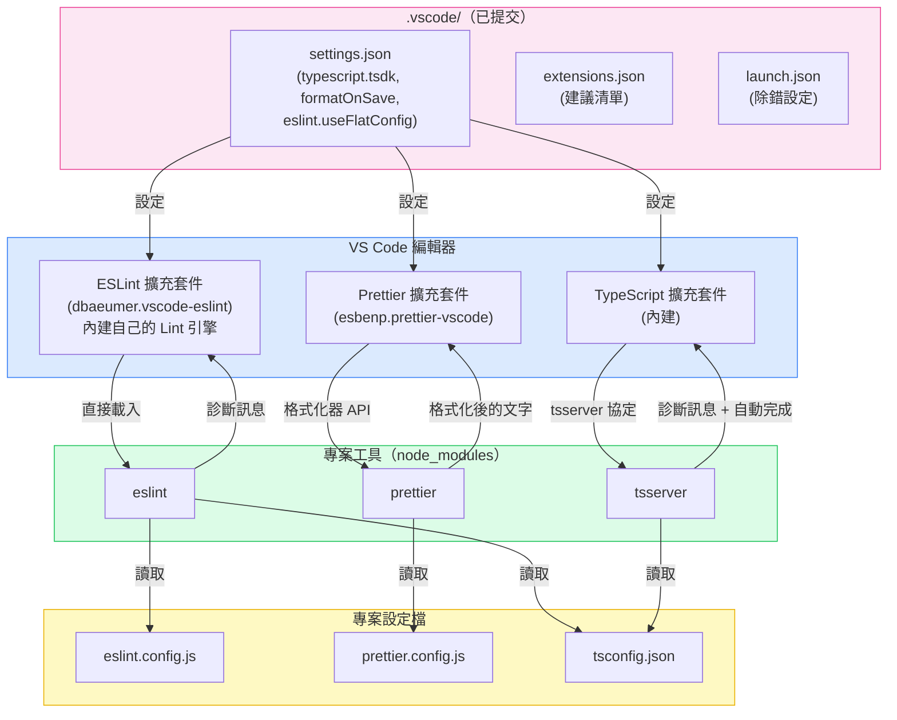

# 編輯器與 IDE 整合

:::info
當編輯器能在開發者輸入的當下就顯示型別錯誤、Lint 違規和格式問題，這些錯誤就能在進入 CI 前被攔截；一旦要等到 CI 才被攔下，代價是一次推送、一次重新執行和一次情境切換，而不只是多打一個字。沒有提交到版本庫的編輯器設定時，同一個專案的兩位開發者可能看到不同的診斷結果：一位選用了過時的全域 TypeScript 版本，另一位關閉了存檔時格式化，提交了未格式化的程式碼。提交到 `.vscode/` 的三個檔案（`settings.json`、`extensions.json`、`launch.json`）分別修正版本、格式化器與偵錯設定，並建議能讓這些修正生效的擴充套件，讓每位 VS Code 使用者看到相同的信號。TypeScript、ESLint、Prettier 各自透過不同的機制連接編輯器；真正能在編輯器之間移植的，是專案本身的設定檔：`tsconfig.json`、`eslint.config.js`、`prettier.config.js`。
:::

## 背景

JavaScript 與 TypeScript 的編輯器工具過去是每個編輯器各自重新實作一套：VS Code 的 TypeScript 擴充套件、WebStorm 的 TypeScript 服務，以及各式各樣的 Vim 外掛各自獨立解析語言，行為也逐漸分歧。由 Microsoft 聯合 Red Hat 與 Codenvy 於 2016 年 6 月發表的 Language Server Protocol（LSP），為編輯器提供了診斷、自動完成與滑鼠提示資訊的共用通訊協定，此後許多語言工具陸續採用。TypeScript 是部分採用者：它的 `tsserver` 程序早於 LSP 出現，至今仍使用自己的 JSON 協定，標準 LSP 支援要到 2026 年年中的 TypeScript 7 `tsgo` 編譯器才真正到位。ESLint 沒有獨立的 LSP 伺服器，而是內建在各編輯器自己的擴充套件中執行；Prettier 則完全沒有 LSP 伺服器。本文說明哪些 `.vscode/` 設定該提交、`tsserver`、ESLint 與 Prettier 實際上如何與編輯器整合，以及 WebStorm 等其他編輯器與 VS Code 的差異之處。

## 視覺對比

### 編輯器整合架構

下圖顯示每個 VS Code 擴充套件實際上如何連接到專案程式碼。TypeScript 內建擴充套件透過 TypeScript 自己的協定與 `tsserver` 溝通，ESLint 擴充套件載入專案的 `eslint` 套件並在自身程序內執行，Prettier 擴充套件則直接呼叫 Prettier 的格式化器 API。只有專案設定檔會與其他編輯器共用。



Neovim 與 Zed 透過社群包裝套件 `typescript-language-server` 或 `vtsls` 連接到同一個 `tsserver` 程序，這些包裝套件負責把 LSP 呼叫轉譯成 TypeScript 自己的協定；兩者都不是把 `tsserver` 當作原生 LSP 伺服器來執行。WebStorm 則兩者都不用：它有自己的 TypeScript 服務，並且和 VS Code 擴充套件一樣直接呼叫 `eslint` 套件。這張圖裡所有編輯器真正共用的只有右下角的方塊：專案設定檔。

## 範例

### 三個已提交的 .vscode 設定檔

以下三個檔案構成了一個使用 ESLint flat config、Prettier、Vitest 和 Next.js 的 TypeScript 專案的完整已提交編輯器設定。

**`.vscode/settings.json`**

```json
{
  // TypeScript：使用專案 TypeScript，而非 VS Code 內建版本
  "typescript.tsdk": "node_modules/typescript/lib",
  "typescript.enablePromptUseWorkspaceTsdk": true,

  // 格式化：所有檔案類型存檔時使用 Prettier
  "editor.formatOnSave": true,
  "editor.defaultFormatter": "esbenp.prettier-vscode",
  "[typescript]": {
    "editor.defaultFormatter": "esbenp.prettier-vscode"
  },
  "[typescriptreact]": {
    "editor.defaultFormatter": "esbenp.prettier-vscode"
  },
  "[javascript]": {
    "editor.defaultFormatter": "esbenp.prettier-vscode"
  },
  "[javascriptreact]": {
    "editor.defaultFormatter": "esbenp.prettier-vscode"
  },
  "[json]": {
    "editor.defaultFormatter": "esbenp.prettier-vscode"
  },

  // ESLint：鎖定 flat config 支援並在存檔時執行自動修復
  "eslint.useFlatConfig": true,
  "eslint.validate": [
    "javascript",
    "javascriptreact",
    "typescript",
    "typescriptreact"
  ],
  "editor.codeActionsOnSave": {
    "source.fixAll.eslint": "explicit"
  },

  // 換行符號：所有平台使用 LF 以防止差異噪音
  "files.eol": "\n",

  // 搜尋：從工作區搜尋中排除建置產物
  "search.exclude": {
    "**/node_modules": true,
    "**/.next": true,
    "**/dist": true,
    "**/.turbo": true
  }
}
```

**`.vscode/extensions.json`**

```json
{
  "recommendations": [
    "dbaeumer.vscode-eslint",
    "esbenp.prettier-vscode",
    "eamodio.gitlens",
    "usernamehw.errorlens",
    "streetsidesoftware.code-spell-checker"
  ]
}
```

**`.vscode/launch.json`**

```json
{
  "version": "0.2.0",
  "configurations": [
    {
      "name": "除錯 Vitest 測試",
      "type": "node",
      "request": "launch",
      "runtimeExecutable": "pnpm",
      "runtimeArgs": ["exec", "vitest", "--run", "--reporter=verbose", "--pool=forks"],
      "console": "integratedTerminal",
      "internalConsoleOptions": "neverOpen",
      "skipFiles": ["<node_internals>/**"]
    },
    {
      "name": "除錯 Vitest：當前檔案",
      "type": "node",
      "request": "launch",
      "runtimeExecutable": "pnpm",
      "runtimeArgs": [
        "exec",
        "vitest",
        "--run",
        "--reporter=verbose",
        "--pool=forks",
        "${relativeFile}"
      ],
      "console": "integratedTerminal",
      "internalConsoleOptions": "neverOpen",
      "skipFiles": ["<node_internals>/**"]
    },
    {
      "name": "除錯 Next.js 伺服器",
      "type": "node",
      "request": "launch",
      "runtimeExecutable": "pnpm",
      "runtimeArgs": ["next", "dev"],
      "env": {
        "NODE_OPTIONS": "--inspect"
      },
      "console": "integratedTerminal",
      "internalConsoleOptions": "neverOpen",
      "skipFiles": ["<node_internals>/**"]
    }
  ]
}
```

> 此設定僅涵蓋伺服器端 Node.js 的偵錯（API 路由、Server Actions、middleware）。若需對客戶端瀏覽器程式碼偵錯，請另行新增以 `pwa-chrome` 類型為目標的 `launch` 或 `attach` 設定。

### 每個設定的作用

`typescript.tsdk` 與 `typescript.enablePromptUseWorkspaceTsdk` 結合，確保每位開發者使用與 CI 相同的 TypeScript 版本。第一次打開時，VS Code 顯示：「這個工作區包含 TypeScript 版本。您要使用工作區的 TypeScript 版本嗎？」選擇「使用工作區版本」啟動專案 TypeScript。

`eslint.useFlatConfig` 會明確將 ESLint 擴充套件鎖定在 flat config 模式。自 vscode-eslint v3.0.10 起，擴充套件已能自動偵測 flat config；由於 flat config 是 ESLint v9 之後的預設格式，對任何使用 ESLint v9 以上版本的專案，這個設定現在預設就是 `true`。到了 2026 年，明確設定它已屬可選，主要仍適用於固定在 ESLint 8.57–8.x 版本的專案。這類專案的預設值仍是 `false`，擴充套件會退回尋找 `.eslintrc.*` 檔案。

`codeActionsOnSave` 中的 `"source.fixAll.eslint": "explicit"` 在每次手動存檔時應用 ESLint 自動修復。可修復的規則包括 import 排序（如果已配置）、未使用 import 的移除（使用 `eslint-plugin-unused-imports` 外掛）以及許多可修復的 `@typescript-eslint` 規則。不可修復的違規仍然顯示為診斷波浪線。

launch 設定使用 `runtimeExecutable: "pnpm"`。使用 npm 或 Yarn 的專案應將其改為 `"npm"` 或 `"npx"`。`skipFiles: ["<node_internals>/**"]` 可防止偵錯器進入 Node.js 內部程式碼，讓逐步執行的體驗聚焦在應用程式碼上。

## 最佳實踐

**必須（MUST）在 `.vscode/settings.json` 中將 `typescript.tsdk` 設為 `node_modules/typescript/lib` 並提交此檔案。** VS Code 內建的 TypeScript 通常落後於專案 `devDependencies` 中聲明的版本，導致診斷不一致，使編輯器不顯示專案 TypeScript 版本引入的錯誤。在 `typescript.tsdk` 旁邊設定 `typescript.enablePromptUseWorkspaceTsdk: true`，使 VS Code 在首次打開時提示開發者啟用工作區 TypeScript，確保在無需任何手動設定步驟的情況下使用已提交的版本。啟用 TypeScript 7 原生 `tsgo` 編譯器的專案需要另外開啟它：在正式發布（GA）之前是透過實驗性的 `typescript.experimental.useTsgo` 選項；自 TypeScript 7.0 GA 版本起，VS Code 對 TypeScript 7 的支援改為以獨立擴充套件形式提供，安裝後即成為預設體驗，並可透過命令選擇區的指令啟用或停用。對於任何仍退回使用傳統 `tsserver` 的工具或編輯器，`typescript.tsdk` 依然重要。

**必須（MUST）在 `.vscode/settings.json` 中配置 `editor.formatOnSave: true`、指向 Prettier 的 `editor.defaultFormatter`，以及帶有 `"source.fixAll.eslint": "explicit"` 的 `editor.codeActionsOnSave`。** TypeScript 和 TypeScript React 的每種語言覆寫必須（MUST）作為安全閥包含，以覆蓋任何衝突的全域使用者設定。ESLint 程式碼操作的 `"explicit"` 值必須（MUST）使用，而非 `true`，以便 ESLint 自動修復只在手動存檔時執行，而不在每次自動存檔事件時執行。

**必須（MUST）提交帶有精簡、精心策劃的建議擴充套件清單的 `.vscode/extensions.json` 檔案。** TypeScript 專案的最低配置包括 ESLint 擴充套件、Prettier 格式化器擴充套件、用於 blame 和歷史的 GitLens，以及用於內聯錯誤顯示的 Error Lens。團隊必須（MUST）保持此清單精簡，因為每個新增的建議對每位開發者都是一次安裝提示；實驗性的或特定於團隊的擴充套件應該（SHOULD）放在 `unwantedRecommendations` 中。

**應該（SHOULD）提交帶有為專案測試執行器和伺服器準備好使用的除錯設定的 `.vscode/launch.json`。** 可用的除錯設定是一個力量倍增器：開發者可以立即逐步執行失敗的測試或附接到執行中的伺服器程序，無需任何設定研究。對於 Vitest 專案，設定應該（SHOULD）包括完整測試套件啟動器和使用 `--pool=forks` 的當前檔案啟動器，在單一程序中執行測試，VS Code 的 Node.js 偵錯器可以可靠地附接，中斷點能正確解析。

**應該（SHOULD）為混合編輯器環境的團隊記錄等效的 WebStorm 設定。** WebStorm 從專案設定檔自動偵測 ESLint、Prettier 和 TypeScript，不需要工作區設定檔；開發者應該（SHOULD）將 ESLint 設為「自動 ESLint 設定」、Prettier 設為啟用存檔時執行的「自動 Prettier 設定」，以及 TypeScript 服務設為「來自 node_modules 的 TypeScript」。底層的 `tsconfig.json`、`eslint.config.js` 和 `prettier.config.js` 作為兩個編輯器的共同事實來源。

## 設計思維

### LSP：哪些已標準化，哪些尚未

在 LSP 出現之前，每個編輯器都得自行重新實作語言支援：VS Code 的 TypeScript 擴充套件是 VS Code 自己的產物，WebStorm 的 TypeScript 整合則是 JetBrains 另外做的一套，兩者的行為逐漸分歧。Microsoft、Red Hat 與 Codenvy 於 2016 年 6 月發表 LSP 來解決這個問題，為編輯器與語言工具提供了處理診斷、自動完成與滑鼠提示資訊的共通 JSON-RPC 協定。支援 LSP 的編輯器可以直接接上任何 LSP 伺服器，不需要針對特定編輯器另外撰寫接合程式碼。

截至 2026 年，TypeScript、ESLint 與 Prettier 三者在這個標準上各自落在不同的位置。

TypeScript 自己的伺服器 `tsserver` 早於 LSP 出現，至今仍使用 TypeScript 原本那套、LSP 出現之前的 JSON 協定。VS Code 內建的 TypeScript 擴充套件直接橋接到這個協定，並不是 LSP 客戶端。其他編輯器透過社群包裝套件 `typescript-language-server` 或 `vtsls` 連接到 `tsserver`，由它們把 LSP 請求轉譯成 `tsserver` 的協定。2026 年 7 月 8 日正式發布（GA）的 TypeScript 7 原生 `tsgo` 編譯器改變了這個局面：它的編輯器模式建立在標準 LSP 之上，因此採用它的編輯器拿到的是真正的 LSP 伺服器，而不是經過橋接的版本。

ESLint 沒有廣泛使用的獨立官方 LSP 伺服器。VS Code 的 ESLint 擴充套件在內部封裝了自己的 Lint 執行伺服器，並從 `node_modules` 載入專案的 `eslint` 套件；它並未對外提供獨立的 `eslint-language-server` 執行檔讓其他編輯器共用。市面上有社群製作的 ESLint LSP 包裝套件，但沒有任何單一官方套件扮演 `tsserver` 之於 TypeScript 的那種角色。

Prettier 沒有 LSP 伺服器。VS Code 的 Prettier 擴充套件直接呼叫 Prettier 的格式化器 API，就像建置腳本呼叫它的方式一樣；其他編輯器的 Prettier 整合也採用相同做法。

在 ESLint 與 Prettier 這種模式之外，還出現了另一種整合方式。以 Rust 打造的工具，像是 Biome 和 oxc 的 `oxlint`，直接內建自己的 LSP 伺服器（`biome lsp-proxy` 與 `oxlint --lsp`），編輯器擴充套件從一開始就是輕量的 LSP 客戶端。這種單一執行檔的模式繞開了上述的分裂局面：同一個程序同時處理 Lint 與格式化，並原生支援 LSP，代價是外掛生態系統目前還比不上 ESLint。

不論某個工具使用上述哪一種機制，真正可以跨編輯器移植的，是專案本身的設定檔：`tsconfig.json`、`eslint.config.js`、`prettier.config.js`。以上所有整合方式，不論是否基於 LSP，都會讀取這些檔案，並使用 `node_modules` 中專案自行安裝的工具版本。將 `typescript.tsdk` 設為 `node_modules/typescript/lib` 之所以有效，是因為它把客戶端指向那個已安裝的版本，與 `tsserver` 是否支援 LSP 無關。

### 哪些設定屬於版本庫，哪些屬於全域使用者設定

專案設定與個人設定之間的界線遵循一個原則：會影響程式碼輸出的設定屬於專案，會影響開發者個人使用體驗的設定則屬於使用者設定。

屬於 `.vscode/settings.json`（提交）的設定：
- `editor.formatOnSave`：是否在存檔時格式化，決定了提交的程式碼是否已格式化。
- `editor.defaultFormatter`：使用哪個格式化器，決定了提交的格式化結果是否與 CI 一致。
- `editor.codeActionsOnSave`：存檔時套用哪些 ESLint 修復，決定了 Lint 違規是否會出現在提交中。
- `typescript.tsdk`：型別檢查使用哪個 TypeScript 版本，決定了編輯器診斷是否與 CI 一致。
- `eslint.useFlatConfig`：將 ESLint 擴充套件鎖定在 flat config 模式。對 ESLint v9 以上的專案是可選的，因為擴充套件已預設為 `true`，但提交它仍有助於跨擴充套件版本的可重現性。
- `files.eol`：換行符號正規化可避免跨平台的差異雜訊。

屬於個人使用者設定（不提交）的設定：
- `editor.fontSize`、`editor.fontFamily`、`editor.lineHeight`：個人偏好，不影響程式碼。
- `editor.colorTheme`、`workbench.colorTheme`：個人偏好。
- `editor.minimap.enabled`：個人偏好。

有疑問時：問問自己，不同的設定值是否會導致 CI 失敗或程式碼審查意見。如果是，就屬於版本庫。

### VS Code 工作區信任與擴充套件啟動

VS Code 在 2021 年引入的工作區信任模型，防止擴充套件在不受信任的工作區中自動執行。當開發者第一次複製版本庫時，VS Code 會提示他們在 ESLint 和 Prettier 等擴充套件啟動之前信任工作區。

這是一個安全邊界：惡意版本庫可能包含透過自訂外掛執行任意程式碼的 `.eslintrc`。工作區信任將此限制在邊界內。實際後果：如果開發者在受限模式下打開專案或拒絕信任提示，ESLint 和 Prettier 將不會在編輯器中執行，存檔時格式化將靜默地什麼都不做。

團隊應該在入職培訓中記錄這件事：複製後，先信任工作區。信任提示每個工作區路徑只會出現一次。對於 monorepo，信任套用在根目錄。巢狀的套件會繼承根目錄的信任狀態。

這也是 `.vscode/extensions.json` 超越便利性的重要原因：它為開發者提供了專案期望哪些擴充套件的明確信號，清楚說明哪些應該被啟動。

### WebStorm 與其他編輯器：共用設定，各自整合

WebStorm 以及其他搭載 TypeScript 外掛的 JetBrains IDE 並不執行 `tsserver`，也沒有與 VS Code 共用 ESLint 伺服器。WebStorm 使用自己的 TypeScript 服務，並直接從專案的 `node_modules` 呼叫 `eslint` 套件，這正是命令列與 VS Code 擴充套件所使用的同一個套件；整個過程不經過 vscode-eslint 內建的伺服器，也不經過任何 LSP 層。WebStorm 與 VS Code 真正共用的是設定：`tsconfig.json` 驅動 TypeScript，`eslint.config.js` 驅動 ESLint，`prettier.config.js` 驅動 Prettier。沒有 JetBrains 專屬的設定檔需要提交。

差異在於 UI 介面與預設行為。WebStorm 偵測到相關設定檔後會自動啟用 ESLint 與 Prettier；不需要設定對應 `eslint.useFlatConfig` 的選項，因為 WebStorm 無論格式為何都會直接讀取 `eslint.config.js`。WebStorm 中的存檔時格式化在「設定 > 語言與框架 > JavaScript > Prettier」（針對 Prettier）以及「重新格式化程式碼」操作中設定。`.vscode/` 資料夾會被 JetBrains IDE 忽略。

Neovim 與 Zed 走的是第三條路：兩者都沒有內建 TypeScript 或 ESLint 整合，因此都仰賴外部 LSP 伺服器：TypeScript 通常使用 `typescript-language-server` 或 `vtsls`，ESLint 則使用社群製作的 ESLint LSP 包裝套件。VS Code、WebStorm、Neovim 與 Zed 都會讀取相同的 `tsconfig.json`、`eslint.config.js` 與 `prettier.config.js`，但沒有任何一個是靠執行同一個伺服器程序來做到這件事。

對於部分開發者使用 VS Code、部分使用 WebStorm 的團隊，提交設定的策略是：為 VS Code 使用者提交 `.vscode/`，JetBrains 使用者則仰賴 WebStorm 的自動偵測。底層的專案設定仍是兩者共同的事實來源。`.vscode/` 設定用來配置 VS Code 擴充套件的行為；它們不需要對應的 JetBrains 版本，因為 WebStorm 會自行讀取相同的專案設定檔。

## 常見錯誤

### format-on-save 全域啟用卻被本機覆寫

某位開發者在自己的全域使用者設定中有 `"editor.formatOnSave": true`，卻在個人的工作區覆寫設定中寫了 `"editor.defaultFormatter": "esbenp.vscode-eslint"`（一個不存在或錯誤的格式化器 ID）。結果 TypeScript 檔案的格式化會靜默失效，什麼都不會發生。

版本庫提交的 `.vscode/settings.json` 在工作區層級的設定上優先於使用者設定。但使用者設定中的語言專屬設定（例如 `"[typescript]": { "editor.defaultFormatter": "..." }`）仍然可以覆蓋工作區層級的一般設定。要避免這個問題，請在 `.vscode/settings.json` 中提交明確的語言專屬格式化器覆寫，如上方「範例」章節所示。

## 延伸閱讀

- [FEE-1600：開發者體驗與工具概覽](./1600.md) — 分類背景：編輯器整合是 DX 生命週期中的即時回饋層
- [FEE-1601：程式碼檢查與靜態分析](./1601.md) — ESLint 擴充套件是編輯器內 Lint 診斷的後端；`eslint.useFlatConfig` 在較舊版本的擴充套件上將它鎖定為 flat config
- [FEE-1602：程式碼格式化與 EditorConfig](./1602.md) — Prettier 是 `editor.formatOnSave` 背後的格式化器；EditorConfig 設定 VS Code 和 WebStorm 都讀取的基礎空白規則
- [FEE-1605：TypeScript 設定](./1605.md) — `typescript.tsdk` 確保編輯器使用與 CI 相同的 `tsconfig.json` 和 TypeScript 版本

## 參考資料

- Codenvy, Microsoft, and Red Hat, "Red Hat, Codenvy and Microsoft Collaborate on Language Server Protocol," GlobeNewswire (2016). https://www.globenewswire.com/news-release/2016/06/27/1202314/0/en/Red-Hat-Codenvy-and-Microsoft-Collaborate-on-Language-Server-Protocol.html
- Microsoft, "Language Server Protocol Specification," microsoft.github.io. https://microsoft.github.io/language-server-protocol/
- Microsoft/TypeScript maintainers, "Standalone Server (tsserver)," GitHub Wiki. https://github.com/microsoft/TypeScript/wiki/Standalone-Server-(tsserver)
- TypeScript team, "Announcing TypeScript 7.0," Microsoft DevBlogs (2026). https://devblogs.microsoft.com/typescript/announcing-typescript-7-0/
- typescript-language-server maintainers, "typescript-language-server," npm. https://www.npmjs.com/package/typescript-language-server
- Microsoft, "vscode-eslint," GitHub. https://github.com/microsoft/vscode-eslint
- JetBrains, "ESLint," WebStorm Documentation, jetbrains.com. https://www.jetbrains.com/help/webstorm/eslint.html
- oxc-project, "Editor Setup," oxc.rs. https://oxc.rs/docs/guide/usage/linter/editors
- Biome maintainers, "Biome Language Server," biomejs.dev. https://biomejs.dev/editors/introduction/
- Microsoft, "Workspace Trust," Visual Studio Code Docs. https://code.visualstudio.com/docs/editor/workspace-trust
- Microsoft, "Workspace Recommended Extensions (extensions.json)," Visual Studio Code Docs. https://code.visualstudio.com/docs/editor/extension-marketplace#_workspace-recommended-extensions
- Microsoft, "launch.json Reference," Visual Studio Code Docs. https://code.visualstudio.com/docs/editor/debugging#_launch-configurations
- Microsoft, "User and Workspace Settings," Visual Studio Code Docs. https://code.visualstudio.com/docs/getstarted/settings
