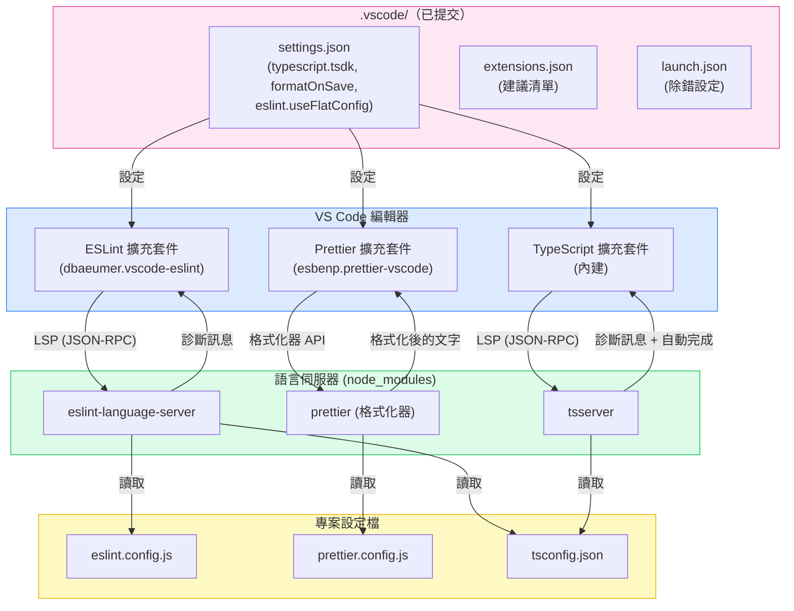

# 編輯器與 IDE 整合

能在開發者輸入時即時顯示型別錯誤、Lint 違規和格式問題的編輯器，消除了整個回饋迴圈延遲的類別。開發者在編寫程式碼時就能看到問題，而不是等到 CI 失敗才發現。這不是便利性的問題——而是錯誤被捕獲的時機和修復成本的結構性轉變。

挑戰在於一致性。沒有提交到版本庫的設定，同一個專案的兩位開發者可能看到完全不同的診斷訊息：一位的 `typescript.tsdk` 指向全局安裝的 TypeScript 4.9，而專案運行的是 5.4；另一位關閉了存檔時格式化，導致他的提交觸發 Prettier 失敗。編輯器成為不可靠的信號，開發者因此停止信任它。

現代編輯器整合有一個有原則的架構。每個主要的語言工具——TypeScript、ESLint、Prettier——現在都通過 LSP 暴露其功能。每個工具的 VS Code 擴充套件是一個薄薄的 LSP 客戶端；實際的智能運行在從專案自身 `node_modules` 啟動的語言伺服器進程中。這個架構意味著編輯器整合不是 VS Code 特有的問題——相同的語言伺服器也驅動 JetBrains IDEs、Neovim、Zed 以及任何其他支援 LSP 的編輯器。提交到版本庫的設定在所有編輯器中都有效。

## 設計思維

### LSP：為何編輯器整合現在可以跨平台移植

在 LSP 出現之前，每個編輯器都必須自己實作 TypeScript 解析器、ESLint 執行器和 Prettier 格式化器。VS Code 的 TypeScript 整合是 VS Code 的產物；WebStorm 的 TypeScript 整合是 JetBrains 的產物。它們的行為產生分歧，維護成本高昂。

Microsoft 在 2016 年引入的 LSP 顛覆了這個模型。語言伺服器是一個說 JSON-RPC 協定的獨立進程。編輯器是說同一協定的客戶端。TypeScript 提供了 `tsserver`，這是一個 LSP 伺服器。VS Code ESLint 擴充套件在背景程序中執行 ESLint 分析，實際上扮演語言伺服器的角色，即使舊版本並不提供獨立的 `eslint-language-server` 執行檔。`@eslint/language-server` 套件在 ESLint 2024+ 的發展藍圖中將其正式化為標準 LSP 伺服器。Prettier 整合通過語言伺服器適配器以類似方式工作。

這對專案設定有重大影響：語言伺服器讀取專案自己的設定檔——`tsconfig.json`、`eslint.config.js`、`prettier.config.js`——並使用來自 `node_modules` 的專案自身安裝版本。編輯器擴充套件不包含智能；它包含的是客戶端。這就是為什麼 `typescript.tsdk` 很重要：它告訴 TypeScript LSP 客戶端在哪裡找到語言伺服器二進位檔案。將其指向 `node_modules/typescript/lib`，編輯器就使用與建置相同的 TypeScript。

可移植性的含義：當開發者從 VS Code 切換到 Zed 或 WebStorm 時，他們帶著相同的語言伺服器和相同的專案設定。診斷訊息是一致的。提交的設定不需要為每個編輯器複製——LSP 層將其抽象化了。

### 哪些設定屬於版本庫，哪些屬於全局用戶設定

專案設定和個人設定之間的界限並非任意——它遵循一個清晰的原則：影響程式碼輸出的設定屬於專案；影響開發者個人體驗的設定屬於用戶設定。

屬於 `.vscode/settings.json`（提交）的設定：
- `editor.formatOnSave` — 是否在存檔時格式化決定了提交的程式碼是否被格式化
- `editor.defaultFormatter` — 使用哪個格式化器決定了提交的格式化是否與 CI 匹配
- `editor.codeActionsOnSave` — 存檔時應用哪些 ESLint 修復決定了 Lint 違規是否出現在提交中
- `typescript.tsdk` — 使用哪個 TypeScript 版本進行型別檢查決定了編輯器診斷是否與 CI 匹配
- `eslint.useFlatConfig` — ESLint 擴充套件是否使用 flat config 決定了它是否找到 `eslint.config.js`
- `files.eol` — 換行符號正規化防止跨平台的差異噪音

屬於個人用戶設定（不提交）的設定：
- `editor.fontSize`、`editor.fontFamily`、`editor.lineHeight` — 個人偏好，不影響程式碼
- `editor.colorTheme`、`workbench.colorTheme` — 個人偏好
- `editor.minimap.enabled` — 個人偏好

有疑問時：問問自己，不同的設定值是否會導致 CI 失敗或程式碼審查意見。如果是，就屬於版本庫。

### VS Code 工作區信任與擴充套件啟動

VS Code 在 2021 年引入的工作區信任模型，防止擴充套件在不信任的工作區中自動運行。當開發者第一次複製版本庫時，VS Code 會提示他們在 ESLint 和 Prettier 等擴充套件啟動之前信任工作區。

這是一個安全邊界：惡意版本庫可能包含通過自定義外掛運行任意程式碼的 `.eslintrc`。工作區信任將此限制在邊界內。實際後果：如果開發者在受限模式下打開專案或拒絕信任提示，ESLint 和 Prettier 將不會在編輯器中運行，存檔時格式化將靜默地什麼都不做。

團隊應該在入職培訓中記錄此事：複製後，信任工作區。信任提示每個工作區路徑只出現一次。對於 monorepo，信任應用於根目錄——嵌套的套件繼承根目錄的信任狀態。

這也是 `.vscode/extensions.json` 超越便利性的重要原因：它為開發者提供了專案期望哪些擴充套件的明確信號，清楚說明哪些應該被啟動。

### JetBrains 與 WebStorm：相同的 LSP 層，不同的 UI 介面

WebStorm（以及搭載 TypeScript 外掛的更廣泛 JetBrains IDEs）使用相同的 `tsserver` 和 `eslint-language-server` 進程。設定檔是相同的：`tsconfig.json` 驅動 TypeScript，`eslint.config.js` 驅動 ESLint，`prettier.config.js` 驅動 Prettier。沒有 JetBrains 特定的設定需要提交。

差異在於 UI 介面和預設行為。WebStorm 在偵測到相關設定檔時自動啟用 ESLint 和 Prettier 整合——不需要在 IDE 設定檔中設定 `eslint.useFlatConfig`，因為 WebStorm 直接讀取 `eslint.config.js`。WebStorm 中的存檔時格式化在「設定 > 語言與框架 > JavaScript > Prettier」中配置（用於 Prettier）和「重新格式化程式碼」操作。`.vscode/` 資料夾被 JetBrains IDEs 忽略。

對於部分開發者使用 VS Code、部分使用 WebStorm 的團隊，提交設定的策略是：為 VS Code 用戶提交 `.vscode/`；依賴 WebStorm 的自動偵測服務 JetBrains 用戶。底層的專案設定——`tsconfig.json`、`eslint.config.js`、`prettier.config.js`——是兩個編輯器的共同事實來源。`.vscode/` 設定不會被複製成 JetBrains 特定的格式；它們是疊加在兩個編輯器都讀取的專案設定之上的 VS Code 特定便利層。

## 最佳實踐

**必須（MUST）在 `.vscode/settings.json` 中將 `typescript.tsdk` 設為 `node_modules/typescript/lib` 並提交此檔案。** VS Code 內建的 TypeScript 通常落後於專案 `devDependencies` 中聲明的版本，導致診斷不一致，使編輯器不顯示專案 TypeScript 版本引入的錯誤。在 `typescript.tsdk` 旁邊設定 `typescript.enablePromptUseWorkspaceTsdk: true`，使 VS Code 在首次打開時提示開發者啟用工作區 TypeScript，確保在無需任何手動設定步驟的情況下使用已提交的版本。

**必須（MUST）在 `.vscode/settings.json` 中配置 `editor.formatOnSave: true`、指向 Prettier 的 `editor.defaultFormatter`，以及帶有 `"source.fixAll.eslint": "explicit"` 的 `editor.codeActionsOnSave`。** TypeScript 和 TypeScript React 的每種語言覆寫必須（MUST）作為安全閥包含，以覆蓋任何衝突的全局用戶設定。ESLint 程式碼操作的 `"explicit"` 值必須（MUST）使用，而非 `true`，以便 ESLint 自動修復只在手動存檔時執行，而不在每次自動存檔事件時執行。

**必須（MUST）提交帶有精簡、精心策劃的建議擴充套件清單的 `.vscode/extensions.json` 檔案。** TypeScript 專案的最低配置包括 ESLint 語言伺服器客戶端、Prettier 格式化器擴充套件、用於 blame 和歷史的 GitLens，以及用於內聯錯誤顯示的 Error Lens。團隊必須（MUST）保持此清單精簡，因為每個新增的建議對每位開發者都是一次安裝提示；實驗性的或特定於團隊的擴充套件應該（SHOULD）放在 `unwantedRecommendations` 中。

**應該（SHOULD）提交帶有為專案測試執行器和伺服器準備好使用的除錯設定的 `.vscode/launch.json`。** 可用的除錯設定是一個力量倍增器：開發者可以立即逐步執行失敗的測試或附接到運行中的伺服器進程，無需任何設定研究。對於 Vitest 專案，設定應該（SHOULD）包括完整測試套件啟動器和使用 `--pool=forks` 的當前檔案啟動器，在單一程序中執行測試，VS Code 的 Node.js 偵錯器可以可靠地附接，中斷點能正確解析。

**應該（SHOULD）為混合編輯器環境的團隊記錄等效的 WebStorm 設定。** WebStorm 從專案設定檔自動偵測 ESLint、Prettier 和 TypeScript，不需要工作區設定檔；開發者應該（SHOULD）將 ESLint 設為「自動 ESLint 設定」、Prettier 設為啟用存檔時執行的「自動 Prettier 設定」，以及 TypeScript 服務設為「來自 node_modules 的 TypeScript」。底層的 `tsconfig.json`、`eslint.config.js` 和 `prettier.config.js` 作為兩個編輯器的共同事實來源。

## 視覺呈現

### 編輯器整合架構

以下圖表顯示 VS Code 編輯器外掛如何與語言伺服器通訊，語言伺服器讀取專案設定檔並返回診斷訊息。



## 範例

### 三個已提交的 .vscode 設定檔

以下三個檔案構成了一個使用 ESLint flat config、Prettier、Vitest 和 Next.js 的 TypeScript 專案的完整已提交編輯器設定。

**`.vscode/settings.json`**

```json
{
  // TypeScript：使用專案 TypeScript，而非 VS Code 內建版本
  "typescript.tsdk": "node_modules/typescript/lib",
  "typescript.enablePromptUseWorkspaceTsdk": true,

  // 格式化：所有檔案類型存檔時使用 Prettier
  "editor.formatOnSave": true,
  "editor.defaultFormatter": "esbenp.prettier-vscode",
  "[typescript]": {
    "editor.defaultFormatter": "esbenp.prettier-vscode"
  },
  "[typescriptreact]": {
    "editor.defaultFormatter": "esbenp.prettier-vscode"
  },
  "[javascript]": {
    "editor.defaultFormatter": "esbenp.prettier-vscode"
  },
  "[javascriptreact]": {
    "editor.defaultFormatter": "esbenp.prettier-vscode"
  },
  "[json]": {
    "editor.defaultFormatter": "esbenp.prettier-vscode"
  },

  // ESLint：啟用 flat config 支援並在存檔時運行自動修復
  "eslint.useFlatConfig": true,
  "eslint.validate": [
    "javascript",
    "javascriptreact",
    "typescript",
    "typescriptreact"
  ],
  "editor.codeActionsOnSave": {
    "source.fixAll.eslint": "explicit"
  },

  // 換行符號：所有平台使用 LF 以防止差異噪音
  "files.eol": "\n",

  // 搜尋：從工作區搜尋中排除建置產物
  "search.exclude": {
    "**/node_modules": true,
    "**/.next": true,
    "**/dist": true,
    "**/.turbo": true
  }
}
```

**`.vscode/extensions.json`**

```json
{
  "recommendations": [
    "dbaeumer.vscode-eslint",
    "esbenp.prettier-vscode",
    "eamodio.gitlens",
    "usernamehw.errorlens",
    "streetsidesoftware.code-spell-checker"
  ]
}
```

**`.vscode/launch.json`**

```json
{
  "version": "0.2.0",
  "configurations": [
    {
      "name": "除錯 Vitest 測試",
      "type": "node",
      "request": "launch",
      "runtimeExecutable": "pnpm",
      "runtimeArgs": ["exec", "vitest", "--run", "--reporter=verbose", "--pool=forks"],
      "console": "integratedTerminal",
      "internalConsoleOptions": "neverOpen",
      "skipFiles": ["<node_internals>/**"]
    },
    {
      "name": "除錯 Vitest：當前檔案",
      "type": "node",
      "request": "launch",
      "runtimeExecutable": "pnpm",
      "runtimeArgs": [
        "exec",
        "vitest",
        "--run",
        "--reporter=verbose",
        "--pool=forks",
        "${relativeFile}"
      ],
      "console": "integratedTerminal",
      "internalConsoleOptions": "neverOpen",
      "skipFiles": ["<node_internals>/**"]
    },
    {
      "name": "除錯 Next.js 伺服器",
      "type": "node",
      "request": "launch",
      "runtimeExecutable": "pnpm",
      "runtimeArgs": ["next", "dev"],
      "env": {
        "NODE_OPTIONS": "--inspect"
      },
      "console": "integratedTerminal",
      "internalConsoleOptions": "neverOpen",
      "skipFiles": ["<node_internals>/**"]
    }
  ]
}
```

> 此設定僅涵蓋伺服器端 Node.js 的偵錯（API 路由、Server Actions、middleware）。若需對客戶端瀏覽器程式碼偵錯，請另行新增以 `pwa-chrome` 類型為目標的 `launch` 或 `attach` 設定。

### 每個設定的作用

`typescript.tsdk` 與 `typescript.enablePromptUseWorkspaceTsdk` 結合，確保每位開發者使用與 CI 相同的 TypeScript 版本。第一次打開時，VS Code 顯示：「這個工作區包含 TypeScript 版本。您要使用工作區的 TypeScript 版本嗎？」選擇「使用工作區版本」啟動專案 TypeScript。

`eslint.useFlatConfig: true` 在專案使用 `eslint.config.js`（ESLint v9 flat config 格式）時是必須的。沒有這個旗標，ESLint 擴充套件會尋找 `.eslintrc.*` 檔案，靜默地什麼都找不到——ESLint 診斷訊息不會在編輯器中出現。有了這個旗標，擴充套件正確地讀取 `eslint.config.js`。

`codeActionsOnSave` 中的 `"source.fixAll.eslint": "explicit"` 在每次手動存檔時應用 ESLint 自動修復。可修復的規則包括 import 排序（如果已配置）、未使用 import 的移除（使用 `eslint-plugin-unused-imports` 外掛）以及許多可修復的 `@typescript-eslint` 規則。不可修復的違規仍然顯示為診斷波浪線。

launch.json 設定使用 `runtimeExecutable: "pnpm"`——根據專案的套件管理器調整為 `"npm"` 或 `"npx"`。`skipFiles: ["<node_internals>/**"]` 防止除錯器進入 Node.js 內部，讓逐步執行的體驗專注於應用程式碼。

## 常見錯誤

## 相關 FEE

- [FEE-1600：開發者體驗與工具概覽](./1600.md) — 分類背景：編輯器整合是 DX 生命週期中的即時回饋層
- [FEE-1601：程式碼檢查與靜態分析](./1601.md) — ESLint 語言伺服器是編輯器內 Lint 診斷的後端；`eslint.useFlatConfig` 將擴充套件連接到 `eslint.config.js`
- [FEE-1602：程式碼格式化與 EditorConfig](./1602.md) — Prettier 是 `editor.formatOnSave` 背後的格式化器；EditorConfig 設定 VS Code 和 WebStorm 都讀取的基礎空白規則
- [FEE-1605：TypeScript 設定](./1605.md) — `typescript.tsdk` 確保編輯器使用與 CI 相同的 `tsconfig.json` 和 TypeScript 版本

## 參考資料

- [VS Code 工作區設定文件](https://code.visualstudio.com/docs/getstarted/settings)
- [VS Code extensions.json — 工作區建議](https://code.visualstudio.com/docs/editor/extension-marketplace#_workspace-recommended-extensions)
- [ESLint VS Code 擴充套件 — flat config 支援](https://marketplace.visualstudio.com/items?itemName=dbaeumer.vscode-eslint)
- [Language Server Protocol 規範](https://microsoft.github.io/language-server-protocol/)
- [VS Code 工作區信任](https://code.visualstudio.com/docs/editor/workspace-trust)
- [VS Code 除錯 — launch.json 參考](https://code.visualstudio.com/docs/editor/debugging#_launch-configurations)
