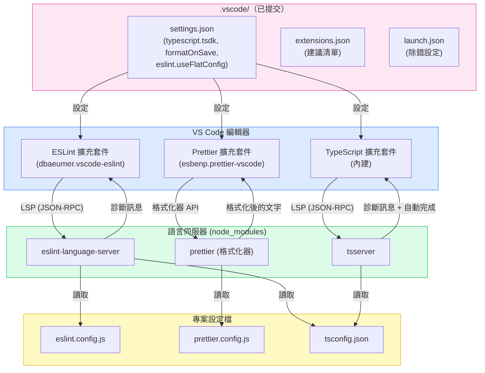

# 編輯器與 IDE 整合

能在開發者輸入時即時顯示型別錯誤、Lint 違規和格式問題的編輯器，消除了整個回饋迴圈延遲的類別。開發者在編寫程式碼時就能看到問題，而不是等到 CI 失敗才發現。這不是便利性的問題——而是錯誤被捕獲的時機和修復成本的結構性轉變。

挑戰在於一致性。沒有提交到版本庫的設定，同一個專案的兩位開發者可能看到完全不同的診斷訊息：一位的 `typescript.tsdk` 指向全局安裝的 TypeScript 4.9，而專案運行的是 5.4；另一位關閉了存檔時格式化，導致他的提交觸發 Prettier 失敗。編輯器成為不可靠的信號，開發者因此停止信任它。

現代編輯器整合有一個有原則的架構。每個主要的語言工具——TypeScript、ESLint、Prettier——現在都通過 LSP 暴露其功能。每個工具的 VS Code 擴充套件是一個薄薄的 LSP 客戶端；實際的智能運行在從專案自身 `node_modules` 啟動的語言伺服器進程中。這個架構意味著編輯器整合不是 VS Code 特有的問題——相同的語言伺服器也驅動 JetBrains IDEs、Neovim、Zed 以及任何其他支援 LSP 的編輯器。提交到版本庫的設定在所有編輯器中都有效。

## 原則

專案範圍的編輯器設定必須（MUST）提交到版本庫。影響程式碼編寫方式的設定——存檔時格式化、預設格式化器、ESLint 自動修復——定義了專案標準，不得（MUST NOT）留給個別開發者自行決定。

`.vscode/settings.json`、`.vscode/extensions.json` 和 `.vscode/launch.json` 必須（MUST）納入版本控制，並與 `tsconfig.json` 或 `.eslintrc` 同等嚴謹地對待。它們不是個人的 dotfiles——而是專案基礎設施。

`typescript.tsdk` 設定必須（MUST）指向專案本地的 TypeScript 安裝。使用 VS Code 內建的 TypeScript 進行型別檢查，而 CI 使用專案的 TypeScript，會造成版本分歧，產生不一致的診斷訊息：編輯器不顯示的錯誤會讓建置失敗，而 CI 中不存在的編輯器錯誤則會破壞開發者的信任。

存檔時格式化必須（MUST）啟用，並將專案的格式化器設為預設。使用 Prettier 的專案必須（MUST）將 `editor.defaultFormatter` 設為 `"esbenp.prettier-vscode"`，並啟用 `editor.formatOnSave`。僅依賴 pre-commit hook 意味著格式化錯誤在提交時才浮現，而不是在開發者輸入時——這是更慢的回饋迴圈，體驗更差。

ESLint 自動修復必須（MUST）通過 `editor.codeActionsOnSave` 設定，以便可修復的違規在存檔時自動解決，無需手動介入。使用 ESLint flat config 格式的專案還必須（MUST）在工作區設定中設定 `"eslint.useFlatConfig": true`；沒有這個旗標，ESLint VS Code 擴充套件就無法載入 `eslint.config.js`。

建議的擴充套件應該（SHOULD）在 `.vscode/extensions.json` 中聲明。VS Code 會向剛複製版本庫但尚未安裝這些擴充套件的開發者顯示提示。這是讓整個團隊使用一致工具鏈的最低阻力路徑。

除錯設定應該（SHOULD）提交在 `.vscode/launch.json` 中。無需從頭重新配置的可用除錯設定，為每位開發者節省數小時，並消除使用除錯器的隱形障礙。

## 設計思維

### LSP：為何編輯器整合現在可以跨平台移植

在 LSP 出現之前，每個編輯器都必須自己實作 TypeScript 解析器、ESLint 執行器和 Prettier 格式化器。VS Code 的 TypeScript 整合是 VS Code 的產物；WebStorm 的 TypeScript 整合是 JetBrains 的產物。它們的行為產生分歧，維護成本高昂。

Microsoft 在 2016 年引入的 LSP 顛覆了這個模型。語言伺服器是一個說 JSON-RPC 協定的獨立進程。編輯器是說同一協定的客戶端。TypeScript 提供了 `tsserver`，這是一個 LSP 伺服器。ESLint 提供了 `eslint-language-server`。Prettier 整合通過語言伺服器適配器以類似方式工作。

這對專案設定有重大影響：語言伺服器讀取專案自己的設定檔——`tsconfig.json`、`eslint.config.js`、`prettier.config.js`——並使用來自 `node_modules` 的專案自身安裝版本。編輯器擴充套件不包含智能；它包含的是客戶端。這就是為什麼 `typescript.tsdk` 很重要：它告訴 TypeScript LSP 客戶端在哪裡找到語言伺服器二進位檔案。將其指向 `node_modules/typescript/lib`，編輯器就使用與建置相同的 TypeScript。

可移植性的含義：當開發者從 VS Code 切換到 Zed 或 WebStorm 時，他們帶著相同的語言伺服器和相同的專案設定。診斷訊息是一致的。提交的設定不需要為每個編輯器複製——LSP 層將其抽象化了。

### 哪些設定屬於版本庫，哪些屬於全局用戶設定

專案設定和個人設定之間的界限並非任意——它遵循一個清晰的原則：影響程式碼輸出的設定屬於專案；影響開發者個人體驗的設定屬於用戶設定。

屬於 `.vscode/settings.json`（提交）的設定：
- `editor.formatOnSave` — 是否在存檔時格式化決定了提交的程式碼是否被格式化
- `editor.defaultFormatter` — 使用哪個格式化器決定了提交的格式化是否與 CI 匹配
- `editor.codeActionsOnSave` — 存檔時應用哪些 ESLint 修復決定了 Lint 違規是否出現在提交中
- `typescript.tsdk` — 使用哪個 TypeScript 版本進行型別檢查決定了編輯器診斷是否與 CI 匹配
- `eslint.useFlatConfig` — ESLint 擴充套件是否使用 flat config 決定了它是否找到 `eslint.config.js`
- `files.eol` — 換行符號正規化防止跨平台的差異噪音

屬於個人用戶設定（不提交）的設定：
- `editor.fontSize`、`editor.fontFamily`、`editor.lineHeight` — 個人偏好，不影響程式碼
- `editor.colorTheme`、`workbench.colorTheme` — 個人偏好
- `editor.keyBindings` — 個人偏好
- `editor.minimap.enabled` — 個人偏好

有疑問時：問問自己，不同的設定值是否會導致 CI 失敗或程式碼審查意見。如果是，就屬於版本庫。

### VS Code 工作區信任與擴充套件啟動

VS Code 在 2021 年引入的工作區信任模型，防止擴充套件在不信任的工作區中自動運行。當開發者第一次複製版本庫時，VS Code 會提示他們在 ESLint 和 Prettier 等擴充套件啟動之前信任工作區。

這是一個安全邊界：惡意版本庫可能包含通過自定義外掛運行任意程式碼的 `.eslintrc`。工作區信任將此限制在邊界內。實際後果：如果開發者在受限模式下打開專案或拒絕信任提示，ESLint 和 Prettier 將不會在編輯器中運行，存檔時格式化將靜默地什麼都不做。

團隊應該在入職培訓中記錄此事：複製後，信任工作區。信任提示每個工作區路徑只出現一次。對於 monorepo，信任應用於根目錄——嵌套的套件繼承根目錄的信任狀態。

這也是 `.vscode/extensions.json` 超越便利性的重要原因：它為開發者提供了專案期望哪些擴充套件的明確信號，清楚說明哪些應該被啟動。

### JetBrains 與 WebStorm：相同的 LSP 層，不同的 UI 介面

WebStorm（以及搭載 TypeScript 外掛的更廣泛 JetBrains IDEs）使用相同的 `tsserver` 和 `eslint-language-server` 進程。設定檔是相同的：`tsconfig.json` 驅動 TypeScript，`eslint.config.js` 驅動 ESLint，`prettier.config.js` 驅動 Prettier。沒有 JetBrains 特定的設定需要提交。

差異在於 UI 介面和預設行為。WebStorm 在偵測到相關設定檔時自動啟用 ESLint 和 Prettier 整合——不需要在 IDE 設定檔中設定 `eslint.useFlatConfig`，因為 WebStorm 直接讀取 `eslint.config.js`。WebStorm 中的存檔時格式化在「設定 > 語言與框架 > JavaScript > Prettier」中配置（用於 Prettier）和「重新格式化程式碼」操作。`.vscode/` 資料夾被 JetBrains IDEs 忽略。

對於部分開發者使用 VS Code、部分使用 WebStorm 的團隊，提交設定的策略是：為 VS Code 用戶提交 `.vscode/`；依賴 WebStorm 的自動偵測服務 JetBrains 用戶。底層的專案設定——`tsconfig.json`、`eslint.config.js`、`prettier.config.js`——是兩個編輯器的共同事實來源。`.vscode/` 設定不會被複製成 JetBrains 特定的格式；它們是疊加在兩個編輯器都讀取的專案設定之上的 VS Code 特定便利層。

## 最佳實踐

### typescript.tsdk：使用專案 TypeScript，而非 VS Code 內建 TypeScript

VS Code 內建了一個預設用於語言服務的 TypeScript。這個版本通常落後於專案 `devDependencies` 中聲明的版本。這種分歧導致一類診斷不一致：編輯器可能不顯示專案 TypeScript 版本引入的錯誤（或反之），開發者可能習慣了一種與 CI 不匹配的型別檢查體驗。

在 `.vscode/settings.json` 中將 `typescript.tsdk` 設為專案本地的 TypeScript：

```json
{
  "typescript.tsdk": "node_modules/typescript/lib",
  "typescript.enablePromptUseWorkspaceTsdk": true
}
```

`typescript.tsdk` 告訴 VS Code 在哪裡找到 TypeScript 語言伺服器。`typescript.enablePromptUseWorkspaceTsdk` 使 VS Code 在開發者打開專案時提示切換到工作區 TypeScript，而不是靜默地使用內建版本。

設定這些值後，開發者需要從命令面板運行「TypeScript：選擇 TypeScript 版本」命令，並選擇「使用工作區版本」。設定了 `typescript.enablePromptUseWorkspaceTsdk: true` 後，VS Code 在第一次打開時自動提示。所選版本存儲在 `.vscode/settings.json` 的 `typescript.tsdk` 下——提交這個檔案確保每個人都使用相同的版本，無需任何手動步驟。

實際影響在專案使用比 VS Code 內建版本更新的 TypeScript 時最為明顯：新的型別縮窄行為、新的 `satisfies` 操作符語法、新的 `moduleResolution: "Bundler"` 檢查——如果沒有設定 `typescript.tsdk`，這些在編輯器中可能全部靜默缺失。

### 存檔時格式化：formatOnSave、defaultFormatter 與 codeActionsOnSave

三個設定組合起來讓編輯器在每次存檔時強制執行格式化和可修復的 Lint 違規：

```json
{
  "editor.formatOnSave": true,
  "editor.defaultFormatter": "esbenp.prettier-vscode",
  "[typescript]": {
    "editor.defaultFormatter": "esbenp.prettier-vscode"
  },
  "[typescriptreact]": {
    "editor.defaultFormatter": "esbenp.prettier-vscode"
  },
  "editor.codeActionsOnSave": {
    "source.fixAll.eslint": "explicit"
  }
}
```

`editor.formatOnSave: true` 在每次存檔後觸發格式化器。`editor.defaultFormatter` 將 Prettier 設為所有檔案類型的格式化器。每種語言的覆寫（`[typescript]`、`[typescriptreact]`）是明確的安全閥——如果開發者在全局用戶設定中覆寫了 TypeScript 檔案的預設格式化器，工作區設定優先。

`editor.codeActionsOnSave` 加上 `"source.fixAll.eslint": "explicit"` 在每次存檔時運行 ESLint 的自動修復，應用可修復的規則（如果已配置：未使用的 import 移除、import 排序、簡單情況下的無障礙屬性）。`"explicit"` 值意味著該操作在手動存檔（Ctrl+S / Cmd+S）時運行，但不在自動存檔時運行——這是推薦的設定，避免在自動存檔配置中每次按鍵都運行 ESLint。

結果：在開發者運行 `git commit` 時，暫存的檔案已經被 Prettier 格式化，並已解決可修復的 ESLint 違規。pre-commit hook（如果存在）成為安全網，而不是主要的強制執行點。

### 建議擴充套件：提交 .vscode/extensions.json

`.vscode/extensions.json` 檔案聲明了 VS Code 應該向打開工作區的開發者推薦哪些擴充套件。當開發者打開專案且該檔案存在時，VS Code 顯示通知：「這個工作區有擴充套件建議。」點擊「顯示建議」會帶他們到擴充套件市場，顯示預先篩選的建議清單。

提交一個精簡、精心策劃的集合：

```json
{
  "recommendations": [
    "dbaeumer.vscode-eslint",
    "esbenp.prettier-vscode",
    "eamodio.gitlens",
    "usernamehw.errorlens",
    "streetsidesoftware.code-spell-checker"
  ]
}
```

擴充套件 ID 遵循 `publisher.extension-name` 格式，在擴充套件的市場頁面或擴充套件面板中可見。使用官方 ID——它們不區分大小寫，但規範 ID 防止歧義。

TypeScript 專案的最低配置：
- `dbaeumer.vscode-eslint` — ESLint 語言伺服器客戶端
- `esbenp.prettier-vscode` — Prettier 格式化器
- `eamodio.gitlens` — Git blame、歷史記錄和分支視覺化
- `usernamehw.errorlens`（Error Lens）— 在編輯器裝訂線中顯示內聯錯誤訊息（無需將滑鼠懸停在波浪線上即可讀取錯誤訊息）

保持清單精簡。每個新增的擴充套件對每個開發者都是一次安裝提示——噪音降低了遵從率。如果一個擴充套件是實驗性的或特定於團隊的，使用 `unwantedRecommendations` 陣列代替。

### 除錯設定：提交 .vscode/launch.json

可用的除錯設定是一個力量倍增器。需要逐步執行失敗的 Vitest 測試或連接到 Next.js 伺服器進程的開發者可以立即這樣做——不需要查閱文件。沒有可用設定的開發者訴諸 `console.log` 除錯，這更慢且在提交中留下噪音。

為專案的測試執行器和伺服器提交帶有設定的 `launch.json`：

```json
{
  "version": "0.2.0",
  "configurations": [
    {
      "name": "除錯 Vitest 測試",
      "type": "node",
      "request": "launch",
      "runtimeExecutable": "pnpm",
      "runtimeArgs": ["vitest", "--run", "--reporter=verbose"],
      "console": "integratedTerminal",
      "internalConsoleOptions": "neverOpen",
      "skipFiles": ["<node_internals>/**"]
    },
    {
      "name": "除錯 Vitest：當前檔案",
      "type": "node",
      "request": "launch",
      "runtimeExecutable": "pnpm",
      "runtimeArgs": [
        "vitest",
        "--run",
        "--reporter=verbose",
        "${relativeFile}"
      ],
      "console": "integratedTerminal",
      "internalConsoleOptions": "neverOpen",
      "skipFiles": ["<node_internals>/**"]
    },
    {
      "name": "除錯 Next.js 伺服器",
      "type": "node",
      "request": "launch",
      "runtimeExecutable": "pnpm",
      "runtimeArgs": ["next", "dev"],
      "env": {
        "NODE_OPTIONS": "--inspect"
      },
      "console": "integratedTerminal",
      "internalConsoleOptions": "neverOpen",
      "skipFiles": ["<node_internals>/**"]
    }
  ]
}
```

「除錯 Vitest：當前檔案」設定特別有用：它只運行編輯器中當前打開的測試檔案，完整支援中斷點。開發者可以在測試中放置中斷點，打開測試檔案，啟動除錯器——中斷點正確解析，因為 Vitest 在 Node.js 下運行，VS Code 的 Node.js 除錯器附加到該進程。

根據專案的套件管理器（`npm`、`yarn`、`pnpm`）和測試執行器（Jest、Vitest、Playwright）調整設定。投入是每個專案一次性的；回報是專案生命周期內每位開發者的每次除錯會話。

### JetBrains 注意事項：WebStorm 中的等效設定

WebStorm 和 JetBrains 系列從 `package.json` 和設定檔自動偵測 ESLint、Prettier 和 TypeScript——不需要工作區設定檔。等效設定在「設定」（macOS 上為「偏好設定」）中：

- **ESLint**：設定 > 語言與框架 > JavaScript > 程式碼品質工具 > ESLint。設為「自動 ESLint 設定」，WebStorm 直接讀取 `eslint.config.js`。WebStorm 2023.3+ 原生支援 flat config。
- **Prettier**：設定 > 語言與框架 > JavaScript > Prettier。設為「自動 Prettier 設定」並啟用「存檔時運行」。WebStorm 使用 `node_modules` 中的專案本地 Prettier。
- **TypeScript**：設定 > 語言與框架 > TypeScript。TypeScript 服務版本設為「來自 node_modules 的 TypeScript」——相當於 `typescript.tsdk`。WebStorm 自動讀取 `tsconfig.json`。
- **錯誤顯示**：WebStorm 預設顯示內聯錯誤標註，相當於 VS Code 中的 Error Lens。不需要額外外掛。

對於混合使用 VS Code 和 WebStorm 的團隊，提交的 `.vscode/` 設定透明地服務 VS Code 用戶。WebStorm 忽略 `.vscode/` 並使用自己的設定，但兩個編輯器都讀取相同的底層 `tsconfig.json`、`eslint.config.js` 和 `prettier.config.js`。專案層級的設定是單一事實來源；編輯器層級的設定是其上的薄薄客戶端層。

## 視覺呈現

### 編輯器整合架構

以下圖表顯示 VS Code 編輯器外掛如何與語言伺服器通訊，語言伺服器讀取專案設定檔並返回診斷訊息。



## 範例

### 三個已提交的 .vscode 設定檔

以下三個檔案構成了一個使用 ESLint flat config、Prettier、Vitest 和 Next.js 的 TypeScript 專案的完整已提交編輯器設定。

**`.vscode/settings.json`**

```json
{
  // TypeScript：使用專案 TypeScript，而非 VS Code 內建版本
  "typescript.tsdk": "node_modules/typescript/lib",
  "typescript.enablePromptUseWorkspaceTsdk": true,

  // 格式化：所有檔案類型存檔時使用 Prettier
  "editor.formatOnSave": true,
  "editor.defaultFormatter": "esbenp.prettier-vscode",
  "[typescript]": {
    "editor.defaultFormatter": "esbenp.prettier-vscode"
  },
  "[typescriptreact]": {
    "editor.defaultFormatter": "esbenp.prettier-vscode"
  },
  "[javascript]": {
    "editor.defaultFormatter": "esbenp.prettier-vscode"
  },
  "[javascriptreact]": {
    "editor.defaultFormatter": "esbenp.prettier-vscode"
  },
  "[json]": {
    "editor.defaultFormatter": "esbenp.prettier-vscode"
  },

  // ESLint：啟用 flat config 支援並在存檔時運行自動修復
  "eslint.useFlatConfig": true,
  "eslint.validate": [
    "javascript",
    "javascriptreact",
    "typescript",
    "typescriptreact"
  ],
  "editor.codeActionsOnSave": {
    "source.fixAll.eslint": "explicit"
  },

  // 換行符號：所有平台使用 LF 以防止差異噪音
  "files.eol": "\n",

  // 搜尋：從工作區搜尋中排除建置產物
  "search.exclude": {
    "**/node_modules": true,
    "**/.next": true,
    "**/dist": true,
    "**/.turbo": true
  }
}
```

**`.vscode/extensions.json`**

```json
{
  "recommendations": [
    "dbaeumer.vscode-eslint",
    "esbenp.prettier-vscode",
    "eamodio.gitlens",
    "usernamehw.errorlens",
    "streetsidesoftware.code-spell-checker"
  ]
}
```

**`.vscode/launch.json`**

```json
{
  "version": "0.2.0",
  "configurations": [
    {
      "name": "除錯 Vitest 測試",
      "type": "node",
      "request": "launch",
      "runtimeExecutable": "pnpm",
      "runtimeArgs": ["vitest", "--run", "--reporter=verbose"],
      "console": "integratedTerminal",
      "internalConsoleOptions": "neverOpen",
      "skipFiles": ["<node_internals>/**"]
    },
    {
      "name": "除錯 Vitest：當前檔案",
      "type": "node",
      "request": "launch",
      "runtimeExecutable": "pnpm",
      "runtimeArgs": [
        "vitest",
        "--run",
        "--reporter=verbose",
        "${relativeFile}"
      ],
      "console": "integratedTerminal",
      "internalConsoleOptions": "neverOpen",
      "skipFiles": ["<node_internals>/**"]
    },
    {
      "name": "除錯 Next.js 伺服器",
      "type": "node",
      "request": "launch",
      "runtimeExecutable": "pnpm",
      "runtimeArgs": ["next", "dev"],
      "env": {
        "NODE_OPTIONS": "--inspect"
      },
      "console": "integratedTerminal",
      "internalConsoleOptions": "neverOpen",
      "skipFiles": ["<node_internals>/**"]
    }
  ]
}
```

### 每個設定的作用

`typescript.tsdk` 與 `typescript.enablePromptUseWorkspaceTsdk` 結合，確保每位開發者使用與 CI 相同的 TypeScript 版本。第一次打開時，VS Code 顯示：「這個工作區包含 TypeScript 版本。您要使用工作區的 TypeScript 版本嗎？」選擇「使用工作區版本」啟動專案 TypeScript。

`eslint.useFlatConfig: true` 在專案使用 `eslint.config.js`（ESLint v9 flat config 格式）時是必須的。沒有這個旗標，ESLint 擴充套件會尋找 `.eslintrc.*` 檔案，靜默地什麼都找不到——ESLint 診斷訊息不會在編輯器中出現。有了這個旗標，擴充套件正確地讀取 `eslint.config.js`。

`codeActionsOnSave` 中的 `"source.fixAll.eslint": "explicit"` 在每次手動存檔時應用 ESLint 自動修復。可修復的規則包括 import 排序（如果已配置）、未使用 import 的移除（使用 `eslint-plugin-unused-imports` 外掛）以及許多可修復的 `@typescript-eslint` 規則。不可修復的違規仍然顯示為診斷波浪線。

launch.json 設定使用 `runtimeExecutable: "pnpm"`——根據專案的套件管理器調整為 `"npm"` 或 `"npx"`。`skipFiles: ["<node_internals>/**"]` 防止除錯器進入 Node.js 內部，讓逐步執行的體驗專注於應用程式碼。

## 常見錯誤

### flat config 專案未設定 eslint.useFlatConfig

已遷移到 ESLint flat config 格式（`eslint.config.js`，ESLint v9+）但未在工作區設定中設定 `"eslint.useFlatConfig": true` 的專案，在編輯器中看不到 ESLint 診斷。ESLint 擴充套件靜默地找不到設定檔，因為預設情況下它尋找 `.eslintrc.*`。

症狀：VS Code Output 面板中的 ESLint 輸出（檢視 > 輸出 > ESLint）顯示「找不到 ESLint 設定」或「ESLint：找不到設定檔」。修復只需一個工作區設定。

這個錯誤很常見，因為 ESLint 擴充套件的預設行為早於 flat config。開發者遷移到 ESLint v9 時更新了 `eslint.config.js`，但沒有意識到擴充套件需要明確的啟用才能讀取它。

### typescript.tsdk 未設定，導致版本分歧

一個專案在 `devDependencies` 中聲明了 `"typescript": "^5.4.0"`。VS Code 內建了 TypeScript 5.2。沒有 `typescript.tsdk`，編輯器使用 5.2 進行型別檢查，CI 使用 5.4。TypeScript 5.4 引入了 `NoInfer<T>` 的新縮窄行為和控制流分析的改進。開發者編寫在編輯器（5.2）中型別檢查通過但在 CI（5.4）中失敗的程式碼，或反之。

修復方法始終是 `"typescript.tsdk": "node_modules/typescript/lib"`。將其提交到 `.vscode/settings.json`，確保每位開發者都能獲得正確的 TypeScript 版本，無需手動設定步驟。

### .vscode/ 被加入 .gitignore

一個常見錯誤是將 `.vscode/` 加入 `.gitignore` 以避免提交個人設定（字型大小、主題）。正確的做法是有選擇性的：

```gitignore
# .gitignore — 不要忽略所有 .vscode/
# 只忽略不應分享的個人設定：
.vscode/settings.local.json

# 以下必須（MUST）提交：
# .vscode/settings.json
# .vscode/extensions.json
# .vscode/launch.json
```

如果版本庫已經在 `.gitignore` 中有 `.vscode/`，修復方法是明確地取消忽略專案層級的檔案：

```gitignore
.vscode/*
!.vscode/settings.json
!.vscode/extensions.json
!.vscode/launch.json
!.vscode/tasks.json
```

## 相關 FEE

- [FEE-1600：開發者體驗與工具概覽](./1600.md) — 分類背景：編輯器整合是 DX 生命週期中的即時回饋層
- [FEE-1601：程式碼檢查與靜態分析](./1601.md) — ESLint 語言伺服器是編輯器內 Lint 診斷的後端；`eslint.useFlatConfig` 將擴充套件連接到 `eslint.config.js`
- [FEE-1602：程式碼格式化與 EditorConfig](./1602.md) — Prettier 是 `editor.formatOnSave` 背後的格式化器；EditorConfig 設定 VS Code 和 WebStorm 都讀取的基礎空白規則
- [FEE-1605：TypeScript 設定](./1605.md) — `typescript.tsdk` 確保編輯器使用與 CI 相同的 `tsconfig.json` 和 TypeScript 版本

## 參考資料

- [VS Code 工作區設定文件](https://code.visualstudio.com/docs/getstarted/settings)
- [VS Code extensions.json — 工作區建議](https://code.visualstudio.com/docs/editor/extension-marketplace#_workspace-recommended-extensions)
- [ESLint VS Code 擴充套件 — flat config 支援](https://marketplace.visualstudio.com/items?itemName=dbaeumer.vscode-eslint)
- [Language Server Protocol 規範](https://microsoft.github.io/language-server-protocol/)
- [VS Code 工作區信任](https://code.visualstudio.com/docs/editor/workspace-trust)
- [VS Code 除錯 — launch.json 參考](https://code.visualstudio.com/docs/editor/debugging#_launch-configurations)
