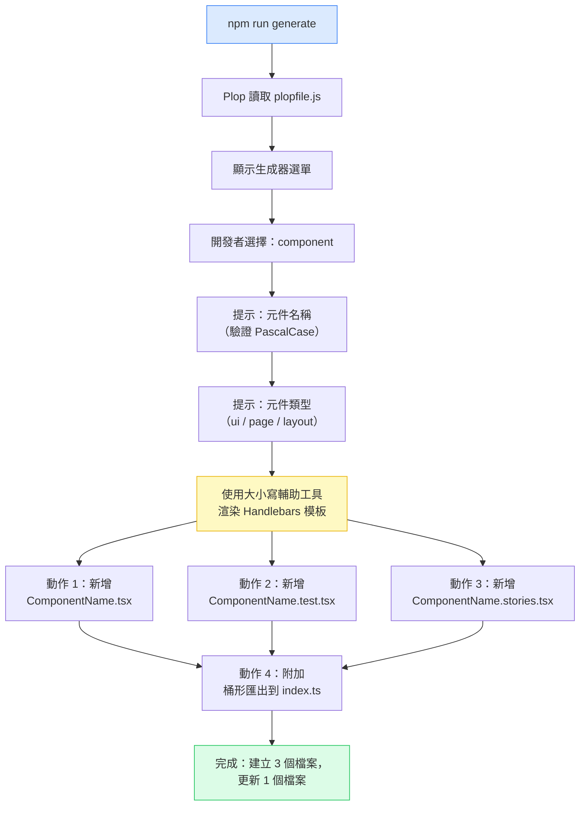

# [FEE-1607] 鷹架工具與程式碼生成

:::info
複製現有元件並重新命名，是大多數團隊建立新檔案的方式，也是過時規範擴散的方式：複製的檔案只會延續來源檔案當下的結構，而非團隊目前的標準。程式碼生成器以一份可執行的規格取代這個複製貼上的步驟，說明新檔案應該長什麼樣子，讓每個生成的檔案都符合今天的規範，而不是程式碼庫歷史中隨機抽樣出的舊結構。Plop 是目前仍積極維護的獨立工具；Hygen 曾是它的天然對手，但自 2022 年以來未再發布新版本。單體倉庫（Monorepo）建置工具現在也提供自己的生成器支援，因此適合特定專案的工具，取決於該專案是否已使用 Turborepo 或 Nx。
:::

## 背景

每當開發者透過複製現有檔案並修改名稱來建立新元件時，他們同時在做兩件事：建立新元件，以及偏離團隊目前的規範。他們複製的那個檔案可能早已過時。測試檔案結構可能在它被寫下之後已經改變，Import 排序規範也可能在那之後被更新過。檔案建立的那一刻，就是規範偏差開始的時刻，也是防止它代價最低的時刻。

程式碼生成器透過在建立時就將規範編碼化來解決這個問題。生成器是一份可執行的規格，說明特定類型的新檔案應該長什麼樣子，並以團隊目前的標準為依據。當規範改變時，生成器也隨之改變，此後建立的每個檔案都會自動繼承更新後的模式，無需依賴開發者記住更新或找到正確的檔案來複製。

Plop 和 Hygen 是前端生態系中最常被提及的兩個生成器工具，但到了 2026 年，只有其中一個仍在持續發展。Plop 以配置驅動：所有生成器定義都放在單一的 `plopfile.js` 檔案中，易於審核、查看，且能一次讀懂全貌，並且目前仍積極維護中。Hygen 以檔案驅動：生成器以獨立檔案形式存放於 `_templates/` 目錄中，在團隊需要管理大量生成器時，這種方式擴展性較好。Hygen 自 2022 年以來未再發布新版本（上一次發布到 npm 是 2022 年 9 月），Snyk 將其維護狀態評為「不活躍（Inactive）」；它自己的文件網站目前甚至無法透過 HTTPS 載入。對大多數前端團隊而言，Plop 的單一檔案模型維護起來更簡單，也更容易讓新開發者上手。

## 視覺對比

### Plop 執行流程

下圖展示從 `npm run generate` 到檔案建立與桶形匯出更新的完整執行流程。Story 檔案的動作與桶形匯出的動作，都假設專案已經有積極維護的 Storybook，以及既有的桶形匯出慣例；如果其中任一假設不成立，就跳過對應的步驟（見下方最佳實踐）。



## 範例

### 設定

將 Plop 安裝為開發依賴，並透過 `package.json` 腳本公開它：

```bash
npm i -D plop
```

```json
{
  "scripts": {
    "generate": "plop"
  }
}
```

`npm run generate`（或 `pnpm generate`）現在會執行 Plop，並讀取專案根目錄下的 `plopfile.js`。

### 完整的 Plop 設定：plopfile.js 與 Handlebars 模板

以下範例是一個完整、可執行的 Plop 設定，用於 React 元件生成器。每個元件會產出三個檔案（`.tsx`、`.test.tsx`、`.stories.tsx`），並在 `src/components/index.ts` 附加桶形匯出。如同上方的圖表，Story 檔案與桶形匯出的動作，都假設專案有積極維護的 Storybook 與既有的桶形匯出慣例。如果某個專案不符合其中一項假設，就移除對應的動作；元件檔案與測試檔案本身，就是最小可行集合。

**`plopfile.js`**（專案根目錄，ESM 格式，Plop v3+）

```js
export default function (plop) {
  plop.setGenerator('component', {
    description: '生成包含測試和 Story 檔案的 React 元件',
    prompts: [
      {
        type: 'input',
        name: 'name',
        message: '元件名稱（PascalCase）：',
        validate: (value) => {
          if (/^[A-Z][A-Za-z0-9]+$/.test(value)) return true;
          return '元件名稱必須為 PascalCase（例如：UserProfile、ButtonGroup）';
        },
      },
      {
        type: 'list',
        name: 'type',
        message: '元件類型：',
        choices: ['ui', 'page', 'layout'],
        default: 'ui',
      },
    ],
    actions: [
      {
        type: 'add',
        path: 'src/components/{{properCase name}}/{{properCase name}}.tsx',
        templateFile: 'plop-templates/component.tsx.hbs',
      },
      {
        type: 'add',
        path: 'src/components/{{properCase name}}/{{properCase name}}.test.tsx',
        templateFile: 'plop-templates/component.test.tsx.hbs',
      },
      {
        type: 'add',
        path: 'src/components/{{properCase name}}/{{properCase name}}.stories.tsx',
        templateFile: 'plop-templates/component.stories.tsx.hbs',
      },
      {
        type: 'append',
        path: 'src/components/index.ts',
        template:
          "export { {{properCase name}} } from './{{properCase name}}/{{properCase name}}';",
      },
    ],
  });
}
```

**`plop-templates/component.tsx.hbs`**

```hbs
import type { FC } from 'react';

interface {{properCase name}}Props {
  children?: React.ReactNode;
}

export const {{properCase name}}: FC<{{properCase name}}Props> = ({ children }) => {
  return (
    <div data-testid="{{kebabCase name}}">
      {children}
    </div>
  );
};
```

**`plop-templates/component.test.tsx.hbs`**

```hbs
import { render, screen } from '@testing-library/react';
import { {{properCase name}} } from './{{properCase name}}';

describe('{{properCase name}}', () => {
  it('renders without crashing', () => {
    render(<{{properCase name}} />);
    expect(screen.getByTestId('{{kebabCase name}}')).toBeInTheDocument();
  });

  it('renders children', () => {
    render(<{{properCase name}}>hello world</{{properCase name}}>);
    expect(screen.getByText('hello world')).toBeInTheDocument();
  });
});
```

**`plop-templates/component.stories.tsx.hbs`**

```hbs
import type { Meta, StoryObj } from '@storybook/react';
import { {{properCase name}} } from './{{properCase name}}';

const meta = {
  title: '{{properCase type}}/{{properCase name}}',
  component: {{properCase name}},
  tags: ['autodocs'],
} satisfies Meta<typeof {{properCase name}}>;

export default meta;
type Story = StoryObj<typeof meta>;

export const Default: Story = {
  args: {},
};
```

**執行生成器：**

```bash
npm run generate
# 或
pnpm generate
```

Plop 會提示輸入元件名稱與類型，接著寫入三個檔案並附加桶形匯出。結果是一個命名正確、結構正確的元件，第一次提交時就能通過 Lint 檢查。

### 各部分的功能說明

`plopfile.js` 中名稱提示的 `validate` 函式，會在提示階段就攔截非 PascalCase 的輸入，此時尚未寫入任何檔案。錯誤訊息中包含範例，這是向不熟悉規範的開發者傳達預期格式最快的方式。

動作 `path` 值中的 `properCase` 輔助工具，確保輸出檔案路徑使用標準的 PascalCase 名稱，不論開發者輸入了什麼；即使驗證被繞過，路徑仍然正確。模板中的 `kebabCase` 輔助工具，會以 CSS 友善的 kebab 格式產生 `data-testid` 屬性，符合專案的屬性慣例，開發者不需要手動推導。

`append` 動作以非破壞性的方式新增桶形匯出：它會附加到現有的 `index.ts`，而不是取代它。格式會沿用現有檔案所使用的模式（具名匯出、相對於 `src/components/` 根目錄的路徑）。

## 最佳實踐

**必須（MUST）將生成器輸出限制在最小可行檔案集，並移除開發者習慣性刪除的任何檔案。** 校準測試是：「如果我們今天執行這個生成器，開發者會在第一次提交前刪除任何生成的檔案嗎？」如果答案是肯定的，那個檔案必須（MUST）從生成器中移除。對於 React 元件生成器，最小可行集是元件檔案和測試檔案；除非專案有一致維護 Story 的活躍 Storybook，否則 Story 檔案禁止（MUST NOT）被包含，除非專案有一致維護的桶形匯出模式，否則桶形匯出禁止（MUST NOT）被生成。

**必須（MUST）使用 Plop 的內建大小寫輔助工具從單一 PascalCase 輸入推導所有命名變體。** `properCase` 輔助工具產生元件顯示名稱和函式名稱；`camelCase` 產生測試描述前綴；`kebabCase` 產生 CSS 類別名稱和目錄名稱。Plop 提示必須（MUST）在任何檔案被寫入之前驗證輸入是 PascalCase，在輸入階段捕獲錯誤的輸入，並提供即時且可操作的錯誤訊息，而非生成命名不一致的檔案。

**必須（MUST）透過 `package.json` 腳本公開生成器，並在專案 README 中記錄它。** 新開發者在 `package.json` 中尋找可用腳本時會找到 `generate`；他們不會想到要去找全域安裝的 `plop` 執行檔，或自行閱讀 `plopfile.js`。把生成器包裝成名為 `generate` 的腳本，能讓它出現在開發者本來就會查看的地方。README 必須（MUST）在入門引導章節提供一行呼叫範例，讓「我要如何建立新元件？」這個問題，在新開發者需要提問之前就已經有了答案。

**必須（MUST）在任何影響生成檔案結構的規範變更同一個 PR 中，更新生成器模板。** 生成器模板是可執行的文件，必須（MUST）被視為與原始碼同等重要、需要相同審查關注的一級產物。當規範相關檔案（ESLint 設定、TypeScript 設定、測試工具）在同一個 PR 中被修改時，程式碼審查者應該（SHOULD）確認模板檔案是否也已更新。一旦發現過時的模板，必須（MUST）立即修復。

**應該（SHOULD）將已提交的生成器用於檔案結構，並在那些生成的檔案中使用 AI 輔助來撰寫業務邏輯，而不是以 AI 替代生成器。** AI 程式碼生成不了解專案的當前規範，會產生使用過時匯入路徑、錯誤命名規範或已被取代框架模式的元件。已提交的生成器無論何時被使用，都強制執行今天的規範；AI 輔助應該（SHOULD）應用在生成的骨架內，以撰寫受益於智慧建議的實作邏輯。

## 設計思維

### 建立時一致性的價值

規範偏差的代價會隨時間複利增長。在較舊的測試檔案結構下建立的元件，會成為新開發者需要類似元件時複製的參考對象，每一次複製都會把過時的模式再傳播到一個新檔案。在程式碼審查中抓到規範偏差，會耗費審查者的時間與作者的挫折感；在 CI 中抓到，會耗費 Pipeline 執行時間；在建立時透過生成器抓到，除了最初撰寫生成器的投入之外，幾乎不需要額外代價。

一個生成器提示，只需要幾秒鐘就能回答。一則關於檔案結構的程式碼審查意見，則需要作者與審查者之間的一次來回：得有人先注意到偏差、寫下意見，再等待修正完成。

次要價值是入門引導。一位執行 `npm run generate` 並獲得正確結構元件檔案的新開發者，無需詢問「測試檔案如何組織？」或「我們為每個元件都寫 Story 嗎？」生成器透過產出預期的結構，隱含地回答了這些問題。

### 生成器維護：無聲的失敗模式

生成器最危險的狀態，是它依然存在，但已經過時。開發者會假設生成器反映了目前的規範，因此它產出的內容在合併時，不會像手動複製的檔案那樣受到嚴格檢視。結果是一批遵循舊模式、卻在自信之下被建立出來的檔案，直到數週後某次程式碼審查發現不一致，這個偏差才會浮現。

解決方法是一個流程約束：將生成器模板視為事實來源。當規範改變時，模板的變更是同一個 diff 的一部分。這對那些將生成器視為工具而非文件的團隊來說並不直覺。將生成器重新框架為「可執行的當前規範文件」，使維護義務變得清晰。

過時的生成器本身也是一個訊號。如果一個生成器長期未被修改，而周圍的程式碼庫卻持續演進，這個落差就值得稽核：比較生成器今天會產出的檔案，與開發者實際手動交付的檔案。定期進行生成器審查，週期依團隊的發布節奏而定，能在落差變成維護債務之前先發現它。

### Plop 與 Hygen 的取捨

兩個工具都從模板和提示生成檔案。架構差異在於生成器定義存放的位置。

**Plop** 把所有生成器整合在 `plopfile.js` 中。每個生成器的名稱、提示與動作都在同一個檔案裡可見，這讓審核變得直接：只要讀一個檔案，就能看清目前有哪些生成器、它們會提示什麼，以及會產出什麼。Plop 使用 Handlebars 作為模板語言，內建的大小寫輔助工具（`properCase`、`camelCase`、`kebabCase`）可以從單一輸入推導出所有命名變體。ESM 格式的 plopfile（`export default function`，本文全程使用這種寫法）自 Plop v3（2021 年）起就已支援。Plop 也會自動尋找 `plopfile.ts`（自 v4.0.2 起，2025 年），但 Plop 本身不會轉譯 TypeScript：TypeScript 撰寫的 plopfile，需要依賴 Node 22 以上內建的型別剝除功能，或在較舊的 Node 版本上透過 tsx 之類的載入器執行。

**Hygen** 把每個生成器放在 `_templates/` 底下各自的子目錄中。這種結構在生成器數量多時擴展性較好：每個生成器都是一個自成一體的目錄，而不是不斷增長的檔案中的一個條目。Hygen 的模板使用 EJS 語法（嵌入式 JavaScript），可發現性則需要瀏覽目錄樹，而不是閱讀單一檔案。Hygen 自 2022 年以來沒有再發布新版本（見前文），因此以下描述僅是對其設計的說明，而不是推薦在新專案中採用它。

對單一套件或少量應用程式而言，Plop 的單一檔案模型在簡潔性上勝出：只要生成器清單還能在一個畫面內看完，plopfile 就仍然容易審閱。一旦專案變成一個單體倉庫（Monorepo），底下有多個套件各自需要自己的生成器，獨立的 Plop 和 Hygen 就都不再是自然的選擇，這時改用單體倉庫建置工具自帶的生成器支援（見下文），會是更好的下一步。鷹架工具的選擇應該一次確定並堅持下去，中途切換的遷移成本，很少值得付出。

### 單體倉庫（Monorepo）原生替代方案

獨立的 Plop 與 Hygen，都早於現在會自帶生成器支援的單體倉庫建置工具。Turborepo 的 `turbo gen` 對自訂生成器直接沿用 Plop 自己的配置格式，定義在 `turbo/generators/config.ts` 中；已經在使用本文所示 plopfile 的專案，可以只做少量修改就把提示與動作搬進 `turbo gen` 的配置。Nx 工作區則改用本地生成器，是針對 Nx 自己的生成器 API 定義的，而不是 Plop 的格式。對於已經在 Turborepo 或 Nx 底下拆分成多個套件的專案，應該優先採用建置工具自帶的生成器支援，而不是再引入一個不相關的程式碼生成依賴。對單一套件的專案，或是不使用這兩種建置工具的專案，獨立的 Plop 仍然是正確的選擇。Yeoman 是一個更早期的專案鷹架工具，早於上述所有工具，如今在新專案中已經很少被採用；scaffdog 是一個較小型的檔案式替代方案，但它最後一次發布是在 2024 年 9 月，Snyk 同樣將其維護狀態評為「不活躍（Inactive）」，因此它同樣無法擺脫 Hygen 所面臨的那種棄置風險。

### 什麼時候 Shell 腳本就夠了

並非每個生成任務都需要 Plop 或 Hygen。以下情況適合使用 Shell 腳本：

- 生成器是一次性的（專案鷹架，而非重複的檔案建立）
- 沒有提示，輸出永遠是相同的
- 團隊沒有計劃演進模板

當模板需要提示、大小寫轉換（檔案內容中的 PascalCase 名稱、檔案名稱中的 kebab-case），或者會隨規範演進而更新時，一個正規的生成器工具會立即回本。撰寫 `plopfile.js` 所需的投入相對很小，卻能取代一個容易出錯的腳本，以及一個沒有人記得更新的非正式模板檔案。

## 失敗模式

### 未在文件中記錄生成器

如果 README 沒有提到 `npm run generate`，新開發者就沒有辦法得知這個生成器的存在。在成熟的專案中，入門文件是主要的發現機制；如果文件中沒有相關條目，新開發者就會找到一個現有的元件，複製它，再手動編輯，重新引入生成器原本要防止的那種規範偏差。

在三個地方記錄這個生成器：

1. 專案 README：在設定或開發章節加上一句話。
2. CONTRIBUTING 指南（如果存在）：說明建立新檔案的慣例。
3. `plopfile.js` 中的註解：每個生成器的描述字串會顯示在 Plop 選單中。

Plop 的描述字串，會在開發者執行 `npm run generate` 看到生成器列表時顯示出來。一個好的描述，例如「生成包含測試和 Story 檔案的 React 元件」，不需要開發者打開 `plopfile.js`，就能傳達這個生成器的功能。

### 過時的模板

第二種常見的失敗模式，是生成器雖然仍能執行，卻已經不再符合目前的規範。相關機制與解法，請參見上方「設計思維」章節中的「生成器維護：無聲的失敗模式」。

## 延伸閱讀

- [開發者體驗與工具總覽](/zh-tw/Developer%20Experience%20and%20Tooling/1600)：鷹架是 DX 生命週期中建立時間的那一層；本文涵蓋更廣泛工具圖景中的一個步驟。
- [元件組合模式](/zh-tw/Component%20Architecture%20and%20Design%20Patterns/501)：生成器強制執行元件組合模式所依賴的檔案結構，生成器模板就是這個慣例的可執行形式。
- [使用 Testing Library 進行元件測試](/zh-tw/Testing%20Strategies/1102)：生成的測試檔案遵循 Testing Library 模式；測試模板就是團隊測試結構的標準形式。

## 參考資料

- Plop.js, "Getting Started," Plop.js Documentation (2026). https://plopjs.com/documentation/
- Plop.js, "plop," GitHub (2026). https://github.com/plopjs/plop
- Snyk, "hygen," Snyk Vulnerability Database (2026). https://security.snyk.io/package/npm/hygen
- jondot, "hygen: The simple, fast, and scalable code generator that lives in your project," GitHub (2026). https://github.com/jondot/hygen
- Chris Coyier, "File Scaffolding With Hygen," CSS-Tricks (2021). https://css-tricks.com/file-scaffolding-with-hygen/
- Turborepo, "Generating Code," Turborepo Documentation (2026). https://turborepo.dev/docs/guides/generating-code
- Nx, "Local Generators," Nx Documentation (2026). https://nx.dev/docs/kb/local-generators
- Handlebars.js, "Language Guide," Handlebars.js Documentation (2026). https://handlebarsjs.com/guide/
- Testing Library, "React Testing Library," Testing Library Documentation (2026). https://testing-library.com/docs/react-testing-library/intro/
