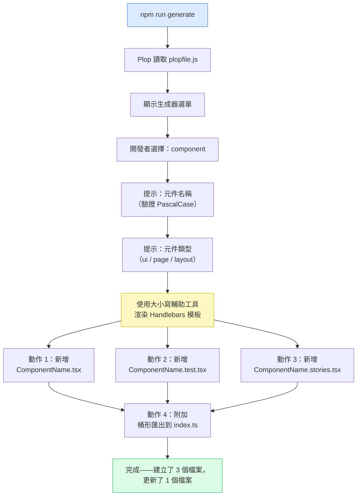

# 鷹架工具與程式碼生成

每當開發者透過複製現有檔案再對名稱進行搜尋取代來建立新元件時，他們同時在做兩件事：建立新元件，以及悄悄偏離團隊目前的規範。他們複製的那個檔案可能已有三個月的歷史。測試檔案結構可能已在這段期間更新。Import 排序規範可能已修訂。檔案建立的那一刻，就是規範偏差開始的時刻——也是防止它代價最低廉的時刻。

程式碼生成器透過在建立時就將規範編碼化來解決這個問題。生成器是一份可執行的規範，說明特定類型的新檔案應該長什麼樣子，並以團隊目前的標準為依據。當規範改變時，生成器也隨之改變。此後建立的每個檔案都會自動繼承更新後的模式，無需依賴開發者記住更新或找到正確的檔案來複製。

Plop 和 Hygen 是前端生態系中兩個主流的生成器工具。Plop 以配置驅動：所有生成器定義都放在單一的 `plopfile.js` 文件中，易於審核、查看，且能一次性理解全貌。Hygen 以文件驅動：生成器以獨立文件形式存放於 `_templates/` 目錄中，在生成器數量龐大時擴展性更好。對大多數前端團隊而言——生成器類型少於十種、開發者人數少於二十位——Plop 的單一文件模型維護更簡單，入門門檻更低。

## 設計思維

### 價值在於建立時的一致性

規範偏差的代價隨時間複利增長。六個月前以舊測試檔案結構建立的元件，不僅本身是錯的——它還成為新開發者需要類似元件時複製的參考。每個被複製的檔案都將過時模式傳播到更多檔案。在程式碼審查中發現規範偏差，需要花費審查者時間和作者的挫折感。在 CI 中發現需要花費 Pipeline 時間。在建立時透過生成器發現，代價幾乎為零——除了最初撰寫生成器的一次性投入。

這是生成器的根本論點：檔案被建立的時刻，是規範執行代價最低的時刻。一個生成器提示只需兩秒。一條關於檔案結構的程式碼審查意見，在審查、作者修改、再次審查的循環中需要兩分鐘。規模化來看——十位開發者每天建立元件——節省的時間不容小覷。

次要價值是入門引導。一位執行 `npm run generate` 並獲得正確結構元件檔案的新開發者，無需詢問「測試檔案如何組織？」或「我們為每個元件都寫 story 嗎？」生成器透過產出預期的結構，隱含地回答了這些問題。

### 生成器維護：無聲的失敗模式

生成器最危險的狀態，是它存在但已過時。開發者信任生成器能反映目前的規範。被錯誤信任的生成器，帶來的是一批以過時模式建立、卻充滿自信地合併進去、數週後才在程式碼審查中被發現的檔案。

解決方法是一個流程約束：將生成器模板視為事實來源。當規範改變時，模板的變更是同一個 diff 的一部分。這對那些將生成器視為工具而非文件的團隊來說並不直覺。將生成器重新框架為「可執行的當前規範文件」，使維護義務變得清晰。

過時的生成器也是一個信號。如果一個生成器六個月沒有被修改，但程式碼庫已有顯著演進，值得對照目前的檔案模式審計模板。安排季度生成器審查——查看最近建立的檔案，並將其與生成器產出的結果比較。任何差距都是維護債務。

### Plop 與 Hygen 的取捨

兩個工具都從模板和提示生成檔案。架構差異在於生成器定義存放的位置。

**Plop** 將所有生成器整合在 `plopfile.js` 中。每個生成器——其名稱、提示和操作——都在一個文件中可見。這使審計變得直觀：一次文件審查就能揭示存在哪些生成器、它們提示什麼、以及它們產出什麼。Plop 使用 Handlebars 作為模板語言，內建的大小寫轉換輔助工具（`properCase`、`camelCase`、`kebabCase`）可以從單一輸入推導出所有命名變體。Plop v4+ 使用 ESM 格式（`export default function`）。

**Hygen** 將每個生成器放在 `_templates/` 下各自的子目錄中。這種結構在生成器數量多時擴展性更好——每個生成器是一個自包含的目錄，而不是不斷增長的文件中的一個條目。Hygen 模板使用 EJS 語法（嵌入式 JavaScript）。取捨在於：可發現性需要瀏覽目錄樹，而不是閱讀一個文件。

對大多數前端專案而言，Plop 的單一文件模型以其簡單性勝出。對於管理二十個或更多生成器的平台團隊，Hygen 的目錄結構可能更適合。這個選擇應該一次性確定並提交——中途切換生成器工具的遷移成本，很少值得。

### 什麼時候 Shell 腳本就夠了

並非每個生成任務都需要 Plop 或 Hygen。以下情況適合使用 Shell 腳本：

- 生成器是一次性的（專案鷹架，而非重複的檔案建立）
- 沒有提示——輸出永遠是相同的
- 團隊沒有計劃演進模板

當模板需要提示、大小寫轉換（檔案內容中的 PascalCase 名稱、檔案名稱中的 kebab-case），或者隨著規範演進需要更新時，一個正規的生成器工具立即就能回收成本。`plopfile.js` 的投入是三十行配置，取代了一個容易出錯的腳本和一個沒人記得更新的非正式模板文件。

## 最佳實踐

### 生成器範圍：最小可行檔案集

最常見的生成器錯誤是過度鷹架——產出比工作流程所需更多的檔案。當開發者習慣性地刪除生成的檔案（沒人要求的 CSS 模組、造成循環依賴問題的桶形匯出、工具元件的 Story 檔案）時，生成器與現實的校準就失去了。開發者學會忽視它。

React 元件生成器的最小可行集是：

- `ComponentName.tsx` — 元件檔案
- `ComponentName.test.tsx` — 測試檔案

只有在專案有活躍的 Storybook 且所有元件作者都維護 Story 的情況下，才加入 `ComponentName.stories.tsx`。只有在專案以 CSS 模組作為主要樣式方案時，才加入 CSS 模組。除非專案有開發者持續維護的一致桶形匯出模式，否則不要加入生成的桶形匯出（`index.ts`）——被開發者立即刪除的生成桶形匯出，製造的噪音多於它節省的工作。

校準問題：「如果我們今天執行這個生成器，開發者會在第一次提交前刪除任何生成的檔案嗎？」如果答案是肯定的，就從生成器中移除那個檔案。

### 模板中的命名規範：從單一輸入推導所有名稱

Plop 的內建大小寫輔助工具，消除了手動建立檔案所帶來的命名不一致問題。手動建立 `UserProfile.tsx` 的開發者，可能根據他們最後看到的範例，將測試命名為 `userProfile.test.tsx`、`user-profile.test.tsx` 或 `UserProfile.test.tsx`。生成器執行統一的模式。

使用 Plop 輔助工具從單一 PascalCase 輸入推導所有命名變體：

- `properCase name` → `UserProfile`（元件顯示名稱、函式名稱、介面名稱）
- `camelCase name` → `userProfile`（測試描述前綴、Story 預設匯出）
- `kebabCase name` → `user-profile`（CSS 類別名稱、資料屬性、如果使用 kebab-case 的目錄名稱）

在 Handlebars 模板中，這些輔助工具以雙大括號語法在 `.hbs` 檔案內部呼叫——確切的模板語法請參見下方的「範例」章節。Plop 提示收集一個值（`name`）；模板從它推導出每一種命名變體。

在提示本身中驗證輸入。名稱提示中的 PascalCase 驗證器，在任何檔案被寫入之前，就在輸入階段捕獲 `userProfile` 或 `user-profile` 這樣的輸入。錯誤訊息是即時且可操作的。

### 在 `package.json` 中註冊並在 README 中記錄

需要知道底層工具才能執行的生成器，是新開發者不會發現的生成器。透過 `package.json` 腳本公開生成器：

```json
{
  "scripts": {
    "generate": "plop"
  }
}
```

有了這個腳本，`npm run generate`（或 `pnpm generate`）無需知道 Plop 是底層工具就能運作。這個命令在專案的腳本列表中是可發現的。

在專案 README 中用一行範例記錄生成器：

```
## 生成元件

執行 `npm run generate` 並選擇 "component"。以 PascalCase 輸入元件名稱。
```

這份文件屬於 README 的入門引導部分。它在新開發者需要詢問之前，就回答了「我如何建立新元件？」的問題。

### 模板維護：在規範變更的同一個 PR 中更新生成器

生成器模板是可執行的文件。當規範改變時，文件必須隨之改變。將模板文件——你的模板目錄中的 `.hbs` 文件——視為與原始碼同等需要審查注意的一流產物。

流程是一個約束：任何規範變更的 PR 描述必須（MUST）包含對應的模板更新。當規範相關文件（ESLint 配置、TypeScript 配置、測試工具）被修改時，程式碼審查者應該（SHOULD）驗證模板文件是否已更新。

模板過時的跡象：
- 新生成的檔案在第一次提交時觸發 ESLint 警告
- 生成的測試文件從已不存在的測試工具匯入
- 生成的元件使用了團隊已標準化取代的舊型別模式

當發現過時的模板時，立即修復它們，並在行事曆上設定提醒進行季度模板審計。

### AI 輔助鷹架：補充，而非替代

AI 程式碼生成（GitHub Copilot、cursor、本地模型）能快速產出看似合理的程式碼。這對新穎的模式很有用——程式碼庫中尚不存在且還沒有既定規範的程式碼。AI 擅長：一次性的工具函式、將現有模式適應新需求、為不熟悉的 API 撰寫樣板。

AI 不能取代已提交的生成器，因為 AI 不了解專案目前的規範。AI 會生成看起來合理的元件，但使用去年的測試工具匯入路徑、錯誤的 CSS 模組命名規範，或在團隊 Storybook 遷移之前的 Story 格式。已提交的生成器無論何時被使用，都強制執行今天的規範。

有效的工作流程是兩者並用：對必須符合專案規範的檔案結構執行 `npm run generate`，並在那些生成的檔案中使用 AI 輔助來撰寫受益於智慧建議的業務邏輯。生成器提供骨架；AI 協助實作。

## 視覺化

### Plop 執行流程

以下圖表展示從 `npm run generate` 到檔案建立和桶形匯出更新的完整執行流程。



## 範例

### 完整的 Plop 設定：plopfile.js 與 Handlebars 模板

以下範例是一個完整、可執行的 Plop 設定，用於 React 元件生成器。每個元件產出三個檔案（`.tsx`、`.test.tsx`、`.stories.tsx`），並在 `src/components/index.ts` 附加桶形匯出。

**`plopfile.js`**（專案根目錄，ESM 格式，Plop v4+）

```js
export default function (plop) {
  plop.setGenerator('component', {
    description: '生成包含測試和 Story 檔案的 React 元件',
    prompts: [
      {
        type: 'input',
        name: 'name',
        message: '元件名稱（PascalCase）：',
        validate: (value) => {
          if (/^[A-Z][A-Za-z0-9]+$/.test(value)) return true;
          return '元件名稱必須為 PascalCase（例如：UserProfile、ButtonGroup）';
        },
      },
      {
        type: 'list',
        name: 'type',
        message: '元件類型：',
        choices: ['ui', 'page', 'layout'],
        default: 'ui',
      },
    ],
    actions: [
      {
        type: 'add',
        path: 'src/components/{{properCase name}}/{{properCase name}}.tsx',
        templateFile: 'plop-templates/component.tsx.hbs',
      },
      {
        type: 'add',
        path: 'src/components/{{properCase name}}/{{properCase name}}.test.tsx',
        templateFile: 'plop-templates/component.test.tsx.hbs',
      },
      {
        type: 'add',
        path: 'src/components/{{properCase name}}/{{properCase name}}.stories.tsx',
        templateFile: 'plop-templates/component.stories.tsx.hbs',
      },
      {
        type: 'append',
        path: 'src/components/index.ts',
        template:
          "export { {{properCase name}} } from './{{properCase name}}/{{properCase name}}';",
      },
    ],
  });
}
```

**`plop-templates/component.tsx.hbs`**

```hbs
import type { FC } from 'react';

interface {{properCase name}}Props {
  children?: React.ReactNode;
}

export const {{properCase name}}: FC<{{properCase name}}Props> = ({ children }) => {
  return (
    <div data-testid="{{kebabCase name}}">
      {children}
    </div>
  );
};
```

**`plop-templates/component.test.tsx.hbs`**

```hbs
import { render, screen } from '@testing-library/react';
import { {{properCase name}} } from './{{properCase name}}';

describe('{{properCase name}}', () => {
  it('renders without crashing', () => {
    render(<{{properCase name}} />);
    expect(screen.getByTestId('{{kebabCase name}}')).toBeInTheDocument();
  });

  it('renders children', () => {
    render(<{{properCase name}}>hello world</{{properCase name}}>);
    expect(screen.getByText('hello world')).toBeInTheDocument();
  });
});
```

**`plop-templates/component.stories.tsx.hbs`**

```hbs
import type { Meta, StoryObj } from '@storybook/react';
import { {{properCase name}} } from './{{properCase name}}';

const meta = {
  title: '{{properCase type}}/{{properCase name}}',
  component: {{properCase name}},
  tags: ['autodocs'],
} satisfies Meta<typeof {{properCase name}}>;

export default meta;
type Story = StoryObj<typeof meta>;

export const Default: Story = {
  args: {},
};
```

**執行生成器：**

```bash
npm run generate
# 或
pnpm generate
```

Plop 提示輸入元件名稱和類型，然後寫入三個檔案並附加桶形匯出。整個互動過程約需十秒。結果是一個正確命名、正確結構的元件，在第一次提交時即可通過 Lint 檢查。

### 各部分的功能說明

`plopfile.js` 的 `validate` 函式在名稱提示中捕獲非 PascalCase 的輸入——在任何檔案被寫入之前，就在提示階段處理。錯誤訊息包含範例，這是向不熟悉規範的開發者傳達預期格式的最快方式。

動作 `path` 值中的 `properCase` 輔助工具，確保輸出檔案路徑使用標準的 PascalCase 名稱，不論開發者輸入了什麼。模板中的 `kebabCase` 輔助工具，以 CSS 友善的 kebab 格式產生 `data-testid` 屬性，匹配專案的屬性規範，無需開發者手動推導。

`append` 動作以非破壞性方式新增桶形匯出——它附加到現有的 `index.ts`，而不是替換它。

## 常見錯誤

### 未在文件中記錄生成器

開發者不知道的生成器，解決不了任何問題。在成熟的專案中，入門文件是主要的發現機制。如果 README 沒有提到 `npm run generate`，新開發者不會找到它——他們會找到一個現有的元件，複製它，然後手動編輯，重新引入生成器本來要防止的規範偏差。

在三個地方記錄生成器：
1. 專案 README——設定或開發部分的一句話
2. CONTRIBUTING 指南（如果存在）——建立新檔案的規範
3. `plopfile.js` 中的註解——每個生成器的描述字串會顯示在 Plop 選單中

Plop 的描述字串在開發者執行 `npm run generate` 看到生成器列表時可見。好的描述——「生成包含測試和 Story 檔案的 React 元件」——無需開發者打開 `plopfile.js` 就能傳達生成器的功能。

## 相關 FEE

- [FEE-1600：開發者體驗與工具概覽](./1600.md) — 鷹架是 DX 生命週期中建立時間層；本文涵蓋更廣泛工具圖景中的一個步驟
- [FEE-501：元件組合模式](../Component%20Architecture%20and%20Patterns/501.md) — 生成器執行元件組合模式所依賴的檔案結構；生成器模板是元件結構規範的可執行形式
- [FEE-1102：使用 Testing Library 進行元件測試](../Testing/1102.md) — 生成的測試檔案使用 Testing Library 模式；測試模板是團隊測試結構的標準形式

## 參考資料

- [Plop.js 文件——入門指南](https://plopjs.com/documentation/)
- [Plop.js GitHub——v4 ESM 格式與內建輔助工具](https://github.com/plopjs/plop)
- [Hygen 文件——快速開始](https://www.hygen.io/docs/quick-start)
- [比較 Plop 和 Hygen 的前端鷹架方案（LogRocket Blog）](https://blog.logrocket.com/hygen-vs-plop-which-is-best-for-your-team/)
- [Handlebars.js 模板語言文件](https://handlebarsjs.com/guide/)
- [Testing Library——React Testing Library](https://testing-library.com/docs/react-testing-library/intro/)
