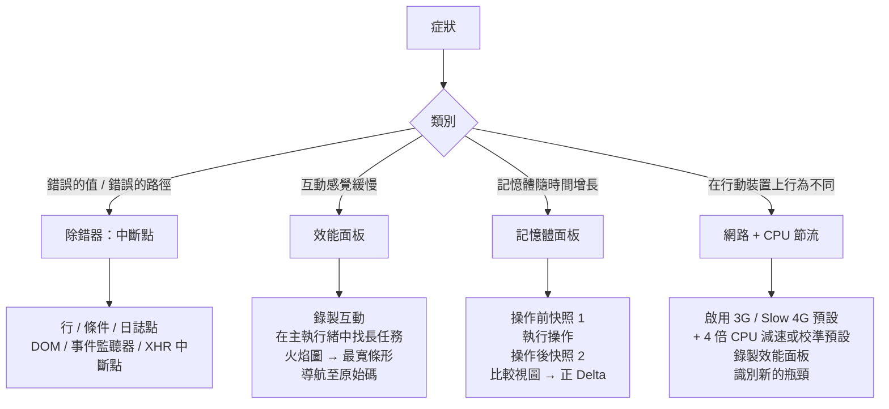

# [FEE-1608] 除錯工作流程與 DevTools 分析

:::info
除錯是針對缺陷形成假設、收集證據加以驗證，並縮小證據範圍直至定位根本原因的過程。大多數開發者將不成比例的時間花費在收集證據階段：新增一行 `console.log`、重新整理頁面、閱讀輸出，然後再新增更多語句。瀏覽器 DevTools 以互動式中斷點、條件式停止、表達式監視器、記憶體快照，以及效能火焰圖取代了這個循環。本文涵蓋中斷點及其變體、效能面板的火焰圖工作流程、記憶體面板的堆積快照工作流程，以及用於行動裝置模擬的網路與 CPU 節流。
:::

## 背景

在 DevTools 成熟之前，多數 JavaScript 除錯都仰賴 `console.log`：插入一行輸出陳述式、重新整理頁面、閱讀輸出，然後重複這個過程直到問題被隔離出來。這套做法對小型、低頻率的問題仍然管用，但遇到與執行頻率相關的問題時就難以擴展，例如一個值只在迴圈第一百次迭代時才出錯。Chrome DevTools，以及 Firefox 與 Safari 中對應的面板，用三種專用工具補上了這個落差：除錯器處理邏輯錯誤、效能面板處理時序錯誤、記憶體面板處理配置錯誤。

除錯器、效能面板與記憶體面板回答的是不同類型的問題，該先打開哪一個取決於症狀。除錯器用於找出邏輯錯誤，例如一個應該在第一百次迭代變為真值卻始終沒有的迴圈條件。效能面板用於找出時序錯誤：一個原本該花 20 毫秒卻花了 200 毫秒的函式，或是一個長到足以阻擋下一次輸入被處理的任務。記憶體面板則用於找出配置錯誤，例如因元件從未移除而不斷累積的事件監聽器。

網路節流把同樣的想法延伸到網路層。應用程式在高速本地連線上的行為，經常與在節流後的行動連線上不同；DevTools 的節流功能可以在不離開開發環境的情況下模擬這個落差，讓只在慢速連線使用者身上出現的行為得以重現與診斷。

## 視覺對比



## 範例

```typescript
// 範例：使用效能面板診斷緩慢的列表篩選。
// 此函式是假設的瓶頸——但火焰圖可能揭示
// 實際成本在不同的位置。

// 分析前：每次按鍵都進行天真的篩選 + 重新渲染
function handleSearchInput(query: string): void {
  // 如果分析顯示這是熱點路徑，考慮：
  // 1. 對輸入事件進行防抖（debounce）
  // 2. 對大型列表將篩選移至 Web Worker
  // 3. 使用虛擬化列表以減少渲染的 DOM 節點數量
  const filtered = allItems.filter(
    (item) =>
      item.name.toLowerCase().includes(query.toLowerCase()) ||
      item.description.toLowerCase().includes(query.toLowerCase()),
  );
  renderList(filtered);
}

// 以上情境的建議除錯工作流程：
// 1. 打開 DevTools → 效能面板
// 2. 點擊錄製
// 3. 在搜尋輸入框中輸入一個字元
// 4. 停止錄製
// 5. 在主執行緒列中，找到由 'keydown' 觸發的長任務
// 6. 在火焰圖中展開該任務
// 7. 找到呼叫堆疊中最寬的條形（可能不是 handleSearchInput）
// 8. 查看按 Self Time 排序的 Bottom-Up 視圖，找到真正的熱點函式
//
// 常見發現：
// - 在 10k+ 項目時，toLowerCase() + includes() 迴圈明顯緩慢
// - renderList() 的 DOM 差分比篩選本身更慢
// - 第三方分析事件在每次按鍵時同步觸發
```

## 最佳實踐

**應該（SHOULD）**從針對根本原因的具體假設出發進行除錯，而非新增探索性的 `console.log` 語句。假設決定了應使用哪個 DevTools 面板和哪種中斷點類型；探索性日誌記錄產生大量非結構化輸出，拖慢回饋週期。

**應該（SHOULD）**在被除錯的程式碼路徑頻繁執行而感興趣的條件罕見時，設置條件中斷點而非行中斷點。在迴圈的每次迭代中手動暫停是顯著的時間成本，條件中斷點可以消除。

**應該（SHOULD）**使用日誌點作為 `console.log` 除錯的替代方案。日誌點不修改原始碼，不會被意外提交，可以在不重新載入頁面的情況下設置和清除。

**必須（MUST）**在優化任何感覺緩慢的程式碼之前，先錄製效能面板設定檔。火焰圖經常會揭示，效能問題其實出現在呼叫堆疊中與預期不同的地方。優化錯誤的函式只會浪費時間，卻無法改善感知到的緩慢。

**應該（SHOULD）**依序拍攝兩個堆積快照，一個在疑似洩漏操作之前、一個在之後，並使用 Comparison 視圖找出計數不應增長卻出現正 Delta 的物件。不要只憑單一快照診斷記憶體洩漏。

**應該（SHOULD）**在發布任何效能敏感功能之前，同時搭配網路節流（3G 或 Slow 4G）與 CPU 節流（4 倍減速，或校準式中階行動裝置預設）運行效能面板，以模擬真實行動使用者的體驗。

**禁止（MUST NOT）**在畫面分享或錄影的除錯工作階段中，使用日誌點或條件中斷點表達式印出密鑰、驗證權杖或其他敏感資料。日誌點永遠不會進入原始碼控制，它只存在於 DevTools 工作階段中；但其主控台輸出仍會被觀看畫面或事後檢視錄影的任何人看到，因此應以列印相同值的 `console.log` 同等的謹慎態度對待它。

## 深入探討

### 中斷點：類型及其使用時機

行中斷點（Line Breakpoints）是最熟悉的類型。透過在 Sources 面板中點擊行號來設置，它們會在該行即將執行時暫停執行。行中斷點在已知問題大致位置時很有效；對於位置未知的問題，例如意外的狀態變化或在錯誤時機觸發的事件，則需要在多個候選位置設置許多中斷點。

條件中斷點（Conditional Breakpoints）用 JavaScript 表達式擴展了行中斷點。只有當表達式評估為真值時，除錯器才暫停。在迴圈中呼叫的函式上設置條件為 `index === 99` 的條件中斷點，只在第一百次迭代時暫停，跳過需要手動繼續的 99 次暫停。條件中斷點透過右鍵點擊行號並選擇「Add conditional breakpoint」來設置。

日誌點（Logpoints）是不會暫停執行的中斷點，會將表達式的值印到主控台。透過右鍵點擊行號並選擇「Add logpoint」來設置。日誌點 `'user:', user.id, 'action:', action.type` 會在該行印出這些表達式的值，不修改原始碼，也不會停止執行。在最常見的使用情境，也就是新增一行日誌陳述式來查看某個值，日誌點取代了 `console.log`，且不存在意外提交除錯日誌的風險。由於日誌點只存在於 DevTools 工作階段中，從未寫入磁碟上的任何檔案，它不會出現在 diff、commit 或程式碼審查中。

DOM 中斷點在 DOM 以指定方式發生突變時暫停執行。在 Elements 面板中右鍵點擊 DOM 節點並選擇「Break on」，提供三種類型：子樹修改（子節點添加或移除）、屬性修改（屬性變更）以及節點移除。DOM 中斷點在追蹤哪段 JavaScript 程式碼以產生意外視覺結果的方式修改 DOM 時非常有效。

事件監聽器中斷點在整個頁面上的指定類型的所有事件時暫停。在 Sources 面板的「Event Listener Breakpoints」部分下，啟用「Mouse → click」會在所有附加監聽器的每個點擊事件處理器上暫停。當呼叫來源未知時，這對於追蹤哪段程式碼處理使用者互動很有用。

XHR/Fetch 中斷點在網路請求 URL 與模式匹配時暫停。在 Sources 面板中，「XHR/Fetch Breakpoints」部分允許新增 URL 模式。當以匹配 URL 發起 fetch 或 XHR 時，除錯器暫停，暴露發出請求時的呼叫堆疊。這對於追蹤哪個程式碼路徑觸發了意外的 API 呼叫很有用。

步驟執行控制（Stepping Controls）是在中斷點暫停後的基本操作。「Step Into」會進入目前行呼叫的函式；「Step Over」執行目前行，但不進入其呼叫的任何函式；「Step Out」完成目前函式並返回呼叫者。一旦確認某個函式不是問題所在，用「Step Out」會比反覆按「Step Over」逐步執行完該函式其餘部分更快。在 Call Stack 面板中點擊特定堆疊幀，可以直接跳到該幀的執行上下文，不需要逐步執行才能到達；Scope 面板也會同步更新，顯示該堆疊幀中所有可見的變數，這是檢視狀態如何跨函式邊界傳遞最快的方式。

### 效能面板：火焰圖工作流程

火焰圖是效能面板中的主要視覺化。它在水平軸上表示時間，在垂直軸上表示呼叫堆疊深度。每個彩色條形是一個函式呼叫；條形寬度表示函式的自身時間加上其所有被呼叫者所花費的時間。在呼叫堆疊頂部的長水平條形表示需要很長時間才能返回的函式，通常是因為它們呼叫了許多子函式，這些子函式合計消耗了大量時間。

診斷緩慢互動的工作流程是：在錄製中執行互動，在主執行緒列識別長任務，點擊任務以展開它，在呼叫堆疊中找到最寬的條形，並導航到原始碼位置。最寬的條形代表在該堆疊位置消耗最多時間的函式。這個函式經常埋藏在頂層處理函式內部好幾層深的地方，而該頂層處理函式自身的總持續時間看起來並不起眼。

Bottom-Up 視圖中的「Total time」和「Self time」欄位，區分了函式本身花費的時間與歸因於其被呼叫者的時間。Total time 高但 Self time 低的函式是協調者：它呼叫其他實際完成工作的函式。Self time 高的函式則是在直接執行可能可優化的工作。按 Self time 降序排列的 Bottom-Up 視圖，會呈現整個錄製中自身成本最高的函式。

Activity 標籤與 Call Tree 標籤提供另外兩種彙總方式。Call Tree 顯示從根到葉的呼叫堆疊樹狀圖，有助於理解從事件分派到昂貴工作之間的完整路徑。Activity 標籤則按類別（腳本、渲染、繪製）將所有函式呼叫分組，並顯示每個類別的總時間，提供整個錄製過程中時間分配的高層次視圖。

主執行緒列中的長任務是指超過 50ms 的任務。Chrome DevTools 會在其角落渲染紅色三角形，標示它們阻塞主執行緒的時間長到足以造成可感知的輸入延遲。針對 INP（Interaction to Next Paint，衡量輸入回應速度的 Core Web Vital 指標）進行優化時，目標是將這些任務拆解成更小的片段，或完全將工作移出主執行緒。效能面板不會規定修復方式，但它能指出應該查看的位置。

使用者計時標記（User Timing Marks）可以為火焰圖加上應用程式自訂的標注。在待調查的程式碼路徑前後分別呼叫 `performance.mark('start')` 和 `performance.mark('end')`，會在時間軸上放置兩個時間點標記，但單靠標記本身並不會產生區間。在這兩個標記之後呼叫 `performance.measure('search-filter', 'start', 'end')`，則會建立一個帶有標籤的區段，顯示在效能面板的 Timings 列中，其寬度與兩個標記之間的時長成正比，讓分析聚焦在特定的業務操作上，而不是周圍的框架活動。這在分析 React 或 Vue 的更新週期時特別有用：協調（reconciliation）邏輯本身就會在火焰圖中產生大量條形，User Timing 標記能將應用程式程式碼與這類框架開銷區分開來。

### 記憶體面板：堆積快照工作流程

堆積快照在某個時間點捕獲整個 JavaScript 物件圖：記憶體中的每個物件、其大小、對其他物件的引用，以及來自其他物件的引用（保留者）。快照是靜態視圖；它不顯示一段時間內的配置事件。使用「Comparison」視圖比較兩個快照，揭示了在兩個快照之間創建且尚未被垃圾回收的物件。

比較視圖是診斷記憶體洩漏的主要工作流程。做法是：先拍攝一個快照（快照 1），執行疑似洩漏的操作，再拍攝另一個快照（快照 2），選取快照 2，並切換到相對於快照 1 的「Comparison」視圖。Delta 欄位會按建構函式名稱顯示新物件的淨計數。若某個不該增長的類別出現正 Delta，例如 `EventListener`、`IntersectionObserver` 或 `WebSocket`，就代表該類別的物件正在被建立卻未被釋放。在拍攝第二個快照前，以固定且具辨識度的次數重複疑似洩漏的操作，例如恰好七次，能讓真正的洩漏更容易從一般的配置雜訊中分離出來：Delta 欄位中落在七的倍數附近的物件計數是很強的訊號，而只操作一次的比較則可能讓計數變得模糊不清。

Summary 視圖中的「Retained size」欄位顯示，如果某個物件被垃圾回收，連同它獨佔保留的所有物件一起計算，總共會釋放多少記憶體。一個自身尺寸小但 Retained size 大的物件，正保留著一整棵大型物件樹；這個物件就是阻止其所持有內容被垃圾回收的「保留者根節點」。找到並釋放保留者根節點，就能釋放整棵被保留的樹。

分離的 DOM 節點是單頁應用程式中常見的記憶體洩漏類別。分離的 DOM 節點是指已從文件中移除、但仍被 JavaScript 引用的節點。由於 JavaScript 的引用阻止了它，它無法被垃圾回收。在堆積快照中，於篩選框中輸入「Detached」可以找出所有分離的 DOM 節點及其保留路徑：也就是持有這些節點引用的 JavaScript 物件。

Allocation timeline 是記憶體面板中另一個獨立的視圖，它記錄的是隨時間發生的物件配置，而非靜態快照。它會顯示哪個函式配置了某個物件、配置發生的時間點，以及在錄製結束時哪些配置仍未被釋放。對於高頻配置的問題，例如每一影格都配置大量短暫物件，Allocation timeline 比快照比較更有用，因為它也能捕捉到在兩次快照之間被建立、又已經被回收的物件。這類物件永遠不會出現在 Delta 欄位中，但它們造成的配置壓力仍然可能觸發垃圾回收暫停，這些暫停會以「Minor GC」或「Major GC」事件的形式出現在效能面板的火焰圖中。

### 網路節流用於行動裝置模擬

Network 面板的節流下拉選單提供三種連線預設：「Fast 4G」、「Slow 4G」和「3G」，另外還有一個「Offline」選項。Chrome DevTools 在 Chrome 127（2024 年）將這些預設更名，以配合 Lighthouse 的命名方式：舊的「Fast 3G」預設變成了「Slow 4G」，舊的「Slow 3G」預設變成了「3G」。目前套用的數值如下：

- **Fast 4G**：165ms 往返時間（RTT），下載速度約 9Mbps
- **Slow 4G**（原「Fast 3G」）：562.5ms RTT，下載速度約 1.6Mbps，上傳速度約 750Kbps
- **3G**（原「Slow 3G」）：2,000ms RTT，下載與上傳速度皆為 400Kbps

這些預設會影響頁面發出的所有網路請求，包括 API 呼叫、資源請求和第三方腳本。

節流揭示了在快速本地網路上看不見的幾類問題：在慢速連線上大到足以阻塞渲染的資源、在每個請求 5ms 時尚可接受、但在「3G」預設下每個請求要花 2 秒時就變得嚴重的 API 呼叫瀑布，以及在快速連線上閃爍得太短暫、在慢速連線上卻顯得像是壞掉的載入狀態 UI。

效能面板可以在網路節流的同時搭配 CPU 節流一起運行。CPU 節流會套用一個倍數來拖慢 JavaScript 執行速度。Lighthouse 預設固定套用 4 倍減速，其官方文件將這個倍數描述為把典型執行結果從高階桌機等級拉到中階行動裝置等級。Chrome DevTools 現在也提供校準式 CPU 節流：在 Settings → Throttling 中點擊「Calibrate」，會使用目前的機器實際測量低階與中階行動裝置的效能水準，並根據測量結果建立「low-tier mobile」／「mid-tier mobile」預設。校準式預設會比固定倍數更準確，因為它把測試者自己的硬體條件也納入了考量。同時啟用網路和 CPU 節流運行效能面板，可以模擬在壅塞網路上的行動使用者；這種組合能揭示出單獨測試任一項節流時都看不見的效能問題。

可以在 Network 面板節流下拉選單的「Add custom profile」中新增自訂節流設定檔。針對特定使用情境的自訂設定檔（例如特定地理市場使用者的典型連線速度）可以儲存並跨工作階段重複使用，讓針對可重現基準的測試變得容易。

網路與 CPU 節流只涵蓋時間層面。DevTools 的裝置工具列（Device Toolbar）補上了行動裝置模擬的另一半：它會模擬目標螢幕尺寸，並以觸控事件取代滑鼠事件。依賴指標位置的 UI 互動，例如懸停效果或拖曳操作，可能隱藏只在觸控輸入下才會出現的問題，而在裝置工具列模式下測試可以在問題觸及真實裝置之前先發現它們。結合網路與 CPU 節流搭配裝置工具列模式，是最接近真實行動使用者體驗的桌面端模擬方式，但仍無法完全取代在實體硬體上的測試：GPU 渲染管線與真實記憶體壓力下的垃圾回收行為，只有在實際裝置上才能被可靠地重現。

## 常見錯誤

- 完全依賴 `console.log`，而日誌點和條件中斷點原本可以更快，且不需要修改原始碼。
- 問題明明是特定互動，卻打開效能面板錄製整個頁面載入：過長的錄製會產生難以導覽的大型追蹤紀錄，應該只錄製該特定互動。
- 只憑單一堆積快照診斷記憶體洩漏：單一快照只能顯示目前的堆積狀態，無法區分預期的記憶體用量與真正的洩漏，只有兩個快照之間的 Comparison 視圖才能揭示淨增長。
- 在開著 DevTools 且未啟用 CPU 節流的情況下進行效能分析：DevTools 本身就有效能開銷，若要準確測量，應啟用 CPU 節流以模擬真實硬體。
- 只在開發機器上測試效能：DevTools 與 Lighthouse 將中階手機模擬為比高階桌機大約慢 4 倍的 CPU，因此在發布效能敏感功能之前，應使用 CPU 節流或校準式行動裝置預設進行驗證。
- 在優化套件大小之前不使用「Coverage」標籤：Coverage 標籤會顯示錄製期間實際執行了哪些 JavaScript，藉此揭示可以拆分成獨立區塊的未使用程式碼。

## 延伸閱讀

- [FEE-1403：日誌記錄與結構化日誌](/zh-tw/Observability%20and%20Error%20Tracking/1403)
- [FEE-1404：效能監控與追蹤](/zh-tw/Observability%20and%20Error%20Tracking/1404)
- [FEE-1609：本地開發環境設定](/zh-tw/Developer%20Experience%20and%20Tooling/1609)

## 參考資料

- Chrome DevTools team, "Breakpoints in Sources panel," Chrome for Developers. https://developer.chrome.com/docs/devtools/javascript/breakpoints/
- Chrome DevTools team, "Performance panel," Chrome for Developers. https://developer.chrome.com/docs/devtools/performance/
- Chrome DevTools team, "Fix memory problems," Chrome for Developers. https://developer.chrome.com/docs/devtools/memory-problems/
- web.dev, "Manually diagnose slow interactions in the lab," web.dev. https://web.dev/articles/manually-diagnose-slow-interactions-in-the-lab
- Chrome DevTools team, "Network features reference: Throttling," Chrome for Developers. https://developer.chrome.com/docs/devtools/network/reference/#throttling
- Chrome DevTools team, "Simulate mobile devices, network throttling, and CPU throttling," Chrome for Developers. https://developer.chrome.com/docs/devtools/settings/throttling
- Chrome DevTools team, "What's new in DevTools, Chrome 127," Chrome for Developers (2024). https://developer.chrome.com/blog/new-in-devtools-127
- Google Chrome Lighthouse team, "Throttling," GoogleChrome/lighthouse, GitHub. https://github.com/GoogleChrome/lighthouse/blob/main/docs/throttling.md
- DebugBear, "Network Throttling in Chrome DevTools," debugbear.com. https://www.debugbear.com/blog/chrome-devtools-network-throttling
- Nolan Lawson, "Fixing memory leaks in web applications," Read the Tea Leaves (2020). https://nolanlawson.com/2020/02/19/fixing-memory-leaks-in-web-applications/
- web.dev, "User Timing API," web.dev. https://web.dev/usertiming/
- Mozilla, "Debugger," Firefox Source Docs. https://firefox-source-docs.mozilla.org/devtools-user/debugger/index.html
