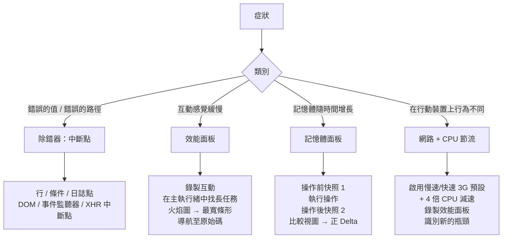

# 除錯工作流程與 DevTools 分析

除錯是針對缺陷形成假設、收集證據加以驗證，並縮小證據範圍直至定位根本原因
的過程。大多數開發者將不成比例的除錯時間花費在收集證據階段——新增
`console.log`、重新整理、閱讀輸出、再新增更多語句。瀏覽器的 DevTools 提供
了更為強大的替代方案：互動式中斷點、條件式停止、表達式監視器、記憶體快照，
以及詳細的效能火焰圖。使用這些工具的代價是學習工作流程；而生產力的回報是
消除大多數新增日誌並重新整理的循環。

效能面板（Performance panel）和記憶體面板（Memory panel）代表了與除錯器
截然不同的工具類別。除錯器幫助找到邏輯錯誤——錯誤的值、缺失的條件、意外
的程式碼路徑。效能面板幫助找到時序錯誤——緩慢的函式、長任務、渲染瓶頸。
記憶體面板幫助找到配置錯誤——物件累積、分離的 DOM 樹、閉包洩漏。這些工具
回答不同的問題，選擇先開啟哪個工具取決於症狀，而非對某個工具的偏好。

網路節流（Network throttling）是開發環境與真實使用情境之間的橋樑。應用
程式在高速本地網路上的行為，往往與在具有 150ms 延遲和 10Mbps 吞吐量的 4G
行動連線上的行為大相徑庭。DevTools 中的節流可以在不離開開發環境的情況下
模擬這些條件，使重現和診斷只在慢速連線使用者身上出現的行為成為可能。

本文涵蓋中斷點及其變體、效能面板火焰圖工作流程、記憶體面板堆積快照工作
流程，以及用於行動裝置模擬的網路節流。

## 設計思維

### 中斷點：類型及其使用時機

行中斷點（Line Breakpoints）是最熟悉的類型。透過在 Sources 面板中點擊行
號來設置，它們在該行即將執行時暫停執行。行中斷點在已知問題的大致位置時
很有效。對於位置未知的問題——意外的狀態變化、在錯誤時機觸發的事件——它們
需要在多個候選位置設置許多中斷點。

條件中斷點（Conditional Breakpoints）用 JavaScript 表達式擴展了行中斷點。
只有當表達式評估為真值時，除錯器才暫停。在迴圈中呼叫的函式上設置條件為
`index === 99` 的條件中斷點，只在第一百次迭代時暫停，跳過需要手動繼續的
99 次暫停。條件中斷點透過右鍵點擊行號並選擇「Add conditional breakpoint」
來設置。

日誌點（Logpoints）是不暫停的中斷點，它們將表達式列印到控制台。透過右
鍵點擊行號並選擇「Add logpoint」來設置。日誌點 `'user:', user.id, 'action:', action.type`
在該行列印這些表達式的值，而不修改原始碼，也不停止執行。在最常見的使用
情境中——新增日誌語句以查看值——日誌點取代了 `console.log`，且不存在意外提
交除錯日誌的風險。

DOM 中斷點在 DOM 以指定方式發生突變時暫停執行。在 Elements 面板中右鍵點
擊 DOM 節點並選擇「Break on」，提供三種類型：子樹修改（子節點添加或移除）、
屬性修改（屬性變更）以及節點移除。DOM 中斷點在追蹤哪段 JavaScript 程式碼
以產生意外視覺結果的方式修改 DOM 時非常有效。

事件監聽器中斷點在整個頁面上的指定類型的所有事件時暫停。在 Sources 面板
的「Event Listener Breakpoints」部分下，啟用「Mouse → click」會在所有附加
監聽器的每個點擊事件處理器上暫停。當呼叫來源未知時，這對於追蹤哪段程式
碼處理使用者互動很有用。

XHR/Fetch 中斷點在網路請求 URL 與模式匹配時暫停。在 Sources 面板中，
「XHR/Fetch Breakpoints」部分允許新增 URL 模式。當以匹配 URL 發起 fetch
或 XHR 時，除錯器暫停，暴露發出請求時的呼叫堆疊。這對於追蹤哪個程式碼
路徑觸發了意外的 API 呼叫很有用。

步驟執行控制是中斷點除錯的基礎操作，熟練使用能大幅提升效率。「Step Into」
進入當前行的函式呼叫內部；「Step Over」執行當前行但不進入函式內部；「Step
Out」完成當前函式並返回其呼叫者。在確認當前函式不是問題所在時，「Step Out」
比反覆按「Step Over」更高效。當呼叫堆疊面板中有多個堆疊幀可見時，直接點
擊感興趣的堆疊幀，可以立即跳到那個執行上下文，而無需逐步執行。Scope 面板
會同步更新，顯示所選堆疊幀的所有可見變數值，這是理解跨函式邊界的狀態傳
遞的最有效方式。

### 效能面板：火焰圖工作流程

火焰圖是效能面板中的主要視覺化。它在水平軸上表示時間，在垂直軸上表示呼
叫堆疊深度。每個彩色條形是一個函式呼叫；條形寬度表示函式的自身時間加上
其所有被呼叫者所花費的時間。在呼叫堆疊頂部的長水平條形表示需要很長時間
才能返回的函式，通常是因為它們呼叫了許多子函式，這些子函式合計消耗了大
量時間。

診斷緩慢互動的工作流程是：在錄製中執行互動，在主執行緒列識別長任務，點
擊任務以展開它，在呼叫堆疊中找到最寬的條形，並導航到原始碼位置。最寬的
條形是相對於其在堆疊中的位置消耗最多時間的函式——不一定是總持續時間最長
的頂層函式，而是堆疊中實際花費時間的具體函式。

Bottom-Up 視圖中的「Total time」和「Self time」列區分了函式本身花費的時間
和歸因於其被呼叫者的時間。Total time 高但 Self time 低的函式是一個協調者
——它呼叫其他實際完成工作的函式。Self time 高的函式直接執行可能可以優化的
工作。按 Self time 降序排列的 Bottom-Up 視圖，在錄製中呈現自身成本最高的
函式。

主執行緒列中的長任務是超過 50ms 的任務。Chrome DevTools 以角落的紅色三角
形渲染它們，以指示它們阻塞主執行緒的時間足夠長，可能導致可感知的輸入延遲。
對於 INP 優化，目標是將這些任務分解成更小的片段，或完全將工作移至主執行
緒之外。效能面板不規定修復方案，但它指出了應該查看的位置。

Activity 標籤按類別（腳本、渲染、繪製）分組所有函式呼叫，並顯示每個類別
的總時間，提供整個錄製中時間分配的高層次視圖。Call Tree 標籤顯示從根到葉
的呼叫堆疊樹，有助於理解從事件分發到昂貴工作的完整路徑。對於需要從事件
起點追蹤的問題，Call Tree 視圖比 Bottom-Up 視圖更直觀。

使用者計時標記（User Timing Marks）可以在火焰圖中添加應用程式定義的標注。
在需要診斷的程式碼路徑前後分別呼叫 `performance.mark('start')` 和
`performance.mark('end')`，這些標記會在效能面板的 Timings 列中顯示為帶有
標籤的時間點，讓火焰圖的分析聚焦在特定的業務操作區間，而非大量框架內部
活動的雜訊中。這個技術在分析複雜 React 或 Vue 更新週期時特別有用——框架
的協調（reconciliation）邏輯在火焰圖中會產生大量條形，User Timing 標記可
以將應用程式邏輯的部分精確標出，方便與框架開銷區分。

### 記憶體面板：堆積快照工作流程

堆積快照在某個時間點捕獲整個 JavaScript 物件圖：記憶體中的每個物件、其
大小、對其他物件的引用，以及來自其他物件的引用（保留者）。快照是靜態視圖；
它不顯示一段時間內的配置事件。使用「Comparison」視圖比較兩個快照，揭示了
在兩個快照之間創建且尚未被垃圾回收的物件。

比較視圖是診斷記憶體洩漏的主要工作流程。模式是：拍攝快照（快照 1），執
行疑似洩漏的操作，拍攝另一個快照（快照 2），選擇快照 2，並切換到相對於
快照 1 的「Comparison」視圖。Delta 列按建構函式名稱顯示新物件的淨計數。
在不應增長的類別中的正 delta——`EventListener`、`IntersectionObserver`、
`WebSocket`——表示該類別的物件正在被創建而未被釋放。

Summary 視圖中的「Retained size」列顯示如果一個物件被垃圾回收，包括它專
門保留的所有物件，將釋放多少總記憶體。Retained size 大但自身尺寸小的物件，
正在保留一個大型物件樹——它是阻止其所持有的所有內容被垃圾回收的「保留者
根節點」。找到並釋放保留者根節點，可以釋放整個被保留的樹。

分離的 DOM 節點是單頁應用程式中常見的記憶體洩漏類別。分離的 DOM 節點是
已從文件中移除但仍被 JavaScript 引用的節點。它無法被垃圾回收，因為 JavaScript
引用阻止了它。在堆積快照中，在過濾框中篩選「Detached」，可以呈現所有分
離的 DOM 節點及其保留路徑——持有引用的 JavaScript 物件。

Allocation timeline 是記憶體面板中的另一個視圖，它記錄一段時間內的物件配
置，而非靜態快照。它顯示哪些函式分配了物件、分配發生在哪個時間點，以及
哪些分配在錄製結束時仍未被垃圾回收。對於高頻配置的問題——每幀分配大量短
暫物件，導致頻繁的垃圾回收暫停——Allocation timeline 比快照比較更有效，因
為它能捕捉到在兩次快照之間創建並已被回收的物件，這類物件在 Comparison 視
圖中的 Delta 中不會出現，但它們的分配壓力仍然會觸發 GC 暫停，影響互動響
應性。在效能面板的火焰圖中，GC 暫停顯示為黃色的「Minor GC」或「Major GC」
事件，這是切換到記憶體 Allocation timeline 進行深入調查的信號。

### 網路節流用於行動裝置模擬

Network 面板的節流預設——「Slow 3G」、「Fast 3G」、「4G」——模擬行動網路
的頻寬和延遲條件。「Slow 3G」應用大約 400ms RTT 和 400Kbps 吞吐量。「Fast
3G」應用大約 100ms RTT 和 1.5Mbps 吞吐量。這些預設影響頁面發出的所有網
路請求，包括 API 呼叫、資源請求和第三方腳本。

節流揭示了在快速本地網路上不可見的幾類問題：在慢速連線上大到足以阻塞渲
染的資源、在每個請求 5ms 時可接受但在 100ms 時很嚴重的 API 呼叫瀑布，以
及在快速連線上閃爍得如此短暫以至於在慢速連線上顯得損壞的載入狀態 UI。

透過同時在效能面板中啟用 CPU 節流，可以在網路節流下同時運行效能面板。CPU
節流應用乘數來減慢 JavaScript 執行速度：4 倍 CPU 減速模擬中端 Android 裝
置的效能。在同時啟用網路和 CPU 節流的情況下運行效能面板，模擬在擁塞網路
上的真實行動使用者的完整環境——這種組合通常揭示了在任一單獨情境下都不可
見的效能問題。

可以在 Network 面板的節流下拉選單的「Add custom profile」下新增自訂節流設
定檔。針對特定使用情境的自訂設定檔——例如，特定地理市場使用者的典型連線
速度——可以保存並跨 Session 重複使用，使針對可重現基準的測試變得容易。

行動裝置模擬不僅限於網路和 CPU 節流。DevTools 的裝置工具列（Device Toolbar）
在模擬不同螢幕尺寸的同時，也模擬觸控事件而非滑鼠事件。對於依賴指標位置
（pointer position）的 UI 互動（如懸停效果、拖曳操作），在裝置工具列模式
下測試可以揭示在桌面瀏覽器上不可見的觸控行為問題。結合網路和 CPU 節流與
裝置工具列模式，提供了最接近真實行動裝置使用者體驗的桌面端模擬環境，但
不能完全替代在實際裝置上的測試——某些效能特性（GPU 渲染管線、記憶體壓力
下的垃圾回收行為）只有在真實硬體上才能被可靠地重現。

假設驅動的除錯方法有其認識論基礎：在沒有假設的情況下觀察系統，會產生大
量資料但缺乏篩選依據。假設提供篩選器——在數十個 Network 請求、數百條日
誌行或數千個效能時間點中，假設告訴工程師應該聚焦在哪裡。一個好的假設應
該是可證偽的：「我認為問題在於 API 回應在慢速網路下超時」這個假設，可以
透過節流網路並觀察逾時錯誤來驗證或否定。「某個地方有 bug」則不是假設，
而是問題陳述的重複。培養假設形成的技能，需要系統地記錄過去的除錯發現，
讓工程師能夠在遇到類似症狀時快速激活相關的先前知識。

## 最佳實踐

**應該（SHOULD）**從針對根本原因的具體假設出發進行除錯，而非新增探索性的 `console.log` 語句。假設決定了應使用哪個 DevTools 面板和哪種中斷點類型；探索性日誌記錄產生大量非結構化輸出，拖慢回饋週期。

**應該（SHOULD）**在被除錯的程式碼路徑頻繁執行而感興趣的條件罕見時，設
置條件中斷點而非行中斷點。在迴圈的每次迭代中手動暫停是顯著的時間成本，
條件中斷點可以消除。

**應該（SHOULD）**使用日誌點作為 `console.log` 除錯的替代方案。日誌點不
修改原始碼，不會被意外提交，可以在不重新載入頁面的情況下設置和清除。

**必須（MUST）**在優化任何感覺緩慢的程式碼之前，錄製效能面板設定檔。火焰
圖通常揭示效能問題在與開發者預期不同的呼叫堆疊部分——優化錯誤的函式會
浪費時間而不改善感知的緩慢。

**應該（SHOULD）**依序拍攝兩個堆積快照——在疑似洩漏操作之前和之後——並
使用比較視圖識別計數不應增長的正 delta 物件。不要從單個快照診斷記憶體
洩漏。

**應該（SHOULD）**在發布任何效能敏感功能之前，使用網路節流（Fast 3G 或
類似）和 CPU 節流（4 倍減速）同時運行效能面板，以模擬真實行動使用者的
體驗。

**禁止（MUST NOT）**將日誌點或條件中斷點提交到原始碼控制。不得在程式碼
審查中合併含有日誌點設置的提交，也不得在共享分支中依賴日誌點進行除錯——
只應在個人的本地工作區使用，完成後立即移除。

**應該（SHOULD）**在效能問題的診斷中優先使用 `performance.mark()` 和
`performance.measure()` 標注業務操作邊界，而非僅憑視覺觀察火焰圖中框架
內部呼叫的時序。明確標注的邊界使得不同版本的效能比較更為可靠——框架的
內部呼叫結構可能在升級後改變，而業務操作的時序是穩定的比較基礎。這些
標注也可以配合 `PerformanceObserver` 在生產環境中收集真實使用者的業務操
作時序資料，而非僅在開發環境的錄製中使用。

## 視覺呈現



## 範例

```typescript
// 範例：使用效能面板診斷緩慢的列表篩選。
// 此函式是假設的瓶頸——但火焰圖可能揭示
// 實際成本在不同的位置。

// 分析前：每次按鍵都進行天真的篩選 + 重新渲染
function handleSearchInput(query: string): void {
  // 如果分析顯示這是熱點路徑，考慮：
  // 1. 對輸入事件進行防抖（debounce）
  // 2. 對大型列表將篩選移至 Web Worker
  // 3. 使用虛擬化列表以減少渲染的 DOM 節點數量
  const filtered = allItems.filter(
    (item) =>
      item.name.toLowerCase().includes(query.toLowerCase()) ||
      item.description.toLowerCase().includes(query.toLowerCase()),
  );
  renderList(filtered);
}

// 以上情境的建議除錯工作流程：
// 1. 打開 DevTools → 效能面板
// 2. 點擊錄製
// 3. 在搜尋輸入框中輸入一個字元
// 4. 停止錄製
// 5. 在主執行緒列中，找到由 'keydown' 觸發的長任務
// 6. 在火焰圖中展開該任務
// 7. 找到呼叫堆疊中最寬的條形（可能不是 handleSearchInput）
// 8. 查看按 Self Time 排序的 Bottom-Up 視圖，找到真正的熱點函式
//
// 常見發現：
// - 在 10k+ 項目時，toLowerCase() + includes() 迴圈明顯緩慢
// - renderList() 的 DOM 差分比篩選本身更慢
// - 第三方分析事件在每次按鍵時同步觸發
```

## 常見錯誤

- 完全依賴 `console.log`，而日誌點和條件中斷點會更快且不產生原始碼修改
- 打開效能面板並錄製整個頁面載入，而問題是特定互動——長錄製產生難以導
  航的大型追蹤；只錄製特定互動
- 從單個堆積快照診斷記憶體洩漏——單個快照顯示當前堆積，但無法區分預期
  記憶體和洩漏；只有兩個快照之間的比較視圖才能揭示淨增長
- 在未啟用 CPU 節流的情況下進行效能分析——DevTools 本身有效能開銷；為了
  準確的效能測量，啟用 CPU 節流以模擬真實硬體
- 僅在開發機器上測試效能——2023 年的 MacBook Pro 比中端 Android 手機快
  5–10 倍；在發布效能敏感功能之前始終使用 CPU 節流驗證
- 在優化套件大小之前不使用「Coverage」標籤——Coverage 標籤顯示錄製期間
  執行了哪些 JavaScript，揭示可以分割成獨立區塊的未使用程式碼

## 相關 FEE

- FEE-1403: Error Tracking & Source Maps
- FEE-1404: Performance Monitoring & Tracing
- FEE-1609: Local Development Environment Setup

## 參考資料

- [Chrome DevTools：中斷點文件](https://developer.chrome.com/docs/devtools/javascript/breakpoints/)
- [Chrome DevTools：效能面板](https://developer.chrome.com/docs/devtools/performance/)
- [Chrome DevTools：記憶體面板](https://developer.chrome.com/docs/devtools/memory-problems/)
- [web.dev：在實驗室中診斷緩慢的互動](https://web.dev/diagnose-slow-interactions-in-the-lab/)
- [Chrome DevTools：網路節流](https://developer.chrome.com/docs/devtools/network/reference/#throttling)
- [Firefox Developer Tools：除錯器](https://firefox-source-docs.mozilla.org/devtools-user/debugger/index.html)
- [MDN：效能 API](https://developer.mozilla.org/zh-TW/docs/Web/API/Performance)
- [Chrome DevTools：Coverage 標籤](https://developer.chrome.com/docs/devtools/coverage/)
- [web.dev：使用 User Timing API 測量效能](https://web.dev/usertiming/)
- [Chrome DevTools：Memory 面板概述](https://developer.chrome.com/docs/devtools/memory-problems/heap-snapshots/)
- [Safari 開發者工具：JavaScript 分析](https://webkit.org/web-inspector/)
- [Google：DevTools 效能分析技巧](https://developer.chrome.com/docs/devtools/performance/reference/)
- [DebugBear：Core Web Vitals 監控](https://www.debugbear.com/docs/)
