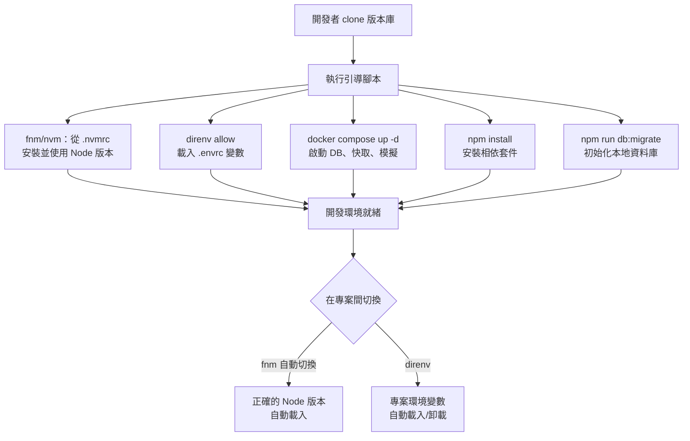

# 本地開發環境設定

本地開發環境是每一行應用程式碼首次被撰寫的地方。它決定了開發者的迭代速
度、開發行為與正式環境的吻合程度，以及新成員達到生產力所需的時間。運作
良好的環境是隱形的——它不妨礙開發者，讓他們專注在問題本身。運作不良的
環境則持續帶來成本：版本衝突、環境專屬的 bug、只能在特定人的機器上執行
的設定步驟，以及橫跨數天的上手訓練。

本地環境最重要的特性是可重現性。所謂可重現，指的是任何開發者在任何受支
援的機器上，都能依照既定的設定流程，抵達與所有其他開發者及 CI 環境行為
完全一致的環境。可重現性不是一次性目標——它必須隨著相依套件更新、工具
演進與團隊成長而持續維護。

前端開發中，大多數環境不一致可追溯至三個根源：各開發者使用不同版本的
Node.js、假定存在但未統一定義的環境變數，以及在不同機器上設定方式各異
的本地服務（資料庫、訊息佇列、第三方 API 模擬）。每個問題都有標準解法：
以 Node 版本管理工具固定執行階段版本、用 `direnv` 進行專案級環境變數注
入，以及用 Docker Compose 協調本地服務。

本文涵蓋用於 Node 版本管理的 `nvm` 與 `fnm`、用於每專案環境變數注入的
`direnv`、以 Docker 為基礎的本地服務，以及讓上手流程可重現的實踐方式。

## 設計思維

### Node 版本管理：nvm 與 fnm

Node.js 並無永久穩定的 LTS——主要版本會歷經活躍支援、維護，直至終止支
援。若一個以 Node 18 啟動的前端專案，CI 使用 Node 20，而開發者本地安裝
的是 Node 16，就會在套件解析、加密 API 及測試結果上產生不一致的行為。
這種不一致不一定會產生明顯的錯誤——Node 版本之間在計時器、進程訊號處理
和原生模組繫結等領域存在細微的行為差異是常見的。

`nvm`（Node Version Manager）是管理單一機器上多個 Node.js 安裝的成熟工
具。`nvm use` 會讀取當前目錄的 `.nvmrc` 檔案並切換至指定版本，若尚未安
裝則自動安裝。`.nvmrc` 檔案包含單一版本字串：`20.11.0` 或 `lts/iron`。
將 `.nvmrc` 提交至版本庫，確保所有開發者使用相同版本。不同 Node 版本在
套件解析和 V8 引擎行為上存在差異，這些差異即使不直接報錯，也可能在特定
情境下造成建置或測試結果不同。

`fnm`（Fast Node Manager）是以 Rust 撰寫的新型替代工具，版本切換速度顯
著更快（1 秒以內，相較於 nvm 的數秒）。`fnm` 支援自動版本切換：在
Shell 設定中加入 `fnm env --use-on-cd`，每次切換目錄時，`fnm` 就會讀取
`.node-version` 或 `.nvmrc` 並自動切換 Node 版本，無需手動執行 `fnm use`。
自動切換是比「記得執行 `nvm use`」的文件說明更強的保證，因為它消除了拉
取更新版本固定後忘記切換的可能性。在多個 Node 版本並存的開發環境中，這
個特性大幅降低了因版本混用而引發的問題。

`.nvmrc` 應指定完整的修訂版本（`20.11.0`），而非主要或次要版本別名（`20`
或 `20.x`）。別名會隨著新版本發布而解析至不同的修訂版本，重新引入版本
偏移。固定至完整修訂版本，可確保所有開發者和 CI 使用完全相同的執行檔，
包含相同的 V8 版本和任何版本特定的套件解析行為。這種精確固定讓版本升級
成為明確的有意識行為，而非隱性漂移。

更新 Node 版本是一個刻意的行為：在 `.nvmrc` 中更新版本、同步更新 CI 設
定、測試升級，並向團隊傳達變更。`.nvmrc`、CI 和正式執行環境這三者必須一
起更新。在 CI 中已運作但尚未更新 `.nvmrc` 的版本，下次開發者切換到該專
案時就會產生版本偏移。維持三者同步是確保「它在我的機器上可以跑」不再成
為問題的關鍵。

### direnv：每專案環境變數注入

環境變數是管理本地、暫存和正式環境之間變動設定的標準機制。本地開發的挑
戰在於：不同專案需要不同的變數值，同時在多個專案間切換的開發者需要每個
專案有自己的變數情境，而無需手動切換。

`direnv` 是一個鉤入 `cd` 指令（或任何目錄切換）的 Shell 擴充功能，根據
當前目錄中的 `.envrc` 檔案載入或卸載環境變數。當開發者進入專案目錄時，
`.envrc` 中的變數會被注入 Shell 會話。離開時，變數被移除。這是自動且專
案範圍的。由於 `direnv` 的變數管理完全基於目錄，無論開發者同時維護多少
專案，都不需要管理全域環境狀態或在不同專案設定之間手動切換。

`.envrc` 以非機密值提交至版本庫——API 基礎 URL、功能旗標預設值、指向本
地 Docker 服務的服務主機名稱。機密值——第三方服務的 API 金鑰、暫存環境
的資料庫憑證——禁止（MUST NOT）提交。取而代之，`.envrc` 從密鑰管理系統
或從每位開發者在本地建立的 gitignored `.envrc.local` 檔案取得機密，而
`.envrc.local` 則是從提交至版本庫的範本（`.envrc.local.example`）建立。
這種分層方式讓團隊能夠在不暴露敏感資訊的情況下，將通用設定集中管理。

`direnv allow` 在目錄中首次使用 `.envrc` 時，以及每次 `.envrc` 變更時都
需要執行。這個明確的核准步驟，防止自動執行剛 clone 的新版本庫中的任意
程式碼。信任模型是：開發者在核准前審查 `.envrc`——就像審查其他設定檔一
樣。這個機制也確保 `.envrc` 的每次變更都能被開發者注意到，而非靜默地生
效。

常見模式是 `.envrc` 搭配 `.envrc.local`：

```
# .envrc（提交至版本庫）
source_env_if_exists .envrc.local
export API_BASE_URL=http://localhost:3001
export FEATURE_FLAGS_KEY=local-dev-key
export DB_HOST=localhost
export DB_PORT=5432

# .envrc.local（gitignored，每位開發者在本地建立）
export THIRD_PARTY_API_KEY=<開發者個人金鑰>
export STAGING_DB_PASSWORD=<開發者個人暫存憑證>
```

### 以 Docker 為基礎的本地服務

依賴資料庫、訊息佇列、快取或第三方 API 模擬的應用程式，需要這些服務在
本地執行。手動安裝服務——透過 Homebrew 安裝 PostgreSQL、Redis 和
RabbitMQ 並分別管理版本——會產生脆弱的環境：服務版本與正式環境偏移、不
同開發者的啟動指令不同，以及服務之間或與同一埠號的系統服務衝突。

Docker Compose 透過在宣告式 `docker-compose.yml` 檔案中定義所有服務來消
除這些問題。執行 `docker compose up -d` 以正確版本、設定的埠號和正確的
初始設定啟動所有服務。執行 `docker compose down` 停止它們。設定提交至版
本庫，因此所有開發者使用相同的服務版本和相同的埠號映射。這種方式將「需
要安裝哪些服務、如何設定」的知識從個人記憶或 Slack 對話移轉到受版本控
制的檔案中。

`docker-compose.yml` 中的服務版本應固定至與正式環境相同的主要版本。本地
使用 PostgreSQL 15 測試在 PostgreSQL 16 正式環境中執行的程式碼，可能在
所有本地測試通過的情況下，因正式環境獨有的查詢計劃差異而導致效能迴歸。
固定至正式環境的主要版本縮小這個差距，同時允許修訂版本在各自的週期內
獨立更新。主要版本差距是已知 SQL 行為差異的來源，值得特別注意。

`docker-compose.yml` 中的健康檢查，讓依賴服務能等待其相依項目就緒後再
啟動。若服務在資料庫接受連線之前啟動，就會初始化失敗；Docker Compose 健
康檢查會延遲依賴服務的啟動，直到資料庫回應健康檢查查詢。這防止了需要開
發者手動等待服務並重新執行啟動指令的「競速就緒」問題。沒有健康檢查的設
定在大多數時候可以運作，但在速度較慢的機器或網路條件下容易失敗，這類失
敗難以診斷。

對於非團隊擁有的 API——第三方支付閘道、電子郵件發送服務、SMS 提供商——
本地開發可以使用模擬伺服器。WireMock、Mockoon 和 MSW（Mock Service
Worker）提供不同層級的 API 模擬：WireMock 是可作為 Docker 容器執行的獨
立伺服器；MSW 在瀏覽器和 Node.js 測試環境中攔截請求，無需執行中的伺服
器。透過環境變數（由 `direnv` 載入）設定 API 基礎 URL，意味著在本地模
擬和暫存服務之間切換只需變更 `.envrc.local`。

### 讓上手流程可重現

新開發者對程式碼庫的第一印象，奠定了他們與開發環境關係的基調。需要向三
位資深開發者請教未記載步驟的上手流程，是環境不可重現的訊號。從單一
README 段落或引導腳本即可完成的上手流程，是團隊將環境設定視為一等關切
的訊號。

引導腳本模式將整個設定流程編寫為 Shell 腳本：安裝正確的 Node 版本、安
裝 `direnv`、將 `.envrc.local.example` 複製為 `.envrc.local`、執行
`npm install`、執行 `docker compose up -d`，以及執行資料庫遷移。新開發
者執行一個腳本。若成功完成，環境就緒。若在某步驟失敗，錯誤訊息具體到足
以診斷問題，無需資深協助。

腳本必須被測試。最可靠的測試方式是在沒有預先設定的全新機器或容器中執行
它。CI 可以提供這個環境：每晚建立一個乾淨的 Docker 映像並從頭執行引導腳
本，驗證設定流程在相依套件變更時仍然有效。未經測試的引導腳本是一種負債
——它對現有開發者有效，但對下一位加入的人可能在第一步就失敗，而且在最
不方便的時機失敗。測試腳本的另一個好處是，它迫使團隊明確記錄所有前置條
件，而不是依賴每個人碰巧已經安裝的工具。

文件應記錄原因，而非只記錄操作方式。只知道「啟動前執行 `nvm use`」的新
開發者，在後來改用 `fnm` 後看到版本自動切換時會感到困惑。簡短說明為何
需要 Node 版本管理工具以及 `.nvmrc` 的作用，能建立在工具變更後仍能存續
的心智模型。理解工具目的的開發者，更有可能在工具本身改變時正確維護相關
設定。

本地開發環境的可重現性是一個系統屬性，而非個別工具的特性。單一工具的版本
鎖定（如 Node.js）不足以保證可重現性，因為環境由許多相互作用的部分組成：
Node.js 版本、套件管理器版本、系統函式庫、環境變數、服務依賴項目。每個元
件都需要明確的版本約束。容器化（Docker）透過包裝整個作業系統層提供最強的
可重現性保證，但引入了自身的認知開銷。對於不採用容器化的團隊，`mise`（原
`rtx`）或 `asdf` 提供多語言的版本管理，可以將 Node.js、Python、Ruby 等工
具的版本一併鎖定在單一的 `.tool-versions` 檔案中。

## 最佳實踐

**必須（MUST）**提交指定 CI 和正式環境所使用的確切 Node.js 修訂版本的
`.nvmrc`（或 `.node-version`）檔案。將 Node 版本選擇留給開發者個人偏好
會產生版本偏移，並以細微的測試和建置差異表現出來。

**禁止（MUST NOT）**將機密——API 金鑰、資料庫密碼、第三方服務憑證——以
任何形式提交至版本庫，包括 `.envrc`。機密必須不得出現在版本庫的任何設
定檔中。請將機密存放在密鑰管理系統或 gitignored 的 `.envrc.local` 檔案
中，並附上提交至版本庫的 `.envrc.local.example` 範本，記錄需要哪些機密
以及如何取得。

**應該（SHOULD）**以 `direnv` 搭配提交至版本庫的 `.envrc` 檔案管理每個專案的環境變數，並從密鑰管理系統或 gitignored 的 `.envrc.local` 檔案取得機密，而非以明文提交。將設定集中在提交至版本庫的 `.envrc` 中，可消除因各開發者機器上環境變數遺漏或命名不一致所引發的「在我的機器上才能跑」問題。

**必須（MUST）**將上手流程設計為可自動化執行：以單一指令或讓新成員無需尋求協助即可完成的線性步驟序列完成設定。能夠安裝正確 Node 版本、啟動本地服務、安裝相依套件並執行資料庫遷移的引導腳本，驗證了環境設定的可重現性，也傳遞出團隊將環境設定視為一等關切的訊號。

**應該（SHOULD）**使用啟用自動版本切換的 `fnm`（`fnm env --use-on-cd`），
消除目錄切換後需手動執行 `nvm use` 或 `fnm use` 的需求。自動切換比「記
得執行 `nvm use`」的文件說明是更強的保證。

**應該（SHOULD）**將 Docker Compose 服務版本固定至與正式環境相同的主要
版本。本地和正式環境服務之間的版本不符，會產生本地測試通過但正式環境行
為失敗的情況。

**應該（SHOULD）**撰寫並維護能從頭設定完整開發環境的引導腳本。定期在乾
淨機器或容器中測試腳本，確認它保持現行有效。

**應該（SHOULD）**記錄版本庫中每個工具和設定檔的用途，而不只是指令。理
解 `.nvmrc` 存在原因的開發者，比只知道執行 `nvm use` 的開發者更有可能正
確維護它。

## 視覺呈現



## 範例

```bash
#!/usr/bin/env bash
# scripts/bootstrap.sh
# 從頭設定完整開發環境。
# clone 版本庫後執行一次。

set -euo pipefail

echo "==> 檢查先決條件..."
command -v fnm >/dev/null || { echo "找不到 fnm。安裝：https://github.com/Schniz/fnm"; exit 1; }
command -v direnv >/dev/null || { echo "找不到 direnv。安裝：https://direnv.net"; exit 1; }
command -v docker >/dev/null || { echo "找不到 docker。安裝 Docker Desktop。"; exit 1; }

echo "==> 從 .nvmrc 安裝 Node.js 版本..."
fnm install
fnm use

echo "==> 安裝 npm 相依套件..."
npm ci

echo "==> 設定環境變數..."
if [ ! -f .envrc.local ]; then
  cp .envrc.local.example .envrc.local
  echo "已從範本建立 .envrc.local。"
  echo "重要：請檢視 .envrc.local 並填入您的個人憑證。"
fi
direnv allow .

echo "==> 啟動本地服務（PostgreSQL、Redis）..."
docker compose up -d
echo "等待服務健康..."
docker compose wait db cache 2>/dev/null || sleep 5

echo "==> 執行資料庫遷移..."
npm run db:migrate

echo ""
echo "引導完成。執行 'npm run dev' 啟動開發伺服器。"
```

## 常見錯誤

- 未提交 `.nvmrc`——每位開發者使用碰巧安裝的任何 Node 版本，在建置和測
  試中產生版本偏移
- 將機密提交至 `.envrc` 或任何其他版本庫檔案——即使版本庫是私有的，輪換
  洩露憑證也需要完整的 git 歷史重寫
- 在 `.nvmrc` 或 Docker Compose 服務映像中使用 `latest` 或 `lts` 版本
  標籤——標籤會隨時間解析至不同版本，重新引入偏移
- 未在乾淨機器上測試引導腳本——對現有開發者有效的引導腳本，因為現有開
  發者有為其他專案安裝的未記載本地相依套件，對新開發者往往失敗
- 將本地服務設定只保存在開發者記憶或 Slack 對話中，而非 `docker-compose.yml`
  ——新開發者無法重現未記載的環境
- 在 `.envrc`、應用程式碼和 CI 中使用不同的環境變數名稱——不一致的命名
  要求每位開發者維護設定金鑰與其應用程式等效項之間的心智映射

## 相關 FEE

- FEE-1502: 建置管線：Lint、型別檢查、測試與建置
- FEE-1603: Git Hooks 與預提交自動化
- FEE-1608: 除錯工作流程與 DevTools 效能分析

## 參考資料

- [nvm: Node Version Manager](https://github.com/nvm-sh/nvm)
- [fnm: Fast Node Manager](https://github.com/Schniz/fnm)
- [direnv 文件](https://direnv.net/docs/installation.html)
- [Docker Compose 文件](https://docs.docker.com/compose/)
- [The Twelve-Factor App: Config](https://12factor.net/config)
- [MSW: Mock Service Worker](https://mswjs.io/)
- [fnm: 自動版本切換設定](https://github.com/Schniz/fnm#shell-setup)
- [WireMock 文件](https://wiremock.org/docs/)
- [Mockoon 文件](https://mockoon.com/docs/latest/about/)
- [Docker Compose 健康檢查說明](https://docs.docker.com/compose/compose-file/05-services/#healthcheck)
- [direnv: 允許機制說明](https://direnv.net/docs/hook.html)
