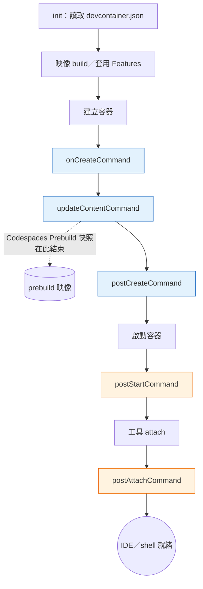

# [FEE-1612] Development Containers（`devcontainer.json`）：可重現的開發環境

:::info
Development Container 是一個由 `devcontainer.json` 描述的容器，能用同一個映像檔承載編輯器工作階段、隊友的編輯器工作階段，以及 CI 執行。containers.dev 上的 Development Containers Specification 定義了檔案格式、生命週期 hook，以及可重用的 Features 機制，並由 VS Code Dev Containers 擴充套件、JetBrains IDE、GitHub Codespaces、DevPod，以及開源的 `@devcontainers/cli` 共同實作。當同一份 `devcontainer.json` 同時驅動本地 IDE、Codespaces 與 CI 時，「在我電腦上可以跑」這類失敗就會消失，因為三個地方使用的是同一個機器產物。
:::

## 背景

Development Containers Specification 是「為容器加上開發專屬內容與設定的開放規範」，發表於 [containers.dev](https://containers.dev/)，並在 [`devcontainers/spec`](https://github.com/devcontainers/spec) 維護。此規範刻意避免取代既有的容器編排格式；它在容器之上加入一層開發階段的 metadata，並為毋須完整編排的專案提供「簡化、不編排的單一容器選項」。設定檔 `devcontainer.json` 是帶註解的 JSON（jsonc），依據 [implementor's spec](https://containers.dev/implementors/spec/)，可以放在 `.devcontainer/devcontainer.json`、`.devcontainer.json`，或 `.devcontainer/<folder>/devcontainer.json`。

同一份產物驅動三個 runtime：應用程式、工具鏈隔離層，以及 CI；規範描述 dev container 為「可用於執行應用程式、隔離與程式庫工作所需的工具/函式庫/runtime，並協助持續整合與測試」。在 IDE 端，[VS Code Dev Containers 擴充套件](https://code.visualstudio.com/docs/devcontainers/containers)把 `devcontainer.json` 視為「如何存取（或建立）開發容器」的契約；而 [JetBrains IDE 讀取相同的檔案格式](https://www.jetbrains.com/help/idea/connect-to-devcontainer.html)，因此單一設定檔便能同時涵蓋同一專案中的 VS Code 與 IntelliJ 使用者。在 IDE 之外，[DevPod](https://devpod.sh/docs/what-is-devpod) 是一個開源用戶端，「重複使用開放的 DevContainer 標準，無論你想用哪種後端都能提供一致的開發體驗」（本地 Docker、遠端 SSH 或雲端皆可），使同一份 `devcontainer.json` 具備可攜的雲端執行能力。

## 情境

某個前端團隊有六位工程師，正在開發一個由 Postgres 與 Redis 支撐的 Next.js 應用。新人入職大約需要一天：安裝對的 Node 主版本、透過 Corepack 安裝對的 pnpm 版本、本地安裝 Postgres、安裝 Redis、把 `.env.example` 複製成 `.env`、跑 migration、塞種子資料，還要在嶄新的 M 系列 Mac 上跟 `node-gyp` 與 Xcode Command Line Tools 搏鬥。完成後，新人仍然無法重現只有某位隊友會遇到的不穩定測試，因為那位隊友還停在 Node 20.11，而其他人上週都升級到 20.12 了。

CI 又是另一回事。GitHub Actions workflow 有自己的 `actions/setup-node@v4` 步驟、自己的 Postgres service-container 區塊，以及客製化的 shell 腳本來安裝 pnpm 並跑 migration。當某個相依套件變更 Node 主版本時，需要更新兩個系統（本地的 README 與 CI workflow），而它們會逐漸偏離。「在我電腦上可以跑」的失敗很常見，「在 CI 上可以跑但本地不行」的失敗也一樣常見，這其實是同一種失敗，只是角色對調。

`devcontainer.json` 把兩種設定收進同一份檔案：基底映像加上 `node:1` Feature 釘住 runtime，`forwardPorts` 讓 Postgres 與 Redis 可達，`postCreateCommand: "pnpm install"` 一次完成相依步驟，而 `devcontainers/ci` GitHub Action 在 CI 中執行同一個容器。新人入職變成「在 IDE 中打開 repo，按下 Reopen in Container」；CI 變成「建置並執行人類使用的同一個 dev container」。

## 最佳實踐

- **必須**讓秘密遠離 `containerEnv`。規範把 `containerEnv` 定義為「為容器設定或覆寫環境變數的一組名稱-值對；容器中所有衍生的程序皆可存取」，而 `remoteEnv` 則「為支援 `devcontainer.json` 的服務／工具（或其子程序）設定或覆寫環境變數，但不影響整個容器」。任何寫進 `containerEnv` 的內容，對容器內所有程序（包括其他工具啟動的程序）都可見；改用 `remoteEnv` 搭配主機的秘密儲存，把每個使用者的秘密以這種方式注入。
- **必須**至少把 Feature 版本釘到主版本標籤。[`devcontainers/features`](https://github.com/devcontainers/features) repo 將 Features 發布為 OCI artifact，標籤如 `:1`、`:1.0`、`:1.0.0`。未釘版本的參考（`ghcr.io/devcontainers/features/node`）會解析為 `:latest` 並悄悄帶入新的 Node 主版本；至少要使用主版本標籤（`:1`）。
- **應該**讓 `postCreateCommand` 具備冪等性。它在容器建立時執行一次，但工程師在迭代設定時會重新執行，Codespaces 在重建 codespace 時也會重新執行。`pnpm install` 與 `npm ci` 本身已具備冪等性；避免使用像 `git init` 這類在第二次執行時會失敗的一次性命令。
- **應該**透過 `@devcontainers/cli` 而非臨時的 `docker build` 來驅動 prebuild 與 CI。[reference CLI](https://github.com/devcontainers/cli) 提供 `devcontainer up`、`devcontainer build`、`devcontainer exec`，以及 `devcontainer run-user-commands`；最後一個會「執行 `postCreateCommand` 等生命週期命令」，工程師若沒有它，就得自己用 shell 重新實作這個動作。
- **可以**使用 `cacheFrom` 指向 registry 映像，而非只仰賴本地 Docker 層快取。`devcontainers/ci` Action 接受 `cacheFrom` 為 registry 參考，這讓另一台 runner 或隊友的機器能命中先前 build 產生的同一份快取。

## 設計思維

核心取捨是映像大小與啟動速度的平衡。完全烤好的映像（Node、pnpm、build tools、language server、Playwright 瀏覽器、Chromium 相依）幾秒內就能啟動容器，但會讓 registry 上的產物與 Codespace 冷啟動都變得肥大。極簡映像加上 `postCreateCommand` 處理所有安裝，雖然小，但要等很久才能進到可用的 IDE。Features 折衷了兩者：每個 Feature 是自包含的安裝單元，能組合到輕薄的基底之上，並因為 Feature 自帶 metadata，可被 Action 的 `cacheFrom` 機制快取。registry 儲存包含 Features 的映像，而應用程式的 `postCreateCommand` 只跑那個輕量、與 repo 相關的步驟（針對已存在的 lockfile 跑 `pnpm install`）。

校準的問題因此變成：「什麼該放進映像、什麼該放進 `postCreateCommand`？」極少變動而且安裝成本高的東西（Node、Postgres client、系統函式庫）屬於映像（或屬於 Feature，最終也成為映像的一部分）。每個 PR 都會變動的東西（相依圖）屬於 `postCreateCommand`，這在熱快取時很快、在冷快取時也可接受。依賴每位使用者或每個 codespace 憑證的東西，則屬於更後段的生命週期——詳見深入探討。

## 深入探討

[JSON reference](https://containers.dev/implementors/json_reference/) 定義了五個獨立的命令 hook。其中三個只在容器建立時執行一次，順序如下：

1. `onCreateCommand`——「三個（連同 `updateContentCommand` 與 `postCreateCommand`）在 dev container 建立時完成容器設定的命令中的第一個」。
2. `updateContentCommand`——緊接 `onCreateCommand` 之後執行，用於刷新會隨原始碼樹狀態而變的內容。
3. `postCreateCommand`——在前兩者之後執行，慣例上用來跑 `npm ci` / `pnpm install` / `bundle install`。

兩個會重複執行：

4. `postStartCommand`——「容器每次成功啟動時都會執行的命令」。
5. `postAttachCommand`——「工具每次成功 attach 到容器時都會執行的命令」。

`onCreateCommand` + `updateContentCommand` 與 `postCreateCommand` 之間的切分，是 prebuild 的關鍵分界。[Codespaces Prebuilds](https://docs.github.com/en/codespaces/prebuilding-your-codespaces/about-github-codespaces-prebuilds) 明確地停在 `updateContentCommand`：「GitHub 會建立一個臨時的 codespace，執行包含 `devcontainer.json` 中 `onCreateCommand` 與 `updateContentCommand` 在內的設定操作。」該快照接著被每個從這個 prebuild 建立的 codespace 重複使用。任何依賴每個 codespace 各自憑證的事（為特定 codespace 簽發的 token、每位使用者各自的 GitHub App 安裝、透過 `remoteEnv` 從使用者主機秘密儲存拉出的遠端秘密）都必須移到 `postCreateCommand`、`postStartCommand` 或 `postAttachCommand`。執行 `onCreateCommand` 的階段不能假設這些憑證已經存在，因為在 prebuild 時，「使用者」是 GitHub 自己。

## 圖解



## 範例

一份對應上述情境的最小化 `.devcontainer/devcontainer.json`：

```jsonc
// .devcontainer/devcontainer.json
{
  "name": "fee-app",
  "image": "mcr.microsoft.com/devcontainers/base:ubuntu-22.04",

  "features": {
    "ghcr.io/devcontainers/features/node:1": {
      "version": "20"
    }
  },

  "forwardPorts": [3000, 5432, 6379],

  "containerEnv": {
    "NODE_ENV": "development",
    "PNPM_HOME": "/home/vscode/.local/share/pnpm"
  },

  "remoteEnv": {
    "GITHUB_TOKEN": "${localEnv:GITHUB_TOKEN}"
  },

  "postCreateCommand": "corepack enable && pnpm install --frozen-lockfile"
}
```

各部分對應規範的用途：

- `image` 提供基底；另一個選項是 `"build": { "dockerfile": "Dockerfile" }`，讓 repo 自己擁有 Dockerfile。
- `features` 從 `ghcr.io/devcontainers/features/node:1` 拉取 Node Feature。依據 [Features repo](https://github.com/devcontainers/features)，Features 是「自包含的安裝程式碼與 dev container 設定單元」，設計上「能安裝到範圍廣泛的基底容器映像之上」；`:1` 標籤把版本釘到主版本。
- `forwardPorts` 讓 port 3000（Next.js）、5432（Postgres）、6379（Redis）在主機上可達。JSON reference 把它定義為「應始終由主容器內部轉發到本機的 port 號或 host:port 值陣列」。支援工具會監看這份清單，並在容器重啟後重新建立轉發。
- `containerEnv` 為容器內每個程序設定 `NODE_ENV` 與 `PNPM_HOME`；兩者都不是秘密，且全域可見會帶來好處。
- `remoteEnv` 只把主機的 `GITHUB_TOKEN` 注入支援工具的程序（例如 VS Code server）；該秘密對容器內任意程序皆不可見。
- `postCreateCommand` 在建立後執行一次；使用 `--frozen-lockfile` 讓它在面對已存在的 lockfile 時具備決定性與冪等性。

複製這個 repo 並按下「Reopen in Container」的隊友，會獲得相同的 Node 20、相同的 pnpm、相同的轉發 port，以及相同的相依圖，而毋須在自己主機上安裝任何一項。

## CI 整合

同一份 `devcontainer.json` 同時驅動 GitHub Codespaces 與 GitHub Actions，這正是這個格式的重點。[GitHub 的 dev container 介紹](https://docs.github.com/en/codespaces/setting-up-your-project-for-codespaces/adding-a-dev-container-configuration/introduction-to-dev-containers)寫得很明白：「當你在 codespace 中工作時，你所處的環境是用一個 development container（dev container）建立、由虛擬機器承載的。dev container 設定中的主要檔案就是 `devcontainer.json`。」因此 Codespaces 實際上就是由 GitHub 託管在 VM 上的 dev container。

對 CI 而言，[`devcontainers/ci`](https://github.com/devcontainers/ci) Action 在 workflow 中執行 repo 的 dev container，建置同一份映像，並透過 `runCmd` 在其中執行任意命令。Action 的 `imageName` + `cacheFrom` + `push` 三件組合啟動「prebuild 一次，到處重用」的模式，Action 的 README 把這點寫得很清楚：如果「你有一個獨立的 workflow……為 dev container 映像做預先建置，你可以在這裡引用它，加速應用程式的 build workflow」。形狀是三個 workflow：

1. **排程主分支映像建置**——以 cron 與 `main` 更新為觸發，將 dev container 映像推送到 registry。
2. **PR workflow**——在 dev container 內執行測試，`cacheFrom` 指向已推送的映像，因而跳過 build。
3. **Codespaces Prebuilds（選用）**——在平台層為人類開發者套用相同的快取概念。

build-and-push workflow：

```yaml
# .github/workflows/devcontainer-build.yml
name: Build dev container image
on:
  push:
    branches: [main]
    paths: ['.devcontainer/**']
  schedule:
    - cron: '0 6 * * 1' # weekly Monday 06:00 UTC

jobs:
  build:
    runs-on: ubuntu-latest
    permissions:
      contents: read
      packages: write
    steps:
      - uses: actions/checkout@v4
      - uses: docker/login-action@v3
        with:
          registry: ghcr.io
          username: ${{ github.actor }}
          password: ${{ secrets.GITHUB_TOKEN }}
      - name: Build and push
        uses: devcontainers/ci@v0.3
        with:
          imageName: ghcr.io/${{ github.repository }}/devcontainer
          cacheFrom: ghcr.io/${{ github.repository }}/devcontainer
          push: always
```

消費這份快取映像的 PR workflow：

```yaml
# .github/workflows/test.yml
name: Test
on: pull_request

jobs:
  test:
    runs-on: ubuntu-latest
    steps:
      - uses: actions/checkout@v4
      - name: Run tests in dev container
        uses: devcontainers/ci@v0.3
        with:
          imageName: ghcr.io/${{ github.repository }}/devcontainer
          cacheFrom: ghcr.io/${{ github.repository }}/devcontainer
          push: never
          runCmd: pnpm test
```

對 Codespaces Prebuilds 而言，GitHub「會建立一個臨時的 codespace，執行包含 `devcontainer.json` 中 `onCreateCommand` 與 `updateContentCommand` 在內的設定操作」，然後對結果取快照。從該 prebuild 建立 codespace「比沒有 prebuild 時快上許多」，因為 clone、映像下載與早期生命週期 hook 都已完成。代價是 prebuild 分鐘數；設計約束則是深入探討中提到的生命週期切分——任何綁定憑證的步驟仍留在 `postCreateCommand` 或之後。

## 內部參考

- [FEE-1609 Local Development Environment Setup](/zh-tw/Developer%20Experience%20and%20Tooling/1609)——以 Docker Compose 編排支撐服務的模式；當專案需要超出單一容器選項的多容器編排時，可與 `devcontainer.json` 互補。
- [FEE-1613 mise](/zh-tw/Developer%20Experience%20and%20Tooling/1613)——多語言工具版本管理器；當完整容器顯得過重，主機端類 `.tool-versions` 釘版本就足夠時適用。
- [FEE-1614 Corepack](/zh-tw/Developer%20Experience%20and%20Tooling/1614)——以每個 Node 專案為單位釘住套件管理器，與容器層次的釘版本互補；這樣 dev container 的 Node Feature 與專案的 Corepack 釘版本對 pnpm/yarn 版本的決定會一致。

## 參考資料

- Development Containers,「Development Containers Specification」, containers.dev (2024). https://containers.dev/
- Development Containers,「devcontainer.json reference」, containers.dev (2024). https://containers.dev/implementors/json_reference/
- Development Containers,「Implementor's specification」, containers.dev (2024). https://containers.dev/implementors/spec/
- devcontainers,「Development Containers Specification (repo)」, GitHub (2024). https://github.com/devcontainers/spec
- devcontainers,「@devcontainers/cli」, GitHub (2024). https://github.com/devcontainers/cli
- devcontainers,「Dev Container Features」, GitHub (2024). https://github.com/devcontainers/features
- devcontainers,「Dev Container Build and Run Action（`devcontainers/ci`）」, GitHub (2024). https://github.com/devcontainers/ci
- Microsoft,「Developing inside a Container」, Visual Studio Code Docs (2024). https://code.visualstudio.com/docs/devcontainers/containers
- JetBrains,「Connect to a Dev Container」, IntelliJ IDEA Help (2024). https://www.jetbrains.com/help/idea/connect-to-devcontainer.html
- Loft Labs,「What is DevPod?」, DevPod Documentation (2024). https://devpod.sh/docs/what-is-devpod
- GitHub,「Introduction to dev containers」, GitHub Codespaces Documentation (2024). https://docs.github.com/en/codespaces/setting-up-your-project-for-codespaces/adding-a-dev-container-configuration/introduction-to-dev-containers
- GitHub,「About GitHub Codespaces prebuilds」, GitHub Codespaces Documentation (2024). https://docs.github.com/en/codespaces/prebuilding-your-codespaces/about-github-codespaces-prebuilds
