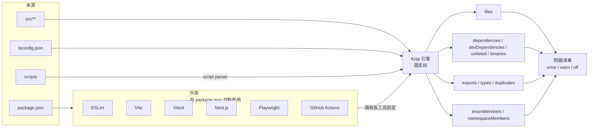

# [FEE-1615] Knip：偵測未使用的檔案、export 與相依套件

:::info
Knip 是一個專案圖（project-graph）層級的 linter，能在 JavaScript 與 TypeScript 專案中找出並修復未使用的相依套件、export 與檔案。它公開了一份具型別的問題分類（檔案、相依套件、export、型別、`enumMembers`、`namespaceMembers`、重複定義等等），會依據 `package.json` 自動啟用對應的外掛，並提供適合 CI 使用的離開碼契約。隨著 ts-prune、depcheck、unimported 與 tsr 都已封存，Knip 已成為專案層級死碼與死相依套件偵測的整合後繼者。
:::

## 背景

Knip 出現之前，這個領域由三個前輩切割：ts-prune 在 TypeScript 專案中尋找未被引用的 export；depcheck 檢視 `package.json` 中未使用或未列出的相依套件；unimported 則找出沒有任何 entry point 能抵達的檔案。每一個都只看到一個切片。這三個工具如今都已封存，連同較新的 tsr 也是如此，作者們紛紛將 Knip 指為後繼者（Knip 文件，「Comparison and migration」）。Knip 自陳的使命是同時找出並修復「未使用的相依套件、export 與檔案」，因為「更少的程式碼與相依套件帶來更佳的效能、更低的維護成本與更容易的重構」（webpro-nl/knip README）。整合之所以重要，在於這四個偵測軸彼此耦合：移除一個未使用的 export 經常會讓某個檔案隨之變成未使用，而那個檔案的消失又會讓某個相依套件變成未使用，單一次的分析就能同時收斂這四個面向。

Knip 將其問題分類發布為一份封閉的規則 key 列舉：`files`、`dependencies`、`devDependencies`、`optionalPeerDependencies`、`unlisted`、`binaries`、`unresolved`、`exports`、`types`、`enumMembers`、`namespaceMembers`、`duplicates` 與 `catalog`（Knip 文件，「Rules and filters」）。這份分類就是設定的表面：每一種都附帶 `error` / `warn` / `off` 的調整旋鈕。本文將說明 Knip 如何組成這個表面、其外掛模型如何自動發現你已在使用的工具，以及設定上的常見地雷藏在哪裡，特別是在 monorepo 裡。

## 情境

一個三年前建立的 TypeScript 程式庫，累積 export 的方式就像閣樓累積紙箱。重構新增了公開函式。被棄用的路徑被標記「之後再刪」，「之後」永遠不來。某個 util 檔的最後一位使用者在六個月前已被刪除，但檔案本身仍隨每一次打包出貨，因為建置流程裡沒有任何環節能證明沒有人 import 它。工程師用 `from ['"]\.\./util/legacy['"]` 的 grep 來回答「還有人在用這個嗎？」並相信沉默就是答案。新進開發者繼續往這堆東西上加，因為證明「沒有人需要這個」的門檻比保留它的門檻高。打包尺寸悄悄上升。`package.json` 仍掛著 `lodash`、`moment`，以及一個 Node 12 時代留下的 polyfill，團隊裡早已沒有人記得它。ESLint 的 `no-unused-vars` 看不見跨檔案的引用，因此對這一切無話可說。打包工具的 tree-shaker 在建置時會把部分死掉的 export 拋掉，卻無法告訴團隊它們曾經存在、無法刪除原始檔，也無法觸碰 `package.json`。Knip 正是運作在這個情境所描述的專案圖層級的 linter：它走過整個 import 圖、套用分類，並把每一種規則分別回報，讓團隊以自己的節奏處理。

## 最佳實踐

- **必須**先正確宣告 `entry` 與 `project`，再去調整其他任何設定。`entry` 列出 import 圖的根；`project` 列出哪些檔案算是納入分析的原始檔。把這兩者寫錯，是誤報的最主要來源（Knip 文件，「Configuration」）。
- **應該**仰賴外掛而不是手動列出工具設定檔。外掛會依據 `package.json` 中的成員自動啟用，並讀取每個工具自身的設定，例如 ESLint 外掛解析 `.eslintrc.json`、Vitest 外掛把 `@vitest/coverage-istanbul` 當作被引用的相依、Next.js 外掛將 `pages/**/*.{js,jsx,ts,tsx}` 加為 entries、Playwright 外掛讀取 `testDir`/`testMatch`、Angular 外掛解析 `angular.json`、GitHub Actions 外掛則解析 workflow YAML（Knip 文件，「Plugins」）。隨附的外掛涵蓋 ESLint、Vite、Vitest、Next.js、Storybook、Playwright、Angular、GitHub Actions、webpack 等數十種工具。
- **應該**用三層模型逐規則調整嚴重度：`error` 會被印出並計入離開碼，`warn` 會以淡色印出但不計入，`off` 則完全壓制（Knip 文件，「Rules and filters」）。新採用的團隊常常先把每個規則設成 `warn`，等程式碼在某一軸上達到零之後，再把該規則升級為 `error`。
- **必須**把 CLI 離開碼當成 CI 的把關契約：0 代表乾淨，1 代表至少有一個 lint 問題，2 代表 Knip 自身失敗（輸入錯誤或內部錯誤）（Knip 文件，「CLI」）。把 1 與 2 混為一談的流程，會在 Knip 崩潰時大聲失敗，而在程式庫退步時無聲失敗。
- **應該**在 CI 執行 `--production`，把預設模式留給本機分流使用。`--production` 會排除測試檔、設定檔、Storybook stories 與 devDependencies。`--strict` 進一步加上 workspace 隔離（只考慮直接相依），並蘊含 production 模式（Knip 文件，「CLI」）。
- **可以**設定 `ignoreExportsUsedInFile: true`（僅根層可用），把僅在自身檔案內被消費的 export 從報告中壓制。當某個內部 helper 為了測試方便而 export，但其他地方並未 import 時，就適合這個設定（Knip 文件，「Handling issues」）。
- **應該**挑選與消費端匹配的 reporter。可用的 reporter 包含 `symbols`（預設）、`compact`、`codeowners`、`json`、`codeclimate`、`markdown`、`disclosure` 與 `github-actions`（Knip 文件，「CLI」）。GitHub Actions 任務適合搭配 `--reporter github-actions` 取得行內註記；以 CodeClimate 為主的儀表板則應採用 `--reporter codeclimate`。

## 設計思維

整合本身就是設計選擇。ts-prune 認得 export，卻拒絕看 `package.json`。depcheck 認得 `package.json`，卻看不見 export。Unimported 知道哪些檔案成了孤兒，對檔案內部毫無意見。一支同時採用三者的團隊要支付三次整合成本：三份設定、三個 CI 步驟、三組誤報，並且仍會錯過跨軸的邊界（一個未使用的檔案保留了某個相依套件唯一的消費者，因此那個相依套件其實也未使用）。Knip 用更厚重的設定表面換取這項代價：一個工具、一份設定、一次掃描、四個軸同時收斂。代價在於使用者必須先理解 `entry` / `project` 模型，輸出才有可信度。好處是四個軸在單一次圖走訪中匯流，自動修復路徑也能安全地一併處理它們。

第二個取捨在於規則層級。把兩個狀態擴成三個（`error` / `warn` / `off`），承認一個成熟的程式庫不可能在第一天就在每一軸上達到零。`warn` 讓團隊在還沒清完佇列時，能印出問題卻不讓 CI 失敗；`off` 讓團隊靜音當下並非優先的軸，又不會丟失其餘報告。代價是某些團隊會無限期地容忍 `warn`；把規則升級為 `error` 的紀律落在團隊身上，工具不負責。

## 深入探討

**Entry 檔的 export。** 預設情況下，位於 entry 檔的 export 會被忽略，Knip 假設 entry 會被外部消費，無法證明其公開介面已死。要回報 entry 檔中未使用的 export，要加上 `--include-entry-exports`。從 entry 檔 export 的 enum 也以同樣方式被預設略過，包括其成員（Knip 文件，「Handling issues」）。忘了這一點會帶來「反向誤報」：entry 檔裡真正的死碼根本沒有被回報。

**自動修復範圍。** `--fix` 刻意維持狹窄。它會移除未使用 export、re-export 與 export 型別上的 `export` 關鍵字；從 `package.json` 移除未使用的 `dependencies` 與 `devDependencies`；並刪除未使用的檔案（Knip 文件，「Auto-fix」）。它**不會**新增未列出的相依套件（那需要人類意圖：那次 import 是不小心，還是真的需要？），也不會修復重複的 export。這項不對稱是刻意的：刪除是安全的，新增則需要意圖。

**`--workspace` 語意。** 對某個 workspace 下手時，會連同它的祖系 workspace 與後代 workspace 一起檢查，「原因有二：祖系 workspace 的 `package.json` 可能列出被檢查 workspace 所使用的相依套件」（Knip 文件，「Monorepos and workspaces」）。把 `--workspace` 想成「這個 workspace 加上它所依賴的那段圖」，而非嚴格的篩選器。

**Script parser。** Knip 會靜態解析 `package.json` 的 `scripts` 與 CLI 參數，在不執行的前提下偵測輸入。第一個位置參數會被視為 entry 檔，`-c`/`--config` 視為設定檔，`--require`/`--loader`/`--import` 則視為執行期相依（Knip 文件，「Script parser」）。這就是為什麼 Knip 能在不啟動 Node 的情況下，辨識出 `node --require ./register.js src/main.ts` 同時引用了 `./register.js` 與 `src/main.ts`。

## 圖解



四個偵測軸（檔案、相依套件、export、成員）匯流到單一的問題清單中。外掛扮演天線的角色：每一個都讀取對應工具自身的設定，把「你正在使用 Vitest」這項事實翻譯成 Vitest 隱含的 entry 檔、被引用的套件，以及 project glob。

## 範例

一個搭配 Vitest 測試的 Next.js 應用。專案的 `knip.json` 看起來像這樣：

```json
{
  "$schema": "https://unpkg.com/knip@5/schema.json",
  "entry": ["src/app/**/page.{ts,tsx}", "src/app/**/layout.{ts,tsx}", "src/middleware.ts"],
  "project": ["src/**/*.{ts,tsx}"],
  "ignoreExportsUsedInFile": true,
  "rules": {
    "files": "error",
    "dependencies": "error",
    "devDependencies": "error",
    "exports": "warn",
    "types": "warn",
    "enumMembers": "warn",
    "duplicates": "error"
  }
}
```

`next` 與 `vitest` 外掛會自動啟用，因為兩個套件都出現在 `package.json` 中（Knip 文件，「Plugins」）。Next.js 外掛貢獻 `pages/**/*.{js,jsx,ts,tsx}` 作為額外 entries；Vitest 外掛貢獻 `*.test.ts` 模式，並認得像 `@vitest/coverage-istanbul` 這類覆蓋率提供者套件。團隊不必把這些細節一一寫出。

`package.json` 帶有一個 script：

```json
{
  "scripts": {
    "knip": "knip"
  }
}
```

CI workflow 以 production 模式執行 Knip，並輸出 GitHub Actions 註記：

```yaml
- name: Knip
  run: pnpm knip --production --reporter github-actions
```

在 CI 中，離開碼就是把關契約：0 讓建置維持綠燈，1 讓建置因 lint 問題失敗，2 讓建置因 Knip 自身的內部錯誤失敗（Knip 文件，「CLI」）。為了讓功能軟啟動一段時間，團隊可以加上 `--no-exit-code`，發布註記但不讓建置失敗：

```yaml
- name: Knip (advisory)
  run: pnpm knip --production --reporter github-actions --no-exit-code
```

當 `error` 等級的規則佇列歸零後，移除 `--no-exit-code` 就能把這道閘鎖上。

## 設定檔結構解析

Knip 的設定是一個分層模型：根 → workspaces → 外掛 → entry/project glob。每一層都有確切的角色。

**根層。** 根層的 `knip.json`（或 `knip.config.ts` 等）承載一小組僅根層可用的選項，套用至整個專案：`exclude`、`include`、`ignoreExportsUsedInFile`、`ignoreWorkspaces`、`workspaces`，再加上 rules 區塊。這些選項沒有 per-workspace 的對應版本；它們塑形整次掃描。

**Entry 與 project。** 兩個基礎 glob 陣列回答不同的問題。`entry` 宣告 import 圖的根，也就是 Knip 開始走訪的檔案。`project` 宣告哪些檔案算是納入分析的原始檔，因此在沒有任何 entry 抵達它們時，會成為被標記為未使用的候選。前綴 `!` 代表否定（Knip 文件，「Configuration」）。常見錯誤是把所有東西塞進 `entry`，這會讓 Knip 把每個檔案都視為圖的根，最後什麼都不會被回報為未使用。

**外掛。** 外掛在 `entry` / `project` 之上疊加，依據它們所讀取的工具設定貢獻額外的 entries、project glob 與被引用的相依套件。當對應的套件出現在 `package.json` 的相依清單中時，外掛會自動啟用，並解析該工具自身的設定，找出被引用的相依套件，從而判定哪些是未使用的、哪些是未列出的（Knip 文件，「Plugins」）。已經設定好 ESLint、Vite、Vitest、Next.js、Storybook、Playwright、Angular、GitHub Actions 或 webpack 的團隊，等於讓這些設定被沿用，無需重述。

**Workspaces（monorepo 地雷）。** 在 monorepo 中，根層的 `entry` 與 `project` 選項會**被忽略**。承載它們的，是名為 `"."` 的 workspace。Workspaces 從 `package.json#workspaces`、`pnpm-workspace.yaml`，或 Knip 自己的 `workspaces` 設定中被發現；每個 workspace 會繼承同一份預設設定（Knip 文件，「Monorepos and workspaces」）。一份 monorepo 的 `knip.json`：

```json
{
  "$schema": "https://unpkg.com/knip@5/schema.json",
  "ignoreExportsUsedInFile": true,
  "workspaces": {
    ".": {
      "entry": ["scripts/**/*.ts"],
      "project": ["scripts/**/*.ts"]
    },
    "apps/web": {
      "entry": ["src/app/**/page.tsx", "src/middleware.ts"],
      "project": ["src/**/*.{ts,tsx}"]
    },
    "packages/ui": {
      "entry": ["src/index.ts"],
      "project": ["src/**/*.{ts,tsx}"]
    }
  }
}
```

把 `entry` 與 `project` 放在一個有 workspace 的專案根層，會無聲地讓根層完全沒有東西被分析。這些選項在 schema 上存在，卻在那個位置被忽略。`"."` 這個 key 才是修法。

**鎖定單一 workspace。** `--workspace apps/web` 會對 `apps/web` 加上其祖系與後代執行，因為祖系 workspace 可能宣告了被檢查 workspace 所使用的相依套件（Knip 文件，「Monorepos and workspaces」）。它並非嚴格的篩選器。

**Entry 檔的 export。** Entry 檔內的 export 預設會被忽略。加上 `--include-entry-exports`（或在設定檔中設定等價選項）即可一併回報；當程式庫其他地方都已乾淨、團隊想浮出 entry 中那塊死掉的公開介面時，這就是正確的時機（Knip 文件，「Handling issues」）。

## 內部參考

- [FEE-705 程式碼分割、延遲載入與 Tree Shaking](/zh-tw/Performance/705)：打包時的 tree-shaking 會把死碼從建置輸出中剔除；Knip 是專案圖層級的對應物，於原始碼層級回報死碼，使其能被刪除。
- [FEE-1601 Linting 與靜態分析](/zh-tw/Developer%20Experience%20and%20Tooling/1601)：ESLint 與 TypeScript 一次只看一個檔案；Knip 走訪整個專案圖，這正是 `no-unused-vars` 無法取代它的原因。
- [FEE-1602 程式碼格式化與 EditorConfig](/zh-tw/Developer%20Experience%20and%20Tooling/1602)：相鄰的程式碼衛生工具，與 Knip 跑在同一條 pre-commit / CI 線上。

## 參考資料

- webpro-nl, "Knip — Find unused files, dependencies, and exports," GitHub README (2026). https://github.com/webpro-nl/knip
- Knip, "Configuration," Knip documentation (2026). https://knip.dev/reference/configuration
- Knip, "CLI," Knip documentation (2026). https://knip.dev/reference/cli
- Knip, "Rules and filters," Knip documentation (2026). https://knip.dev/features/rules-and-filters
- Knip, "Plugins," Knip documentation (2026). https://knip.dev/explanations/plugins
- Knip, "Monorepos and workspaces," Knip documentation (2026). https://knip.dev/features/monorepos-and-workspaces
- Knip, "Auto-fix," Knip documentation (2026). https://knip.dev/features/auto-fix
- Knip, "Script parser," Knip documentation (2026). https://knip.dev/features/script-parser
- Knip, "Handling issues," Knip documentation (2026). https://knip.dev/guides/handling-issues
- Knip, "Comparison and migration," Knip documentation (2026). https://knip.dev/explanations/comparison-and-migration
