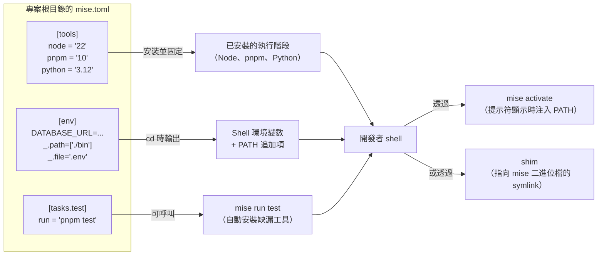

# [FEE-1613] mise（與 asdf）：多語言工具與環境版本管理

:::info
`mise` 是一套多語言 CLI 工具，從單一 `mise.toml` 檔案統一管理開發工具、環境變數與專案任務，取代多數倉庫累積出的 `nvm` + `pyenv` + `tfenv` + `direnv` 加上腳本執行器的組合。它能安裝並切換數百種執行階段（Node、Python、CMake、Terraform 等），並在每個指令執行前先準備好環境。本文說明 `mise.toml` 的結構、何時偏好 `mise activate` 而非 shim、`mise` 與 `asdf` 及 `nvm`/`fnm` 的差異，以及如何固定浮動版本號以確保每次取出倉庫時的可重現性。
:::

## 背景

前端倉庫鮮少只依賴 Node。一份典型的產品倉庫會拉入 Node 執行階段、套件管理器、用於程式碼產生的 Python 工具鏈，以及 Terraform 或 `kubectl` 等基礎設施二進位檔。歷史上每個執行階段都有自己的版本管理器：Node 使用 `nvm` 或 `fnm`、Python 使用 `pyenv`、Terraform 使用 `tfenv`，再搭配 `direnv` 處理依目錄而異的環境變數。`asdf`（asdf-vm.com）於 2014 年透過引入外掛模型與 `.tool-versions` 檔案整合了版本管理層，但仍只是執行階段工具，環境變數與任務執行依然散落在他處。

`mise`（jdx/mise）是以 Rust 重寫的版本，將整合再向前推進。專案描述把三項職責歸於同一支 CLI：「Dev tools, env vars, and tasks in one CLI」，而執行階段模型是「`mise` prepares your development environment before each command runs」。設定寫在 `mise.toml`，三個一級區段 `[tools]`、`[env]` 與 `[tasks.*]` 把上述四件式工具堆換成一份倉庫提交給團隊共享的檔案。

## 情境

某個 monorepo 底下兩個倉庫並列。Web app 需要 Node 22 加上 pnpm 10。舊版管理後台卡在 Node 20 加上 Yarn。共用的 `infra/` 目錄需要 Python 3.12 做程式碼產生，並使用 Terraform 部署。團隊目前要求每位新人安裝 `nvm`、`fnm`（因為有人偏好它）、`pyenv`、`tfenv` 與 `.envrc` 載入器，再記住哪個目錄會觸發哪個管理器。新人入職要花掉半天，README 還有一段「若 `node` 解析到錯誤版本，請執行……」的疑難排解。

各專案根目錄提交一份 `mise.toml` 即可取代以上一整套。`[tools]` 依目錄固定執行階段版本；當開發者在多個倉庫之間 `cd` 移動時，`mise` 會自動切換，因為 `mise.toml` 是分層的，靠近 CWD 的目錄設定會覆寫上層目錄設定。`[env]` 把過去寫在 `.envrc` 的 DATABASE_URL 與 PATH 追加項輸出。`[tasks.*]` 取代 Makefile 或頂層 `package.json` 的腳本別名。新人只需安裝一支二進位檔，四個版本管理器就此消失。

## 最佳實踐

- **必須**在每個需要可重現執行階段的專案根目錄提交 `mise.toml`；倚靠它的階層解析（子目錄覆寫上層），讓 monorepo 在 web-app 根目錄固定 Node 22、在管理後台根目錄固定 Node 20，互不衝突。
- **必須**在提交前固定浮動別名。`mise use --pin node@lts` 會把解析後的精確版本寫入 `mise.toml`（例如寫成 `node = "22.11.0"` 而非 `node = "lts"`），讓每次取出都安裝相同執行階段。設定 `MISE_PIN=1` 可讓 `mise use` 預設啟用固定行為。
- **應該**對互動式 shell 使用 `mise activate`（每次提示符顯示時注入 PATH），而非 shim 模式。維護者明確指出：shim 會破壞 unix 的 `which` 指令（指到 shim 而非實際執行檔），`mise` 中定義的環境變數只對 mise 工具可見，且大多數 shell hook 在 shim 下不會觸發。
- **應該**把跨執行階段的重複指令定義為 `[tasks.*]` 而非 npm scripts。透過 `mise` 啟動的任務會「include the mise environment — your tools and env vars defined in `mise.toml`」，且 `mise` 在執行前會自動安裝缺漏的工具，使同一個任務指令在筆電與 CI 之間保持一致，無須額外的安裝腳本。
- **應該**把專案層級的密鑰與 DATABASE_URL 之類變數放進 `[env]`，讓 `mise` 在 `cd` 時載入，而非另外執行 `direnv`。當 `mise` 啟用後，「it will automatically set environment variables in the current shell session when you `cd` into a directory」，已涵蓋 direnv 的主要使用情境。
- **可以**在遷移期間保留既有的 `.tool-versions` 或 `.nvmrc`。`mise` 兩者都讀取，但僅作為過渡輔助；維護者表明「in general compatibility with asdf is no longer a design goal」，因此別把長期外掛相容性納入規劃。

## 設計思維

`mise` 最具影響力的設計選擇是它如何攔截工具呼叫。存在兩種機制，彼此之間有取捨：

**Shim 模式**會在 `PATH` 上某個目錄擺放小型可執行 shim。當你執行 `node`，shim 先執行、向 `mise` 詢問此專案要的版本，再 exec 真正的 `node`。Shim 具備通用性，任何 shell、任何 IDE、任何子行程都能運作，因為它們是 `PATH` 上的純可執行檔。代價是把管線露在外面：`which node` 會解析到 shim 路徑，遮蔽真正的二進位檔；`mise` 中定義的環境變數只會注入到 mise 管理的工具中（透過 shim 呼叫的 Python 腳本看得到正確的 `python`，但看不到 `[env]` 區段）；多數 shell hook（`chpwd`、提示符 hook、補全觸發器）不會觸發，因為 shim 是一次性的 exec，並非互動事件。

**`mise activate`（PATH 注入）模式**會掛入 shell 提示符：每次提示符重繪時，`mise` 重新評估專案的 `mise.toml`，並改寫當前 shell 的 `PATH` 與環境。`which` 維持準確、`[env]` 區段套用至會話中所有指令（不限於 mise 管理的工具），shell hook 也能正常觸發，因為使用者與執行檔之間沒有 shim 介入。代價在於啟用是 shell 專屬的，需要在 `.zshrc` 或 `.bashrc` 加上一行；非互動情境（CI runner 直接 spawn `node`、GUI 啟動器、未載入 shell rc 的 IDE）則無法套用。

維護者的建議與此取捨一致：互動式 shell 用 PATH（`mise activate`），其他場合則用 shim。多數團隊兩者並用，在 `.zshrc` 啟用 `mise activate`，並把 shim 放在 `PATH` 作為 IDE 與 GUI 啟動器的後備。

## 深入探討

**兩種啟用模式並列**。呼叫 `mise activate` 會新增一個 hook，「updates environment variables every time the prompt is displayed. In particular, it updates the `PATH` environment variable」，使正確的執行階段優先解析。Shim 模式則是放置「small executables (`shims`) in a directory that is included in your `PATH`」，每個 shim 是薄包裝，會重新 exec `mise` 解析正確的二進位檔。兩者可以同時運作，並無互斥。

**自動 reshim**。在 `asdf` 世界裡，shim 以「每次安裝後都得手動 `asdf reshim`」聞名。`mise` 拒絕此項使用體驗：「`mise` already runs a reshim anytime a tool is installed/updated/removed」。手動 `mise reshim` 是當 `~/.local/share/mise/shims` 失同步時的修復指令，並非安裝流程的步驟。從 `asdf` 過來的新使用者通常略過手動 reshim，仍能正常運作。

**任務執行器內部機制**。`mise tasks` 不只是腳本別名。執行器透過每個任務的 `depends` 清單支援「building dependencies in parallel — by default with no configuration required」，並透過 `sources` 與 `outputs` 宣告支援「last-modified checking to avoid rebuilding when there are no changes — requires minimal config」。組合之下，`mise.toml` 成了小型 Make 替代品：`[tasks.build]` 搭配 `sources = ["src/**/*.ts"]` 與 `outputs = ["dist/**"]` 在原始碼未變動時略過重新執行，`depends = ["compile-protos"]` 則讓獨立相依任務在多核之間展開，無需另外的協調器。

## 圖解



## 範例

一份帶 Python 程式碼產生的前端服務的實際 `mise.toml`：

```toml
[tools]
node = "lts"
pnpm = "10"
python = "3.12"
terraform = "1.9"

[env]
DATABASE_URL = "postgres://localhost/dev"
NODE_ENV = "development"
_.path = ["./bin"]
_.file = ".env"

[tasks.test]
run = "pnpm test"

[tasks.build]
depends = ["codegen"]
sources = ["src/**/*.ts"]
outputs = ["dist/**"]
run = "pnpm build"

[tasks.codegen]
run = "python scripts/codegen.py"
```

有三點值得說明：

1. `_.path = ["./bin"]` 會把專案的 `./bin` 目錄加入 `PATH`；相對路徑以 `config_root` 為基準解析，因此即使開發者在子目錄執行，也仍能在 `PATH` 上看到專案根目錄的 `./bin`。
2. `_.file = ".env"` 會把 `.env` 中的 dotenv 風格變數載入會話，取代另外設置的 `direnv`。
3. `node = "lts"` 是浮動別名。要讓每次取出可重現，執行一次 `mise use --pin node@lts`。指令會把別名解析為精確版本（例如 `22.11.0`），並改寫成 `node = "22.11.0"`。提交此變更後，從此每位開發者與 CI runner 都安裝同一版 Node，即使上游推出新的 LTS 也是如此。

同一份 `mise.toml` 在 CI 中亦可運作：單一 `mise install` 步驟取代 Node + Python + Terraform 設定動作的矩陣。任務（如 `mise run build`）繼承相同環境，CI 呼叫的指令與開發者本機輸入完全相同。

## mise、asdf 與 nvm/fnm 的對照

| 面向 | mise | asdf | nvm / fnm |
|------|------|------|-----------|
| 範疇 | 多語言（Node、Python、Terraform、CMake，數百種以上） | 透過外掛支援多語言 | 僅 Node |
| 設定檔 | `mise.toml`（同時讀取 `.tool-versions`、`.nvmrc`、`.node-version`） | `.tool-versions` | `.nvmrc`（nvm）、`.nvmrc` / `.node-version`（fnm） |
| 環境變數注入 | 一級 `[env]` 區段，`cd` 時自動載入 | 無（搭配 `direnv`） | 無（搭配 `direnv`） |
| 任務執行器 | 內建 `[tasks.*]`，支援平行化與基於最後修改時間的閘控 | 無 | 無 |
| 後端／外掛模型 | 偏好 aqua、ubi、npm、cargo、pipx、go；asdf 外掛雖被接受，但基於供應鏈考量，新工具大多遭拒 | 每個工具一個 asdf-plugin Git 倉庫 | 寫死的 Node 發行版下載 |

表格無法承載的幾項補充：

- 文件將 `mise` 描述為「a drop-in replacement for `nvm`」：除了 `mise.toml`，它也讀取 `.nvmrc` 與 `.node-version` 檔案，因此倉庫採用 `mise` 時不必強迫所有貢獻者立刻遷移 `.nvmrc`。
- `mise` 會讀取 `asdf` 的 `.tool-versions`，但維護者表示 asdf 相容性「no longer a design goal」。請把對 `.tool-versions` 的支援視為遷移輔助，並非長期承諾。
- 新的 `asdf` 與 `vfox` 外掛「almost never accepted for supply-chain security reasons」。建議的後端是 `aqua`（功能與安全性最完整、不需外掛）、`ubi`、`npm`、`cargo`、`pipx` 與 `go`。從 `asdf` 遷移意味著要把每個工具改指向非 asdf 後端，而非把外掛 URL 搬過去。

## 內部參考

- [本地開發環境設定](/zh-tw/Developer%20Experience%20and%20Tooling/1609) — `mise` 嵌入的整體本地開發面；FEE-1609 涵蓋 `mise` 取代的 `nvm`/`fnm` 基線。
- [Corepack](/zh-tw/Developer%20Experience%20and%20Tooling/1614) — `package.json` 的 `packageManager` 欄位固定套件管理器版本；`mise` 固定執行階段。兩者可組合：用 `mise` 安裝 Node/pnpm，用 Corepack 鎖定當前套件管理器版本。
- [開發容器](/zh-tw/Developer%20Experience%20and%20Tooling/1612) — 當可重現性需要 OS 層級隔離（系統函式庫、服務）時改採 devcontainer；`mise` 在不引入容器邊界的情況下涵蓋執行階段加環境變數層。

## 參考資料

- jdx, "mise — Dev tools, env vars, and tasks in one CLI," GitHub (2026). https://github.com/jdx/mise
- jdx, "Configuration | mise," mise documentation (2026). https://mise.jdx.dev/configuration.html
- jdx, "Node.js | mise," mise documentation (2026). https://mise.jdx.dev/lang/node.html
- jdx, "Shims | mise," mise documentation (2026). https://mise.jdx.dev/dev-tools/shims.html
- jdx, "Environments | mise," mise documentation (2026). https://mise.jdx.dev/environments/
- jdx, "Tasks | mise," mise documentation (2026). https://mise.jdx.dev/tasks/
- jdx, "Registry | mise," mise documentation (2026). https://mise.jdx.dev/registry.html
- jdx, "FAQ | mise," mise documentation (2026). https://mise.jdx.dev/faq.html
- jdx, "`mise use` | mise," mise documentation (2026). https://mise.jdx.dev/cli/use.html
- asdf contributors, "asdf — Manage multiple runtime versions with a single CLI tool," asdf-vm.com (2026). https://asdf-vm.com/
