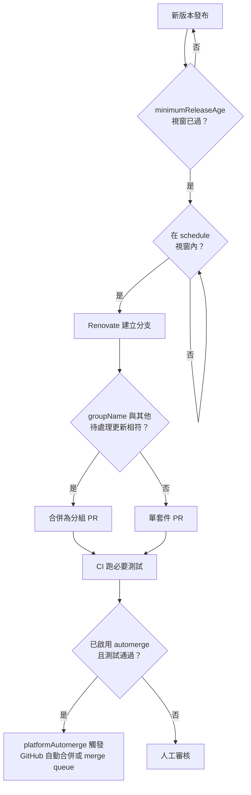

# [FEE-1616] 前端 repo 的 Renovate 設定

:::info
Renovate 是一款自動化相依套件更新機器人，能在 90 多種套件管理器（包含 npm、pnpm、Yarn、GitHub Actions、Docker 等）上開立 PR。一個前端 repo 通常每週會收到數十個更新 PR；若沒有分組、排程與條件式自動合併（gated automerge），審核佇列會難以處理。本文示範如何為典型的前端 monorepo 或單一套件 webapp 設定 Renovate，使用 `config:recommended`、`packageRules`、`schedule`、`lockFileMaintenance`、`minimumReleaseAge` 與 automerge，並校準到每週的 PR 數量貼近人類實際需要做出判斷的決策數量。
:::

## 背景

Renovate 是一個長期維運的開源專案，「協助你更新程式碼中的相依套件，無需手動處理」、支援「90 多種套件管理器」、並「直接把更新 PR 送進你的 repo」（renovatebot/renovate README）。設定模型為 JSON（或 JSON5/JavaScript），透過可分享的 preset 組合：`extends` 陣列引用具名 preset，使 repo 能繼承標準基線而無需重新定義選項。目前的標準基線是 `config:recommended`，本身即綁定了 Dependency Dashboard（一個由機器人維護的單一 GitHub issue，列出所有待處理、被速率限制與需核准的更新，並附有可觸發或核准的核取方塊）、語意化前綴 commit、忽略的模組與測試、`group:monorepos`、`group:recommended`、release 年齡信心徽章與 digest changelog 輔助工具。早期的文章與 Renovate 範例會引用 `config:base`；該名稱已是舊稱，由 `config:recommended` 取代。同樣地，舊有的 `stabilityDays` 選項已更名為 `minimumReleaseAge`；新設定應採用新名稱。

Renovate 有兩種常見的使用方式。多數託管在 GitHub 上的 repo 會安裝免費、由 Mend 代管的 Renovate GitHub App，讓機器人在 Mend 的基礎設施上針對組織的 repo 執行；repo 端不需要任何 CI job 或 runner。需要存取內部 registry 網路、跑在 GitLab 或 Bitbucket 上、或希望由 CI 系統自行掌控執行流程的 repo，則會改為自架 Renovate，使用 `npx renovate`、官方的 `renovatebot/github-action`，或是排程執行的 GitLab CI job。無論由哪種 runner 執行，讀取的都是同一份放在 repo 根目錄的 `renovate.json`；下方的「範例」即為該檔案，在兩種 runner 下皆可原樣套用。

Renovate 與 Dependabot 預設都是每個相依套件更新開一個 PR，兩者也都因此設有流量上限。Dependabot 預設把開啟中的版本更新 PR 上限設為 5；一旦達到五個，便會停止建立新的，直到部分被關閉或合併。Renovate 則提供 `prHourlyLimit` 與 `prConcurrentLimit`，基於同樣的理由節流分支與 PR 的建立。分組（`groupName`）、排程（`schedule`）與條件式 automerge 之所以存在，是因為未分組的更新量是兩款工具都有記載的失敗模式：一個擁有共用 `pnpm-workspace.yaml`、且包含大量 devDependency 型工具套件（ESLint plugin、`@types/*`、Storybook addon）的前端 repo，除非把這些 PR 分組，否則每個 patch release 都會各自產生一個 PR，這正是本文所要設定因應的情境。

## 視覺對比



## 範例

一份針對擁有共用 `pnpm-workspace.yaml` 的前端 webapp 的逐字 `renovate.json`：

```json
{
  "$schema": "https://docs.renovatebot.com/renovate-schema.json",
  "extends": [
    "config:recommended",
    "config:js-app"
  ],
  "schedule": ["before 5am on monday"],
  "timezone": "UTC",
  "minimumReleaseAge": "3 days",
  "lockFileMaintenance": {
    "enabled": true,
    "schedule": ["before 5am on monday"]
  },
  "packageRules": [
    {
      "matchPackageNames": ["eslint**", "@typescript-eslint/**"],
      "groupName": "eslint"
    },
    {
      "matchPackageNames": ["@types/**"],
      "groupName": "type definitions"
    },
    {
      "matchPackageNames": ["storybook**", "@storybook/**"],
      "groupName": "storybook"
    },
    {
      "matchDepTypes": ["devDependencies"],
      "matchUpdateTypes": ["minor", "patch"],
      "automerge": true
    },
    {
      "matchManagers": ["github-actions"],
      "matchUpdateTypes": ["digest", "minor", "patch"],
      "automerge": true
    },
    {
      "matchDepTypes": ["dependencies"],
      "matchUpdateTypes": ["major"],
      "dependencyDashboardApproval": true
    }
  ]
}
```

對照研究內容逐項說明這份設定做了什麼：

1. `extends` 拉入 `config:recommended`（Dependency Dashboard、語意化 commit、monorepo 分組、推薦分組）與 `config:js-app`（`:pinAllExceptPeerDependencies`，讓應用程式 `package.json` 的範圍 pin 在精確版本）。
2. `schedule` 把分支與 PR 建立限制在週一清晨；平日早上不會有機器人 PR。
3. `minimumReleaseAge: "3 days"` 阻擋 Renovate 在 release 發布滿三天前提出升級，降低剛發布的惡意套件風險。
4. `lockFileMaintenance` 在同一個週一視窗執行，刷新 `pnpm-lock.yaml`（以及任何同層的 `package-lock.json` / `yarn.lock`）以套用傳遞性更新。
5. 前三條 `packageRules` 使用 `matchPackageNames` 萬用字元樣式搭配 `groupName`，把 ESLint、`@types/*` 與 Storybook 的更新各自合併為單一 PR。
6. 第四條規則對非 major 的 devDependency 更新啟用 `automerge`；Renovate 會等待必要測試通過後再合併。
7. 第五條規則把 automerge 延伸到 GitHub Actions 的 digest、minor 與 patch 升版；以 digest 釘版的 action 更新風險低，且應持續跟進。
8. 最後一條規則把 production 相依套件的 major 更新放在 `dependencyDashboardApproval` 後面，要求在 dashboard issue 上人為打勾後 PR 才會被開啟。

`packageRules` 會對符合條件的套件套用條件式設定；此處用到的 match 屬性（`matchPackageNames`、`matchDepTypes`、`matchUpdateTypes`、`matchManagers`）皆是文件記載的 match key。`matchPackageNames` 在同一個陣列中同時接受精確名稱、萬用字元樣式與 `/regex/` 樣式；它吸收了舊有的 `matchPackagePatterns` 選項，Renovate 的設定遷移工具現在會自動把該選項改寫為 `matchPackageNames`。此處用到的 `matchUpdateTypes` 值（`major`、`minor`、`patch`、`digest`）只是文件列舉值的一部分，完整列舉還包含 `pin`、`pinDigest`、`lockFileMaintenance`、`rollback`、`bump` 與 `replacement`。

## 最佳實踐

- **必須**讓每份設定以 `extends: ["config:recommended"]` 開頭。該 preset 啟用 Dependency Dashboard、語意化 commit、`group:monorepos`、`group:recommended` 以及忽略測試與模組目錄；手動重新推導這些設定既浪費時間又會與上游脫節。
- **必須**選對 webapp/library preset。應用 repo 使用 `config:js-app`（會加上 `:pinAllExceptPeerDependencies`，讓應用以 pin 住的版本執行）；函式庫使用 `config:js-lib`（加上 `:pinOnlyDevDependencies`，讓 runtime 範圍對下游消費者保持寬鬆）。
- **應該**在 `packageRules` 中使用 `groupName` 收攏相關更新。把 `eslint*`、`@typescript-eslint/*`、`storybook*`、`@types/*` 與 `vite*` plugin 群各自合併成一個 PR。Renovate 內建 `group:recommended` 與 `group:monorepos`，自訂 group 則涵蓋專案特定的套件群。
- **應該**設定 `schedule` 視窗（例如 `"before 5am on monday"`），讓 PR 在審核時段之外送達。Renovate 接受自然語言視窗，例如 `"every weekend"` 或 `"after 10pm and before 5am every weekday"`。
- **應該**為 `lockFileMaintenance` 設定獨立排程。Renovate 的 npm manager 會刷新 `package-lock.json`、`pnpm-lock.yaml` 與 `yarn.lock`，攔下任何頂層 `dependencies` 變更不會帶出的傳遞性安全修補。
- **應該**為非小型的 production 相依套件把 `minimumReleaseAge` 設為 `"3 days"` 或 `"5 days"`。此選項會在 release 發布後的設定視窗內抑制 PR 建立，讓剛發布的惡意或損毀版本有時間被發現並下架，再讓機器人開 PR。
- **應該**讓 `automerge` 條件取決於必要測試。Renovate「會等待必要測試通過後才執行 automerge」。預設情況下，`platformAutomerge` 會在必要檢查通過後，把合併動作委派給 GitHub 原生的自動合併；若 repo 使用 merge queue，PR 會先進入佇列，而非直接合併。
- **應該**為 devDependencies 的非 major 更新啟用 `automerge`，並在套用到 production 相依套件之前要求充分的測試覆蓋率。Renovate 文件直白寫道：automerge「對 `devDependencies` 通常運作良好，對 production `dependencies` 也能運作，但專案應有良好的測試覆蓋率」。
- **可以**仰賴 Renovate 的 npm manager 浮現 `packageManager` 更新。當 Renovate 在 `package.json` 偵測到 Yarn 的 `packageManager` 設定時，會透過 Corepack 安裝該處 pin 住的 Yarn 版本。
- **可以**改用 `config:best-practices` 取代 `config:recommended`，取得更嚴格的基線。該 preset 在 `config:recommended` 之上疊加了 `docker:pinDigests`、`helpers:pinGitHubActionDigests`、`:configMigration`、`:pinDevDependencies`、`abandonments:recommended`、`security:minimumReleaseAgeNpm` 與 `:maintainLockFilesWeekly`。它會把 GitHub Actions 與 Docker image pin 到 digest，這正是上方「範例」中 digest automerge 規則之所以有意義的原因；同時它也內建了 npm 專屬的最小 release 年齡預設值，不必再像這裡一樣手動設定 `minimumReleaseAge` 這一行。

## 設計思維

核心校準是審核負擔對比供應鏈風險。立刻拉進每個 patch 並啟用完整 automerge，能把延遲壓到最低，代價是惡意或損毀的 release 可能在發布幾分鐘內就進入 production。對每個 patch 採人工審核可以消除這個時間窗，卻會產生難以維持的 PR 流量：每次 release 每個相依套件更新就是一個 PR，這正是 Dependabot 的 5-PR 上限與 Renovate 的 `prHourlyLimit` / `prConcurrentLimit` 存在的原因。

`minimumReleaseAge` 加上對非 major devDependencies 的條件式 automerge，是常見的平衡點。release 年齡視窗仰賴社群在機器人提出升級之前偵測出問題發布（被 yank 的版本、GitHub issue、advisory）；條件式 automerge 則要求專案自身的 CI 在 PR 落地前驗證沒有壞掉。對 production 相依套件而言，取捨更緊：automerge 需要測試覆蓋足以攔下回歸，許多團隊在原則上把 production 的 major 更新保留為完全人工。`groupName` 分組與 `schedule` 排程是獨立的調節桿，能在不改變安全姿態的前提下降低雜訊。

2025 年 9 月，一個遭入侵的維護者帳號被用來發布 `chalk`、`debug` 等廣為依賴的 npm 套件的惡意版本；另一波名為 Shai-Hulud 的自我複製攻擊，則竊取並重複使用 npm publish token，入侵了超過 500 個套件（CISA alert，2025 年 9 月）。這兩波攻擊中，個別惡意版本通常在發布後數小時到數天內就被發現並從 registry 下架。2026 年一份關於 cooldown 的分析引用了一項針對十起歷史供應鏈攻擊的研究，其中八起的曝險時間窗都在一週以內，並得出結論：七天的 cooldown 本可擋下這十起攻擊中的多數（Nesbitt, 2026）。同一批事件也推動了整個生態系採用 cooldown：Dependabot 在 2025 年 7 月推出可設定的 `cooldown` 區塊，並於 2026 年 7 月把 3 天 cooldown 訂為預設值；pnpm 則在套件管理器這一層提供等效的 `minimumReleaseAge` 設定（預設為一天）。由於 2025 年 9 月那幾波攻擊中的惡意版本通常在發布後數小時到數天內就被下架，三到五天的視窗已經涵蓋了這段曝險期的大部分。

Renovate 的 `vulnerabilityAlerts` 與 `osvVulnerabilityAlerts` 選項在此之上另外提供一條獨立的管道。它們分別依據 GitHub 安全性警示與 OSV 查詢結果開立 PR，且不受 `minimumReleaseAge` 等待期限制，因為一個已知有漏洞的版本，並不會因為多等待而受益。

## 深入探討

`rangeStrategy` 控制 Renovate 如何改寫 `package.json` 中的範圍限制。允許值為 `auto`、`pin`、`bump`、`replace`、`widen`、`update-lockfile` 與 `in-range-only`。`auto` 讓 Renovate 採用各 manager 的預設；`pin` 把範圍收攏為精確版本（搭配 `config:js-app`）；`bump` 在保留範圍語意的前提下提高下界；`widen` 擴大上界（適合 peer-dependency 樣式的範圍）；`replace` 只在新版本落在既有範圍之外時才替換範圍；`update-lockfile` 對範圍內的更新只調整鎖定的版本，當新版本落在既有範圍之外時則退回使用 `replace`；`in-range-only` 完全不會提出範圍之外的版本，直接捨棄任何需要變更 `package.json` 的更新。函式庫作者通常會將 `config:js-lib` 與 `peerDependencies` 上的 `widen` 或 `bump` 策略結合，以保持下游相容性的寬度。

npm manager 有兩個值得指名的互動。第一，`packageManager` 欄位被視為一種獨立的 dependency type，因此 Renovate 開立 `packageManager: "yarn@4.5.1"` 升版 PR 的方式，與處理 `react` 升版相同。第二，「若 Renovate 在 `package.json` 偵測到 Yarn 的 `packageManager` 設定，便會使用 Corepack 安裝 Yarn」。Renovate runner 不假設環境已全域安裝 Yarn。這讓 Renovate 開箱即可相容於 Corepack 驅動的 monorepo（參見 [FEE-1614 Corepack](/zh-tw/Developer Experience and Tooling/corepack)）。就 pnpm 而言，npm manager 能理解 `pnpm-workspace.yaml`，並把 pnpm catalog 與 `pnpm.overrides` 視為它會直接更新的一等 dependency type，而不只是透過 `lockFileMaintenance` 刷新 `pnpm-lock.yaml`。pnpm 本身在套件管理器這一層也有自己的 `minimumReleaseAge` 設定；在 pnpm v11 中預設開啟，能獨立延遲一個 Renovate 已經提出、但實際安裝時尚未解析完成的版本。

## Renovate 與 Dependabot 對照

Renovate 與 Dependabot 解決同一類表面問題，但預設值不同。Renovate 發布了自家的標準對照；下表彙整對前端 repo 重要的維度，依據該對照、Dependabot 自身的設定文件，以及一份 2026 年發布的獨立第三方比較。

| 維度                | Renovate                                                                             | Dependabot（GitHub）                                                                          |
| ------------------- | ------------------------------------------------------------------------------------- | ------------------------------------------------------------------------------------------- |
| 相依套件分組        | 透過 `group:recommended` / `group:monorepos` 開箱即用；每條規則可自訂 `groupName`，並以 `matchPackageNames` 的萬用字元或 regex 比對。 | 透過手動撰寫的 `groups` 支援，包含 `multi-ecosystem-groups`；預設不隨附社群 preset 函式庫。 |
| Monorepo 支援       | `group:monorepos` preset 無需額外設定，即可把常見 monorepo 套件（如 Babel、Jest）合併在同一 PR 升版。 | 沒有對應 preset；可用 `directories` 萬用字元搭配手動撰寫的 `groups` 近似達成相同效果，但每種組合都需要手動撰寫。 |
| Dependency Dashboard | 預設啟用。以單一 issue 列出所有待處理、被速率限制與需核准的更新。                       | 沒有 dashboard issue；狀態僅以 PR 與 Insights 分頁呈現。                                     |
| 排程粒度            | 可依套件、依 manager 或全域設定；支援自然語言視窗（"before 5am on monday"）。            | `daily`、`weekly`、`monthly`、`quarterly`、`semiannually`、`yearly`，或 `cron` 表示式。       |
| Release 延遲視窗    | `minimumReleaseAge` 會阻擋一個版本被提出，直到它已發布滿設定的時間長度。                 | `cooldown` 區塊（自 2025 年 7 月起可設定；自 2026 年 7 月起預設 3 天 cooldown）依 semver 等級延遲 PR。安全性更新則不受此限制。 |
| 開啟 PR 上限        | 透過 `prConcurrentLimit` / `prHourlyLimit` 設定。                                      | 預設上限為 5；「若已開啟五個版本更新 PR，便不會再開新 PR」。                                 |
| 平台支援            | GitHub、GitLab、Bitbucket、Azure DevOps、Gitea 等。                                    | 官方支援 GitHub 與 Azure DevOps（依 Renovate 的 bot 比較文件）；GitLab、Bitbucket 與 AWS CodeCommit 僅能透過自架的 `dependabot-core`（社群工具）取得支援。 |
| 套件管理器涵蓋      | 90 多種，包括 npm、pnpm、Yarn、Bun、Docker、GitHub Actions、Helm、Terraform 等。         | `npm`、`bun`、`yarn`、`docker`、`github-actions`，其他生態系透過 `dependabot.yml`。           |

選擇很少純粹由能力定生死。已經住在 GitHub 中、只有單一 repo 且 patch 頻率不高的團隊，跑 Dependabot 通常足夠。維運前端 monorepo、希望每個 ESLint 或 Storybook 升版群只有一個 PR、或需要單一 dashboard issue 來分流被速率限制更新的團隊，會落腳在 Renovate。

## 延伸閱讀

- [FEE-1205 Supply Chain Security](/zh-tw/Performance and Security/supply-chain-security)。Renovate 可以透過 `vulnerabilityAlerts` 與 `osvVulnerabilityAlerts`（分別對應 GitHub 安全性警示與 OSV 查詢）開立由 advisory 驅動的 PR，並在 Dependency Dashboard 上呈現漏洞摘要。掃描與政策執行本身則屬於 FEE-1205 的範圍，不是 Renovate 負責的部分。
- [FEE-1507 Release Automation](/zh-tw/Developer Experience and Tooling/release-automation)。semver 與 changelog 產生超出 Renovate 的範圍；Renovate 僅在消費端透過 `rangeStrategy` 與分組觸碰 semver。
- [FEE-1614 Corepack](/zh-tw/Developer Experience and Tooling/corepack)。Renovate 的 npm manager 在偵測到 `packageManager` 欄位時會呼叫 Corepack 安裝 Yarn，因此 Corepack 驅動的 repo 無需額外 runner 設定即可運作。

## 參考資料

- Renovate maintainers, "renovatebot/renovate README," GitHub (2026). https://github.com/renovatebot/renovate
- Renovate maintainers, "Configuration Options," Renovate Docs (2026). https://docs.renovatebot.com/configuration-options/
- Renovate maintainers, "Configuration Presets," Renovate Docs (2026). https://docs.renovatebot.com/presets-config/
- Renovate maintainers, "Upgrade Best Practices," Renovate Docs (2026). https://docs.renovatebot.com/upgrade-best-practices/
- Renovate maintainers, "Automerge," Renovate Docs (2026). https://docs.renovatebot.com/key-concepts/automerge/
- Renovate maintainers, "Bot Comparison," Renovate Docs (2026). https://docs.renovatebot.com/bot-comparison/
- Renovate maintainers, "npm Manager," Renovate Docs (2026). https://docs.renovatebot.com/modules/manager/npm/
- GitHub, "Configuration options for the dependabot.yml file," GitHub Docs (2026). https://docs.github.com/en/code-security/dependabot/dependabot-version-updates/configuration-options-for-the-dependabot.yml-file
- GitHub, "Dependabot supports configuration of a minimum package age," GitHub Changelog (2025). https://github.blog/changelog/2025-07-01-dependabot-supports-configuration-of-a-minimum-package-age/
- GitHub, "Dependabot version updates introduce default package cooldown," GitHub Changelog (2026). https://github.blog/changelog/2026-07-14-dependabot-version-updates-introduce-default-package-cooldown/
- CISA, "Widespread Supply Chain Compromise Impacting npm Ecosystem," Cybersecurity Advisory (2025). https://www.cisa.gov/news-events/alerts/2025/09/23/widespread-supply-chain-compromise-impacting-npm-ecosystem
- Andrew Nesbitt, "Package Managers Need to Cool Down," nesbitt.io (2026). https://nesbitt.io/2026/03/04/package-managers-need-to-cool-down.html
- pnpm maintainers, "Mitigating Supply Chain Attacks," pnpm Docs (2026). https://pnpm.io/supply-chain-security
- 友田陽大, "Dependabot vs Renovate: a tech-selection guide," tomodahinata.com (2026). https://tomodahinata.com/en/blog/dependabot-vs-renovate-comparison-guide
