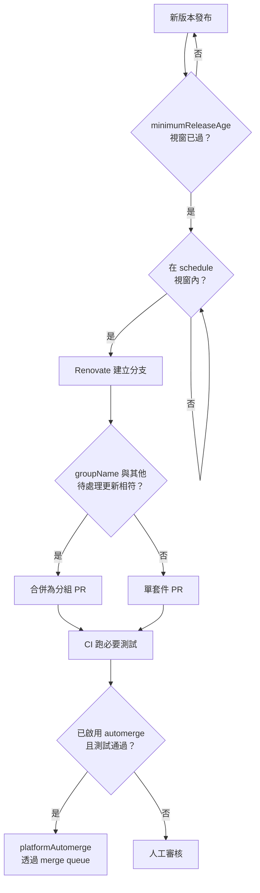

# [FEE-1616] 前端 repo 的 Renovate 設定

:::info
Renovate 是一款自動化相依套件更新機器人，能在 90 多種套件管理器（包含 npm、pnpm、Yarn、GitHub Actions、Docker 等）上開立 PR。一個前端 repo 通常每週會收到數十個更新 PR；若沒有分組、排程與條件式自動合併（gated automerge），審核佇列會難以處理。本文示範如何為典型的前端 monorepo 或單一套件 webapp 設定 Renovate，使用 `config:recommended`、`packageRules`、`schedule`、`lockFileMaintenance`、`minimumReleaseAge` 與 automerge，讓機器人持續發揮作用而不淪為雜訊。
:::

## 背景

Renovate 是一個長期維運的開源專案，「協助你更新程式碼中的相依套件，無需手動處理」、支援「90 多種套件管理器」、並「直接把更新 PR 送進你的 repo」（renovatebot/renovate README）。設定模型為 JSON（或 JSON5/JavaScript），透過可分享的 preset 組合：`extends` 陣列引用具名 preset，使 repo 能繼承標準基線而無需重新定義選項。目前的標準基線是 `config:recommended`，本身即綁定了 Dependency Dashboard issue、語意化前綴 commit、忽略的模組與測試、`group:monorepos`、`group:recommended`、release 年齡信心徽章與 digest changelog 輔助工具。早期的文章與 Renovate 範例會引用 `config:base`；該名稱已是舊稱，由 `config:recommended` 取代。同樣地，舊有的 `stabilityDays` 選項已更名為 `minimumReleaseAge`；新設定應採用新名稱。

## 情境

一支四人工程團隊維護一個 Vite + React webapp，內含一份共用的 `pnpm-workspace.yaml` 與三個內部套件。他們已啟用 Dependabot，採每週檢查。每個週一早上佇列裡約有 30 個開啟的 PR：每個 ESLint plugin patch 一個 PR、每個 `@types/*` 升版一個 PR、每個 Storybook addon 一個 PR，加上幾個 GitHub Actions digest 更新。審核者手動分流這堆 PR，CI 時間都花在對近乎相同的 diff 重跑同一條 workflow 上。團隊想要三件事：(a) 相關相依套件合併成一個 PR（ESLint 一個、Storybook 一個、`@types/*` 一個）；(b) PR 在非工作時段建立，讓早晨的審核聚焦在人類產出而非機器人；(c) 對低風險 devDependency 更新啟用 automerge，讓工程師只看到需要判斷的 PR。Renovate 的 `groupName`、`schedule`、`minimumReleaseAge` 與條件式 `automerge` 共同涵蓋這套需求。

## 最佳實踐

- **必須**讓每份設定以 `extends: ["config:recommended"]` 開頭。該 preset 啟用 Dependency Dashboard、語意化 commit、`group:monorepos`、`group:recommended` 以及忽略測試與模組目錄；手動重新推導這些設定既浪費時間又會與上游脫節。
- **必須**選對 webapp/library preset。應用 repo 使用 `config:js-app`（會加上 `:pinAllExceptPeerDependencies`，讓應用以 pin 住的版本執行）；函式庫使用 `config:js-lib`（加上 `:pinOnlyDevDependencies`，讓 runtime 範圍對下游消費者保持寬鬆）。
- **應該**在 `packageRules` 中使用 `groupName` 收攏相關更新。把 `eslint*`、`@typescript-eslint/*`、`storybook*`、`@types/*` 與 `vite*` plugin 群各自合併成一個 PR。Renovate 內建 `group:recommended` 與 `group:monorepos`，自訂 group 則涵蓋專案特定的套件群。
- **應該**設定 `schedule` 視窗（例如 `"before 5am on monday"`），讓 PR 在審核時段之外送達。Renovate 接受自然語言視窗，例如 `"every weekend"` 或 `"after 10pm and before 5am every weekday"`。
- **應該**為 `lockFileMaintenance` 設定獨立排程。Renovate 的 npm manager 會刷新 `package-lock.json`、`pnpm-lock.yaml` 與 `yarn.lock`，攔下任何頂層 `dependencies` 變更不會帶出的傳遞性安全修補。
- **應該**為非小型的 production 相依套件把 `minimumReleaseAge` 設為 `"3 days"` 或 `"5 days"`。此選項會在 release 發布後的設定視窗內抑制 PR 建立，讓剛發布的惡意或損毀版本有時間被發現並下架，再讓機器人開 PR。
- **應該**讓 `automerge` 條件取決於必要測試。Renovate「會等待必要測試通過後才執行 automerge」，預設透過 `platformAutomerge` 使用 GitHub 原生的 merge queue。
- **應該**為 devDependencies 的非 major 更新啟用 `automerge`，並在套用到 production 相依套件之前要求充分的測試覆蓋率。Renovate 文件直白寫道：automerge「對 `devDependencies` 通常運作良好，對 production `dependencies` 也能運作，但專案應有良好的測試覆蓋率」。
- **可以**仰賴 Renovate 的 npm manager 浮現 `packageManager` 更新。當 Renovate 在 `package.json` 偵測到 Yarn 的 `packageManager` 設定時，會透過 Corepack 安裝對應的 Yarn 版本，與 Corepack toolchain 協同而非互相牽制。

## 設計思維

核心校準是審核負擔對比供應鏈風險。立刻拉進每個 patch 並啟用完整 automerge 可將延遲壓到最低，代價是惡意或損毀的 release 在發布幾分鐘內就會進入 production。對每個 patch 採人工審核能消除該時間窗，但會產生難以維持的 PR 流量，例如前述的週一早上情境。

`minimumReleaseAge` 加上對非 major devDependencies 的條件式 automerge，是常見的平衡點。release 年齡視窗仰賴社群在機器人提出升級之前偵測出問題發布（被 yank 的版本、GitHub issue、advisory）；條件式 automerge 則要求專案自身的 CI 在 PR 落地前驗證沒有壞掉。對 production 相依套件而言，取捨更緊：automerge 需要測試覆蓋足以攔下回歸，許多團隊在原則上把 production 的 major 更新保留為完全人工。`groupName` 分組與 `schedule` 排程是獨立的調節桿，能在不改變安全姿態的前提下降低雜訊。

## 深入探討

`rangeStrategy` 控制 Renovate 如何改寫 `package.json` 中的範圍限制。允許值為 `auto`、`bump`、`extend`、`pin`、`replace`、`widen`。`auto` 讓 Renovate 採用各 manager 的預設；`pin` 把範圍收攏為精確版本（搭配 `config:js-app`）；`bump` 在保留範圍語意的前提下提高下界；`widen` 擴大上界（適合 peer-dependency 樣式的範圍）；`replace` 替換既有範圍；`extend` 僅在必要時擴大。函式庫作者通常將 `config:js-lib` 與 `peerDependencies` 上的 `widen` 或 `bump` 策略結合，以保持下游相容性的寬度。

npm manager 有兩個值得指名的互動。第一，`packageManager` 欄位被視為一種獨立的 dependency type，因此 Renovate 開立 `packageManager: "yarn@4.5.1"` 升版 PR 的方式與處理 `react` 升版相同。第二，「若 Renovate 在 `package.json` 偵測到 Yarn 的 `packageManager` 設定，便會使用 Corepack 安裝 Yarn」。Renovate runner 不假設環境已全域安裝 Yarn。這讓 Renovate 開箱相容於 Corepack 驅動的 monorepo（參見 [FEE-1614 Corepack](/zh-tw/Developer Experience and Tooling/corepack)）。pnpm 方面，manager 會以通用方式更新 `pnpm-lock.yaml`；npm manager 文件並未在標準 lock-file 刷新之外宣稱具備版本特定的覺察能力。

## 圖解



## 範例

針對情境團隊前端 webapp 的逐字 `renovate.json`：

```json
{
  "$schema": "https://docs.renovatebot.com/renovate-schema.json",
  "extends": [
    "config:recommended",
    "config:js-app"
  ],
  "schedule": ["before 5am on monday"],
  "timezone": "UTC",
  "minimumReleaseAge": "3 days",
  "lockFileMaintenance": {
    "enabled": true,
    "schedule": ["before 5am on monday"]
  },
  "packageRules": [
    {
      "matchPackagePatterns": ["^eslint", "^@typescript-eslint/"],
      "groupName": "eslint"
    },
    {
      "matchPackagePatterns": ["^@types/"],
      "groupName": "type definitions"
    },
    {
      "matchPackagePatterns": ["^storybook", "^@storybook/"],
      "groupName": "storybook"
    },
    {
      "matchDepTypes": ["devDependencies"],
      "matchUpdateTypes": ["minor", "patch"],
      "automerge": true
    },
    {
      "matchManagers": ["github-actions"],
      "matchUpdateTypes": ["digest", "minor", "patch"],
      "automerge": true
    },
    {
      "matchDepTypes": ["dependencies"],
      "matchUpdateTypes": ["major"],
      "dependencyDashboardApproval": true
    }
  ]
}
```

對照研究內容逐項說明這份設定做了什麼：

1. `extends` 拉入 `config:recommended`（Dependency Dashboard、語意化 commit、monorepo 分組、推薦分組）與 `config:js-app`（`:pinAllExceptPeerDependencies`，讓應用程式 `package.json` 的範圍 pin 在精確版本）。
2. `schedule` 把分支與 PR 建立限制在週一清晨；平日不會有 PR 雜訊。
3. `minimumReleaseAge: "3 days"` 阻擋 Renovate 在 release 發布滿三天前提出升級，降低剛發布的惡意套件風險。
4. `lockFileMaintenance` 在同一個週一視窗執行，刷新 `pnpm-lock.yaml`（以及任何同層的 `package-lock.json` / `yarn.lock`）以套用傳遞性更新。
5. 前三條 `packageRules` 用 `groupName` 把 ESLint、`@types/*` 與 Storybook 的更新各自合併為單一 PR。
6. 第四條規則對非 major 的 devDependency 更新啟用 `automerge`；Renovate 會等待必要測試通過後再合併。
7. 第五條規則把 automerge 延伸到 GitHub Actions 的 digest、minor 與 patch 升版；以 digest 釘版的 action 更新風險低，且應持續跟進。
8. 最後一條規則把 production 相依套件的 major 更新放在 `dependencyDashboardApproval` 後面，要求在 dashboard issue 上人為打勾後 PR 才會被開啟。

`packageRules` 是「一個物件陣列，讓你套用條件式設定」；此處用到的 match 屬性（`matchPackagePatterns`、`matchDepTypes`、`matchUpdateTypes`、`matchManagers`）皆是文件記載的 match key，而 `matchUpdateTypes` 允許的值為 `["major", "minor", "patch", "pin", "digest"]`。

## Renovate 與 Dependabot 對照

Renovate 與 Dependabot 解決同一類表面問題，但預設值不同。Renovate 發布有自家的標準對照；下表彙整對前端 repo 重要的維度，依據該對照與 Dependabot 自身設定文件。

| 維度                    | Renovate                                                                                          | Dependabot（GitHub）                                                                              |
| ---------------------- | ------------------------------------------------------------------------------------------------- | ------------------------------------------------------------------------------------------------ |
| 相依套件分組            | 透過 `group:recommended` / `group:monorepos` 開箱即用；每條規則可自訂 `groupName`。                  | 有支援，但「需先自行設定群組」——沒有社群 preset。                                                |
| Monorepo 支援          | `group:monorepos` preset 把常見 monorepo 套件（如 Babel、Jest）合併在同一 PR 升版。                   | 沒有對應的 monorepo preset；除非手動分組，每個套件版本升級都各自一個 PR。                           |
| Dependency Dashboard   | 預設啟用——以單一 issue 列出所有待處理與被速率限制的更新。                                            | 沒有 dashboard issue；狀態僅以 PR 與 Insights 分頁呈現。                                          |
| 排程粒度               | 可依套件、依 manager 或全域；自然語言視窗（"before 5am on monday"）。                                | `daily`（週一至週五）、`weekly`（預設週一）或 `monthly`（每月一日）。                              |
| 開啟 PR 上限           | 透過 `prConcurrentLimit` / `prHourlyLimit` 設定。                                                  | 預設上限為 5；「若已開啟五個版本更新 PR，便不會再開新 PR」。                                       |
| 平台支援               | GitHub、GitLab、Bitbucket、Azure DevOps、Gitea 等。                                                | 僅支援 GitHub。在其他平台需要安裝 app 或自架。                                                   |
| 套件管理器涵蓋         | 90 多種，包括 npm、pnpm、Yarn、Bun、Docker、GitHub Actions、Helm、Terraform 等。                    | `npm`、`bun`、`yarn`、`docker`、`github-actions`，其他生態系透過 `dependabot.yml`。               |

選擇很少純粹由能力定生死。已經住在 GitHub 中、只有單一 repo 且 patch 頻率不高的團隊，跑 Dependabot 通常足夠。維運前端 monorepo、希望每個 ESLint 或 Storybook 升版群只有一個 PR、或需要單一 dashboard issue 來分流被速率限制更新的團隊，會落腳在 Renovate。

## 內部參考

- [FEE-1205 Supply Chain Security](/zh-tw/Performance and Security/supply-chain-security) — 漏洞掃描屬於另一層關注；Renovate 更新相依套件，但本身不審查 advisory。
- [FEE-1507 Release Automation](/zh-tw/Developer Experience and Tooling/release-automation) — semver 與 changelog 產生超出 Renovate 的範圍；Renovate 僅在消費端透過 `rangeStrategy` 與分組觸碰 semver。
- [FEE-1614 Corepack](/zh-tw/Developer Experience and Tooling/corepack) — Renovate 的 npm manager 在偵測到 `packageManager` 欄位時會呼叫 Corepack 安裝 Yarn，因此 Corepack 驅動的 repo 無需額外 runner 設定即可運作。

## 參考資料

- Renovate maintainers, "renovatebot/renovate README," GitHub (2026). https://github.com/renovatebot/renovate
- Renovate maintainers, "Configuration Options," Renovate Docs (2026). https://docs.renovatebot.com/configuration-options/
- Renovate maintainers, "Configuration Presets," Renovate Docs (2026). https://docs.renovatebot.com/presets-config/
- Renovate maintainers, "Automerge," Renovate Docs (2026). https://docs.renovatebot.com/key-concepts/automerge/
- Renovate maintainers, "Bot Comparison," Renovate Docs (2026). https://docs.renovatebot.com/bot-comparison/
- Renovate maintainers, "npm Manager," Renovate Docs (2026). https://docs.renovatebot.com/modules/manager/npm/
- GitHub, "Configuration options for the dependabot.yml file," GitHub Docs (2026). https://docs.github.com/en/code-security/dependabot/dependabot-version-updates/configuration-options-for-the-dependabot.yml-file
