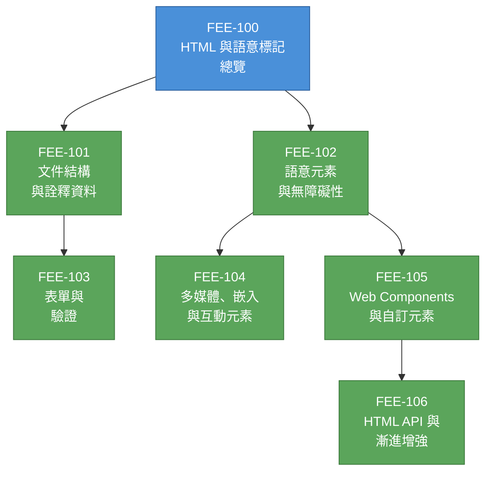

# [FEE-100] HTML 與語意標記總覽

:::info
本類別涵蓋 HTML 作為 Web 結構與語意基礎的全貌 -- 從文件結構與詮釋資料（metadata），到語意元素、表單、多媒體、Web Components，以及透過 HTML API 實現漸進增強（progressive enhancement）。
:::

## 背景

HTML（HyperText Markup Language，超文本標記語言）是 Web 的基礎標記語言。無論使用何種框架或建構工具，每個網頁最終都是一份由瀏覽器解析為 DOM 樹的 HTML 文件。HTML 定義內容*是*什麼 -- 標題、段落、導覽、表單、圖片 -- 在 CSS 添加樣式和 JavaScript 加入行為之前。

### 起源

Tim Berners-Lee 於 1989 年在 CERN 發明了全球資訊網（World Wide Web），並在 1991 年撰寫了第一份 HTML 規範。最初的語言大約只有 20 個標籤，大部分借鑑自 SGML，設計目的只有一個：在網路上連結科學文件。第一個瀏覽器「WorldWideWeb」（後改名為 Nexus）同時也是編輯器 -- Berners-Lee 從一開始就將 Web 構想為可讀寫的媒介。

### 演進歷程

| 時代 | 年份 | 變革 |
|------|------|------|
| **HTML 1.0** | 1991 | Berners-Lee 的原始 20 標籤草案。連結、標題、列表、段落。 |
| **HTML 2.0** | 1995 | 首個正式 IETF 標準（RFC 1866）。新增表單與基礎互動性。 |
| **HTML 3.2 / 4.01** | 1997-1999 | W3C 推薦標準。表格、腳本、樣式表、國際化。HTML 4.01 引入 strict/transitional/frameset 文件類型。 |
| **XHTML 1.0** | 2000 | 以 XML 重新定義 HTML。嚴格的語法規則。雖獲得採用，但 XML 的錯誤處理機制被證明不適合 Web。 |
| **HTML5** | 2008-2014 | WHATWG 於 2004 年開始工作。新增語意元素、原生音訊/影片、Canvas、localStorage、Web Workers。W3C 於 2014 年發布為推薦標準。 |
| **HTML Living Standard** | 2019+ | WHATWG 與 W3C 同意由 WHATWG 維護單一「Living Standard（活標準）」。不再有版本號 -- HTML 持續更新。 |

### Living Standard（活標準）

自 2019 年起，HTML 只有一份權威規範：WHATWG HTML Living Standard。「living（活的）」模型意味著規範永遠不會凍結；新功能持續加入、錯誤持續修正，瀏覽器實作者直接參與規範的編寫。不存在所謂的「HTML6」-- HTML 就是 HTML，持續演進。

這是對傳統編號版本標準模型的刻意背離。其理由是：Web 永不停止演進，因此聲稱「完成」的規範立刻就過時了。活標準反映的是瀏覽器實際實作的內容，而非可能永遠不會出貨的理想文件。

### 為什麼前端工程師需要理解 HTML

現代框架都在產生 HTML。React 的 JSX、Vue 的模板、Angular 的元件模板，最終都編譯為 DOM 中的 HTML 元素。當無障礙稽核失敗、當螢幕閱讀器行為異常、當 SEO 排名下滑、或當表單無法驗證時 -- 根本原因幾乎總是在 HTML 層。理解 HTML 語意的工程師能撰寫出與瀏覽器、輔助技術和搜尋引擎正確協作的標記，不需要額外的工作。

## 設計思維

### 為什麼 HTML 與 CSS/JS 是分離的

Web 平台建立在刻意的**關注點分離（separation of concerns）**之上：

- **HTML** 宣告結構與語意（內容*是*什麼）
- **CSS** 宣告呈現（內容*看起來*如何）
- **JavaScript** 宣告行為（內容*如何回應*互動）

這種分離並非必然。早期的 Web 提案（包括 Microsoft 和 Netscape 的部分提案）將結構與呈現混合在單一語言中。W3C 與 Web 社群基於實際理由選擇了分離：

1. **無障礙性（accessibility）。** 當結構以語意方式表達時，輔助技術（螢幕閱讀器、點字顯示器、語音控制器）能在不依賴視覺線索的情況下解讀與導覽內容。`<nav>` 元素向文件的任何消費者（不只是視力正常的使用者）傳達「這是導覽」的意義。

2. **可攜性（portability）。** 同一份 HTML 文件可以由桌面瀏覽器、行動瀏覽器、螢幕閱讀器、搜尋引擎爬蟲、稍後閱讀應用程式或印表機來呈現 -- 各自套用自己的樣式，忽略不適用的部分。這只有在文件的意義獨立於其呈現時才能運作。

3. **可維護性（maintainability）。** 分離意味著設計師可以重新設計網站樣式而不觸碰標記，開發者可以重構標記而不重寫 CSS。實務上這個理想並不完美，但它仍是指導原則。

4. **漸進增強（progressive enhancement）。** HTML 是在任何地方都能運作的基準。CSS 在視覺上增強體驗；JavaScript 在互動上增強體驗。如果 CSS 或 JS 載入失敗，結構良好的 HTML 文件仍然可用。這種韌性只有在 HTML 本身就承載意義時才可能實現。

### 文件與應用程式的張力

HTML 是為文件設計的：文章、報告、規範。現代 Web 也用來建構應用程式：試算表、影片編輯器、聊天客戶端。這產生了根本性的張力：

- **以文件為導向的 HTML** 強調語意結構：標題、段落、列表、地標（landmarks）。瀏覽器提供內建行為（捲動、文字選取、連結導覽、表單提交）。
- **以應用程式為導向的 HTML** 往往將 DOM 當作渲染目標，使用通用的 `
` 容器，再透過樣式和腳本打造自訂 UI。瀏覽器的內建語意可能與應用程式自身的互動模型衝突。

最好的前端工程是在這種張力中取得平衡，而非選擇某個極端。即使在複雜的應用程式中，在適合的地方使用語意元素（button 用於動作、a 用於導覽、表單元素用於輸入）能減少程式碼、改善無障礙性，並善用瀏覽器的最佳化。本類別的文章（FEE-101 到 FEE-106）將建立做出這些取捨所需的判斷力。

## 圖解

**閱讀順序：** 從文件結構（101）與語意元素（102）開始 -- 這是所有內容的基礎。表單（103）建立在文件結構的知識之上。多媒體與嵌入（104）及 Web Components（105）擴展語意概念。HTML API 與漸進增強（106）整合所有內容，並銜接至 JavaScript（FEE-300）。

## 相關 FEE

| FEE | 關聯 |
|-----|------|
| [FEE-200 CSS 與排版系統](../CSS%20and%20Layout%20Systems/200.md) | CSS 為 HTML 提供的結構添加樣式。理解語意 HTML 有助於撰寫有意義且可維護的選擇器。 |
| [FEE-300 JavaScript 核心與執行環境](../JavaScript%20Core%20and%20Runtime/300.md) | JavaScript 操作 HTML 建立的 DOM。HTML API（FEE-106）銜接至 JavaScript 執行環境。 |
| [FEE-500 元件架構](../Component%20Architecture%20and%20Design%20Patterns/500.md) | 元件模型（Web Components、React、Vue）產生 HTML。理解原生 HTML 語意對於建構無障礙元件至關重要。 |

## 參考資料

- [WHATWG HTML Living Standard](https://html.spec.whatwg.org/) -- 由 WHATWG 持續維護的唯一權威 HTML 規範
- [WHATWG HTML Living Standard -- Introduction](https://html.spec.whatwg.org/dev/introduction.html) -- 規範自身的介紹，說明範疇、設計原則與活標準模型
- [MDN: HTML -- HyperText Markup Language](https://developer.mozilla.org/en-US/docs/Web/HTML) -- 所有 HTML 元素、屬性與 API 的綜合參考與學習資源
- [MDN: Semantic HTML (Curriculum)](https://developer.mozilla.org/en-US/curriculum/core/semantic-html/) -- MDN 關於語意 HTML 最佳實踐的結構化課程模組
- [W3C: A History of HTML](https://www.w3.org/People/Raggett/book4/ch02.html) -- Dave Raggett 對 HTML 從 CERN 到 W3C 標準化過程的記述
- [Tim Berners-Lee: A Short History of the Web](https://www.w3.org/People/Berners-Lee/ShortHistory.html) -- 發明者本人對 Web 起源與設計目標的記述
