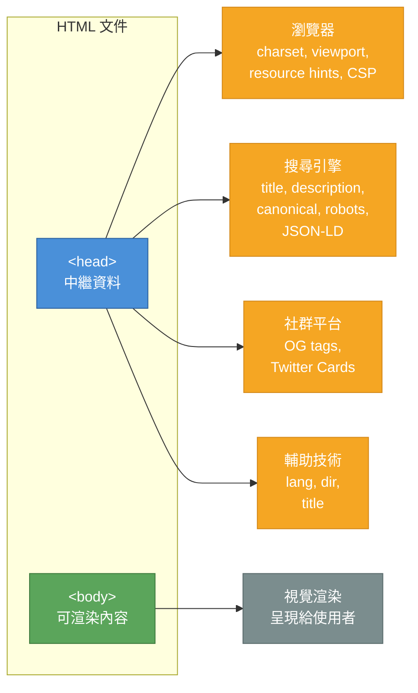
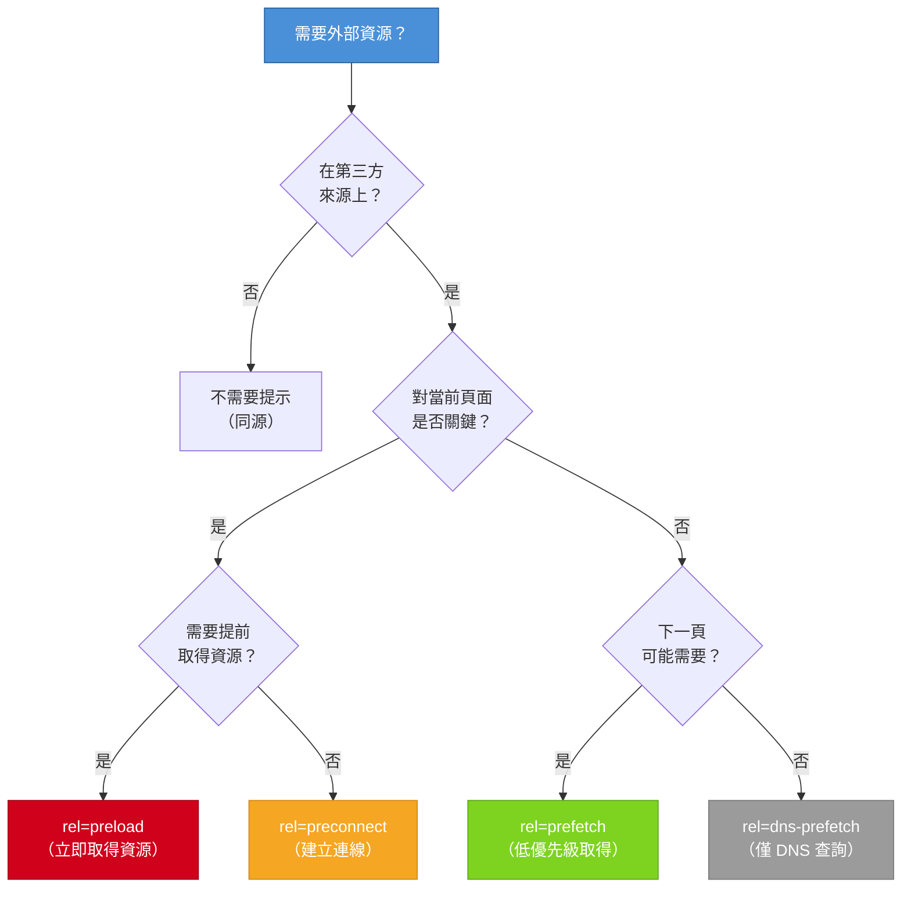

# [FEE-101] 文件結構與中繼資料

:::info
每份 HTML 文件都從一個可預測的骨架開始 -- DOCTYPE、`<html>`、`<head>`、`<body>` -- 並攜帶中繼資料（metadata），供瀏覽器、搜尋引擎、社群平台和輔助技術在繪製第一個像素之前讀取。打好這個基礎，直接影響效能、SEO、無障礙性與社群分享。
:::

## 背景

HTML 文件不只是使用者看到的內容。在瀏覽器渲染任何內容之前，它會先讀取文件的中繼資料：字元編碼（character encoding）、視窗配置（viewport）、頁面標題、資源提示（resource hints）和結構化資料（structured data）。這些不可見的宣告決定了頁面如何被解析、顯示、索引、分享，以及如何向輔助技術宣告。

HTML Living Standard 為 `<head>` 元素指定了明確的內容模型：它必須（MUST）包含 `<title>`（除了某些 iframe 情境），應該（SHOULD）在前 1024 位元組內宣告字元編碼，可以（MAY）包含任意數量的 `<meta>`、`<link>`、`<style>`、`<script>` 和 `<base>` 元素。任何可渲染的內容都不屬於 `<head>` -- 那是 `<body>` 的職責。

### 文件骨架（document skeleton）

每份 HTML 文件都遵循這個結構：

```html
<!DOCTYPE html>
<html lang="en" dir="ltr">
  <head>
    <meta charset="utf-8" />
    <meta name="viewport" content="width=device-width, initial-scale=1" />
    <title>Page Title</title>
    <!-- 其他中繼資料、資源提示、樣式、腳本 -->
  </head>
  <body>
    <!-- 可渲染的內容 -->
  </body>
</html>
```

**`<!DOCTYPE html>`** -- 告訴瀏覽器使用標準模式（standards mode）而非怪癖模式（quirks mode）。若缺少此宣告，瀏覽器會退回到各家不同的遺留渲染行為。

**`<html lang="en" dir="ltr">`** -- 根元素。`lang` 屬性宣告文件的主要語言（BCP 47 語言代碼），螢幕閱讀器（screen reader）依此切換發音、瀏覽器依此處理斷字與拼字檢查、搜尋引擎依此偵測語言。`dir` 屬性宣告文字方向（`ltr` 左至右或 `rtl` 右至左）。

**`<head>`** -- 包含機器可讀的中繼資料。`<head>` 內的元素不會被渲染到頁面上。

**`<body>`** -- 包含所有可渲染的內容。

## 使用情境

你正在為一個行銷活動頁面準備國際上線。設計已完成，但頁面在某些瀏覽器上渲染異常——視窗配置在行動裝置上沒有生效、語言未宣告，社群媒體的連結預覽也沒有顯示圖片或標題。每一個問題都能追溯到文件 `<head>` 中缺少或設定錯誤的元素。`<head>` 對使用者不可見，卻掌控著每個瀏覽器、爬蟲和平台解讀與呈現頁面的方式。

## 設計思維

### 為什麼 `<head>` 存在：中繼資料的消費者

`<head>` 與 `<body>` 的分離反映了一個根本的設計原則：一份文件攜帶的資訊服務於多個消費者，不只是人類讀者。`<head>` 的存在是為了服務四個不同的受眾：



每個消費者讀取不同的中繼資料：

| 消費者 | 讀取內容 | 目的 |
|--------|---------|------|
| **瀏覽器** | charset, viewport, CSP, resource hints, theme-color | 解析、渲染、安全、效能 |
| **搜尋引擎** | title, description, canonical, robots, JSON-LD | 索引、排名、豐富搜尋結果（rich results） |
| **社群平台** | OG tags, Twitter Cards | 連結預覽卡片 |
| **輔助技術** | lang, dir, title | 語言切換、閱讀方向、頁面識別 |

### `<head>` 內的順序很重要

瀏覽器按文件順序處理 `<head>` 內的元素。建議的排列順序：

1. `<meta charset>` -- 必須在前 1024 位元組內
2. `<meta name="viewport">` -- 在任何 CSS 之前，避免版面重排（layout thrashing）
3. `<title>` -- 規範所要求
4. `<meta name="description">` -- 供搜尋引擎使用
5. `<link rel="preconnect">` / `<link rel="dns-prefetch">` -- 提前建立連線
6. `<link rel="stylesheet">` -- 阻塞渲染的 CSS
7. `<link rel="preload">` -- 尚未被發現的關鍵資源
8. `<script>`（搭配 `defer` 或 `async`）-- 非阻塞腳本
9. Open Graph / Twitter Card meta 標籤
10. JSON-LD 結構化資料
11. `<link rel="icon">` / `<link rel="manifest">` -- favicon 與 PWA

### 框架中的中繼資料管理模式

現代框架抽象化 `<head>` 管理，因為 SPA（單頁應用程式）的路由切換不會觸發完整的頁面載入。每個框架提供不同的 API，但底層問題相同：讓文件中繼資料與當前路由保持同步。

**Next.js（App Router）** -- `generateMetadata` 非同步函式或靜態 `metadata` 匯出：

```tsx
// app/about/page.tsx
export const metadata = {
  title: 'About Us',
  description: 'Learn about our team',
  openGraph: { title: 'About Us', images: ['/og-about.png'] },
};
```

**Nuxt 3** -- `useHead()` 與 `useSeoMeta()` 組合式函式（composables）：

```vue
<script setup>
useSeoMeta({
  title: 'About Us',
  description: 'Learn about our team',
  ogTitle: 'About Us',
  ogImage: '/og-about.png',
});
</script>
```

**Astro** -- frontmatter 屬性傳入佈局的 `<head>`：

```astro
---
// src/layouts/Base.astro
const { title, description } = Astro.props;
---
<html lang="en">
  <head>
    <meta charset="utf-8" />
    <meta name="viewport" content="width=device-width, initial-scale=1" />
    <title>{title}</title>
    <meta name="description" content={description} />
  </head>
  <body><slot /></body>
</html>
```

**SvelteKit** -- `svelte:head` 特殊元素：

```svelte
<svelte:head>
  <title>About Us</title>
  <meta name="description" content="Learn about our team" />
</svelte:head>
```

**Remix** -- `meta` 匯出函式：

```tsx
export const meta = () => [
  { title: 'About Us' },
  { name: 'description', content: 'Learn about our team' },
  { property: 'og:title', content: 'About Us' },
];
```

共同模式：框架讓你按路由宣告中繼資料，然後在導覽時處理 DOM 操作（插入、更新或移除 `<head>` 元素）。

## 最佳實踐

**MUST 將 `charset` 與 `viewport` 宣告為前兩個 meta 標籤。** 每份 HTML 文件必須在前 1024 位元組內包含 `<meta charset="utf-8">`，並在任何 CSS 之前加入 `<meta name="viewport" content="width=device-width, initial-scale=1">`。若缺少 `charset`，瀏覽器會猜測編碼並可能產生亂碼（mojibake）。若缺少 `viewport`，行動裝置瀏覽器會以桌面寬度渲染並縮小，導致文字與觸控目標無法使用。

**MUST 在 `<html>` 元素上宣告 `lang`（及適用時宣告 `dir`）。** 始終在根元素上使用 BCP 47 語言標籤宣告文件的主要語言；對於由右至左的語言，還需加入 `dir="rtl"`。螢幕閱讀器依賴 `lang` 選擇正確的語音設定檔；搜尋引擎用它進行語言索引；瀏覽器用它處理斷字與拼字檢查。省略 `lang` 會迫使所有這些系統進行猜測。

**SHOULD 遵循建議的 `<head>` 元素排列順序。** 依序放置：`<meta charset>`、`<meta name="viewport">`、`<title>`、描述、resource hints、樣式表、preload、scripts、社群標籤，最後是 JSON-LD。瀏覽器按文件順序處理 `<head>` 元素，因此 `charset` 或 `viewport` 宣告過晚可能導致編碼歧義或 CSS 載入前的版面重排（layout thrashing）。

**SHOULD 為關鍵第三方來源使用 resource hints。** 對當前頁面需要的第三方來源（字型 CDN、API 端點）使用 `<link rel="preconnect">`，對較不關鍵的來源使用 `<link rel="dns-prefetch">`。`preconnect` 提前執行 DNS 查詢、TCP 交握和 TLS 協商，可節省關鍵路徑上 100–500 毫秒。避免濫用 `preconnect`，每個開啟的連線都會消耗瀏覽器資源。

**MUST 使用 `<link rel="preload">` 時必須指定 `as` 屬性。** 始終加入正確的 `as` 值（`font`、`script`、`style`、`image` 等），預載字型時還需加入 `crossorigin`。若缺少 `as`，瀏覽器無法設定正確的取得優先級或套用 CSP 檢查，大多數瀏覽器會對資源進行雙重取得——一次來自 preload，一次來自實際使用該資源的元素。

**AVOID 將可渲染內容放入 `<head>`。** `<head>` 內只保留中繼資料元素（`<meta>`、`<title>`、`<link>`、`<style>`、`<script>`、`<base>`、`<noscript>`）。當解析器在 `<head>` 內遇到流內容（如 `<p>`）時，會隱式關閉 `<head>` 並開啟 `<body>`，導致之後宣告的任何中繼資料被忽略，造成樣式表遺失和 resource hints 失效。

**SHOULD 在 SPA 中使用框架提供的中繼資料 API，而非手動設定 `document.title`。** 單頁應用程式在導覽時不會觸發完整的頁面載入，因此在初始載入時設定的 `document.title` 很快就會過時。使用框架的宣告式 API（Next.js `metadata` 匯出、Nuxt `useSeoMeta`、SvelteKit `svelte:head` 等），讓 title、description 和 Open Graph 標籤與當前路由保持同步。

## 圖解

### 資源提示（resource hints）決策流程



### 資源提示參考表

| 提示 | 功能 | 需要 `as`？ | 使用情境 |
|------|------|------------|---------|
| `preconnect` | DNS + TCP + TLS | 否 | 關鍵第三方來源（字型 CDN、API） |
| `dns-prefetch` | 僅 DNS 查詢 | 否 | 較不關鍵的來源，瀏覽器支援較廣 |
| `preload` | 取得資源 | 是 | 延遲發現的關鍵資源（字型、主圖） |
| `prefetch` | 低優先級取得，用於未來導覽 | 選擇性 | 下一個可能頁面的資源 |
| `modulepreload` | 取得 + 解析 + 編譯 JS 模組 | 否 | 模組圖中的 ES module 依賴 |

## 範例

### 1. 包含必要中繼資料的完整 HTML 骨架

```html
<!DOCTYPE html>
<html lang="en" dir="ltr">
  <head>
    <!-- 字元編碼：必須在前 1024 位元組內 -->
    <meta charset="utf-8" />

    <!-- Viewport：回應式設計必備 -->
    <meta name="viewport" content="width=device-width, initial-scale=1" />

    <!-- 文件標題 -->
    <title>Machine Learning Workshop - Spring 2026</title>

    <!-- SEO 描述 -->
    <meta name="description"
          content="A hands-on workshop covering supervised learning, neural networks, and model deployment. April 15-17, 2026." />

    <!-- Canonical URL -->
    <link rel="canonical" href="https://example.com/workshops/ml-spring-2026" />

    <!-- 資源提示 -->
    <link rel="preconnect" href="https://fonts.googleapis.com" />
    <link rel="preconnect" href="https://fonts.gstatic.com" crossorigin />
    <link rel="dns-prefetch" href="https://analytics.example.com" />

    <!-- 樣式表 -->
    <link rel="stylesheet" href="/css/main.css" />

    <!-- 預載關鍵字型 -->
    <link rel="preload" href="/fonts/inter-var.woff2"
          as="font" type="font/woff2" crossorigin />

    <!-- 瀏覽器主題色 -->
    <meta name="theme-color" content="#1a73e8" />

    <!-- Favicon -->
    <link rel="icon" href="/favicon.svg" type="image/svg+xml" />

    <!-- PWA manifest -->
    <link rel="manifest" href="/manifest.json" />
  </head>
  <body>
    <h1>Machine Learning Workshop</h1>
    <!-- 頁面內容 -->
  </body>
</html>
```

### 2. Open Graph 與 Twitter Card 中繼資料

```html
<head>
  <!-- ... charset, viewport, title ... -->

  <!-- Open Graph -->
  <meta property="og:type" content="website" />
  <meta property="og:url" content="https://example.com/workshops/ml-spring-2026" />
  <meta property="og:title" content="Machine Learning Workshop - Spring 2026" />
  <meta property="og:description"
        content="A hands-on workshop covering supervised learning, neural networks, and model deployment." />
  <meta property="og:image" content="https://example.com/images/ml-workshop-og.png" />
  <meta property="og:image:alt" content="Workshop participants working on neural network diagrams" />
  <meta property="og:image:width" content="1200" />
  <meta property="og:image:height" content="630" />

  <!-- Twitter Card -->
  <meta name="twitter:card" content="summary_large_image" />
  <meta name="twitter:site" content="@exampleorg" />
  <meta name="twitter:title" content="Machine Learning Workshop - Spring 2026" />
  <meta name="twitter:description"
        content="A hands-on workshop covering supervised learning, neural networks, and model deployment." />
  <meta name="twitter:image" content="https://example.com/images/ml-workshop-og.png" />
  <meta name="twitter:image:alt" content="Workshop participants working on neural network diagrams" />
</head>
```

### 3. JSON-LD 結構化資料

```html
<head>
  <!-- ... 其他中繼資料 ... -->

  <script type="application/ld+json">
  {
    "@context": "https://schema.org",
    "@type": "Event",
    "name": "Machine Learning Workshop - Spring 2026",
    "description": "A hands-on workshop covering supervised learning, neural networks, and model deployment.",
    "startDate": "2026-04-15T09:00:00-07:00",
    "endDate": "2026-04-17T17:00:00-07:00",
    "location": {
      "@type": "Place",
      "name": "Tech Hub Conference Center",
      "address": {
        "@type": "PostalAddress",
        "streetAddress": "123 Innovation Drive",
        "addressLocality": "San Francisco",
        "addressRegion": "CA",
        "postalCode": "94105"
      }
    },
    "organizer": {
      "@type": "Organization",
      "name": "Example Corp",
      "url": "https://example.com"
    },
    "offers": {
      "@type": "Offer",
      "url": "https://example.com/workshops/ml-spring-2026/register",
      "price": "299",
      "priceCurrency": "USD",
      "availability": "https://schema.org/InStock"
    }
  }
  </script>
</head>
```

JSON-LD（JavaScript Object Notation for Linked Data）是 Google 建議的結構化資料格式。它嵌入在 `<script type="application/ld+json">` 標籤中，通常放在 `<head>`（但放在文件任何位置都有效）。搜尋引擎使用結構化資料來產生豐富搜尋結果（rich results）-- 活動卡片、食譜輪播、FAQ 手風琴等。

### 4. `<base>` 元素

```html
<head>
  <base href="https://cdn.example.com/assets/" target="_blank" />
</head>
<body>
  <!-- 解析為 https://cdn.example.com/assets/images/logo.png -->
  
</body>
```

`<base>` 元素設定文件中所有相對 URL 的基底 URL，並可選擇性地設定連結的預設 `target`。一份文件中最多只能有一個 `<base>` 元素。請謹慎使用 -- 它會影響文件中的每個相對 URL，包括錨點連結（`#section`），這在 SPA 中可能導致非預期的行為。

## 深入探討

### HTML 解析與文件就緒狀態

瀏覽器的 HTML 解析器預設是同步的。當解析器遇到沒有 `defer` 或 `async` 的 `<script>` 標籤時，會停止解析、下載腳本、執行後才繼續。這稱為**解析器阻塞腳本（parser-blocking script）**。位於 `<head>` 的解析器阻塞腳本會延遲整個 DOM 的建構，意味著它之後的所有內容都無法渲染，直到腳本執行完畢。

**兩個文件就緒事件**標誌著這個過程中的不同里程碑：

- **`DOMContentLoaded`** 在 HTML 完整解析完成、DOM 樹建構好後觸發。此時樣式表可能仍在載入，圖片不一定已下載完畢。帶有 `defer` 的腳本已執行；帶有 `async` 的腳本則不一定。
- **`load`** 在頁面及其所有相依資源（樣式表、圖片、iframe、字型）完全載入後觸發。此事件永遠晚於 `DOMContentLoaded`，在包含大型圖片或緩慢第三方資源的頁面上，延遲可能相當顯著。

大多數 DOM 操作的初始化應以 `DOMContentLoaded` 為目標，而非 `load`。等待 `load` 對互動初始化而言是不必要的慢。

**腳本載入策略**控制腳本相對於解析的執行時機：

| 策略 | 阻塞解析？ | 執行時機 | 保證順序？ |
|------|-----------|---------|----------|
| `<script>`（行內，無屬性） | 是 | 立即，依序 | 是 |
| `<script src>`（無屬性） | 是 | 下載後，依序 | 是 |
| `<script src defer>` | 否 | DOM 解析後，`DOMContentLoaded` 之前 | 是 |
| `<script src async>` | 否 | 下載完成後立即 | 否 |
| `<script type="module">` | 否 | 預設類似 `defer` | 是 |

**實務建議：**

- 將帶有 `defer` 的 `<script>` 標籤放在 `<head>` 中，而非 `<body>` 末尾。`defer` 在解析繼續的同時立即開始下載；而放在 body 末尾的腳本要等解析器到達才開始下載。
- `async` 只適用於沒有依賴關係且不要求順序的腳本（例如分析追蹤）。
- `<head>` 中的行內腳本是解析器阻塞的；應盡量保持精簡，或將初始化邏輯移至 `defer` 的外部腳本。
- `<link rel="stylesheet">` 是渲染阻塞的，但不是解析器阻塞的。它不會停止 HTML 解析器，但會阻止瀏覽器繪製，直到樣式表載入完成。

## 常見錯誤

### 1. 路由切換時標題重複或過時（SPA）

```js
// 錯誤：只在初始載入時設定 document.title
// 導覽到 /about 時標題仍然是 "Home"
document.title = 'Home - My App';
```

**影響。** 瀏覽器分頁顯示錯誤的標題。書籤儲存不正確的名稱。螢幕閱讀器宣告錯誤的頁面。搜尋引擎可能為客戶端渲染的頁面索引過時的標題。

**修正。** 使用框架提供的中繼資料 API（參見設計思維章節），或在每次路由切換時更新 `document.title`：

```js
router.afterEach((to) => {
  document.title = to.meta.title || 'My App';
});
```

## 相關 FEE

| FEE | 關聯 |
|-----|------|
| [FEE-100 HTML 與語意標記總覽](./100.md) | 父層總覽。文件結構是所有 HTML 主題的基礎。 |
| [FEE-102 語意元素與無障礙性](./102.md) | 語意元素建立在此處確立的文件骨架之上。本文介紹的 `lang` 和 `dir` 屬性對無障礙性至關重要。 |
| [FEE-106 HTML API 與漸進增強](./106.md) | 資源提示與中繼資料連接到瀏覽器 API 以進行效能最佳化。`<base>` 元素和 `<meta http-equiv>` 橋接至程式化的瀏覽器行為。 |

## 參考資料

- [WHATWG HTML Living Standard -- Document Metadata](https://html.spec.whatwg.org/dev/semantics.html) -- `<head>`、`<title>`、`<meta>`、`<link>` 和 `<base>` 元素的權威規範
- [MDN: What's in the head? Webpage metadata](https://developer.mozilla.org/en-US/docs/Learn_web_development/Core/Structuring_content/Webpage_metadata) -- HTML 中繼資料的完整學習指南
- [MDN: The `<meta>` element](https://developer.mozilla.org/en-US/docs/Web/HTML/Reference/Elements/meta) -- 所有 meta 元素屬性與標準中繼資料名稱的參考
- [web.dev: Metadata (Learn HTML)](https://web.dev/learn/html/metadata/) -- 涵蓋 charset、viewport、OG tags、Twitter Cards 和 theme-color 的實務指南
- [web.dev: Document Structure (Learn HTML)](https://web.dev/learn/html/document-structure) -- DOCTYPE、html、head 和 body 元素的指南
- [web.dev: Resource Hints (Learn Performance)](https://web.dev/learn/performance/resource-hints) -- preconnect、dns-prefetch、preload 和 prefetch 的效能指南
- [web.dev: Preconnect and dns-prefetch](https://web.dev/articles/preconnect-and-dns-prefetch) -- 為第三方來源提前建立連線的深度探討
- [Google: Structured Data Guidelines](https://developers.google.com/search/docs/appearance/structured-data/sd-policies) -- Google 的 JSON-LD 結構化資料政策與最佳實踐
- [Schema.org](https://schema.org/) -- Web 結構化資料的協作詞彙表
- [Google: Intro to Structured Data](https://developers.google.com/search/docs/appearance/structured-data/intro-structured-data) -- JSON-LD 與豐富搜尋結果入門
