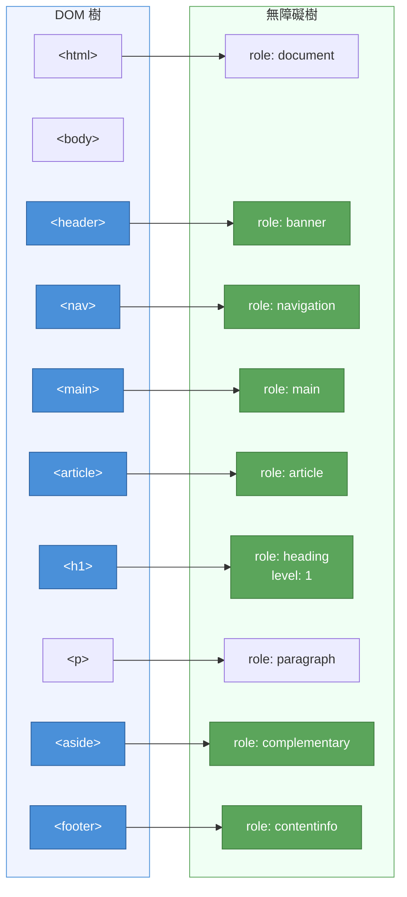
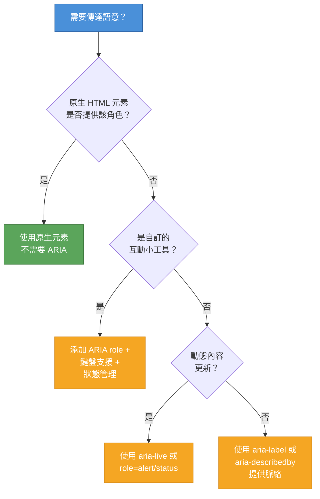

# [FEE-102] 語意元素與無障礙

:::info
HTML 提供超過 100 種元素，每一種都帶有特定的意義。當你選擇 `<nav>` 而非 `<div>` 時，你在向瀏覽器、螢幕閱讀器（screen reader）、搜尋引擎和閱讀模式傳達意圖。語意標記（semantic markup）是網頁無障礙的基礎：它讓機器理解人類一眼就能看到的內容。
:::

## 背景

Web 被設計為一個文件平台。`<h1>`、`<p>` 和 `<blockquote>` 等 HTML 元素承載著意義：它們描述的是內容**是什麼**，而非內容**看起來如何**。CSS 負責呈現；HTML 負責語意。

當瀏覽器解析 DOM 時，它會建構一個平行的結構，稱為**無障礙樹**（accessibility tree，AOM）。這棵樹剝去視覺樣式，將每個元素的**角色（role）**、**名稱（name）**、**狀態（state）**和**值（value）**暴露給輔助技術。`<nav>` 元素自動獲得 `navigation` 地標角色（landmark role）。`<button>` 獲得 `button` 角色並帶有內建的鍵盤互動。`<div>` 什麼都不會得到。它在語意上是不可見的。

其結果是：每一個本可使用語意元素卻使用了 `<div>` 或 `<span>` 的地方，就是一次資訊的損失。螢幕閱讀器無法將 `<div>` 宣告為導覽區域。搜尋引擎無法將 `<div>` 識別為主要內容。閱讀模式（reader mode）無法從充滿 `<div>` 的頁面中擷取 `<article>`。

ARIA（Accessible Rich Internet Applications，無障礙富網際網路應用程式）的存在是為了填補 HTML 沒有原生語意的空白。但 ARIA 只修改無障礙樹。它不增加任何行為。`<div role="button">` 對螢幕閱讀器看起來像按鈕，但缺少鍵盤支援、焦點管理和表單送出功能。原生的 `<button>` 免費提供所有這些。

### 語意區段元素（semantic sectioning elements）

HTML5 引入了區段元素來取代通用的 `<div>` 容器：

| 元素 | 隱含 ARIA 角色 | 用途 |
|------|---------------|------|
| `<header>` | `banner`（頂層時） | 介紹性內容、導覽輔助、logo、搜尋 |
| `<nav>` | `navigation` | 主要導覽區塊 |
| `<main>` | `main` | 文件的主要內容（每頁一個） |
| `<article>` | `article` | 自含式內容（部落格文章、評論、小工具） |
| `<section>` | `region`（有標籤時） | 帶標題的主題分組 |
| `<aside>` | `complementary` | 相關但非核心的內容（側邊欄、引用） |
| `<footer>` | `contentinfo`（頂層時） | 頁尾資訊、版權、聯絡連結 |

當 `<header>` 或 `<footer>` 巢狀在 `<article>`、`<aside>`、`<nav>` 或 `<section>` 內時，它會失去地標角色，成為該區段內的通用容器。

### 文字層級語意（text-level semantics）

除了區段元素之外，HTML 還提供行內意義的元素：

| 元素 | 用途 | 範例 |
|------|------|------|
| `<h1>`-`<h6>` | 標題階層（文件大綱） | `<h1>Page Title</h1>` |
| `<p>` | 文字段落 | `<p>A paragraph.</p>` |
| `<blockquote>` | 引用其他來源的延伸引文 | `<blockquote cite="...">` |
| `<cite>` | 被引用作品的標題 | `<cite>HTML Living Standard</cite>` |
| `<abbr>` | 縮寫或首字母縮寫 | `<abbr title="World Wide Web">WWW</abbr>` |
| `<time>` | 機器可讀的日期/時間 | `<time datetime="2026-04-09">April 9</time>` |
| `<mark>` | 標記/相關的文字 | `<mark>important</mark>` |
| `<code>` | 電腦程式碼片段 | `<code>const x = 1</code>` |
| `<em>` | 強調重音（不只是斜體） | `<em>really</em> important` |
| `<strong>` | 強烈重要性（不只是粗體） | `<strong>Warning:</strong>` |

一位螢幕閱讀器使用者反映，他們無法有效率地瀏覽你的網站。他們必須從頭到尾逐一聆聽每個元素，才能抵達主要內容。頁面全程使用 `<div class="nav">`、`<div class="main">` 和 `<div class="footer">`。螢幕閱讀器會向使用者揭示頁面的大綱，而這份大綱完全來自語意 HTML 元素：`<nav>`、`<main>`、`<footer>`、`<article>`。將結構用途的 div 替換為對應的語意元素，只需幾分鐘，即可讓頁面變得易於導覽。

## 設計思維

### 為什麼語意很重要：人類以外的三個受眾

語意標記服務於解讀你頁面的機器：

1. **螢幕閱讀器**遍歷無障礙樹，宣告角色和名稱。`<nav>` 會被宣告為「navigation 地標」；`<div>` 則是沉默的。
2. **搜尋引擎**使用語意結構來理解內容階層、識別主要內容，並為豐富搜尋結果（rich results）擷取結構化資訊。
3. **閱讀模式**（Safari Reader、Firefox Reader View）透過識別 `<article>`、`<main>` 和標題階層來剝去導覽和廣告。

DOM 是你所撰寫的。無障礙樹是輔助技術所讀取的。語意 HTML 確保這兩個結構一致。

### 無障礙樹：從 DOM 到 AOM

當瀏覽器解析 HTML 時，它建立 DOM 樹。從 DOM 出發，它建構**無障礙樹**（也稱為 Accessibility Object Model，即 AOM）。無障礙樹中的每個節點暴露四個屬性：

- **角色（Role）**：元素是什麼（button、navigation、heading）
- **名稱（Name）**：元素的稱呼（按鈕標籤、標題文字）
- **狀態（State）**：當前狀態（checked、expanded、disabled）
- **值（Value）**：當前值（輸入文字、滑桿位置）

語意元素自動對應到角色。ARIA 可以覆蓋或補充這些對應，但 ARIA 永遠不會添加行為，只添加語意。

### 框架對應：「div 湯」的由來

現代框架鼓勵元件組合（component composition），這可能導致過多的 `<div>` 包裹器：

**React fragments**：`<React.Fragment>`（或 `<>...</>`）不渲染任何 DOM 節點。當你需要 JSX 的包裹器但沒有語意上的理由需要 DOM 元素時，使用 fragments。這在語意上是中性的：當沒有語意元素適用時，這是正確的選擇。

**Vue template roots**：Vue 3 支援模板中的多個根元素，減少了包裹 `<div>` 的需求。當需要包裹器時，選擇語意元素（`<section>`、`<article>`）而非 `<div>`。

**Web Components slots**：Shadow DOM 中的 `<slot>` 元素保留了插入內容（slotted content）的語意結構。Light DOM 內容在無障礙樹中保留其角色和名稱，即使它們在 shadow root 內渲染。

**「div 湯」的誘惑**：在 JSX/TSX 中，用 `<div>` 包裹一切很容易，因為它沒有視覺副作用。但每一個不必要的 `<div>` 都稀釋了無障礙樹。在寫 `<div>` 之前，問自己：「是否有語意元素可以描述這個內容？」

### 無障礙名稱：元素如何獲得標籤

輔助技術需要每個互動元素的文字標籤。瀏覽器使用以下優先順序計算**無障礙名稱**（simplified from the accessible name computation algorithm）：

1. `aria-labelledby`：參照另一個元素的文字內容
2. `aria-label`：直接在元素上的字串
3. 原生標籤：表單控制項的 `<label>`、圖片的 `alt`、按鈕/連結的文字內容
4. `title` 屬性（最低優先級，支援不一致）

**`<label>`**：命名表單控制項的標準方式。使用 `for`/`id` 關聯或將控制項包在 label 內：

```html
<!-- 顯式關聯 -->
<label for="email">Email address</label>
<input id="email" type="email" />

<!-- 隱式關聯 -->
<label>
  Email address
  <input type="email" />
</label>
```

**`aria-label`**：當可見文字不適合時提供無障礙名稱（例如圖示按鈕）：

```html
<button aria-label="Close dialog">
  <svg><!-- X icon --></svg>
</button>
```

**`aria-labelledby`**：參照一個或多個元素，其文字內容構成無障礙名稱。適用於複雜的標籤：

```html
<h2 id="billing">Billing Address</h2>
<form aria-labelledby="billing">
  <!-- 表單欄位 -->
</form>
```

**`aria-describedby`**：添加補充描述（在名稱和角色之後宣告）。用於說明文字、錯誤訊息或額外脈絡：

```html
<label for="pw">Password</label>
<input id="pw" type="password" aria-describedby="pw-hint" />
<p id="pw-hint">Must be at least 12 characters with one number.</p>
```

### 即時區域（live regions）：宣告動態更新

當內容在沒有頁面重新載入的情況下改變（通知、表單驗證、聊天訊息），螢幕閱讀器需要被告知。ARIA live regions 解決了這個問題：

- **`aria-live="polite"`**：等待螢幕閱讀器完成當前宣告後再讀取新內容。用於非緊急的更新（狀態訊息、搜尋結果數量）。
- **`aria-live="assertive"`**：立即中斷當前的宣告。保留給緊急訊息（錯誤、警告）。
- **`role="status"`**：隱含 `aria-live="polite"`。用於狀態訊息。
- **`role="alert"`**：隱含 `aria-live="assertive"`。用於重要的、時間敏感的訊息。

帶有 `aria-live` 的元素必須在內容改變**之前**就存在於 DOM 中。如果你同時動態插入容器和其內容，螢幕閱讀器可能不會偵測到變化。

### 文件大綱（document outline）（概念性）

HTML5 的大綱演算法（巢狀的 `<section>` 元素各自可以從 `<h1>` 開始，瀏覽器會計算正確的標題層級）從未被任何瀏覽器或輔助技術實作。它已從 HTML 規範中正式移除。

**實務上：**將標題視為扁平的階層。使用 `<h1>` 一次作為頁面標題，`<h2>` 用於主要區段，`<h3>` 用於子區段，以此類推。不要依賴區段元素來調整標題層級。

## 最佳實踐

**用 landmark 元素為每個頁面建立結構。** 每個頁面 MUST 在頂層包含 `<header>`、`<main>` 和 `<footer>`，並 SHOULD 為每個主要導覽區塊使用 `<nav>`。Landmark 元素讓螢幕閱讀器使用者能夠直接跳到任何區域；完全由 `<div>` 組成的頁面無法提供這樣的快速跳轉。

**優先使用語意元素，而非 ARIA role 覆蓋。** 作者 MUST 先選擇符合內容用途的原生 HTML 元素，再考慮使用 ARIA。`<button>` 免費提供焦點管理、鍵盤啟動和表單整合；`<div role="button">` 只提供角色，所有行為都需手動實作。ARIA SHOULD 保留給沒有原生 HTML 對應元素的角色。

**絕對不要跳過標題層級。** 作者 MUST 維持連續的標題階層（`<h1>` → `<h2>` → `<h3>`），並 SHOULD 每頁只使用一個 `<h1>`。標題層級向依靠標題導覽的螢幕閱讀器使用者傳達文件結構；跳過層級會錯誤地暗示缺少小節，讓導覽變得混亂。

**不要在已暴露正確角色的元素上添加 ARIA。** 撰寫 `<nav role="navigation">` 或 `<ul role="list">` 是多餘的：原生元素已帶有該角色。作者 SHOULD AVOID 在語意元素上標注其自身隱含的 ARIA role；除了是噪音之外，這也表明一種常常導致程式碼其他地方出現意外 role 覆蓋的誤解。

**只有在沒有語意元素適用時才使用 `<div>`。** `<div>` 和 `<span>` 是有意設計為無角色的容器，用於樣式和腳本掛鉤。作者 SHOULD 先尋找區段或文字層級的語意元素，並 MUST NOT 用 `<div>` 取代 `<button>`、`<nav>`、`<main>` 或任何有定義 ARIA role 的元素。當包裝器確實只用於排版，`<div>` 是正確的選擇，而非為了其樣式預設值而誤用語意元素。

## 圖解

### DOM 到無障礙樹的轉換



左側的每個語意 HTML 元素自動在右側的無障礙樹中建立有意義的節點。同一位置的 `<div>` 不會建立可存取的角色。它對輔助技術是不可見的。

### ARIA 決策流程圖



## 範例

### 1. 使用語意區段的頁面

```html
<!DOCTYPE html>
<html lang="en">
<head>
  <meta charset="utf-8" />
  <meta name="viewport" content="width=device-width, initial-scale=1" />
  <title>Tech Blog - Latest Articles</title>
</head>
<body>

  <header>
    <a href="/" aria-label="Tech Blog home">
      
    </a>
    <nav aria-label="Primary">
      <ul>
        <li><a href="/articles">Articles</a></li>
        <li><a href="/tutorials">Tutorials</a></li>
        <li><a href="/about">About</a></li>
      </ul>
    </nav>
  </header>

  <main>
    <h1>Latest Articles</h1>

    <article>
      <h2>
        <a href="/articles/web-components">Understanding Web Components</a>
      </h2>
      <p>
        Published on
        <time datetime="2026-04-01">April 1, 2026</time>
        by <span>Jane Doe</span>
      </p>
      <p>Web Components provide a standard way to create
         reusable custom elements...</p>
    </article>

    <article>
      <h2>
        <a href="/articles/css-nesting">CSS Nesting Is Here</a>
      </h2>
      <p>
        Published on
        <time datetime="2026-03-28">March 28, 2026</time>
        by <span>John Smith</span>
      </p>
      <p>Native CSS nesting reduces preprocessor dependency...</p>
    </article>
  </main>

  <aside aria-label="Related topics">
    <h2>Popular Tags</h2>
    <ul>
      <li><a href="/tags/javascript">JavaScript</a></li>
      <li><a href="/tags/css">CSS</a></li>
      <li><a href="/tags/accessibility">Accessibility</a></li>
    </ul>
  </aside>

  <footer>
    <p>&copy; 2026 Tech Blog. All rights reserved.</p>
    <nav aria-label="Footer">
      <a href="/privacy">Privacy Policy</a>
      <a href="/terms">Terms of Service</a>
    </nav>
  </footer>

</body>
</html>
```

此頁面使用了 `<header>`、`<nav>`、`<main>`、`<article>`、`<aside>` 和 `<footer>`，全部具有隱含的 ARIA 角色。螢幕閱讀器可以直接跳到任何地標。兩個 `<nav>` 元素透過 `aria-label` 區分（「Primary」與「Footer」）。

### 2. 用於通知的 ARIA live region

```html
<!-- 容器必須在內容注入之前就存在於 DOM 中 -->
<div id="notifications" aria-live="polite" aria-relevant="additions">
  <!-- JS 會在此插入訊息 -->
</div>

<!-- 緊急警告使用 role="alert" -->
<div id="error-banner" role="alert">
  <!-- 在錯誤發生前保持空白 -->
</div>

<script>
  // Polite 通知：在當前朗讀完成後宣告
  function showNotification(message) {
    const container = document.getElementById('notifications');
    const note = document.createElement('p');
    note.textContent = message;
    container.appendChild(note);

    // 5 秒後移除（視覺上；螢幕閱讀器已經讀過了）
    setTimeout(() => note.remove(), 5000);
  }

  // Assertive 警告：立即中斷
  function showError(message) {
    const banner = document.getElementById('error-banner');
    banner.textContent = message;
  }

  // 使用範例
  showNotification('Your changes have been saved.');
  showError('Session expired. Please log in again.');
</script>
```

重點：live region 容器在頁面載入時就存在於 DOM 中。內容被動態注入其中。`aria-live="polite"` 會等待；`role="alert"`（隱含 `aria-live="assertive"`）會立即中斷。

### 3. 帶有 label 關聯的無障礙表單

```html
<form aria-labelledby="contact-heading">
  <h2 id="contact-heading">Contact Us</h2>

  <!-- 透過 for/id 的顯式 label 關聯 -->
  <div>
    <label for="name">Full name</label>
    <input id="name" type="text" required
           autocomplete="name" />
  </div>

  <!-- 帶有 aria-describedby 的說明文字 -->
  <div>
    <label for="email">Email address</label>
    <input id="email" type="email" required
           autocomplete="email"
           aria-describedby="email-hint" />
    <p id="email-hint">We will never share your email.</p>
  </div>

  <!-- 錯誤訊息模式 -->
  <div>
    <label for="message">Message</label>
    <textarea id="message" required
              aria-describedby="message-error"
              aria-invalid="true"></textarea>
    <p id="message-error" role="alert">
      Please enter a message.
    </p>
  </div>

  <button type="submit">Send message</button>
</form>
```

每個表單控制項都有可見的 `<label>`。說明文字使用 `aria-describedby`，因此在欄位名稱和角色之後宣告。錯誤訊息使用 `role="alert"` 在驗證失敗時中斷螢幕閱讀器。`aria-invalid="true"` 告訴使用者該欄位有錯誤。

## 常見錯誤

### 1. 動態內容更新缺少 `aria-live`

```html
<!-- 錯誤：螢幕閱讀器永遠不會知道新的結果 -->
<div id="search-results">
  <!-- JS 在每次鍵入時替換此處的內容 -->
</div>
```

**影響。** 視力正常的使用者看到搜尋結果即時更新。螢幕閱讀器使用者什麼都聽不到：DOM 的變化對他們是不可見的。

**修正。** 為狀態更新添加 live region：

```html
<div id="search-results">
  <!-- JS 替換此處內容 -->
</div>
<div aria-live="polite" role="status" id="result-count">
  <!-- JS 更新：「找到 12 筆結果」 -->
</div>
```

### 2. `<section>` 沒有標題

```html
<!-- 錯誤：section 沒有標題 -->
<section>
  <p>Some content grouped for styling purposes.</p>
</section>
```

**影響。** HTML 規範指出 `<section>` 應該有標題。沒有標題的 section 在無障礙樹中是一個未命名的區域。使用者無法識別其用途。如果你只需要樣式包裹器，使用 `<div>`。

**修正。** 添加標題或改用 `<div>`：

```html
<!-- 方案 A：添加標題 -->
<section>
  <h2>Key Features</h2>
  <p>Some content about features.</p>
</section>

<!-- 方案 B：純樣式用途使用 div -->
<div class="content-block">
  <p>Some content grouped for styling purposes.</p>
</div>
```

## 相關 FEE

| FEE | 關聯 |
|-----|------|
| [FEE-100 HTML 與語意標記總覽](./100.md) | 父層總覽。本文涵蓋總覽中介紹的核心語意原則。 |
| [FEE-101 文件結構與中繼資料](./101.md) | 文件骨架。`<html>` 上的 `lang` 和 `dir` 屬性對無障礙至關重要。語意元素建立在此基礎之上。 |
| [FEE-103 表單與驗證](./103.md) | 表單無障礙。label 關聯、錯誤處理和表單的 ARIA 模式在該篇展開。 |
| [FEE-1000 無障礙](./1000.md) | 完整的無障礙指南。本文涵蓋語意基礎；FEE-1000 涵蓋 WCAG 合規、測試和進階模式。 |

## 參考資料

- [WHATWG HTML Living Standard -- Sections](https://html.spec.whatwg.org/dev/sections.html) -- 區段元素（header, nav, main, article, section, aside, footer）的權威規範
- [W3C WAI -- Using ARIA](https://www.w3.org/TR/using-aria/) -- ARIA 使用規則，包含第一條規則：當原生 HTML 足夠時「不要使用 ARIA」
- [W3C WAI-ARIA Authoring Practices Guide (APG)](https://www.w3.org/WAI/ARIA/apg/) -- 使用 ARIA 建構無障礙小工具的模式、實踐和範例
- [MDN: ARIA](https://developer.mozilla.org/en-US/docs/Web/Accessibility/ARIA) -- ARIA 角色、狀態和屬性的完整參考
- [MDN: WAI-ARIA basics](https://developer.mozilla.org/en-US/docs/Learn_web_development/Core/Accessibility/WAI-ARIA_basics) -- 何時及如何使用 ARIA 的學習指南
- [web.dev: Semantic HTML (Learn HTML)](https://web.dev/learn/html/semantic-html) -- 選擇語意元素和理解無障礙樹的實務指南
- [web.dev: ARIA and HTML (Learn Accessibility)](https://web.dev/learn/accessibility/aria-html) -- ARIA 如何與 HTML 語意互動、ARIA 的五條規則
- [web.dev: Headings and Sections (Learn HTML)](https://web.dev/learn/html/headings-and-sections) -- 標題階層、區段元素和文件大綱
- [WebAIM: Introduction to ARIA](https://webaim.org/techniques/aria/) -- ARIA 的實務介紹，包含常見模式和錯誤
- [Scott O'Hara: ARIA in HTML](https://www.scottohara.me/blog/2021/07/07/aria-in-html.html) -- ARIA 角色與 HTML 元素語意之間關係的專家分析
