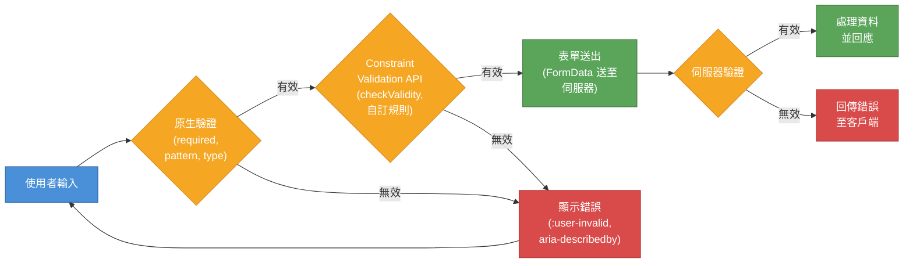

# [FEE-103] 表單與驗證

:::info
HTML 表單是 Web 收集使用者輸入的主要機制。平台提供宣告式驗證（declarative validation）、無障礙標籤，以及結構化的送出功能 -- 全部在任何一行 JavaScript 執行之前就已運作。理解原生表單能力至關重要，因為每一個框架層級的表單抽象最終都渲染為這些原始語意。
:::

## 背景

`<form>` 元素從 HTML 誕生之初就存在。它定義了頁面上收集使用者輸入並送出至伺服器的區域。與大多數 HTML 元素不同，表單**預設就是互動的** -- 它接受輸入、驗證資料、觸發導覽，全部不需要 JavaScript。

HTML 提供了豐富的表單控制項詞彙：

| 元素 | 用途 |
|------|------|
| `<form>` | 組合控制項並定義送出行為的容器 |
| `<input>` | 最通用的控制項 -- 22 種以上的類型（text, email, number, date, checkbox, radio, file, range, color 等） |
| `<textarea>` | 多行文字輸入 |
| `<select>` + `<option>` | 下拉式選單 |
| `<datalist>` + `<option>` | 透過 `list` 屬性綁定至 `<input>` 的自動完成建議列表 |
| `<output>` | 計算或使用者動作的結果（例如即時總計） |
| `<button>` | 送出、重設或通用按鈕（優先於 `<input type="submit">`） |
| `<fieldset>` + `<legend>` | 以標題將相關控制項分組 |
| `<label>` | 表單控制項的無障礙名稱 |
| `<progress>` | 進度指示器 |
| `<meter>` | 已知範圍內的純量度量 |

### 輸入類型（input types）

每個 `type` 值會改變控制項的行為、行動裝置鍵盤，以及內建驗證：

| 類型 | 鍵盤 | 內建驗證 |
|------|------|----------|
| `text` | 標準 | 無（除非設定 `pattern`） |
| `email` | 電子郵件配置（@ 鍵） | 必須符合 email 格式 |
| `url` | URL 配置 | 必須符合 URL 格式 |
| `tel` | 數字撥號鍵盤 | 無（各國格式不同） |
| `number` | 數字 | 必須為 `min`/`max`/`step` 範圍內的數字 |
| `date` | 日期選擇器 | 必須為有效日期 |
| `search` | 標準 + 清除按鈕 | 無 |
| `password` | 遮蔽輸入 | 無（使用 `minlength`/`pattern`） |
| `file` | 檔案選擇器 | `accept` 過濾檔案類型 |
| `checkbox` | 切換 | `required` 表示必須勾選 |
| `radio` | 群組內單選 | 群組中一個設定 `required` 表示必須選擇 |
| `range` | 滑桿 | 受限於 `min`/`max`/`step` |
| `color` | 色彩選擇器 | 必須為有效的十六進位色碼 |

### 表單送出屬性（form submission attributes）

`<form>` 元素控制資料的傳送方式：

- **`action`** -- 送出的目標 URL。預設為當前頁面 URL。
- **`method`** -- `GET`（資料放在 URL 查詢字串）或 `POST`（資料放在請求本體）。`dialog` 會關閉父層的 `<dialog>`。
- **`enctype`** -- `POST` 的編碼方式：`application/x-www-form-urlencoded`（預設）、`multipart/form-data`（檔案上傳必須使用）、`text/plain`。
- **`novalidate`** -- 送出時停用原生驗證。

個別送出按鈕可使用 `formaction`、`formmethod`、`formenctype` 和 `formnovalidate` 覆寫這些設定：

```html
<form action="/save" method="POST">
  <!-- 欄位在此 -->
  <button type="submit">Save Draft</button>
  <button type="submit" formaction="/publish" formmethod="POST">Publish</button>
</form>
```

## 設計思維

### 為什麼 HTML 有原生驗證

HTML 驗證是**宣告式的** -- 你在標記中描述約束，瀏覽器負責執行。這個設計有三個優點：

1. **漸進增強（progressive enhancement）。** 表單不需要 JavaScript 就能運作。如果 JS 載入失敗，原生驗證仍然會阻止無效的送出。
2. **內建無障礙。** 瀏覽器會向螢幕閱讀器宣告驗證錯誤。`:invalid` 和 `:user-invalid` pseudo-class 讓你不需要 JS 狀態管理就能提供視覺回饋。
3. **更少的程式碼需要維護。** 一個 `required` 屬性取代了 JavaScript 事件監聽器、狀態變數、條件式錯誤訊息渲染和 ARIA 屬性。原生驗證是單一事實來源（single source of truth）。

其限制在於：原生驗證的 UI 無法自訂。瀏覽器的錯誤提示框無法設定樣式、文字在不同瀏覽器間不一致，且定位是固定的。這個張力驅使框架在 JavaScript 中重新實作驗證。

### 框架表單的版圖

現代框架對表單處理採取不同的方式，各自在開發者體驗、漸進增強和無障礙之間取得平衡：

**React：controlled vs. uncontrolled。** Controlled component（受控元件）透過 `value` + `onChange` 將每個 input 綁定到 React state，提供完全控制但需要更多程式碼。Uncontrolled component（非受控元件）使用 `ref` 讓 DOM 擁有狀態 -- 更接近原生表單。React 19+ 引入了 **Server Actions**，透過 `<form>` 上的 `action` prop 實現伺服器端表單處理並支援漸進增強：當 JS 不可用時，表單以標準 HTML 送出方式運作。

**Vue：v-model。** Vue 的 `v-model` 指令在表單控制項和元件狀態之間提供雙向資料綁定（two-way data binding）。它自動處理 `<input>`、`<textarea>` 和 `<select>` 的 value/event 連線。驗證通常由 VeeValidate 或 FormKit 等函式庫處理。

**SvelteKit：form actions。** SvelteKit 的 form actions 是漸進增強的最佳實踐。表單以標準 HTTP `POST` 請求送出。伺服器端的 `actions` 函式處理送出。`use:enhance` 指令在 JS 可用時漸進升級為 AJAX -- 不重載頁面，但相同的 server action 處理兩種情況。這代表表單設計上就不需要 JavaScript。

**Remix / React Router：loader + action。** 類似 SvelteKit，Remix 使用伺服器端的 `action` 函式處理標準表單送出。`<Form>` 元件在有 JS 時升級為 fetch 型送出。漸進增強是核心設計原則。

**Conform + Zod。** Conform 是為 React Server Actions、Remix 和 Next.js 設計的漸進增強表單驗證函式庫。它搭配 Zod schema 一次定義驗證規則，同時在客戶端和伺服器端執行。這種「驗證一次、隨處執行」的方式消除了客戶端/伺服器端驗證不一致的常見錯誤。

### 張力：原生驗證 vs. 框架驗證

原生 HTML 驗證具備無障礙且不需要 JavaScript，但：
- 錯誤訊息無法設定樣式或位置
- 複雜規則（跨欄位驗證、非同步檢查）無法表達
- 錯誤的使用者體驗在不同瀏覽器間不一致

框架驗證靈活但必須重建瀏覽器免費提供的功能：
- 錯誤訊息必須連線到 `aria-describedby` 或 live region
- 必須管理焦點（將焦點移到第一個無效欄位）
- 必須重新實作送出阻止邏輯
- 螢幕閱讀器的宣告必須明確編碼

最佳做法是兩者結合：使用原生屬性（`required`、`type="email"`、`pattern`）作為基線驗證，再疊加框架驗證處理複雜規則。只有當你的 JS 驗證完全取代原生 UX 時才在 `<form>` 上使用 `novalidate`，並確保你的替代方案具備無障礙。

## 最佳實踐

**每個輸入都必須關聯可見的 label。** 每個表單控制項 MUST 有 `<label>`，透過 `for`/`id` 連結或將控制項巢狀在 `<label>` 內。`placeholder` 屬性 MUST NOT 被當作 label 替代品 -- 它在輸入時消失、在多數瀏覽器中對比度不足，且並非所有螢幕閱讀器都能可靠地宣告它。可見的 label 也擴大了點擊區域：點擊 label 會聚焦對應的控制項。

**優先使用原生驗證屬性，而非 JavaScript。** 在撰寫任何驗證腳本之前，作者 SHOULD 先透過 `required`、`type`、`pattern`、`min`、`max`、`minlength`、`maxlength` 宣告約束。原生約束在任何 JavaScript 執行之前就被強制執行，自動與瀏覽器的無障礙基礎設施整合，並參與 `:invalid` / `:user-invalid` pseudo-class 的樣式套用，不需要額外程式碼。JavaScript 驗證 SHOULD 補充原生約束以處理複雜的跨欄位或非同步規則，而非取代它們。

**一律在伺服器端驗證。** 客戶端驗證 MUST 被視為純粹的 UX 層，絕不能作為安全邊界。任何客戶端都能繞過 JavaScript 或直接向端點送出精心構造的請求。伺服器端 MUST 獨立驗證每一個送出的值。

**使用 fieldset 和 legend 將相關控制項分組。** Radio button、checkbox 以及語意上相關的欄位（例如地址子欄位）SHOULD 包裹在 `<fieldset>` 內，並搭配描述性的 `<legend>`。沒有這個分組，螢幕閱讀器只會宣告「是，radio button」，完全沒有脈絡；有了它，才會宣告「訂閱電子報？是，radio button」。AVOID 僅依賴視覺上的鄰近性來暗示分組關係。

**在個人資料輸入欄上宣告 autocomplete。** 任何接受姓名、電子郵件地址、電話號碼、郵寄地址或付款資訊的輸入欄 SHOULD 帶有適當的 `autocomplete` token（例如 `email`、`street-address`、`cc-number`）。這能啟用瀏覽器自動填入、減少運動障礙使用者的按鍵次數，且是 WCAG 2.1 SC 1.3.5（Identify Input Purpose）AA 等級的要求。

**只有當你的 JS 驗證完全取代原生 UX 時，才使用 novalidate。** 在 `<form>` 上加入 `novalidate` 會關閉所有內建的瀏覽器驗證 UI。AVOID 在未準備好的情況下使用它，除非自訂驗證層涵蓋了所有約束、提供了無障礙的錯誤宣告（`aria-describedby`、`role="alert"`）、管理了焦點至第一個無效欄位，並重新實作了原本由原生驗證提供的送出阻止邏輯。

## 圖解

### 表單生命週期（form lifecycle）



表單生命週期從使用者輸入流經三層驗證：瀏覽器檢查的原生 HTML 約束、用於自訂 JavaScript 規則的 Constraint Validation API，以及作為最終權威的伺服器端驗證。任一階段的錯誤都會引導使用者回去修正輸入。

## 範例

### 1. 帶有原生驗證與 :user-valid 樣式的表單

```html
<style>
  /* 僅在使用者互動後顯示驗證樣式 */
  input:user-valid,
  select:user-valid,
  textarea:user-valid {
    border-color: #2e7d32;
    outline-color: #2e7d32;
  }

  input:user-invalid,
  select:user-invalid,
  textarea:user-invalid {
    border-color: #c62828;
    outline-color: #c62828;
  }

  /* 舊版瀏覽器的後備方案 */
  @supports not selector(:user-valid) {
    input:valid:not(:placeholder-shown) {
      border-color: #2e7d32;
    }
    input:invalid:not(:placeholder-shown):not(:focus) {
      border-color: #c62828;
    }
  }
</style>

<form action="/register" method="POST">
  <fieldset>
    <legend>Create Account</legend>

    <div>
      <label for="username">Username</label>
      <input id="username" name="username" type="text"
             required minlength="3" maxlength="20"
             pattern="[a-zA-Z0-9_]+"
             autocomplete="username"
             placeholder=" " />
    </div>

    <div>
      <label for="user-email">Email</label>
      <input id="user-email" name="email" type="email"
             required
             autocomplete="email"
             placeholder=" " />
    </div>

    <div>
      <label for="user-password">Password</label>
      <input id="user-password" name="password" type="password"
             required minlength="12"
             autocomplete="new-password"
             placeholder=" " />
    </div>

    <div>
      <label for="user-role">Role</label>
      <select id="user-role" name="role" required>
        <option value="">-- Select a role --</option>
        <option value="developer">Developer</option>
        <option value="designer">Designer</option>
        <option value="manager">Manager</option>
      </select>
    </div>

    <button type="submit">Create Account</button>
  </fieldset>
</form>
```

`:user-valid` 和 `:user-invalid` pseudo-class 僅在使用者與欄位互動後才套用 -- 頁面載入時不會出現紅色邊框。`@supports` 區塊使用 `:placeholder-shown` 技巧為舊版瀏覽器提供後備方案。

### 2. FormData API 擷取

```html
<form id="contact-form" action="/contact" method="POST">
  <label for="contact-name">Name</label>
  <input id="contact-name" name="name" type="text" required />

  <label for="contact-email">Email</label>
  <input id="contact-email" name="email" type="email" required />

  <label for="contact-subject">Subject</label>
  <select id="contact-subject" name="subject">
    <option value="support">Support</option>
    <option value="feedback">Feedback</option>
    <option value="other">Other</option>
  </select>

  <label for="contact-message">Message</label>
  <textarea id="contact-message" name="message" required></textarea>

  <button type="submit">Send</button>
</form>

<script>
  const form = document.getElementById('contact-form');

  form.addEventListener('submit', async (event) => {
    event.preventDefault();

    // FormData 自動讀取所有具名控制項
    const formData = new FormData(form);

    // 存取個別值
    const name = formData.get('name');       // string
    const email = formData.get('email');      // string

    // 轉換為純物件
    const data = Object.fromEntries(formData);
    // { name: "Alice", email: "alice@example.com", subject: "support", message: "..." }

    // 以 JSON 送出
    const response = await fetch('/api/contact', {
      method: 'POST',
      headers: { 'Content-Type': 'application/json' },
      body: JSON.stringify(data),
    });

    if (!response.ok) {
      // 處理伺服器驗證錯誤
    }
  });
</script>
```

`FormData` 不需要逐一查詢就能讀取所有具名表單控制項。它支援所有表單控制項類型，包括 file input（`formData.get('file')` 回傳 `File` 物件）。進行 multipart 送出（檔案上傳）時，直接將 `FormData` 作為 fetch body 傳入，不需設定 `Content-Type` -- 瀏覽器會設定正確的 boundary。

### 3. 使用 Constraint Validation API 的無障礙錯誤訊息

```html
<form id="signup-form" action="/signup" method="POST" novalidate>
  <div>
    <label for="signup-email">Email address</label>
    <input id="signup-email" name="email" type="email" required
           autocomplete="email"
           aria-describedby="email-error" />
    <p id="email-error" role="alert" hidden></p>
  </div>

  <div>
    <label for="signup-age">Age</label>
    <input id="signup-age" name="age" type="number"
           min="13" max="120" required
           aria-describedby="age-error" />
    <p id="age-error" role="alert" hidden></p>
  </div>

  <button type="submit">Sign Up</button>
</form>

<script>
  const form = document.getElementById('signup-form');

  function showError(input, message) {
    const errorEl = document.getElementById(
      input.getAttribute('aria-describedby')
    );
    errorEl.textContent = message;
    errorEl.hidden = false;
    input.setAttribute('aria-invalid', 'true');
  }

  function clearError(input) {
    const errorEl = document.getElementById(
      input.getAttribute('aria-describedby')
    );
    errorEl.textContent = '';
    errorEl.hidden = true;
    input.removeAttribute('aria-invalid');
  }

  function validateField(input) {
    // 使用 Constraint Validation API
    if (input.validity.valueMissing) {
      showError(input, `${input.labels[0].textContent} is required.`);
      return false;
    }
    if (input.validity.typeMismatch) {
      showError(input, 'Please enter a valid email address.');
      return false;
    }
    if (input.validity.rangeUnderflow) {
      showError(input, `Must be at least ${input.min}.`);
      return false;
    }
    if (input.validity.rangeOverflow) {
      showError(input, `Must be at most ${input.max}.`);
      return false;
    }

    // 自訂驗證
    input.setCustomValidity('');
    clearError(input);
    return true;
  }

  // 在 blur 時驗證以提供即時回饋
  form.querySelectorAll('input').forEach((input) => {
    input.addEventListener('blur', () => validateField(input));
    input.addEventListener('input', () => {
      if (input.getAttribute('aria-invalid')) {
        validateField(input);
      }
    });
  });

  form.addEventListener('submit', (event) => {
    event.preventDefault();

    const inputs = [...form.querySelectorAll('input')];
    const firstInvalid = inputs.find((input) => !validateField(input));

    if (firstInvalid) {
      // 焦點管理：將焦點移至第一個無效欄位
      firstInvalid.focus();
      return;
    }

    // 全部有效 -- 送出
    const data = new FormData(form);
    fetch('/api/signup', { method: 'POST', body: data });
  });
</script>
```

此範例的關鍵無障礙模式：

- **`aria-describedby`** 將每個 input 連結到其錯誤訊息。螢幕閱讀器會在欄位名稱和角色之後宣告錯誤。
- **`aria-invalid="true"`** 告訴輔助技術該欄位有錯誤。
- **`role="alert"`** 在錯誤元素上使螢幕閱讀器在錯誤出現時立即宣告。
- **焦點管理（focus management）** 在送出時將焦點移至第一個無效欄位，讓鍵盤使用者被引導到問題所在。
- **`hidden`** 屬性讓錯誤元素保留在 DOM 中但不可見，直到需要時才顯示。

`validity` 物件（來自 Constraint Validation API）暴露細粒度的狀態：`valueMissing`、`typeMismatch`、`patternMismatch`、`tooLong`、`tooShort`、`rangeUnderflow`、`rangeOverflow`、`stepMismatch`、`badInput` 和 `customError`。這讓你能為每種失敗類型撰寫自訂訊息，同時利用瀏覽器的內建驗證邏輯。

## 深入探討

### Constraint Validation API 的生命週期

每個參與約束驗證的表單控制項都暴露了一個 `validity` 屬性 -- 一個 `ValidityState` 物件 -- 以及兩個方法：`checkValidity()` 和 `reportValidity()`。理解兩者的差異對於建立自訂驗證 UI 至關重要。

**`checkValidity()`** 執行瀏覽器的內部約束檢查，如果所有約束都通過則回傳 `true`，否則回傳 `false`。當它回傳 `false` 時，會在控制項上觸發一個可取消的 `invalid` 事件。這個方法不會改變 UI -- 它不會顯示瀏覽器的原生錯誤提示框。當你想知道某個欄位是否有效、並打算自行渲染錯誤訊息時，就呼叫它。

**`reportValidity()`** 執行相同的檢查，但如果欄位無效，還會顯示瀏覽器的原生驗證 UI（錯誤氣泡）。當你想要瀏覽器的預設錯誤呈現時才使用它。AVOID 在已承諾使用自訂錯誤 UI 的 `novalidate` 表單中呼叫 `reportValidity()`，因為原生提示框會意外出現。

**`invalid` 事件** 在 `checkValidity()` 或 `reportValidity()` 偵測到約束違反時，或表單嘗試送出但發現無效欄位時觸發。它不會冒泡（bubble），因此必須為每個欄位附加監聽器（或使用捕獲階段）。`invalid` 事件是自訂驗證 UI 的原生掛鉤 -- 監聽它，而不是在送出時手動重複整個迴圈。

**`ValidityState` 屬性** 代表欄位無效的具體原因。完整列表如下：

| 屬性 | 觸發條件 |
|------|----------|
| `valueMissing` | 設定了 `required` 但值為空 |
| `typeMismatch` | 值不符合 `type` 格式（例如不是有效的 email） |
| `patternMismatch` | 值不符合 `pattern` 正規表達式 |
| `tooLong` | 值超過 `maxlength` |
| `tooShort` | 值短於 `minlength` |
| `rangeUnderflow` | 數值低於 `min` |
| `rangeOverflow` | 數值高於 `max` |
| `stepMismatch` | 值不是有效的 `step` 倍數 |
| `badInput` | 瀏覽器無法將原始輸入轉換為對應類型（例如不完整的日期） |
| `customError` | 呼叫了 `setCustomValidity()` 並傳入非空字串 |
| `valid` | 所有約束都通過（以上屬性皆為 `false`） |

**`novalidate` + 自訂 UI 的模式。** 當你在 `<form>` 上加入 `novalidate` 並抑制原生送出驗證時，你承接了整個驗證流程：對每個欄位呼叫 `checkValidity()`（或逐一檢查 `validity` 狀態）、填入錯誤訊息、設定 `aria-invalid="true"`、透過 `role="alert"` 或 `aria-live` 宣告錯誤，並將焦點移至第一個無效欄位。`invalid` 事件仍然會被 `checkValidity()` 觸發，因此你可以在表單上使用捕獲階段的事件監聽器來集中處理錯誤渲染。在重新執行驗證之前，先呼叫 `setCustomValidity('')` 清除自訂錯誤，否則 `customError` 會永遠保持 `true`。

## 常見錯誤

### 1. 用 div + click 處理器取代 button type="submit"

```html
<!-- 錯誤：不可聚焦、沒有鍵盤支援、不會觸發表單送出 -->
<div class="btn" onclick="submitForm()">Submit</div>
```

**影響。** `<div>` 在無障礙樹中沒有 `button` 角色、無法用鍵盤聚焦、不會回應 Enter/Space，也不會觸發原生表單送出或驗證。

**修正。** 使用原生 `<button>`：

```html
<button type="submit">Submit</button>
```

## 相關 FEE

| FEE | 關聯 |
|-----|------|
| [FEE-100 HTML 與語意標記總覽](./100.md) | 父層總覽。表單是總覽中涵蓋的關鍵互動 HTML 領域之一。 |
| [FEE-102 語意元素與無障礙](./102.md) | 無障礙基礎。label 關聯、ARIA live region 的錯誤宣告，以及 accessible name 計算在該篇涵蓋。 |
| [FEE-106 HTML API 與漸進增強](./106.md) | 漸進增強。SvelteKit form actions 和不需要 JS 就能運作的框架表單方式在該篇展開。 |

## 參考資料

- [WHATWG HTML Living Standard -- Forms](https://html.spec.whatwg.org/dev/forms.html) -- 表單元素、input 類型、驗證約束和送出的權威規範
- [WHATWG HTML Living Standard -- Constraint Validation](https://html.spec.whatwg.org/multipage/form-control-infrastructure.html#constraints) -- Constraint Validation API（checkValidity, reportValidity, setCustomValidity, ValidityState）的規範
- [MDN: Web Forms Guide](https://developer.mozilla.org/en-US/docs/Learn_web_development/Extensions/Forms) -- 涵蓋表單結構、驗證、樣式和無障礙的完整學習指南
- [MDN: Constraint Validation](https://developer.mozilla.org/en-US/docs/Web/HTML/Constraint_validation) -- HTML 驗證屬性和 Constraint Validation API 的參考
- [MDN: FormData API](https://developer.mozilla.org/en-US/docs/Web/API/FormData) -- 用於從表單控制項建構鍵值對的 FormData 介面參考
- [MDN: :user-valid](https://developer.mozilla.org/en-US/docs/Web/CSS/:user-valid) -- 在使用者互動後才匹配的 :user-valid pseudo-class 參考
- [web.dev: Learn Forms](https://web.dev/learn/forms) -- 表單設計、驗證、無障礙和安全性的實務課程
- [web.dev: :user-valid and :user-invalid pseudo-classes](https://web.dev/articles/user-valid-and-user-invalid-pseudo-classes) -- 互動觸發驗證樣式的說明
- [W3C WAI: Accessible Forms](https://www.w3.org/WAI/tutorials/forms/) -- 使用 label、分組、指示和錯誤處理建構無障礙表單的教學
- [SvelteKit Docs: Form Actions](https://svelte.dev/docs/kit/form-actions) -- SvelteKit 的漸進增強表單處理方式
