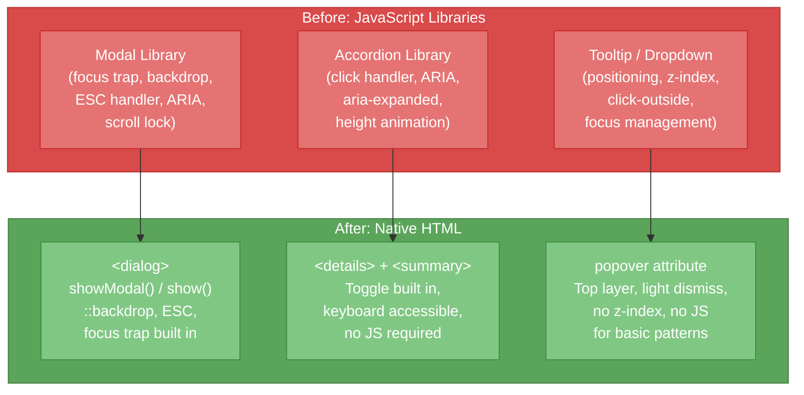

# [FEE-104] 媒體、嵌入與互動元素

:::info
HTML 提供原生元素來處理圖片、音訊、影片、嵌入內容，以及互動式 UI 模式。這些內建基礎元素處理響應式圖片傳遞、含字幕的媒體播放、透過沙箱化 iframe 的安全嵌入，以及互動式揭示與對話框模式 -- 全部不需要 JavaScript。理解這些元素至關重要，因為現代框架的媒體與互動抽象都建立在它們之上。
:::

## 背景

Web 最初是純文字媒介。圖片於 1993 年出現，當時 Marc Andreessen 將 `` 加入 Mosaic。音訊和影片需要外掛程式（RealPlayer、Flash）超過十年，直到 HTML5 在 2008-2014 年引入原生 `<video>` 和 `<audio>`。互動模式如 modal、accordion 和 tooltip 完全以 JavaScript 建構，直到平台新增了 `<dialog>`、`<details>`/`<summary>` 和 Popover API。

### 媒體元素（Media elements）

| 元素 | 用途 |
|------|------|
| `` | 點陣或向量圖片，透過 `srcset`/`sizes` 進行響應式傳遞 |
| `<picture>` | 藝術指導包裝器（art direction wrapper）-- 依據 media query 或格式選擇 `<source>` 元素 |
| `<video>` | 原生影片播放，含控制列、海報圖片與多重來源 |
| `<audio>` | 原生音訊播放，含控制列與多重來源 |
| `<source>` | 為 `<video>`、`<audio>` 或 `<picture>` 宣告媒體資源 |
| `<track>` | 為 `<video>` 和 `<audio>` 提供計時文字軌（字幕、副標題、描述） |
| `<canvas>` | 由 JavaScript 驅動的 2D/3D 繪圖表面（Canvas API、WebGL、WebGPU） |
| `<svg>` | 可縮放向量圖形 -- 行內或參照方式，可用 CSS 設定樣式 |

### 嵌入元素（Embedding elements）

| 元素 | 用途 |
|------|------|
| `<iframe>` | 嵌入另一份 HTML 文件，具備安全控制（sandbox、allow、CSP） |
| `<embed>` | 通用外部內容（舊式，現今幾乎不需要） |
| `<object>` | 嵌入外部資源（舊式，實務上已被 iframe/video/audio 取代） |

### 互動元素（Interactive elements）

| 元素 / API | 用途 |
|-------------|------|
| `<dialog>` | 模態或非模態對話框，內建焦點陷阱（focus trap）、背景遮罩、ESC 關閉 |
| `<details>` + `<summary>` | 揭示元件（disclosure widget）-- 不需 JavaScript 的原生 accordion |
| `popover` 屬性 | 任何元素上的彈出行為 -- tooltip、dropdown、toast 模式 |

### 響應式圖片：srcset、sizes 與 picture

響應式圖片解決一個根本問題：單一圖片檔案無法為每個裝置提供最佳服務。2000px 的 hero 圖片在 375px 手機上浪費頻寬；375px 的圖片在 4K 顯示器上看起來模糊。

**帶有寬度描述符的 `srcset`** 告訴瀏覽器可用的圖片檔案及其固有寬度：

```html

```

`sizes` 屬性告訴瀏覽器在每個斷點（breakpoint）圖片將顯示多寬。瀏覽器結合 `srcset` 寬度、`sizes` 版面寬度和裝置像素比（device pixel ratio）來選擇最佳檔案 -- 全部在 CSS 載入之前完成。

**用於藝術指導和格式選擇的 `<picture>`：**

```html
<picture>
  <source media="(max-width: 600px)" srcset="hero-portrait.avif" type="image/avif" />
  <source media="(max-width: 600px)" srcset="hero-portrait.webp" type="image/webp" />
  <source srcset="hero-landscape.avif" type="image/avif" />
  <source srcset="hero-landscape.webp" type="image/webp" />
  
</picture>
```

### 圖片效能屬性（Image performance attributes）

- **`loading="lazy"`** -- 延遲載入直到圖片接近視埠。僅用於折疊下方（below-fold）的圖片。
- **`fetchpriority="high"`** -- 告訴瀏覽器以高優先權取得圖片。用於 LCP（Largest Contentful Paint）圖片。
- **`decoding="async"`** -- 允許瀏覽器在主執行緒之外解碼圖片。適合非關鍵圖片。

### 影片與音訊（Video and audio）

```html
<video controls width="640" poster="poster.jpg" preload="metadata">
  <source src="video.mp4" type="video/mp4" />
  <source src="video.webm" type="video/webm" />
  <track kind="captions" src="captions-en.vtt" srclang="en" label="English" default />
  <track kind="captions" src="captions-zh.vtt" srclang="zh" label="Chinese" />
  <p>Your browser does not support HTML video. <a href="video.mp4">Download</a>.</p>
</video>
```

`<track>` 元素提供 WebVTT 字幕以確保無障礙。沒有字幕的影片內容對聾人和聽障使用者而言無法存取，且不符合 WCAG 1.2.2（Captions - Prerecorded）。

### iframe 沙箱化（iframe sandboxing）

`sandbox` 屬性限制嵌入內容可以執行的操作：

```html
<iframe
  src="https://third-party-widget.example.com"
  sandbox="allow-scripts allow-same-origin"
  allow="camera; microphone"
  loading="lazy"
  title="Customer support chat"
></iframe>
```

沒有 `sandbox` 的 iframe 對 JavaScript、表單、彈出視窗和導覽擁有完全存取權。該屬性建立限制性預設值，並要求明確選擇加入：

| Token | 允許的操作 |
|-------|-----------|
| `allow-scripts` | JavaScript 執行 |
| `allow-same-origin` | 將內容視為同源（cookies/storage 所需） |
| `allow-forms` | 表單送出 |
| `allow-popups` | `window.open()` 和 `target="_blank"` 連結 |
| `allow-top-navigation` | 導覽頂層瀏覽上下文（top-level browsing context） |
| `allow-modals` | `alert()`、`confirm()`、`prompt()` |

`allow` 屬性控制 Permissions Policy（前身為 Feature Policy），管控對裝置 API 的存取，如相機、麥克風、地理位置和全螢幕。

**Content Security Policy (CSP)** 在 HTTP 標頭層級補充 iframe 沙箱化。`frame-src` 指令控制哪些來源可以被嵌入：

```
Content-Security-Policy: frame-src 'self' https://trusted-cdn.example.com;
```

### Canvas 與 SVG

**Canvas** 提供由 JavaScript 驅動的像素繪圖表面。它擅長即時渲染（遊戲、資料視覺化、影像處理），但其內容不屬於 DOM，沒有明確的備用內容時對螢幕閱讀器而言無法存取。

**SVG** 是與 DOM 整合的向量格式。SVG 元素可用 CSS 設定樣式、添加動畫，並透過 `<title>` 和 `<desc>` 元素確保無障礙。行內 SVG（inline SVG）是圖示和插圖的首選，因為它避免額外的網路請求且完全可設定樣式。

## 使用情境

你正在為一個登陸頁面添加產品影片。初始實作使用單一個 `<video src="video.mp4">`，無論螢幕大小或網路速度，頁面載入時就會下載完整的 80 MB 檔案。HTML 的響應式媒體元素——圖片用 `<picture>` 搭配 `<source>`、影片用 `<video>` 搭配 `<source>` 進行格式協商、`loading="lazy"` 延遲載入——讓瀏覽器在不需要 JavaScript 的情況下，自動為當前情境選擇最合適的資源。

## 設計思維（Design Thinking）

### 為何平台新增了原生互動元素

多年來，Web 缺乏常見互動的原生 UI 模式。開發者完全以 JavaScript 建構 modal、accordion 和 tooltip -- 數以百計的函式庫，各自以不同品質和無障礙程度重新實作相同行為。平台的回應是新增原生元素，提供這些模式並內建無障礙支援、鍵盤支援和焦點管理。

**`<dialog>` 取代了 modal 函式庫。** 在 `<dialog>` 出現之前，建立 modal 需要：一個 JavaScript 函式庫管理開啟/關閉狀態、一個焦點陷阱（focus trap）將鍵盤焦點保持在 modal 內部、一個 ESC 鍵事件監聽器用於關閉、一個帶點擊關閉功能的背景遮罩、`aria-modal="true"` 和角色管理，以及 body 的捲動鎖定（scroll lock）。原生 `<dialog>` 元素宣告式地提供所有這些功能：

- `.showModal()` 以模態方式開啟，內建焦點陷阱
- `.show()` 以非模態方式開啟
- `::backdrop` 偽元素設定遮罩樣式
- ESC 預設關閉對話框（可透過 `closedby` 屬性設定）
- 瀏覽器自動管理 `aria-modal` 和焦點還原

**`<details>`/`<summary>` 取代了 accordion JavaScript。** 揭示元件（disclosure widget）以前需要點擊處理器、ARIA 屬性（`aria-expanded`、`aria-controls`）、高度動畫和狀態管理。原生元素以零 JavaScript 處理切換行為、鍵盤互動和無障礙播報。

**Popover API 取代了 tooltip 和 dropdown 函式庫。** `popover` 屬性（2024 年加入 Baseline）提供：

- 頂層渲染（top-layer rendering）-- 不再有 z-index 大戰
- 輕觸關閉（light dismiss）-- 點擊外部即關閉
- 焦點管理
- 巢狀支援
- 基本顯示/隱藏不需要 JavaScript

### 框架媒體抽象（Framework media abstractions）

現代框架包裝原生圖片元素，自動化響應式圖片最佳化：

**Next.js Image**（`next/image`）自動產生帶有最佳化寬度的 `srcset`、透過內容協商（content negotiation）提供現代格式（WebP、AVIF）、預設套用 `loading="lazy"`、載入時提供模糊佔位符（blur-up placeholder），並強制 width/height 以防止累積版面位移（Cumulative Layout Shift, CLS）。

**Nuxt Image**（`nuxt/image`）提供 `<NuxtImg>` 元件，具備類似的自動 srcset 產生、供應商整合（Cloudinary、imgix、Vercel），以及格式最佳化。

**Astro Image**（`astro:assets`）在建置時最佳化圖片、產生多種尺寸、轉換為現代格式，並與 Astro 建置管線整合以達到零執行時期成本的最佳化。

這些抽象存在的原因是：正確的響應式圖片標記冗長且容易出錯。單一響應式圖片可能需要 5-10 個 `<source>` 元素的格式和尺寸組合。框架將此自動化，但產生的 HTML 仍使用相同的 ``、`srcset`、`sizes` 和 `<picture>` 基礎元素。

## 最佳實踐

**始終為圖片提供描述性的 alt 文字。** 每個 `` MUST 具備 `alt` 屬性。對於具有資訊價值的圖片，使用能描述其內容與目的的文字。只有對純裝飾性圖片才使用 `alt=""`；完全省略該屬性會讓螢幕閱讀器播報檔名，對使用者毫無意義。

**使用 `<picture>` 和 `srcset` 為每個裝置提供適當的圖片。** SHOULD 使用寬度描述符（`400w`、`800w`、`1600w`）和精確的 `sizes` 值提供多個圖片來源，讓瀏覽器在 CSS 載入前即可選擇最佳檔案。對於折疊上方（above-fold）的 hero 圖片，AVOID 使用 `loading="lazy"`，應改用 `fetchpriority="high"` 以避免延遲 Largest Contentful Paint 分數。

**`loading="lazy"` 僅用於折疊下方的圖片。** 瀏覽器原生延遲載入是強大的效能工具，但 MUST 保留給頁面載入時不立即可見的圖片。對 LCP 圖片或任何折疊上方的內容套用 `loading="lazy"` 會增加延遲，損害 Core Web Vitals。

**為每部含有意義音訊的影片加入 `<track>` 字幕。** 所有含有語音或重要音訊的 `<video>` 元素 MUST 至少包含一個帶有 WebVTT 檔案的 `<track kind="captions">`。省略字幕會使聾人和聽障使用者無法存取內容，且不符合 WCAG 1.2.2（Captions - Prerecorded）Level A。

**對所有第三方 iframe 進行沙箱化，僅授予必要權限。** 每個載入外部內容的 `<iframe>` MUST 帶有 `sandbox` 屬性，該屬性預設為最大限制。接著 SHOULD 僅新增元件運作所需的 token（例如 `allow-scripts`），並 AVOID 在不受信任的內容上同時授予 `allow-same-origin` 與 `allow-scripts`，因為這兩者的組合可能讓嵌入頁面移除沙箱限制。

**優先使用 `<details>`/`<summary>` 實現漸進式揭示（progressive disclosure）模式。** 當內容可按需顯示或隱藏時（FAQ、可展開區塊、次要資訊），作者 SHOULD 使用原生揭示元件，而非建立自訂 accordion。原生元素以零 JavaScript 提供鍵盤互動、無障礙播報和切換語意，消除整個類別的焦點管理錯誤。

## 視覺化（Visual）

### 原生元素取代 JavaScript 函式庫



從 JavaScript 函式庫轉向原生 HTML 元素可減少打包體積、預設改善無障礙性，並消除整個類別的錯誤（z-index 堆疊、焦點陷阱邊界情況、捲動鎖定衝突）。每個原生元素以單一元素或屬性取代數百行函式庫程式碼。

## 範例（Example）

### 1. 使用 picture + srcset 的響應式圖片

```html
<picture>
  <!-- 藝術指導：行動裝置使用不同裁切 -->
  <source
    media="(max-width: 768px)"
    srcset="hero-mobile-400.avif 400w, hero-mobile-800.avif 800w"
    sizes="100vw"
    type="image/avif"
  />
  <source
    media="(max-width: 768px)"
    srcset="hero-mobile-400.webp 400w, hero-mobile-800.webp 800w"
    sizes="100vw"
    type="image/webp"
  />

  <!-- 桌面版：橫向裁切搭配格式備援 -->
  <source
    srcset="hero-desktop-800.avif 800w, hero-desktop-1600.avif 1600w"
    sizes="(max-width: 1200px) 100vw, 1200px"
    type="image/avif"
  />
  <source
    srcset="hero-desktop-800.webp 800w, hero-desktop-1600.webp 1600w"
    sizes="(max-width: 1200px) 100vw, 1200px"
    type="image/webp"
  />

  <!-- 不支援 avif/webp 的瀏覽器備援 -->
  
</picture>
```

此範例結合藝術指導（行動裝置與桌面版使用不同裁切）、格式協商（AVIF、WebP、JPEG 備援），以及效能最佳化（LCP 圖片使用 `fetchpriority="high"`、明確的 `width`/`height` 防止版面位移）。

### 2. 原生 dialog modal

```html
<button id="open-dialog" type="button">Open Settings</button>

<dialog id="settings-dialog">
  <form method="dialog">
    <h2>Settings</h2>

    <label for="theme-select">Theme</label>
    <select id="theme-select" name="theme">
      <option value="light">Light</option>
      <option value="dark">Dark</option>
      <option value="system">System</option>
    </select>

    <label for="notifications">
      <input id="notifications" name="notifications" type="checkbox" checked />
      Enable notifications
    </label>

    <div>
      <button type="submit" value="save">Save</button>
      <button type="submit" value="cancel">Cancel</button>
    </div>
  </form>
</dialog>

<script>
  const dialog = document.getElementById('settings-dialog');
  const openBtn = document.getElementById('open-dialog');

  openBtn.addEventListener('click', () => {
    dialog.showModal(); // 以模態方式開啟，含焦點陷阱和背景遮罩
  });

  dialog.addEventListener('close', () => {
    if (dialog.returnValue === 'save') {
      const formData = new FormData(dialog.querySelector('form'));
      console.log('Theme:', formData.get('theme'));
      console.log('Notifications:', formData.get('notifications'));
    }
  });
</script>

<style>
  dialog::backdrop {
    background: rgba(0, 0, 0, 0.5);
    backdrop-filter: blur(4px);
  }

  dialog[open] {
    animation: slide-in 200ms ease-out;
  }

  @keyframes slide-in {
    from {
      opacity: 0;
      transform: translateY(-20px);
    }
    to {
      opacity: 1;
      transform: translateY(0);
    }
  }
</style>
```

`method="dialog"` 的表單在送出時關閉對話框，無需頁面重新載入。每個送出按鈕的 `value` 屬性成為 `dialog.returnValue`，允許不同的關閉動作。瀏覽器自動處理焦點陷阱、ESC 關閉、背景遮罩和 `aria-modal`。

### 3. popover 屬性

```html
<!-- 宣告式 popover：不需要 JavaScript -->
<button popovertarget="menu-popover" type="button">
  Open Menu
</button>

<div id="menu-popover" popover>
  <nav>
    <ul>
      <li><a href="/profile">Profile</a></li>
      <li><a href="/settings">Settings</a></li>
      <li><a href="/logout">Log out</a></li>
    </ul>
  </nav>
</div>

<style>
  [popover] {
    /* 定位在頂層 -- 不需要 z-index */
    border: 1px solid #ccc;
    border-radius: 8px;
    padding: 0.5rem;
    box-shadow: 0 4px 12px rgba(0, 0, 0, 0.15);
  }

  /* 進入與離開動畫 */
  [popover]:popover-open {
    animation: fade-in 150ms ease-out;
  }

  @keyframes fade-in {
    from { opacity: 0; transform: scale(0.95); }
    to { opacity: 1; transform: scale(1); }
  }
</style>
```

`popover` 屬性（等同於 `popover="auto"`）提供自動關閉行為：點擊 popover 外部、按 ESC，或開啟另一個 `auto` popover 即會關閉。不需要 JavaScript 事件監聽器、不需要點擊外部偵測、不需要 z-index 管理。按鈕上的 `popovertarget` 屬性宣告式地將其連接到 popover 元素。

## 相關 FEE（Related FEEs）

| FEE | 關聯 |
|-----|------|
| [FEE-100 HTML & Semantic Markup Overview](./100.md) | 父層概覽，涵蓋完整 HTML 類別，包括媒體和互動元素。 |
| [FEE-102 Semantic Elements & Accessibility](./102.md) | 無障礙基礎。Alt 文字要求、自訂元件的 ARIA 角色，以及無障礙名稱計算適用於所有媒體和互動元素。 |
| [FEE-204 Responsive Images CSS](./204.md) | CSS 端的響應式圖片技術（object-fit、aspect-ratio、container queries）補充此處涵蓋的 HTML 端 srcset/sizes/picture。 |
| [FEE-1000 Accessibility](./1000.md) | 全面的無障礙覆蓋。媒體無障礙（alt、字幕、逐字稿）和互動元素無障礙（dialog 焦點、popover 語意）在該處詳細說明。 |

## 參考資料（References）

- [WHATWG HTML Living Standard -- Embedded Content](https://html.spec.whatwg.org/multipage/embedded-content.html) -- img、picture、video、audio、source、track、iframe、embed、object、canvas 和 SVG 元素的權威規範
- [WHATWG HTML Living Standard -- Interactive Elements](https://html.spec.whatwg.org/multipage/interactive-elements.html) -- dialog 和 details/summary 元素的規範
- [WHATWG HTML Living Standard -- The iframe Element](https://html.spec.whatwg.org/dev/iframe-embed-object.html) -- iframe 沙箱化、allow 屬性和安全模型的規範
- [MDN: The Dialog Element](https://developer.mozilla.org/en-US/docs/Web/HTML/Reference/Elements/dialog) -- 模態和非模態 dialog 模式、showModal()、close 事件的參考
- [MDN: Popover API](https://developer.mozilla.org/en-US/docs/Web/API/Popover_API) -- popover 屬性、popovertarget 和 popover 狀態（auto、hint、manual）的參考
- [MDN: Responsive Images](https://developer.mozilla.org/en-US/docs/Learn/HTML/Multimedia_and_embedding/Responsive_images) -- srcset、sizes 和 picture 元素的響應式圖片傳遞指南
- [MDN: The iframe Element](https://developer.mozilla.org/en-US/docs/Web/HTML/Reference/Elements/iframe) -- iframe 屬性的參考，包括 sandbox、allow 和安全考量
- [web.dev: Responsive Images](https://web.dev/learn/design/responsive-images) -- 響應式圖片技術和效能最佳化的實務指南
- [web.dev: Browser-level Image Lazy Loading](https://web.dev/articles/browser-level-image-lazy-loading) -- loading=lazy 屬性使用方式和效能影響的指南
- [web.dev: Popover and Dialog](https://web.dev/learn/css/popover-and-dialog) -- dialog 和 popover 模式的比較與實務範例
- [Can I Use: dialog](https://caniuse.com/dialog) -- dialog 元素的瀏覽器支援表（自 2022 年 3 月起為 Baseline）
- [Can I Use: popover](https://caniuse.com/mdn-api_htmlelement_popover) -- Popover API 的瀏覽器支援表（自 2024 年 4 月起為 Baseline）
- [Next.js Image Component](https://nextjs.org/docs/app/api-reference/components/image) -- 框架層級的響應式圖片最佳化，含自動 srcset 產生
