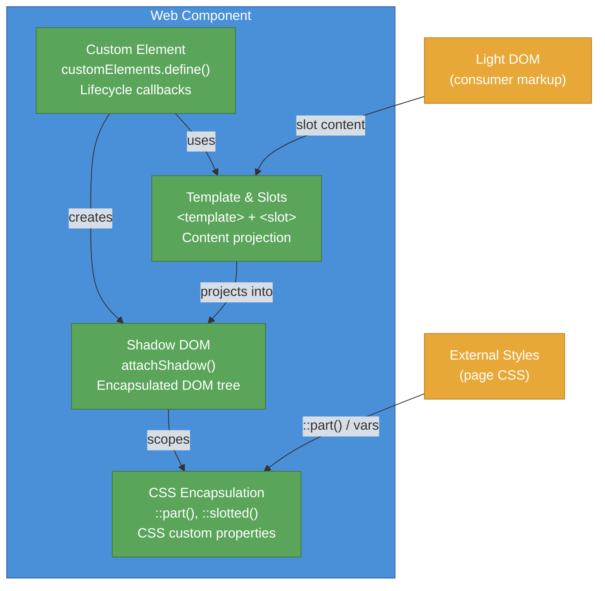

# [FEE-105] Web Components 與自訂元素

:::info
Web Components 是一組瀏覽器原生 API，讓你定義可重用、封裝的 HTML 元素。Custom Elements、Shadow DOM、HTML Templates 與 Slots 協同運作，提供不需任何框架依賴的元件化開發。理解這些 API 至關重要，因為它們是平台對元件架構的解答 -- 每個主流框架現在都提供與它們的互通性。
:::

## 背景

可重用 UI 元件的概念早於 Web。桌面工具集（Tk、MFC、Swing）在 1990 年代就提供了元件模型。在 Web 上，這個概念從 jQuery 插件開始浮現，然後隨框架具體化：AngularJS（2010）、React（2013）、Vue（2014）。每個框架發明了自己的元件模型，但彼此不相容 -- React 元件無法在 Angular 中使用，除非透過包裝器（wrapper）。

Web 平台的回應是標準化一個原生元件模型。關鍵規範如下：

| API | 用途 | 規範 |
|-----|------|------|
| **Custom Elements** | 定義具有生命週期回呼的新 HTML 標籤 | WHATWG HTML Living Standard |
| **Shadow DOM** | 封裝的 DOM 子樹與範圍樣式 | WHATWG DOM Standard |
| **HTML Templates** | 透過 `<template>` 的惰性標記片段 | WHATWG HTML Living Standard |
| **Slots** | 從 light DOM 投射內容到 shadow DOM | WHATWG HTML / DOM Standard |

### 時間線

| 年份 | 里程碑 |
|------|--------|
| 2011 | Alex Russell 在 Fronteers 大會提出 Web Components |
| 2013 | Chrome 在 flag 下發布 Custom Elements v0 與 Shadow DOM v0 |
| 2014 | Polymer 0.5 -- Google 基於 Web Components 建構的函式庫 |
| 2016 | Custom Elements v1 與 Shadow DOM v1 規範定案 |
| 2018 | Firefox 發布 Custom Elements v1 與 Shadow DOM v1 |
| 2020 | Edge（Chromium）發布完整 Web Components 支援；所有主流瀏覽器對齊 |
| 2023 | Declarative Shadow DOM 在 Chrome、Safari 發布；`shadowrootmode` 屬性標準化 |
| 2024 | Declarative Shadow DOM 達到 Baseline（Firefox 發布支援）；Lit 3.x 穩定版 |

### Custom Elements（自訂元素）

Custom Elements 讓你註冊新的 HTML 標籤。有兩種類型：

**自主自訂元素（Autonomous custom elements）** 繼承 `HTMLElement` 並定義全新行為：

```js
class MyAlert extends HTMLElement {
  constructor() {
    super();
  }
  connectedCallback() {
    this.textContent = 'Hello from <my-alert>!';
  }
}
customElements.define('my-alert', MyAlert);
```

**自訂內建元素（Customized built-in elements）** 使用 `is` 屬性繼承既有 HTML 元素（如 `HTMLButtonElement`）。瀏覽器支援不一致 -- Safari 未實作 -- 因此大多數函式庫避免使用。

### 生命週期回呼（Lifecycle callbacks）

| 回呼 | 觸發時機 |
|------|----------|
| `constructor()` | 元素建立或升級時。先呼叫 `super()`。不要存取屬性或子元素。 |
| `connectedCallback()` | 元素插入 DOM 時。可安全讀取屬性、取得資料、設置事件監聽器。 |
| `disconnectedCallback()` | 元素從 DOM 移除時。清理監聽器、觀察者、計時器。 |
| `attributeChangedCallback(name, oldValue, newValue)` | 被觀察的屬性改變時。需要靜態 `observedAttributes` getter。 |
| `adoptedCallback()` | 元素移動到新文件時（如透過 `document.adoptNode()`）。實務上罕見。 |

### Shadow DOM

Shadow DOM 提供 DOM 與樣式封裝。Shadow root 是附加到元素（即「shadow host」）的隔離子樹。Shadow root 內的樣式不會洩漏到外部，外部樣式也不會滲入（繼承屬性和 CSS 自訂屬性等特定例外除外）。

```js
class MyCard extends HTMLElement {
  constructor() {
    super();
    const shadow = this.attachShadow({ mode: 'open' });
    shadow.innerHTML = `
      <style>
        :host { display: block; border: 1px solid #ccc; border-radius: 8px; padding: 1rem; }
        :host([variant="highlight"]) { border-color: #4A90D9; }
        ::slotted(h2) { margin-top: 0; }
      </style>
      <slot></slot>
    `;
  }
}
customElements.define('my-card', MyCard);
```

**Mode：** `open` 允許外部 JavaScript 透過 `element.shadowRoot` 存取 shadow root。`closed` 隱藏它（回傳 `null`）。實務上幾乎總是偏好 `open` -- `closed` 提供虛假的安全感且會破壞開發者工具。

### 從外部設定 Shadow DOM 樣式

| 機制 | 作用對象 | 範例 |
|------|---------|------|
| CSS custom properties | 繼承進入 shadow DOM | `my-card { --card-bg: #fff; }` |
| `::part()` | Shadow DOM 內具有 `part` 屬性的元素 | `my-card::part(header) { color: blue; }` |
| `::slotted()` | 被 slot 的 light DOM 子元素（僅最上層） | `::slotted(h2) { font-size: 1.5rem; }` |
| `:host` | 從內部設定 shadow host 樣式 | `:host { display: block; }` |
| `:host()` | 條件式 host 樣式 | `:host([disabled]) { opacity: 0.5; }` |
| `:host-context()` | 基於祖先上下文的 host 樣式 | `:host-context(.dark) { background: #333; }` |

### HTML Templates 與 Slots

`<template>` 元素持有惰性 HTML，在透過 JavaScript 複製之前不會被渲染：

```html
<template id="card-template">
  <style>
    .card { border: 1px solid #ccc; padding: 1rem; }
  </style>
  <div class="card">
    <slot name="header"></slot>
    <slot></slot>
    <slot name="footer"></slot>
  </div>
</template>
```

**具名 slot（Named slots）** 投射特定子元素；**預設 slot**（未命名）接收所有未指定的子元素：

```html
<my-card>
  <h2 slot="header">Title</h2>
  <p>Main content goes into the default slot.</p>
  <footer slot="footer">Footer content</footer>
</my-card>
```

### Declarative Shadow DOM（宣告式 Shadow DOM）

傳統上，Shadow DOM 需要 JavaScript 呼叫 `attachShadow()`。Declarative Shadow DOM（DSD）透過帶有 `shadowrootmode` 屬性的 `<template>` 在靜態 HTML 中啟用 shadow root：

```html
<my-card>
  <template shadowrootmode="open">
    <style>
      :host { display: block; border: 1px solid #ccc; padding: 1rem; }
    </style>
    <slot></slot>
  </template>
  <p>This content is projected into the slot.</p>
</my-card>
```

DSD 對於 Web Components 的伺服器端渲染（SSR）至關重要。沒有它，shadow DOM 內容無法包含在初始 HTML 載荷中 -- 頁面必須等待 JavaScript 執行後元件才能渲染。DSD 於 2024 年在所有主流瀏覽器達到 Baseline 狀態。

### Form-associated custom elements（表單關聯自訂元素）

預設情況下，自訂元素不參與表單提交。`ElementInternals` API 改變了這一點：

```js
class MyInput extends HTMLElement {
  static formAssociated = true;

  constructor() {
    super();
    this.internals = this.attachInternals();
    this.attachShadow({ mode: 'open' });
  }

  connectedCallback() {
    this.shadowRoot.innerHTML = `
      <label><slot></slot></label>
      <input type="text" />
    `;
    const input = this.shadowRoot.querySelector('input');
    input.addEventListener('input', (e) => {
      this.internals.setFormValue(e.target.value);
    });
  }

  // 表單生命週期回呼
  formResetCallback() {
    this.shadowRoot.querySelector('input').value = '';
    this.internals.setFormValue('');
  }

  formStateRestoreCallback(state) {
    this.shadowRoot.querySelector('input').value = state;
    this.internals.setFormValue(state);
  }
}
customElements.define('my-input', MyInput);
```

`ElementInternals` 提供：

- **`setFormValue(value)`** -- 設定元素的提交值
- **`setValidity(flags, message, anchor)`** -- 使用 Constraint Validation API 的自訂驗證
- **`reportValidity()`** -- 觸發瀏覽器的驗證 UI
- **ARIA 委派（ARIA delegation）** -- `internals.role`、`internals.ariaLabel` 等
- **自訂狀態（Custom states）** -- `internals.states.add('checked')` 暴露 `:state(checked)` 偽類

### Custom Elements Manifest

Custom Elements Manifest（`custom-elements.json`）是一個社群標準檔案格式，描述套件的自訂元素 -- 其屬性（attributes）、特性（properties）、方法、事件、slots、CSS 自訂屬性和 CSS parts。目前 schema 版本為 2.1.0。

工具使用此 manifest 進行：

- **IDE 支援** -- 在 HTML 和模板語法中提供自動完成、懸停文件、未知標籤警告
- **文件生成** -- Storybook、API 文件檢視器
- **框架包裝器** -- 自動生成 React/Vue/Angular 包裝器

`@custom-elements-manifest/analyzer`（來自 Open Web Components）從原始碼生成 manifest。套件應在 `package.json` 中宣告 manifest 位置：

```json
{
  "customElements": "custom-elements.json"
}
```

## 使用情境

你們的設計系統團隊維護一個日期選擇器，被五個分別以 React、Vue、Angular 和純 HTML 建構的應用程式使用。每個框架都有自己的版本，錯誤修正必須分別套用到每個版本。若以 Custom Element 實作這個日期選擇器，它就能以標準 HTML 元素——`<date-picker>`——的形式在任何框架和任何 HTML 頁面中運作，修正只需部署一次，也無需任何框架轉接層。

## 設計思維

### 為什麼平台標準化了元件

框架為 Web 發明了元件模型。AngularJS（2010）引入了擴展 HTML 的指令（directives）。React（2013）引入了 JSX 和虛擬 DOM。Vue（2014）引入了單檔元件（single-file components）。每個都解決了相同的問題 -- 可重用、封裝的 UI 單元 -- 但創造了互不相容的生態系統。

平台標準化 Web Components 不是為了取代框架，而是提供一個**與框架無關的基線（framework-agnostic baseline）**。使用 `customElements.define()` 註冊的自訂元素可在任何渲染 HTML 的環境中運作：React、Vue、Angular、Svelte、伺服器端渲染的 HTML、CMS 主題、email 模板，或不需建置步驟的純 `.html` 檔案。

### 與框架的共存

Web Components 和框架不是競爭技術。它們佔據不同的利基：

**Lit**（Google，約 5KB）是原生 API 上的薄包裝，加入響應式屬性（reactive properties）、使用 tagged template literals 的宣告式模板，以及高效 DOM 更新。Lit 元件*就是*自訂元素 -- 它們繼承 `LitElement`，而 `LitElement` 繼承 `HTMLElement`。

**Stencil**（Ionic）是一個編譯器，從 TypeScript + JSX 撰寫格式產生標準自訂元素。輸出不依賴框架。

**Vue** 提供 `defineCustomElement()` 將任何 Vue 元件包裝為自訂元素，包含 SFC 樣式和 slot 映射。

**Angular Elements** 使用 `createCustomElement()` 將 Angular 元件包裝為自訂元素。

**React** 歷來對 Web Components 的支援有限（僅限字串屬性設定、無事件監聽器綁定）。React 19 改善了自訂元素屬性處理，但整合仍不如 Vue 或 Angular 順暢。

### 何時使用 Web Components

Web Components 擅長**橫向共享（horizontal sharing）** -- 跨不同框架或在框架之外使用的元件：

| 使用場景 | Web Components | 框架元件 |
|---------|----------------|---------|
| **設計系統（Design systems）** 供使用不同框架的團隊共用 | 首選 -- 到處都能運作 | 每個團隊需要框架專屬的包裝器 |
| **微前端（Micro-frontends）** | 很好的選擇 -- 每個微前端可使用任何內部技術 | 需要特定執行時期的 shell |
| **CMS 小工具、可嵌入元件** | 理想 -- 消費者不需框架依賴 | 需要打包框架執行時期 |
| **應用程式內部**（路由、狀態、複雜 UI） | 過度 -- 框架提供更好的開發者體驗 | 首選 -- 響應式狀態、工具鏈、生態系統 |
| **效能敏感的列表、表格** | 中性 -- Shadow DOM 每個實例有額外開銷 | 框架 virtual DOM 可批次更新 |

這個決定取決於上下文。一個為五個團隊（使用三種不同框架）建構元件的設計系統團隊，有充分理由使用 Web Components。一個建構單一 React 應用程式的產品團隊則沒有。

## 最佳實踐

**標籤名稱必須（MUST）包含連字號。** 每個自訂元素名稱必須包含至少一個連字號（例如 `my-button`、`app-header`）。這是瀏覽器的強制規定，用以區分自訂元素與內建 HTML 元素。應避免（AVOID）使用單字名稱；瀏覽器會靜默地將其視為未知的內建元素，而非自訂元素。

**為每個驅動渲染的屬性宣告 `observedAttributes`。** 靜態 `observedAttributes` getter 是元素與瀏覽器屬性變更通知系統之間的契約。必須（MUST）在此宣告所有響應式屬性；`attributeChangedCallback` 只會對列出的名稱觸發。應（SHOULD）將列表保持最小化——只包含變更需要進行 DOM 或狀態更新的屬性。

**在發布前審慎決定 Shadow DOM 邊界。** Shadow DOM 是單向門：之後新增或移除它會對使用 CSS 選擇器或遍歷元素內部的 JavaScript 的消費者造成破壞性變更。應（SHOULD）對沒有外部樣式需求的自完備元件使用 Shadow DOM。對於屬於設計系統的元件，應（SHOULD）透過 CSS custom properties 和 `::part()` 暴露樣式接口。避免（AVOID）使用 `closed` 模式——它在不提供真正安全性的情況下破壞 DevTools 的檢查功能。

**對任何參與表單的元素使用 `ElementInternals`。** 自訂元素預設不參與表單提交、驗證或重置。必須（MUST）設定 `static formAssociated = true` 並呼叫 `attachInternals()` 來選擇加入。應（SHOULD）實作 `formResetCallback` 和 `formStateRestoreCallback` 以匹配原生 input 的行為。避免（AVOID）攔截 `submit` 事件作為適當表單關聯的替代方案。

**保持 slot 組合淺層且明確。** 具名 slots（`slot="header"`、`slot="footer"`）使元素的組合 API 明確，並防止意外的內容投射。應（SHOULD）為不同的內容區域使用具名 slots，並為主體內容使用單一未命名的預設 slot。避免（AVOID）超過一層的 slot 巢狀——被 slot 的內容使用 `::slotted()` 設定樣式，而該選擇器只匹配頂層的被 slot 子元素，而非其後代。

## 視覺化

### Web Component 解剖圖



Web Component 結合四個平台 API 形成單一可重用元素。Custom Element 定義標籤及其行為。Shadow DOM 提供封裝的 DOM 子樹與範圍樣式。Templates 與 Slots 啟用從消費者的 light DOM 到元件 shadow DOM 的內容投射。CSS 封裝保持樣式隔離，同時 `::part()`、`::slotted()` 和 CSS custom properties 為消費者提供受控的樣式接口。

## 範例

### 1. 帶有 Shadow DOM 的基本自訂元素

```html
<user-badge name="Alice" role="admin"></user-badge>

<script>
class UserBadge extends HTMLElement {
  static observedAttributes = ['name', 'role'];

  constructor() {
    super();
    this.attachShadow({ mode: 'open' });
  }

  connectedCallback() {
    this.render();
  }

  attributeChangedCallback() {
    // 當觀察的屬性改變時重新渲染
    if (this.shadowRoot) this.render();
  }

  render() {
    const name = this.getAttribute('name') || 'Unknown';
    const role = this.getAttribute('role') || 'user';
    this.shadowRoot.innerHTML = `
      <style>
        :host {
          display: inline-flex;
          align-items: center;
          gap: 0.5rem;
          padding: 0.25rem 0.75rem;
          border-radius: 9999px;
          font-family: system-ui, sans-serif;
          font-size: 0.875rem;
          border: 1px solid #ccc;
        }
        :host([role="admin"]) {
          border-color: #4A90D9;
          background: #EBF3FB;
        }
        .dot {
          width: 8px;
          height: 8px;
          border-radius: 50%;
          background: #5BA55B;
        }
        span { font-weight: 600; }
      </style>
      <span class="dot" part="indicator"></span>
      <span part="name">${name}</span>
      <small>(${role})</small>
    `;
  }
}
customElements.define('user-badge', UserBadge);
</script>
```

此範例展示：使用 `customElements.define()` 註冊自訂元素、使用 `observedAttributes` 搭配 `attributeChangedCallback` 實現響應式屬性變化、Shadow DOM 樣式封裝、`:host()` 條件式 host 樣式，以及 `part` 屬性作為外部樣式接口。

### 2. 使用 slots 的內容投射

```html
<template id="info-panel-template">
  <style>
    :host {
      display: block;
      border: 1px solid #ddd;
      border-radius: 8px;
      overflow: hidden;
      font-family: system-ui, sans-serif;
    }
    header {
      background: #f5f5f5;
      padding: 0.75rem 1rem;
      border-bottom: 1px solid #ddd;
    }
    .body { padding: 1rem; }
    footer {
      background: #fafafa;
      padding: 0.5rem 1rem;
      border-top: 1px solid #ddd;
      font-size: 0.875rem;
      color: #666;
    }
    ::slotted(h2) { margin: 0; font-size: 1.125rem; }
    ::slotted(p) { margin: 0.5rem 0 0; }
  </style>
  <header><slot name="header"></slot></header>
  <div class="body"><slot></slot></div>
  <footer><slot name="footer">Default footer text</slot></footer>
</template>

<script>
class InfoPanel extends HTMLElement {
  constructor() {
    super();
    const template = document.getElementById('info-panel-template');
    this.attachShadow({ mode: 'open' })
        .appendChild(template.content.cloneNode(true));
  }
}
customElements.define('info-panel', InfoPanel);
</script>

<!-- 使用方式 -->
<info-panel>
  <h2 slot="header">Server Status</h2>
  <p>All systems operational.</p>
  <p>Last checked: 2 minutes ago.</p>
  <span slot="footer">Updated every 60 seconds</span>
</info-panel>
```

此範例展示：使用 `<template>` 作為元件標記、具名 slots（`header`、`footer`）與預設 slot 的內容投射、`::slotted()` 設定投射內容的樣式，以及 `<slot>` 元素內的回退內容（當未指派內容時顯示「Default footer text」）。

### 3. 帶有 ElementInternals 的表單關聯自訂元素

```html
<form id="demo-form">
  <star-rating name="rating" required>Rating</star-rating>
  <button type="submit">Submit</button>
</form>

<script>
class StarRating extends HTMLElement {
  static formAssociated = true;
  static observedAttributes = ['value'];

  constructor() {
    super();
    this.internals = this.attachInternals();
    this.attachShadow({ mode: 'open' });
    this._value = 0;
  }

  connectedCallback() {
    this.shadowRoot.innerHTML = `
      <style>
        :host { display: inline-flex; align-items: center; gap: 0.5rem; }
        .stars { display: inline-flex; cursor: pointer; }
        .star { font-size: 1.5rem; color: #ccc; transition: color 0.15s; }
        .star.active { color: #f5a623; }
        .star:hover, .star:hover ~ .star { color: #f5c66a; }
        label { font-size: 0.875rem; font-family: system-ui, sans-serif; }
        :host(:state(invalid)) .stars { outline: 2px solid red; border-radius: 4px; }
      </style>
      <label><slot></slot></label>
      <span class="stars" role="radiogroup">${
        [1, 2, 3, 4, 5].map(n =>
          `<span class="star" role="radio" aria-label="${n} star${n > 1 ? 's' : ''}" data-value="${n}">&#9733;</span>`
        ).join('')
      }</span>
    `;

    this.shadowRoot.querySelector('.stars').addEventListener('click', (e) => {
      const star = e.target.closest('.star');
      if (!star) return;
      this.value = Number(star.dataset.value);
    });

    // 設定初始驗證狀態
    if (this.hasAttribute('required')) {
      this.internals.setValidity(
        { valueMissing: true },
        'Please select a rating.',
        this.shadowRoot.querySelector('.stars')
      );
    }
  }

  get value() { return this._value; }

  set value(v) {
    this._value = v;
    this.internals.setFormValue(v > 0 ? String(v) : null);
    // 更新驗證狀態
    if (this.hasAttribute('required') && v === 0) {
      this.internals.setValidity(
        { valueMissing: true },
        'Please select a rating.',
        this.shadowRoot.querySelector('.stars')
      );
      this.internals.states.delete('valid');
      this.internals.states.add('invalid');
    } else {
      this.internals.setValidity({});
      this.internals.states.delete('invalid');
      this.internals.states.add('valid');
    }
    // 更新視覺狀態
    this.shadowRoot.querySelectorAll('.star').forEach((star, i) => {
      star.classList.toggle('active', i < v);
      star.setAttribute('aria-checked', i < v ? 'true' : 'false');
    });
  }

  formResetCallback() {
    this.value = 0;
  }

  formStateRestoreCallback(state) {
    this.value = Number(state) || 0;
  }
}
customElements.define('star-rating', StarRating);

document.getElementById('demo-form').addEventListener('submit', (e) => {
  e.preventDefault();
  const data = new FormData(e.target);
  console.log('Rating:', data.get('rating')); // "1" 到 "5"
});
</script>
```

此範例展示：`static formAssociated = true` 選擇加入表單參與、`attachInternals()` 進行表單整合、`setFormValue()` 設定提交值、`setValidity()` 搭配自訂驗證訊息、透過 `internals.states` 暴露為 CSS `:state(invalid)` 的自訂狀態，以及表單生命週期回呼（`formResetCallback`、`formStateRestoreCallback`）。

## 深入探討

### 自訂元素的升級生命週期

當 HTML 解析器遇到像 `<my-badge>` 這樣的未知標籤時，它會建立一個沒有自訂行為的普通 `HTMLElement` 實例。該元素存在於 DOM 中，但處於**未定義（undefined）**狀態——它沒有類別、沒有生命週期回呼，也沒有 shadow root。

`customElements.define('my-badge', MyBadge)` 將 registry 從 undefined 轉移到**已定義（defined）**狀態。瀏覽器隨後對 DOM 中已存在的每個匹配元素同步執行**升級演算法（upgrade algorithm）**。在升級過程中，元素的原型鏈被替換為已註冊的類別，`constructor` 主體執行（此時元素的屬性和子元素已存在），元素進入**已升級（upgraded）**狀態。

`connectedCallback` 在升級完成**之後**觸發，而非當解析器第一次遇到標籤時。這個區別很重要：如果呼叫 `customElements.define()` 的腳本以非同步方式載入（作為延遲載入或動態匯入的模組），會有一個時間窗口，在此期間元素存在於 DOM 中但沒有自訂行為。在這個時間窗口內，使用者可能看到未設定樣式或空白的內容。

對於伺服器端渲染（SSR）的 HTML，這個時序是渲染模型的核心。伺服器輸出元素的標記，瀏覽器解析並顯示它（可能透過 Declarative Shadow DOM 提供初始的視覺結構），當腳本到達時，自訂元素類別才升級該元素。元素在 JavaScript 載入之前就已渲染——相對於解析，升級是非同步的。

**`customElements.whenDefined()`** 是任何依賴元素升級後才執行的程式碼的正確模式：

```js
// 等待 'user-badge' 被定義後解析（現有元素的升級與 define() 同步執行）
await customElements.whenDefined('user-badge');
const badges = document.querySelectorAll('user-badge');
badges.forEach(badge => badge.refresh());
```

此方法回傳一個 Promise，在 `customElements.define()` 被呼叫後以建構函式解析。這比 `DOMContentLoaded`（在延遲腳本執行之前觸發）更安全，比全域 `load` 事件更精確。當協調依賴自訂元素行為可用性的頁面初始化邏輯時，應使用它。

以下是四個概念性的生命週期階段：**undefined**（解析器遇到未知標籤）→ **defined**（類別已註冊）→ **upgraded**（升級演算法執行，`constructor` 執行）→ **connected**（插入後觸發 `connectedCallback`）。注意：HTML 規範並不將「defined」和「upgraded」區分為獨立的可觀察狀態——升級作為 `define()` 的一部分同步執行。理解這些階段可防止在元素升級之前就讀取元素屬性或呼叫元素方法所導致的錯誤。

## 常見錯誤

### 1. 未在 constructor 中呼叫 super()

```js
// 錯誤：缺少 super() 呼叫
class MyElement extends HTMLElement {
  constructor() {
    this.data = [];
  }
}
```

**影響：** 瀏覽器會拋出 `ReferenceError`：「Must call super constructor in derived class before accessing 'this'」。元素無法被實例化。

**修正：** 始終將 `super()` 作為 constructor 的第一個語句：

```js
class MyElement extends HTMLElement {
  constructor() {
    super();
    this.data = [];
  }
}
```

### 2. 在 constructor 中操作 DOM

```js
// 錯誤：在 constructor 中存取屬性和子元素
class MyElement extends HTMLElement {
  constructor() {
    super();
    this.textContent = this.getAttribute('label'); // 屬性可能尚不存在
    this.appendChild(document.createElement('div')); // 在某些升級場景下會拋出錯誤
  }
}
```

**影響：** 當解析器建立元素時，屬性和子元素可能尚不可用。`createElement` 路徑和解析器升級路徑行為不同，導致結果不一致。規範明確禁止在 constructor 中檢查屬性或新增子元素。

**修正：** 將 DOM 操作延遲到 `connectedCallback()`：

```js
class MyElement extends HTMLElement {
  constructor() {
    super();
    this.attachShadow({ mode: 'open' }); // attachShadow 在 constructor 中是允許的
  }

  connectedCallback() {
    const label = this.getAttribute('label') || 'Default';
    this.shadowRoot.innerHTML = `<span>${label}</span>`;
  }
}
```

### 3. 忘記呼叫 customElements.define()

```html
<!-- 錯誤：class 已定義但從未註冊 -->
<my-widget>Content here</my-widget>
<script>
  class MyWidget extends HTMLElement {
    connectedCallback() {
      this.textContent = 'Widget loaded';
    }
  }
  // 缺少：customElements.define('my-widget', MyWidget);
</script>
```

**影響：** 瀏覽器將 `<my-widget>` 視為 `HTMLUnknownElement`。不會觸發任何生命週期回呼。元素出現在 DOM 中但沒有自訂行為。控制台沒有錯誤 -- 它靜默失敗。

**修正：** 始終在定義 class 之後註冊元素：

```js
customElements.define('my-widget', MyWidget);
```

注意：標籤名稱必須包含連字號（`-`）以區分自訂元素與內建 HTML 元素。

## 相關 FEEs

| FEE | 關係 |
|-----|------|
| [FEE-100 HTML 與語意化標記概觀](./100.md) | 涵蓋完整 HTML 類別（包含 Web Components 子主題）的父概觀。 |
| [FEE-102 語意化元素與無障礙](./102.md) | Slots 保留語意結構 -- 被 slot 的內容保留在無障礙樹中。ARIA 角色和屬性透過 ElementInternals 套用至自訂元素。 |
| [FEE-205 CSS 範圍與封裝](../CSS%20and%20Layout%20Systems/205.md) | Shadow DOM CSS 範圍規則、`::part()`、`::slotted()`、跨越 shadow 邊界的 CSS custom properties。 |
| [FEE-500 元件架構](../Component%20Architecture%20and%20Design%20Patterns/500.md) | Web Components 是平台的元件模型。框架元件模型（React、Vue、Angular）與自訂元素共存，可包裝或消費自訂元素。 |

## 參考資料

- [WHATWG HTML Living Standard -- Custom Elements](https://html.spec.whatwg.org/multipage/custom-elements.html) -- 自訂元素定義、生命週期回呼、表單關聯自訂元素和 CustomElementRegistry API 的權威規範
- [MDN: Web Components](https://developer.mozilla.org/en-US/docs/Web/API/Web_components) -- Custom Elements、Shadow DOM、Templates 和 Slots 的完整參考與指南
- [MDN: Using Custom Elements](https://developer.mozilla.org/en-US/docs/Web/API/Web_components/Using_custom_elements) -- 定義與使用自主和自訂內建元素的實用指南
- [MDN: Using Shadow DOM](https://developer.mozilla.org/en-US/docs/Web/API/Web_components/Using_shadow_DOM) -- attachShadow()、open 與 closed 模式及 shadow DOM 概念指南
- [MDN: Using Templates and Slots](https://developer.mozilla.org/en-US/docs/Web/API/Web_components/Using_templates_and_slots) -- template 元素與具名/預設 slot 內容投射指南
- [MDN: ElementInternals](https://developer.mozilla.org/en-US/docs/Web/API/ElementInternals) -- 表單關聯、自訂驗證、ARIA 委派和自訂狀態的 API 參考
- [web.dev: Custom Elements v1](https://web.dev/articles/custom-elements-v1) -- 自訂元素撰寫的實用指南與範例及最佳實踐
- [web.dev: Declarative Shadow DOM](https://web.dev/articles/declarative-shadow-dom) -- 使用 shadowrootmode 屬性進行 Web Components 伺服器端渲染的指南
- [Lit Documentation](https://lit.dev/docs/) -- Lit 文件，一個用於建構具有響應式屬性和宣告式模板的 Web Components 的輕量函式庫
- [Custom Elements Manifest](https://github.com/webcomponents/custom-elements-manifest) -- 用於在 custom-elements.json 中描述自訂元素 metadata 的社群標準 schema（v2.1.0）
- [WebKit: ElementInternals and Form-Associated Custom Elements](https://webkit.org/blog/13711/elementinternals-and-form-associated-custom-elements/) -- WebKit 對 ElementInternals API 和表單參與的說明
