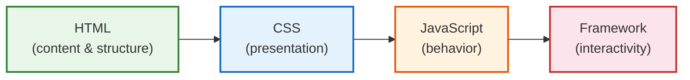

# [FEE-106] HTML API 與漸進增強

:::info
HTML 不只是標記語言 -- 它是具備內建互動性、導航、表單處理與資源載入的執行環境。漸進增強（Progressive Enhancement）是以此 HTML 基線為起點，再逐層疊加 CSS 與 JavaScript 的設計哲學。理解 HTML 的原生 API 與漸進增強模型至關重要，因為它能產出更快、更無障礙、更具韌性、更友善搜尋引擎的網站。
:::

## 背景

Web 最初是作為文件平台設計的。第一個網頁瀏覽器同時也是編輯器。連結可以導航，表單可以提交，內容無需腳本即可閱讀。這不是限制 -- 而是架構設計。

隨著 JavaScript 透過 DHTML（1997）、Ajax（2005）與單頁應用程式（2010 年代）獲得更多能力，開發者越來越多地將核心功能從 HTML 移至 JavaScript。結果是：腳本失敗時顯示空白頁面的網站、需要 200 KB bundle 才能提交的表單、以及破壞返回按鈕的導航。

漸進增強正是對這個趨勢的反思。這個術語由 Steve Champeon 於 2003 年提出，但其底層原則比 Web 本身更為古老 -- 工程中的優雅降級（graceful degradation）意味著系統在元件故障時仍能持續運作。漸進增強反轉了視角：不是建構完整體驗後降級，而是建構基線後增強。

### 增強層次



每一層增加能力，但前一層不依賴後者即可運作：

| 層次 | 提供的能力 | 無需 JS 即可運作？ |
|------|-----------|-------------------|
| **HTML** | 內容、連結、表單、媒體、結構 | 是 |
| **CSS** | 排版、色彩、字型、動畫、響應式設計 | 是 |
| **JavaScript** | DOM 操作、fetch、驗證、即時更新 | N/A |
| **Framework** | 元件、狀態管理、路由、hydration | 否 |

### HTML 互動功能時間線

| 年份 | 功能 | 規範 |
|------|------|------|
| 1993 | `<a href>` -- 超連結導航 | HTML 1.0 |
| 1995 | `<form>` 表單提交，含 `action` 與 `method` | HTML 2.0 |
| 1998 | `<details>` / `<summary>` 提案（後來才正式實作） | -- |
| 2006 | `contenteditable` 屬性 | WHATWG HTML |
| 2011 | `<details>` / `<summary>` 在 Chrome 中實作 | WHATWG HTML |
| 2014 | `draggable` 屬性與 Drag & Drop API | WHATWG HTML |
| 2017 | `loading="lazy"` 提案 | WHATWG HTML |
| 2019 | `loading="lazy"` 在 Chrome 中實作 | WHATWG HTML |
| 2022 | `inert` 屬性達到 Baseline | WHATWG HTML |
| 2023 | View Transitions API（同文件轉場） | W3C CSS WG / WHATWG |
| 2023 | `fetchpriority` 屬性達到 Baseline | WHATWG HTML |
| 2024 | Navigation API 達到 Baseline | WHATWG HTML |
| 2024 | 跨文件 View Transitions（Cross-document） | W3C CSS WG / WHATWG |

## 使用情境

你正在建構一個功能，預期在網路連線緩慢或 JavaScript 停用的情況下仍可運作，但在兩者都可用時能提供更豐富的體驗。直接寫死增強版體驗會排除那些無法使用的使用者；建構兩套獨立的程式碼路徑則讓維護成本加倍。漸進增強——從能在任何地方運作的語意 HTML 出發，再為能力較強的環境疊加 CSS 與 JavaScript——正是解決這個問題的策略，而 HTML 原生 API（details/summary、dialog、popover）也越來越能在不需要 JavaScript 的情況下實作常見的互動模式。

## 設計思維

### 為何 HTML 優先至關重要

**無需 JavaScript 即可運作。** 大約 1-2% 的使用者在無 JavaScript 的環境下瀏覽（企業代理伺服器、輔助設備、腳本封鎖器、網路故障）。一個帶有 `action="/submit" method="POST"` 的表單對所有人都有效。一個依賴 `fetch()` 點擊處理的表單則對他們全部無效。

**更快的首次渲染。** HTML 是串流式的。瀏覽器可以在 CSS 或 JavaScript 載入之前，隨著內容到達即開始渲染。一個伺服器渲染的頁面搭配 `<a>` 連結，在第一個位元組就能互動。一個 JavaScript 渲染的頁面只有在解析、編譯並執行後才能互動 -- 在中階行動裝置上通常需要 3-5 秒。

**預設無障礙。** 原生 HTML 元素自帶隱含的 ARIA 角色、鍵盤行為與焦點管理。`<button>` 可聚焦、可透過 Enter 和 Space 觸發，且被螢幕閱讀器宣告為「button」。`<div onclick>` 在未經手動補救的情況下不具備這些特性。

**SEO 友善。** 搜尋引擎能可靠地索引 HTML 內容。雖然 Googlebot 可以執行 JavaScript，但它在延遲渲染佇列中執行。HTML 內容則可被立即索引。

### 框架的漸進增強

現代框架已趨向一個共識：伺服器應渲染 HTML，JavaScript 應增強它。此光譜如下：

**SvelteKit form actions。** SvelteKit 的 `use:enhance` 指令漸進增強原生表單。無 JavaScript 時，表單透過標準 HTTP POST 提交。有 JavaScript 時，SvelteKit 攔截提交，透過 `fetch` 發送，並在不完整重新載入頁面的情況下更新內容。同一個 `+page.server.ts` action 處理兩種情境。

**Remix 哲學。** Remix 將資料流建模為 `request -> loader -> render -> action -> revalidate`。表單使用原生 `<form>` 搭配 `action` 與 `method`。`<Form>` 元件（大寫 F）添加客戶端增強，但會回退至原生行為。Remix 的指導原則：「Use the platform（使用平台）」。

**Astro Islands。** Astro 預設將頁面渲染為靜態 HTML，不傳送任何 JavaScript。互動元件透過 `client:*` 指令（`client:load`、`client:visible`、`client:idle`）明確標記，在靜態 HTML 的海洋中建立互動「島嶼（islands）」。來自任何框架（React、Vue、Svelte、Solid）的元件可以共存於同一頁面。

**Next.js Server Components。** React Server Components（RSC）在伺服器上執行，為元件本身產生零客戶端 JavaScript 的 HTML。客戶端元件透過 `"use client"` 明確標記。這建立了一個光譜：頁面可以完全伺服器渲染、完全客戶端渲染，或介於兩者之間。

**React Server Actions。** Server Actions 允許表單直接呼叫伺服器函式。`<form>` 的 `action` prop 接受一個非同步伺服器函式。無 JavaScript 時，表單回退至標準 POST 提交並完整重新載入頁面。

### SSR / Hydration 光譜

```
Static HTML ──> SSR ──> Selective Hydration ──> Full SPA
     │              │              │                   │
     │              │              │                   └─ 所有 JS 皆傳送，
     │              │              │                      客戶端渲染一切
     │              │              └─ 伺服器渲染 HTML，
     │              │                 僅互動部分 hydrate
     │              └─ 伺服器渲染完整 HTML，
     │                 客戶端重新渲染以附加事件處理器
     └─ 完全無 JavaScript，
        純 HTML/CSS
```

業界趨勢正朝此光譜的左方移動 -- 更少 JavaScript，更多 HTML。Astro、Qwik 與 Fresh 代表了這個方向。即使是 React（透過 Server Components）與 Next.js（透過 App Router）也比前代傳送更少的 JavaScript 給客戶端。

## 最佳實踐

**使用功能偵測（feature detection），而非 user-agent 嗅探。** MUST 透過檢查特定 API 是否存在（例如 `if (!document.startViewTransition)`）來判斷瀏覽器能力，而非解析 `navigator.userAgent`。功能偵測在各瀏覽器版本間皆可靠，且能避免廠商更新 UA 字串時產生偽陰性。AVOID 在任何漸進增強決策中依賴 UA 字串進行分支。

**以層次堆疊方式建構：先 HTML 基線，再 CSS，最後 JavaScript。** SHOULD 將每個互動流程設計為 HTML 層單獨即可提供可用功能 -- 一個可以提交的表單、一個可以導航的連結、可以閱讀的內容。CSS SHOULD 再加入排版與視覺效果。JavaScript SHOULD 在其上添加更豐富的行為，而不移除 HTML 層的路徑。僅存在於 JS 層的功能，在腳本失敗或被封鎖時對使用者而言是不可見的。

**優先使用 `<dialog>` 而非自製 modal 實作。** SHOULD 使用原生 `<dialog>` 元素搭配 `showModal()`，而非用 `<div>` 覆蓋層建構 modal。`<dialog>` 免費提供焦點捕捉（focus trapping）、Escape 鍵關閉、`::backdrop` 偽元素，以及正確的 ARIA `dialog` 角色。自製實作 MUST 手動重現所有這些行為，且通常在邊緣情況下有所遺漏。將 `<dialog>` 與背景內容的 `inert` 屬性結合，可實現縱深防禦（defense-in-depth）的焦點管理。

**對 View Transitions API 應用漸進增強。** MUST 在所有使用 `document.startViewTransition()` 的地方加上功能偵測檢查，且 MUST 在回退路徑中執行 DOM 更新，使頁面在不支援的瀏覽器中仍能正常運作。AVOID 將 View Transitions API 設為硬性依賴：轉場動畫是視覺增強，而非功能需求。

**使用 Popover API 處理非模態（non-modal）浮層。** SHOULD 使用宣告式的 `popover` 屬性與 `popovertarget` 來實現工具提示、選單與非阻塞式浮層，而非用 JavaScript 建構這些元件。Popover API 提供頂層渲染（top-layer rendering）、點擊外部或按 Escape 關閉的 light-dismiss 行為，以及正確的無障礙語義，切換本身無需任何腳本。保留 `<dialog>` 搭配 `showModal()` 給需要使用者必須回應才能繼續的流程。

## HTML 驅動的互動性（無需 JS）

### 連結導航

`<a>` 元素是 Web 最原始的互動元素。它無需任何 JavaScript 即可處理導航、歷史管理、焦點與無障礙：

```html
<!-- 基本導航 -- 在任何地方都能運作 -->
<nav>
  <a href="/products">Products</a>
  <a href="/about">About Us</a>
  <a href="#pricing">Jump to Pricing</a>
  <a href="mailto:support@example.com">Email Support</a>
</nav>
```

### 表單提交

表單僅使用 HTML 即可處理使用者輸入並將資料提交至伺服器：

```html
<!-- 搜尋表單 -- 無需 JavaScript 即可運作 -->
<form action="/search" method="GET">
  <label for="q">Search</label>
  <input id="q" name="q" type="search" required />
  <button type="submit">Search</button>
</form>
```

瀏覽器處理序列化（`q=term`）、HTTP 方法、編碼、重導向跟隨與錯誤顯示 -- 全部無需腳本。

### Details 揭露

`<details>` / `<summary>` 配對提供原生的展開/收合功能：

```html
<details>
  <summary>Shipping Information</summary>
  <p>We ship to 40 countries. Standard delivery takes 5-7 business days.</p>
  <p>Express delivery is available for an additional fee.</p>
</details>
```

瀏覽器處理切換狀態、鍵盤啟動（Enter/Space）以及 ARIA `expanded` 狀態。無需 JavaScript。

## 內容屬性作為 API

HTML 屬性是一個宣告式 API 介面。它們無需腳本即可配置行為：

### data-* 屬性

自訂 data 屬性儲存元素專屬的後設資料，可透過 `element.dataset` 存取：

```html
<button data-action="delete" data-item-id="42">Delete</button>

<script>
  // 增強：讀取 data 屬性進行事件委派
  document.addEventListener('click', (e) => {
    const btn = e.target.closest('[data-action]');
    if (!btn) return;
    const action = btn.dataset.action;   // "delete"
    const id = btn.dataset.itemId;       // "42"（camelCase 轉換）
    handleAction(action, id);
  });
</script>
```

### contenteditable

使任何元素可就地編輯：

```html
<div contenteditable="true" role="textbox" aria-label="Notes">
  Click to edit this text.
</div>
```

`contenteditable="plaintext-only"` 值（Baseline 2025）將輸入限制為純文字，防止富文字格式問題。

### draggable

啟用原生拖放功能：

```html
<div draggable="true" data-task-id="1">Task: Review PR #42</div>
```

Drag and Drop API（`dragstart`、`dragover`、`drop` 事件）建構在此屬性之上，用以建立可重排列表、檔案上傳區域與看板。

### inert

`inert` 屬性使元素及其所有後代變為不可互動：

```html
<!-- Modal 背後的內容設為 inert -->
<main inert>
  <h1>Page Content</h1>
  <p>This content cannot be focused, clicked, or selected while inert.</p>
</main>

<dialog open>
  <h2>Confirm Action</h2>
  <p>Are you sure you want to proceed?</p>
  <button>Cancel</button>
  <button>Confirm</button>
</dialog>
```

當設定 `inert` 時：
- 元素及後代從 Tab 順序中移除
- 點擊事件被忽略（`pointer-events: none` 行為）
- 文字選取被停用（`user-select: none` 行為）
- 元素對輔助技術隱藏（從無障礙樹中移除）
- 頁面搜尋（Ctrl+F）會跳過 inert 內容

### autofocus

當元素插入 DOM 時將焦點移至該元素：

```html
<dialog>
  <h2>Delete Item</h2>
  <p>This cannot be undone.</p>
  <button>Cancel</button>
  <button autofocus>Delete</button>
</dialog>
```

請謹慎使用 `autofocus` -- 它適用於對話框與 modal，但在頁面載入時會造成問題（打斷螢幕閱讀器的閱讀順序），在 SPA 路由切換時尤其有害，因為它可能意外移動焦點。

## 宣告式功能

### loading="lazy"

延遲載入圖片與 iframe，直到它們接近可視區域：

```html

<iframe src="https://maps.example.com/embed" loading="lazy"></iframe>
```

務必指定 `width` 與 `height`（或使用 CSS `aspect-ratio`）以防止版面偏移（layout shift）。不要對首屏（above-the-fold）圖片使用 lazy loading -- 它們應立即載入。

### fetchpriority

提示瀏覽器關於相對下載優先順序：

```html
<!-- LCP 圖片：盡快載入 -->


<!-- 首屏下方圖片：較低優先順序 -->


<!-- 關鍵 CSS 或腳本 -->
<link rel="preload" href="/fonts/Inter.woff2" as="font" fetchpriority="high" crossorigin />
```

值：`high`、`low`、`auto`（預設）。瀏覽器將這些提示與自身的啟發式演算法結合使用。在 LCP 圖片上設定 `fetchpriority="high"` 可將 Largest Contentful Paint 減少 100-400 毫秒。

### View Transitions API

View Transitions API 提供 DOM 狀態之間的動畫轉場。同文件轉場（same-document transitions）在所有主流瀏覽器中皆可運作（Baseline 2024）。跨文件轉場（cross-document transitions，MPA）已在 Chrome 中實作，其他瀏覽器正在推進中。

```html
<!-- 在 CSS 中啟用跨文件 view transitions -->
<style>
  @view-transition {
    navigation: auto;
  }
</style>
```

```js
// 同文件 view transition（SPA）
function navigateTo(newContent) {
  if (!document.startViewTransition) {
    // 回退：直接更新 DOM
    updateDOM(newContent);
    return;
  }

  document.startViewTransition(() => {
    updateDOM(newContent);
  });
}
```

元素可透過 `view-transition-name` 標記以進行配對元素轉場：

```css
.hero-image {
  view-transition-name: hero;
}
```

此 API 在設計上就是漸進增強 -- 若瀏覽器不支援，DOM 更新會立即發生，不帶動畫。

## Navigation API

Navigation API（Baseline 2024）提供 `history.pushState` / `popstate` 的現代替代方案。它與平台的導航模型整合，並支援 view transitions：

```js
navigation.addEventListener('navigate', (event) => {
  // 僅處理同源導航
  if (!event.canIntercept) return;

  const url = new URL(event.destination.url);

  event.intercept({
    handler: async () => {
      const content = await fetchPageContent(url.pathname);
      document.querySelector('main').innerHTML = content;
    },
  });
});
```

框架路由器（React Router、Vue Router、SvelteKit）現在建構在 Navigation API 之上或與其對齊。此 API 提供：

- `navigation.navigate()` -- 程式化導航
- `navigation.back()` / `navigation.forward()` -- 歷史遍歷
- `NavigateEvent.intercept()` -- 客戶端路由處理
- `navigation.currentEntry` -- 當前歷史條目及其狀態
- 透過 `NavigateEvent.intercept({ handler })` 回傳 view transitions 與 View Transitions API 整合

## 範例

### 1. 無 JS 可運作、有 JS 則增強的表單

此範例展示核心漸進增強模式：一個透過標準 HTTP 提交可運作的表單，在 JavaScript 可用時以 `fetch` 與樂觀 UI（optimistic UI）增強。

```html
<!-- 基線：無需 JavaScript 即可運作 -->
<form id="contact-form" action="/api/contact" method="POST">
  <label for="name">Name</label>
  <input id="name" name="name" type="text" required />

  <label for="email">Email</label>
  <input id="email" name="email" type="email" required />

  <label for="message">Message</label>
  <textarea id="message" name="message" required></textarea>

  <button type="submit">Send Message</button>
  <output name="status" aria-live="polite"></output>
</form>

<!-- 增強：fetch + 樂觀 UI -->
<script>
  const form = document.getElementById('contact-form');
  const statusOutput = form.querySelector('output[name="status"]');

  form.addEventListener('submit', async (event) => {
    event.preventDefault();

    const submitBtn = form.querySelector('button[type="submit"]');
    const originalText = submitBtn.textContent;

    // 樂觀 UI：顯示傳送狀態
    submitBtn.disabled = true;
    submitBtn.textContent = 'Sending...';
    statusOutput.textContent = '';

    try {
      const response = await fetch(form.action, {
        method: form.method,
        body: new FormData(form),
      });

      if (!response.ok) throw new Error('Submission failed');

      statusOutput.textContent = 'Message sent successfully!';
      form.reset();
    } catch (error) {
      statusOutput.textContent = 'Failed to send. Please try again.';
    } finally {
      submitBtn.disabled = false;
      submitBtn.textContent = originalText;
    }
  });
</script>
```

無 JavaScript 時：表單透過 HTTP POST 提交，伺服器處理並回傳回應頁面。有 JavaScript 時：表單攔截提交，透過 `fetch` 發送，顯示樂觀 UI 回饋，並在不完整重新載入頁面的情況下更新。兩條路徑使用相同的 `action` URL 與 `method`。

### 2. 用 inert 屬性處理 Dialog 背景

```html
<body>
  <main id="page-content">
    <h1>Application</h1>
    <p>Main page content with interactive elements.</p>
    <button id="open-dialog">Open Settings</button>
  </main>

  <dialog id="settings-dialog">
    <h2>Settings</h2>
    <form method="dialog">
      <label>
        <input type="checkbox" name="notifications" />
        Enable notifications
      </label>
      <menu>
        <button value="cancel">Cancel</button>
        <button value="save" autofocus>Save</button>
      </menu>
    </form>
  </dialog>

  <script>
    const pageContent = document.getElementById('page-content');
    const dialog = document.getElementById('settings-dialog');
    const openBtn = document.getElementById('open-dialog');

    openBtn.addEventListener('click', () => {
      pageContent.inert = true;
      dialog.showModal();
    });

    dialog.addEventListener('close', () => {
      pageContent.inert = false;
      openBtn.focus();
    });
  </script>
</body>
```

`<dialog>` 元素搭配 `showModal()` 已經會在對話框內捕捉焦點（trap focus）。對背景內容添加 `inert` 提供縱深防禦（defense-in-depth）：即使焦點逸出對話框（某些輔助技術中的邊緣情況），背景仍然保持不可互動。當對話框關閉時，移除 `inert` 並將焦點返回觸發按鈕。

### 3. View Transition API 觸發

```html
<style>
  /* 為配對動畫定義 transition name */
  .page-title {
    view-transition-name: page-title;
  }
  .page-content {
    view-transition-name: page-content;
  }

  /* 自訂轉場動畫 */
  ::view-transition-old(page-content) {
    animation: fade-out 0.2s ease-out;
  }
  ::view-transition-new(page-content) {
    animation: fade-in 0.3s ease-in;
  }

  @keyframes fade-out {
    from { opacity: 1; }
    to { opacity: 0; }
  }
  @keyframes fade-in {
    from { opacity: 0; }
    to { opacity: 1; }
  }
</style>

<h1 class="page-title">Current Page</h1>
<div class="page-content">
  <p>Page content here.</p>
  <a href="#" id="nav-link">Go to next page</a>
</div>

<script>
  document.getElementById('nav-link').addEventListener('click', async (e) => {
    e.preventDefault();

    // 功能偵測 -- 優雅回退
    if (!document.startViewTransition) {
      updateContent();
      return;
    }

    const transition = document.startViewTransition(() => {
      updateContent();
    });

    // 可選：等待轉場完成
    await transition.finished;
  });

  function updateContent() {
    document.querySelector('.page-title').textContent = 'Next Page';
    document.querySelector('.page-content p').textContent =
      'New content loaded with a smooth transition.';
  }
</script>
```

View Transitions API 在設計上就是漸進增強：`if (!document.startViewTransition)` 檢查確保無論瀏覽器是否支援，DOM 更新都會發生。在支援的瀏覽器中，轉場會有動畫。在不支援的瀏覽器中，更新立即完成。

## 常見錯誤

### 1. 未在停用 JavaScript 的情況下測試

**影響。** 開發者在測試時很少停用 JavaScript，因此未能發現核心流程（導航、表單提交、內容可見性）依賴腳本。這影響慢速連線的使用者（腳本逾時）、企業環境（腳本被封鎖）及搜尋引擎爬蟲。

**修正。** 將「停用 JavaScript」加入測試清單。在 Chrome DevTools 中，開啟 Command Palette（Ctrl+Shift+P）並輸入「Disable JavaScript」。驗證：
- 核心內容可見
- 導航連結可運作
- 表單可提交並回傳有意義的回應
- 無空白頁面或持續存在的 loading spinner

### 2. 過度使用 data-* 作為狀態管理

```html
<!-- 錯誤：使用 data 屬性作為反應式狀態儲存 -->
<div id="app"
  data-user-name="Alice"
  data-user-role="admin"
  data-cart-count="3"
  data-theme="dark"
  data-sidebar-open="true"
  data-modal-active="false">
</div>
```

**影響。** `data-*` 屬性不是反應式的。對 `dataset` 的變更不會觸發重新渲染、相依元素的更新或通知觀察者。在每次互動時讀取 `dataset` 比讀取 JavaScript 變數更慢。DOM 變成了臨時的儲存，混淆了內容與應用程式狀態。

**修正。** 使用 `data-*` 存放配置行為的靜態後設資料（如 `data-action="delete"`、`data-item-id="42"`）。對於動態應用程式狀態，使用 JavaScript 變數、store（Svelte stores、Zustand、signals）或框架的元件狀態模型。

### 3. 在 SPA 路由切換時使用 autofocus

```jsx
// 錯誤：在每個頁面元件上使用 autofocus
function ProductPage() {
  return (
    <main>
      <input type="search" autoFocus placeholder="Search products..." />
      {/* ... */}
    </main>
  );
}
```

**影響。** 在 SPA 路由切換時，`autofocus` 強制將焦點移到搜尋輸入框，覆蓋使用者預期的焦點位置。螢幕閱讀器使用者會失去位置。使用鍵盤導航的使用者被傳送到遠離導航的地方。在行動裝置上，虛擬鍵盤會意外彈出。

**修正。** 在路由切換時，將焦點移到頁面標題或跳過連結（skip link），而非輸入框。僅在對話框、modal 或專用頁面的唯一主要輸入框（如搜尋頁面）使用 `autofocus`：

```jsx
function ProductPage() {
  const headingRef = useRef(null);

  useEffect(() => {
    // 路由切換時將焦點移至標題
    headingRef.current?.focus();
  }, []);

  return (
    <main>
      <h1 ref={headingRef} tabIndex={-1}>Products</h1>
      <input type="search" placeholder="Search products..." />
    </main>
  );
}
```

## 相關 FEE

| FEE | 關聯性 |
|-----|--------|
| [FEE-100 HTML & Semantic Markup Overview](./100.md) | 母概覽。漸進增強是 HTML 類別的基礎原則。 |
| [FEE-103 Forms & Validation](./103.md) | 表單是漸進增強的主要載體。表單 `action`/`method`、Constraint Validation API 與 SvelteKit form actions 直接相關。 |
| [FEE-105 Web Components & Custom Elements](./105.md) | Declarative Shadow DOM 實現伺服器渲染的 Web Components。Custom elements 可透過 light DOM 中的回退內容設計為漸進增強。 |
| [FEE-700 Rendering -- SSR/Hydration](../Rendering%20and%20Performance/700.md) | 此處涵蓋的 SSR/hydration 光譜、island architecture 及框架渲染策略與更廣泛的渲染效能主題相連。 |

## 參考資料

- [WHATWG HTML Living Standard -- Interaction](https://html.spec.whatwg.org/dev/interaction.html) -- `inert`、`contenteditable`、`draggable`、`autofocus` 與焦點管理的權威規範
- [WHATWG HTML Living Standard -- Navigation and Session History](https://html.spec.whatwg.org/dev/nav-history-apis.html) -- Navigation API、`navigation.navigate()` 與 `NavigateEvent` 的規範
- [MDN: Progressive Enhancement](https://developer.mozilla.org/en-US/docs/Glossary/Progressive_Enhancement) -- 漸進增強的詞彙定義與概念概述
- [MDN: HTMLElement.inert](https://developer.mozilla.org/en-US/docs/Web/API/HTMLElement/inert) -- `inert` 屬性及其對焦點、互動與無障礙的影響參考
- [MDN: View Transition API](https://developer.mozilla.org/en-US/docs/Web/API/View_Transition_API) -- 同文件與跨文件 view transitions 參考
- [MDN: Navigation API](https://developer.mozilla.org/en-US/docs/Web/API/Navigation_API) -- Navigation API 參考，包含 `NavigateEvent.intercept()` 與 `navigation.currentEntry`
- [web.dev: What is progressive enhancement and why does it matter?](https://web.dev/articles/progressively-enhance-your-pwa) -- 現代 Web 開發中漸進增強的實用指南
- [Resilient Web Design (Jeremy Keith)](https://resilientwebdesign.com/) -- 免費線上書籍，主張建構在 Web 韌性 HTML 基礎之上
- [SvelteKit Docs: Form Actions](https://svelte.dev/docs/kit/form-actions) -- SvelteKit 搭配 `use:enhance` 的漸進增強表單處理方式
- [Remix Docs: Philosophy](https://remix.run/docs/en/main/discussion/philosophy) -- Remix 的「use the platform」哲學與漸進增強模型
- [Astro Docs: Islands Architecture](https://docs.astro.build/en/concepts/islands/) -- Astro 以零 JS 預設值的部分 hydration 方法
- [web.dev: Optimize Largest Contentful Paint](https://web.dev/articles/optimize-lcp) -- 使用 `fetchpriority` 與 `loading` 屬性改善 LCP
