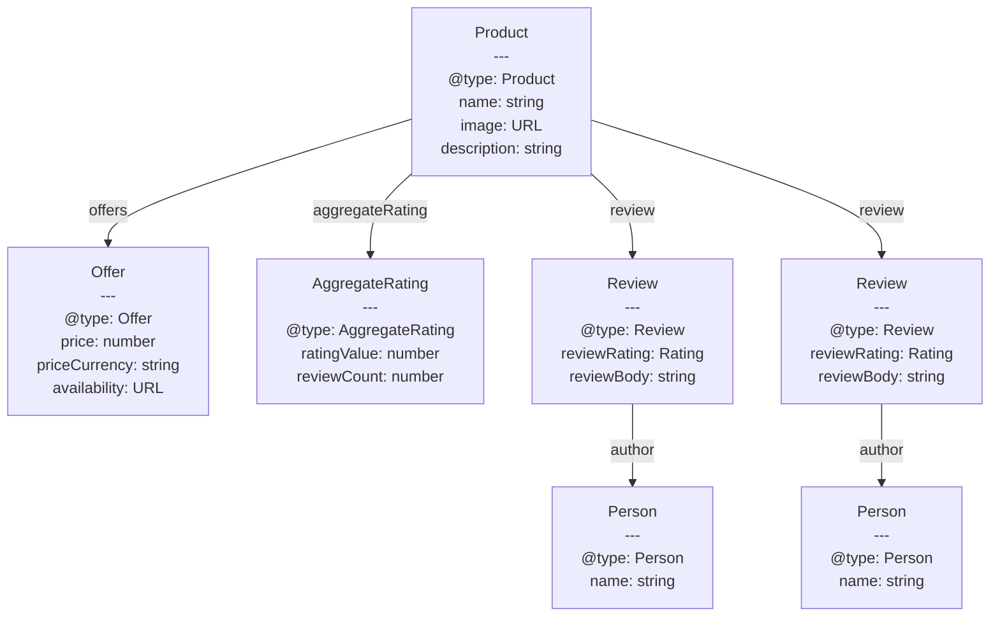

# 結構化資料與 Schema.org

結構化資料（Structured Data）是嵌入 HTML 中的機器可讀標記，用以向搜尋引擎、社群平台與自動化爬蟲傳達頁面內容的語意意涵。一般的 HTML 告訴瀏覽器如何渲染文字與圖片，結構化資料則告訴爬蟲這些內容代表什麼：一個附有價格與評分的產品、一道包含食材與烹調時間的食譜、一篇有作者姓名與發布日期的文章。缺少結構化資料時，搜尋引擎必須從散文文字中推斷這些含義，這既容易出錯，結果也不一致。

嵌入結構化資料的格式有三種：JSON-LD、Microdata 與 RDFa。JSON-LD 已成為主流標準，因為它將結構化資料的有效載荷與可見的 HTML 完全分離。文件 `<head>` 中一個 `<script type="application/ld+json">` 區塊即可以 JSON 物件的形式承載完整的資料圖譜，與頁面 HTML 的結構和樣式無關。Microdata 和 RDFa 則透過特殊屬性直接將結構化資料標註在 HTML 元素上，這意味著 HTML 版面重構可能在不知情的情況下破壞結構化資料。JSON-LD 避免了這種耦合，Google 建議在所有新的實作中使用 JSON-LD。

搜尋引擎使用結構化資料來生成豐富搜尋結果（Rich Results）：顯示在搜尋摘要中的星級評分、包含食材與時間摘要的食譜卡片、可直接展開的 FAQ 手風琴、附有日期和地點的活動列表、網站連結搜尋框等。這些豐富搜尋結果能提升點擊率，改善內容在搜尋中的呈現方式。然而，獲益的前提是準確性：正確反映頁面內容的結構化資料能獲得豐富結果，而偽造或誤導性的結構化資料則可能遭受人工懲罰，導致整個網站的豐富搜尋結果被取消。

單頁應用程式（SPA）引入了一個關鍵限制。不執行 JavaScript 的搜尋引擎爬蟲，無法找到在初始 HTML 回應之後才注入頁面的結構化資料。如果 React 或 Vue SPA 在元件掛載時透過 `document.createElement` 添加 `<script type="application/ld+json">`，這份資料對所有只處理靜態 HTML 的爬蟲而言是不可見的。為了讓結構化資料能被可靠地索引，它必須存在於伺服器渲染的 HTML 回應中——無論是透過伺服器端渲染（SSR）、靜態網站生成（SSG），還是預渲染（Pre-rendering）來實現。結構化資料也有一個容易被低估的維護層面：一個上線時帶有準確 JSON-LD 的產品頁面，隨著價格變動、評論累積或庫存異動，資料可能變得不準確，因此實作架構必須以程式化方式生成結構化資料，並與真實資料來源保持同步。

## 使用情境

你們公司的部落格出現在 Google 搜尋結果中，但只顯示 URL 和標題——即便頁面上已有發布日期、作者和星級評分，這些資訊卻完全不出現。搜尋引擎可以讀取 HTML 的文字內容，但無法可靠地從視覺排版推斷語意意涵。加入以 Schema.org 詞彙撰寫的 JSON-LD 結構化資料，即可精確告知搜尋引擎頁面包含何種類型的內容，以及哪些元素對應哪些屬性，進而在不改變可見頁面的前提下啟用豐富搜尋結果。

## 設計思維

### JSON-LD 與 Microdata、RDFa 的比較

JSON-LD 在格式競爭中勝出，原因在於其實際的工程優勢。Microdata 要求使用 `itemprop`、`itemscope` 和 `itemtype` 屬性，將結構化資料直接編織進可見的 HTML 標記中。這意味著 HTML 結構驅動著結構化資料的結構。當設計師將產品卡片從 `<div>` 樹狀結構重構為帶有巢狀 `<section>` 的 `<article>` 時，`itemprop` 標註可能發生偏移、分裂或消失，在沒有任何測試捕捉到的情況下默默破壞結構化資料。RDFa 也存在同樣的根本問題——它將結構化資料綁定到 HTML 元素的屬性上。

JSON-LD 將結構化資料外部化為一個自成一體的 JSON 物件。HTML 可以任意重構，而不會影響 JSON-LD 區塊。JSON-LD 可以在建構步驟或渲染時從資料模型以程式化方式生成，使結構化資料與填充頁面的實際資料保持同步變得簡單直接。對於從資料庫記錄渲染的產品頁面，填充 `<h1>`、`<span class="price">` 和評論輪播的同一記錄物件，也可以生成 JSON-LD 載荷，消除可見內容與結構化資料之間產生偏差的可能性。Google 的官方文件推薦使用 JSON-LD，Bing、Yahoo 和其他主要爬蟲也遵循相同的建議。

一個頁面可以包含多個 `<script type="application/ld+json">` 區塊。這在頁面代表多個實體時非常有用：一個文章頁面可能同時帶有 `Article` 區塊和 `BreadcrumbList` 區塊作為各自獨立的 script，或者一個本地商家頁面可能同時包含 `Organization` 區塊和 `LocalBusiness` 區塊。另一種方式是在單一 JSON-LD 文件中使用 `@graph` 陣列，以陣列形式承載多個實體物件，在一個區塊中表達所有結構化資料。兩種方式都有效，`@graph` 形式將所有結構化資料集中在一個區塊中，作為一個整體更易於稽核和測試。

### Schema.org 詞彙的深度

Schema.org 詞彙定義了數百種類型，但大多數 Web 應用程式只需不到十種，就能涵蓋其絕大多數結構化資料需求。最常用的類型包括：`WebPage` 及其子類型、`Article`（含 `NewsArticle` 和 `BlogPosting` 子類型）、`Product`、`Offer`、`Review`、`AggregateRating`、`BreadcrumbList`、`FAQPage`、`Organization`、`Person`、`LocalBusiness` 以及 `Event`。

類型可以巢狀嵌套。一個 `Product` 實體嵌入一個總結所有評論的 `AggregateRating` 物件，而 `AggregateRating` 可以引用個別的 `Review` 物件，每個 `Review` 的 `author` 屬性指向一個 `Person`。這種巢狀在 JSON-LD 中以物件字面量表達：`Product` 的 `aggregateRating` 屬性設為一個帶有 `"@type": "AggregateRating"` 的物件。Schema.org 對每種類型的文件列出了預期屬性、這些屬性在 Google 豐富結果指南中是必要還是建議使用，以及值的類型（文字、數字、URL 或巢狀類型）。工程師**應該（SHOULD）**同時參閱 Google 豐富結果文件與原始 Schema.org 規範，因為 Google 精確記錄了哪些屬性用於哪種豐富結果類型，而必要屬性與建議屬性在懲罰風險上有所不同。

### SSR 與 SPA 中的結構化資料

伺服器端渲染框架能乾淨地處理結構化資料注入。在 Next.js App Router 中，結構化資料透過 `layout.tsx` 或 `page.tsx` 文件中使用 <code v-pre>dangerouslySetInnerHTML={{ __html: JSON.stringify(jsonLd) }}</code> 的 `<script>` 標籤添加，這會在伺服器渲染的 HTML 中產生 script 標籤。在 Nuxt 中，`useHead` 可組合函式（composable）或頁面中的 `<Head>` 元件會將 script 添加到渲染後的 HTML 中。Astro 提供了 `.astro` 文件中的 `<script type="application/ld+json" set:html={JSON.stringify(jsonLd)} />` 模式。所有這些方法都確保結構化資料存在於爬蟲接收的初始 HTML 回應中。

完全依賴客戶端渲染的 SPA 存在問題。一個從 API 獲取產品資料後在生命週期鉤子中呼叫 `document.head.appendChild(script)` 的 Vue 或 React SPA，所產生的結構化資料對不執行 JavaScript 的爬蟲是不可見的。正確的緩解措施是預渲染需要結構化資料的頁面。Next.js 和 Nuxt 等框架支援靜態網站生成（SSG）和增量靜態再生（ISR），兩者都能產生嵌入結構化資料的伺服器渲染 HTML。對於無法採用 SSR 的 SPA，預渲染代理或建構時預渲染工具（如 Prerender.io 或自訂 Puppeteer 管線）可以生成包含結構化資料的 HTML。

動態結構化資料——頻繁變動的產品價格、有即將到來與已過去日期的活動頁面、庫存可用性——需要謹慎的快取管理。在建構時嵌入 JSON-LD 的靜態生成頁面，若建構未能及時執行，將包含過時的價格或可用性資料。Next.js 的增量靜態再生（ISR）和 Nuxt 的 stale-while-revalidate 允許頁面按設定的時間間隔自動重新生成，在無需完整站台重建的情況下保持結構化資料的新鮮度。對於每天多次變動的定價資料，帶有短效快取的完整 SSR 比 SSG 更為適合。

### BreadcrumbList 與全站結構化資料

`BreadcrumbList` 是適用範圍最廣的結構化資料類型之一，因為幾乎每個在網站層級結構中深度超過一層的頁面都有麵包屑導航。與只適用於特定頁面類型的產品或食譜結構化資料不同，`BreadcrumbList` 適用於幾乎所有內容頁面。正確實作後，能在 Google 搜尋結果中顯示麵包屑路徑，以可讀的路徑（如 `AudioStore > 耳機 > 無線耳機`）取代原始 URL。清單中的每個 `ListItem` 必須帶有 `position`（從 1 開始的整數）、`item`（該層級的 URL）和 `name`（顯示標籤）。JSON-LD 中的麵包屑層級必須與頁面的實際導航路徑相符——偽造麵包屑層級或使用與實際 URL 結構不符的層級會違反 Google 的政策。

`FAQPage` 結構化資料能在搜尋結果中啟用 FAQ 豐富結果，讓個別問答對可在搜尋結果內直接展開。此類型僅適用於頁面確實包含問題與解答清單的情況。每個問題是一個 `Question` 實體，帶有 `name`（問題文字）和 `acceptedAnswer`，後者包含帶有 `text`（答案文字，可包含有限的 HTML）的 `Answer` 實體。FAQ 豐富結果顯著增加了一個搜尋列表在搜尋結果中佔據的垂直空間。Google 將此功能限制在具有權威性的來源，並可能對不當使用的頁面撤銷此功能。

### 驗證與監控

主要存在兩種驗證工具。Google 豐富搜尋結果測試（https://search.google.com/test/rich-results）可抓取 URL 或接受貼上的 HTML，顯示偵測到的豐富結果類型、存在哪些屬性，以及哪些屬性缺失或無效。Schema 標記驗證器（https://validator.schema.org）根據完整的 Schema.org 詞彙進行驗證，不應用 Google 額外的豐富結果要求——適合獨立於任何單一搜尋引擎要求地檢查正確性。

這兩個工具都應整合到開發工作流程中。一個實用的 CI 方法是在建構時、部署前，對應用程式生成的 JSON-LD 載荷執行 `schema-dts` 或 JSON Schema 驗證器。`schema-dts` TypeScript 類型定義套件為 Schema.org 類型提供編譯時類型檢查，在上線前就能捕捉屬性名稱的錯字和類型不匹配。Google Search Console 的豐富搜尋結果報告提供生產環境監控：它顯示哪些頁面已以結構化資料被索引、哪些豐富結果類型處於活躍狀態，以及哪些頁面有錯誤或警告。工程師**應該（SHOULD）**在部署結構化資料變更後以及重大網站遷移後監控此報告。

結構化資料的驗證也應納入端對端測試套件中。Playwright 或 Cypress 測試可以從渲染後的頁面中提取 JSON-LD，解析它，並斷言必要屬性存在且值符合預期格式。這彌補了建構時驗證（測試範本邏輯）與執行時驗證（捕捉傳入範本的資料為 null、空值或超出範圍的情況）之間的差距。例如，一個 `ratingValue` 超出 `worstRating` 到 `bestRating` 範圍的 `AggregateRating` 在技術上是有效的 JSON-LD，但可能導致 Google 跳過該豐富搜尋結果。

結構化資料監控對於包含動態內容或個人化的網站更為複雜。一個向不同使用者顯示不同價格的產品頁面，或依地區顯示不同內容的新聞文章頁面，可能根據請求者的不同而產生不同的結構化資料。從監控的角度來看，將這些視為單一 URL 是具有誤導性的——驗證器和 Search Console 都以單一回應為基礎運作。實務策略是對結構化資料生成程式碼加入可觀測性：當 JSON-LD 生成路徑被呼叫時、當屬性被條件性省略時（例如評論數為零時省略 `aggregateRating`）、以及當生成的載荷未通過內部驗證時，均發出指標或記錄事件。這讓團隊擁有獨立於外部爬取時序的生產環境訊號。

一個較不明顯的監控缺口是分頁序列上的結構化資料。一個擁有大量評論的產品，可能將評論分頁到多個 URL。每個分頁頁面可能都帶有相同的 `Product` JSON-LD，但 `review` 陣列只代表當前頁面的子集。Google 不會將分頁頁面上的評論陣列視為可累加的；它獨立評估每個 URL 的結構化資料。對於分頁評論內容，建議在每個分頁 URL 上都包含從完整評論資料集生成的 `aggregateRating`，並在 `review` 陣列中只包含當前頁面可見的評論。針對分頁序列測試結構化資料時，測試套件至少應涵蓋每種分頁內容類型的第一頁、中間頁和最後一頁，以確保每個 URL 都能獨立符合豐富搜尋結果的資格，同時不會錯誤呈現評論總數。

當 Google Search Console 報告某頁面的結構化資料錯誤時，修復流程分三步驟：修正標記錯誤、透過 URL 檢查工具提交重新索引請求，然後等待豐富搜尋結果報告確認錯誤已解決。重新索引單一 URL 通常需要數小時至幾天；豐富搜尋結果報告反映更新狀態的時間可能更長，因為它彙總了多次爬取的索引訊號。在修復結構化資料錯誤後若跳過重新索引請求，團隊可能需要等待數週，待自然爬取恢復才能重新獲得豐富搜尋結果。

分頁序列中的結構化資料錯誤往往在效能最佳化期間被靜默引入——例如，工程師最佳化資料擷取查詢，使其只回傳當前頁面的評論，卻忘記 JSON-LD 載荷仍需從完整資料集擷取評論數和彙總評分。

### 在伺服器渲染框架中生成 JSON-LD

在 Next.js App Router 中，JSON-LD 透過將 `<script>` 元素的 `dangerouslySetInnerHTML` prop 設為 `{ __html: JSON.stringify(jsonLd) }` 來注入伺服器渲染的 HTML 中。這個模式確保結構化資料存在於伺服器交付的 HTML 中，而非由客戶端生命週期鉤子後續添加。相同的原理適用於 Nuxt（透過 `useHead` 或 `<Head>` 元件）和 Astro（透過 `<script>` 元素上的 `set:html`），語法略有不同。

`schema-dts` 套件為所有 Schema.org 實體提供 TypeScript 類型。使用 `WithContext<T>` 包裝器類型，能將 `@context` 屬性添加到標準類型定義中，提供屬性名稱和值形態的編譯時檢查，在程式碼上線前就能捕捉錯字與結構性不符。

對於存在與否取決於執行時資料的屬性——尤其是 `aggregateRating`——建議採用條件式守衛（conditional guard）模式：當 `reviewCount` 為零時，直接從物件中省略 `aggregateRating` 屬性，而非發出帶有零評論的 `AggregateRating`。發出零評論的 `AggregateRating` 違反 Google 的結構化資料政策，可能導致豐富搜尋結果被抑制。

此工具函式接受頁面資料物件並回傳 `WithContext<Product>` 節點，將結構化資料邏輯集中於單一可測試位置。透過條件式展開（conditional spread），只有在產品具備最低評論數量時才納入 `aggregateRating`，從而防止為新產品發布錯誤的結構化資料。

在 Next.js App Router 中，結構化資料節點通常從頁面的非同步元件回傳，並在 SSR 過程中序列化於 `<script type="application/ld+json">` 元素內，使其在初始 HTML 中即存在，無需任何客戶端水合步驟。在 Nuxt 中，`nuxt-schema-org` 模組提供的 `useSchemaOrg` composable 提供了一個響應式、宣告式的 API，在 SSR 過程中生成 JSON-LD。Astro 的靜態生成模型天然地在每個生成頁面中包含結構化資料，當 JSON-LD 腳本嵌入頁面的 `<head>` 模板時，無需額外設定。實作方式因框架而異，但不變的原則是相同的：JSON-LD 內容必須存在於伺服器交付的 HTML 中，而非由 JavaScript 在頁面載入後附加。

無論使用哪個框架，測試策略都遵循相同的模式：一個單元測試呼叫工具函式並對回傳的 JSON-LD 物件形態進行斷言，以及一個整合測試渲染完整頁面並從文件 head 中提取 `<script type="application/ld+json">` 元素來驗證其內容。這種雙層方法能同時捕捉資料轉換中的邏輯錯誤，以及可能阻止 script 到達 head 的設定錯誤。將原始 JSON-LD 值作為字串進行測試，不如將其解析回物件後對各個屬性進行斷言來得可靠，因為字串比較對 `JSON.stringify` 不同版本所引入的格式變化（例如鍵排序或空白差異）較為脆弱。

從客戶端 SPA 遷移至 SSR 以專門改善結構化資料索引的團隊，應在遷移前審計所有結構化資料注入點，並透過 Google Rich Results Test 針對遷移後的預演環境確認：所有原本僅出現在客戶端 DOM 的結構化資料類型，現在均已存在於原始 HTML 回應中。一個常見的遷移缺口是次要實體——例如在版面元件中添加的 `BreadcrumbList`——在新框架中已改為 SSR 渲染，但在 SPA 中原本就已缺失，因此在上線前的審查中容易被忽略。

在評估要使用哪種框架功能來注入 JSON-LD 時，應優先選擇能讓 JSON-LD 與頁面資料擷取程式碼保持最近距離的機制。在 Next.js App Router 中，將 JSON-LD 生成邏輯與擷取頁面資料的 `async` 元件放在一起，能清楚表明兩者是耦合的，必須同步更新。在 Nuxt 中，將 `useSchemaOrg` 呼叫置於擷取產品或文章資料的同一 composable 中，也能達到相同的耦合效果。這種共置規範比任何實作細節都更重要：它確保當資料變更時，結構化資料也隨之更新。

框架選擇不會改變與搜尋引擎之間的契約——改變的只是語法。

開發者在框架之間切換時，結構化資料的架構原則保持不變。

## 最佳實踐

**必須（MUST）使用 JSON-LD 作為結構化資料格式，並將其嵌入伺服器渲染的 HTML 中。** 在伺服器端渲染或靜態生成期間，將 `<script type="application/ld+json">` 放置在文件 `<head>` 中。不執行 JavaScript 的爬蟲無法找到由客戶端腳本在初始 HTML 回應後添加的結構化資料，這使得在 `useEffect`、`onMounted` 或等效客戶端生命週期鉤子中注入 JSON-LD 的方式，對索引而言是不可靠的。

**必須（MUST）保持結構化資料與可見頁面內容的準確性和同步性。** 從填充可見頁面的同一資料來源以程式化方式生成 JSON-LD。如果產品的價格存儲在資料庫記錄中，JSON-LD 的 `offers.price` 必須（MUST）從同一記錄中讀取，而不是單獨硬編碼或複製。與可見頁面內容相矛盾的結構化資料——不同的價格、不同的評論數量、不同的作者姓名——違反了 Google 的政策，可能觸發人工懲罰。

**禁止（MUST NOT）將結構化資料類型添加到在語意上與該類型定義不符的頁面。** 將部落格文章標記為 `Product`、在沒有使用者評論的頁面添加 `AggregateRating`，或為沒有 FAQ 內容的頁面聲稱 `FAQPage` 類型，這些行為會迷惑爬蟲，並被搜尋引擎品質審查員視為垃圾內容。每種結構化資料類型都承載著一個語意契約：頁面必須真正符合結構化資料所聲稱的內容。

**應該（SHOULD）在部署變更前於 CI 中驗證結構化資料。** 在建構管線中，使用 Schema 標記驗證器 API 或 JSON Schema 驗證器對生成的 JSON-LD 載荷進行驗證。Google 豐富搜尋結果所需的必要屬性——例如 `Product` 上的 `offers.price` 和 `offers.priceCurrency`——可以自動驗證。在部署前捕捉缺失的必要屬性，能防止生產環境中豐富搜尋結果的損失。

**應該（SHOULD）在網站層級結構中深度超過一層的所有內容頁面上使用 `BreadcrumbList` 結構化資料。** 麵包屑結構化資料能讓 Google 在搜尋結果中顯示導航路徑而非原始 URL，提升點擊率並讓使用者更清楚地預覽頁面在網站中的位置。JSON-LD 中的麵包屑層級應與實際導航層級相對應——偽造麵包屑層級或錯誤呈現 URL 層級違反了 Google 的結構化資料政策。

**必須（MUST）確保 `BreadcrumbList` 中的每個 `ListItem` 帶有準確的 `position` 整數與 `name` 字串。** `position` 值從根層級的 1 開始，每深一層遞增 1。`name` 必須與頁面上可見的麵包屑導航標籤一致，`item` URL 必須能解析至該層級的實際頁面。不準確的 `position` 值，或與可見導航不符的 `name`，均構成 Google 結構化資料政策中的不實呈現。

**應該（SHOULD）在 CI 中針對每次生產部署前，對預演頁面執行 Schema Markup Validator API 以測試複合式搜尋結果的資格。** 複合式搜尋結果的資格會無聲消失——頁面正常載入、流量正常抵達，但增強版搜尋外觀在標記錯誤被修正且 Google 重新爬取前就已消失。在 CI 中呼叫 Schema Markup Validator JSON API 來驗證結構化資料，可在部署前捕獲缺少的必填欄位、格式錯誤的日期字串以及無效的列舉值。驗證酬載為頁面的 JSON-LD 內容；API 回傳對應至特定 schema.org 屬性的錯誤與警告清單。

## 視覺呈現



## 範例

```html
<!DOCTYPE html>
<html lang="zh-TW">
<head>
  <meta charset="UTF-8" />
  <meta name="viewport" content="width=device-width, initial-scale=1.0" />
  <title>無線降噪耳機 Pro 500 – AudioStore</title>

  <!-- 結構化資料：Product 含 AggregateRating -->
  <script type="application/ld+json">
  {
    "@context": "https://schema.org",
    "@type": "Product",
    "name": "無線降噪耳機 Pro 500",
    "image": [
      "https://example.com/images/headphones-front.jpg",
      "https://example.com/images/headphones-side.jpg"
    ],
    "description": "頭戴式無線耳機，配備主動降噪功能、30 小時電池續航以及可折疊設計，適合旅行使用。",
    "sku": "HP-PRO-500",
    "brand": {
      "@type": "Brand",
      "name": "AudioStore"
    },
    "offers": {
      "@type": "Offer",
      "url": "https://example.com/products/headphones-pro-500",
      "priceCurrency": "TWD",
      "price": "7990",
      "priceValidUntil": "2026-12-31",
      "itemCondition": "https://schema.org/NewCondition",
      "availability": "https://schema.org/InStock",
      "seller": {
        "@type": "Organization",
        "name": "AudioStore"
      }
    },
    "aggregateRating": {
      "@type": "AggregateRating",
      "ratingValue": "4.6",
      "reviewCount": "312",
      "bestRating": "5",
      "worstRating": "1"
    },
    "review": [
      {
        "@type": "Review",
        "reviewRating": {
          "@type": "Rating",
          "ratingValue": "5",
          "bestRating": "5"
        },
        "name": "降噪效果卓越",
        "reviewBody": "我每天通勤都在用這副耳機。ANC 完全隔絕了捷運噪音。電池續航在我的測試中與官方聲稱的 30 小時相符。",
        "author": {
          "@type": "Person",
          "name": "陳瑋琳"
        },
        "datePublished": "2026-03-15"
      },
      {
        "@type": "Review",
        "reviewRating": {
          "@type": "Rating",
          "ratingValue": "4",
          "bestRating": "5"
        },
        "name": "音質出色，夾頭感稍強",
        "reviewBody": "各頻段音質表現優異。長時間佩戴夾頭感稍強，但使用一週後會逐漸鬆開。",
        "author": {
          "@type": "Person",
          "name": "James Okafor"
        },
        "datePublished": "2026-02-28"
      }
    ]
  }
  </script>
</head>
<body>
  <main>
    <h1>無線降噪耳機 Pro 500</h1>
    <p>NT$7,990</p>
    <p>4.6 分（滿分 5 分）— 312 則評論</p>
    <!-- 可見頁面內容與上方的結構化資料相符 -->
  </main>
</body>
</html>
```

`@context` 宣告了詞彙命名空間。每個帶有 `@type` 的巢狀物件使用 Schema.org 類型。`offers.price` 和 `offers.priceCurrency` 是 Google 產品豐富搜尋結果的必要屬性。`aggregateRating.reviewCount` 必須反映頁面上的實際評論數量，或來自同一資料管線——而不是一個會隨時間漂移的硬編碼數字。

注意範例中 `offers.price` 是字串而非數字。Google 的文件兩者皆接受，但字串表示法可避免浮點數序列化的邊緣情況（例如 `7990.0000000001`）。`priceValidUntil` 屬性向搜尋引擎發出訊號，表明價格資訊有過期日期，這可能影響在該日期之後的搜尋中是否顯示該優惠——應始終將其設定為未來的日期，或按排程更新。`itemCondition` 和 `availability` 的值是 schema.org URL，而非自由格式的字串；使用錯誤格式（例如用 `"new"` 而非 `"https://schema.org/NewCondition"`）將導致驗證器忽略該屬性。

對於有產品變體的網站（不同顏色、尺寸或配置各有不同價格），最佳實踐是標記使用者正在查看的特定變體，而非整個產品系列。每個變體頁面應帶有包含特定變體價格和庫存狀態的 `Offer`，而不是平均值或範圍。如果頁面顯示跨變體的價格範圍，應使用單一 `AggregateOffer` 類型的 `lowPrice` 和 `highPrice`，而非帶有模糊價格的單一 `Offer`。

範例中每個 `Review` 物件的 `datePublished` 值使用 ISO 8601 日期格式（`YYYY-MM-DD`）。Google 的驗證器接受此格式；使用地區特定格式（如 `03/15/2026` 或 `15-Mar-2026`）將導致日期屬性驗證失敗並被忽略。相同的 ISO 8601 要求也適用於 `Offer` 的 `priceValidUntil` 以及 `Article` 的 `dateModified`——結構化資料中的任何日期屬性都應使用 ISO 8601 格式，以確保在各驗證器與爬蟲之間的一致性解析。

## 常見錯誤

### 使用 Microdata 後重構 HTML 導致靜默失效

選擇 Microdata 的團隊在第一次設計改版時就會發現耦合的代價。一個帶有 `itemscope itemtype="https://schema.org/Product"` 的卡片元件，其 `itemprop="name"`、`itemprop="price"` 和 `itemprop="description"` 分散在巢狀元素中，當設計師重構卡片的 HTML 結構時，就會默默破壞結構化資料。沒有任何測試能捕捉到這個問題，因為頁面仍然能正常渲染。只有結構化資料圖譜損壞，而這個損壞會在數天或數週後以 Google Search Console 中豐富搜尋結果下降的形式浮現。解決方案是遷移至 JSON-LD，其中資料結構與 HTML 結構是相互獨立的。

### 在 SPA 中透過客戶端 JavaScript 注入 JSON-LD

React 和 Vue SPA 中常見的錯誤是在元件生命週期鉤子中添加結構化資料：在 `useEffect` 或 `onMounted` 中呼叫 `document.head.appendChild(scriptEl)`。在瀏覽器中查看頁面時，結構化資料會出現在 DOM 中，因此在手動檢查時看起來是正確的。然而，不執行 JavaScript 的爬蟲——包括某些爬取預算情境下的 Googlebot——接收的初始 HTML 中不含 script 標籤。結構化資料對這些爬蟲而言實際上是不可見的。正確的做法是在建構時（SSG）或渲染時（SSR）生成 JSON-LD，確保它存在於伺服器傳遞的 HTML 中。

### 遺漏必要屬性

Google 豐富搜尋結果文件為每種類型指定了必要屬性和建議屬性。對於 `Product`，`offers.price` 和 `offers.priceCurrency` 是豐富搜尋結果資格的必要屬性。對於 `AggregateRating`，`ratingValue` 和 `reviewCount`（或 `ratingCount`）是必要的。遺漏必要屬性不會在 Schema 標記驗證器中造成驗證錯誤——詞彙本身將大多數屬性視為可選的——但它確實會導致 Google 不為該頁面顯示豐富搜尋結果。僅針對 Schema.org 進行驗證而不查閱 Google 豐富搜尋結果要求的工程師，會錯過這些差異。

### 硬編碼彙總評分導致資料漂移

在範本中硬編碼的彙總評分會隨著評論累積而與現實脫節。一個上線時有 47 條評論、4.8 分的頁面，六個月後可能有 312 條評論和 4.6 分，但硬編碼的 JSON-LD 仍然顯示 47 和 4.8。Google 的演算法能偵測到結構化資料與可觀察的頁面內容相矛盾的情況。正確的實作方式是從填充頁面上可見評論摘要的同一資料來源動態生成 `ratingValue` 和 `reviewCount`。

### 在 JSON-LD 中嵌入使用者輸入內容卻未進行跳脫

當結構化資料包含使用者產生的內容——評論文字、賣家提交的產品描述、客服人員撰寫的 FAQ 答案——這些內容必須被視為不可信任的輸入。如果產品描述包含 `</script>`，HTML 解析器會提前關閉 script 元素，破壞 JSON-LD。攻擊者若能透過未進行輸入清理的 CMS 或 API 注入結構化資料屬性，可能會製造導致非預期行為的載荷。務必透過 JSON 序列化器處理使用者輸入的字串，而非使用範本字串插值，並確保在嵌入 HTML 時，序列化後的 JSON 會將字串值中的 `<`、`>` 和 `&` 進行跳脫。

### 將 JSON-LD 放置在 body 而非 head

Google 的文件說明 `<script type="application/ld+json">` 可以出現在 `<head>` 或 `<body>` 中，兩者都會被處理。然而，將其放置在 `<body>` 會帶來實際風險：某些中介軟體、CDN 邊緣函式和 HTML 轉換管線，可能在安全考量下移除或修改 body 中的 `<script>` 標籤，而保留 head 中的 script 不受影響。將結構化資料放在 `<head>` 中，與其他後設資料並排，是更安全的慣例，也與所有主要框架在 SSR 輸出中生成結構化資料的方式一致，更易於除錯和程式碼審查時定位。

## 相關 FEE

| FEE | 關聯性 |
|-----|--------|
| [FEE-100 HTML 與語意標記總覽](./100.md) | 本類別的父概覽。結構化資料是語意 HTML 超越無障礙性之外的核心重要性之一。 |
| [FEE-101 文件結構與中繼資料](./101.md) | `<head>` 元素、`<meta>` 標籤與文件後設資料，提供了插入結構化資料 `<script>` 區塊的基礎。 |
| [FEE-108 HTML 安全屬性](./108.md) | JSON-LD 區塊使用 `type="application/ld+json"`，這不是可執行的 JavaScript，但對 `<head>` 中 `<script>` 標籤的安全審查同樣適用。 |
| [FEE-701 渲染策略：CSR、SSR、SSG 與串流](../Rendering%20and%20Performance/701.md) | 伺服器渲染是可靠結構化資料索引的前提條件。為頁面選擇的渲染策略決定了爬蟲是否能找到其結構化資料。 |

## 參考資料

- [Google 結構化資料開發者指南](https://developers.google.com/search/docs/appearance/structured-data/intro-structured-data) — Google 關於結構化資料格式、支援類型與豐富搜尋結果要求的權威文件
- [schema.org](https://schema.org) — Schema.org 詞彙、類型層級與屬性定義
- [Google 豐富搜尋結果測試](https://search.google.com/test/rich-results) — 從 URL 或 HTML 片段驗證並預覽豐富搜尋結果的互動工具
- [Schema 標記驗證器](https://validator.schema.org) — 根據完整 Schema.org 詞彙驗證 JSON-LD、Microdata 和 RDFa
- [JSON-LD 1.1 規範](https://www.w3.org/TR/json-ld11/) — JSON-LD 格式的 W3C 規範，包含 `@context`、`@type` 與圖譜巢狀語意
- [Google Search Central：Product 結構化資料](https://developers.google.com/search/docs/appearance/structured-data/product) — 產品豐富搜尋結果的必要和建議屬性，包括 `offers`、`aggregateRating` 和 `review`
- [Google Search Central：結構化資料品質指南](https://developers.google.com/search/docs/appearance/structured-data/sd-policies) — 關於準確性、相關性以及導致人工處罰的禁止行為的政策
- [MDN：JSON-LD](https://developer.mozilla.org/en-US/docs/Glossary/JSON-LD) — JSON-LD 的詞彙定義及其在 Web 平台語境中的入門說明
- [Next.js 文件：JSON-LD](https://nextjs.org/docs/app/building-your-application/optimizing/metadata#json-ld) — Next.js App Router 中使用 `dangerouslySetInnerHTML` 在伺服器渲染頁面嵌入 JSON-LD 的模式
