# HTML 安全屬性

HTML 中有幾個屬性專門用來限制跨來源內容的行為：`crossorigin`、`referrerpolicy`、`sandbox`、`rel="noopener noreferrer"` 以及 `integrity`。這些屬性與外觀或功能無關，而是控制嵌入內容、外部連結，以及跨來源資源載入的安全性質。對於任何正式上線的 Web 應用程式，理解這些屬性不是可選項，而是不讓頁面無意間危害使用者的基本能力門檻。

這些屬性大多是「附加型」的：加上它們會限制原本不受限制的行為。一個沒有 `rel="noopener"` 的 `<a target="_blank">` 會讓被開啟的頁面取得開啟者的 `window` 物件。一個沒有 `sandbox` 的 `<iframe>` 會在嵌入頁面的來源下執行腳本。一個沒有 `integrity` 的 `<script src="cdn.example.com/lib.js">` 會執行 CDN 所回傳的任何內容，即使那份內容在部署後已被替換。每一個情況下，瀏覽器的預設行為都是寬鬆的，開發者必須主動選擇加入限制。

瀏覽器的預設行為之所以寬鬆，是出於歷史相容性的考量。在威脅模型被充分理解之前，許多今日看來不安全的特性就已經被標準化，而要追溯性地修改預設值會破壞現有的 Web。因此，明確加入限制的責任落在開發者身上。具備安全意識的 HTML 撰寫，意謂著清楚知道哪些元素需要加上哪些屬性，而不是等待瀏覽器替你強制執行安全性。

本文將這五個最重要的 HTML 安全屬性作為一個整體來介紹，說明每個屬性所能緩解的威脅，並提供何時必須使用的規則。子資源完整性（`integrity`）在此有足夠的介紹讓你正確使用；其完整說明，包括雜湊生成流程與 CSP 整合，請見 FEE-1208。

## 使用情境

你正在稽核一個 Web 應用程式，發現一個從第三方 CDN 載入的 `<script src>` 沒有任何完整性檢查。若 CDN 遭到入侵，腳本被替換為惡意程式碼，每個載入該頁面的使用者都會執行它。HTML 安全屬性——`integrity` 用於子資源完整性驗證、`crossorigin`、iframe 上的 `sandbox`、連結上的 `rel="noopener noreferrer"`——是瀏覽器無需 JavaScript 即可強制執行的宣告式防禦，能縮小第三方遭入侵時的爆炸半徑。

## 設計思維

每個 HTML 安全屬性都針對不同的攻擊面。`crossorigin` 管理瀏覽器在資源請求時是否進入 CORS 模式，以及請求是否附帶憑證。`referrerpolicy` 控制透過 `Referer` 標頭產生的資訊洩漏。`sandbox` 對嵌入文件強制執行能力限制。`rel="noopener"` 切斷 `target="_blank"` 所開啟的跨文件通訊管道。`integrity` 透過雜湊值將資源鎖定在特定的已知良好版本。將這五個屬性視為互不相關的屬性，會錯失其中的規律：它們都是減少 HTML 對外部資源隱式信任的機制，且每個都需要頁面作者明確選擇加入。

這五個屬性的共同脈絡在於信任的方向：它們各自限制的是頁面向外延伸的信任，而不是頁面向內接受的內容。這與伺服器端安全標頭——`Content-Security-Policy`、`Strict-Transport-Security`、`X-Frame-Options`——形成對比，後者限制的是瀏覽器代表頁面所接受的內容。兩個層次都是必要的，但在概念上有所不同：伺服器標頭控制頁面對可能接收到的內容的防禦姿態，而 HTML 安全屬性控制頁面對其主動嵌入或連結的內容的姿態。將這兩個層次分開思考的心智模型，能讓你在引入新的嵌入或連結模式時，更容易判斷應套用哪種控制措施。

這五個屬性在被省略時的降級方式也各不相同。省略 `rel="noopener"` 會靜默地讓 `window.opener` 保持可存取——頁面在其他所有方面都能正常運作，而漏洞在被利用之前是不可見的。在 iframe 上省略 `sandbox` 也同樣不會產生任何可見症狀；iframe 正常載入並如預期般運作，但原本應限制其行為的能力約束卻付之闕如。省略跨來源腳本的 `crossorigin` 會造成錯誤回報的缺口，而不是載入失敗。只有 `integrity` 違規會產生可見的、立即的失敗——資源被阻止並在主控台記錄錯誤。這種不對稱性對於確定安全稽核的優先順序至關重要：那些省略後不可見的屬性，最有可能在舊有程式碼庫中靜默缺失。

大多數安全屬性省略的不可見本質，也是為何自動化執行——lint 規則、模板預設值和 CI 檢查——比單純依靠程式碼審查更為可靠的原因。程式碼審查能發現新穎的模式和架構問題，但卻是捕捉那些應出現在特定元素類型每個實例上的樣板屬性之缺失的薄弱機制。對沒有 `rel="noopener"` 的 `<a target="_blank">`，或跨來源 `<script>` 缺少 `integrity` 的情況發出警告的 lint 規則，能提供隨程式碼庫規模擴展而不增加審查負擔的執行力。

### 資源元素上的 crossorigin

`crossorigin` 屬性出現在 ``、`<script>`、`<link>`、`<audio>` 和 `<video>` 元素上。它控制瀏覽器在對資源發出跨來源請求時，是否要附帶憑證（cookie、TLS 用戶端憑證），以及回應是否必須攜帶 CORS 標頭才能被使用。

兩個屬性值分別是 `anonymous`（當屬性存在但無值時的預設值）和 `use-credentials`。設定 `anonymous` 時，請求不攜帶憑證；伺服器必須回應 `Access-Control-Allow-Origin: *` 或 `Access-Control-Allow-Origin: <origin>`，瀏覽器才會接受回應供 CORS 敏感操作使用。設定 `use-credentials` 時，請求會攜帶 cookie，且伺服器必須回應特定來源及 `Access-Control-Allow-Credentials: true`。

有三種情境需要在資源元素上加入 `crossorigin`。第一，`<canvas>` 對跨來源圖片的操作：在未設定 `crossorigin="anonymous"` 的情況下，將跨來源圖片繪製到 canvas 上會污染該 canvas，之後呼叫 `toDataURL()` 和 `getImageData()` 都會拋出安全性錯誤。第二，跨來源腳本的錯誤回報：從第三方 CDN 載入的 `<script>` 若未設定 `crossorigin`，`window.onerror` 只會回報 `"Script error."`，並將訊息、檔名和行號全部移除，以防止跨來源資訊洩漏。第三，子資源完整性：跨來源 `<script>` 或 `<link>` 上的 `integrity` 屬性需要 `crossorigin="anonymous"` 才能運作，因為瀏覽器必須能夠讀取回應主體來計算雜湊值。

`crossorigin` 屬性經常被省略，因為頁面看起來在沒有它的情況下也能正常運作。但其後果是隱形的：canvas 操作只有在使用者嘗試匯出時才會失敗，錯誤回報會失去工程師在生產環境依賴的細節，而完整性檢查則可能靜默跳過或失敗。對於任何帶有 `integrity` 屬性的跨來源 `<script>` 或 `<link>`，以及任何作為 canvas 來源使用的 ``，應將 `crossorigin="anonymous"` 視為必要屬性。

一個值得注意的細節是：對於公開 CDN 資源，設定 `crossorigin="use-credentials"` 幾乎都是錯誤的。回應 `Access-Control-Allow-Origin: *` 的 CDN 會拒絕帶有憑證的請求，因為萬用字元來源不允許與 `Access-Control-Allow-Credentials: true` 並用。只有在資源端點明確需要 cookie 進行授權時，才使用 `use-credentials`，例如已驗證的頭像 API 或具有個人存取控制的私有資產 CDN。對於所有公開 CDN 腳本和樣式表，`anonymous` 才是正確的選擇。

`crossorigin` 在所有現代瀏覽器中都有完整支援，自 IE 11 起就已穩定。可以安全地將此屬性套用於所有跨來源資源元素，無需 polyfill 或特性偵測。對於必須支援 Internet Explorer 11 的專案，此屬性雖受支援，但 canvas 污染保護和 SRI 檢查的行為有一些細微差異；在依賴 IE 11 中的 SRI 之前，建議針對精確的瀏覽器矩陣進行測試。

在審查現有程式碼庫的 `crossorigin` 覆蓋率時，請尋找 `src` 或 `href` 以不同於文件來源的網域開頭的 `<script>` 或 `<link>` 標籤，以及任何被繪製到 `<canvas>` 的 ``。這些是缺少 `crossorigin` 會帶來具體安全或運維後果的元素。一條簡單的 lint 規則，或對沒有 `crossorigin` 的跨來源 `src` 屬性執行 grep，可以作為引入更完善安全審查工具之前的初步審查步驟。

### referrerpolicy

`referrerpolicy` 屬性控制瀏覽器在使用者導覽至某元素所指向的目的地、或載入其資源時，在 `Referer` 標頭中傳送哪些資訊。此屬性適用於 `<a>`、`<area>`、``、`<iframe>`、`<script>`、`<link>` 和 `<form>`。`Referer` 標頭讓目的地伺服器知道使用者在觸發請求時位於哪個頁面，這有其合理用途（分析、垃圾郵件防禦、存取控制），但同時也會將使用者目前的 URL 資訊洩漏給第三方。

共有八種政策值。`no-referrer` 什麼都不傳送。`no-referrer-when-downgrade` 針對相同協議的導覽傳送完整 URL，針對 HTTPS 降級為 HTTP 的情況則不傳送。`origin` 只傳送 scheme 和主機名稱。`origin-when-cross-origin` 針對同源傳送完整 URL，針對跨來源只傳送 origin。`same-origin` 針對同源傳送完整 URL，針對跨來源什麼都不傳送。`strict-origin` 針對相同協議只傳送 origin，針對降級情況不傳送。`strict-origin-when-cross-origin` 針對同源傳送完整 URL，針對跨來源相同協議只傳送 origin，針對降級不傳送。`unsafe-url` 永遠傳送完整 URL，包括路徑、查詢字串和片段識別符，傳送至每一個目的地，不論協議為何。

`strict-origin-when-cross-origin` 是現代瀏覽器的預設值，也是大多數頁面的正確基準設定。它給予跨來源目的地足夠的上下文來區分流量來源，同時不暴露完整的 URL 路徑。舊版的預設值是 `no-referrer-when-downgrade`，只要兩端都是 HTTPS 就會跨來源傳送完整 URL；這在 2019 至 2021 年間被主要瀏覽器修改，正是因為它向分析和廣告技術第三方暴露了過多的路徑資訊。

元素級的 `referrerpolicy` 會覆蓋由 `<meta name="referrer">` 設定的文件層級政策。這對於 URL 中包含敏感資訊的頁面上的連結特別有用，例如：已驗證的管理後台、內部工具、URL 含有 session token 的頁面，或查詢字串包含個人識別資訊的搜尋結果頁。在這些頁面上，應在個別對外連結上設定 `referrerpolicy="no-referrer"`，或在文件 head 中加入 `<meta name="referrer" content="no-referrer">` 以全域套用。元素級覆蓋允許具有嚴格文件政策的頁面，為特定連結放寬政策，例如「返回搜尋結果」等利用引薦來源重建上下文的連結。任何 URL 中編碼了 session 狀態的頁面，禁止（MUST NOT）在任何包含完整路徑的 referrer 政策下洩漏該 URL 至外部目的地。

一個常見的混淆是 `rel="noopener"` 和 `rel="noreferrer"` 的區別。`noopener` 只防止 `window.opener` 存取；它不影響 `Referer` 標頭。`noreferrer` 隱含 `noopener`，並額外抑制 `Referer` 標頭。寫 `rel="noopener noreferrer"` 而非只寫 `rel="noreferrer"` 在技術上是多餘的，但無害，且能讓意圖在閱讀 HTML 時更加清晰：`noopener` token 使防止 opener 存取的意圖直接可見，無需知道 `noreferrer` 隱含此效果。強制同時使用兩個 token 的風格指南，能產生在程式碼審查中更易讀的程式碼。

`referrerpolicy` 屬性也可以設定在 `<form>` 元素上，控制表單跨來源提交時傳送的引薦來源資訊。這對於部署在子網域上、向不同子網域 API 提交的登入和註冊表單特別重要，以及對於敏感頁面（結帳頁、個人資料設定頁）上向第三方支付處理器或分析端點提交的表單也同樣適用。在表單上設定 `referrerpolicy="origin"` 只會傳送 origin 而非完整 URL，這可防止結帳頁面的路徑（可能包含訂單 ID 或商品識別符）出現在處理器收到的請求標頭中。

### iframe 上的 sandbox

`<iframe>` 上的 `sandbox` 屬性啟用一種許可模型：所有能力預設均被拒絕，每項能力必須透過 token 明確授予。一個沒有 token 值的 `<iframe sandbox>` 會拒絕：JavaScript 執行、表單提交、pointer lock、彈出視窗、模態視窗、螢幕方向鎖定、Presentation API、下載、同源存取，以及頂層導覽。Token 可重新啟用特定能力：`allow-scripts` 重新啟用 JavaScript，`allow-forms` 重新啟用表單提交，`allow-popups` 重新啟用彈出視窗，`allow-same-origin` 賦予框架讀取其自身來源的儲存空間和 cookie 的能力，`allow-top-navigation` 允許框架導覽頂層瀏覽上下文，`allow-popups-to-escape-sandbox` 則允許 iframe 開啟的彈出視窗存在於沙箱之外。

反模式是 `sandbox="allow-scripts allow-same-origin"`。當框架同時具有這兩個 token 時，框架內執行的 JavaScript 可以存取 iframe 本身的 DOM，從元素中讀取 `sandbox` 屬性，並對其呼叫 `removeAttribute("sandbox")`。移除該屬性後，瀏覽器會將框架視為未沙箱化，並以完整能力重新載入它，保護措施就此消失。只要 iframe 內容是不受信任的（對於第三方嵌入幾乎永遠如此），就禁止（MUST NOT）使用這種組合。規格撰寫者已明確記載這個漏洞；這不是瀏覽器錯誤，而是當這兩種授權組合時，沙箱設計本身的必然結果。

CSP 的 `frame-src` 指令是 `sandbox` 的補充，而非替代。`frame-src` 控制哪些 URL 可以在 iframe 中載入；`sandbox` 控制那些已載入的 URL 可以做什麼。完整的防禦會同時使用兩者：`frame-src` 將來源限制在已知的允許清單中，`sandbox` 將能力限制在最小 token 集合，這樣即使攻擊者找到方法載入意外的 URL，能力限制仍然有效。對於不受信任的嵌入內容，單獨使用任何一個屬性都是不夠的。

常見嵌入情境及其最小 token 集合：第三方視訊播放器需要 `allow-scripts allow-same-origin allow-presentation`；支付元件需要 `allow-scripts allow-forms`；靜態 HTML 文件預覽不需要任何 token（裸 `sandbox`）；需要開啟彈出視窗的跨來源互動元件需要 `allow-scripts allow-popups`。對於支付和驗證嵌入，應參照提供商的整合文件審查 token 清單；提供商有時會加入 `allow-top-navigation` 以啟用驗證後的重導向，這是一項重大能力授予，值得明確考量。

`sandbox` 屬性的行為會因 iframe 的 `src` 是同源還是跨來源而有所不同。對於同源 iframe，不含 `allow-same-origin` 的 `sandbox` 會使框架表現得像來自 null origin，失去對 cookie、`localStorage` 和嵌入頁面 DOM 的存取。這對於隔離網站的某個區段非常有用，例如 HTML 電子郵件預覽、使用者生成內容渲染器，或是應以降低信任度運行的舊式微前端。關鍵認識是：`sandbox` 不僅可用於第三方內容，也可用於應以降低信任度運行的同源內容，而移除 `allow-same-origin` 所帶來的 null origin 指派，使這種隔離得以有效實現。

有兩個 sandbox token 值得特別說明，以用於互動式嵌入：`allow-modals` 和 `allow-top-navigation-by-user-activation`。沒有 `allow-modals` 時，框架內的 `alert()`、`confirm()` 和 `prompt()` 呼叫會被靜默忽略，這會破壞使用這些對話框進行確認工作流程的嵌入。`allow-top-navigation-by-user-activation` 是 `allow-top-navigation` 更安全的替代方案；它允許框架導覽頂層瀏覽上下文，但僅限於直接使用者手勢（點擊或按鍵）的回應，防止可能被用於在沒有互動的情況下將使用者重導向至釣魚頁面的程式化導覽。

`allow-downloads` token 是在 Fetch Living Standard 中新增的，用於控制框架是否允許透過 `<a download>` 或 `Content-Disposition: attachment` 回應觸發檔案下載。沒有 `allow-downloads` 時，在沙箱化 iframe 內點擊下載連結不會有任何反應。這與顯示可下載文件的嵌入息息相關，例如 PDF 檢視器元件、報告匯出按鈕、檔案附件預覽。只有在嵌入的核心功能確實需要時才加入 `allow-downloads`；由於此 token 比其他 token 更晚加入，因此在查閱較舊的 sandbox 參考資料時，它更容易被忽略。

### integrity（SRI 預覽）

`integrity` 屬性為 `<script>` 和 `<link rel="stylesheet">` 元素指定預期資源內容的加密雜湊值。格式為 `<雜湊演算法>-<Base64 編碼雜湊值>`，例如 `sha384-oqVuAfXRKap7fdgcCY5uykM6+R9GqQ8K/uxy9rx7HNQlGYl1kPzQho1wx4JwY8wC`。如果瀏覽器下載的資源無法產生相同的雜湊值，瀏覽器就會阻止該資源執行或套用，並在主控台記錄 net::ERR_SRI_FAILURE 錯誤。從應用程式的角度來看，載入本身會被視為網路失敗。

SRI 專門設計用來防禦 CDN 遭入侵的情境。從 CDN 提供的廣泛使用的 JavaScript 函式庫，是極具吸引力的攻擊目標：如果 CDN 遭到入侵或 CDN 帳號被劫持，攻擊者可以將函式庫替換為會竊取憑證或注入惡意腳本的版本，影響數百萬個頁面。有了 SRI，即使 CDN 提供了被修改的檔案，瀏覽器也會因為雜湊值不符而拒絕它。這將 CDN 入侵從一個靜默的供應鏈攻擊，轉變為可偵測、可見的失敗。

`integrity` 僅適用於跨來源資源。同源資源上的這個屬性沒有作用，因為同源政策已經賦予頁面對其所提供資源的完整控制。此屬性同時需要在同一元素上加入 `crossorigin="anonymous"`；沒有它，瀏覽器就無法讀取回應主體來計算雜湊值，完整性檢查將根據瀏覽器實作的不同而靜默通過（未驗證）或完全失敗。這種配對需求意謂著在 CDN 資源上啟用 SRI，同時也讓該資源進入 CORS 模式，這要求 CDN 提供適當的 `Access-Control-Allow-Origin` 標頭。大多數主流 CDN 對公開資產預設會這樣做；私有或自訂 CDN 可能需要額外設定。

一個需要注意的運維考量：當 CDN 函式庫更新至新版本時，雜湊值也會改變。HTML 必須在 CDN 更新之前或同時更新以參照新版本的雜湊值，否則每個頁面都會開始阻止資源載入。自動化工具（npm 腳本、建置外掛，或生成並嵌入完整性值的 CI 檢查）是大規模使用 SRI 的專案中唯一可持續的方式。跨多個檔案的手動雜湊管理容易出錯，且會導致部署失敗。雜湊生成在 FEE-1208 中有完整說明。簡短版本：使用 `sha384` 演算法（比 `sha256` 更強，尚未像 `sha512` 那樣廣泛要求），在建置時從實際提供的檔案生成雜湊值，並將其作為元素屬性儲存。`openssl dgst -sha384 -binary file.js | openssl base64 -A` 可以生成正確的值。許多 CDN 文件頁面會在其 `<script>` 標籤旁邊發布 `integrity` 值；載入知名函式庫時，請使用這些值。

在單一 `integrity` 屬性中，可以用空格分隔的方式提供多個雜湊值，例如 `integrity="sha384-<hash1> sha512-<hash2>"`。瀏覽器只要有任何一個雜湊值相符就會接受資源。這在 CDN 遷移期間非常有用，例如從一個雜湊演算法過渡到另一個，或是在滾動部署期間需要在舊版本退役之前允許兩個版本的函式庫。瀏覽器會優先嘗試它所支援的最強演算法；如果同時支援 `sha512` 和 `sha384`，就會用 `sha512` 進行檢查。

SRI 失敗可透過 CSP 的 `report-uri` 或 `report-to` 指令搭配 `require-sri-for` CSP 指令，回報至監控端點。當資源未通過完整性檢查時，瀏覽器會生成一個 CSP 違規報告，其中包含資源 URL 和發生違規的文件 URL。將這些報告饋入安全監控管道，讓團隊能夠在生產流量中掌握供應鏈完整性失敗的狀況，而不必依賴使用者回報的症狀或手動頁面審查來偵測被入侵的 CDN 資產。

綜合來看，這五個屬性在 HTML 標記層面形成了分層防禦。它們不能取代伺服器端安全標頭，如內容安全政策、嚴格傳輸安全或 Permissions Policy，但它們運作在不同的層次：元素層而非文件層。元素層限制更為細粒度，可以根據每個資源的特定信任等級進行調整，而文件層標頭則統一套用於整個頁面。成熟的安全態勢同時使用這兩個層次：文件層標頭建立基準，而元素層屬性則強制執行每個資源所需的特定限制。

## 最佳實踐

**必須（MUST）在每個 `<a target="_blank">` 元素上加入 `rel="noopener noreferrer"`，無論目的地是同源還是跨來源。** 反向 tabnapping 只需要被開啟的頁面能夠存取 `window.opener` 即可發動。將這設定為通用規則，可以省去判斷哪些連結「夠安全」的心智負擔，而那種判斷既昂貴、容易出錯，又完全不必要。eslint-plugin-jsx-a11y 等 linter 工具和標準 HTML linter 都可以自動強制執行這條規則；加入 lint 規則，讓強制執行不依賴程式碼審查的注意力。

**必須（MUST）在每個嵌入第三方內容的 `<iframe>` 上設定 `sandbox`，並僅指定所需的最小 token 集合。** 從裸 `sandbox`（所有限制均啟用）開始，只有在嵌入內容明確無法在沒有某個 token 的情況下正常運作時才新增。每個額外的 token 都會擴大嵌入的攻擊面。在元素旁以注解說明每個 token 存在的原因，讓審查者和未來的維護者能夠理解為何授予了該能力，並在需求變更時重新評估。

**禁止（MUST NOT）在單一 `<iframe>` 上同時使用 `sandbox="allow-scripts allow-same-origin"`。** 同源沙箱化 iframe 中的腳本可以存取並移除自身的 `sandbox` 屬性，使所有限制失效。這是一個有充分文件記載的反模式；安全審查工具和 CSP 評估工具都會標記它。如果嵌入的元件需要同時具備腳本執行和同源存取才能運作，該元件必須（MUST）部署在獨立的子網域下，這樣 `allow-same-origin` 才不會授予其存取嵌入頁面來源的權限。

**應該（SHOULD）在同時設定 `integrity` 的情況下，對從跨來源 CDN 載入的 `<script>` 元素設定 `crossorigin="anonymous"`。** 沒有 `crossorigin` 屬性時，瀏覽器會在非 CORS 模式下載入腳本，完整性檢查無法執行，導致資源在未驗證的情況下載入。`integrity` 與 `crossorigin` 的組合缺少任何一個都無法提供保護，且根據瀏覽器的不同，可能靜默成功，製造出安全的假象。這兩個屬性應該（SHOULD）永遠在同一個元素上一起寫出。

**應該（SHOULD）在包含敏感資訊的頁面的連結上設定 `referrerpolicy="no-referrer"`**，例如已驗證的 URL、內部工具路徑，或包含個人識別資訊查詢參數的頁面。URL 中編碼了 session 狀態的頁面，應套用嚴格的 referrer 政策，以防止這些狀態洩漏給第三方目的地。在文件 head 中加入 `<meta name="referrer" content="no-referrer">` 元素以設定文件全域政策，再對可以接受更寬鬆政策的內部連結使用個別元素的 `referrerpolicy` 屬性覆蓋。即使瀏覽器預設值也會產生相同的行為，仍應優先明確設定政策而非依賴預設，因為預設值在不同瀏覽器版本之間曾有所變動，而明確的屬性能夠記錄設計意圖。

**應該（SHOULD）在從第三方 CDN 載入的每個 `<link rel="stylesheet">` 上加入 `integrity` 和 `crossorigin="anonymous"`**，與 CDN 腳本套用相同的規範。在某些舊版瀏覽器中，樣式表可以透過 `expression()` 執行任意 JavaScript，並可透過 `@import` 規則重導向導覽，而在所有瀏覽器中，樣式表都可以透過 CSS 屬性選擇器和指向攻擊者控制端點的 `url()` 值來洩漏資訊。被入侵的 CDN 樣式表與被入侵的 CDN 腳本一樣危險。`integrity` 屬性在雜湊值不符時會阻止載入，為樣式提供與腳本相同的供應鏈保護。在建置時對樣式表檔案計算雜湊值，或使用 CDN 文件所發布的雜湊值。

## 視覺呈現

```mermaid
graph LR
  subgraph a_element["&lt;a&gt;"]
    A1["rel=noopener noreferrer<br/>— 防止 window.opener 存取<br/>— 抑制 Referer 標頭"]
    A2["referrerpolicy<br/>— 控制此連結的 Referer"]
  end

  subgraph iframe_element["&lt;iframe&gt;"]
    B1["sandbox<br/>— 隔離腳本、儲存空間、同源存取<br/>— token 允許清單：allow-scripts、allow-forms …"]
    B2["referrerpolicy<br/>— 控制載入 src 時的 Referer"]
  end

  subgraph script_element["&lt;script&gt;（跨來源）"]
    C1["integrity<br/>— 預期內容的雜湊值<br/>— 不符時阻止載入"]
    C2["crossorigin=anonymous<br/>— integrity 檢查所必需<br/>— 在 onerror 中啟用錯誤詳情"]
  end

  subgraph img_element["&lt;img&gt;（跨來源）"]
    D1["crossorigin=anonymous<br/>— 防止 canvas 污染<br/>— 在 drawImage 後啟用 canvas 匯出"]
    D2["referrerpolicy<br/>— 控制取得 src 時的 Referer"]
  end

  subgraph link_element["&lt;link rel=stylesheet&gt;"]
    E1["integrity<br/>— 預期樣式表內容的雜湊值"]
    E2["crossorigin=anonymous<br/>— integrity 檢查所必需"]
  end
```



## 範例

```html
<!DOCTYPE html>
<html lang="zh-TW">
<head>
  <meta charset="UTF-8" />
  <meta name="viewport" content="width=device-width, initial-scale=1.0" />
  <!--
    文件層級 referrer 政策：向跨來源目的地只傳送 origin，
    在同源內傳送完整 URL。
    個別元素可以用自己的 referrerpolicy 屬性覆蓋此設定。
  -->
  <meta name="referrer" content="strict-origin-when-cross-origin" />
  <title>安全屬性 — 正確用法範例</title>

  <!--
    具有子資源完整性的跨來源樣式表。
    integrity：在生成雜湊值當下，該檔案的 sha384 雜湊值。
    crossorigin="anonymous"：瀏覽器執行雜湊檢查所必需。
    若 CDN 提供了被修改的檔案，瀏覽器會阻止它並記錄錯誤。
  -->
  <link
    rel="stylesheet"
    href="https://cdn.example.com/styles/framework-v2.3.1.css"
    integrity="sha384-Li9vy3DqF8tnTXuiaAJuML3ky+er10rcgNR+CI6TXn3e/zfKBVfMjYzMXiFHJeE9"
    crossorigin="anonymous"
  />
</head>
<body>

  <!--
    具有 target="_blank" 的外部連結。
    rel="noopener"：防止被開啟的頁面存取 window.opener。
    rel="noreferrer"：抑制 Referer 標頭（隱含 noopener）。
    兩者都明確寫出，讓程式碼審查時意圖清晰。
    referrerpolicy="no-referrer" 在屬性層級提供額外的抑制，
    適用於不將 noreferrer 視為 referrer 政策的舊瀏覽器。
  -->
  <a
    href="https://external.example.com/article"
    target="_blank"
    rel="noopener noreferrer"
    referrerpolicy="no-referrer"
  >
    閱讀文章（在新分頁開啟）
  </a>

  <!--
    嵌入沙箱化 iframe 中的第三方元件。
    sandbox="allow-scripts allow-forms"：只授予支付元件所需的能力。
    allow-same-origin 刻意省略 — 該元件是跨來源的，
    不需要同源存取，且若未來改為同源嵌入時加上此 token 並搭配
    allow-scripts，就會形成自我移除反模式。
    注解說明了每個 token 存在的原因。
  -->
  <iframe
    src="https://payments.example.com/widget"
    title="支付表單"
    sandbox="allow-scripts allow-forms"
    width="400"
    height="300"
  >
    <!-- allow-scripts：元件需要 JavaScript 才能運作 -->
    <!-- allow-forms：元件提交支付表單 -->
    <!-- allow-same-origin：刻意省略 — 跨來源元件 -->
  </iframe>

  <!--
    具有子資源完整性的 CDN 跨來源腳本。
    integrity：在建置時從實際檔案生成的 sha384 雜湊值。
    crossorigin="anonymous"：必要屬性；沒有它，瀏覽器就無法讀取
    回應主體來驗證雜湊值，檢查將被跳過。
    若 CDN 檔案已變更（升級、入侵或損毀），
    瀏覽器會阻止執行並回報 net::ERR_SRI_FAILURE 錯誤。
  -->
  <script
    src="https://cdn.example.com/lib/utility-v1.4.2.min.js"
    integrity="sha384-oqVuAfXRKap7fdgcCY5uykM6+R9GqQ8K/uxy9rx7HNQlGYl1kPzQho1wx4JwY8wC"
    crossorigin="anonymous"
    defer
  ></script>

  <!--
    用作 canvas 來源的跨來源圖片。
    crossorigin="anonymous"：防止 canvas 污染所必需。
    沒有它，在呼叫 ctx.drawImage(img, …) 後，
    呼叫 canvas.toDataURL() 或 ctx.getImageData() 會拋出 SecurityError。
    CDN 必須回應 Access-Control-Allow-Origin: * 或特定來源。
  -->
  

  <canvas id="avatar-canvas" width="64" height="64"></canvas>
  <script>
    // 這能正常運作，僅因為上方的 img 設定了 crossorigin="anonymous"。
    const img = document.getElementById('avatar-img');
    const canvas = document.getElementById('avatar-canvas');
    const ctx = canvas.getContext('2d');
    img.onload = () => {
      ctx.drawImage(img, 0, 0, 64, 64);
      // 若 img 上沒有 crossorigin，toDataURL() 會拋出 SecurityError
      const dataUrl = canvas.toDataURL();
      console.log('頭像 data URL 長度：', dataUrl.length);
    };
  </script>

</body>
</html>
```

這個範例在一個真實的頁面中示範了四種不同的安全模式。`<head>` 中的 `<meta name="referrer">` 設定文件層級的 referrer 政策作為基準。`<a>` 元素同時使用 `rel="noopener noreferrer"` 和元素層級的 `referrerpolicy`——元素層級屬性為不同瀏覽器對 `noreferrer` 的不同解讀提供了雙重保障。`<iframe>` 的 sandbox 只包含支付元件所需的兩個 token，並在行內以注解說明。`<script>` 和 `` 都使用 `crossorigin="anonymous"`，分別為腳本啟用 SRI，以及防止圖片發生 canvas 污染。

請注意範例中的跨來源腳本使用了 `defer`。這是任何非關鍵腳本的標準做法，同時也確保 DOM 在腳本執行前已完整解析，這對於腳本依賴文件中較後位置渲染的元素時特別重要。`integrity` 和 `defer` 屬性完全相容；瀏覽器仍會在執行延遲腳本之前檢查雜湊值。如果雜湊值不符，延遲執行會被取消並回報錯誤。

## 常見錯誤

### `<a target="_blank">` 缺少 `rel="noopener"`

一個在沒有 `rel="noopener"` 的情況下開啟新分頁的錨點元素，會讓 `window.opener` 在新頁面中指向原始頁面的 `window` 物件。被開啟的頁面可以呼叫 `window.opener.location.replace("https://phishing.example.com")`，在使用者正在閱讀新分頁時，靜默地將使用者原來的分頁重導向至釣魚頁面。這就是反向 tabnapping。使用者會看到原始頁面的 URL 在他們不注意時變更為釣魚網域。現代瀏覽器已在較新規格版本中修補了 `target="_blank"` 的預設行為，但明確寫出屬性仍是唯一安全的通用做法。Linter 可以強制執行此規則；在專案的 lint 設定中加入 `"react/jsx-no-target-blank": "error"` 或等效規則。

### `sandbox="allow-scripts allow-same-origin"`

這種組合對於任何恰好具有同源存取的 iframe，都會完全破壞沙箱。框架內的腳本可以呼叫 `window.frameElement.removeAttribute('sandbox')`（若框架透過同源存取能取得父框架的 DOM，也可透過其他方式）。一旦屬性被移除，瀏覽器就會將框架視為未沙箱化並重新載入它，賦予完整能力。這種組合永遠不應出現在程式碼中。如果第三方元件同時需要腳本執行和同源儲存存取，應將其部署在獨立的子網域下，這樣 `allow-same-origin` 只會授予其存取自身子網域的能力，而非嵌入頁面的來源。

### 在 CDN 腳本上設定 `integrity` 但未設定 `crossorigin`（或反之）

跨來源 `<script>` 上有 `integrity` 屬性但缺少 `crossorigin="anonymous"` 時，並非所有瀏覽器都會執行雜湊檢查。資源會在未驗證的情況下載入，而開發者以為自己擁有 SRI 保護，實際上卻沒有。反向問題 — 設定了 `crossorigin="anonymous"` 但沒有 `integrity` — 會造成不必要的 CORS 預檢請求，若 CDN 不傳送 CORS 標頭，腳本載入就會完全失敗。這兩個屬性在任何需要完整性驗證的跨來源資源上是一對配套屬性。永遠一起寫出兩者，並驗證 CDN 確實傳送了適當的 `Access-Control-Allow-Origin` 標頭。

### 使用 `sandbox` 但忘記為含有表單的 iframe 加入 `allow-forms`

包含表單的 iframe 嵌入 — 支付元件、電子報訂閱、登入提示 — 若 sandbox token 清單中沒有 `allow-forms`，將會靜默地無法提交。表單會正常顯示，使用者會填寫它，而提交按鈕點下去什麼都不會發生。這是在安全強化步驟中套用 sandbox 之後（在沒有 sandbox 的情況下初始嵌入是有效的）常見的整合錯誤，因為表單提交是裸 `sandbox` 所停用的能力之一。請用完整的使用者互動流程測試沙箱化的 iframe，而不只是視覺渲染。

### 框架遷移或模板重構時移除安全屬性

一個不那麼顯眼但很常見的回退來源，是在元件遷移過程中移除安全屬性。當團隊將連結元件從純 HTML 重構為 React 或 Vue 元件，或將模板從一個框架遷移到另一個框架時，`rel="noopener noreferrer"` 屬性有時會在新實作中被省略，因為在元件文件或設計規格中沒有提及它。元件在視覺審查中渲染正確，通過所有功能測試，然後在沒有該屬性的情況下上線。同樣的風險也適用於 `<iframe>` 包裝元件上的 `sandbox`：渲染 iframe 的元件可能會加入尺寸、title 和 `src` 等標準 HTML 屬性，卻忘記 `sandbox`。透過 lint 規則和元件 prop 預設值自動化安全屬性要求，是防止此類回退的唯一可靠方式。

### 假設同源或「已知安全」的連結不需要安全屬性而省略

常見的理由是 `rel="noopener noreferrer"` 只需用於指向不受信任外部網站的連結，同源或「已知安全」的外部連結可以省略。這是不正確的，原因有兩個。第一，今天安全的網站明天可能遭到入侵；受信任網域的儲存型 XSS 或供應鏈攻擊，可以在你的 HTML 沒有任何變更的情況下，將原本安全的連結變成反向 tabnapping 的攻擊向量。第二，決定哪些連結需要該屬性的心智負擔，高於全面套用它的負擔。程式碼審查中「這個 `target="_blank"` 有沒有 `rel="noopener"`」是一個簡單的機械式檢查；而「這個目的地夠不夠安全、可以省略 `rel="noopener"`」則需要因審查者和情境而異的判斷。全面套用可以完全消除這類錯誤。

### 只在頁面層級套用 `referrerpolicy` 而未審查個別連結需求

為敏感頁面設定 `<meta name="referrer" content="no-referrer">` 是正確的，但忽略個別連結的元素層級覆蓋可能會破壞功能。如果一個設定了 `no-referrer` 的頁面包含一個返回內部搜尋頁的連結，而那個搜尋頁依賴 `Referer` 標頭來重建上下文，這個功能就會靜默失效。正確的做法是審查每種連結類型：指向第三方的外部連結使用嚴格的文件政策，引薦來源有助提升使用者體驗的內部連結，則使用明確的 `referrerpolicy="same-origin"` 或 `referrerpolicy="origin"` 覆蓋，為該特定連結還原標頭。文件層級政策是預設值，而非絕對限制——元素層級覆蓋存在的目的正是為了解決這種情況。

審查頁面上的安全屬性，是一項具體、機械式的任務，適合納入部署前檢查清單或安全審查模板。對於每個 `<a target="_blank">`，驗證 `rel="noopener noreferrer"` 是否存在。對於每個 `<iframe>`，驗證 `sandbox` 是否設定，且 `allow-scripts allow-same-origin` 未被組合使用。對於每個跨來源 `<script>` 或 `<link>`，驗證 `integrity` 和 `crossorigin="anonymous"` 是否同時存在。對於 URL 含有敏感資訊的頁面，驗證是否設定了 `referrerpolicy`。這份檢查清單不需要任何工具，只需閱讀 HTML 原始碼即可完成。

## 相關 FEE

| FEE | 關聯說明 |
|-----|---------|
| [FEE-100 HTML 與語意標記總覽](./100.md) | 父類別總覽。安全屬性是正確 HTML 撰寫的一部分，而不是進階附加功能。 |
| [FEE-1200 安全性總覽](../Security/1200.md) | 本文所引用威脅模型上下文的更廣泛安全性類別。 |
| [FEE-1201 內容安全政策](../Security/1201.md) | CSP `frame-src` 限制哪些 URL 可以在 iframe 中載入；與 `sandbox` 搭配使用以實現完整的 iframe 強化。 |
| [FEE-1208 子資源完整性](../Security/1208.md) | `integrity` 屬性的完整說明：雜湊生成流程、工具鏈、CSP `require-sri-for`，以及升級路徑。 |

## 參考資料

- MDN: rel=noopener — https://developer.mozilla.org/en-US/docs/Web/HTML/Attributes/rel/noopener
- MDN: iframe sandbox — https://developer.mozilla.org/en-US/docs/Web/HTML/Element/iframe#sandbox
- MDN: crossorigin attribute — https://developer.mozilla.org/en-US/docs/Web/HTML/Attributes/crossorigin
- MDN: referrerpolicy — https://developer.mozilla.org/en-US/docs/Web/HTML/Attributes/referrerpolicy
- OWASP: Reverse Tabnapping — https://owasp.org/www-community/attacks/Reverse_Tabnabbing
- W3C 子資源完整性規範 — https://www.w3.org/TR/SRI/
