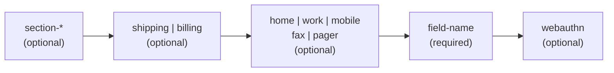

# [FEE-113] Autocomplete 屬性 Token 對照

:::info
HTML 的 `autocomplete` 屬性接受以空白分隔的 token 列表，遵循嚴格的順序文法：可選的 `section-*`、可選的 `shipping` 或 `billing`、可選的聯絡類型、必要的 field-name，以及可選的 `webauthn` 憑證提示。只有 field-name token 是必要的；其他 token 若出現，MUST 依照規定順序排列。將 `webauthn` 與 `username` 一同加入，可讓 `<input>` 在搭配 `navigator.credentials.get({ mediation: 'conditional' })` 時成為 passkey Conditional UI 的進入點。本文彙整每個 field-name token、說明分組前綴，並記錄 passkey 整合方式。
:::

## 背景

WHATWG HTML Living Standard 將 `autocomplete` 定義為以空白分隔的 token 列表，並規定嚴格順序：`[section-*] [shipping|billing] [home|work|mobile|fax|pager] field-name [webauthn]`。規範描述此結構為「可選的 section 前綴：`section-*`；可選的模式：`shipping` 或 `billing`；可選的聯絡類型：`home`、`work`、`mobile`、`fax` 或 `pager`；Field name（必要）；可選的憑證類型：`webauthn`。」

若 token 順序錯亂便落在文法之外，瀏覽器會將該屬性視為 autofill-unspecified，悄悄丟棄語意提示。field-name token 承載主要訊號；周圍的 token 則細化此欄位所屬的地址、電話或帳號脈絡。

## 視覺對比

| 位置 | Token 類別 | 必要 | 允許值 |
| --- | --- | --- | --- |
| 1 | Section 前綴 | 否 | 任何 `section-*` token（不分大小寫；後綴任意） |
| 2 | 地址模式 | 否 | `shipping`、`billing` |
| 3 | 聯絡類型 | 否 | `home`、`work`、`mobile`、`fax`、`pager` |
| 4 | Field name | 是 | field-name 目錄中的一個 token（見 Token 對照表） |
| 5 | 憑證類型 | 否 | `webauthn` |



## 範例

單一欄位的最小 autofill 提示只使用 field-name token：

```html
<label>
  First name
  <input type="text" name="first" autocomplete="given-name" />
</label>
```

分組表單使用 `section-*` 前綴，讓瀏覽器能在同一頁面上區分兩組地址，並搭配模式限定詞：

```html
<fieldset>
  <legend>Primary billing address</legend>
  <input autocomplete="section-user1 billing postal-code" name="billing-zip" />
  <input autocomplete="section-user1 billing country" name="billing-country" />
</fieldset>

<fieldset>
  <legend>Secondary billing address</legend>
  <input autocomplete="section-user2 billing postal-code" name="alt-billing-zip" />
  <input autocomplete="section-user2 billing country" name="alt-billing-country" />
</fieldset>
```

參與 passkey Conditional UI 的登入欄位同時帶有 `username` 與 `webauthn`，頁面再以 conditional mediation 呼叫 `navigator.credentials.get()`，請求保持 pending 直到使用者從 autofill 選單挑選憑證：

```html
<form id="login">
  <label>
    Username
    <input name="username" autocomplete="username webauthn" />
  </label>
  <label>
    Password
    <input name="password" type="password" autocomplete="current-password" />
  </label>
</form>
```

```js
if (window.PublicKeyCredential &&
    PublicKeyCredential.isConditionalMediationAvailable) {
  const available = await PublicKeyCredential.isConditionalMediationAvailable();
  if (available) {
    const credential = await navigator.credentials.get({
      mediation: 'conditional',
      publicKey: {
        challenge: new Uint8Array(challengeFromServer),
        // allowCredentials left empty for discoverable credentials
      },
    });
    // The promise stays pending until the user picks a passkey in the autofill sheet.
    verifyOnServer(credential);
  }
}
```

## 最佳實踐

- **MUST** 在登入表單上將識別欄位的 `autocomplete="username"` 與密碼欄位的 `autocomplete="current-password"` 配對。web.dev 記錄在現代瀏覽器中，`username` 是密碼管理器在 email 型識別欄位上辨識的 token，而 `current-password` 則是密碼輸入框上的搭配。
- **MUST** 在註冊與變更密碼欄位使用 `autocomplete="new-password"`，讓密碼管理器建議產生新憑證並避免填入目前的密碼。MDN：「新密碼。建立新帳號或變更密碼時，應在『輸入新密碼』或『確認新密碼』欄位使用此值。」
- **SHOULD** 在「管理員為其他使用者設定密碼」頁面上，以 `autocomplete="new-password"` 取代 `autocomplete="off"` 來抑制 autofill。MDN 的安全指引指出：「若你設計一個使用者管理頁面，讓使用者可為他人指定新密碼，並希望阻止密碼欄位被自動填入，可使用 `autocomplete=\"new-password\"`。」
- **SHOULD** 將憑證欄位上的 `autocomplete="off"` 視為非強制性請求。MDN 指出：「若網站在 `<form>` 元素上設定 `autocomplete=\"off\"`，且表單包含 username 與 password 輸入欄位，瀏覽器仍會提議記住這組登入資訊。」密碼管理器會在登入流程上刻意覆寫 `off`，以 `off` 作為安全手段並不可行。
- **MAY** 結合 `section-*`、`shipping` 或 `billing` 以及聯絡類型 token，在同一頁面內區分多組地址或電話欄位。

## 深入探討

Token 只是瀏覽器參考的訊號之一。Safari 特別會在輸入欄位的 `name`、`placeholder` 與 `label` 之上疊加啟發式，並依此順序評估。Cloudfour 的 autofill 文章記錄：「Safari 使用啟發式偵測要採用的 autofill 值，且執行得相當積極。Safari 並未僅依賴標準化屬性，而是依下列順序評估輸入欄位的屬性：name、placeholder、label。」

實務上的後果為：具 `autocomplete="one-time-code"` 但 `name="email"` 的欄位在 Safari 中仍可能觸發 email autofill，因為啟發式的權重高於 token。防禦性的作者會讓 `name` 屬性與 field-name token 在語意上保持一致（`autocomplete="one-time-code"` 配 `name="otp"`、`autocomplete="current-password"` 配 `name="current-password"`），並避免 placeholder 描述與 token 宣告不同的欄位。

## Token 對照表

field-name token 取自 WHATWG 目錄。以下表格依領域分組整理，所有 token 皆不分大小寫，且都列於 MDN 的參考清單中。

### Identity

| Token | 預期格式 | 備註 |
| --- | --- | --- |
| `name` | 完整法定姓名 | 儘量採用拆分的姓名 token |
| `honorific-prefix` | 「Mr.」、「Ms.」、「Dr.」 | |
| `given-name` | 名 | |
| `additional-name` | 中間名 | |
| `family-name` | 姓 | |
| `honorific-suffix` | 「Jr.」、「III」、「PhD」 | |
| `nickname` | 顯示名稱 | |
| `username` | 帳號識別 | 登入時與 `current-password` 配對；passkey Conditional UI 必要 |
| `organization-title` | 職稱 | |
| `organization` | 公司名稱 | |

### Credentials

| Token | 預期格式 | 備註 |
| --- | --- | --- |
| `new-password` | 明文密碼 | 用於註冊與變更密碼流程；也是推薦的抑制提示 |
| `current-password` | 明文密碼 | 登入流程；與 `username` 配對 |
| `one-time-code` | 數字 OTP | iOS/macOS Safari 12+ 會解析收到的 SMS 並在鍵盤建議中提供驗證碼；Android Chrome 則使用獨立的 WebOTP API |

### Contact

| Token | 預期格式 | 備註 |
| --- | --- | --- |
| `tel` | 完整電話號碼 | 可結合 `home`/`work`/`mobile`/`fax`/`pager` 限定 |
| `tel-country-code` | 「+1」、「+44」 | |
| `tel-national` | 國內格式電話 | |
| `tel-area-code` | 區碼 | |
| `tel-local` | 本地號碼部分 | |
| `tel-extension` | 分機號碼 | |
| `email` | 電子郵件地址 | 可結合 `home`/`work` 限定 |
| `impp` | 即時通訊 URL | |
| `url` | 首頁 URL | |
| `photo` | 頭像 URL | |

### Postal address

| Token | 預期格式 | 備註 |
| --- | --- | --- |
| `street-address` | 多行街道地址 | |
| `address-line1` | 第一行街道 | |
| `address-line2` | 第二行街道 | |
| `address-line3` | 第三行街道 | |
| `address-level4` | 最細的行政層級 | |
| `address-level3` | 第三層行政區 | |
| `address-level2` | 市或地區 | |
| `address-level1` | 州或省 | |
| `country` | ISO 3166-1 alpha-2 國家代碼 | |
| `country-name` | 人類可讀的國家名稱 | |
| `postal-code` | ZIP 或郵遞區號 | |

### Payment

| Token | 預期格式 | 備註 |
| --- | --- | --- |
| `cc-name` | 卡片上姓名 | |
| `cc-given-name` | 卡片上名 | |
| `cc-additional-name` | 卡片上中間名 | |
| `cc-family-name` | 卡片上姓 | |
| `cc-number` | 卡號 | |
| `cc-exp` | 到期日，格式為 `MM/YY` 或 `MM/YYYY` | |
| `cc-exp-month` | 到期月份數字 | |
| `cc-exp-year` | 到期年份數字 | |
| `cc-csc` | 卡片安全碼 | |
| `cc-type` | 卡片發行網路名稱 | |

### Transaction

| Token | 預期格式 | 備註 |
| --- | --- | --- |
| `transaction-currency` | ISO 4217 貨幣代碼 | |
| `transaction-amount` | 小數金額 | |

### Demographics

| Token | 預期格式 | 備註 |
| --- | --- | --- |
| `bday` | `YYYY-MM-DD` | |
| `bday-day` | 日期數字 | |
| `bday-month` | 月份數字 | |
| `bday-year` | 年份數字 | |
| `sex` | 自由字串 | |
| `language` | BCP 47 語言標記 | |

`section-*`、`shipping`、`billing` 以及聯絡類型 token 並不替代 field-name token，而是疊加於其上。MDN 將 section token 描述為「前八個字元為字串 'section-'（不分大小寫）、後接額外字元的 token。凡以相同 token 開頭的表單控制項皆屬於該命名群組。」模式 token 則限定後續內容：「`shipping`：由後續 token 識別的欄位屬於 shipping 地址或聯絡資訊。`billing`：由後續 token 識別的欄位屬於 billing 地址或聯絡資訊。」聯絡類型 token（`home`、`work`、`mobile`、`fax`、`pager`）則限定電話與電子郵件欄位。

## Passkey Conditional UI（`webauthn` token）

`webauthn` token 是文法末端的憑證提示。WHATWG 規範描述：「可選的 token……代表字串 'webauthn'，表示 user agent 應透過 conditional mediation 顯示可用的 public key credentials……webauthn 僅對 input 與 textarea 元素有效。」實務上此 token 只在 `<input>` 上有意義，因為 Conditional UI 會在 username 欄位的標準 autofill 選單旁顯示 passkey。

使用時機：任何支援 passkey 的登入或帳號復原頁面。整合分為兩部分。HTML 以空白分隔同時帶上兩個 token：

```html
<input name="username" autocomplete="username webauthn" />
```

腳本以 `mediation: 'conditional'` 呼叫 `navigator.credentials.get()`。web.dev 記錄此行為：「以 `mediation: 'conditional'` 呼叫 `navigator.credentials.get()` 時，呼叫保持 pending，本身不會顯示任何 UI。」Promise 只在使用者從 autofill 選單挑選 passkey 時才會 resolve；在此之前，頁面仍可接受輸入的 username 與 password。

限制與瀏覽器支援：

- 依規範，`webauthn` 對 `<textarea>` 無效，即便文法技術上同時接受兩種元素類型。
- 與 `one-time-code` 配對時會被忽略，因為 OTP 欄位並非攜帶憑證的欄位。
- Firefox 於 122 版（2024 年 1 月）正式支援 `webauthn` autocomplete token。Chrome、Edge 與 Safari 自 2025 年起支援 Conditional UI。
- 在呼叫 `navigator.credentials.get()` 前先以 `PublicKeyCredential.isConditionalMediationAvailable()` 做功能偵測，讓較舊的瀏覽器能自然回退到 username+password 流程，不會拋出執行期錯誤。

## 延伸閱讀

- [表單與驗證](/zh-tw/HTML%20and%20Semantic%20Markup/103)
- [HTML 安全屬性](/zh-tw/HTML%20and%20Semantic%20Markup/108)

## 參考資料

- WHATWG, "HTML Living Standard — Autofill," https://html.spec.whatwg.org/multipage/form-control-infrastructure.html#autofill
- MDN, "HTML attribute: autocomplete," https://developer.mozilla.org/en-US/docs/Web/HTML/Reference/Attributes/autocomplete
- MDN, "Turning off form autocompletion," https://developer.mozilla.org/en-US/docs/Web/Security/Practical_implementation_guides/Turning_off_form_autocompletion
- web.dev, "Sign-in form best practices," https://web.dev/articles/sign-in-form-best-practices
- web.dev, "Sign in with a passkey through form autofill," https://web.dev/articles/passkey-form-autofill
- web.dev, "SMS OTP form best practices," https://web.dev/articles/sms-otp-form
- Cloudfour, "Autofill: What web devs should know, but don't," https://cloudfour.com/thinks/autofill-what-web-devs-should-know-but-dont/
- Corbado, "WebAuthn autocomplete and Conditional UI," https://www.corbado.com/blog/webauthn-autocomplete
