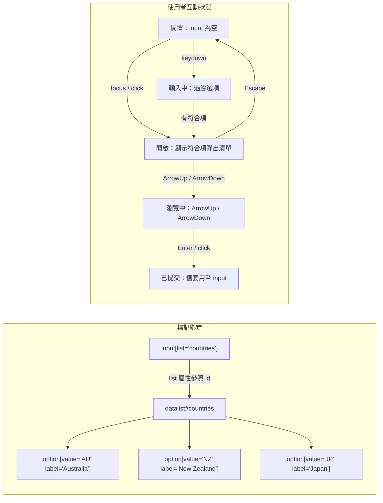

# [FEE-116] `<datalist>` 與原生 Combobox 模式

:::info
`<datalist>` 可與 `<input>` 搭配，在沒有任何 JavaScript 的情況下呈現邊輸入邊過濾的建議彈出清單。HTML Standard 將其定義為 `<option>` 元素的容器，由 input 透過 `list` 屬性參照；此元素同時扮演 WAI-ARIA combobox 模式，由平台自動串接。控制項仍接受任何通過驗證的值，這點與 `<select>` 的用途有所區別。在自行打造 ARIA combobox 之前，先理解 datalist 的強項（零 JS、語意簡潔）與限制（縮放、螢幕報讀器支援、跨瀏覽器渲染差異）。
:::

## 背景

HTML Standard 將 `<datalist>` 定義為「一組代表其他控制項預定義選項的 `option` 元素」。此元素是建議的容器，本身並非輸入控制項。作者不會直接提交 datalist 的值；它提供候選項目，由關聯的表單控制項在彈出清單中呈現。

綁定透過 input 的 `list` 屬性達成，「使用 `input` 元素上的 `list` 屬性與 `input` 元素串接」。為 datalist 指派 `id`，在 input 上設定 `list="that-id"` 即可。此關係為一對多：多個 input 可參照同一個 datalist。

MDN 明確劃分其與 `<select>` 的差異：「`<datalist>` 並非 `<select>` 的替代品。`<datalist>` 本身不代表一個 input；它是關聯控制項的建議值清單。控制項仍接受任何通過驗證的值，即使該值不在建議清單中。」`<select>` 將提交的值限制在其 `<option>` 範圍內；以 datalist 支援的 input 則接受自由文字（仍受 `pattern`、`min`、`max`、`required` 等驗證屬性約束）。

## 視覺對比



## 範例

三種 input 類型使用同一種標記形式，搭配不同的 UI 呈現。

```html
<!-- Text input: filter-as-you-type dropdown -->
<label for="country">Country code</label>
<input id="country" name="country" list="country-codes" autocomplete="off" />

<datalist id="country-codes">
  <option value="AU" label="Australia"></option>
  <option value="JP" label="Japan"></option>
  <option value="NZ" label="New Zealand"></option>
  <option value="SG" label="Singapore"></option>
  <option value="TW" label="Taiwan"></option>
</datalist>
```

```html
<!-- Range input: datalist options render as tick marks -->
<label for="volume">Volume</label>
<input id="volume" type="range" min="0" max="100" step="1" list="volume-marks" />

<datalist id="volume-marks">
  <option value="0"></option>
  <option value="25"></option>
  <option value="50"></option>
  <option value="75"></option>
  <option value="100"></option>
</datalist>
```

```html
<!-- Color input: datalist options surface as swatches in the native picker -->
<label for="accent">Brand accent</label>
<input id="accent" type="color" list="brand-swatches" />

<datalist id="brand-swatches">
  <option value="#0f62fe"></option>
  <option value="#24a148"></option>
  <option value="#da1e28"></option>
  <option value="#f1c21b"></option>
  <option value="#8a3ffc"></option>
</datalist>
```

MDN 描述：在 `text`、`search`、`url`、`tel`、`email` 與 `number` 類型上，「建議值會在使用者點擊或雙擊控制項時以下拉選單形式呈現」。`range` 類型則「以一系列刻度標記呈現，使用者可輕易選取」。`color` 類型「可在瀏覽器提供的介面中顯示預定義色彩」。

## 最佳實踐

- **MUST** 將 `<option value>` 設為想提交的值，並在顯示字串與值不同時使用 `label`（或內層文字）作為人類可讀的顯示文字。MDN 記載此差異：「每個 `<option>` 元素都應有 `value` 屬性，代表要輸入至 input 的建議值。它也可以有 `label` 屬性，或在缺少時以文字內容替代，瀏覽器可能以此取代 `value` 顯示（Firefox），或與 `value` 並列顯示（Chrome 與 Safari，作為補充文字）。」請留意 Firefox 以 label 取代 value 顯示，而 Chrome 與 Safari 則兩者並列。
- **MUST NOT** 在 `<input list>` 上加入 `role="combobox"` 或 `aria-expanded`。原生 datalist 已實作 combobox 角色；MDN 的 combobox 參考描述此內建配對為「可編輯的單行文字欄位（使用 `<input>` 元素，類似搭配 `<datalist>` 的形式）」。額外加入 ARIA 會造成語意重複，可能使輔助科技混淆。
- **MUST** 在以 datalist 作為欄位唯一輸入方式的關鍵流程上線前，驗證縮放與螢幕報讀器行為。MDN 警告：「datalist 選項的字體大小不會隨縮放調整，始終維持相同大小」，此特性影響低視力使用者。a11ysupport.io 的技術報告記錄：在 NVDA 搭配 Firefox 的環境下「所有選項皆被報讀為『空白』」；在 macOS Safari 搭配 VoiceOver 的環境下「無法瀏覽至 datalist，建議項目也不會被播報」。
- **SHOULD** 視 datalist 彈出清單在視覺上為無法樣式化。MDN：「以 CSS 針對選項清單進行樣式設定的能力極為有限甚至不存在，無法為高對比模式設定渲染樣式。」若需要精準符合品牌的選項樣式或高對比模式下的一致性，請勿使用 datalist。
- **SHOULD** 在符合下列任一條件時改用自行實作的 ARIA combobox（摘自 Adrian Roselli 的清單）：在 Android 版 Firefox 上欄位需要超越純文字框的功能、在 Android 版 Chrome 的橫向模式下選項必須可觸及、使用者需要縮放選項文字、語音控制必須可指向選項、需要為選項套用樣式、或提交的 `value` 與可見節點文字不同。
- **MAY** 藉由參照相同 `id` 讓多個 input 共用一個 `<datalist>`。這是綁定模型的直接結果，當多個欄位使用同一份清單（例如帳單與運送表單中的國家代碼）時可使標記保持精簡。

## 設計思維

WAI-ARIA Authoring Practices 簡潔地定義 combobox：「combobox 是具有關聯彈出清單的輸入小工具。彈出清單讓使用者從一組集合中選擇 input 的值。」`<input list>` + `<datalist>` 配對滿足此定義，無需作者撰寫任何 ARIA。瀏覽器負責展開／收合狀態、過濾邏輯、鍵盤模型以及焦點調度。

Web Axe 描述原生元素要求接受的取捨：「datalist 元素的精髓在於簡潔。直截了當、語意清楚、簡單的 HTML，且無需 JavaScript！」此簡潔性就是設計槓桿。自行實作的 ARIA combobox 需要正確的角色（`combobox`、`listbox`、`option`）、`aria-controls`、`aria-activedescendant`（或 roving tabindex）、`aria-expanded`、針對 Home／End／PageUp／PageDown／Escape／Enter 的鍵盤處理、開啟與過濾時的螢幕報讀器播報、以及關閉時的焦點回復。每一塊都是 bug 可能棲身的地方。

Datalist 讓出呈現與部分可及性邊角的控制權，以換取消除這些實作表面積。兩者之間的選擇方式是將產品需求對照前述 Roselli 清單：若無任何條件適用，原生 datalist 是風險最低的實作；若有任何條件適用，原生元素將無法達標，實作 ARIA combobox 便成為合理的投入。

## 深入探討

**動態選項更新。** 規格支援在執行期新增與移除 `<option>` 子元素。Firefox 至少有兩個現存 bug 讓此行為不穩定。Bugzilla #1351483（「在 input 已有值後才附加的 datalist 無法顯示」）記錄其中一類：若 datalist 在 input 已持有值之後才附加至 DOM，彈出清單要等使用者清空值並重新輸入後才會出現。同一 bug 回報也指出，Firefox 的自動完成控制器在選項陣列被替換後仍保留先前過濾結果，導致顯示過時建議。防禦性做法：盡可能在首次繪製時渲染完整 datalist；若選項必須動態抓取，重建整個 datalist 元素（移除後重新加入）而非就地變動子元素，並在替換後對 input 執行 blur／refocus。

**Firefox 寬度截斷。** Bugzilla #1106946 記錄 Firefox 會以省略符號將 datalist 選項文字截斷至 input 的寬度：「datalist 選項不應被截斷至 input 的寬度。」Chrome 與 Edge 則讓彈出清單延伸以容納最長的選項。CSS 無法覆蓋此行為，因為 datalist 的渲染位於作者可樣式化表面之外（見最佳實踐第四點）。對於較長的標籤（地址、完整產品名稱），可加寬 input、拆成兩個欄位，或改用 ARIA combobox。

## 輸入類型相容性對照

根據 MDN：「此屬性在 `text`、`search`、`url`、`tel`、`email`、`date`、`month`、`week`、`time`、`datetime-local`、`number`、`range` 與 `color` 上有效。」並且：「依規格，`list` 屬性在 `hidden`、`password`、`checkbox`、`radio`、`file` 或任何 button 類型上皆不受支援。」

| Input type        | `list` 支援 | UI 呈現                                              |
|-------------------|------------|------------------------------------------------------|
| `text`            | 是         | 邊輸入邊過濾的下拉清單                                |
| `search`          | 是         | 邊輸入邊過濾的下拉清單                                |
| `url`             | 是         | 邊輸入邊過濾的下拉清單                                |
| `tel`             | 是         | 邊輸入邊過濾的下拉清單                                |
| `email`           | 是         | 邊輸入邊過濾的下拉清單                                |
| `number`          | 是         | 邊輸入邊過濾的下拉清單                                |
| `date`            | 是         | 建議項目在原生日期選擇器中呈現                        |
| `month`           | 是         | 建議項目在原生月份選擇器中呈現                        |
| `week`            | 是         | 建議項目在原生週選擇器中呈現                          |
| `time`            | 是         | 建議項目在原生時間選擇器中呈現                        |
| `datetime-local`  | 是         | 建議項目在原生日期時間選擇器中呈現                    |
| `range`           | 是         | 滑桿軌道上的刻度標記                                  |
| `color`           | 是         | 原生色彩選擇器內的色票                                |
| `hidden`          | 否         | `list` 被忽略（依規格）                               |
| `password`        | 否         | `list` 被忽略（依規格）                               |
| `checkbox`        | 否         | `list` 被忽略（依規格）                               |
| `radio`           | 否         | `list` 被忽略（依規格）                               |
| `file`            | 否         | `list` 被忽略（依規格）                               |
| `button` 類型     | 否         | `list` 在 `submit`、`reset`、`button`、`image` 上被忽略 |

此劃分遵循一致的規則：凡是值為自由文字形式（類文字）、具數值範圍（`range`、`number`）或從大量空間中選取（日期、`color`）的 input，都能從建議中獲益；切換開關、按鈕與不透明控制項（`hidden`、`password`、`file`）則否。

## 延伸閱讀

- [表單與驗證](/zh-tw/HTML%20and%20Semantic%20Markup/103)
- [Autocomplete 屬性 Token 對照](/zh-tw/HTML%20and%20Semantic%20Markup/autocomplete-token-reference)

## 參考資料

- WHATWG, "The `datalist` element," HTML Living Standard. https://html.spec.whatwg.org/multipage/form-elements.html#the-datalist-element
- MDN, "`<datalist>`: The HTML Data List element." https://developer.mozilla.org/en-US/docs/Web/HTML/Reference/Elements/datalist
- MDN, "`<input>`: The HTML Input element." https://developer.mozilla.org/en-US/docs/Web/HTML/Reference/Elements/input
- MDN, "`<option>`: The HTML Option element." https://developer.mozilla.org/en-US/docs/Web/HTML/Reference/Elements/option
- W3C WAI, "Combobox Pattern," ARIA Authoring Practices Guide. https://www.w3.org/WAI/ARIA/apg/patterns/combobox/
- MDN, "ARIA: combobox role." https://developer.mozilla.org/en-US/docs/Web/Accessibility/ARIA/Reference/Roles/combobox_role
- a11ysupport.io, "HTML `datalist` element support." https://a11ysupport.io/tech/html/datalist_element
- Adrian Roselli, "Under-Engineered Comboboxen?" (2023). https://adrianroselli.com/2023/06/under-engineered-comboboxen.html
- Web Axe, "Datalist over ARIA combobox." https://www.webaxe.org/datalist-over-aria-combobox/
- Mozilla Bugzilla #1351483, "dynamically added datalist does not show when appened after the input its assigned to already has a value." https://bugzilla.mozilla.org/show_bug.cgi?id=1351483
- Mozilla Bugzilla #1106946, "datalist options should not be truncated to the width of the input." https://bugzilla.mozilla.org/show_bug.cgi?id=1106946
