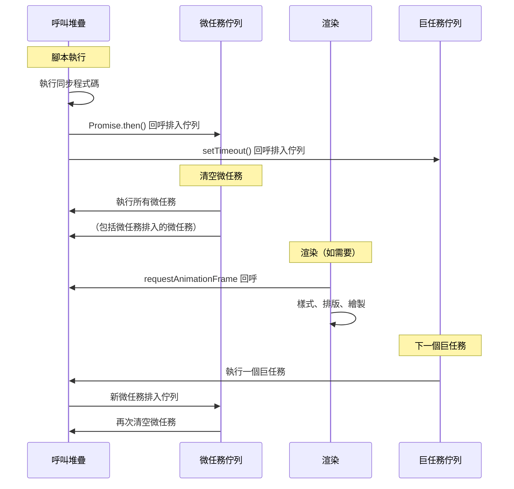

# [FEE-301] 事件循環與非同步模型

:::info
JavaScript 在單一執行緒上執行。事件循環是協調同步程式碼、微任務（Promise）、巨任務（setTimeout、I/O）和渲染更新執行的機制。
:::

## 背景

瀏覽器在單一主執行緒上執行 JavaScript，該執行緒同時處理排版、繪製和使用者輸入。理解事件循環至關重要，因為它決定了你的程式碼相對於渲染和使用者互動何時執行。誤解任務排程會導致卡頓的 UI、競態條件和難以重現的微妙 bug。

## 原則

工程師 MUST 理解微任務和巨任務的區別，以及它們如何與渲染交錯。

**每次事件循環迭代的執行順序：**

1. 執行當前同步呼叫堆疊至完成
2. 清空微任務佇列（Promise 回呼、queueMicrotask、MutationObserver）
3. 如果需要渲染：執行 requestAnimationFrame 回呼，然後排版和繪製
4. 從佇列中選取下一個巨任務（setTimeout、setInterval、MessageChannel、I/O）
5. 重複

工程師 SHOULD 在需要在下次渲染前完成的工作中使用 `queueMicrotask()` 或 Promise 解析。工程師 SHOULD 使用 `requestAnimationFrame()` 進行視覺更新。工程師 SHOULD NOT 使用 `setTimeout(fn, 0)` 作為通用的「延遲」機制──它排程一個巨任務，會在渲染之後執行。

## 圖解



## 範例

```js
console.log('1: 同步');

setTimeout(() => {
  console.log('5: 巨任務');
}, 0);

Promise.resolve().then(() => {
  console.log('3: 微任務');
}).then(() => {
  console.log('4: 鏈式微任務');
});

console.log('2: 同步');

// 輸出順序：1, 2, 3, 4, 5
```

**為什麼這個順序很重要：** 同步程式碼（1, 2）作為當前呼叫堆疊的一部分首先執行。Promise `.then()` 回呼（3, 4）是微任務──它們在事件循環繼續之前清空。`setTimeout`（5）是巨任務──它等待下一次迭代。

## 常見錯誤

**用同步工作阻塞主執行緒。** 長時間執行的同步操作（大陣列處理、複雜計算）會阻塞渲染和輸入。將繁重計算移至 Web Workers 或使用 `scheduler.yield()` 或 `requestIdleCallback()` 分成小塊。

**假設 setTimeout(fn, 0) 會「立即」執行。** 它排程一個巨任務。整個微任務佇列清空和可能的渲染都可能在它執行之前發生。如果需要延遲到當前任務之後但在渲染之前，請使用 `queueMicrotask()`。

**無限微任務循環。** 排入另一個微任務的微任務會使渲染飢餓。微任務佇列必須完全清空，瀏覽器才能繪製。確保微任務鏈終止。

**不一致地混合非同步模式。** 在不理解排程行為的情況下混合回呼、Promise 和 async/await 會導致不可預測的執行順序。為了可讀性優先使用 async/await，但要理解它會展開為 Promise 微任務。

## 相關 FEE

- [FEE-300](300.md) JavaScript 核心與執行環境總覽
- [FEE-302](302.md) 閉包與作用域鏈

## 參考資料

- [HTML Living Standard: 事件循環](https://html.spec.whatwg.org/multipage/webappapis.html#event-loops)
- [MDN: 事件循環](https://developer.mozilla.org/en-US/docs/Web/JavaScript/Event_loop)
- [MDN: queueMicrotask](https://developer.mozilla.org/en-US/docs/Web/API/queueMicrotask)
- [Jake Archibald: Tasks, microtasks, queues and schedules](https://jakearchibald.com/2015/tasks-microtasks-queues-and-schedules/)
