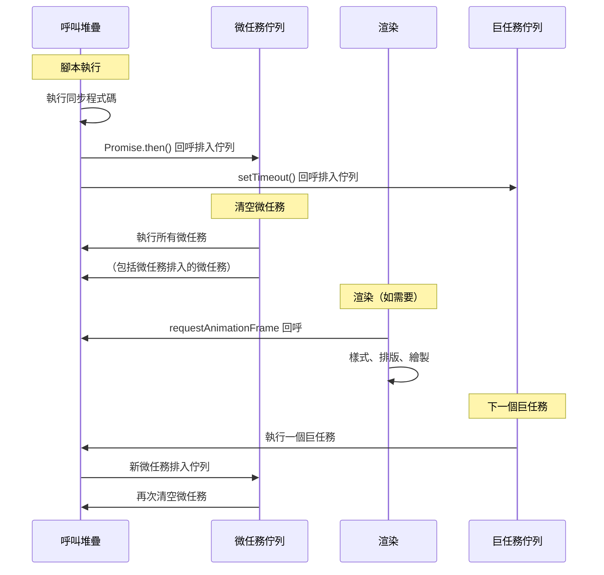

# [FEE-301] 事件循環與非同步模型

:::info
JavaScript 在單一執行緒上執行。事件循環是協調同步程式碼、微任務（Promise）、巨任務（setTimeout、I/O）和渲染更新執行的機制。
:::

## 背景

瀏覽器在單一主執行緒上執行 JavaScript，該執行緒同時處理排版、繪製和使用者輸入。理解事件循環至關重要，因為它決定了你的程式碼相對於渲染和使用者互動何時執行。誤解任務排程會導致卡頓的 UI、競態條件和難以重現的微妙 bug。

## 使用情境

你正在開發一個檔案上傳功能，進度條應在上傳過程中流暢更新。初版實作在上傳處理器的迴圈中直接更新進度條，但 UI 完全沒有反應──畫面凍結到上傳完成，才一口氣跳到 100%。凍結的原因在於所有更新都在呼叫堆疊中同步執行，封鎖了瀏覽器的渲染週期。將更新操作改為透過事件循環執行──使用 `setTimeout`、`requestAnimationFrame` 或非同步回呼──就能讓瀏覽器在每次更新之間獲得渲染的機會。

## 最佳實踐

**絕不用長時間的同步工作阻塞主執行緒。** 呼叫堆疊必須執行至完成，瀏覽器才能處理輸入或繪製。工程師 MUST 將繁重計算卸載至 Web Workers，或使用 `scheduler.yield()` 或 `requestIdleCallback()` 將其分成小塊，保持執行緒的回應性。

**需要排序保證時，優先使用微任務而非巨任務。** `Promise.resolve().then()` 和 `queueMicrotask()` 在下一個巨任務和任何渲染步驟之前執行。工程師 SHOULD 在延遲動作必須在瀏覽器有機會繪製或取得下一個計時器回呼之前完成時，使用這些 API。

**視覺更新使用 requestAnimationFrame，而非 setTimeout。** `requestAnimationFrame` 在微任務清空後、瀏覽器排版與繪製步驟之前觸發，是需要出現在當前幀的 DOM 變更的正確掛鉤。工程師 SHOULD NOT 將 `setTimeout(fn, 0)` 用於視覺工作——它是一個巨任務，在較晚的事件循環迭代中執行，可能在不相關的繪製已發生後才執行。

**確保微任務鏈始終能夠終止。** 由於微任務佇列在瀏覽器能夠渲染之前必須完全清空，持續排入新微任務的微任務會無限期地使渲染管線飢餓。工程師 MUST 設計非同步鏈，使其能達到已解決狀態，而非無限循環。

## 圖解



## 範例

```js
console.log('1: 同步');

setTimeout(() => {
  console.log('5: 巨任務');
}, 0);

Promise.resolve().then(() => {
  console.log('3: 微任務');
}).then(() => {
  console.log('4: 鏈式微任務');
});

console.log('2: 同步');

// 輸出順序：1, 2, 3, 4, 5
```

**為什麼這個順序很重要：** 同步程式碼（1, 2）作為當前呼叫堆疊的一部分首先執行。Promise `.then()` 回呼（3, 4）是微任務——它們在事件循環繼續之前清空。`setTimeout`（5）是巨任務——它等待下一次迭代。

## 深入探討

### 呼叫堆疊與佇列的互動

JavaScript 引擎開始執行腳本時，所有同步語句都在**呼叫堆疊**上執行。呼叫堆疊是一個後進先出（LIFO）結構；函式呼叫時將幀推入，返回時彈出。事件循環只有在呼叫堆疊完全清空後才會檢查佇列。

### 微任務佇列

來源：`Promise.then()` / `.catch()` / `.finally()`、`queueMicrotask()`、`MutationObserver` 回呼。

微任務佇列有一個特殊屬性：它會**完全清空**後，執行環境才會取下一個巨任務。這是遞迴保證——若某個微任務又排入了另一個微任務，那個新微任務也會在任何巨任務之前執行。其演算法大致如下：

> 每個任務執行後：只要微任務佇列非空，就取出並執行一個微任務。重複直到佇列清空，然後繼續。

這就是為什麼鏈式的 `.then()` 呼叫都會在任何 `setTimeout` 回呼觸發之前全部解析，無論鏈有多長。

### 巨任務佇列

以下來源適用於瀏覽器環境（除非另有說明）：`setTimeout`、`setInterval`、`setImmediate`（Node.js）、`MessageChannel`、I/O 回呼、UI 事件回呼。

每次事件循環迭代只執行**一個巨任務**。完成後，微任務再次清空，才取下一個巨任務。這意味著一批 `setTimeout` 呼叫不會不被中斷地連續執行——微任務可以在它們之間穿插。

### 排序範例

```js
// 為什麼 'micro' 總是在 'macro' 之前印出，即使延遲為 0 毫秒？

setTimeout(() => console.log('macro'), 0);
Promise.resolve().then(() => console.log('micro'));

// 輸出：
// micro
// macro
```

`setTimeout(..., 0)` 不代表「與當前腳本同時執行」。它的意思是「在下一個可用的事件循環迭代中，在最少 0 毫秒的延遲後排程一個巨任務」。然而，Promise `.then()` 回呼是微任務，在當前迭代的微任務清空階段處理——這發生在執行環境取下一個巨任務之前。0 毫秒延遲是下限，而非優先級信號。

### requestAnimationFrame 的位置

`requestAnimationFrame` 回呼既不屬於微任務佇列，也不屬於巨任務佇列。它們在巨任務執行後、後續微任務清空後執行，但在瀏覽器的樣式重新計算、排版和繪製步驟**之前**。這使得 `requestAnimationFrame` 成為批次處理目標為當前幀的 DOM 變更的正確位置：在此處進行的更改保證在下次繪製前對排版引擎可見。

```
[巨任務] → [微任務清空] → [rAF 回呼] → [樣式/排版/繪製] → [下一個巨任務] → …
```

## 常見錯誤

**無限微任務循環。** 排入另一個微任務的微任務會使渲染飢餓。微任務佇列必須完全清空，瀏覽器才能繪製。確保微任務鏈終止。

**不一致地混合非同步模式。** 在不理解排程行為的情況下混合回呼、Promise 和 async/await 會導致不可預測的執行順序。為了可讀性優先使用 async/await，但要理解它會展開為 Promise 微任務。

## 相關 FEE

- [FEE-300](300.md) JavaScript 核心與執行環境總覽
- [FEE-302](302.md) 閉包與作用域鏈

## 參考資料

- [HTML Living Standard: 事件循環](https://html.spec.whatwg.org/multipage/webappapis.html#event-loops)
- [MDN: 事件循環](https://developer.mozilla.org/en-US/docs/Web/JavaScript/Event_loop)
- [MDN: queueMicrotask](https://developer.mozilla.org/en-US/docs/Web/API/queueMicrotask)
- [Jake Archibald: Tasks, microtasks, queues and schedules](https://jakearchibald.com/2015/tasks-microtasks-queues-and-schedules/)
