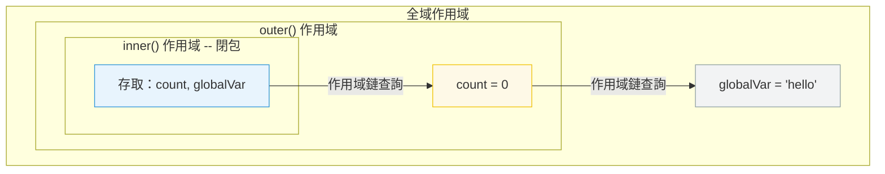

# [FEE-302] 閉包與作用域鏈

:::info
閉包是一個保留對其詞法作用域中變數存取權的函式，即使外部函式已經回傳。作用域鏈是 JavaScript 用來解析變數引用的機制。
:::

## 背景

閉包是 JavaScript 最強大的特性之一，也是最容易被誤解的特性之一。它們實現了資料隱私、部分應用、事件處理器綁定和記憶化。當開發者沒有意識到閉包會使其整個包含作用域保持存活時，它們也會導致記憶體洩漏。理解閉包需要理解作用域鏈──JavaScript 如何在執行時解析變數名稱。

## 原則

工程師 MUST 理解閉包捕獲的是變數綁定，而不是閉包建立時的值。

工程師 SHOULD 有意識地使用閉包：
- **資料隱私** -- 封裝不應直接存取的狀態
- **部分應用** -- 預填參數以建立特化函式
- **回呼綁定** -- 在非同步操作中保留上下文

工程師 MUST 注意閉包會保留對其整個包含作用域的引用。如果閉包是長壽命的（例如儲存在全域變數中、附加到 DOM 事件），作用域中的每個變數都會保留在記憶體中。

## 圖解



## 範例

**閉包實現資料隱私：**

```js
function createCounter() {
  let count = 0; // 私有──外部無法存取

  return {
    increment() { return ++count; },
    decrement() { return --count; },
    getCount() { return count; },
  };
}

const counter = createCounter();
counter.increment(); // 1
counter.increment(); // 2
counter.getCount();  // 2
// count 無法直接存取──只能透過回傳的方法
```

**經典的迴圈陷阱：**

```js
// Bug：所有回呼都輸出 3
for (var i = 0; i < 3; i++) {
  setTimeout(() => console.log(i), 100);
}
// 輸出：3, 3, 3（var 是函式作用域，閉包捕獲的是綁定）

// 修正：使用 let（區塊作用域，每次迭代建立新的綁定）
for (let i = 0; i < 3; i++) {
  setTimeout(() => console.log(i), 100);
}
// 輸出：0, 1, 2
```

**部分應用：**

```js
function multiply(a) {
  return function (b) {
    return a * b;
  };
}

const double = multiply(2);
const triple = multiply(3);

double(5);  // 10
triple(5);  // 15
```

## 常見錯誤

**意外的記憶體保留。** 對大物件的閉包會使該物件在閉包存在期間一直存活。如果閉包附加到長壽命的事件監聽器或儲存在快取中，大物件將無法被垃圾回收。解決方案：清空不再需要的引用，或重構為只閉包特定所需的值。

**使用 `var` 閉包迴圈變數。** 這是經典的閉包陷阱。`var` 是函式作用域，所以所有迭代共享同一個綁定。使用 `let`（區塊作用域）或 IIFE 為每次迭代建立新的綁定。

**假設閉包複製值。** 閉包捕獲的是變數綁定，不是快照。如果外部變數在閉包建立後改變，閉包會看到新值。這是一個特性（它實現了計數器和累加器），但當你期望凍結值時就是一個 bug。

## 相關 FEE

- [FEE-300](300.md) JavaScript 核心與執行環境總覽
- [FEE-301](301.md) 事件循環與非同步模型

## 參考資料

- [MDN: 閉包](https://developer.mozilla.org/en-US/docs/Web/JavaScript/Closures)
- [ECMA-262: 詞法環境](https://tc39.es/ecma262/#sec-lexical-environments)
- [JavaScript.info: 閉包](https://javascript.info/closure)
