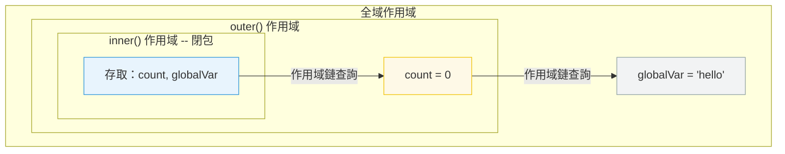

# [FEE-302] 閉包與作用域鏈

:::info
閉包是一個保留對其詞法作用域中變數存取權的函式，即使外部函式已經回傳。作用域鏈是 JavaScript 用來解析變數引用的機制。
:::

## 背景

閉包是 JavaScript 最強大的特性之一，也是最容易被誤解的特性之一。它們實現了資料隱私、部分應用、事件處理器綁定和記憶化。當開發者沒有意識到閉包會使其整個包含作用域保持存活時，它們也會導致記憶體洩漏。理解閉包需要理解作用域鏈──JavaScript 如何在執行時解析變數名稱。

## 原則

工程師 MUST 理解閉包捕獲的是變數綁定，而不是閉包建立時的值。

工程師 SHOULD 有意識地使用閉包：
- **資料隱私** -- 封裝不應直接存取的狀態
- **部分應用** -- 預填參數以建立特化函式
- **回呼綁定** -- 在非同步操作中保留上下文

工程師 MUST 注意閉包會保留對其整個包含作用域的引用。如果閉包是長壽命的（例如儲存在全域變數中、附加到 DOM 事件），作用域中的每個變數都會保留在記憶體中。

## 最佳實踐

**在迴圈中使用 `let` 或 `const`，絕不使用 `var`。** 當閉包在迴圈內建立時，`var` 是函式作用域，因此每次迭代共享同一個綁定。當回呼執行時，該綁定持有的是最終值。`let` 與 `const` 是區塊作用域：每次迴圈迭代都有自己的綁定，因此每個閉包捕獲的是獨立的值。工程師 MUST 在任何可能被閉包捕獲的迴圈變數上優先使用 `let`/`const`。

**明確定義閉包捕獲哪些變數。** 閉包保留的是其建立位置整個詞法環境的引用，而不只是可見使用的變數。工程師 SHOULD 盡量減少定義閉包時作用域中的變數數量，並 SHOULD 優先只提取閉包實際需要的特定值，而非對大型物件或整個外部作用域建立閉包。

**避免無意間的閉包記憶體保留。** MDN 指出：「在不需要閉包的情況下，在函式內部不必要地建立函式是不明智的，因為這會在處理速度和記憶體消耗方面對腳本效能產生負面影響。」工程師 MUST 審查長壽命閉包（事件監聽器、模組層級快取、計時器），確保它們沒有無意間使大型物件持續存活。當不再需要某個被捕獲的引用時，應將其設為 `null`，或重構使閉包只捕獲所需的最小資料。

## 圖解



## 範例

**閉包實現資料隱私：**

```js
function createCounter() {
  let count = 0; // 私有──外部無法存取

  return {
    increment() { return ++count; },
    decrement() { return --count; },
    getCount() { return count; },
  };
}

const counter = createCounter();
counter.increment(); // 1
counter.increment(); // 2
counter.getCount();  // 2
// count 無法直接存取──只能透過回傳的方法
```

**經典的迴圈陷阱：**

```js
// Bug：所有回呼都輸出 3
for (var i = 0; i < 3; i++) {
  setTimeout(() => console.log(i), 100);
}
// 輸出：3, 3, 3（var 是函式作用域，閉包捕獲的是綁定）

// 修正：使用 let（區塊作用域，每次迭代建立新的綁定）
for (let i = 0; i < 3; i++) {
  setTimeout(() => console.log(i), 100);
}
// 輸出：0, 1, 2
```

**部分應用：**

```js
function multiply(a) {
  return function (b) {
    return a * b;
  };
}

const double = multiply(2);
const triple = multiply(3);

double(5);  // 10
triple(5);  // 15
```

## 深入探討

### `var` 在迴圈中的閉包陷阱

迴圈陷阱是 `var` 作用域與閉包交互方式的直接結果。當你使用 `var` 撰寫 `for` 迴圈時，迴圈變數會被提升（hoist）到包含函式的作用域中，整個迴圈只有一個綁定。在迴圈主體內建立的每個閉包都閉合於同一個共享綁定。MDN 精確地描述這一點：「因為迴圈在那時已經執行完畢，`item` 變數物件（由三個閉包共享）最終指向 `helpText` 列表的最後一個項目。」

`let` 解決了這個問題，因為區塊作用域意味著迴圈主體的每次迭代都是一個獨立的區塊作用域，每個閉包都有自己獨立的綁定。MDN 確認：「每個閉包都綁定了區塊作用域的變數，這意味著不需要額外的閉包。」這也是為什麼 `const` 在 `for...of` 迴圈中有效：每次迭代都是全新的綁定，而不是對共享綁定的修改。

### 閉包如何保留整個作用域鏈

MDN 將閉包定義為「函式與其周圍狀態（詞法環境）的引用組合在一起」。關鍵詞是「引用」——閉包不會複製它使用的變數；它持有的是對建立它的環境物件的即時引用。

由於環境物件在閉包和外部函式之間是共享的，只要閉包可達，該環境中的任何變數都可達。如果外部函式回傳後，除了閉包之外沒有其他東西持有對其局部變數的引用，那些變數就只靠閉包維持存活。如果該閉包本身儲存在長壽命的位置（模組層級變數、DOM 事件監聽器、`setInterval` 回呼），整個被捕獲的環境就會在該引用的生命週期內持續存在。

這個效應還會沿著作用域鏈向上傳播。一個閉包捕獲其直接環境，而該環境又可能引用外部環境，形成一條鏈。因此，深度巢狀的閉包會隱式地保留該鏈中的每個環境。

### 記憶體影響

由於垃圾回收器使用標記清除演算法——從根節點追蹤可達性——任何可透過存活閉包引用到達的變數都不會被回收。這意味著捕獲大型物件引用的閉包（例如 DOM 節點、大型陣列、完整 API 回應）只要閉包存在，就會將該物件保留在記憶體中，即使閉包在初始化後再也不會實際存取那個變數。

實際影響：
- 附加到 DOM 元素上、事後從文件中移除的事件監聽器，如果其回呼閉包捕獲了對那些元素的引用，可能使整個元件樹繼續存活。
- 儲存閉包的模組層級快取（例如 memoization map）如果鍵值從未被清除，記憶體會隨時間累積。
- 用 `setInterval` 建立的計時器若捕獲了外部作用域的引用，在計時器被清除前，那些引用都不會被釋放。

緩解方式是讓閉包的結構只捕獲所需的內容：提取特定的純量值或小型資料結構，而非閉合整個外部物件，並在閉包不再需要時明確釋放引用（設為 `null` 或移除監聽器）。

## 常見錯誤

**意外的記憶體保留。** 對大物件的閉包會使該物件在閉包存在期間一直存活。如果閉包附加到長壽命的事件監聽器或儲存在快取中，大物件將無法被垃圾回收。解決方案：清空不再需要的引用，或重構為只閉包特定所需的值。

**假設閉包複製值。** 閉包捕獲的是變數綁定，不是快照。如果外部變數在閉包建立後改變，閉包會看到新值。這是一個特性（它實現了計數器和累加器），但當你期望凍結值時就是一個 bug。

## 相關 FEE

- [FEE-300](300.md) JavaScript 核心與執行環境總覽
- [FEE-301](301.md) 事件循環與非同步模型

## 參考資料

- [MDN: 閉包](https://developer.mozilla.org/en-US/docs/Web/JavaScript/Closures)
- [MDN: `let` -- 區塊作用域與逐次迭代綁定](https://developer.mozilla.org/en-US/docs/Web/JavaScript/Reference/Statements/let)
- [MDN: 記憶體管理](https://developer.mozilla.org/en-US/docs/Web/JavaScript/Memory_management)
- [ECMA-262: 詞法環境](https://tc39.es/ecma262/#sec-lexical-environments)
- [JavaScript.info: 閉包](https://javascript.info/closure)
