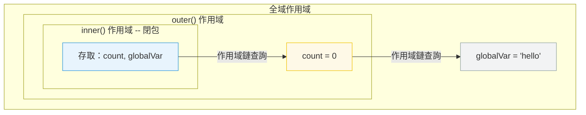

# [FEE-302] 閉包與作用域鏈

:::info
閉包是一個保留對其詞法作用域中變數存取權的函式，即使外部函式已經回傳。作用域鏈是 JavaScript 用來解析變數引用的機制。
:::

## 背景

閉包是 JavaScript 最強大的特性之一，也是最容易被誤解的特性之一。它們實現了資料隱私、
部分應用、事件處理器綁定和記憶化。當開發者沒有意識到閉包會使其整個包含作用域保持存
活時，它們也會導致記憶體洩漏。理解閉包需要理解作用域鏈──JavaScript 如何在執行時解
析變數名稱。

閉包是 JavaScript 與其他程式語言最顯著的區別之一。在 Java 或 C++ 中，函式不自動捕
獲其定義環境；必須明確傳遞所需的值。在 JavaScript 中，每個函式都是一個潛在的閉包，
靜默地保留對其詞法環境的引用。這種語言設計使回呼、函數式模式和非同步程式設計大幅
簡化，但也要求開發者對記憶體保留和共享可變狀態保持警覺。

## 設計思維

### 閉包的構成條件

只要一個函式保留對某個詞法環境的引用，而該環境的生命週期超過了建立它的函式呼叫，閉包就會形成。最常見的情況是從另一個函式回傳的函式：外部呼叫回傳後，其局部環境通常會變得不可達，可被垃圾回收，但因為回傳的內部函式持有對它的引用，該環境得以維持存活。內部函式就是閉包；它所保留的環境就是「被閉合的」作用域。

閉包形成需要滿足三個條件：一個函式必須定義在另一個作用域內部；它必須引用該包含作用域中的至少一個變數；且它必須比該作用域的活化期更長壽（通常透過被儲存並在之後呼叫）。若三者都具備，無論程式設計師是否有意為之，閉包都會形成。這就是為何閉包會出現在事件監聽器、`setTimeout` 回呼、Promise 處理器，以及任何函式在一個上下文中建立、在另一個上下文中呼叫的模式中。

### 綁定語意 vs. 值語意

閉包最關鍵的特性是：它捕獲的是綁定，而非值。綁定是名稱與儲存格之間的關聯。當閉包捕獲一個綁定時，它持有的是儲存格本身的引用，而非閉包建立那一刻儲存格中的值的副本。任何後續對該綁定的寫入——無論是由外部函式、閉包本身，還是共享同一作用域的其他函式——對所有共享該綁定的閉包都立即可見。

這將 JavaScript 閉包與表面上相似的語言特性區分開來。被捕獲的 `const` 綁定從閉包的角度實際上是唯讀的，因為 `const` 禁止重新賦值，但綁定機制完全相同：閉包仍然持有對環境記錄的引用，而非複製的值。不可變性保證來自 `const` 關鍵字，而非閉包機制。

### 詞法環境與作用域鏈

當變數引用被求值時，引擎在當前函式的環境記錄中查找識別符。若未找到，查找繼續到外部環境（在定義時捕獲），然後是外部環境的外部環境，依此類推直到全域作用域。這條外部環境引用的鏈就是作用域鏈。作用域鏈在定義時固定：它遵循原始碼中的詞法巢狀，而非呼叫時的動態呼叫堆疊。

這種詞法作用域模型意味著函式無論去到哪裡都攜帶著其作用域上下文。將函式作為參數傳遞給另一個函式，不會改變它使用的作用域鏈。從完全不同的模組呼叫一個函式，不會改變它能看到哪些識別符。作用域鏈完全由函式的撰寫位置決定，而非呼叫位置或方式。這種可預測性使閉包成為可靠的封裝工具：一個模組可以回傳存取私有狀態的函式，外部呼叫者除了透過回傳介面外，無法以任何方式存取那個狀態。

## 最佳實踐

**在迴圈中使用 `let` 或 `const`，絕不使用 `var`。** 當閉包在迴圈內建立時，`var` 是函式作用域，因此每次迭代共享同一個綁定。當回呼執行時，該綁定持有的是最終值。`let` 與 `const` 是區塊作用域：每次迴圈迭代都有自己的綁定，因此每個閉包捕獲的是獨立的值。工程師 MUST 在任何可能被閉包捕獲的迴圈變數上優先使用 `let`/`const`。

**明確定義閉包捕獲哪些變數。** 閉包保留的是其建立位置整個詞法環境的引用，而不只是可見使用的變數。工程師 SHOULD 盡量減少定義閉包時作用域中的變數數量，並 SHOULD 優先只提取閉包實際需要的特定值，而非對大型物件或整個外部作用域建立閉包。

**避免無意間的閉包記憶體保留。** MDN 指出：「在不需要閉包的情況下，在函式內部不必要地建立函式是不明智的，因為這會在處理速度和記憶體消耗方面對腳本效能產生負面影響。」工程師 MUST 審查長壽命閉包（事件監聽器、模組層級快取、計時器），確保它們沒有無意間使大型物件持續存活。當不再需要某個被捕獲的引用時，應將其設為 `null`，或重構使閉包只捕獲所需的最小資料。

**必須（MUST）理解閉包捕獲的是變數綁定而非建立時的值，且包含作用域中的所有變數只要閉包存活就保持可達。** 閉包不會對所引用的變數值進行快照；它持有的是對建立它的詞法環境物件的即時引用。若被捕獲的變數在閉包建立後被修改，閉包看到的是更新後的值，而非建立當下的值。同等重要地，由於閉包持有對整個環境的引用，包含作用域中宣告的所有變數——包括閉包從未讀取的那些——只要閉包本身可達，就由垃圾回收器維持存活。這兩個後果——即時綁定語意和完整作用域保留——是最常見的閉包相關錯誤的根源：迴圈變數共享錯誤，以及來自長壽命回呼的意外記憶體洩漏。

**應該（SHOULD）有意識地將閉包用於資料隱私、部分應用和回呼綁定，而非作為巢狀函式的附帶副作用。** 資料隱私透過從外部函式回傳一個函式或物件來實現，使外部變數只能透過回傳的介面存取，而非直接從外部存取。部分應用透過回傳一個捕獲部分參數、之後接受剩餘參數的函式來實現，無需在每個呼叫點重複固定的參數即可從通用函式建立特化版本。回呼綁定透過在回呼被登錄時形成閉合相關狀態的閉包來實現，確保回呼在最終被呼叫時能夠存取那個狀態——即使在呼叫點那個狀態已不在作用域中。將閉包用於這些已知模式，使意圖明確、產生的程式碼可預測。

## 圖解



## 範例

**閉包實現資料隱私：**

```js
function createCounter() {
  let count = 0; // 私有──外部無法存取

  return {
    increment() { return ++count; },
    decrement() { return --count; },
    getCount() { return count; },
  };
}

const counter = createCounter();
counter.increment(); // 1
counter.increment(); // 2
counter.getCount();  // 2
// count 無法直接存取──只能透過回傳的方法
```

**經典的迴圈陷阱：**

```js
// Bug：所有回呼都輸出 3
for (var i = 0; i < 3; i++) {
  setTimeout(() => console.log(i), 100);
}
// 輸出：3, 3, 3（var 是函式作用域，閉包捕獲的是綁定）

// 修正：使用 let（區塊作用域，每次迭代建立新的綁定）
for (let i = 0; i < 3; i++) {
  setTimeout(() => console.log(i), 100);
}
// 輸出：0, 1, 2
```

**部分應用：**

```js
function multiply(a) {
  return function (b) {
    return a * b;
  };
}

const double = multiply(2);
const triple = multiply(3);

double(5);  // 10
triple(5);  // 15
```

**使用閉包實現記憶化（Memoization）：**

```js
function memoize(fn) {
  const cache = new Map(); // 被回傳閉包捕獲

  return function (...args) {
    const key = JSON.stringify(args);
    if (cache.has(key)) {
      return cache.get(key);
    }
    const result = fn(...args);
    cache.set(key, result);
    return result;
  };
}

const expensiveCalc = memoize((n) => {
  // 模擬耗時計算
  return n * n;
});

expensiveCalc(5);  // 25（計算）
expensiveCalc(5);  // 25（來自快取）
expensiveCalc(6);  // 36（計算）
// cache 在記憶化函式引用的生命週期內持續存在
```

**同一作用域中的兩個閉包共享狀態：**

```js
function makeAdderPair() {
  let shared = 0; // 兩個閉包共享的單一綁定

  return {
    add(n) { shared += n; },
    getTotal() { return shared; },
  };
}

const pair = makeAdderPair();
pair.add(5);
pair.add(3);
pair.getTotal(); // 8 -- 兩個方法看到同一個綁定
```

## 深入探討

### `var` 在迴圈中的閉包陷阱

迴圈陷阱是 `var` 作用域與閉包交互方式的直接結果。當你使用 `var` 撰寫 `for` 迴圈時，
迴圈變數會被提升（hoist）到包含函式的作用域中，整個迴圈只有一個綁定。在迴圈主體內
建立的每個閉包都閉合於同一個共享綁定。MDN 精確地描述這一點：「因為迴圈在那時已經執
行完畢，`item` 變數物件（由三個閉包共享）最終指向 `helpText` 列表的最後一個項目。」

`let` 解決了這個問題，因為區塊作用域意味著迴圈主體的每次迭代都是一個獨立的區塊作用
域，每個閉包都有自己獨立的綁定。MDN 確認：「每個閉包都綁定了區塊作用域的變數，這意
味著不需要額外的閉包。」這也是為什麼 `const` 在 `for...of` 迴圈中有效：每次迭代都
是全新的綁定，而不是對共享綁定的修改。

這個模式可以推廣到迴圈之外。在工廠函式中，若多個回傳的閉包共享一個外部可變變數，它
們都會觀察到對該變數的任何修改。識別何時多個閉包共享同一個環境（與各自獲得獨立的環
境相對）是避免這類錯誤的核心技能。ES2015 之後，優先使用 `let` 和 `const` 幾乎消除
了迴圈中的這類問題，但在工廠和建構器模式中，這個問題仍然以稍微不同的形式出現。

### 閉包如何保留整個作用域鏈

MDN 將閉包定義為「函式與其周圍狀態（詞法環境）的引用組合在一起」。關鍵詞是「引用」
——閉包不會複製它使用的變數；它持有的是對建立它的環境物件的即時引用。環境物件是一
個規範概念（對應 ECMA-262 中的環境記錄（Environment Record）），引擎以各種形式實作
它，但語意保持一致：閉包持有對它的即時、可變的引用，而非建立時值的凍結副本。

由於環境物件在閉包和外部函式之間是共享的，只要閉包可達，該環境中的任何變數都可達。
如果外部函式回傳後，除了閉包之外沒有其他東西持有對其局部變數的引用，那些變數就只靠
閉包維持存活。如果該閉包本身儲存在長壽命的位置（模組層級變數、DOM 事件監聽器、
`setInterval` 回呼），整個被捕獲的環境就會在該引用的生命週期內持續存在。

這個效應還會沿著作用域鏈向上傳播。一個閉包捕獲其直接環境，而該環境又可能引用外部環境，形成一條鏈。因此，深度巢狀的閉包會隱式地保留該鏈中的每個環境。在模組工廠函式內部的回呼內部定義的閉包，會隱式地使該模組工廠的環境保持存活，即使工廠函式本身在其他地方已不再被引用。

### 閉包的執行成本

相較於普通函式呼叫，閉包有一點點額外的執行成本：引擎必須為被捕獲的作用域配置一個環境記錄物件，且只要有任何閉包引用該物件，它就必須保持存活。在實作上，現代 JavaScript 引擎能在編譯器可以證明環境不會逃逸出當前呼叫幀時，透過逃逸分析（escape analysis）等最佳化手段將環境配置在堆疊上。然而，當閉包確實逃逸出去——透過被儲存在變數中、回傳或作為回呼傳遞——環境就必須在堆積（heap）上配置，並由垃圾回收器管理。

對於絕大多數應用程式碼，閉包的成本微不足道。對於效能敏感的程式碼路徑——緊密的渲染迴圈、高頻事件處理器、大型陣列的數值處理——不必要的閉包建立會增加配置壓力。實際的指導原則是：當函式不需要閉合任何局部狀態時，在模組作用域定義它；只在確實需要捕獲狀態時才形成閉包。

### 閉包與模組模式

在 ES 模組出現之前，閉包是在 JavaScript 中建立類模組封裝的主要機制。立即呼叫函式表達式（IIFE）模式使用閉包建立私有作用域：不應全域存取的狀態在 IIFE 內部宣告，只有公開介面被回傳。結果是一個單例物件，其內部狀態從外部只能透過回傳的方法存取，不可直接存取。

ES 模組在語言層面複製了這個模式：每個模組檔案是一個封閉的作用域，只有明確匯出的名稱對匯入者可用。模組的內部狀態實際上是一個模組層級的閉包。理解 ES 模組在概念上是檔案層級的閉包，有助於解釋其語意：同一模組的兩次匯入看到的是相同的狀態，因為它們引用的是同一個模組層級的環境——就像共享 `var` 作用域變數的迴圈中兩個閉包所看到的一樣。

### 記憶體影響

由於垃圾回收器使用標記清除演算法——從根節點追蹤可達性——任何可透過存活閉包引用到達的變數都不會被回收。這意味著捕獲大型物件引用的閉包（例如 DOM 節點、大型陣列、完整 API 回應）只要閉包存在，就會將該物件保留在記憶體中，即使閉包在初始化後再也不會實際存取那個變數。

實際影響：
- 附加到 DOM 元素上、事後從文件中移除的事件監聽器，如果其回呼閉包捕獲了對那些元素的引用，可能使整個元件樹繼續存活。
- 儲存閉包的模組層級快取（例如 memoization map）如果鍵值從未被清除，記憶體會隨時間累積。
- 用 `setInterval` 建立的計時器若捕獲了外部作用域的引用，在計時器被清除前，那些引用都不會被釋放。

緩解方式是讓閉包的結構只捕獲所需的內容：提取特定的純量值或小型資料結構，而非閉合整個外部物件，並在閉包不再需要時明確釋放引用（設為 `null` 或移除監聽器）。

一個特別微妙的記憶體問題發生在閉包捕獲了引用大型物件的變數，即使閉包從未讀取那個變
數時。某些 JavaScript 引擎會透過不將未使用的變數包含在閉包保留的環境中來最佳化這種
情況，但此最佳化並不是規範保證的，不能依賴它來保證正確性。安全的做法是結構性的：只
在最小必要資料在作用域內的地方定義閉包。若大型物件只在初始化期間需要，之後呼叫閉包
時不再需要，應在形成閉包前提取相關的純量值，並避免在初始化作用域內定義閉包。

### 閉包在函數式程式設計模式中的應用

閉包是現代 JavaScript 中越來越常見的幾種函數式程式設計模式的核心機制。柯里化（currying）
將多參數函式轉換為單參數函式的鏈；鏈中的每一步都回傳一個閉包，捕獲到目前為止收到的
參數。記憶化（memoization）用閉包包裝函式，捕獲一個快取映射；包裝器在呼叫原始函式
前檢查快取，並在之後儲存結果。使用 `pipe` 或 `compose` 工具函式組合函式，依賴閉包
捕獲管道中的每個函式並依序呼叫它們。

這些模式並非純學術性質。React 中的 `useCallback` 回傳一個記憶化的回呼，它是一個閉
合元件當前狀態和 props 的閉包。Redux thunk 是閉合動作建立器（action creator）參數
的閉包。Express 和類似框架中的中介軟體（middleware）是一個函式，它回傳一個閉合中介
軟體特定配置的閉包。清晰地推斷每個閉包捕獲的內容，以及那些被捕獲引用存活多久，是
以這些模式撰寫正確程式碼的前提。

### `var` 在迴圈中的問題推廣

迴圈陷阱可以推廣到迴圈之外的場景。任何時候，當多個閉包在同一個環境中建立，且共享
一個在閉包建立後被修改的變數，每個閉包都會觀察到這次修改。這在事件監聽器設定、具有
共享狀態的工廠函式，以及在共享計數器或旗標上登錄多個回呼的模組初始化程式碼中都會出
現。辨識閉包何時共享一個環境（與各自擁有獨立綁定相對）是診斷這類錯誤的核心技能。

一個有助於快速診斷的思考框架：在呼叫某閉包的那一刻，被捕獲的變數持有的值是什麼？這
需要追蹤從閉包建立到呼叫之間，對那個變數發生的所有賦值。若不確定，最安全的做法是在
建立閉包之前，立即將當前值複製到一個新的 `const` 綁定中，確保閉包捕獲的是不可變的
快照而非可能被修改的共享綁定。

## 常見錯誤

**意外的記憶體保留。** 對大物件的閉包會使該物件在閉包存在期間一直存活。如果閉包附加到長壽命的事件監聽器或儲存在快取中，大物件將無法被垃圾回收。解決方案：清空不再需要的引用，或重構為只閉包特定所需的值。常見的變體是在建立閉包的方法內添加事件監聽器，且閉包閉合了 `this`（而 `this` 是大型元件實例或服務物件）；將元素從 DOM 中移除，並不會切斷監聽器，如果該監聽器是在父元素或 document 上添加的。

**假設閉包複製值。** 閉包捕獲的是變數綁定，不是快照。如果外部變數在閉包建立後改變，閉包會看到新值。這是一個特性（它實現了計數器和累加器），但當你期望凍結值時就是一個 bug。修復方法是在建立閉包前，將值複製到新的 `const` 綁定中，讓閉包捕獲新的綁定而非可變的原始綁定。這個模式在迴圈內部形成閉包，或在重複使用共享可變變數的工廠函式中，尤其重要。

**混淆函式的定義作用域與執行作用域。** 閉包是在定義時形成的，而非呼叫時。作為回呼傳遞給函式庫的函式，不會獲得存取該函式庫內部作用域的能力；它保留的是撰寫它的位置的作用域。開發者有時期望回呼能存取「來自框架」、未透過參數傳遞的變數。這透過閉包是不可能的——閉包是嚴格單向的：函式保留自己的定義作用域，只有在呼叫者通過參數明確傳遞引用時，才能存取呼叫者的作用域。

**在熱迴圈中不必要地建立閉包。** 每次在迴圈主體中定義函式，都會建立新的閉包。若該函式實際上不需要閉合任何迴圈局部變數——例如，它呼叫固定的工具函式，沒有每次迭代的狀態——在迴圈外定義函式並透過名稱引用更為高效。JavaScript 引擎能比剛建立的閉包物件更積極地最佳化靜態函式引用。在大多數程式碼中，實際效能差異可忽略不計，但在效能關鍵的渲染迴圈或緊密的資料處理程式中，不必要的閉包建立增加了垃圾回收器最終必須回收的配置壓力。

**依賴閉包在非同步邊界之間共享狀態而不考慮執行順序。** 閉包讓兩個回呼能共享一個變數，但若兩個回呼都可能觸發——例如，對同一變數的兩個事件監聽器，或計時器與使用者互動處理器——對共享變數的修改並非原子的。在單執行緒的 JavaScript 中，交錯只發生在 `await` 邊界或獨立的事件循環輪次之間，因此風險低於多執行緒環境，但並非為零。在多個非同步回呼之間共享旗標或累加器的開發者，必須明確說明操作的順序，以及在每個繼續點共享變數可能所處的狀態。

## 相關 FEE

- [FEE-300](300.md) JavaScript 核心與執行環境總覽
- [FEE-301](301.md) 事件循環與非同步模型
- [FEE-303](303.md) 原型與繼承
- [FEE-309](309.md) WeakMap 與 WeakSet（閉包持有物件的弱引用）
- [FEE-312](312.md) this 綁定與上下文邊界情況
- [FEE-313](313.md) structuredClone 與深複製（閉包無法被複製）
- [FEE-304](304.md) 型別強制轉換（閉包捕獲值時的型別問題）

## 參考資料

- [MDN: 閉包](https://developer.mozilla.org/en-US/docs/Web/JavaScript/Closures)
- [MDN: `let` -- 區塊作用域與逐次迭代綁定](https://developer.mozilla.org/en-US/docs/Web/JavaScript/Reference/Statements/let)
- [MDN: 記憶體管理](https://developer.mozilla.org/en-US/docs/Web/JavaScript/Memory_management)
- [ECMA-262: 詞法環境](https://tc39.es/ecma262/#sec-lexical-environments)
- [ECMA-262: GetIdentifierReference](https://tc39.es/ecma262/#sec-getidentifierreference)
- [JavaScript.info: 閉包](https://javascript.info/closure)
- [Kyle Simpson: You Don't Know JS -- 作用域與閉包](https://github.com/getify/You-Dont-Know-JS/blob/2nd-ed/scope-closures/README.md)
- [MDN: IIFE](https://developer.mozilla.org/en-US/docs/Glossary/IIFE)
- [MDN: WeakRef -- 管理閉包持有物件的生命週期](https://developer.mozilla.org/en-US/docs/Web/JavaScript/Reference/Global_Objects/WeakRef)
- [MDN: Function.prototype.bind -- this 綁定的閉包替代方案](https://developer.mozilla.org/en-US/docs/Web/JavaScript/Reference/Global_Objects/Function/bind)
- [JavaScript.info: 垃圾回收](https://javascript.info/garbage-collection)
