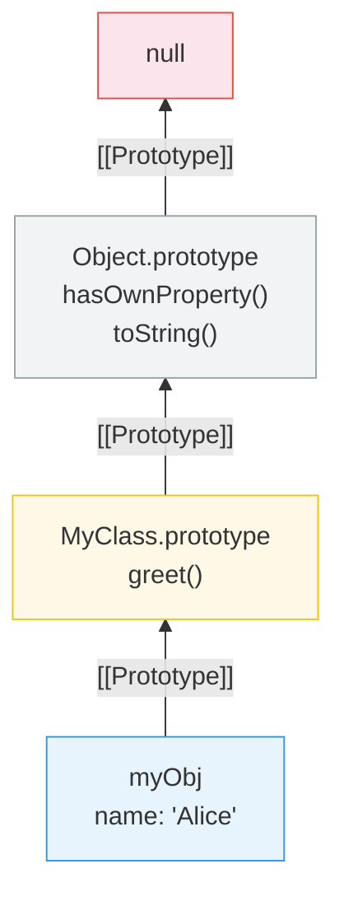

# [FEE-303] 原型與繼承

:::info
每個 JavaScript 物件都有一個隱藏的連結指向另一個物件，稱為其 prototype（原型）；屬性查找會沿著這條連結鏈走訪，直到找到匹配的屬性或到達 `null` 為止。
:::

## 背景

JavaScript 是少數以 prototypal inheritance（原型繼承）而非 classical inheritance（類別繼承）為基礎的主流語言之一。JavaScript 物件透過內部的 `[[Prototype]]` 連結，將屬性存取委派給其他物件，引擎會沿著這條連結鏈查找，直到找到匹配的屬性或抵達 `null` 為止。這個機制支撐了方法呼叫的運作方式、`class` 語法底層的實作，以及 `Array`、`Date` 等內建物件公開 API 的方式。誤解 prototype 會導致意外的屬性遮蔽、失效的 `instanceof` 檢查，以及難以維護的繼承層級。

一個具體案例可以說明這一點為何重要。某個函式庫為原生 `Array` 擴充了一個自訂方法；這個方法在主頁面建立的陣列上可以運作，卻在 iframe 中建立的陣列上找不到，即使兩處的函式庫程式碼完全相同。每個 frame 都執行自己的全域作用域，因此 iframe 擁有自己的 `Array` 建構函式與自己的 `Array.prototype`，與父框架的並不相同。在 iframe 中建立的陣列連結到 iframe 的 `Array.prototype`，而自訂方法卻只被加到父框架的 `Array.prototype` 上，所以該連結鏈上並沒有這個方法。針對父框架 `Array` 的 `instanceof` 檢查也基於同樣的原因失敗：兩個 `Array.prototype` 物件並不是同一個物件。可靠的跨 realm 檢查方式是 `Array.isArray()`（見下方「常見錯誤」），而非 `instanceof`。

## 視覺對比



**`myObj.toString()` 的屬性查找過程：**
1. 檢查 `myObj` 自身屬性——未找到
2. 檢查 `MyClass.prototype`——未找到
3. 檢查 `Object.prototype`——找到，呼叫它

## 範例

**使用 Object.create() 的 prototype 委派：**

```js
const animal = {
  speak() {
    return `${this.name} makes a sound.`;
  },
};

const dog = Object.create(animal);
dog.name = 'Rex';
dog.bark = function () {
  return `${this.name} barks.`;
};

dog.speak(); // "Rex makes a sound." -- 委派給 animal
dog.bark();  // "Rex barks." -- 自身屬性

Object.getPrototypeOf(dog) === animal; // true
```

**使用 class 語法的等效寫法：**

```js
class Animal {
  constructor(name) {
    this.name = name;
  }
  speak() {
    return `${this.name} makes a sound.`;
  }
}

class Dog extends Animal {
  bark() {
    return `${this.name} barks.`;
  }
}

const rex = new Dog('Rex');
rex.speak(); // "Rex makes a sound."
rex.bark();  // "Rex barks."

// 底層存在相同的 prototype chain：
Object.getPrototypeOf(rex) === Dog.prototype;           // true
Object.getPrototypeOf(Dog.prototype) === Animal.prototype; // true
```

**組合替代方案（無繼承）：**

```js
function withSpeaking(obj) {
  obj.speak = function () {
    return `${this.name} makes a sound.`;
  };
  return obj;
}

function withBarking(obj) {
  obj.bark = function () {
    return `${this.name} barks.`;
  };
  return obj;
}

const rex = withBarking(withSpeaking({ name: 'Rex' }));
rex.speak(); // "Rex makes a sound."
rex.bark();  // "Rex barks."

// 不涉及 prototype chain——所有屬性都是自身屬性
```

**instanceof 與 Symbol.hasInstance：**

```js
class Validator {
  static [Symbol.hasInstance](instance) {
    return typeof instance.validate === 'function';
  }
}

const form = { validate() { return true; } };
form instanceof Validator; // true -- 自訂檢查，不需要 prototype 連結
```

**Mixin 模式：無需繼承即可添加能力**

```js
// 將 mixin 定義為普通物件
const Serializable = {
  serialize() {
    return JSON.stringify(this);
  },
  deserialize(json) {
    return Object.assign(Object.create(Object.getPrototypeOf(this)), JSON.parse(json));
  },
};

const Validatable = {
  validate() {
    return Object.keys(this).every(key => this[key] !== null && this[key] !== undefined);
  },
};

// 透過將方法複製到 prototype 來套用 mixin
class User {
  constructor(name, email) {
    this.name = name;
    this.email = email;
  }
}
Object.assign(User.prototype, Serializable, Validatable);

const user = new User('Alice', 'alice@example.com');
user.validate();  // true -- 來自 Validatable mixin
user.serialize(); // '{"name":"Alice","email":"alice@example.com"}' -- 來自 Serializable

// Mixin 避免了深層繼承層級的問題：
// User 不需要繼承 SerializableValidatableBase——它只需要擁有所需的方法
```

## 最佳實踐

**優先使用 `class` 語法，而非手動操作 prototype。** ES2015 的 `class` 語法產生的 prototype chain 與手動設定 `Constructor.prototype` 完全相同，但大幅降低出錯機率。你應該（SHOULD）使用 `class` 與 `extends` 來實作繼承設計。應避免（AVOID）在物件建立後直接賦值給 `Constructor.prototype`，或對該物件呼叫 `Object.setPrototypeOf`。在執行期間變更 `[[Prototype]]` 會破壞 `constructor` 屬性並造成工具誤判。根據 MDN 的說明，這麼做還會打亂引擎已經為該物件的 prototype chain 做的最佳化，迫使引擎降級並重新編譯。應改為在建立物件時就設定好 prototype，透過 `class`/`extends` 或 `Object.create` 完成。

**純字典物件應使用 `Object.create(null)`。** 當你需要一個純粹的 key-value 儲存且不需要任何繼承行為時，應該（SHOULD）使用 `Object.create(null)` 建立。這樣產生的物件沒有 `[[Prototype]]` 連結，不會繼承 `hasOwnProperty`、`toString` 或任何 `Object.prototype` 方法，從而消除 key 與繼承屬性名稱衝突的風險。

**絕對不要在生產程式碼中擴充內建 prototype。** 向 `Array.prototype`、`String.prototype` 或任何其他內建 prototype 新增屬性屬於 monkey patching，你不得（MUST NOT）在生產環境中這樣做。未來版本的語言可能會加入同名但簽名不同的方法，導致你的程式碼悄悄損壞。唯一可接受的例外是在確認方法不存在的情況下進行 polyfill。

**型別檢查應使用 `instanceof` 與 `Object.getPrototypeOf`。** 若要驗證物件是否參與某個 prototype chain，應該（SHOULD）使用 `instanceof`（或對單步檢查使用 `Object.getPrototypeOf(obj) === SomeClass.prototype`）。應避免（AVOID）在實際想驗證結構身份時改用 duck-typing 屬性存在檢查：屬性存在檢查只能確認介面存在，若要驗證繼承關係，則需要實際走訪 prototype chain。

**保持 prototype chain 淺層化。** 屬性查找在實例上未命中時，會遍歷鏈上的每一個連結，直到找到匹配的屬性或抵達 `null` 為止，因此未命中的成本會隨鏈的長度增加。當目標是共享行為而非表達真正的 is-a 關係時，應該（SHOULD）優先採用組合（透過純函式或物件展開混入能力），而非堆疊多層 `extends`。

## 設計思維

**為什麼選擇原型而非類別？** 當 Brendan Eich 在 1995 年設計 JavaScript 時，他大量借鑒了 Self 程式語言（1986），該語言開創了基於 prototype 的物件系統。Self 證明了物件導向程式設計不需要 class：物件可以直接將行為委派給其他物件。這種「委派而非複製」的模型在概念上很簡單。建立一個物件，將它連結到另一個物件，第一個物件上找不到的任何屬性就會在第二個物件上查找。不存在獨立的「class」實體；物件是唯一的抽象。這使得 JavaScript 輕量且靈活，適合其作為 web 腳本語言的原始角色。

ES2015 引入的 `class` 關鍵字並沒有改變這個基本模型。它是在幕後建立 prototype chain 的語法糖。`class Foo extends Bar` 語句建立的 `Foo.prototype`，其 `[[Prototype]]` 指向 `Bar.prototype`，與手動建立 prototype 連結完全相同。`class` 從外部來看可能顯得像是 classical inheritance。引擎依然從未把屬性從父物件複製到子物件；每一次在實例上未命中的查找，都是對 `class` 所建立連結的即時走訪。

**框架如何處理元件層級：**

- **React** 最初使用繼承 `React.Component` 的 class component，依賴 prototype inheritance 取得生命週期方法。如今 function component 與 Hooks 已是新程式碼的建議預設寫法，程式碼重用透過組合（custom Hooks）而非 `extends` 達成。Class component 仍然完全受支援，且在既有的 React 程式碼庫中依然十分普遍；這個轉變是預設寫法的更動，而不是移除 class component。

- **Vue** 走過類似的路。Options API 使用 mixin 進行程式碼共享，卻遭遇名稱衝突與隱式依賴的問題，這類問題是繼承式模式的典型困擾。Composition API 引入 composable 函式作為 mixin 的替代方案，偏好顯式組合，且兩種 API 目前並存、皆受支援。

- **Web Components** 是明顯的例外：自訂元素 _必須_ 繼承 `HTMLElement`（或其子類別）。這是真正的 prototype inheritance。`class MyButton extends HTMLElement` 建立了一條 prototype chain，將 `MyButton.prototype` 依序連結到 `HTMLElement.prototype`、`Element.prototype`、`Node.prototype`、`EventTarget.prototype`、`Object.prototype`，最終到 `null`。自訂元素本身的方法會與繼承自 `HTMLElement.prototype` 的方法並存，因此漏掉 `super()` 呼叫或用錯基底類別，都會導致元素無法從單純的標籤升級為可運作的元件。

## 深入探討

**Prototype chain 查找機制。** 當你讀取一個屬性時，引擎首先檢查實例本身是否擁有該屬性作為自身屬性（own property）。若無，引擎沿著 `[[Prototype]]` 連結前往鏈上的下一個物件並重複檢查。這個過程會依序經過實例本身、它的 prototype、該 prototype 的 prototype，一路向上直到 `Object.prototype` 與 `null`，直到找到匹配的屬性，或遍歷整條鏈後返回 `undefined`。MDN 指出「嘗試存取不存在的屬性時，一定會遍歷整條 prototype chain」，因此 cache miss 的成本與鏈的深度成正比。

**屬性遮蔽（Property Shadowing）。** 只要 prototype chain 上沒有任何東西攔截這次寫入，直接在實例上設定屬性就不會修改鏈上任何物件。在常見情況下，引擎會在實例本身建立一個新的自身屬性，「遮蔽」prototype 上的同名屬性，之後對實例的讀取就會解析到這個自身屬性，而不會到達 prototype。有兩種情況會打破這個預設行為。若鏈上某個 prototype 為該鍵定義了 accessor（setter），賦值會呼叫這個繼承來的 setter，而不是建立自身屬性。若某個 prototype 為該鍵定義了不可寫入的資料屬性，賦值會被阻擋（在 sloppy mode 下靜默忽略，在 strict mode 下拋出 `TypeError`）。若要判斷某個屬性是自身屬性還是繼承屬性，可使用 `Object.hasOwn(obj, key)`（現代寫法）或 `obj.hasOwnProperty(key)`（舊式寫法）。

**Prototype 污染（Prototype Pollution）。** 由於 `Object.prototype` 位於每個普通物件 prototype chain 的頂端，任何寫入其中的屬性都會對執行環境中的所有物件可見。原生的 `JSON.parse` 本身並不會造成這種風險。根據 ECMAScript 規格，`JSON.parse` 一直都是透過 `[[DefineOwnProperty]]`（而非會觸發 prototype setter 的 `[[Set]]`）將解析出的鍵值安裝為自身資料屬性，這是自 ES5（2009 年）以來各主流引擎共同遵循的規格行為。因此 `JSON.parse('{"__proto__":{"isAdmin":true}}')` 產生的結果物件上會有一個自身的 `__proto__` 屬性，完全不會觸及 `Object.prototype`。

真正的風險在於：程式碼把解析後的 JSON（或任何外部物件）的鍵值，透過類似 `obj[key] = value` 的純賦值方式複製過去，這種寫法最常見於手寫的遞迴合併函式中。若 `key` 是 `"__proto__"`，這樣的賦值確實會觸發 `[[Prototype]]` 的 setter，並可能將屬性注入 `Object.prototype`。非原生的解析器則會直接帶有同樣的風險：JSON5 的 `parse()` 在修補之前，就曾因 `__proto__` 鍵值而存在 prototype 污染漏洞（CVE-2022-46175）。像 `{"__proto__": {"isAdmin": true}}` 這樣的 payload，經由這類合併函式處理後，可能讓之後每一次 `obj.isAdmin` 的檢查都回傳 `true`。防禦措施包括：在賦值前驗證 `key` 不是 `"__proto__"`、`"constructor"` 或 `"prototype"`；對任何接受外部提供鍵值的結構改用 `Map` 而非純物件；對累加物件使用 `Object.create(null)`；用 `Object.freeze(Object.prototype)` 直接凍結 `Object.prototype` 本身；以及在 Node.js 中以 `--disable-proto=delete` 旗標執行，徹底移除 `__proto__` 這個 accessor。

```js
// 有漏洞：簡單的遞迴合併
function merge(target, source) {
  for (const key of Object.keys(source)) {
    if (typeof source[key] === 'object') {
      merge(target[key], source[key]); // 此處可能發生 __proto__ 賦值
    } else {
      target[key] = source[key];
    }
  }
}

// 安全：鍵值白名單檢查
function safeMerge(target, source) {
  for (const key of Object.keys(source)) {
    if (key === '__proto__' || key === 'constructor' || key === 'prototype') {
      continue; // 跳過可污染 prototype 的鍵值
    }
    if (typeof source[key] === 'object' && source[key] !== null) {
      target[key] ??= {};
      safeMerge(target[key], source[key]);
    } else {
      target[key] = source[key];
    }
  }
}

// 最安全：使用 Object.create(null) 作為累加物件
const config = Object.create(null);
config.theme = 'dark'; // 沒有 prototype 可供污染
```

**V8 隱藏類別（Hidden Classes）與行內快取（Inline Caches）。** JavaScript 引擎不會在熱路徑上的每次屬性存取都進行完整的 prototype chain 遍歷，因為那會極為緩慢。取而代之，V8 會編譯最佳化的機器碼，假設共享相同「形狀」（以相同順序擁有相同自身屬性集合）的物件也共享相同的隱藏類別。隱藏類別記錄每個屬性的位元組偏移量，讓屬性存取不需要雜湊查詢即可達到 O(1)。當引擎首次遇到 `obj.x` 時，會生成一個行內快取，也就是一小段機器碼，用來檢查 `obj` 的隱藏類別，若匹配則直接從快取的偏移量讀取 `x`。

引擎會依照某個存取點曾經見過多少種不同的隱藏類別來分類。單態（monomorphic）存取點只見過一種隱藏類別，速度最快，因為引擎只需保留單一快取偏移量。多態（polymorphic）存取點見過少數幾種不同的形狀，引擎會維護一份簡短的形狀對偏移量對照表。超多態（megamorphic）存取點見過太多不同的形狀，繼續追蹤已不再划算，引擎便退回通用的屬性查找。實務上的意涵是：當物件在建構函式中一次初始化所有屬性，且之後不再動態新增或刪除屬性時，效能最佳，因為每一次這樣的變動都會觸發隱藏類別轉換。起始狀態相同、但以不同順序新增屬性的物件，最終會得到不同的隱藏類別；同時見過這兩種形狀的存取點會變成多態，若持續遇到更多新形狀，則會進一步退化為超多態。

```js
// 慢：儘管最終狀態相同，卻產生兩個不同的隱藏類別
const a = {};
a.x = 1;
a.y = 2; // 隱藏類別：{ x, y }（以此順序）

const b = {};
b.y = 2;
b.x = 1; // 隱藏類別：{ y, x } -- 順序不同，類別不同

// 快：在建構函式中以一致的順序初始化所有屬性
class Point {
  constructor(x, y) {
    this.x = x; // 屬性順序在建構時確定
    this.y = y;
  }
}
const p1 = new Point(1, 2); // 與所有其他 Point 共享同一隱藏類別
const p2 = new Point(3, 4); // 與 p1 共享行內快取
```

**Object.freeze 與 prototype chain。** `Object.freeze(obj)` 使 `obj` 的自身屬性變為不可寫入且不可設定，並阻止新增屬性，但不會凍結 prototype：prototype chain 上任何可變的屬性仍然可達且可寫入。若目標是真正不可變的值，需要凍結整條鏈。呼叫 `Object.freeze(obj)` 與 `Object.freeze(Object.getPrototypeOf(obj))`，或搭配凍結過的初始化物件使用 `Object.create(null)`。

```js
const base = { shared: 'value' };
const obj = Object.create(base);
Object.freeze(obj);

obj.newProp = 'test';    // 靜默忽略（嚴格模式下會拋出錯誤）
base.shared = 'mutated'; // 成功 -- base 並未被凍結

// 若要凍結整條鏈：
Object.freeze(base);
Object.freeze(obj);
// 現在自身屬性與繼承屬性都已鎖定
```

## 常見錯誤

**混淆 `.prototype` 與 `[[Prototype]]`。** `.prototype` 屬性僅存在於函式上，是使用 `new` 建立的實例的 `[[Prototype]]` 來源。`[[Prototype]]` 內部插槽存在於每個物件上，是引擎在屬性查找時遵循的路徑。`Object.getPrototypeOf(obj)` 讀取 `[[Prototype]]`；`Constructor.prototype` 只是函式上的普通屬性。

**深層繼承層級變得脆弱。** 像 `SpecialButton -> Button -> Component -> BaseComponent -> EventEmitter` 這樣的鏈建立了緊密耦合。對任何中間 prototype 的更改都可能以意想不到的方式破壞後代。偏好組合：透過 mixin 或輔助函式給物件所需的能力，而非堆疊繼承層級。

**在衍生類別建構函式中忘記 `super()`。** 在 `extends` 另一個 class 的 `class` 中，建構函式必須在存取 `this` 之前呼叫 `super()`。省略它會拋出 `ReferenceError`。這是因為基底類別負責建立 `this` 物件；衍生建構函式只在 `super()` 完成後才接收到它。

**`instanceof` 在跨 realm 時失效。** 每個 iframe 或 realm 都有自己的全域作用域，包括自己的 `Array`、`Object` 等。在 iframe 中建立的陣列不是父框架 `Array` 的 `instanceof`，因為 prototype chain 指向不同的 `Array.prototype` 物件。改用 `Array.isArray()`，它使用規格層級的 `[[IsArray]]` 檢查，可跨 realm 運作。

## 延伸閱讀

- [FEE-300](300.md) JavaScript Core & Runtime Overview
- [FEE-301](301.md) Event Loop & Async Model
- [FEE-302](302.md) Closures & Scope Chain
- [FEE-500](../Component Architecture and Design Patterns/500.md) Component Architecture Overview

## 參考資料

- [ECMA-262: Ordinary Object Internal Methods and Internal Slots](https://tc39.es/ecma262/multipage/ordinary-and-exotic-objects-behaviours.html)
- [MDN: Inheritance and the prototype chain](https://developer.mozilla.org/en-US/docs/Web/JavaScript/Guide/Inheritance_and_the_prototype_chain)
- [MDN: Object.create()](https://developer.mozilla.org/en-US/docs/Web/JavaScript/Reference/Global_Objects/Object/create)
- [Kyle Simpson: You Don't Know JS -- this & Object Prototypes](https://github.com/getify/You-Dont-Know-JS/tree/1st-ed/this%20%26%20object%20prototypes)
- [Axel Rauschmayer: Exploring JavaScript -- Classes](https://exploringjs.com/js/book/ch_classes.html)
- [Axel Rauschmayer: Exploring JavaScript -- Objects](https://exploringjs.com/js/book/ch_objects.html)
- [Vyacheslav Egorov (V8 team): What's up with monomorphism](https://mrale.ph/blog/2015/01/11/whats-up-with-monomorphism.html)
- [OWASP: Prototype Pollution Prevention Cheat Sheet](https://cheatsheetseries.owasp.org/cheatsheets/Prototype_Pollution_Prevention_Cheat_Sheet.html)
- [snyk: Prototype Pollution](https://security.snyk.io/vuln/SNYK-JS-LODASH-450202)
- [MDN: Object.freeze()](https://developer.mozilla.org/en-US/docs/Web/JavaScript/Reference/Global_Objects/Object/freeze)
