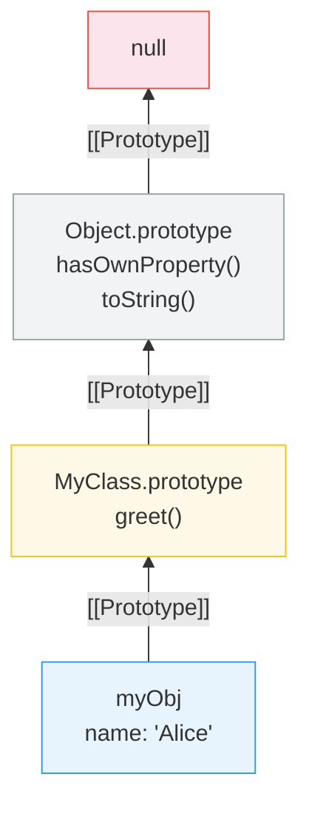

# [FEE-303] Prototypes & Inheritance

:::info
每個 JavaScript 物件都有一個隱藏的連結指向另一個物件，稱為其 prototype（原型）；屬性查找會沿著這條連結鏈走訪，直到找到匹配的屬性或到達 `null` 為止。
:::

## 背景

JavaScript 是少數以 prototypal inheritance（原型繼承）而非 classical inheritance（類別繼承）為基礎的主流語言之一。JavaScript 物件不是從類別藍圖複製而來，而是透過內部的 `[[Prototype]]` 連結將屬性存取委派給其他物件。這個機制支撐了語言中幾乎所有的運作方式——從方法呼叫的運作方式，到 `class` 語法底層的實作，再到 `Array` 和 `Date` 等內建物件如何暴露其 API。誤解 prototype 會導致意外的屬性遮蔽、損壞的 `instanceof` 檢查，以及難以維護的繼承層級。扎實理解 prototype chain（原型鏈）對於除錯、效能調校，以及在任何 JavaScript 程式碼庫中做出明智的架構決策都是不可或缺的。

## 使用情境

你在使用一個擴展原生 Array 自訂方法的函式庫，卻發現在 iframe 中建立的陣列上找不到其中一個方法——明明程式碼完全相同。問題出在不同 frame 的陣列擁有不同的原型鏈。JavaScript 的原型繼承意味著每個物件的行為由它所委派的物件鏈決定，而非方法的複本。理解這個模型，有助於你除錯跨 frame 的問題、看穿 `instanceof` 可能誤導你的情境，並在設計物件間共享行為時做出有意識的選擇。

## 設計思維

**為什麼選擇原型而非類別？** 當 Brendan Eich 在 1995 年設計 JavaScript 時，他大量借鑒了 Self 程式語言（1986），該語言開創了基於 prototype 的物件系統。Self 證明了不需要 class 就能實現物件導向程式設計——物件可以直接將行為委派給其他物件。這種「委派而非複製」的模型在概念上更簡單：建立一個物件，將它連結到另一個物件，第一個物件上找不到的任何屬性就會在第二個物件上查找。不存在獨立的「class」實體；物件是唯一的抽象。這使得 JavaScript 輕量且靈活，適合其作為 web 腳本語言的原始角色。

ES2015 引入的 `class` 關鍵字並沒有改變這個基本模型。它是在幕後建立 prototype chain 的語法糖。`class Foo extends Bar` 語句建立的 `Foo.prototype` 其 `[[Prototype]]` 指向 `Bar.prototype`，與手動建立 prototype 連結完全相同。理解這一點至關重要，因為 `class` 可能會造成 classical inheritance 的假象——但 JavaScript 從不從父物件複製屬性到子物件。它只建立連結。

**框架如何處理元件層級：**

- **React** 最初使用繼承 `React.Component` 的 class component，依賴 prototype inheritance 來取得生命週期方法。轉向 function component 和 Hooks 完全消除了繼承——元件是純函式，程式碼重用來自 composition（組合，即 custom Hooks）而非 `extends`。這反映了更廣泛的業界趨勢：偏好組合而非繼承。

- **Vue** 遵循了類似的軌跡。Options API 使用 mixin 進行程式碼共享，但遭受了名稱衝突和隱式依賴的問題——這些是類似繼承模式的經典問題。Composition API 用 composable 函式取代了 mixin，再次偏好顯式的組合。

- **Web Components** 是明顯的例外：自訂元素 _必須_ 繼承 `HTMLElement`（或其子類別）。這是真正的 prototype inheritance——`class MyButton extends HTMLElement` 建立了一條 prototype chain，將 `MyButton.prototype` 連結到 `HTMLElement.prototype`、`Element.prototype`、`Node.prototype`、`EventTarget.prototype`、`Object.prototype`，最終到 `null`。使用 Web Components 時，理解 prototype chain 不是可選的。

## 最佳實踐

**優先使用 `class` 語法，而非手動操作 prototype。** ES2015 的 `class` 語法產生的 prototype chain 與手動設定 `Constructor.prototype` 完全相同，但大幅降低出錯機率。你應該（SHOULD）使用 `class` 與 `extends` 來實作繼承設計；應避免（AVOID）在事後直接賦值給 `Constructor.prototype` 或對 prototype 物件呼叫 `Object.setPrototypeOf`，因為這樣會破壞 `constructor` 屬性並造成工具誤判。

**純字典物件應使用 `Object.create(null)`。** 當你需要一個純粹的 key-value 儲存且不需要任何繼承行為時，應該（SHOULD）使用 `Object.create(null)` 建立。這樣產生的物件沒有 `[[Prototype]]` 連結，不會繼承 `hasOwnProperty`、`toString` 或任何 `Object.prototype` 方法，從而消除 key 與繼承屬性名稱衝突的風險。

**絕對不要在生產程式碼中擴充內建 prototype。** 向 `Array.prototype`、`String.prototype` 或任何其他內建 prototype 新增屬性屬於 monkey patching，你不得（MUST NOT）在生產環境中這樣做。未來版本的語言可能會加入同名但簽名不同的方法，導致你的程式碼悄悄損壞。唯一可接受的例外是在確認方法不存在的情況下進行 polyfill。

**型別檢查應使用 `instanceof` 與 `Object.getPrototypeOf`，而非隨意的屬性探測。** 若要驗證物件是否參與某個 prototype chain，應該（SHOULD）使用 `instanceof`（或對單步檢查使用 `Object.getPrototypeOf(obj) === SomeClass.prototype`）。應避免（AVOID）在實際想驗證結構身份時改用 duck-typing 屬性存在檢查，因為這混淆了介面合規性與繼承關係。

**保持 prototype chain 的深度合理。** 引擎在每次屬性存取未命中實例時都會遍歷鏈上的每個連結。在效能敏感的程式碼中，應該（SHOULD）將繼承深度限制在三至四層以內；當組合（透過純函式或物件展開混入能力）能達到同樣效果時，應避免（AVOID）堆疊過多層 `extends`。

## 圖解



**`myObj.toString()` 的屬性查找過程：**
1. 檢查 `myObj` 自身屬性——未找到
2. 檢查 `MyClass.prototype`——未找到
3. 檢查 `Object.prototype`——找到，呼叫它

## 範例

**使用 Object.create() 的 prototype 委派：**

```js
const animal = {
  speak() {
    return `${this.name} makes a sound.`;
  },
};

const dog = Object.create(animal);
dog.name = 'Rex';
dog.bark = function () {
  return `${this.name} barks.`;
};

dog.speak(); // "Rex makes a sound." -- 委派給 animal
dog.bark();  // "Rex barks." -- 自身屬性

Object.getPrototypeOf(dog) === animal; // true
```

**使用 class 語法的等效寫法：**

```js
class Animal {
  constructor(name) {
    this.name = name;
  }
  speak() {
    return `${this.name} makes a sound.`;
  }
}

class Dog extends Animal {
  bark() {
    return `${this.name} barks.`;
  }
}

const rex = new Dog('Rex');
rex.speak(); // "Rex makes a sound."
rex.bark();  // "Rex barks."

// 底層存在相同的 prototype chain：
Object.getPrototypeOf(rex) === Dog.prototype;           // true
Object.getPrototypeOf(Dog.prototype) === Animal.prototype; // true
```

**組合替代方案（無繼承）：**

```js
function withSpeaking(obj) {
  obj.speak = function () {
    return `${this.name} makes a sound.`;
  };
  return obj;
}

function withBarking(obj) {
  obj.bark = function () {
    return `${this.name} barks.`;
  };
  return obj;
}

const rex = withBarking(withSpeaking({ name: 'Rex' }));
rex.speak(); // "Rex makes a sound."
rex.bark();  // "Rex barks."

// 不涉及 prototype chain——所有屬性都是自身屬性
```

**instanceof 與 Symbol.hasInstance：**

```js
class Validator {
  static [Symbol.hasInstance](instance) {
    return typeof instance.validate === 'function';
  }
}

const form = { validate() { return true; } };
form instanceof Validator; // true -- 自訂檢查，不需要 prototype 連結
```

## 深入探討

**Prototype chain 查找機制。** 當你讀取一個屬性時，引擎首先檢查實例本身是否擁有該屬性作為自身屬性（own property）。若無，引擎沿著 `[[Prototype]]` 連結前往鏈上的下一個物件並重複檢查。這個過程持續進行——實例 → prototype → prototype 的 prototype → `Object.prototype` → `null`——直到找到匹配的屬性，或遍歷完整條鏈並返回 `undefined`。MDN 指出「嘗試存取不存在的屬性時，一定會遍歷整條 prototype chain」，因此 cache miss 的成本與鏈的深度成正比。

**屬性遮蔽（Property Shadowing）。** 直接在實例上設定屬性，不會修改 prototype chain 中的任何物件。引擎會在實例本身建立一個新的自身屬性，這個屬性「遮蔽」了 prototype 上的同名屬性。之後對實例的讀取會解析到自身屬性，而不會到達 prototype。若要判斷某個屬性是自身屬性還是繼承屬性，應使用 `Object.hasOwn(obj, key)`（現代寫法）或 `obj.hasOwnProperty(key)`（舊式寫法）。

## 常見錯誤

**混淆 `.prototype` 與 `[[Prototype]]`。** `.prototype` 屬性僅存在於函式上，是使用 `new` 建立的實例的 `[[Prototype]]` 來源。`[[Prototype]]` 內部插槽存在於每個物件上，是引擎在屬性查找時遵循的路徑。`Object.getPrototypeOf(obj)` 讀取 `[[Prototype]]`；`Constructor.prototype` 只是函式上的普通屬性。

**深層繼承層級變得脆弱。** 像 `SpecialButton -> Button -> Component -> BaseComponent -> EventEmitter` 這樣的鏈建立了緊密耦合。對任何中間 prototype 的更改都可能以意想不到的方式破壞後代。偏好組合：透過 mixin 或輔助函式給物件所需的能力，而非堆疊繼承層級。

**在衍生類別建構函式中忘記 `super()`。** 在 `extends` 另一個 class 的 `class` 中，建構函式必須在存取 `this` 之前呼叫 `super()`。省略它會拋出 `ReferenceError`。這是因為基底類別負責建立 `this` 物件；衍生建構函式只在 `super()` 完成後才接收到它。

**`instanceof` 在跨 realm 時失效。** 每個 iframe 或 realm 都有自己的全域作用域，包括自己的 `Array`、`Object` 等。在 iframe 中建立的陣列不是父框架 `Array` 的 `instanceof`，因為 prototype chain 指向不同的 `Array.prototype` 物件。改用 `Array.isArray()`，它使用規格層級的 `[[IsArray]]` 檢查，可跨 realm 運作。

## 相關 FEE

- [FEE-300](300.md) JavaScript Core & Runtime Overview
- [FEE-301](301.md) Event Loop & Async Model
- [FEE-302](302.md) Closures & Scope Chain
- [FEE-500](../Component Architecture and Design Patterns/500.md) Component Architecture Overview

## 參考資料

- [ECMA-262: Ordinary Object Internal Methods and Internal Slots](https://tc39.es/ecma262/multipage/ordinary-and-exotic-objects-behaviours.html)
- [MDN: Inheritance and the prototype chain](https://developer.mozilla.org/en-US/docs/Web/JavaScript/Guide/Inheritance_and_the_prototype_chain)
- [MDN: Object.create()](https://developer.mozilla.org/en-US/docs/Web/JavaScript/Reference/Global_Objects/Object/create)
- [Kyle Simpson: You Don't Know JS -- this & Object Prototypes](https://github.com/getify/You-Dont-Know-JS/tree/1st-ed/this%20%26%20object%20prototypes)
- [Axel Rauschmayer: Exploring JavaScript -- Classes](https://exploringjs.com/js/book/ch_classes.html)
- [Axel Rauschmayer: Exploring JavaScript -- Objects](https://exploringjs.com/js/book/ch_objects.html)
