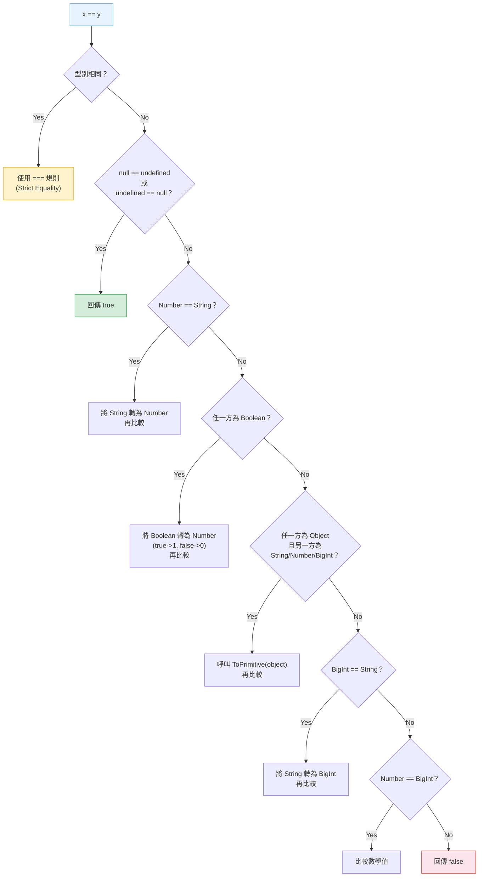

# [FEE-304] Type Coercion & Equality

:::info
JavaScript 在許多情境下會靜默地在型別之間轉換值；理解強制轉換何時以及如何發生，對於撰寫可預測的相等性檢查和避免微妙的 bug 至關重要。
:::

## 背景

JavaScript 是一種動態型別語言，具有普遍的隱式型別轉換 -- 規格稱之為 "type coercion"（型別強制轉換）。當你寫 `"5" - 2` 時，JavaScript 會靜默地將 `"5"` 轉換為數字 `5` 並回傳 `3`。當你寫 `"5" + 2` 時，它會將 `2` 轉換為 `"2"` 並回傳 `"52"`。這兩種行為遵循不同的規則，這種不一致性是眾所周知的 bug 來源。

語言提供了三種具有不同強制轉換行為的相等運算子：

- **`==`（Abstract Equality，抽象相等）** -- 比較前將運算元轉換為相同型別
- **`===`（Strict Equality，嚴格相等）** -- 不進行型別轉換；不同型別永遠不相等
- **`Object.is()`** -- 類似 `===` 但能正確區分 `-0` 和 `+0`，且 `NaN` 等於自身

除了相等性之外，coercion 還影響控制流程（`if`、`while`、`&&`、`||`、`??`）、算術運算子、template literal 和屬性存取。精通這些規則不是要背誦轉換對照表 -- 而是理解規格定義的 abstract operation（抽象操作），並知道哪些模式可以安全地依賴。

## 使用情境

一個表單驗證函式使用 `==` 判斷欄位值是否等於零，結果空字串也通過了驗證。另一處程式碼用 `+` 把數字與字串相接，原本預期是 `3`，結果卻得到 `"12"`。這兩種行為一旦理解了 JavaScript 的強制轉換規則就完全可以預測，但單靠肉眼審視程式碼幾乎找不出問題所在。知道語言在哪些時機會進行型別強制轉換，以及 `==` 與 `===` 的本質差異，才能寫出行為符合預期的比較邏輯。

## 設計思維

### 為什麼 JS 有隱式強制轉換

當 Brendan Eich 在 1995 年 5 月的 10 天內創造 JavaScript 時，他受到兩種截然不同的語言影響：Java（語法）和 Scheme（一級函式）。這門語言被設計為讓非程式設計師也能在網頁中撰寫小型腳本。隱式 coercion 是 "be liberal in what you accept"（接受輸入時要寬容）哲學的一部分 -- 如果使用者在預期數字的地方傳入字串，嘗試讓它能運作，而不是拋出錯誤。

這個設計選擇對於嵌入 HTML 的短腳本是合理的。但在規模化時它會成為負擔。當程式碼庫增長到數千個檔案、由數十位工程師維護時，隱式轉換會成為看不見的 bug 來源。一個因為 `"5" * 1` 靜默產生 `5` 而「正常運作」的函式，在收到 `"five"` 時會靜默產生 `NaN`，然後在計算中傳播而不拋出錯誤。

### 隱式強制轉換在規模化的代價

大型 JavaScript 程式碼庫普遍採用 strict equality 作為預設：

- **ESLint `eqeqeq` 規則** -- 強制使用 `===`，可選地允許 `"allow-null"` 例外
- **TypeScript `strict` 模式** -- 透過型別窄化在編譯時期捕捉許多 coercion bug
- **Code review 文化** -- 團隊在 pull request 中拒絕 `==`，除非是 `== null` 慣用語法

業界共識很明確：對於正式程式碼，顯式優於隱式。

### TypeScript 與編譯時期型別安全

TypeScript 在型別層級處理 coercion：

- **`strictNullChecks`** -- 防止 `null` 和 `undefined` 被賦值給非可空型別，消除最常見的 `== null` 檢查需求
- **型別窄化（type narrowing）** -- `typeof`、`instanceof` 和控制流程分析讓 TypeScript 透過分支追蹤變數的精確型別，使 coercion 變得不必要
- **Discriminated unions（可辨識聯合型別）** -- 帶有字面值 `type` 欄位的 tagged union 能實現窮舉的 `switch` 語句，完全不需要 coercion

```ts
type Result =
  | { status: "ok"; data: string }
  | { status: "error"; message: string };

function handle(r: Result) {
  switch (r.status) {
    case "ok":    return r.data;     // 窄化為 { status: "ok", data: string }
    case "error": return r.message;  // 窄化為 { status: "error", message: string }
  }
}
```

### 框架型別安全

框架從執行時期驗證演進到編譯時期驗證：

- **React PropTypes**（執行時期） -- 在開發模式下於執行時期驗證 props，記錄 console 警告。在正式建置中沒有保護。已大幅被 TypeScript 泛型取代，例如 `React.FC<Props>` 和 `React.ComponentProps<typeof Component>`。
- **Vue `defineProps<T>()`**（編譯時期） -- 使用 TypeScript 泛型，由 Vue 編譯器處理並自動產生執行時期驗證程式碼。開發者撰寫型別；框架負責 coercion-safe 的驗證。

趨勢很明確：將型別檢查移到編譯時期，從源頭消除隱式 coercion。

## 最佳實踐

### BP1 -- 預設永遠使用 `===`

MDN 指出：「Strict equality 幾乎永遠是正確的比較運算。」除非有特定理由，否則所有相等性檢查都應使用 `===`。可透過 ESLint 的 `eqeqeq` 規則自動強制執行。唯一可接受的例外是 `== null` 慣用語法，它可以用一個比較同時檢查 `null` 和 `undefined`。

### BP2 -- 型別轉換請明確標示

需要轉換型別時，使用 `Number()`、`String()`、`Boolean()` 進行明確轉換，而不是依賴隱式 coercion。明確轉換讓意圖對閱讀者一目瞭然，並防止 coercion 規則靜默地產生意外結果。應該避免依賴 coercion 規則的脆弱模式，例如一元 `+`、空字串串接或雙重否定。

### BP3 -- 使用 `Number.isNaN()`，而非 `isNaN()`

全域的 `isNaN()` 在測試前會先將參數強制轉換為數字，因此產生誤導性的結果。`Number.isNaN()` 不進行強制轉換：只有當參數的型別是 Number 且值為 `NaN` 時才回傳 `true`。MUST 使用 `Number.isNaN()` 以進行精確的 NaN 偵測。

**應該（SHOULD）在 `-0` 或 `NaN` 語意重要時使用 `Object.is()`。** 在數值演算法、Map 鍵比較，或 SameValue 比較（如 `Array.prototype.includes`）中，`Object.is()` 提供 `===` 無法給出的數學上正確答案：`Object.is(NaN, NaN)` 為 `true`，`Object.is(-0, +0)` 為 `false`。凡在區分負零與正零，或在不進行型別強制轉換的情況下可靠偵測 `NaN` 是正確性需求而非風格偏好的場合，請使用 `Object.is()`。

## 圖解

以下流程圖描述了 ECMA-262 定義的 Abstract Equality Comparison 演算法（`==`，即 IsLooselyEqual）：



**關鍵洞察：** 這個演算法是遞迴的。將 Boolean 轉換為 Number 後重新開始比較；對物件呼叫 ToPrimitive 後重新開始。這就是為什麼 `[] == false` 的結果是 `true`：

1. `[] == false` -- 存在 Boolean，轉換：`[] == 0`
2. `[] == 0` -- Object vs Number，ToPrimitive：`"" == 0`
3. `"" == 0` -- String vs Number，轉換：`0 == 0`
4. `0 == 0` -- 相同型別，strict equality：`true`

## 範例

### 8 個 falsy 值

```js
// 這些在布林上下文中都會被評估為 false
Boolean(false);     // false
Boolean(0);         // false
Boolean(-0);        // false
Boolean(0n);        // false (BigInt 零)
Boolean("");        // false (空字串)
Boolean(null);      // false
Boolean(undefined); // false
Boolean(NaN);       // false

// 其他所有值都是 truthy，包括：
Boolean([]);        // true  (空陣列！)
Boolean({});        // true  (空物件！)
Boolean("0");       // true  ("0" 是非空字串)
Boolean("false");   // true  ("false" 是非空字串)
```

### `+` 運算子：字串串接 vs 加法

```js
// 當任一運算元為字串時，+ 進行串接
"5" + 3;          // "53"
3 + "5";          // "35"
"" + 42;          // "42"  (常見的數字轉字串技巧)

// 當兩個運算元都是數字時，+ 進行加法
5 + 3;            // 8

// 物件透過 ToPrimitive 轉換
[] + [];          // ""     (兩者都變成 ""，然後串接)
[] + {};          // "[object Object]"
{} + [];          // 0      (在某些引擎中為區塊語句 + 一元正號)

// 使用顯式轉換以避免意外
Number("5") + 3;  // 8
String(42);        // "42"
```

### Nullish coalescing（`??`）vs 邏輯 OR（`||`）

```js
// || 回傳第一個 truthy 值
0 || "default";        // "default"  (0 是 falsy！)
"" || "default";       // "default"  ("" 是 falsy！)
null || "default";     // "default"

// ?? 回傳第一個非 nullish 的值（非 null、非 undefined）
0 ?? "default";        // 0          (0 不是 nullish)
"" ?? "default";       // ""         ("" 不是 nullish)
null ?? "default";     // "default"
undefined ?? "default" // "default"

// 當 0 或 "" 是有效值時使用 ??
function getPort(config) {
  return config.port ?? 3000;  // port: 0 是有效的，不要覆蓋
}

// 當任何 falsy 值都應觸發預設值時使用 ||
function getLabel(text) {
  return text || "Untitled";   // 空字串應取得預設值
}
```

### Optional chaining（`?.`）與 nullish 值

```js
const user = { address: { street: "123 Main" } };

// 沒有 optional chaining
const zip = user && user.address && user.address.zip; // undefined

// 使用 optional chaining
const zip2 = user?.address?.zip;       // undefined (不會拋出 TypeError)
const missing = null?.foo?.bar;        // undefined

// 與 ?? 搭配使用效果很好
const displayZip = user?.address?.zip ?? "N/A";  // "N/A"
```

### Abstract operation 實際運作

```js
// ToPrimitive：valueOf() 和 toString()
const obj = {
  valueOf()  { return 42; },
  toString() { return "hello"; }
};

obj + 1;          // 43      (ToPrimitive 以 "number" hint 呼叫 valueOf)
`Value: ${obj}`;  // "Value: 42" (template literal 使用 ToPrimitive "default" hint)
String(obj);      // "hello"  (顯式 String() 直接呼叫 toString)

// Symbol.toPrimitive 覆蓋兩者
const custom = {
  [Symbol.toPrimitive](hint) {
    if (hint === "number")  return 10;
    if (hint === "string")  return "ten";
    return true; // default hint
  }
};

+custom;           // 10
`${custom}`;       // "ten"
custom + 0;        // 1  (default hint 回傳 true，然後 true -> 1)
```

### Strict vs loose equality 邊界案例

```js
// == null 慣用語法 -- == 唯一好的用途
null == undefined;    // true
null == null;         // true
undefined == undefined; // true
null == 0;            // false (null 只等於 null 和 undefined)
null == "";           // false
null == false;        // false

// 令人驚訝的 == 結果
"" == false;          // true  ("" -> 0, false -> 0)
"0" == false;         // true  ("0" -> 0, false -> 0)
"" == 0;              // true  ("" -> 0)
" " == 0;             // true  (" " -> 0，空白被去除)
[] == false;          // true  (見上方步驟解析)
[1] == 1;             // true  ([1] -> "1" -> 1)

// Object.is() vs ===
NaN === NaN;          // false
Object.is(NaN, NaN);  // true
-0 === +0;            // true
Object.is(-0, +0);    // false

// 這在哪裡重要：Array includes vs indexOf
[NaN].includes(NaN);  // true  (使用 SameValueZero，類似 Object.is 但 -0 === +0)
[NaN].indexOf(NaN);   // -1    (使用 ===)
```

## 常見錯誤

### 1. 用 truthy 檢查代替非 nullish 檢查

```js
// Bug：0 和 "" 是有效值但屬於 falsy
function setVolume(level) {
  if (!level) {            // 當 level 為 0 時會失敗！
    level = 50;
  }
  audio.volume = level;
}

// 修正：檢查 nullish，而非 falsy
function setVolume(level) {
  level = level ?? 50;     // 0 維持為 0
  audio.volume = level;
}
```

### 2. 用 `+` 串接字串卻想要做加法

```js
// Bug：表單輸入值是字串
const total = price + tax;  // "100" + "7" = "1007"

// 修正：顯式轉換
const total = Number(price) + Number(tax);  // 107
```

### 3. 假設 `typeof null === "object"` 是有意為之

```js
// Bug：typeof null 回傳 "object"
function isObject(value) {
  return typeof value === "object";  // 對 null 也是 true！
}

// 修正：加上 null 檢查
function isObject(value) {
  return value !== null && typeof value === "object";
}
```

這是 1995 年以來眾所周知的規格 bug -- 在原始的 JavaScript 引擎中，值用型別碼標記，而 `null` 的標記是 `0`，與物件相同。這個問題從未被修復，因為太多現有程式碼依賴此行為。

### 4. 在 `-0` 和 `NaN` 比較重要時沒有使用 `Object.is()`

```js
// Bug：=== 無法偵測 NaN 或區分 -0
const cache = new Map();
cache.set(NaN, "not a number");
cache.get(NaN);  // "not a number" -- Map 內部使用 SameValueZero

// 但手動比較會失敗
const values = [NaN, 0, -0, 1];
values.filter(v => v === NaN);   // [] -- 永遠是空的！
values.filter(v => Number.isNaN(v));  // [NaN] -- 正確

// 偵測 -0
function isNegativeZero(x) {
  return Object.is(x, -0);
}
```

## 相關 FEE

- **[FEE-300](/en/JavaScript%20Core%20and%20Runtime/300)** -- JavaScript Core & Runtime 概觀：語言執行時期的全貌
- **[FEE-303](/en/JavaScript%20Core%20and%20Runtime/303)** -- Prototypes & Inheritance：ToPrimitive 在 prototype chain 上呼叫 `valueOf()` 和 `toString()`
- **[FEE-305](/en/JavaScript%20Core%20and%20Runtime/305)** -- Error Handling Patterns：失敗的 coercion 導致的 `TypeError`（例如對 `null` 呼叫方法）

## 參考資料

- [ECMA-262 -- IsLooselyEqual (Abstract Equality Comparison)](https://tc39.es/ecma262/#sec-islooselyequal) -- `==` 演算法的規範性規格
- [ECMA-262 -- IsStrictlyEqual](https://tc39.es/ecma262/#sec-isstrictlyequal) -- `===` 的規範性規格
- [ECMA-262 -- ToPrimitive](https://tc39.es/ecma262/#sec-toprimitive) -- 物件如何被轉換為原始值
- [MDN -- Equality comparisons and sameness](https://developer.mozilla.org/en-US/docs/Web/JavaScript/Guide/Equality_comparisons_and_sameness) -- 比較 `==`、`===`、`Object.is()` 和 SameValueZero 的完整指南
- [MDN -- Type coercion](https://developer.mozilla.org/en-US/docs/Glossary/Type_coercion) -- 清晰定義的詞彙表項目
- [Dr. Axel Rauschmayer -- Type coercion in JavaScript](https://2ality.com/2019/10/type-coercion.html) -- 深入探討 coercion 規則和規格演算法
- [javascript.info -- Type Conversions](https://javascript.info/type-conversions) -- 對初學者友好的三種主要轉換型別解說
- [javascript.info -- Object to primitive conversion](https://javascript.info/object-toprimitive) -- ToPrimitive、hint 和 Symbol.toPrimitive 的詳細介紹
