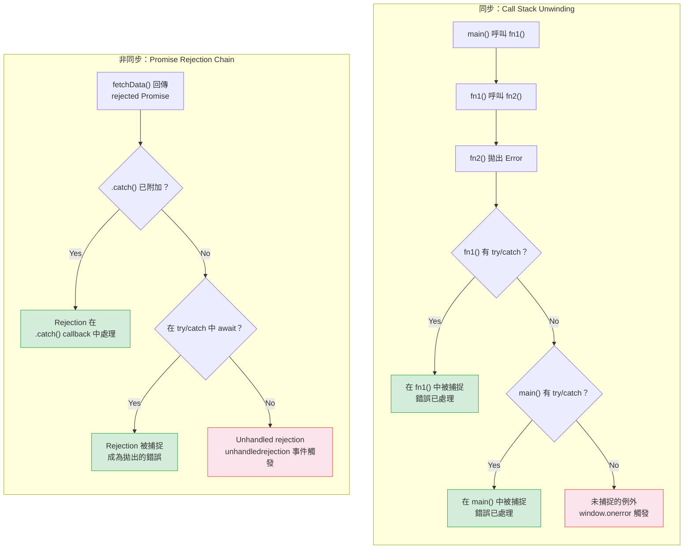

# [FEE-305] Error Handling Patterns

:::info
JavaScript 的錯誤是 unchecked（未檢查）且 untyped（無型別）的 -- 任何值都可以在任何時候被拋出，而且沒有編譯器強制處理。精通錯誤處理意味著理解同步的 call stack unwinding（呼叫堆疊展開）、非同步的 rejection propagation（拒絕傳播），以及框架層級的 boundary pattern（邊界模式），防止你的 UI 變成空白。
:::

## 背景

每個 JavaScript 程式都會遇到錯誤：網路故障、無效的使用者輸入、型別不匹配、超出範圍的值，以及邏輯 bug。不像 Java（使用 `throws` 子句的 checked exception）或 Rust（`Result<T, E>` 型別在編譯時期強制呼叫者處理錯誤），JavaScript 沒有編譯時期的錯誤處理強制機制。任何函式都可以在任何時候拋出任何值，而呼叫者完全可以忽略這個可能性。

這個設計有其後果：

- **靜默失敗會傳播。** click handler 中未處理的例外只會讓該 handler 崩潰 -- 頁面保持互動性但可能處於不一致的狀態。
- **非同步錯誤預設是隱形的。** 沒有 `.catch()` 的 rejected promise 會產生 `unhandledrejection` 事件，而許多開發者從未監聽過這個事件。
- **使用者面對的是崩潰的 UI。** 不像伺服器可以重新啟動 process，瀏覽器分頁中壞掉的 UI 會一直壞到使用者重新整理為止。框架的 error boundary 正是為了解決這個問題而存在。

理解 JavaScript 錯誤處理需要三個層次的知識：語言機制（try/catch、Error 物件、throw）、runtime 行為（event loop、promise rejection tracking、global handler），以及框架模式（error boundary、error handler）來讓應用程式具有韌性。

## 使用情境

一個非同步資料取得函式拋出了錯誤，卻沒有任何地方捕獲它──promise rejection 懸而未處理，錯誤被靜默吞噬，UI 停滯在不確定的載入狀態。在 `await` 外層加上 `try/catch` 也無濟於事，因為它無法捕獲未被 `await` 的巢狀非同步呼叫所產生的拒絕。JavaScript 的錯誤處理模型──同步的 `try/catch`、promise 拒絕鏈，以及 `unhandledrejection`──需要刻意的設計，才能確保每個錯誤入口都被覆蓋到。

## 設計思維

### 為什麼 JS 的錯誤是 unchecked 的

JavaScript 在 1995 年被設計為網頁中的短腳本語言。Brendan Eich 採用了 Java 的 `try/catch/finally` 語法，但刻意省略了 Java 的 `throws` 子句 -- 強制呼叫者處理特定例外型別的宣告。理由很務實：web script 需要是寬容的，而 checked exception 對目標受眾來說太繁瑣了。

這個決定有持久的影響。在 Java 中，編譯器會告訴你「這個方法拋出 IOException -- 處理它或宣告它」。在 Rust 中，`?` 運算子以完整的型別安全性將 `Result` 錯誤沿著 call stack 向上傳播。在 JavaScript 中，沒有任何東西告訴你一個函式可能會拋出例外。你在 runtime、在正式環境、從你的錯誤監控服務中才會發現。

TypeScript 並沒有解決這個問題。雖然 TypeScript 追蹤值的型別，但它不追蹤例外型別。型別系統中沒有 `throws` annotation。像 `neverthrow` 和 `fp-ts` 這樣的函式庫將 Rust 風格的 `Result` 型別帶入 TypeScript，但它們需要整個程式碼庫的配合才能有效。

### 跨框架的 Error Boundary 模式

Error boundary 的核心概念是：捕捉子元件的錯誤、顯示 fallback UI、回報錯誤 -- 而不讓整個應用程式崩潰。

**React**（僅限 class component）：React error boundary 是實作 `static getDerivedStateFromError(error)`（用於渲染 fallback UI）和 `componentDidCatch(error, errorInfo)`（用於記錄錯誤）的 class component。Error boundary 捕捉 rendering、lifecycle method 和下方整棵樹的 constructor 中的錯誤。它們不捕捉 event handler、非同步程式碼、SSR 或 boundary 自身中的錯誤。

```jsx
class ErrorBoundary extends React.Component {
  constructor(props) {
    super(props);
    this.state = { hasError: false };
  }

  static getDerivedStateFromError(error) {
    // 更新 state 讓下次 render 顯示 fallback UI
    return { hasError: true };
  }

  componentDidCatch(error, errorInfo) {
    // 記錄到錯誤回報服務
    reportError(error, errorInfo.componentStack);
  }

  render() {
    if (this.state.hasError) {
      return <h2>Something went wrong.</h2>;
    }
    return this.props.children;
  }
}

// 使用方式：包裝任何子樹
<ErrorBoundary>
  <Dashboard />
</ErrorBoundary>
```

React 沒有內建的 function component 版本 error boundary。`react-error-boundary` 函式庫提供了與 hooks 相容的 `<ErrorBoundary>` wrapper API。

**Vue**：Vue 提供兩種互補的機制。全域的 `app.config.errorHandler` 接收應用程式中任何元件的未捕捉錯誤。`onErrorCaptured` composable（或 `errorCaptured` lifecycle hook）讓父元件攔截子元件的錯誤。如果 `onErrorCaptured` 回傳 `false`，錯誤就停止傳播 -- 這就是你建構 Vue error boundary 的方式。

```js
// 全域 handler（main.js）
app.config.errorHandler = (err, instance, info) => {
  reportError(err, { component: instance, info });
};

// 元件層級 boundary（ErrorBoundary.vue）
const error = ref(null);
onErrorCaptured((err) => {
  error.value = err;
  return false; // 阻止進一步傳播
});
```

**SvelteKit**：SvelteKit 在 `src/hooks.server.js`（和 `src/hooks.client.js`）中使用 `handleError` hook。預期外的錯誤會通過這個 hook，它可以記錄錯誤並回傳經過淨化的錯誤物件。框架刻意對使用者隱藏原始錯誤訊息，以防止資訊洩漏。

### 新興模式

**TC39 Safe Assignment / Try Operator proposal**：受 Go 和 Rust 啟發，這個提案引入 `try` 運算子，將可能拋出錯誤的函式轉換為 `[error, result]` tuple。這個提案仍在 Stage 0，距離標準化還很遠，但它反映了在 JavaScript 中對 Go/Rust 風格顯式錯誤處理的需求日益增長。

```js
// 假設的語法（尚未標準化）
const [error, data] = try await fetchData();
if (error) {
  return handleError(error);
}
```

**Result type 函式庫**：像 `neverthrow`、`ts-results` 和 `oxide.ts` 這樣的函式庫為 TypeScript 提供 `Result<T, E>` 和 `Option<T>` 型別。它們透過 `.match()`、`.map()` 和 `.unwrapOr()` 方法強制呼叫者處理成功和失敗兩種情況，為 TypeScript 程式碼帶來 Rust 風格的安全性。

### 為什麼前端錯誤處理更困難

1. **使用者面對的是崩潰的 UI。** 伺服器錯誤回傳 500 response，然後伺服器繼續處理下一個請求。前端錯誤讓使用者盯著壞掉的頁面，除了重新整理別無他法。
2. **Minified stack trace。** 正式環境的 JavaScript 經過 minify 和 bundle。Stack trace 包含像 `a.b.c` at `chunk-3fa2b.js:1:42398` 這樣晦澀的名稱。需要 source map 才能讓它們有用，而 source map 必須上傳到你的錯誤監控服務。
3. **錯誤序列化是有損的。** `JSON.stringify(new Error('fail'))` 回傳 `"{}"`，因為 `message`、`stack` 和 `cause` 是 non-enumerable property（不可列舉屬性）。你必須明確地提取欄位來進行記錄。
4. **使用者環境的多樣性。** 錯誤可能由瀏覽器擴充功能、廣告攔截器、網路代理或過時的瀏覽器造成 -- 這些因素完全超出你的控制。

## 最佳實踐

**繼承 `Error` 來建立自訂錯誤型別。** MUST 使用 ES2015 class 語法繼承 `Error`，呼叫 `super(message, { cause })` 來設定 `message` 和 `cause` 屬性，並將 `this.name` 指定為與類別名稱相符的字串。這使得自訂錯誤可以用 `instanceof` 識別，並確保它們攜帶錯誤監控工具所期望的完整 prototype chain。

**MUST NOT 用空的 `catch` 區塊吞掉錯誤。** 空的 catch 區塊讓 bug 變得隱形，除錯也變得不可能。如果某個失敗確實可以安全忽略，MUST 留下明確的註解說明原因；否則，至少要重新拋出或用 `console.error()` 記錄。

**使用 `finally` 進行資源清理。** SHOULD 將清理程式碼（關閉連線、釋放鎖、隱藏載入指示器）放在 `finally` 區塊中，而不是在 `try` 和 `catch` 中重複撰寫。`finally` 區塊永遠會執行，即使 `try` 或 `catch` 中發生 `return` 或 `throw`。AVOID 在 `finally` 中回傳值，因為它會靜默地覆蓋前面區塊中的任何 `return` 或 `throw`。

**在應用程式邊界處理 `unhandledrejection`。** MUST 在應用程式啟動時註冊 `window.addEventListener('unhandledrejection', ...)` 作為最後一道安全網。這能捕捉那些漏掉區域 `.catch()` handler 的 promise rejection。在正式環境中，應將這些事件轉發到錯誤監控服務，而不是讓它們靜默地消失在 console 中。

## 圖解

以下圖表比較了同步程式碼（call stack unwinding）與非同步程式碼（promise rejection chain）中錯誤的傳播方式：



**關鍵差異：** 同步錯誤立即展開 call stack -- 每個 frame 都有機會捕捉。非同步錯誤（rejected promise）透過 promise chain 傳播，如果沒有 handler 存在，它們會在 `window`（或 Node.js 的 `process`）上觸發 `unhandledrejection` 事件。

## 範例

### try/catch/finally 機制

```js
function parseConfig(json) {
  try {
    const config = JSON.parse(json);
    return config;
  } catch (err) {
    // err 的作用域僅限於此 catch 區塊
    console.error("Invalid JSON:", err.message);
    return null;
  } finally {
    // 永遠會執行 -- 即使 try 或 catch 已經 return
    console.log("Parse attempt complete");
  }
}

// finally 會覆蓋回傳值（避免這樣做！）
function dangerousFinally() {
  try {
    return 1;
  } finally {
    return 2; // 這個會勝出 -- 回傳值是 2，不是 1
  }
}
```

### 內建錯誤型別

```js
// TypeError：錯誤的型別操作
null.toString();            // TypeError: Cannot read properties of null
(42).toUpperCase();         // TypeError: (42).toUpperCase is not a function

// RangeError：值超出有效範圍
new Array(-1);              // RangeError: Invalid array length
(1.5).toFixed(200);         // RangeError: toFixed() digits argument must be between 0 and 100

// ReferenceError：存取未宣告的變數
console.log(notDeclared);  // ReferenceError: notDeclared is not defined

// SyntaxError：無效的程式碼（通常在解析時期，同一作用域的 try/catch 無法捕捉）
// eval("if (");            // SyntaxError: Unexpected end of input

// URIError：格式錯誤的 URI
decodeURIComponent("%");    // URIError: URI malformed
```

### 自訂錯誤類別

```js
class AppError extends Error {
  constructor(message, { code, statusCode, cause } = {}) {
    super(message, { cause });
    this.name = "AppError";
    this.code = code;
    this.statusCode = statusCode;
  }
}

class ValidationError extends AppError {
  constructor(field, message, options) {
    super(message, { code: "VALIDATION_ERROR", statusCode: 400, ...options });
    this.name = "ValidationError";
    this.field = field;
  }
}

// 搭配 cause chaining 使用
try {
  const data = JSON.parse(rawInput);
} catch (err) {
  throw new ValidationError("config", "Invalid config format", { cause: err });
  // err.cause 包含原始的 SyntaxError
}
```

### 非同步錯誤傳播

```js
// Promise .catch()
fetch("/api/data")
  .then((res) => res.json())
  .catch((err) => {
    console.error("Fetch failed:", err);
    return { fallback: true };
  });

// async/await 搭配 try/catch
async function loadData() {
  try {
    const res = await fetch("/api/data");
    if (!res.ok) throw new Error(`HTTP ${res.status}`);
    return await res.json();
  } catch (err) {
    // 同時捕捉網路錯誤和 HTTP 錯誤
    reportError(err);
    return null;
  }
}

// 重要：async 函式總是回傳 promise
// 在 async 中 throw 會建立 rejected promise，不是同步例外
async function willReject() {
  throw new Error("this becomes a rejected promise");
}
// willReject() 回傳 Promise<rejected> -- 必須用 .catch() 或 await 來捕捉
```

### 全域錯誤處理器

```js
// 捕捉未捕捉的同步錯誤
window.addEventListener("error", (event) => {
  console.error("Uncaught error:", event.error);
  // event.message, event.filename, event.lineno, event.colno
});

// 捕捉未處理的 promise rejection
window.addEventListener("unhandledrejection", (event) => {
  console.error("Unhandled rejection:", event.reason);
  event.preventDefault(); // 防止預設的 console 警告
});

// Node.js 對應版本
process.on("uncaughtException", (err) => {
  console.error("Uncaught:", err);
  process.exit(1); // Process 處於未定義狀態 -- 應該退出
});

process.on("unhandledRejection", (reason) => {
  console.error("Unhandled rejection:", reason);
});
```

### 錯誤序列化

```js
const err = new Error("Something failed");
err.code = "ERR_SOMETHING";

// 問題：JSON.stringify 忽略 non-enumerable 屬性
JSON.stringify(err);
// "{}" -- message、stack、name 是 non-enumerable 的！

// 解決方案：明確地提取欄位
function serializeError(err) {
  return {
    name: err.name,
    message: err.message,
    stack: err.stack,
    code: err.code,
    cause: err.cause ? serializeError(err.cause) : undefined,
  };
}

JSON.stringify(serializeError(err));
// {"name":"Error","message":"Something failed","stack":"Error: Something failed\n    at ...","code":"ERR_SOMETHING"}
```

## 常見錯誤

### 1. 捕捉範圍過廣

```js
// Bug：捕捉所有錯誤，包括程式設計師的失誤
try {
  const result = complexOperation(data);
  updateUI(result);
} catch (err) {
  showErrorMessage("Operation failed"); // 隱藏了 TypeError、ReferenceError 等
}

// 修正：捕捉特定錯誤，讓預期外的錯誤繼續傳播
try {
  const result = complexOperation(data);
  updateUI(result);
} catch (err) {
  if (err instanceof NetworkError) {
    showErrorMessage("Network unavailable. Please retry.");
  } else if (err instanceof ValidationError) {
    showFieldErrors(err.field, err.message);
  } else {
    throw err; // 重新拋出預期外的錯誤 -- 不要隱藏 bug
  }
}
```

### 2. 忘記 async 函式回傳的是 rejected promise

```js
// Bug：這個 try/catch 什麼都捕捉不到
try {
  async function fetchUser() {
    const res = await fetch("/api/user");
    if (!res.ok) throw new Error("Not found");
    return res.json();
  }
  fetchUser(); // 回傳 promise -- throw 變成 rejection，不是同步例外
} catch (err) {
  // 永遠不會到達！
}

// 修正：在 async 上下文中 await 非同步呼叫
async function handleClick() {
  try {
    const user = await fetchUser(); // 現在 rejection 會被捕捉
    renderUser(user);
  } catch (err) {
    showError(err.message);
  }
}
```

### 3. 包裝時不使用 cause 導致遺失錯誤上下文

```js
// Bug：原始錯誤遺失 -- stack trace 指向 wrapper，不是根本原因
try {
  await connectToDatabase();
} catch (err) {
  throw new Error("Database connection failed");
  // 原始的 err（包含連線細節、逾時資訊等）已經消失了
}

// 修正：使用 cause 選項（ES2022+）
try {
  await connectToDatabase();
} catch (err) {
  throw new Error("Database connection failed", { cause: err });
  // err.cause 保留了完整的原始錯誤鏈
}
```

## 相關 FEE

- **[FEE-300](/en/JavaScript%20Core%20and%20Runtime/300)** -- JavaScript Core & Runtime 概觀：決定錯誤如何傳播的執行模型
- **[FEE-301](/en/JavaScript%20Core%20and%20Runtime/301)** -- Event Loop & Task Queues：microtask 錯誤及其傳播行為
- **[FEE-302](/en/JavaScript%20Core%20and%20Runtime/302)** -- Closures & Scope：在 closure 中捕獲的錯誤上下文
- **[FEE-1400](/en/Observability/1400)** -- Observability：正式環境錯誤監控、source map 和結構化 logging

## 參考資料

- [ECMA-262 -- Error Objects](https://tc39.es/ecma262/#sec-error-objects) -- Error constructor、NativeError 型別和 `cause` 屬性的規範性規格
- [ECMA-262 -- The throw Statement](https://tc39.es/ecma262/#sec-throw-statement) -- `throw` 如何建立 abrupt completion 來展開 call stack
- [MDN -- try...catch](https://developer.mozilla.org/en-US/docs/Web/JavaScript/Reference/Statements/try...catch) -- try/catch/finally 機制、作用域和控制流程的完整指南
- [MDN -- Error](https://developer.mozilla.org/en-US/docs/Web/JavaScript/Reference/Global_Objects/Error) -- Error constructor、內建錯誤型別、`cause` 屬性和自訂錯誤模式
- [MDN -- Promise.prototype.catch()](https://developer.mozilla.org/en-US/docs/Web/JavaScript/Reference/Global_Objects/Promise/catch) -- promise rejection 處理
- [MDN -- Window: unhandledrejection event](https://developer.mozilla.org/en-US/docs/Web/API/Window/unhandledrejection_event) -- 未處理 promise rejection 的全域 handler
- [React -- Error Boundaries (Legacy Docs)](https://legacy.reactjs.org/docs/error-boundaries.html) -- componentDidCatch、getDerivedStateFromError，以及 error boundary 能和不能捕捉的錯誤
- [React -- Component Reference](https://react.dev/reference/react/Component) -- 目前 React 文件中 class component error boundary 方法
- [Vue -- Error Handling](https://vuejs.org/error-reference/) -- app.config.errorHandler 和 onErrorCaptured 文件
- [SvelteKit -- Hooks](https://svelte.dev/docs/kit/hooks) -- 伺服器端和客戶端錯誤攔截的 handleError hook
- [TC39 -- Safe Assignment / Try Operator Proposal](https://github.com/arthurfiorette/proposal-try-operator) -- Stage 0 的 Result 風格錯誤處理 JavaScript 提案
