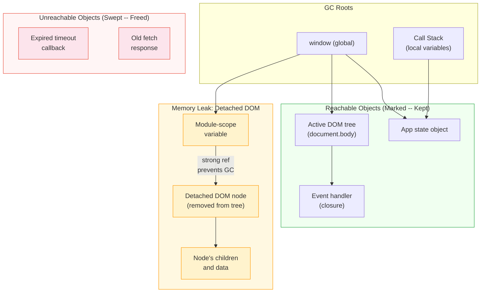

# [FEE-306] 記憶體管理與垃圾回收

:::info
JavaScript 透過垃圾回收（Garbage Collection）自動管理記憶體：你永遠不需要呼叫 `malloc` 或 `free`。但「自動」並不等於「無需操心」。理解引擎如何分配、追蹤並回收記憶體，是診斷那些在數分鐘、數小時或數天內悄悄拖垮應用程式效能之洩漏問題的關鍵。
:::

## 背景

JavaScript 程式中的每個值都佔用記憶體。常見的心智模型會將原始型別（primitives）歸類在堆疊（stack），把物件與閉包（closures）歸類在堆積（heap），但像 V8 這樣的引擎並未如此照字面實作：多數值，包括許多原始型別，實際存放在堆積上，而堆疊主要存放呼叫框架（call frames）以及指向堆積的參照。語言規範真正保證的是記憶體管理是自動的。引擎會決定何時回收不可達的物件；開發者負責管理可達性（reachability），而由引擎負責釋放記憶體。

這對前端應用的影響相當重大：

- **長期存活的頁面會累積洩漏。** 伺服器程序可能每天重啟，但單頁應用程式（Single-Page Application，SPA）可以持續開著數小時。每次導頁洩漏 1 MB，加總起來相當可觀。
- **垃圾回收暫停（GC pauses）影響幀率。** 主要垃圾回收可能將主執行緒阻塞數毫秒，導致掉幀以及動畫卡頓（jank）。
- **框架增加了生命週期的複雜度。** 元件的掛載／卸載循環、響應式訂閱（reactive subscriptions）以及虛擬 DOM（virtual DOM）協調過程，都為物件的存活時間超過預期創造了機會。

理解記憶體管理涵蓋三個層次：

- 語言模型：分配與可達性。
- 引擎實作：V8 的世代式垃圾回收器。
- 應用程式模式：框架生命週期清理與洩漏防護。

單頁應用程式的記憶體用量會隨著使用者在路由間導覽持續攀升，即使回到首頁也不會回落到基線。垃圾回收器無法回收仍被參照的物件。實務上，這通常代表某個事件監聽器仍附加在已從樹狀結構移除的 DOM 節點上，或是計時器從未被清除。下方的〈範例〉小節會示範如何透過堆積快照定位出實際被保留的物件，而〈設計思維〉小節則說明標記清除如何判定什麼才算可達。

## 視覺對比

下圖展示了標記清除如何從 GC 根識別可達物件，以及一個被閉包保留存活的已分離 DOM 節點如何成為記憶體洩漏：



**洩漏的發生方式：** 一個模組作用域的變數持有對已從文件中移除之 DOM 節點的參照。GC 從 `window` 追蹤至模組變數，再到已分離的節點，判定其可達，因此無法被回收。該節點的整個子樹（子節點、文字、屬性）也一同存活。

## 範例

### 1. 定位洩漏：堆積快照比對

一旦知道哪個物件被保留，程式碼修正其實很容易寫。找出那個物件是另一項技能，而 Chrome DevTools 的 Memory 面板正是為此而生：

1. 開啟 DevTools > Memory，選擇 **Heap snapshot**，在頁面載入後立即拍攝一張基準快照。
2. 多次執行懷疑會造成洩漏的操作，例如來回導覽該路由五次，讓任何被保留的物件以明顯的倍數呈現，而非單一難以察覺的實例。
3. 拍攝第二張快照，並將檢視切換為 **Comparison**。此視圖會依兩張快照之間存活實例數的差異列出建構函式；若某個建構函式的數量增幅大致等於重複次數，就是洩漏的候選對象。
4. 在該快照中，於類別篩選器輸入「Detached」進行篩選，或在 Summary 檢視的建構函式下拉選單中選擇「Objects retained by detached nodes」，以篩出已從文件移除但仍被保留的 DOM 節點。點選其中一個即可看到它的保留鏈（retainer chain）：從某個 GC 根一路指向該節點的參照路徑，正是上方圖解中展示的 `window` 到模組變數再到節點的鏈路。

若要在正式環境中監控而非本機除錯，標準化的 `performance.measureUserAgentSpecificMemory()` API 可以在不掛接 DevTools 的情況下，回報頁面（包含 iframe 與 worker）的總記憶體用量。此 API 要求頁面處於跨來源隔離狀態（透過 `Cross-Origin-Opener-Policy` 與 `Cross-Origin-Embedder-Policy` 標頭使 `self.crossOriginIsolated === true`）。

### 2. 忘記移除事件監聽器造成的記憶體洩漏 -- 使用 AbortController 修正

```js
// BUG: listener is never removed -- leaks handler closure and component scope
function initWidget(container) {
  const data = new ArrayBuffer(1024 * 1024); // 1 MB payload

  function onScroll() {
    // This closure captures 'data' -- keeping 1 MB alive
    updatePosition(container, data);
  }

  window.addEventListener("scroll", onScroll);
  // No cleanup path -- 'data' is retained forever
}

// FIX: use AbortController for clean removal
function initWidget(container) {
  const data = new ArrayBuffer(1024 * 1024);
  const controller = new AbortController();

  window.addEventListener(
    "scroll",
    () => updatePosition(container, data),
    { signal: controller.signal }
  );

  // Return a cleanup function the caller can invoke
  return () => controller.abort();
}

// Usage in a framework:
useEffect(() => {
  const cleanup = initWidget(containerRef.current);
  return cleanup; // called on unmount
}, []);
```

### 3. 以 WeakMap 對 DOM 元素進行元資料快取

```js
// WeakMap keys are held weakly -- when the DOM node is removed
// and no other reference exists, the entry is automatically collected
const tooltipCache = new WeakMap();

function getTooltipData(element) {
  if (tooltipCache.has(element)) {
    return tooltipCache.get(element);
  }

  // Expensive computation
  const data = computeTooltipPosition(element);
  tooltipCache.set(element, data);
  return data;
}

// When 'element' is removed from the DOM and dereferenced,
// the WeakMap entry becomes eligible for GC automatically.
// No manual cache invalidation needed.
```

### 4. React useEffect 清理模式

```jsx
function LivePrice({ symbol }) {
  const [price, setPrice] = useState(null);

  useEffect(() => {
    const controller = new AbortController();

    // WebSocket connection
    const ws = new WebSocket(`wss://api.example.com/prices/${symbol}`);

    ws.addEventListener("message", (event) => {
      setPrice(JSON.parse(event.data).price);
    }, { signal: controller.signal });

    ws.addEventListener("error", (event) => {
      console.error("WebSocket error:", event);
    }, { signal: controller.signal });

    // Polling fallback
    const intervalId = setInterval(async () => {
      try {
        const res = await fetch(`/api/price/${symbol}`, {
          signal: controller.signal,
        });
        if (res.ok) setPrice((await res.json()).price);
      } catch (err) {
        if (err.name !== "AbortError") console.error(err);
      }
    }, 30_000);

    // Cleanup: runs on unmount AND when 'symbol' changes
    return () => {
      controller.abort();      // cancels fetch, removes all event listeners
      clearInterval(intervalId); // stops polling
      ws.close();              // closes WebSocket
    };
  }, [symbol]);

  return <span>{price ?? "Loading..."}</span>;
}
```

## 最佳實踐

**在元件清理時移除事件監聽器。** MUST 為每一個 `addEventListener`、`subscribe` 或 `observe` 呼叫，在元件或作用域銷毀時配對對應的移除操作。使用 `AbortController` 並將其 `AbortSignal` 傳入 `addEventListener`，這樣只需一次 `controller.abort()` 呼叫即可移除所有相關監聽器，省去保留個別 handler 參照的麻煩。

**使用 `WeakMap` 或 `WeakSet` 作為以物件為鍵的快取。** SHOULD 在需要將元資料、計算結果或快取值與你不擁有的物件（例如 DOM 節點）關聯時，使用 `WeakMap`。由於 `WeakMap` 的鍵以弱引用方式持有，一旦鍵物件沒有其他強參照，該條目便自動成為可回收的垃圾，防止快取成為隱藏的洩漏來源。AVOID 為此目的使用普通的 `Map`，因為它對所有鍵持有強參照，永不釋放。

**避免在長期存活的閉包中捕獲大型物件。** SHOULD 在回傳或儲存閉包之前，只提取它真正需要的值。閉包對其封閉作用域中的每個變數持有強參照，因此一個捕獲了整個大型物件的長期存活 handler，會阻止該物件被回收。這個效應不僅限於被保留的那個函式本身：在同一個封閉作用域中宣告的多個函式，通常會共用同一個作用域物件，因此只要其中任何一個函式仍存活（例如透過一個從未被移除的監聽器），就可能連帶保留每個手足函式所捕獲的變數。要特別注意掛在 `window` 或 `document` 等全域目標上的事件 handler，它們永遠不會被卸載。

**謹慎使用 `FinalizationRegistry`，且只用於非關鍵清理。** SHOULD 將 `FinalizationRegistry` 視為在物件被回收後釋放外部資源（GPU 緩衝區、socket）的最後手段。回呼是非確定性的，可能比預期晚很多才執行，甚至根本不執行，因此 MUST NOT 依賴它來保證正確性關鍵的邏輯。對於確定性清理，優先使用 `try/finally` 或 `using` 關鍵字（Explicit Resource Management，屬於 ES2027 的一部分）。

## 設計思維

### 為何 JavaScript 採用垃圾回收

JavaScript 是為瀏覽器而設計的，這是一個開發者體驗與安全性優先於原始效能控制的環境。自動記憶體管理消除了兩大類困擾 C/C++ 程式的錯誤：

1. **釋放後使用（Use-after-free）。** 存取已被釋放的記憶體。在 C 語言中，這會導致未定義行為（undefined behavior）、安全漏洞和崩潰。在 JavaScript 中，這根本不可能發生：任何存活參照可達的物件，GC 都不會回收。
2. **雙重釋放（Double-free）。** 對同一塊記憶體釋放兩次。在 GC 語言中同樣不可能發生，因為開發者從不呼叫 `free`。

其代價是 **GC 暫停（GC pauses）**。引擎必須週期性地暫停或減速執行，以追蹤可達物件並回收死亡物件。V8 的 Orinoco 專案透過並行（concurrent）與平行（parallel）回收策略大幅縮短了這些暫停，但它們依然存在，並可能在動畫密集型應用中導致掉幀。

### 標記清除（Mark-and-sweep）：現代引擎如何回收垃圾

所有現代 JavaScript 引擎都以**標記清除（mark-and-sweep）**作為主要回收演算法。該演算法分為兩個階段：

1. **標記階段（Mark phase）。** 回收器從一組 *GC 根（GC roots）* 出發：
   - 全域物件（`window` 或 `globalThis`）
   - 呼叫堆疊（作用中函式的區域變數）
   - CPU 暫存器

   從每個根出發，回收器遞迴追蹤每一個參照，將每個可達物件標記為「存活」。
2. **清除階段（Sweep phase）。** 回收器掃描整個堆積。任何未被標記的物件都是不可達的：沒有任何從根出發的參照鏈能抵達它。這些物件被釋放，其記憶體歸還給分配器。

**為何不用引用計數？** 早期引擎與部分語言（例如 Swift 的 ARC）使用引用計數：每個物件追蹤有多少參照指向它，當計數歸零時釋放。它的致命缺陷是循環參照（circular references）。兩個互相參照的物件即使沒有任何根能抵達它們，各自的計數仍為 1，因此 ARC 會洩漏它們，除非開發者用 `weak` 或 `unowned` 標註打破循環。（CPython 同樣使用引用計數，但搭配了世代式循環回收器，能精確回收這類循環，因此不具備這個特定缺陷。）標記清除完全繞開了這個問題，因為它是從根出發追蹤：無根路徑可達的循環物件島嶼，無論其內部引用計數為何，都能被正確識別為垃圾。

### V8 的世代式垃圾回收（Generational GC）

V8（Chrome、Node.js、Deno）實作了一個基於**世代假說（generational hypothesis）**的世代式垃圾回收器：大多數物件死得早。函式呼叫中建立的暫時陣列，或是字串字面值拼接產生的中間字串，通常在建立後幾乎立刻就變得不可達。

V8 將堆積分為兩個世代：

**新生代（Young generation，Scavenger / Minor GC）。** 一個小型、可設定的區域，採用半空間（semi-space）設計。V8 過去在 64 位元平台上預設每個半空間為 16 MB（32 位元平台為 8 MB）；較新版本的 V8 則改為依處理程序可用的記憶體動態調整預設值，在容器或無伺服器（serverless）等資源受限的環境中，這個數字可能明顯更低。一半空間是分配新物件的「育嬰室（nursery）」，另一半則保持空白。當育嬰室滿時：
1. Scavenger 將所有存活物件複製至空白的一半（「To-Space」）。
2. 在第一次回收後存活的物件移入「中間區（intermediate）」。
3. 在第二次回收後存活的物件被**晉升（promoted）**至老生代。
4. 兩個半空間互換角色。

這非常快速，因為育嬰室中的大多數物件已經死亡：回收器只需複製少數存活者，這使得 Minor GC 的暫停遠比完整掃描堆積要短得多。

**老生代（Old generation，Mark-Compact / Major GC）。** 存活夠久的物件被晉升至此。老生代使用 Mark-Compact，結合了標記（找出可達物件）、清除（透過空閒串列回收死亡記憶體）以及壓縮（對高度碎片化的頁面移動存活物件以消除碎片）。Major GC 代價更高但執行頻率更低。

**Orinoco 優化。** V8 的 Orinoco 專案將回收器從「停止一切（stop-the-world）」轉型為「大致並行（mostly concurrent）」：
- **平行（Parallel）**：多個輔助執行緒在暫停期間協作，分擔工作。
- **增量（Incremental）**：標記工作被拆分為小塊，與 JavaScript 執行交錯進行。
- **並行（Concurrent）**：輔助執行緒在 JavaScript 於主執行緒執行時，於背景進行標記與清除。寫入屏障（write barriers）追蹤並行標記期間建立的新參照。

這些優化在重度 WebGL 場景下將 Major GC 暫停縮短了高達 50%。

### 框架如何管理生命週期清理

前端框架提供了特定的生命週期鉤子（lifecycle hooks），專門用於防止元件掛載／卸載循環中的記憶體洩漏：

**React** -- `useEffect` 清理函式：
```js
useEffect(() => {
  const controller = new AbortController();
  window.addEventListener("resize", handleResize, { signal: controller.signal });
  const id = setInterval(pollStatus, 5000);

  return () => {
    controller.abort();   // removes all listeners with this signal
    clearInterval(id);    // stops the timer
  };
}, []);
```
回傳的函式在卸載時執行，也會在依賴項變更導致重新執行之前執行。

**Vue** -- `onUnmounted` 與 watch 清理：
```js
onMounted(() => {
  const controller = new AbortController();
  window.addEventListener("scroll", handleScroll, { signal: controller.signal });

  onUnmounted(() => {
    controller.abort();
  });
});
```

**Angular** -- `ngOnDestroy`：
```ts
export class ChartComponent implements OnDestroy {
  private resizeObserver = new ResizeObserver(this.onResize.bind(this));

  ngOnInit() {
    this.resizeObserver.observe(this.elementRef.nativeElement);
  }

  ngOnDestroy() {
    this.resizeObserver.disconnect();
  }
}
```

**Svelte** -- `onDestroy`：
```js
onMount(() => {
  const interval = setInterval(refresh, 3000);
  return () => clearInterval(interval); // runs on destroy
});
```

### Signal 的釋放與響應式訂閱清理

響應式系統（Solid、Preact Signals、Angular Signals）會自動追蹤訂閱。當一個響應式作用域（reactive scope）被銷毀時，執行時會自動取消在其中建立的所有 effect。這比手動清理更穩健，因為框架掌控了訂閱的生命週期。

然而，延伸至響應式系統之外的副作用（side effects，例如 DOM 監聽器、網路連線、計時器）仍需明確清理。Signals 能自動處理計算值的取消訂閱；但停止計時器或關閉連線，仍是開發者自己的責任。

### TC39 明確資源管理（Explicit Resource Management）

明確資源管理已於 2025 年 5 月進入 Stage 4，並成為 ECMAScript 2027 的一部分。它引入了 `using` 關鍵字用於確定性清理，並已於 Chrome 134+ 出貨：

```js
function readFile() {
  using reader = getReader(); // reader[Symbol.dispose]() called at scope exit
  return reader.read();
}

async function processStream(response) {
  await using reader = response.body.getReader();
  // reader[Symbol.asyncDispose]() called and awaited at scope exit
}
```

物件透過實作 `Symbol.dispose`（同步）或 `Symbol.asyncDispose`（非同步）來定義其清理邏輯。`DisposableStack` 可聚合多個資源並以逆序釋放。這個模式最終將取代許多用於資源清理的 `try/finally` 區塊。

### WeakRef、WeakMap、WeakSet

弱參照（Weak references）讓你能持有對物件的參照，同時不阻止其被垃圾回收：

- **WeakMap / WeakSet**：鍵（WeakMap）或值（WeakSet）以弱引用方式持有。當鍵物件沒有其他強參照時，該條目會自動移除。使用 WeakMap 將元資料與你不擁有的物件關聯。
- **WeakRef**：透過 `new WeakRef(target)` 提供對任意物件的弱參照。呼叫 `.deref()` 可取得物件，若已被回收則回傳 `undefined`。
- **FinalizationRegistry**：在物件被垃圾回收*後*觸發回呼。適用於釋放外部資源，例如關閉 socket 或釋放 GPU 緩衝區，但時機是非確定性的：回呼可能比預期晚很多才執行，甚至根本不執行。

**規格的重要警告**：「正確的程式碼不得依賴 WeakRef/FinalizationRegistry 的行為。」請純粹將它們當作優化提示；正確性關鍵的邏輯需要另尋確定性機制。

## 常見錯誤

### 1. 在全域或模組作用域變數中儲存 DOM 參照

```js
// BUG: detached DOM leak
let cachedHeader = null;

function renderHeader() {
  cachedHeader = document.createElement("div");
  cachedHeader.innerHTML = buildHeaderHTML(); // large subtree
  document.body.appendChild(cachedHeader);
}

function removeHeader() {
  cachedHeader.remove(); // removed from DOM tree...
  // but cachedHeader still references the node!
  // The node and its entire subtree cannot be GC'd.
}

// FIX: null out the reference after removal
function removeHeader() {
  cachedHeader.remove();
  cachedHeader = null; // now the detached node is unreachable
}
```

### 2. 閉包捕獲了超過所需的作用域

```js
// BUG: the closure captures 'hugeData' even though it only needs 'id'
function createHandler(hugeData) {
  const id = hugeData.id;
  return () => {
    // 'hugeData' is in the closure scope -- the engine MAY retain it
    // even though only 'id' is used (depends on engine optimization)
    console.log("Clicked item", id);
  };
}

// FIX: extract only what you need before creating the closure
function createHandler(hugeData) {
  const id = hugeData.id;
  // Now 'hugeData' is not referenced inside the returned function
  return () => {
    console.log("Clicked item", id);
  };
}
// Note: the fix is structurally identical -- the key insight is that
// V8 CAN optimize this, but eval() or 'with' inside the closure
// defeats this optimization and retains the entire scope.
```

### 3. 假設垃圾回收是立即執行的

```js
// BUG: depending on WeakRef being cleared at a specific time
const cache = new Map();

function getCached(key, factory) {
  const ref = cache.get(key);
  if (ref) {
    const obj = ref.deref();
    if (obj) return obj; // still alive
    // Fallen through: GC has collected it -- BUT you cannot predict when
  }
  const value = factory();
  cache.set(key, new WeakRef(value));
  return value;
}

// This pattern is valid for a CACHE (performance optimization),
// but NEVER use it for correctness-critical logic.
// The GC may not run for seconds, minutes, or at all before page close.
// Do not write: if (weakRef.deref() === undefined) { /* assume cleanup done */ }
```

## 延伸閱讀

- **[FEE-300](/en/JavaScript%20Core%20and%20Runtime/300)** -- JavaScript Core & Runtime Overview：執行模型與堆積架構
- **[FEE-302](/en/JavaScript%20Core%20and%20Runtime/302)** -- Closures & Scope：閉包如何保留參照並導致記憶體滯留
- **[FEE-301](/en/JavaScript%20Core%20and%20Runtime/301)** -- Event Loop & Task Queues：GC 暫停及其對幀時序的影響
- **[FEE-1400](/en/Observability/1400)** -- Observability：使用 Chrome DevTools 堆積快照進行記憶體分析

## 參考資料

- [MDN -- Memory Management](https://developer.mozilla.org/en-US/docs/Web/JavaScript/Guide/Memory_management) -- JavaScript 記憶體生命週期、垃圾回收概念與常見洩漏模式
- [MDN -- WeakRef](https://developer.mozilla.org/en-US/docs/Web/JavaScript/Reference/Global_Objects/WeakRef) -- 弱參照 API、`.deref()` 及使用注意事項
- [MDN -- FinalizationRegistry](https://developer.mozilla.org/en-US/docs/Web/JavaScript/Reference/Global_Objects/FinalizationRegistry) -- 物件被垃圾回收後的後處理回呼
- [MDN -- Performance: measureUserAgentSpecificMemory()](https://developer.mozilla.org/en-US/docs/Web/API/Performance/measureUserAgentSpecificMemory) -- 用於在正式環境中測量頁面總記憶體用量的標準化 API，需要跨來源隔離的內容環境
- [Nolan Lawson -- Fixing memory leaks in web applications](https://nolanlawson.com/2020/02/19/fixing-memory-leaks-in-web-applications/) -- 獨立作者撰寫、以實務案例分析單頁應用程式中閉包與監聽器洩漏的文章
- [V8 Blog -- Trash talk: the Orinoco garbage collector](https://v8.dev/blog/trash-talk) -- 世代式 GC 架構、半空間 Scavenger、Mark-Compact 以及 Orinoco 的平行／並行策略
- [V8 Blog -- Concurrent marking in V8](https://v8.dev/blog/concurrent-marking) -- V8 如何使用寫入屏障（write barriers）在 JavaScript 執行期間並行標記物件
- [V8 Blog -- Weak references and finalizers](https://v8.dev/features/weak-references) -- V8 對 WeakRef 與 FinalizationRegistry 的實作
- [V8 Blog -- Explicit Resource Management](https://v8.dev/features/explicit-resource-management) -- `using` 關鍵字、`Symbol.dispose`、`DisposableStack`，已於 Chrome 134 出貨
- [Node.js -- Command-line API：`--max-semi-space-size`](https://nodejs.org/api/cli.html#--max-semi-space-sizesize-in-mib) -- 記錄新生代半空間大小設定旗標及其平台預設值的 V8 旗標文件
- [Chrome DevTools -- Record heap snapshots](https://developer.chrome.com/docs/devtools/memory-problems/heap-snapshots) -- 堆積快照分析、摘要／比較／包含視圖
- [Chrome DevTools -- Fix memory problems](https://developer.chrome.com/docs/devtools/memory-problems) -- 識別已分離的 DOM 樹、分配時間軸與記憶體分析工作流程
- [TC39 -- Explicit Resource Management proposal](https://github.com/tc39/proposal-explicit-resource-management) -- `using`、`await using`、`Symbol.dispose` 與 `Symbol.asyncDispose` 的 Stage 4 規格（屬於 ECMAScript 2027 的一部分）
