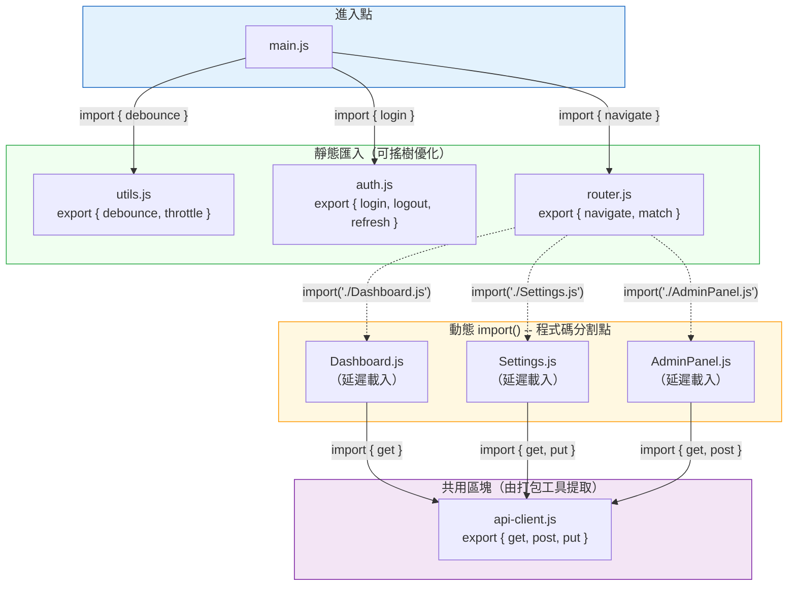

# [FEE-307] ES 模組與模組系統

:::info
JavaScript 在誕生後的前 20 年都沒有模組系統。腳本透過全域物件共享一切，社群發明了 CommonJS、AMD 和 UMD 來填補空缺。ES Modules（ESM）-- 於 ES2015 標準化並持續改進 -- 終於為這門語言提供了原生、靜態、非同步的模組系統。理解 ESM 如何運作、為何採用靜態結構設計，以及它如何與 CommonJS 共存，是撰寫出能讓打包工具最佳化、瀏覽器高效載入、團隊規模化維護之程式碼的關鍵。
:::

## 背景

在 ES2015 之前，JavaScript 沒有語言層級的模組系統。Node.js 於 2009 年採用了 CommonJS（CJS），為伺服器端程式碼提供 `require()` 和 `module.exports`。瀏覽器端則仰賴檔案串接、AMD（`define`/`require`）或 UMD 包裝。每種方式都有其取捨：

- **CommonJS** -- 同步、動態，在 Node 中運作良好，因為模組從本機檔案系統載入。未經打包無法直接在瀏覽器中使用。
- **AMD（RequireJS）** -- 非同步、對瀏覽器友善，但回呼語法冗長且生態系獨立。
- **UMD** -- 偵測環境的包裝模式，同時支援 CJS 和 AMD。樣板程式碼複雜，無法進行靜態分析。

ES2015 將 `import`/`export` 引入為語法 -- 屬於語言文法的一部分，而非執行期 API。這個區別至關重要：因為 import 和 export 是宣告式且位於頂層，工具可以在建置時期分析模組依賴圖，無需實際執行程式碼。

如今，ESM 是瀏覽器和 Node.js 的共同標準。但 CJS 仍然運行在數以百萬計的套件中，遷移路徑也相當細膩。前端工程師必須理解兩套系統、它們的語意差異，以及建置工具如何橋接彼此。

## 使用情境

你要在一個從單一 `<script>` 標籤有機生長起來的程式碼庫中，為十二個檔案共用一個工具函式。目前函式都掛在一個全域命名空間物件上，而 `<script>` 標籤的載入順序決定了什麼時候有什麼可用。ES Modules 的 `import` 和 `export` 具備靜態分析能力，讓打包工具能夠移除未使用的程式碼、偵測循環依賴，並讓每個檔案以明確的依賴宣告取代隱式的全域依賴。

## 設計思維

### 為何 ESM 採用靜態結構設計

ESM 的根本設計選擇是：模組依賴圖可以在靜態階段 -- 即解析時期、不執行任何程式碼的情況下 -- 被完整確定。這並非偶然，而是首要的設計目標。

在 CommonJS 中，`require()` 是一個函式呼叫。它可以出現在條件式、迴圈或函式內部，引數可以是計算出的字串。這意味著沒有任何工具能在不執行程式碼的情況下得知完整的依賴圖：

```js
// CJS：動態 -- 工具無法靜態分析
const mod = require(condition ? "./a" : "./b");
const name = getModuleName();
const dynamic = require(`./plugins/${name}`);
```

ESM 的 import MUST 是頂層宣告，且模組指定符（specifier）必須為字串字面值：

```js
// ESM：靜態 -- 工具可在解析時期分析
import { debounce } from "lodash-es";
import { render } from "./render.js";
```

此限制解鎖了三項改變 JavaScript 工具生態的能力：

1. **搖樹優化（Tree-shaking，死碼消除）。** Rollup 率先實現此技術：若 `import { debounce } from "lodash-es"` 是唯一的匯入，打包工具能證明 lodash-es 的所有其他匯出皆未使用，從而將它們排除在打包結果之外。使用 CJS 時，因為 `require()` 回傳的是整個 `module.exports` 物件，必須包含整個模組。

2. **建置時期依賴分析。** 打包工具在產生輸出前建構完整的模組依賴圖。這使得作用域提升（scope hoisting，將模組合併為更少的函式）、程式碼分割（識別共用區塊）和平行載入策略成為可能。

3. **快速刷新與 HMR（Hot Module Replacement）。** 開發伺服器可以精確判斷哪些模組依賴於被修改的檔案，僅更新那些模組，而無需重新執行整個依賴樹。

### 打包工具如何利用靜態結構

**Rollup** 專為 ESM 而建。其搖樹優化分析整個打包範圍中哪些繫結（bindings）被實際使用，不僅移除未使用的匯出，還移除模組內未使用的內部函式。Rollup 的輸出通常最小，因為它從一開始就是為 ESM 設計的。

**webpack** 在 v2 透過「harmony modules」分析加入了搖樹優化支援。webpack 4 引入了 `sideEffects` 欄位：當套件宣告 `"sideEffects": false` 時，webpack 可以在沒有任何匯出被匯入的情況下跳過整個模組。webpack 5 改進了逐匯出使用追蹤和巢狀搖樹優化。

**Vite** 在開發階段採取不同策略：將原始檔案作為原生 ESM 透過 HTTP 提供，完全不進行打包。瀏覽器自身的模組載入器按需取得每個檔案，使開發伺服器的啟動速度幾乎不受應用程式大小影響。然而，Vite 會使用 Rolldown（前身為 esbuild）預打包（pre-bundle）相依套件，原因有二：

1. **CJS/UMD 轉換。** 像 React 這樣以 CJS 發布的相依套件，Vite 將其轉換為 ESM 以便瀏覽器載入。
2. **模組數量縮減。** 某些 ESM 套件包含數百個內部模組（lodash-es 有 600 多個）。預打包將它們合併為單一檔案，避免瀑布式（waterfall）HTTP 請求。

在正式環境中，Vite 使用 Rollup（或 Vite 6+ 的 Rolldown）產生經過完整搖樹優化和程式碼分割的最佳化打包。

### 框架的程式碼分割與動態 import()

動態 `import()` 回傳一個 Promise，解析為模組的命名空間物件。打包工具將 `import()` 視為分割點，為匯入的模組及其依賴建立獨立區塊（chunk）。

**React** -- `React.lazy()` 包裝動態匯入以進行元件層級分割：

```jsx
const Dashboard = React.lazy(() => import("./Dashboard"));

function App() {
  return (
    <Suspense fallback={<Spinner />}>
      <Dashboard />
    </Suspense>
  );
}
```

**Vue** -- `defineAsyncComponent()` 提供相同模式：

```js
const Dashboard = defineAsyncComponent(() => import("./Dashboard.vue"));
```

**SvelteKit** 和 **Next.js** 更進一步採用路由層級的程式碼分割。每個頁面元件自動成為分割點 -- 框架的路由器僅載入當前路由所需的程式碼。

**Next.js** 還提供 `next/dynamic` 進行元件層級分割，並自動按頁面分割，意味著每個路由僅載入自己的 JavaScript。

### CJS 到 ESM 的遷移

Node.js 生態系從 CJS 遷移至 ESM 帶來了數項挑戰：

**雙重套件風險（Dual package hazard）。** 若套件同時提供 CJS 和 ESM 進入點，專案可能同時載入兩個版本 -- CJS 透過 `require()`、ESM 透過 `import` -- 造成兩個狀態分歧的獨立實例。Node.js 文件特別警告此問題。

**條件匯出（Conditional exports）**（`package.json` 的 `"exports"` 欄位）透過讓你為不同環境指定不同進入點來解決雙重套件風險：

```json
{
  "name": "my-lib",
  "type": "module",
  "exports": {
    ".": {
      "import": "./dist/index.mjs",
      "require": "./dist/index.cjs"
    }
  }
}
```

**`"type": "module"`** 在 `package.json` 中告訴 Node.js 將套件內所有 `.js` 檔案視為 ESM。若未設定，`.js` 檔案預設為 CJS。你可以使用 `.mjs` 代表 ESM、`.cjs` 代表 CJS 來逐檔覆寫，不受 `type` 欄位影響。

## 最佳實踐

**優先使用具名匯出而非預設匯出以利搖樹優化。** SHOULD 在函式庫和共用工具程式碼中使用具名匯出，因為打包工具能識別並消除個別未使用的匯出。預設匯出暴露單一不透明的 binding — 若該 binding 是含有多個成員的物件或類別，打包工具無法靜態確定哪些成員被使用，因此將納入整個值。AVOID 在同一個模組中混用預設匯出和具名匯出，因為這會為使用者製造不一致的匯入語法並使重構更加困難。

**避免模組間的循環依賴。** SHOULD 建構模組時確保不存在匯入循環。在 ES modules 中，匯入的 binding 是指向匯出 slot 的即時參照 -- 若模組 A 從 B 匯入、B 從 A 匯入，且 A 先被求值，當 A 的頂層程式碼執行時 B 的匯出值尚未初始化，會產生 `ReferenceError`。若循環無法消除，應將存取移至兩個模組皆完整求值後才呼叫的函式中。

**使用 `import.meta.url` 處理模組相對路徑。** SHOULD 在模組需要解析相對於自身而非相對於當前工作目錄的檔案路徑或 URL 時，使用 `import.meta.url`。`import.meta` 物件僅在模組腳本內可用，提供當前模組的規範 URL，使資源參照無論從何處載入模組都能可靠地解析。

**使用動態 `import()` 進行程式碼分割。** SHOULD 在路由邊界、功能旗標後方以及重型可選相依套件處使用 `import()`，而非在啟動時載入所有內容。`import()` 回傳一個解析為模組命名空間物件的 Promise；打包工具將每個 `import()` 呼叫視為分割點，並產生按需載入的獨立 chunk。優先在 `import()` 內使用靜態字串指定符，使打包工具能在建置時期確定分割點集合。

## 圖解

以下圖表展示了一個模組依賴圖，其中靜態匯入形成可搖樹優化的連結，而動態 `import()` 呼叫建立程式碼分割點：



**實線箭頭**代表靜態匯入 -- 打包工具可以對這些模組的未使用匯出進行搖樹優化。只有 `debounce` 從 `utils.js` 被匯入，因此 `throttle` 會在正式打包中被消除。**虛線箭頭**代表動態 `import()` 呼叫 -- 每個呼叫建立一個按需載入的獨立區塊。打包工具偵測到 `api-client.js` 被多個延遲區塊匯入，會將其提取為共用區塊以避免重複。

## 範例

### 1. ESM 具名匯出和預設匯出與匯入

```js
// math.js -- 具名匯出（函式庫推薦用法）
export const PI = 3.14159265;
export function area(radius) {
  return PI * radius ** 2;
}
export function circumference(radius) {
  return 2 * PI * radius;
}

// logger.js -- 預設匯出（單一用途模組）
export default class Logger {
  constructor(prefix) {
    this.prefix = prefix;
  }
  log(msg) {
    console.log(`[${this.prefix}] ${msg}`);
  }
}

// app.js -- 匯入兩種風格
import Logger from "./logger.js";              // 預設匯入
import { area, circumference } from "./math.js"; // 具名匯入
// import * as math from "./math.js";           // 命名空間匯入（math.area、math.PI）

const logger = new Logger("App");
logger.log(`Circle area: ${area(5)}`);
logger.log(`Circumference: ${circumference(5)}`);

// 重新匯出模式（桶檔案 barrel file：index.js）
export { area, circumference } from "./math.js";    // 具名重新匯出
export { default as Logger } from "./logger.js";     // 將預設重新匯出為具名
```

### 2. 動態 import() 延遲載入

```js
// 路由層級程式碼分割
const routes = {
  "/dashboard": () => import("./pages/Dashboard.js"),
  "/settings": () => import("./pages/Settings.js"),
  "/admin":    () => import("./pages/AdminPanel.js"),
};

async function navigate(path) {
  const loader = routes[path];
  if (!loader) {
    throw new Error(`Unknown route: ${path}`);
  }

  // import() 回傳一個解析為模組命名空間的 Promise
  const module = await loader();

  // 存取預設匯出（頁面元件）
  const PageComponent = module.default;

  // 或解構具名匯出
  // const { PageComponent, pageTitle } = await loader();

  renderPage(PageComponent);
}

// 基於功能旗標的載入
async function loadAnalytics() {
  if (window.__FEATURE_FLAGS__.analytics) {
    const { init, trackEvent } = await import("./analytics.js");
    init({ siteId: "abc123" });
    return trackEvent;
  }
  return () => {}; // 停用時回傳空操作
}
```

### 3. Import map 實現無打包工具的 CDN 解析

```html
<!DOCTYPE html>
<html>
<head>
  <!-- Import map：將裸指定符（bare specifiers）解析至 CDN URL -->
  <script type="importmap">
  {
    "imports": {
      "lodash-es": "https://cdn.jsdelivr.net/npm/lodash-es@4.17.21/lodash.js",
      "lodash-es/": "https://cdn.jsdelivr.net/npm/lodash-es@4.17.21/",
      "preact": "https://esm.sh/preact@10.19.3",
      "preact/": "https://esm.sh/preact@10.19.3/",
      "htm": "https://esm.sh/htm@3.1.1"
    }
  }
  </script>
</head>
<body>
  <!-- type="module" 在瀏覽器中啟用 ESM -->
  <script type="module">
    // 裸指定符現在透過 import map 解析 -- 不需要打包工具
    import { debounce } from "lodash-es";
    import { h, render } from "preact";
    import htm from "htm";

    const html = htm.bind(h);

    function App() {
      return html`<h1>Hello from ESM + Import Maps</h1>`;
    }

    render(html`<${App} />`, document.body);
  </script>
</body>
</html>
```

## 常見錯誤

### 1. 循環依賴導致匯入值為 undefined

```js
// a.js
import { b } from "./b.js";
console.log("a.js loaded, b =", b);  // b 是 undefined！
export const a = "A";

// b.js
import { a } from "./a.js";
console.log("b.js loaded, a =", a);  // 若 b.js 第二個執行，a 為 "A"
export const b = "B";

// ESM 使用即時繫結（live bindings）-- 'b' 是指向 b.js 匯出槽位的參照。
// 但若 a.js 先被求值，b.js 尚未執行，因此該繫結存在但尚未被初始化。
//
// CJS 更糟：require() 回傳的是呼叫當下 module.exports 的副本。
// 若模組尚未執行完畢，你會得到一個不完整的物件。
//
// 修正：重構以消除循環，或將存取移至兩個模組初始化完成後
// 才執行的函式中。
export function getB() {
  return b; // 延後存取，在模組求值完成後使用
}
```

### 2. 動態 import() 使用樣板字面值導致靜態分析失效

```js
// 不佳：打包工具無法在建置時期判斷可能的值
async function loadPlugin(name) {
  const plugin = await import(`./plugins/${name}.js`);
  return plugin.default;
}
// 打包工具必須：
// - 包含 ./plugins/ 下的所有檔案（過度打包），或
// - 放棄優化，僅保留為執行期匯入（無法最佳化）

// 較佳：使用靜態對應，讓打包工具知道確切的集合
const pluginLoaders = {
  chart:    () => import("./plugins/chart.js"),
  table:    () => import("./plugins/table.js"),
  calendar: () => import("./plugins/calendar.js"),
};

async function loadPlugin(name) {
  const loader = pluginLoaders[name];
  if (!loader) throw new Error(`Unknown plugin: ${name}`);
  const plugin = await loader();
  return plugin.default;
}
```

### 3. 頂層 await 造成瀑布式載入

```js
// slow.js -- 頂層 await 阻塞所有依賴此模組的模組
const config = await fetch("/api/config").then(r => r.json());
const translations = await fetch(`/api/i18n/${config.locale}`).then(r => r.json());
export { config, translations };

// 這兩個 fetch 依序執行（瀑布式），且每一個匯入 slow.js 的模組
// 都必須等待兩個 fetch 完成後才能開始求值。

// 修正：改為匯出 Promise 或初始化函式
let _config;
let _translations;

export async function init() {
  _config = await fetch("/api/config").then(r => r.json());
  _translations = await fetch(`/api/i18n/${_config.locale}`).then(r => r.json());
}

export function getConfig() { return _config; }
export function getTranslations() { return _translations; }

// app.js -- 呼叫端控制非同步工作的時機
import { init, getConfig } from "./slow.js";
await init(); // 明確且可見，由擁有時序控制的模組負責
```

### 4. 假設搖樹優化能移除所有未使用的程式碼（sideEffects 欄位）

```js
// 函式庫的 package.json -- 缺少 sideEffects 宣告
{
  "name": "my-ui-lib",
  "main": "dist/index.cjs",
  "module": "dist/index.mjs"
  // 沒有 "sideEffects" 欄位！
}

// 函式庫的 index.mjs：
import "./polyfills.js";           // 副作用：修改全域物件
import "./register-components.js"; // 副作用：註冊自訂元素
export { Button } from "./Button.js";
export { Modal } from "./Modal.js";
export { Tabs } from "./Tabs.js";

// 使用者僅匯入 Button：
import { Button } from "my-ui-lib";

// 缺少 "sideEffects" 欄位時，打包工具 MUST 包含 polyfills.js
// 和 register-components.js，因為它們可能有副作用。
// 即使未使用的匯出如 Modal 和 Tabs 也可能被保留。

// 修正：在 package.json 中宣告 sideEffects
{
  "name": "my-ui-lib",
  "sideEffects": [
    "./dist/polyfills.js",
    "./dist/register-components.js",
    "**/*.css"
  ]
}
// 現在打包工具知道：只有列出的檔案具有副作用。
// 其他所有檔案都可以安全地進行搖樹優化。
```

## 相關 FEE

- **[FEE-300](/zh-tw/JavaScript%20Core%20and%20Runtime/300)** -- JavaScript 核心與執行環境概覽：模組運作所依賴的執行模型
- **[FEE-301](/zh-tw/JavaScript%20Core%20and%20Runtime/301)** -- 事件迴圈與工作佇列：動態 `import()` 是非同步的，與微任務佇列（microtask queue）整合
- **[FEE-302](/zh-tw/JavaScript%20Core%20and%20Runtime/302)** -- 閉包與作用域：模組作用域即閉包 -- 每個模組擁有自己的頂層作用域
- **[FEE-800](/zh-tw/Build%20Tooling/800)** -- 建置工具：打包工具（Rollup、webpack、Vite）仰賴 ESM 的靜態結構進行最佳化

## 參考資料

- [ECMA-262 -- Scripts and Modules](https://tc39.es/ecma262/multipage/ecmascript-language-scripts-and-modules.html) -- 定義 Source Text Module Records、import/export 語法和模組求值語意的規範
- [MDN -- JavaScript modules guide](https://developer.mozilla.org/en-US/docs/Web/JavaScript/Guide/Modules) -- ESM 語法、動態匯入和瀏覽器使用的完整指南
- [MDN -- import statement](https://developer.mozilla.org/en-US/docs/Web/JavaScript/Reference/Statements/import) -- 靜態匯入宣告的語法與語意
- [MDN -- export statement](https://developer.mozilla.org/en-US/docs/Web/JavaScript/Reference/Statements/export) -- 具名匯出、預設匯出和重新匯出
- [MDN -- import map](https://developer.mozilla.org/en-US/docs/Web/HTML/Reference/Elements/script/type/importmap) -- 使用 `<script type="importmap">` 在瀏覽器中解析裸指定符
- [Node.js -- ECMAScript modules](https://nodejs.org/api/esm.html) -- Node.js ESM 支援、與 CJS 的互通性、條件匯出和 `"type": "module"`
- [Node.js -- CommonJS modules](https://nodejs.org/api/modules.html) -- `require()` 系統、模組解析演算法和快取行為
- [Lin Clark -- ES modules: A cartoon deep-dive](https://hacks.mozilla.org/2018/03/es-modules-a-cartoon-deep-dive/) -- 以插畫說明模組建構、實例化和求值三大階段
- [Vite -- Dependency Pre-Bundling](https://vite.dev/guide/dep-pre-bundling) -- Vite 如何將 CJS 轉換為 ESM 並合併內部模組以提升開發效能
- [Vite -- Why Vite](https://vite.dev/guide/why) -- 原生 ESM 開發伺服器架構及其解決的問題
- [webpack -- Tree Shaking guide](https://webpack.js.org/guides/tree-shaking/) -- `sideEffects` 欄位、逐匯出分析和死碼消除
- [V8 -- Dynamic import()](https://v8.dev/features/dynamic-import) -- 動態模組載入的執行期語意
