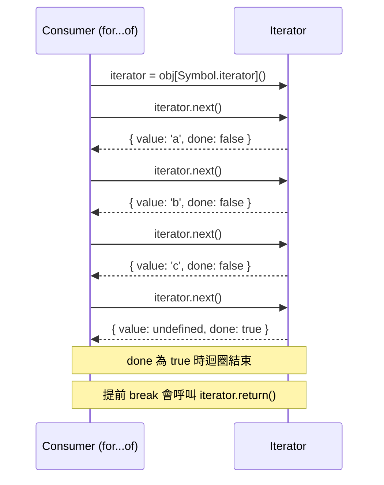

# [FEE-308] 迭代器、產生器與非同步迭代

:::info
JavaScript 陣列一直都能用 `for` 迴圈迭代，但 Map、Set、自訂資料結構和非同步資料來源需要一個通用合約來進行循序存取。ES2015 引入了迭代協議（iteration protocols）-- `Symbol.iterator` 和 `{ next() }` 介面 -- 讓每種資料結構都有一個統一、可組合的方式來按需產出值。ES2018 透過 `Symbol.asyncIterator` 和 `for await...of` 將此擴展至非同步來源。理解這些協議至關重要，因為它們支撐了 `for...of`、展開語法（spread syntax）、解構賦值（destructuring）、`Array.from()`、`Promise.all()` 和整個 Web Streams API。
:::

## 背景

在 ES2015 之前，迭代不同資料結構需要不同的機制。陣列使用基於索引的 `for` 迴圈。物件使用 `for...in`（會列舉所有可列舉屬性，包含繼承而來的）。NodeList 需要先轉換為陣列或使用 `Array.prototype.forEach.call()`。沒有統一的方式來表達「這個東西能產出一系列的值」。

迭代協議透過定義兩個互補的合約解決了這個問題：

1. **可迭代協議（iterable protocol）** -- 物件實作 `[Symbol.iterator]()` 來宣告它能產出序列。
2. **迭代器協議（iterator protocol）** -- 回傳的物件具有 `next()` 方法，回傳 `{ value, done }`。

內建可迭代物件包含 Array、String、Map、Set、TypedArray、arguments、NodeList、URLSearchParams、FormData 和 Headers。任何自訂物件都能透過實作 `Symbol.iterator` 成為可迭代物件。

ES2015 同時引入了**產生器函式（generator functions）**（`function*`）-- 建立迭代器的語法捷徑。產生器在每個 `yield` 處暫停執行，在 `next()` 被呼叫時恢復，非常適合惰性序列（lazy sequences）。

ES2018 將此模型擴展至非同步資料，推出**非同步迭代協議（async iteration protocol）**：`Symbol.asyncIterator`、`for await...of` 和 `async function*`。這使得能以拉取模式（pull-based）消費隨時間到達的資料 -- 分頁 API、串流回應、檔案區塊和 WebSocket 訊息。

## 使用情境

你正在開發一個分頁功能，當使用者捲動到接近底部時自動載入下一頁。目前的實作把資料取得邏輯、游標追蹤和渲染全部耦合在同一個捲動事件處理器裡，導致取得邏輯難以獨立測試。產生器函式可以把分頁序列建模為一個惰性迭代器——每次 yield 一頁、在內部維護游標狀態——從而將資料的「生產」與「消費」清楚分離。

## 設計思維

### 為何 JS 採用迭代器協議

核心動機是**統一介面（uniform interface）**：一個協議適用於 Array、Map、Set、String、TypedArray、DOM 集合以及任何自訂結構。在此之前，每個函式庫都發明自己的遍歷 API。迭代器協議讓語言建構 -- `for...of`、展開運算子、解構、`Array.from()`、`Promise.all()`、`Map()` 建構函式 -- 能在不了解內部結構的情況下與任何可迭代物件協作。

**惰性求值（lazy evaluation）** 是第二個動機。迭代器一次產出一個值，按需提供。從 1 到 1,000,000 的範圍不需要配置一個包含 1,000,000 個元素的陣列 -- 只在 `next()` 被呼叫時才產出每個數字。這對記憶體受限的環境和無限序列（費波那契數列、感測器讀數、事件串流）至關重要。

**可組合性（composability）** 是第三個目標。因為每個可迭代物件都遵循相同的協議，通用工具 -- `map`、`filter`、`take`、`zip` -- 只需撰寫一次就能適用於任何來源。TC39 的 Iterator Helpers 提案（在 V8 v12.2+ 中已出貨）將這些方法直接加入 `Iterator.prototype`。

### 拉取模型與推送模型

迭代器實作**拉取模型（pull model）**：消費者透過呼叫 `next()` 決定何時取得下一個值。生產者是被動的 -- 它等待被詢問。這讓消費者完全掌控背壓（backpressure）和時序。

替代方案是**推送模型（push model）**：生產者決定何時發送值。回呼、EventEmitter 和 Observable（RxJS）遵循此模式。生產者不管消費者是否準備好就推送資料，需要緩衝或丟棄策略。

這個區別在非同步資料中尤為重要：

| 面向 | 拉取（Iterator） | 推送（Observable/EventEmitter） |
|------|-----------------|-------------------------------|
| 控制權 | 消費者呼叫 `next()` | 生產者發送事件 |
| 背壓 | 內建（消費者控制節奏） | 需要明確處理 |
| 取消 | 迭代器的 `return()` | `unsubscribe()` / `removeListener()` |
| 使用場景 | 分頁 API、檔案區塊 | DOM 事件、WebSocket 訊息 |

非同步迭代器橋接了兩者：消費者以 `next()` 拉取，但 `next()` 回傳 Promise，讓生產者在資料就緒時解析。這提供了拉取式背壓搭配非同步交付。

### 網路平台的可迭代物件

迭代協議深度整合於網路平台中：

- **ReadableStream** 實作 `Symbol.asyncIterator`（WHATWG Streams 規範）。你可以用 `for await (const chunk of response.body)` 消費 fetch 回應主體，而非手動管理讀取器。
- **URLSearchParams**、**FormData** 和 **Headers** 實作 `Symbol.iterator`，產出 `[key, value]` 配對 -- 與 Map 的迭代行為一致。
- **NodeList** 是可迭代的，所以 `for (const el of document.querySelectorAll('div'))` 無需轉換即可運作。

### 框架串流模式

現代框架利用非同步迭代實現串流式伺服器端渲染（streaming SSR）：

- **React** -- `renderToPipeableStream()` 產生 Node.js 可讀串流用於串流 SSR。React Server Components 可以是非同步的（回傳 Promise），伺服器在元件解析時串流 HTML 區塊，實現漸進式水合（progressive hydration）。
- **Astro Islands** -- Astro 立即串流 HTML 外殼，然後在每個島嶼元件解析時串流它們。非關鍵島嶼可以透過 `client:idle` 或 `client:visible` 延遲，串流的 HTML 包含內聯腳本來獨立水合每個島嶼。
- **Next.js** -- App Router 使用 React Suspense 邊界來漸進式串流內容。每個 `<Suspense>` 邊界成為一個串流區塊。`loading.js` 慣例自動將路由區段包裝在 Suspense 中。

這些模式都依賴相同的基本概念：增量式產出資料（串流/迭代），而非在送出前將所有內容緩衝完畢。

## 最佳實踐

**優先使用 `for...of` 而非手動迭代器協議。** SHOULD 使用 `for...of`、展開語法或解構賦值來消費可迭代物件，而非手動呼叫 `.next()`。當 `for...of` 迴圈透過 `break` 或 `return` 提前結束時，執行環境會自動在迭代器上呼叫 `iterator.return()`，讓迭代器能夠釋放 `finally` 區塊中持有的資源。手動呼叫 `.next()` 不會觸發這個清理，除非你明確呼叫 `.return()`。

**在持有資源的產生器中始終使用 `try/finally`。** MUST 在產生器的 `try` 區塊中包裝資源的取得，並將對應的釋放置於 `finally`。`finally` 區塊在產生器正常完成、拋出例外，以及外部呼叫 `generator.return()` 時都會執行 -- 包括 `for...of` 在提前結束時所發出的呼叫。若無 `finally`，當消費者提前跳出時，開啟的連線、檔案控制代碼或訂閱等資源都會洩漏。

**為串流和推送式資料來源實作 `Symbol.asyncIterator`。** SHOULD 在隨時間非同步產出值的物件上實作 `Symbol.asyncIterator` -- 分頁 API 回應、WebSocket 訊息串流、SSE 連線和 ReadableStream 包裝器。非同步可迭代物件可透過 `for await...of` 消費，它提供拉取式背壓：生產者只在消費者呼叫 `next()` 時才推進，防止無限制的緩衝積累。

**避免沒有明確終止條件的無限產生器。** SHOULD 為每個無限產生器（`while (true) { yield ... }`）在消費者端配對一個限制機制，例如 `break`、`take(n)` 包裝器或終止訊號。永遠不終止的無限產生器會阻止產生器函式被垃圾回收，並可能無限期地累積狀態。若某個無限產生器是刻意的，應清楚記錄終止合約。

## 圖解

以下序列圖展示消費者如何透過 `next()` 協議與迭代器互動：



消費者驅動整個互動。每次呼叫 `next()` 拉取一個值。當 `done` 為 `true` 時，序列耗盡。若消費者提前跳出迴圈，`for...of` 會自動呼叫 `iterator.return()`（若存在），讓迭代器有機會釋放資源。

## 範例

### 1. 自訂可迭代 Range 類別（惰性數字產出）

```js
class Range {
  constructor(start, end, step = 1) {
    this.start = start;
    this.end = end;
    this.step = step;
  }

  // 實作可迭代協議
  [Symbol.iterator]() {
    let current = this.start;
    const { end, step } = this;

    return {
      next() {
        if (current <= end) {
          const value = current;
          current += step;
          return { value, done: false };
        }
        return { value: undefined, done: true };
      },

      // 讓迭代器本身也是可迭代的（最佳實踐）
      [Symbol.iterator]() {
        return this;
      }
    };
  }
}

// 可搭配 for...of 使用
for (const n of new Range(1, 5)) {
  console.log(n); // 1, 2, 3, 4, 5
}

// 可搭配展開運算子使用
const nums = [...new Range(0, 100, 10)]; // [0, 10, 20, ..., 100]

// 可搭配解構賦值使用
const [first, second, third] = new Range(10, 50, 10);
// first = 10, second = 20, third = 30

// 可搭配 Array.from 使用
const arr = Array.from(new Range(1, 5)); // [1, 2, 3, 4, 5]
```

### 2. 產生器實作費波那契數列（無限惰性序列）

```js
function* fibonacci() {
  let a = 0;
  let b = 1;
  while (true) {
    yield a;
    [a, b] = [b, a + b];
  }
}

// 僅取前 10 個值 -- 產生器不會計算更多
function take(n, iterable) {
  const result = [];
  for (const value of iterable) {
    result.push(value);
    if (result.length >= n) break; // 觸發 generator.return()
  }
  return result;
}

console.log(take(10, fibonacci()));
// [0, 1, 1, 2, 3, 5, 8, 13, 21, 34]

// 使用 yield* 委派產生器
function* range(start, end) {
  for (let i = start; i <= end; i++) yield i;
}

function* concatenated() {
  yield* range(1, 3);   // 產出 1, 2, 3
  yield* range(10, 12); // 產出 10, 11, 12
}

console.log([...concatenated()]); // [1, 2, 3, 10, 11, 12]

// 產生器支援雙向溝通
function* accumulator() {
  let total = 0;
  while (true) {
    const value = yield total; // 產出目前總和，接收下一個值
    total += value;
  }
}

const acc = accumulator();
acc.next();       // { value: 0, done: false } -- 啟動產生器
acc.next(10);     // { value: 10, done: false }
acc.next(20);     // { value: 30, done: false }
acc.next(5);      // { value: 35, done: false }
```

### 3. 非同步產生器搭配 for await...of 實作分頁 API

```js
// 非同步產生器：按需取得頁面（拉取式）
async function* fetchPages(baseUrl) {
  let page = 1;
  let hasMore = true;

  while (hasMore) {
    const response = await fetch(`${baseUrl}?page=${page}&limit=50`);
    if (!response.ok) {
      throw new Error(`HTTP ${response.status}: ${response.statusText}`);
    }

    const data = await response.json();
    yield* data.items; // 逐一產出每個項目

    hasMore = data.hasNextPage;
    page++;
  }
}

// 消費者控制節奏 -- 不會進行不必要的請求
async function findUser(name) {
  for await (const user of fetchPages("/api/users")) {
    if (user.name === name) {
      return user; // 跳出迴圈，停止取得更多頁面
    }
  }
  return null;
}

// 將回應主體作為非同步可迭代物件串流處理
async function streamResponse(url) {
  const response = await fetch(url);
  const decoder = new TextDecoder();
  let fullText = "";

  // ReadableStream 實作 Symbol.asyncIterator
  for await (const chunk of response.body) {
    fullText += decoder.decode(chunk, { stream: true });
    updateUI(fullText); // 漸進式渲染
  }

  fullText += decoder.decode(); // 清空剩餘位元組
  return fullText;
}

// 帶清理邏輯的非同步產生器（try/finally）
async function* watchEvents(url) {
  const eventSource = new EventSource(url);
  const queue = [];
  let resolve;
  let pending = new Promise(r => (resolve = r));

  eventSource.onmessage = (event) => {
    queue.push(JSON.parse(event.data));
    resolve();
    pending = new Promise(r => (resolve = r));
  };

  try {
    while (true) {
      await pending;
      while (queue.length > 0) {
        yield queue.shift();
      }
    }
  } finally {
    // 當消費者 break 或呼叫 return() 時執行清理
    eventSource.close();
  }
}

// 使用：迴圈在 break 時自動呼叫 return()
for await (const event of watchEvents("/api/events")) {
  console.log(event);
  if (event.type === "done") break; // 觸發 finally 區塊
}
```

## 深入探討

### `yield*` 委派與方法傳播

`yield*` 將迭代委派給另一個可迭代物件或產生器，將每個產出的值轉發給外部消費者。較不直觀的是，三個產生器控制方法 -- `next()`、`throw()` 和 `return()` -- 都會透過委派鏈傳播到最深層的產生器。

**`return()` 的傳播：** 當外部消費者呼叫 `generator.return(value)` 時，`yield*` 會將 `return()` 呼叫轉發給當前委派的迭代器。若該迭代器定義了 `return()`，它會被呼叫，進而觸發內部產生器中的任何 `finally` 區塊。內部產生器關閉後，控制回到外部產生器，外部產生器也隨之關閉。這意味著 `for...of` 迴圈中的 `break` 或提前的 `return`，能正確清理整個 `yield*` 鏈中所有層級的資源。

**`throw()` 的傳播：** 當消費者呼叫 `generator.throw(error)` 時，`yield*` 會將 `throw()` 呼叫轉發給被委派的迭代器。若內部產生器在當前 `yield` 處有 `try/catch`，它能捕捉錯誤並繼續執行。若內部產生器未處理，錯誤會傳播回外部產生器的 `yield*` 表達式，外部產生器的 `try/catch` 可以處理它。若兩者都未處理，它將成為未捕捉的例外。

**`yield*` 的回傳值：** 表達式 `yield* innerGen()` 本身的求值結果是內部產生器的回傳值（即內部產生器最終 `return` 陳述式中 `{ value: ..., done: true }` 裡的 value）。這讓你能組合流水線，其中每個產生器階段都能將結果傳遞給下一個。

```js
function* inner() {
  yield 1;
  yield 2;
  return "inner done"; // 內部產生器的回傳值
}

function* outer() {
  const result = yield* inner(); // result === "inner done"
  console.log("inner returned:", result);
  yield 3;
}

console.log([...outer()]); // [1, 2, 3]
// "inner returned: inner done" 在迭代過程中被記錄
```

理解這個傳播模型在組合管理資源的產生器流水線時至關重要：在鏈的頂端發出的 `break` 會將 `return()` 一路傳遞到底層，觸發每個層級的 `finally` 區塊。

## 常見錯誤

### 1. 忘記產生器是惰性的 -- 在 next() 被呼叫前不會執行

```js
function* processItems(items) {
  console.log("Generator started!"); // 若 next() 從未被呼叫則永不執行
  for (const item of items) {
    console.log(`Processing ${item}`);
    yield transform(item);
  }
  console.log("Generator finished!");
}

// 錯誤：假設產生器立即執行
const gen = processItems(["a", "b", "c"]);
// 什麼都沒有印出！函式主體尚未執行。

// 主體在你呼叫 next() 時增量式地執行
gen.next(); // 現在才印出 "Generator started!" 和 "Processing a"
gen.next(); // 印出 "Processing b"
// "Processing c" 和 "Generator finished!" 只在你繼續迭代時才會執行

// 修正：若需要立即執行，使用一般函式並將結果收集至陣列。
// 當你需要惰性、按需求值時才使用產生器。
```

### 2. 提前跳出時未呼叫 return()（資源洩漏）

```js
// 開啟資源的產生器
function* readLines(filePath) {
  const handle = openFile(filePath);
  try {
    let line;
    while ((line = handle.readLine()) !== null) {
      yield line;
    }
  } finally {
    handle.close(); // 關鍵的清理動作
    console.log("File handle closed");
  }
}

// 正確：for...of 在 break 時自動呼叫 return()
for (const line of readLines("/data/log.txt")) {
  if (line.includes("ERROR")) {
    console.log(line);
    break; // for...of 呼叫 generator.return() -> finally 區塊執行
  }
}

// 錯誤：手動迭代卻未呼叫 return()
const gen = readLines("/data/log.txt");
const first = gen.next(); // 檔案已開啟，讀取第一行
// 若在此停止而未呼叫 gen.return()，finally 區塊永遠不會執行，
// 檔案控制代碼洩漏！

// 修正：始終使用 for...of，或手動呼叫 return()
gen.return(); // 強制 finally 區塊執行
```

### 3. 混淆 for...in（鍵，含原型）與 for...of（值，迭代器協議）

```js
const arr = ["a", "b", "c"];
arr.customProp = "oops";

// for...in：列舉可列舉的屬性鍵（包含繼承的）
for (const key in arr) {
  console.log(key); // "0", "1", "2", "customProp"
  // 是字串，不是數字！包含自訂屬性。
}

// for...of：消費可迭代協議 -- 產出值
for (const value of arr) {
  console.log(value); // "a", "b", "c"
  // 沒有 "customProp" -- 僅有可迭代序列。
}

// 物件預設不是可迭代的
const obj = { x: 1, y: 2 };
// for (const v of obj) {} // TypeError: obj is not iterable

// 修正：使用 Object.entries() 它回傳一個可迭代物件
for (const [key, value] of Object.entries(obj)) {
  console.log(key, value); // "x" 1, "y" 2
}
```

### 4. 對巨大可迭代物件使用 Array.from() 或展開運算子會破壞惰性求值

```js
function* hugeRange(n) {
  for (let i = 0; i < n; i++) yield i;
}

// 錯誤：將一千萬個元素具體化到記憶體中
const allNumbers = [...hugeRange(10_000_000)]; // 一千萬個數字約 80 MB
const filtered = allNumbers.filter(n => n % 1000 === 0);

// 正確：透過產生器組合保持惰性
function* filter(predicate, iterable) {
  for (const value of iterable) {
    if (predicate(value)) yield value;
  }
}

function* take(n, iterable) {
  let count = 0;
  for (const value of iterable) {
    yield value;
    if (++count >= n) return;
  }
}

// 記憶體中一次只有 10 個值
const result = [
  ...take(10, filter(n => n % 1000 === 0, hugeRange(10_000_000)))
];
// [0, 1000, 2000, 3000, 4000, 5000, 6000, 7000, 8000, 9000]

// 更佳（ES2025+）：使用內建的 Iterator Helpers
const result2 = hugeRange(10_000_000)
  .filter(n => n % 1000 === 0)
  .take(10)
  .toArray();
```

### 5. 未處理非同步產生器中的錯誤

```js
async function* fetchStream(url) {
  const response = await fetch(url);
  for await (const chunk of response.body) {
    yield chunk;
  }
}

// 錯誤：網路錯誤會導致程序崩潰
async function consume() {
  for await (const chunk of fetchStream("/api/stream")) {
    process(chunk); // 若 fetch 失敗或串流出錯，未處理的拒絕（rejection）
  }
}

// 正確：以 try/catch 包裝，處理 fetch 和串流的錯誤
async function consumeSafely() {
  try {
    for await (const chunk of fetchStream("/api/stream")) {
      process(chunk);
    }
  } catch (error) {
    if (error.name === "AbortError") {
      console.log("Stream aborted");
    } else {
      console.error("Stream error:", error);
      // 重試邏輯、備援方案或優雅降級
    }
  }
}

// 你也可以將錯誤丟入產生器
async function* resilientStream(url, maxRetries = 3) {
  let retries = 0;
  while (retries < maxRetries) {
    try {
      const response = await fetch(url);
      for await (const chunk of response.body) {
        yield chunk;
      }
      return; // 串流成功完成
    } catch (error) {
      retries++;
      if (retries >= maxRetries) throw error;
      await new Promise(r => setTimeout(r, 1000 * retries)); // 退避
    }
  }
}
```

## 相關 FEE

- **[FEE-300](/zh-tw/JavaScript%20Core%20and%20Runtime/300)** -- JavaScript 核心與執行環境概覽：迭代器是核心語言執行環境的一部分
- **[FEE-301](/zh-tw/JavaScript%20Core%20and%20Runtime/301)** -- 事件迴圈與工作佇列：非同步迭代排程 -- `for await...of` 使用微任務來解析每個 `next()` Promise
- **[FEE-303](/zh-tw/JavaScript%20Core%20and%20Runtime/303)** -- 原型與繼承：`Symbol.iterator` 定義在原型物件上（Array.prototype、Map.prototype 等）
- **[FEE-307](/zh-tw/JavaScript%20Core%20and%20Runtime/307)** -- ES 模組與模組系統：動態 `import()` 回傳 Promise，連結至非同步模式

## 參考資料

- [ECMA-262 -- Iteration](https://tc39.es/ecma262/multipage/control-abstraction-objects.html#sec-iteration) -- 定義 IteratorResult、迭代器協議、產生器物件和非同步迭代器語意的規範
- [MDN -- Iteration protocols](https://developer.mozilla.org/en-US/docs/Web/JavaScript/Reference/Iteration_protocols) -- 可迭代協議和迭代器協議的完整參考與範例
- [MDN -- Iterators and generators](https://developer.mozilla.org/en-US/docs/Web/JavaScript/Guide/Iterators_and_generators) -- 涵蓋產生器函式、yield 和自訂可迭代物件的指南
- [MDN -- for await...of](https://developer.mozilla.org/en-US/docs/Web/JavaScript/Reference/Statements/for-await...of) -- 非同步迭代迴圈的語法與語意
- [MDN -- async function*](https://developer.mozilla.org/en-US/docs/Web/JavaScript/Reference/Statements/async_function*) -- 非同步產生器函式宣告與行為
- [MDN -- Symbol.asyncIterator](https://developer.mozilla.org/en-US/docs/Web/JavaScript/Reference/Global_Objects/Symbol/asyncIterator) -- 非同步迭代的知名符號（well-known symbol）
- [V8 -- Faster async functions and promises](https://v8.dev/blog/fast-async) -- V8 對 async/await 和非同步迭代效能的最佳化
- [V8 -- Iterator helpers](https://v8.dev/features/iterator-helpers) -- Iterator.prototype 上用於組合惰性序列的內建方法
- [WHATWG Streams Standard](https://streams.spec.whatwg.org/) -- ReadableStream 作為非同步可迭代物件，定義串流資料如何與非同步迭代協議整合
- [MDN -- ReadableStream](https://developer.mozilla.org/en-US/docs/Web/API/ReadableStream) -- 可讀串流的 Web API 參考，包含非同步迭代支援
- [Jake Archibald -- Async iterators and generators](https://jakearchibald.com/2017/async-iterators-and-generators/) -- 非同步迭代模式的實用指南，包含串流 fetch 範例
