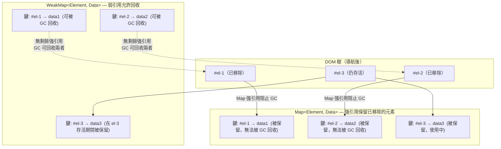

# WeakMap、WeakSet 與弱引用

`WeakMap` 和 `WeakSet` 對其鍵或值持有弱引用（weak reference）-- 「弱」意味著該引用不會阻止垃圾回收。若某個物件在一個 `WeakMap` 中的鍵是僅剩的引用，GC 便可回收它，且對應的條目會靜默消失。這使得它們天生不可迭代：沒有 `.forEach`、沒有 `.size`、沒有 `.keys()` -- 暴露這些介面會洩露 GC 的執行時機，而這在規格層面是刻意隱藏的。不可迭代性不是限制，而是設計中內建的正確性保證。

實際用途是在不阻礙物件被回收的前提下，將元資料與物件關聯。DOM 節點是最典型的例子：透過 `WeakMap<Node, Data>` 附加資料，當節點從文件移除並被回收時，清理是自動發生的。等效的 `Map<Node, Data>` 會隨著長壽命 SPA 不斷建立並銷毀元素而無限增長，因為 `Map` 對每個曾經見過的鍵都持有強引用 -- 即使對應的 DOM 節點已被移除、對應的元件樹已被卸載、對應的 UI 已被多次後續渲染取代。

`WeakRef`（ES2021）和 `FinalizationRegistry` 進一步擴展了這個模型，提供顯式弱引用和回收後回呼的能力。這些是較底層的原語，適用於快取和資源追蹤 -- 而非一般應用程式碼。GC 的執行時機是由實作決定的，因環境而異，且在語言規格上是刻意未指定的。一個物件可能在毫秒內被回收，也可能在整個進程的生命週期內都存活。切勿撰寫依賴回收何時發生（或是否發生）的邏輯。

四種弱原語 -- `WeakMap`、`WeakSet`、`WeakRef` 和 `FinalizationRegistry` -- 共享一個共同約束：鍵和被登錄的目標必須是物件（或在較新的引擎版本中，某些已登錄的符號）。字串、數字和布林等原始值不是 `WeakMap` 或 `WeakSet` 的有效鍵，因為原始值是值類型：沒有可以弱持有的身份，也沒有可以追蹤可達性的物件。這個限制在執行時期以 `TypeError` 強制執行。ES2023 將 `WeakMap` 和 `WeakSet` 擴展為也接受已登錄符號（`Symbol.for(key)` 的結果）作為鍵，它們具有全域身份且可透過鍵查找，而以 `Symbol()` 創建的未登錄符號因缺乏引擎追蹤 GC 目的所需的全域身份而仍非有效鍵。

## 使用情境

你正在開發一個元件函式庫，每個 DOM 元素都需要私有的元資料——唯一 ID 和內部狀態——且不應從元件外部存取。把這些資料存在元素本身會污染 DOM 節點的屬性。存入以元素為鍵的 `Map` 則會阻止被分離的元素被垃圾回收。`WeakMap` 同時解決了這兩個問題：它將私有資料與物件關聯，卻不妨礙物件在不再被參考時被回收。

## 設計思維

### WeakMap 作為私有欄位出現之前的私有欄位

在 JavaScript 引入 `#privateFields` 語法（2019 年進入 Stage 3，在 V8 7.2 及所有現代瀏覽器中出貨）之前，`WeakMap` 是在類別式物件中實作每個實例私有狀態的慣用方式。這個模式將一個 `WeakMap` 儲存在外層模組作用域中（在類別定義之外），以 `this` 作為鍵；方法透過使用當前實例作為鍵在模組作用域的 `WeakMap` 上執行查找來存取私有狀態。由於 `WeakMap` 不被匯出，外部程式碼無法存取私有狀態 -- 不像 `_private` 這樣的命名慣例，後者只是一種任何呼叫者都可以在不觸發執行時期錯誤的情況下忽略的社會契約。

這個模式之所以正確運作，原因在於：每個鍵就是實例本身，因此當實例變得不可達並被 GC 回收時，`WeakMap` 的條目也會自動釋放。無需手動清理、無記憶體洩漏、無需銷毀鉤子。`WeakMap` 也在模組邊界提供了真正的防篡改性：即使知道變數名稱，模組外部的程式碼也無法在不從模組匯入 `WeakMap` 引用的情況下呼叫 `map.get(someInstance)`。這比 `_private` 慣例提供了更強的隔離性，比 C++ 的編譯時期執行更弱 -- 但這恰好是 JavaScript 在語言獲得原生語法支援之前所需要的保護層級。

對於新程式碼，在支援 `#privateFields` 的每個環境中，`#privateFields` 都是更好的選擇。引擎直接將私有欄位儲存在物件的內部表示中，而不是在側邊表（side table）中，使屬性存取比 `WeakMap.get()` 查找更快。語法更可讀 -- `this.#count` 對比 `privateData.get(this).count`。沒有需要管理的模組作用域變數，沒有意外匯出錯誤符號的風險，也沒有每個模組頂部的樣板初始化。

基於 `WeakMap` 的私有資料在兩種具體情況下仍然是正確選擇。第一，私有狀態必須從類別定義之外存取時 -- 工廠模式、Mixin 模式、不是類別方法的模組級輔助函式。第二，在沒有轉譯器的情況下針對不支援 `#privateFields` 的環境時。在所有其他情況下，`#privateFields` 是正確的預設選擇。

### Map 與 WeakMap 的比較

以下表格總結了決定在特定情況下應選擇哪種類型的行為差異：

| 面向 | `Map` | `WeakMap` |
|------|-------|-----------|
| 引用類型 | 強引用（阻止 GC） | 弱引用（允許 GC） |
| 鍵類型 | 任意值（原始值、物件） | 僅物件（或已登錄符號） |
| 可迭代 | 是（`.forEach`、`.keys()`、`.entries()`） | 否 |
| `.size` 屬性 | 是 | 否 |
| 條目生命週期 | 需要顯式刪除 | 跟隨鍵的生命週期 |
| 使用場景 | 通用鍵值儲存 | 物件關聯的元資料 |
| 記憶體風險 | 無限期保留鍵 | 鍵被回收時自動清理 |

這個表格明確了取捨：`Map` 功能更強大（任意鍵類型、可迭代、可查詢大小），但這種能力伴隨著手動清理的責任。`WeakMap` 被刻意限制 -- 無迭代、無大小 -- 正是因為這些限制使自動清理成為可能。你不可能忘記清理 `WeakMap` 的條目，因為清理不是你的責任。

### DOM 元資料與記憶體洩漏

SPA 程式碼中最常見的生產環境記憶體洩漏有一個可預測的結構：用 `Map` 或普通物件作為登錄表，將資料與 DOM 元素、元件或請求物件關聯。元素在導航期間建立，其資料儲存在登錄表中，元素之後被銷毀並從 DOM 中移除 -- 但登錄表仍持有每個元素的強引用。GC 無法回收這些元素，因為 `Map` 維持了一條從 GC 根節點到每個被保留元素的存活路徑。登錄表在應用程式的整個生命週期中持續增長。

這個模式以許多形式出現在典型的 SPA 程式碼庫中。儲存每個元素點擊次數或互動時間戳的事件追蹤函式庫使用 `Map<HTMLElement, TrackingData>`。儲存每個錨點工具提示狀態和定位的工具提示系統使用 `Map<HTMLElement, TooltipState>`。拖放系統儲存每個可拖動元素的拖動約束。動畫系統儲存每個動畫元素的關鍵幀狀態。表單驗證函式庫儲存每個輸入欄位的錯誤狀態。這些全都會在導航、元件重新渲染和列表更新期間積累條目，除非應用程式在元素被移除時明確刪除條目。

顯式刪除在實踐中是脆弱的。它依賴每條建立元素的程式碼路徑也提供一條呼叫清理的銷毀路徑，且那條銷毀路徑被每個框架生命週期鉤子、每個條件渲染和每個動態列表修改可靠地呼叫。在實踐中，銷毀路徑通常為正常路徑添加，但在錯誤路徑、元件升級路徑和開發期間的熱重載路徑中被省略。洩漏只在持續的真實使用情況下才會顯現，使其在程式碼審查或短暫的測試 session 中難以偵測。

`WeakMap` 從結構上解決了這個問題。由於 `WeakMap` 對其鍵持有弱引用，一個在 `WeakMap` 中的元素，只要不存在其他強引用，便可立即被回收。無手動清理步驟、無需記得呼叫的 `onDestroy` 鉤子、無可能在重構中被遺忘的 `registry.delete(element)` 呼叫。元素和資料之間的關係恰好存在於元素的生命週期內，一刻都不多。

這個區別在高頻率渲染和銷毀元件的框架中最為重要。React 的重新渲染在大型元件樹中每秒可以建立和捨棄數十個元素。Vue 的響應性系統在響應式更新時重新建立 DOM 節點。Angular 的結構指令在資料變化時持續建立和銷毀元素。基於 `Map` 的登錄表在整個 session 生命週期中為每個曾渲染過的元素積累一個條目，除非生命週期鉤子顯式清理。

### WeakSet 作為物件標記

`WeakSet` 是一個物件的集合，其中成員資格不會阻止回收。主要使用場景是追蹤某個物件是否已被處理 -- 同時不阻止該物件在處理完成後被回收。

遞迴遍歷物件圖的轉換函式需要偵測循環引用。使用 `Set` 的方案可行，但會在遍歷期間保持每個已訪問節點的存活。若訪問集合逃出遍歷作用域 -- 作為模組變數儲存以便跨呼叫重用，作為參數狀態傳遞給後續處理，或被閉包捕獲用於診斷目的 -- 節點將被永久保留。`WeakSet` 允許訪問過的物件在轉換完成且沒有其他程式碼持有強引用後被回收。

另一個相關的使用案例是圖形遍歷演算法中的循環偵測。在對可能含有循環的物件圖形進行深度優先搜尋時，一個追蹤已訪問節點的 WeakSet 可以防止無限遞迴，且在遍歷完成後不會保留這些節點。使用普通 Set 則會在呼叫遍歷的作用域存續期間保留所有已訪問節點——在框架情境中，這可能比遍歷本身長得多。

另一個使用場景是事件驅動系統中的去重。在處理請求或訊息物件之前，檢查它是否已在進行中項目的 `WeakSet` 中。當請求完成並被所有應用層程式碼丟棄後，`WeakSet` 的條目會自動消失。無需顯式清理，進行中的登錄表不會隨時間變得過時。

`WeakSet` 也適合在構造時對物件進行品牌標記（branding）以便在執行時期強制執行不變量。工廠函式在回傳物件前將每個產生的物件加入模組作用域的 `WeakSet`。需要品牌物件的方法在主體開始時呼叫 `brandedSet.has(this)`，若檢查失敗則拋出例外。由於成員資格使用 `WeakSet`，品牌不會阻止物件在所有應用層引用被釋放後被回收。

### WeakRef 與 FinalizationRegistry

`WeakRef` 包裝一個物件，讓你能夠取回它 -- 或者發現它已被回收 -- 而不阻止回收。你呼叫 `.deref()` 來獲取當前值；若物件仍然存活則回傳它，若已被回收則回傳 `undefined`。規格提供了一個重要的一致性保證：在同一個同步執行迴合中（單個任務或微任務檢查點），若 `.deref()` 一次回傳物件，它在同一迴合中不會回傳 `undefined`。這使得安全的使用模式成為可能：在同步區塊的開始呼叫一次 `.deref()`，將結果儲存在局部變數中，並在整個區塊中使用局部變數而無需重新檢查。不要多次呼叫 `.deref()` 且假設跨 `await` 邊界的一致性。

`WeakRef` 預期的使用場景是：可以在未命中時重新計算的快取（持有對昂貴物件的弱引用；若被回收，在下次存取時重新計算），可以獨立回收的大型物件的代理，以及追蹤存活實例但不影響其生命週期的除錯工具。一個關鍵觀察：引入 `WeakRef` 總是會新增一條在健康應用程式中永遠不會執行的程式碼路徑 -- 「快取值已被回收」的路徑。這條路徑必須是正確的、經過測試的，且最好在測試環境中透過 Node.js 的 `--expose-gc` 和 `global.gc()` 顯式調用 GC 來驗證。未測試的快取未命中路徑是一個最終會在生產環境記憶體壓力下浮現的潛伏錯誤。

`FinalizationRegistry` 在已登錄的物件被回收後執行回呼。回呼接收一個清理令牌 -- 你在登錄時提供的任意值，通常是識別符或次要資源控制代碼 -- 而不是物件本身，物件已消失。預期的使用場景是：在除錯建置中偵測遺漏的顯式清理，清理在次要儲存中按識別符保存資料的條目，以及透過 `Napi` 附加元件中 JavaScript 物件是原生控制代碼的薄包裝器的情況整合原生資源。

一個重要的登錄細節：傳遞給 `register()` 的清理令牌不能是被登錄的物件本身。將物件本身作為令牌傳遞會從登錄表創建對物件的強引用，阻止回收 -- 完全破壞了整個目的。始終傳遞一個獨立的值：字串鍵、數字 ID 或只包含清理所需資訊而不持有主要資源引用的次要物件。

兩個 API 的關鍵不變量：每條程式碼路徑都必須在無論回收是否發生的情況下都是正確的。`WeakRef` 目標在每次 `.deref()` 呼叫時都可能存活或已死。`FinalizationRegistry` 回呼可能在不同的任務、不同的微任務檢查點中執行，或者在整個進程生命週期內根本不執行。實作被明確允許在包括進程退出、積極的 GC 抑制和某些堆快照操作等場景下跳過終結回呼。只有在回收已發生時才正確，或只有在尚未發生時才正確的應用程式碼，是不正確的程式碼 -- 而不僅僅是運氣不好的程式碼。

### 引擎行為與可觀測性

`WeakMap` 和 `WeakSet` 不可迭代的原因比規格規則更深層。如果你可以列舉 `WeakMap` 的條目，你看到的條目集合會因為你在程式執行期間的哪個時間點呼叫 `.keys()` 而不同。在記憶體壓力下的機器上，GC 執行得更頻繁、更積極；在擁有充足堆記憶體的閒置機器上，條目可能持續更長時間。能夠迭代 `WeakMap` 的程式碼在不同執行、不同瀏覽器版本和不同硬體配置之間會有不同的行為。這正是不確定性行為的定義，規格透過完全禁止這個操作來消除它。

同樣的理由解釋了為何 `WeakRef.deref()` 可以在任何呼叫點回傳 `undefined`。規格本可以要求實作將 `WeakRef` 目標保持存活一段最短時間，或只在特定的檢查點回收它們。它刻意不這樣做 -- 因為任何這樣的保證都會以傷害效能的方式約束 GC 實作，且仍然不能給應用程式碼一個可靠的時機訊號。正確的回應是撰寫每次都處理兩種情況的程式碼。

V8 的垃圾回收器在「新生代」（minor GC）和「老生代」（major GC）週期中回收物件。只被 `WeakMap` 鍵持有的新建物件可能在下一個次要 GC 週期中被回收 -- 可能在毫秒內。已存活多次次要 GC 並晉升到老生代的較舊物件，在正常堆壓力下可能要等到主要 GC 執行，這可能要幾分鐘後。應用程式碼無法觀察或控制哪個週期適用於特定物件。正確的假設是：`WeakRef` 目標可能在任何時候被回收，任何依賴它的程式碼都必須處理回收情況。

將 `WeakMap` 和 `WeakSet` 設計為不可迭代，同樣反映了一種對應用層與執行時層邊界的刻意立場。迭代隱含著集合的穩定可查詢快照，而弱集合根本沒有穩定快照：其內容會因 GC 而改變，而這一過程既非應用程式發起，也非應用程式所能控制。暴露迭代介面，會讓 GC 的執行時機滲入可觀測的程式行為，將執行時的實作細節轉化為語意契約。透過完全禁止列舉操作，規格將 GC 時機嚴格地保留在執行時內部 -- 這正是它應在的位置 -- 並迫使應用程式碼以顯式方式對物件生命週期建立模型，而非從集合的成員資格去推斷生命週期。

以下表格總結了根據任務應選擇哪種弱原語：

| 任務 | 建議的原語 | 原因 |
|------|-----------|------|
| 關聯具有相同生命週期的物件資料 | `WeakMap` | 自動清理，無需迭代 |
| 追蹤「是否見過此物件」而不保留 | `WeakSet` | 僅成員資格檢查，無值儲存 |
| 不應阻止 GC 的快取 | `WeakRef` | 顯式 deref，需要快取未命中路徑 |
| 在開發建置中偵測遺漏的清理 | `FinalizationRegistry` | 安全網，非主要清理機制 |
| 每個實例的私有狀態 | `#privateFields`（優先），`WeakMap`（備用） | 欄位更快且更可讀 |

## 最佳實踐

**應該（SHOULD）在將元資料與 DOM 元素、類別實例或其他物件關聯，且元資料沒有獨立生命週期時，使用 `WeakMap`。** 最常見的誤用是在元件管理器、事件追蹤層或動畫系統中使用 `Map<Element, Data>`。當元素在導航或條件渲染期間被移除並替換時，`Map` 仍然保留它們，因為 `Map` 對所有鍵持有強引用，在長壽命 SPA 中無限增長。症狀是記憶體使用在整個 session 中穩定增長，在 Chrome DevTools 記憶體面板中可見為沒有來自文件根節點存活路徑的保留 `HTMLElement` 節點。`WeakMap` 在元素被回收時自動釋放條目，從結構上使洩漏不可能發生。無需 `onDestroy` 鉤子，無需 `registry.delete(el)` 呼叫，無脆弱的生命週期耦合 -- 清理是自動的且不可能在重構或元件函式庫升級期間被意外省略。另一方面，`WeakMap` 無法查詢其當前大小或迭代：若你需要這些能力，搭配顯式生命週期管理的 `Map` 是正確選擇。

**禁止（MUST NOT）依賴 `FinalizationRegistry` 回呼進行必須及時發生的資源清理。** 檔案控制代碼、網路連線、開啟的資料庫交易、WebSocket 連線和計時器取消，必須透過生命週期方法、`try/finally` 區塊、`using` 宣告（TC39 顯式資源管理提案，Stage 3）或框架銷毀鉤子進行顯式清理。`FinalizationRegistry` 回呼可能在被追蹤物件符合回收條件後數秒、數分鐘才執行，或永遠不執行。規格有意不保證時機或交付 -- 實作在特定場景下（包括進程終止和 GC 抑制）允許跳過終結回呼。將 `FinalizationRegistry` 作為偵測遺漏顯式清理的安全網 -- 開發建置中的診斷工具，而非釋放資源的主要機制。一個有用的心理模型：若完全移除 `FinalizationRegistry` 會在生產環境中造成正確性問題，則清理邏輯放在了錯誤的位置。

**應該（SHOULD）在現代 JavaScript 中優先使用 `#privateFields` 而非基於 `WeakMap` 的私有資料。** 私有類別欄位（所有現代瀏覽器、Node.js 12+）提供具有可讀語法的每個實例私有儲存，沒有側邊表 `WeakMap` 查找的間接開銷。引擎直接將私有欄位儲存在物件的隱藏類別上，使存取比 `WeakMap.get()` 呼叫更快、程式碼更易於閱讀和審查。在以下情況下，基於 `WeakMap` 的私有資料仍然是正確選擇：私有狀態必須從類別定義之外存取時（工廠函式、Mixin 模式、不是類別方法的模組級輔助函式），或在沒有轉譯器的情況下針對 `#privateFields` 之前的環境時。在所有其他情況下，`#privateFields` 是預設選擇，而 `WeakMap` 私有模式是一個值得理解但不值得在新程式碼中複製的歷史遺跡。

## 視覺呈現

以下圖表對比了 `Map` 和 `WeakMap` 在 DOM 元素從文件移除後如何與垃圾回收互動。兩個登錄表都以三個條目開始。在 `#el-1` 和 `#el-2` 從 DOM 移除且所有其他引用被釋放後，`Map` 透過強引用保留它們 -- 它們無法被回收。`WeakMap` 只持有弱引用；一旦不存在強引用，元素和它們的關聯條目都可被回收。



## 範例

```js
// =============================================================
// WeakMap：防止初始化狀態在元素被移除時洩漏。
//
// 普通 Map 會永遠保留每個傳入 initComponent() 的元素 --
// 即使在移除後。WeakMap 在元素變得不可達時自動釋放條目。
// =============================================================

const initialized = new WeakMap();

function initComponent(el) {
  if (initialized.has(el)) return;
  initialized.set(el, true);
  el.addEventListener('click', handleClick);
  // 當 el 從 DOM 移除且所有其他引用被丟棄後，
  // GC 可以回收 el。WeakMap 條目自動消失。
  // 無 registry.delete(el)，無 onDestroy 鉤子，無需記得呼叫清理。
}

// =============================================================
// WeakMap 作為私有類別狀態（歷史模式）。
// 現代程式碼應優先使用 #privateFields。
// 此處展示是為了說明 WeakMap 為何是 #field 之前的慣用方式。
// =============================================================

const _counter = new WeakMap(); // 私有於此模組

class Counter {
  constructor(initial = 0) {
    _counter.set(this, initial);
  }

  increment() {
    _counter.set(this, _counter.get(this) + 1);
  }

  get value() {
    return _counter.get(this);
  }
}
// 當 Counter 實例被 GC 回收時，其在 _counter 中的條目被釋放。
// 外部程式碼無法存取 _counter.get(instance) -- 它未被匯出。

// =============================================================
// WeakSet：在遞迴轉換中追蹤已訪問節點。
//
// Set 在遍歷期間保持每個已訪問節點的存活；
// WeakSet 在轉換完成後允許回收。
// =============================================================

function deepClone(obj, seen = new WeakSet()) {
  if (obj === null || typeof obj !== 'object') return obj;
  if (seen.has(obj)) return '[Circular]';
  seen.add(obj);
  const clone = Array.isArray(obj) ? [] : {};
  for (const key of Object.keys(obj)) {
    clone[key] = deepClone(obj[key], seen);
  }
  // deepClone 回傳後，`seen` 變得不可達。
  // WeakSet 中的所有成員，若沒有其他引用持有，都可被 GC 回收。
  return clone;
}

// =============================================================
// WeakRef：不阻止值被回收的快取。
//
// 必須正確處理兩條路徑：
//   1. 快取命中：ref.deref() 回傳物件
//   2. 快取未命中：ref.deref() 回傳 undefined（物件已被回收）
// =============================================================

class WeakCache {
  #store = new Map();

  set(key, value) {
    this.#store.set(key, new WeakRef(value));
  }

  get(key) {
    const ref = this.#store.get(key);
    if (!ref) return undefined;
    // 呼叫一次 deref()；儲存在局部變數中以安全重用。
    // 不要多次呼叫 deref() -- GC 可能在呼叫之間執行。
    const value = ref.deref();
    if (value === undefined) {
      // 快取的值已被回收。移除過期條目。
      // 這條路徑必須被測試 -- 在健康的應用中永遠不會觸發，
      // 但最終會在生產環境中出現。
      this.#store.delete(key);
    }
    return value; // undefined 表示未命中；呼叫者必須重新計算
  }
}

// =============================================================
// FinalizationRegistry：在開發中偵測遺漏的清理。
//
// 作為安全網使用 -- 而非主要清理機制。
// 回呼可能延遲執行或永遠不執行；不要依賴它們的正確性。
// 顯式清理（try/finally、生命週期鉤子、`using` 宣告）
// 必須保持為主要機制。
// =============================================================

const devRegistry = new FinalizationRegistry((label) => {
  // 已登錄的物件已消失。
  // 只有清理令牌（label 字串）在此可用。
  console.warn(
    `[dev] 資源 "${label}" 在未顯式清理的情況下被 GC 回收。` +
    `請確認 dispose() 在所有程式碼路徑中都被呼叫。`
  );
});

function createManagedResource(label) {
  const resource = { label, buffer: new ArrayBuffer(1024 * 1024) };
  if (process.env.NODE_ENV === 'development') {
    // 以令牌登錄，而不是物件本身 --
    // 將物件作為令牌傳遞會阻止其回收。
    devRegistry.register(resource, label);
  }
  return resource;
}
```

## 常見錯誤

**對 DOM 關聯資料使用 `Map` 而非 `WeakMap`，在 SPA 中造成記憶體洩漏。** 症狀是記憶體使用在整個 session 中穩定增長，在 Chrome DevTools 記憶體面板中可見為沒有來自文件的存活路徑的保留 `HTMLElement` 節點。原因是以已從 DOM 移除的元素為鍵的 `Map<Element, any>` -- `Map` 持有強引用，所以元素無法被回收。這在每次導航時累積：每次頁面訪問都增加更多被保留的元素，應用程式的記憶體基準持續上升直到關閉或重新整理分頁。要診斷，可在 DevTools 中拍攝堆快照，按 `HTMLElement` 過濾，並尋找帶有 `@Detached` 前綴的節點 -- 這些是候選對象。修正：在鍵的生命週期就是關聯值的自然生命週期且不需要列舉條目的地方，將 `Map` 替換為 `WeakMap`。

**嘗試迭代 `WeakMap` 或讀取其 `size`。** `WeakMap` 和 `WeakSet` 刻意省略了 `.forEach`、`.size`、`.keys()`、`.values()` 和 `.entries()`。這不是疏忽 -- 暴露迭代會讓應用程式碼觀察到 GC 的執行時機，而規格明確禁止這一點，因為這會造成因引擎、執行環境版本、記憶體壓力和 GC 排程而異的不確定性行為。若需要列舉關聯資料，使用普通 `Map`（接受強引用語意），或使用將鍵識別符映射到資料值的獨立索引，結合在已知生命週期事件上的顯式刪除。需要列舉的需求通常是一個訊號，表明關聯具有不同的生命週期模型，`Map` 是正確的選擇。

**撰寫假設在 `setTimeout` 之後目標已被回收的 `WeakRef` 依賴邏輯。** 初次使用 `WeakRef` 時的常見錯誤是：等待固定間隔，然後檢查 ref 是否已被回收，若是則執行清理。這在兩個方向上都是錯誤的。GC 可能在超時之前、超時期間或在整個進程生命週期內根本不回收目標。`WeakRef` 的目標在每次 `.deref()` 呼叫時都必須被視為可能存活或可能已死 -- 而不是在計時器選擇的「安全」時間點。`undefined` 情況（已回收）和存活物件情況都必須正確處理，且與任何時機假設無關。只處理一種情況的程式碼是不正確的，而不僅僅是不太可能失敗。

**將已登錄物件本身作為其清理令牌傳遞給 `FinalizationRegistry`。** 呼叫 `registry.register(obj, obj)` 將對 `obj` 的強引用作為清理令牌傳遞。登錄表在內部持有那個強引用，阻止 `obj` 被回收 -- 完全破壞了整個目的。始終傳遞一個獨立的值作為令牌：字串鍵、數字識別符，或只包含清理工作所需資訊而不持有被追蹤主要物件引用的次要資料結構。

## 相關 FEE

- **[FEE-300](/zh-tw/JavaScript%20Core%20and%20Runtime/300)** -- JavaScript 核心與執行環境總覽：理解 JavaScript 物件模型和引用語意的基礎概念，這些語意是弱集合行為的基礎
- **[FEE-306](/zh-tw/JavaScript%20Core%20and%20Runtime/306)** -- 記憶體管理與垃圾回收：標記清除演算法、GC 根節點，以及為何可達性決定物件的生命週期 -- 使弱引用有意義的機制
- **[FEE-401](/zh-tw/DOM%20and%20Browser%20APIs/401)** -- DOM 操作與遍歷：`WeakMap<Node, Data>` 最常應用且對應用程式記憶體健康最有影響的場景

## 參考資料

- [MDN: WeakMap](https://developer.mozilla.org/en-US/docs/Web/JavaScript/Reference/Global_Objects/WeakMap) -- 完整的 API 參考，包含不可迭代性的設計理由，以及與 GC 互動的說明
- [MDN: WeakSet](https://developer.mozilla.org/en-US/docs/Web/JavaScript/Reference/Global_Objects/WeakSet) -- API 參考，涵蓋有效值類型、成員資格檢查，以及與 `Set` 的比較
- [MDN: WeakRef](https://developer.mozilla.org/en-US/docs/Web/JavaScript/Reference/Global_Objects/WeakRef) -- API 參考，包含同一迴合一致性保證、預期使用場景說明，以及 GC 時機的注意事項
- [MDN: FinalizationRegistry](https://developer.mozilla.org/en-US/docs/Web/JavaScript/Reference/Global_Objects/FinalizationRegistry) -- 回呼登錄、清理令牌語意，以及回呼不保證執行的明確說明
- [TC39: WeakRef proposal](https://github.com/tc39/proposal-weakrefs) -- 原始 TC39 提案，包含激勵使用場景、設計理由、GC 時機不變量的討論，以及這些 API 不適用情境的明確指引
- [ECMA-262: WeakRef Objects](https://tc39.es/ecma262/#sec-weak-ref-objects) -- 定義 `WeakRef`、同一迴合存活保證，以及允許的 GC 時機行為的規範性規格文本
- [V8 Blog: Orinoco -- young generation garbage collection](https://v8.dev/blog/orinoco-parallel-scavenger) -- V8 的分代 GC 設計，解釋次要和主要回收週期，以及為何從應用程式碼來看回收時機是不確定的
- [Chrome DevTools: Fix memory problems](https://developer.chrome.com/docs/devtools/memory-problems/) -- 診斷保留 DOM 節點造成的記憶體洩漏的實用指南，包含如何使用堆快照識別基於 `Map` 的洩漏
- [MDN: Private class fields](https://developer.mozilla.org/en-US/docs/Web/JavaScript/Reference/Classes/Private_class_fields) -- 基於 `WeakMap` 的私有資料的現代替代方案，包含語法、瀏覽器支援表，以及與 `WeakMap` 模式的比較
- [TC39: Symbols as WeakMap keys proposal](https://github.com/tc39/proposal-symbols-as-weakmap-keys) -- ES2023 將已登錄符號作為 `WeakMap` 和 `WeakSet` 鍵的擴展，包含動機和設計理由
- [MDN: JavaScript 記憶體管理](https://developer.mozilla.org/en-US/docs/Web/JavaScript/Memory_management) -- 引用計數與標記清除 GC 的總覽，可達物件的生命週期，以及 JavaScript 應用中的常見記憶體洩漏模式
- [ECMA-262: WeakMap Objects](https://tc39.es/ecma262/#sec-weakmap-objects) -- `WeakMap` 的規範性規格，包含弱引用的正式定義，以及引擎在 GC 排序方面必須滿足的不變量
- [MDN: FinalizationRegistry 清理回呼說明](https://developer.mozilla.org/en-US/docs/Web/JavaScript/Reference/Global_Objects/FinalizationRegistry#notes_on_cleanup_callbacks) -- 清理回呼何時執行的說明，以及將 GC 事件用作可觀察應用程式信號的限制
- [MDN: 使用 Web Performance API](https://developer.mozilla.org/en-US/docs/Web/API/Performance_API/Using_the_Performance_API) -- 在實際工作負載下量測 `WeakMap` 與 `Map` 效果的記憶體和時序工具


