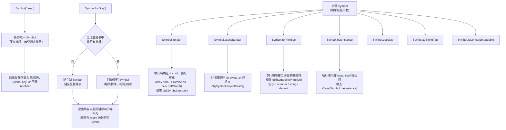

# Symbol 與內建 Symbol

`Symbol` 是 ES2015 引入的原始型別。每個 Symbol 值都是唯一的 —
`Symbol('tag') !== Symbol('tag')` — 因此 Symbol 適合作為屬性鍵，保證不會與
任何其他鍵發生衝突，無論是來自使用者程式碼、函式庫程式碼或 JS 引擎本身。與
字串、整數或布林值不同，Symbol 無法從資料中重新建立：若要取得先前建立的
Symbol，必須持有該值的參考，或使用明確的全域登錄表。唯一性保證是無條件的，
不依賴命名慣例、命名空間策略或呼叫方的自律。Symbol 也不會自動轉換為字串 —
嘗試在字串拼接中使用 Symbol 會拋出 `TypeError`，能及早捕捉意外的型別強制
轉換。

內建 Symbol（Well-known Symbols）是 JavaScript 執行環境用來設定內建操作行為
的內建 Symbol 值。`Symbol.iterator` 讓物件可被迭代；`Symbol.toPrimitive` 自訂
型別強制轉換；`Symbol.hasInstance` 自訂 `instanceof` 行為；`Symbol.species`
自訂衍生建構子。這些 Symbol 在不建立保留屬性名稱的前提下，為語言本身的語意
提供了擴充點。引擎在演算法執行的特定時機會查找物件上的內建 Symbol 屬性，若
存在且可呼叫則執行之；若不存在則套用預設行為。這就是使用者自訂類別無需修改
語言規範，便能參與語言層級操作的機制。完整的內建 Symbol 清單在 ECMAScript 規
範的「Well-Known Symbols and Intrinsics」章節中列舉。

以 Symbol 為鍵的屬性不會被 `for...in`、`Object.keys()` 或 `JSON.stringify()`
列舉。它們可透過 `Object.getOwnPropertySymbols()` 和 `Reflect.ownKeys()` 存取。
這使得 Symbol 非常適合在不影響一般列舉或序列化的情況下，將元資料或協議方法
附加至物件上。函式庫可以用 Symbol 標記物件的處理狀態、快取鍵或協議標記，而
這些標記不會出現在開發者主控台輸出、序列化 payload 或迭代迴圈中。屬性依設計
為非列舉，而非密碼學意義上的隱藏，任何持有該 Symbol 的程式碼均可完整存取該
屬性。`Reflect.ownKeys()` 回傳完整的自有屬性鍵集合，包含字串鍵和 Symbol 鍵，
是不論鍵型別如何都能檢查物件所有屬性的權威方式。

## 使用情境

你正在為一個自訂資料結構實作迭代器，讓它能搭配 `for...of` 迴圈、展開運算子和解構賦值使用。要做到這一點，必須透過 `Symbol.iterator` 接入語言的迭代協議。Symbol 提供了唯一的非字串屬性鍵，JavaScript 執行環境將其識別為協議掛鉤——`Symbol.iterator`、`Symbol.toPrimitive`、`Symbol.hasInstance`——讓你的物件能夠參與語言內建的行為。

## 設計思維

### Symbol 作為不碰撞的屬性鍵

字串屬性鍵共用一個扁平的命名空間。若兩段程式碼為了不同目的恰好選擇了相同
的字串鍵，任何同時收到這兩種標注的物件都會靜默地共享同一個屬性槽位。這不
是理論上的顧慮：`__proto__`、`constructor`、`toString` 和 `valueOf` 等鍵在用
於使用者提供的資料情境時，都曾導致真實的安全性與正確性問題。以底線或雙底線
為前綴的函式庫內部鍵慣例，只是一種社會契約 — 它降低了意外碰撞的機率，但無
法防止刻意碰撞，也無法防止兩個都選擇了 `__internalState` 的函式庫之間的意外
碰撞。這個底線慣例在執行時期完全沒有強制力：任何呼叫方都可以在零阻力的情況
下讀取、覆蓋或刪除 `obj._internalState`。

Symbol 鍵從結構上解決了這個問題。鍵不是從任何呼叫方可以複製的字串衍生而來，
而是在模組評估時建立的唯一不透明值。當函式庫將其內部狀態儲存在 Symbol 鍵下，
只有持有該 Symbol 參考的程式碼才能存取該槽位 — 即同一模組中的程式碼，或模
組明確選擇將 Symbol 匯出給予的程式碼。函式庫內部狀態的慣用模式是在模組作用
域建立帶有描述性字串的 Symbol，在整個模組中用作屬性鍵，且永不匯出。外部程
式碼無法透過列舉看到它、無法透過 `JSON.stringify` 看到它，也無法意外讀取或
覆蓋它。

傳遞給 `Symbol()` 的描述字串純粹是資訊性的。在兩次獨立呼叫中建立的
`Symbol('myLib.processedFlag')` 和 `Symbol('myLib.processedFlag')` 是兩個不同
的 Symbol — 這個字串會被除錯器顯示、由 `sym.toString()` 回傳，並可透過
`sym.description` 存取，但它在身份識別或查找中不起任何作用。兩個具有相同描
述的 Symbol 並不相等，引擎不會混淆它們，也不會發生碰撞。這使得選擇人類可讀
的描述字串是安全的，不會有與恰好選擇了相同字串的程式碼意外共享 Symbol 的風
險。

Symbol 鍵的非列舉性不僅關乎隱私，還有更廣泛的意義。對物件進行儀器化
（instrument）或序列化的函式庫 — 記錄器、ORM、JSON 序列化器、狀態管理函式
庫 — 全都依賴 `Object.keys()` 或 `for...in` 來確定要處理哪些屬性。Symbol 鍵
的屬性對所有這些都是不可見的。模型物件上的 Symbol 鍵內部旗標永遠不會出現在
序列化的 API 回應中、不會作為物件資料的一部分被記錄，也不會像資料屬性一樣
被迭代。這是正確的行為：內部實作細節不是資料，處理物件公開介面的程式碼不應
將其視為資料。這種分離由語言強制執行，而非由慣例、文件或自律來保證。

即使透過 `Reflect.ownKeys` 存取，`JSON.stringify` 也無法序列化以 `Symbol()`
建立的 Symbol 鍵屬性。Symbol 鍵屬性會被 JSON 序列化器完全跳過，這意味著沒有
意外透過 JSON API 邊界洩漏內部狀態的風險。這與在字串鍵屬性上使用
`enumerable: false` 不同，後者會隱藏屬性使其不出現在 `Object.keys()` 和
`for...in` 中，但仍可透過 `Object.getOwnPropertyDescriptor()` 存取，且仍存在
於與所有其他屬性相同的字串命名空間中。Symbol 鍵一步提供了非列舉性和命名空
間隔離。

### 內建 Symbol 作為擴充點

JavaScript 規範在 `Symbol` 建構子物件下定義了一組 Symbol —
`Symbol.iterator`、`Symbol.asyncIterator`、`Symbol.toPrimitive`、
`Symbol.hasInstance`、`Symbol.species`、`Symbol.toStringTag`、
`Symbol.isConcatSpreadable`、`Symbol.unscopables` 等。這些被稱為內建 Symbol，
因為它們是語言執行環境本身所知道的。在內建演算法執行的特定時機，引擎會檢查
物件是否具有以內建 Symbol 為鍵的屬性，若存在則呼叫之。

`Symbol.iterator` 是最廣泛使用的。可迭代協議規定，若物件在 `Symbol.iterator`
處有一個方法，且該方法回傳一個迭代器 — 即具有回傳 `{ value, done }` 對的
`next()` 方法的物件 — 則該物件為可迭代的。當 `for...of` 執行時、當展開語法
展開可迭代物件時、當解構從序列中取出值時，或當 `Array.from()` 轉換為陣列時，
引擎會呼叫 `obj[Symbol.iterator]()`。這意味著任何物件 — 自訂集合、惰性範圍、
資料庫游標、分頁 API 包裝器 — 只需在一個內建 Symbol 鍵上實作一個方法，即可
參與所有這些語法形式。若沒有 `Symbol.iterator`，所有這些使用情境都需要使用
者手動呼叫特定類別的方法，並失去與語言內建功能的互通性。

`Symbol.toPrimitive` 控制當 JavaScript 需要原始值時物件如何被強制轉換。該方
法接收一個提示 — `"number"`、`"string"` 或 `"default"` — 並回傳適當的原始值。
若沒有 `Symbol.toPrimitive`，引擎會以依賴上下文的順序回退至 `valueOf` 和
`toString`。有了 `Symbol.toPrimitive`，物件的作者對每種上下文的強制轉換行為
擁有完整控制，並在一處明確記錄。`Symbol.hasInstance` 讓類別可以自訂
`instanceof` 的意義 — 類別可以聲明其他建構子的實例或具有特定形狀的物件滿足
`instanceof MyClass`，從而實現以語言關鍵字支撐的鴨子型別風格實例檢查。
`Symbol.toStringTag` 控制 `Object.prototype.toString.call(obj)` 回傳的字串，
讓自訂物件在除錯器和序列化器中顯示為 `[object MyClass]`。`Symbol.asyncIterator`
將迭代器協議擴展至非同步迭代：`for await...of` 首先查找 `Symbol.asyncIterator`，
僅在非同步上下文中消費同步可迭代物件時才回退至 `Symbol.iterator`。

所有內建 Symbol 的模式是一致且刻意設計的。執行環境檢查 Symbol 屬性，若存在
則呼叫，若不存在則套用預設演算法。任何類別都不需要繼承基礎類別、實作介面宣
告或向任何登錄表註冊。方法的存在本身就是介面。這是一個根本性的設計選擇：語
言將協議鉤子作為選擇性加入的 Symbol 鍵屬性提供，而非作為繼承要求或登錄機制。
它的組合性更好、需要更少的樣板程式碼，並避免了脆弱基礎類別問題。

考慮與假設的繼承式設計的對比。若可迭代性需要繼承 `Iterable` 基礎類別，那麼
任何已經繼承了其他類別的類別若沒有多重繼承就無法成為可迭代的。若可迭代性需
要呼叫登錄函式，那麼所有可迭代類別都需要在某個時點執行該登錄，才能在可迭代
上下文中使用。Symbol 方式兩者都不需要：在一個鍵上實作一個方法，物件就能在
任何呼叫上下文中參與協議，包括在任何特定執行時期模組載入之前。這就是為什麼
內建 Symbol 是語言層級擴充點的正確機制。

### Symbol.for 與全域登錄表

`Symbol.for(key)` 從以字串為鍵的跨 realm 全域登錄表中建立或取得 Symbol。第
一次以給定字串呼叫時，會建立一個新 Symbol 並儲存在登錄表中；之後以相同字串
的每次呼叫都回傳同一個 Symbol。`Symbol.keyFor(sym)` 是反向操作：它接受一個
Symbol，若該 Symbol 是由 `Symbol.for` 建立的則回傳登錄表鍵字串，若是由
`Symbol()` 建立且不在登錄表中則回傳 `undefined`。這對操作提供了鍵字串與全
域共享 Symbol 之間的完整雙向查找。

`Symbol.for` 的目的是跨 realm 共享。在瀏覽器環境中，每個 iframe 都有自己的
realm，擁有自己的全域物件集合和自己的模組評估上下文。在一個 iframe 中以
`Symbol()` 建立的 Symbol 與在另一個 iframe 中以 `Symbol()` 建立的 Symbol 不
是同一個物件，即使兩者使用了相同的描述字串。`Symbol.for('myApp.serializable')`
在兩個 realm 中都回傳相同的 Symbol，因為全域 Symbol 登錄表在同一個 agent
cluster 的所有 realm 之間共享。這對於在多個 bundle 中發佈的函式庫、不同團隊
擁有不同 realm 的微前端架構，以及 Symbol 需要作為獨立載入程式碼之間共享協議
鍵的情況非常重要。

模組層級常數與此的區別很重要。模組層級的 `const sym = Symbol()` 在模組評估
時建立一個唯一的 Symbol 並匯出之。任何匯入該模組的程式碼都會收到相同的
Symbol — 因為模組實例會被快取，同一個模組物件會回傳給 realm 內的所有匯入者。
對於單 realm 應用程式而言這已足夠。然而，模組快取是每個 realm 獨立的，因此
在兩個不同 realm 中評估的相同模組會產生兩個不同的模組實例和兩個不同的
Symbol。`Symbol.for` 透過完全繞過模組系統、直接存取全域登錄表來避免這個問題。
登錄表字串實際上成為一個全域名稱 — 這意味著必須謹慎選擇，以避免與登錄表的
其他使用者發生衝突，就像任何其他全域命名空間一樣。

跨 realm 協議的常見模式是使用類似反向域名風格的登錄表鍵，例如
`'com.mycompany.mylib.marker'`，類似 Java 套件命名慣例，以降低在無結構全域
登錄表中碰撞的機率。沒有正式的命名空間機制，但這個慣例被廣泛理解。透過
`Symbol.for` 公開共享 Symbol 的函式庫應明確記錄鍵字串，將其視為有版本的公
開 API，且一旦發佈後永不更改字串，因為更改它會靜默地破壞其他 realm 中所有
依賴原始字串來取得共享 Symbol 的程式碼。

### TypeScript 中的 Symbol

TypeScript 提供 `unique symbol` 型別，在型別層級表示特定的 Symbol 值。當
Symbol 宣告為 `const sym: unique symbol = Symbol()` 時，TypeScript 將該 Symbol
的型別視為與所有其他 Symbol 不同的型別，使其能夠用作具型別的計算屬性鍵。即
使在執行時期兩個 `unique symbol` 宣告都持有一個 Symbol，它們在型別層級上也
是不同的型別 — 型別系統模擬了 `Symbol()` 的唯一性保證。`unique symbol` 型別
只能賦值給 `const` 宣告或 `readonly static` 類別屬性；`let` 宣告持有更廣泛的
`symbol` 型別，即所有 Symbol 值的聯集。

使用 Symbol 的計算屬性鍵採用括號語法：物件字面量中的 `{ [sym]: value }`，或
類別主體中作為方法名稱的 `[sym]()`。TypeScript 根據 `unique symbol` 型別推斷
這些屬性的型別，因此屬性會出現在 `keyof` 結果中，並可以型別安全的方式存取。
在型別層級，`typeof sym` 表達式參考的是與該 `const` 宣告關聯的特定
`unique symbol` 型別 — 而非執行時期 `typeof` 運算子回傳的字串 `"symbol"`。使
用 Symbol 鍵進行介面擴充（interface augmentation）需要 Symbol 為 `const` 且其
型別為 `unique symbol`，TypeScript 才能將該鍵視為獨特的屬性槽位，而非一般的
`symbol` 索引簽名。

在 TypeScript 中實作內建 Symbol 時，方法簽名與 `lib.es2015.iterable.d.ts` 及
相關檔案中標準函式庫型別定義所定義的簽名一致。實作 `Symbol.iterator` 的類別
應符合 `Iterable<T>` 介面，TypeScript 會驗證該方法回傳可指派給 `Iterator<T>`
的物件。具型別的可迭代物件可直接與 `for...of`、陣列解構和展開在型別系統中整
合：TypeScript 從泛型參數中知道元素型別，並在各使用點套用它，無需明確的型別
標注。這是 TypeScript 結構化型別系統與 JavaScript 結構化執行時期行為一致的典
型範例 — 型別和執行時期協議都由值的形狀定義，而非由任何宣告或登錄來定義。

## 最佳實踐

**應該（SHOULD）使用 `Symbol()` 作為附加至使用者提供物件的函式庫內部屬性鍵，
而非字串鍵。** `_internalState` 或 `__processed` 之類的字串鍵對使用者程式碼
可見、會被 `Object.keys()` 列舉、會被包含在 `JSON.stringify()` 輸出中，且容
易與任何恰好選擇了相同名稱的其他程式碼發生衝突。Symbol 鍵對標準列舉不可見
且保證唯一，是任何需要標注使用者物件作為實作一部分的函式庫的正確選擇。傳遞
給 `Symbol()` 的描述字串僅供除錯使用，出現在 `sym.toString()` 的輸出中 — 它
不影響唯一性、身份識別或可存取性，選擇描述性字串在碰撞機率上沒有任何代價。

**必須（MUST）在任何應能以 `for...of`、展開語法、解構或 `Array.from()` 進行
迭代的自訂集合類別上實作 `Symbol.iterator`。** 可迭代協議是 JavaScript 自訂
迭代的標準。未實作此協議的類別會迫使使用者呼叫特定實作的方法（如 `.toArray()`
或 `.forEach()`），而非標準語法，破壞與所有接受可迭代物件的 API 的互通性，包
括 `Promise.all`、`new Set()`、`new Map()` 以及語言或平台未來新增的每個 API。
物件為可迭代的充要條件是：它具有一個 `Symbol.iterator` 方法，且該方法回傳符
合迭代器協議的迭代器 — 即具有回傳 `{ value, done }` 對的 `next()` 方法的物
件。實作此協議一次，即可解鎖對所有現有及未來語言功能的參與。

**禁止（MUST NOT）在意圖建立唯一、非共享鍵時使用 `Symbol.for()`。**
`Symbol.for('myLib.state')` 會向任何 realm 中呼叫 `Symbol.for('myLib.state')`
的任何程式碼回傳相同的 Symbol，包括恰好使用了相同登錄表字串的不相關程式碼。
全域登錄表沒有命名空間機制：鍵字串就是整個命名空間，任何知道它的呼叫方都能
獲得關聯 Symbol 的存取權。若唯一性與不碰撞性是目標，請使用 `Symbol()` — 無
登錄表查詢、無共享命名空間、每次呼叫保證唯一。將 `Symbol.for()` 保留給明確
共享協議 Symbol 的情境，即跨 realm 可存取性是明確需求的情況，並將登錄表鍵字
串視為公開 API，承擔版本管理和避免碰撞的全部責任。

## 視覺呈現



## 範例

```js
class Range {
  constructor(start, end) {
    this.start = start;
    this.end = end;
  }

  [Symbol.iterator]() {
    let current = this.start;
    const end = this.end;
    return {
      next() {
        return current <= end
          ? { value: current++, done: false }
          : { value: undefined, done: true };
      }
    };
  }
}

// for...of
for (const n of new Range(1, 5)) {
  console.log(n); // 1, 2, 3, 4, 5
}

// 展開語法
console.log([...new Range(1, 3)]); // [1, 2, 3]

// 解構
const [a, b, c] = new Range(10, 12);
console.log(a, b, c); // 10 11 12

// Array.from
console.log(Array.from(new Range(1, 4))); // [1, 2, 3, 4]

// 與 Promise.all、new Set、new Map 等任何接受可迭代物件的 API 均相容
console.log(new Set(new Range(1, 3))); // Set(3) {1, 2, 3}
```

## 常見錯誤

將 `Symbol.for('desc')` 與 `Symbol()` 混淆是最常見的錯誤。呼叫
`Symbol.for('myLib.processedFlag')` 的程式碼以為自己擁有一個私有鍵，但任何
其他呼叫 `Symbol.for('myLib.processedFlag')` 的模組 — 包括在不同 bundle、不
同套件或不同來源 realm 中的程式碼 — 都會收到完全相同的 Symbol，並獲得對函式
庫原本打算作為私有的相同屬性槽位的存取權。隱私的幻覺只要任何呼叫方知道或猜
到登錄表字串就會被打破。修正方式永遠是對私有鍵使用 `Symbol()`。

嘗試以 `new Symbol()` 呼叫 `Symbol` 作為建構子會拋出 `TypeError`。`Symbol` 是
工廠函式，而非建構子。這個限制是刻意的：它防止建立 Symbol 包裝物件，而包裝
物件會是物件而非原始值，且會以參考而非值進行比較。正確的呼叫方式是 `Symbol()`
或 `Symbol('description')` — 無需 `new`。同樣，`typeof Symbol('desc')` 回傳
`"symbol"`，確認了其原始型別的本質。

在使用者物件的函式庫私有狀態上使用字串鍵而非 Symbol 鍵，會造成靜默的共享命
名空間錯誤。這個錯誤在使用者或另一個函式庫恰好選擇了相同鍵名之前是不可見的，
一旦發生，兩段獨立的邏輯會在沒有任何錯誤、警告或指向碰撞的堆疊追蹤的情況下，
互相讀取和覆蓋彼此的狀態。失敗模式是行為性損壞 — 通常表現為難以重現或除錯
的間歇性狀態不一致。

將同步可迭代物件移植至非同步時，忘記實作 `Symbol.asyncIterator` 是一個常見
的遺漏。`for await...of` 首先檢查 `Symbol.asyncIterator`，僅在非同步上下文中
消費同步可迭代物件時才回退至 `Symbol.iterator`。一個從 `next()` 回傳 Promise
但只註冊了 `Symbol.iterator` 的類別，在某些消費上下文中可以工作，在其他上下
文中則會失敗或產生意外行為 — 特別是在檢查 `Symbol.asyncIterator` 以分支行為
的管線中。非同步可迭代物件應明確定義 `Symbol.asyncIterator`，並在需要提前終
止時實作感知 `return`/`throw` 的迭代器。

## 相關 FEE

- FEE-300 — JavaScript 核心與執行環境總覽
- FEE-308 — 迭代器、產生器與非同步迭代
- FEE-311 — Proxy 與 Reflect API

## 參考資料

- MDN: Symbol — https://developer.mozilla.org/en-US/docs/Web/JavaScript/Reference/Global_Objects/Symbol
- MDN: Well-known Symbols — https://developer.mozilla.org/en-US/docs/Web/JavaScript/Reference/Global_Objects/Symbol#well-known_symbols
- Axel Rauschmayer: Symbols in ECMAScript 6 — https://2ality.com/2014/12/es6-symbols.html
- MDN: Iteration protocols — https://developer.mozilla.org/en-US/docs/Web/JavaScript/Reference/Iteration_protocols
