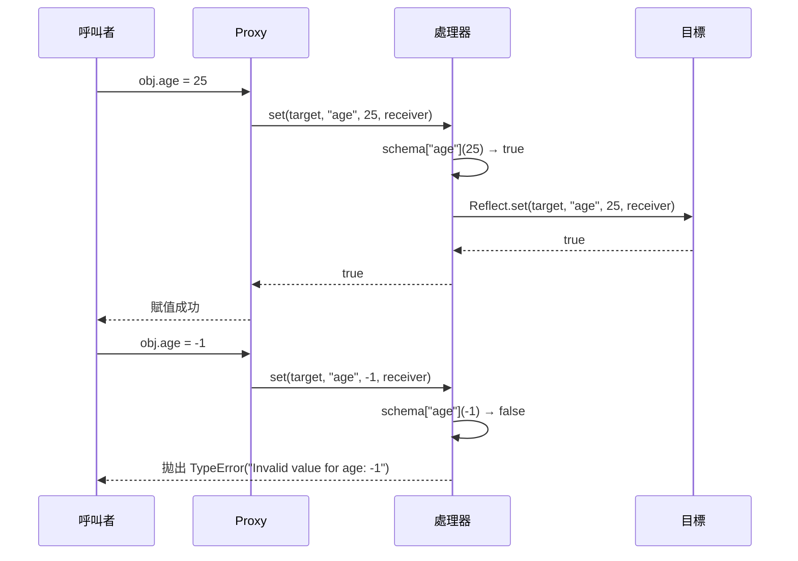

# Proxy 與 Reflect API

`Proxy` 允許 JavaScript 物件攔截基本操作 — 屬性讀取、屬性寫入、函式呼叫、
`in` 運算子、`delete`、`Object.keys()`、原型存取 — 並以自訂行為取代預設行為。
Proxy 包裝一個目標物件；對 Proxy 的操作由處理器（handler）物件中的陷阱函式
（trap）攔截，陷阱可以觀察、修改或阻擋每個操作。目標物件本身不受影響；Proxy
是一個獨立的物件，位於目標前方，控制外部世界與它的互動方式。這種攔截發生在
語言層級，而非透過方法覆寫或繼承：任何只持有 Proxy 參考的程式碼都無法繞過
陷阱，無論它如何存取該物件。Proxy 是在 ES2015 中引入的，是該版本最重要的元程
式設計新增功能；在此之前，JavaScript 沒有任何機制能夠以透明的方式攔截屬性存
取，而 `Object.defineProperty` 的 getter/setter 只能在定義屬性時靜態設定，無
法覆蓋已有屬性或動態應用於整個物件。

這正是 Vue 3 響應式系統、Immer 的 produce 函式，以及多個驗證與存取控制函式庫
背後的機制。這種模式稱為元程式設計（metaprogramming）：讓程式碼來控制其他程式
碼的行為。妥善使用時，它透過集中處理橫切關注點（cross-cutting concerns）來消除
樣板程式碼。使用不當時，它會製造隱形的行為，使除錯變得困難。一個靜默轉換或
拒絕值的 `set` 陷阱、一個懶加載資料的 `get` 陷阱，或一個根據外部狀態回報成員
資格的 `has` 陷阱 — 每一個都很強大，而在缺乏清晰文件的情況下，對於期待普通
物件語意的讀者來說會造成極大的困惑。元程式設計的能力與可讀性成本是工程上的
核心取捨：Proxy 的設計意圖是讓這種取捨清晰可見，而非隱藏它。

`Reflect` 是一個伴隨 API，以靜態方法的形式提供每個 Proxy 陷阱的預設實作。
`Reflect.get(target, prop)` 執行的就是正常屬性存取所做的事；`Reflect.set(target,
prop, value)` 執行的就是正常屬性賦值所做的事。在陷阱實作中使用 `Reflect`，可
確保當陷阱不需要自訂特定操作時，預設行為得以保留。不使用 `Reflect` 的常見替代
方案是在陷阱內直接存取 `target[prop]`，這對於具有繼承存取器屬性的物件而言是
細微的錯誤，因為它繞過了存取器的 `this` 所依賴的接收者（receiver）。`Reflect`
方法接受 `receiver` 參數，在操作過程中將 proxy 作為 `this` 傳遞給任何被呼叫的
getter 或 setter。這個細節在初次閱讀 API 文件時容易被忽略，但在具有繼承存取
器的類別層次結構中，它是決定 Proxy 是否正確運作的關鍵因素。

`Proxy` 和 `Reflect` 是在 ES2015 中一起引入的，兩者的 API 設計是對稱的：
`Reflect` 上的每個靜態方法都對應一個 Proxy 陷阱，兩者接受相同的參數，回傳相同
的型別。這種對稱性是刻意為之的設計，使得「在陷阱中委派給 `Reflect`」成為一種
自然慣用法，而非事後補充。`Reflect` 也將過去散落在 `Object`、`Function` 和運算
子語法中的若干反射操作統一整合。例如，`Reflect.apply(fn, thisArg, args)` 相當
於 `Function.prototype.apply.call(fn, thisArg, args)`，但語法更簡潔；
`Reflect.deleteProperty(obj, prop)` 相當於 `delete obj[prop]` 運算子，但以函式
形式存在，可作為值傳遞、組合或條件式呼叫。

## 使用情境

你需要為一個設定物件加入驗證機制，讓寫入無效值時立即拋出錯誤，而不是等到稍後使用該值時才靜默失敗。若用 getter 包裹物件來檢查值，就必須事先列舉每一個屬性。`Proxy` 可以攔截物件上任何屬性的讀取、賦值或刪除操作，讓你無需修改物件本身，就能加入橫切的行為——驗證、記錄、存取控制。

## 設計思維

### 可用的陷阱

Proxy 處理器支援十三個陷阱，每個陷阱對應一個 ECMAScript 內部方法。`get` 攔截
屬性讀取：`obj.prop` 和 `obj[expr]`。`set` 攔截屬性寫入：`obj.prop = value`。
`has` 攔截 `in` 運算子：`prop in obj`。`deleteProperty` 攔截 `delete obj.prop`。
`apply` 攔截函式呼叫：`fn()` 和 `fn.call(ctx, ...args)` — 此陷阱只有在目標為
函式時才有意義。`construct` 攔截 `new fn()` 呼叫，允許包裝建構子的 proxy 自訂
回傳的實例。`getPrototypeOf` 攔截 `Object.getPrototypeOf(obj)` 及 `instanceof`
使用的 `[[GetPrototypeOf]]` 內部方法。`setPrototypeOf` 攔截
`Object.setPrototypeOf(obj, proto)`。`isExtensible` 攔截
`Object.isExtensible(obj)`。`preventExtensions` 攔截
`Object.preventExtensions(obj)`。`getOwnPropertyDescriptor` 攔截
`Object.getOwnPropertyDescriptor(obj, prop)`。`defineProperty` 攔截
`Object.defineProperty(obj, prop, desc)`。`ownKeys` 攔截 `Object.keys()`、
`Object.getOwnPropertyNames()`、`Object.getOwnPropertySymbols()` 和
`Reflect.ownKeys()`。

`apply` 和 `construct` 陷阱開啟了對函式本身的元程式設計，而非僅針對普通物件。
透過代理函式，可以在不修改函式本身的情況下，在函式呼叫前後注入日誌記錄、計
時、引數轉換或後置條件驗證。這是 AOP（面向切面程式設計）思想在 JavaScript
中最直接的語言層級實現，且不依賴任何框架或程式碼轉換工具。

大多數實際使用案例只涉及 `get` 和 `set`。這十三個陷阱的存在是因為 ECMAScript
物件模型定義了十三個內部方法；Proxy 將它們全部暴露出來。理解每個陷阱覆蓋哪些
操作很重要，因為某些操作會呼叫多個內部方法。例如，`for...in` 使用 `ownKeys`
和 `getOwnPropertyDescriptor` 來篩選可列舉屬性。單獨的 `set` 陷阱不會攔截
`Object.defineProperty` — 這需要 `defineProperty` 陷阱。只在 `set` 上加入
Proxy 驗證的工程師可能會驚訝地發現，在某些引擎或特定條件下，`Object.assign`
和物件展開（spread）在屬性被定義而非賦值時，會繞過該陷阱。在設計複雜的 Proxy
處理器時，建議對照 ECMAScript 規範中的「Proxy Object Internal Methods and
Internal Slots」章節，逐一確認每個目標操作對應的正確陷阱，以避免遺漏攔截點。

陷阱的覆蓋範圍對測試策略也有直接影響。驗證 proxy 的測試不應僅測試直接的屬性賦值；還需要測試 `Object.assign`、解構賦值以及所有其他可能觸發 `defineProperty` 而非 `set` 的操作路徑。若測試僅覆蓋直接賦值，而生產環境程式碼透過 `Object.assign` 批次設定屬性，驗證陷阱就會在生產環境中靜默地失效，而測試卻毫無察覺。完整的 Proxy 測試需要同時驗證陷阱被觸發的情境，以及陷阱可能被繞過的情境。

### 用於響應式的 Proxy

Proxy 所實現的響應式模型，代表了從拉取式（pull-based）到推送式（push-based）狀態觀察的根本性轉變。在 `Object.defineProperty` 乃至後來的 Proxy 出現之前，響應式函式庫需要明確的訂閱呼叫、改寫屬性存取的程式碼轉換，或輪詢迴圈。Proxy 讓框架能透明地攔截每一次屬性讀寫 —— 開發者撰寫的是普通的物件存取語法，框架的陷阱記錄存取了什麼、並在這些存取發生變更時通知依賴者。開發者的程式碼不需修改、也不感知觀察層的存在，正是這種非侵入式整合，使得基於 Proxy 的響應式在人體工學上具有優勢。

Vue 3 和 MobX 都使用 Proxy 來實作響應式狀態。其模式是一致的：`get` 陷阱記錄
當前正在執行的響應式副作用（reactive effect），並將被存取的屬性登記為該副作用
的依賴項。當同一屬性後來透過 `set` 陷阱發生變更時，陷阱通知所有依賴它的副作
用，排程重新計算。Proxy 的橫切特性正是使這一切可行的關鍵：響應式基礎設施不需
要帶有裝飾器屬性的類別、明確的 getter-setter 對，或對資料模型的任何修改。傳
遞給 `reactive()` 或 `observable()` 的普通 JavaScript 物件會完全響應式化，因
為 Proxy 攔截了每一個屬性存取 — 包括在支援的平台上，proxy 建立後才新增的屬性。
Vue 3 還利用 `has` 陷阱追蹤 `in` 運算子的使用，利用 `ownKeys` 陷阱追蹤
`Object.keys()` 等鍵列舉操作，以確保對這些操作的依賴也能在資料變更時觸發
重新渲染。這展示了在真實框架中使用超出 `get` 和 `set` 以外的陷阱的合理理由。

響應式系統中的 `get` 陷阱將接收者（proxy）記錄為存取的上下文，而非原始目標。
這正是 `Reflect.get(target, prop, receiver)` 至關重要的原因：當物件有一個定義
為存取器且內部引用 `this` 的計算屬性時，該存取器必須接收 proxy 作為 `this`，
使得它內部執行的任何巢狀屬性存取也能被陷阱攔截。若 `get` 陷阱使用
`target[prop]`，存取器的 `this` 就是原始目標，導致所有巢狀存取繞過 proxy —
並破壞存取器內部讀取的任何屬性的依賴追蹤。Vue 3 的原始碼中可以清楚地看到這
一點：`baseHandlers.ts` 中的 `get` 陷阱一律使用 `Reflect.get` 加上 receiver，
這是意圖明確的設計選擇，而非慣例遵循。

### 用於驗證的 Proxy

驗證 proxy 在同一個資料結構被多個呼叫點修改的場景中最具價值 — 表單處理、設定合併、API 回應正規化 — 因為它保證無效狀態永遠無法寫入物件，無論哪條路徑進行寫入。不變性在物件層級強制執行，而非在每個個別的呼叫點，這消除了「一條程式碼路徑正確地在寫入前驗證，而新加入的路徑忘記驗證」這類錯誤。

驗證 proxy 攔截 `set` 操作，在允許賦值繼續之前根據結構描述（schema）檢查每個
傳入的值。這種模式將驗證集中在物件邊界，而不是分散在每個可能寫入物件的呼叫
點。約束條件一次性定義，緊鄰資料模型，並統一應用，無論賦值來自何處 — 表單處
理器、反序列化函式、API 回應解析器或內部方法。這種集中化不僅是一種便利；它是
一種正確性保證。若驗證邏輯在每個寫入點重複，任何新的寫入路徑都存在遺忘驗證
的風險，而 Proxy 方法則從結構上消除了這種可能性。

與服務邊界的結構描述驗證相比，這種模式的差異很具啟發性。服務邊界驗證（JSON
Schema、Zod、Yup）在入口和出口點驗證完整的 payload。基於 Proxy 的驗證在物件
整個生命週期內對每次屬性賦值進行操作，捕捉在入口之後發生的資料損壞 — 來自內
部變更、部分更新或產生無效中間狀態的狀態轉換。兩種方式是互補的：邊界驗證處
理不受信任的外部輸入；Proxy 驗證在整個生命週期內強制執行內部模型的不變性。
代價是 Proxy 驗證在每次寫入時都會執行，因此對於熱門程式碼路徑，驗證邏輯必須
保持輕量。陷阱本身應只執行型別和範圍檢查，而非執行非同步查詢或 I/O 操作；
`set` 陷阱是同步的，任何非同步驗證需求都必須透過不同的架構模式處理。

### 效能代價

Proxy 為每個被攔截的操作增加了額外開銷。微基準測試顯示，與直接物件存取相比，
屬性存取慢了 5–20 倍。這個範圍之所以寬廣，是因為實際代價取決於 JavaScript 引
擎、陷阱實作，以及 JIT 編譯器是否能夠優化存取路徑。引擎使用隱藏類別（hidden
classes）和內聯快取（inline caches）積極優化未被代理的物件；代理的物件則繞過
這些優化，因為引擎無法假設某次屬性存取總是回傳相同型別或同一個槽位。

在實際應用中，除非 Proxy 被用於每秒執行數百萬次的緊密迴圈，否則這些開銷可以
忽略不計。在組件渲染期間存取的響應式狀態物件、包裝表單模型的驗證 proxy，或
包裝 API 客戶端的日誌 proxy，在典型的應用程式工作負載中不會產生可量測的延遲。
工程師應在以效能為由迴避 Proxy 之前先進行效能分析 — 這種擔憂往往是過早優化。
當分析確實顯示 Proxy 位於熱門路徑上時，解決方案通常是在熱迴圈中解除 proxy
包裝，並在之後重新包裝，而非完全消除 proxy。Vue 3 自身也採用了這種策略：當
需要批次存取原始資料而不觸發響應式追蹤時，框架提供了 `toRaw()` 函式，讓呼叫
者能取得未代理的目標物件，在效能敏感的計算中直接使用。效能優化不應以犧牲正
確性為代價：在修改完成後必須重新透過 proxy 進行讀取，以確保任何依賴這些屬性
的副作用能正確地被觸發。

### 不變性

效能代價的另一個面向值得注意：JIT 編譯器對代理物件採用「去優化」（deoptimization）策略，不僅影響被代理的物件本身，也可能影響與代理物件交互的函式。當一個被 JIT 優化的函式遇到它未曾見過的代理物件時，引擎可能會退出優化模式並以解譯器重新執行，然後再次重新編譯。對於呼叫頻率極高的函式，這種反覆的去優化與重新優化週期，可能造成比陷阱本身開銷更大的效能損耗。這也是為何建議在熱路徑中使用 `toRaw()` 或類似機制繞過 proxy 的深層原因 — 不只是為了節省陷阱的呼叫開銷，更是為了讓 JIT 能夠對純粹的原始物件穩定地套用優化。

Proxy 陷阱並非不受限制。ECMAScript 規範定義了不變性（invariants）— 無論陷阱
實作做什麼，都必須成立的正確性約束。違反不變性會導致 Proxy 機制本身在陷阱的
回傳值到達呼叫者之前拋出 `TypeError`。`get` 陷阱不能對目標上不可寫且不可設定
的屬性回傳不同的值。`set` 陷阱在目標上的屬性不可寫且不可設定時，不能回傳
`true`（表示成功）。`isExtensible` 陷阱必須回傳與 `Object.isExtensible(target)`
相同的結果。`ownKeys` 陷阱必須包含目標所有不可設定的自有屬性鍵。不變性系統
的存在是為了確保依賴物件屬性保證的程式碼，不會被 proxy 欺騙，誤以為屬性是可
寫的，或物件是可擴充的。在為凍結（frozen）或封閉（sealed）目標撰寫陷阱時，
理解這些不變性是必要的。

不變性的設計意圖是讓 Proxy 在模型層面對上層程式碼透明：使用 proxy 的程式碼
永遠不需要知道某個物件是否被代理，前提是陷阱遵守規範的正確性保證。這種透明
性有賴於陷阱實作者的自律，但在可觀察到的屬性描述符違規上，規範會強制執行最
低限度的保護。理解這些約束邊界的工程師，才能在最不直覺的情況下撰寫正確的
陷阱 — 特別是在目標物件在 proxy 存活期間可能被修改或凍結的場景。

不變性強制機制也說明了為什麼某些乍看合理的 Proxy 模式在實踐中是不可能的。代理凍結物件的 proxy 無法假裝某個屬性是可寫的 — 規範會在呼叫者收到陷阱回傳值之前拋出例外。包裝封閉物件的 proxy 無法透過 `ownKeys` 回傳不存在於目標上的新自有屬性。這些限制不是錯誤或疏忽；它們是確保 `Object.freeze`、`Object.seal` 以及設定了 `writable: false, configurable: false` 的 `Object.defineProperty`，在 proxy 存在的情況下依然是可信賴的不變性保證。理解這個邊界的工程師，能夠設計出在凍結或封閉目標上正確運作的 proxy 處理器，並能在程式碼審查中識別出陷阱何時嘗試不可能的操作。這種不可能的嘗試不一定會在開發時立即觸發錯誤，因為只有當目標實際上被凍結時才會顯現，而在測試環境中往往使用的是可變的物件。

## 最佳實踐

**必須（MUST）在 Proxy 陷阱中使用 `Reflect` 方法執行預設操作，而非直接存取目標物件。** 在 `get` 陷阱中直接存取 `target[prop]` 對於具有繼承存取器屬性的物件會靜默地產生錯誤：存取器的 `this` 會變成原始目標而非 proxy，導致存取器內部執行的任何巢狀屬性存取都不被陷阱攔截。`Reflect.get(target, prop, receiver)` 將 proxy 作為接收者傳遞，保留繼承 getter 正確的 `this`，並維護規範對該陷阱要求的所有不變性。請將此規則均勻應用於每個委派給底層物件的陷阱，確保 proxy 的行為對只持有 proxy 參考的程式碼是完全透明的。

**應該（SHOULD）在每個 Proxy 陷阱中以 `Reflect.<trap>` 作為預設行為，而非直接
操作目標物件。** `Reflect.get(target, prop, receiver)` 能正確處理引用 `this` 的
繼承存取器 — 若 proxy 是接收者，存取器內的 `this` 指向 proxy 而非原始目標，這
對於存取器的 `this` 必須是可觀察的響應式系統及其他模式而言至關重要。每個不需
要自訂特定操作的陷阱，都應直接將控制權委託給對應的 `Reflect` 方法，並傳入相
同的參數（包括接收者）。偏離此模式會產生難以重現的錯誤，因為只有在涉及存取
器屬性時才會顯現，而這在單元測試中並非常見情況，但在框架管理的模型中卻很常見。

**禁止（MUST NOT）使用 `Proxy` 攔截並靜默吞沒操作。** 一個回傳 `true` 卻未呼
叫 `Reflect.set` 的 `set` 陷阱 — 用以靜默拒絕無效賦值 — 使呼叫點不知道賦值
已被忽略。呼叫者不會收到任何錯誤，無法區分成功與靜默失敗。依賴該賦值的業務
邏輯將繼續使用過時資料執行，產生極難追溯至被吞沒寫入操作的資料損壞。拒絕操
作的陷阱必須（MUST）拋出錯誤或回傳 `false`，這會導致嚴格模式自動拋出
`TypeError`。在非嚴格模式下，從 `set` 回傳 `false` 是靜默的；在嚴格模式下則
會拋出例外。優先直接從陷阱中拋出具描述性的錯誤，以確保在所有模式下失敗都是
可見的。

**應該（SHOULD）將 Proxy 的使用限制在框架和函式庫基礎設施，而非應用程式層級
的業務邏輯。** Proxy 使物件行為變得不透明：讀取 `obj.name = 'Alice'` 的開發者
僅從語法上無法判斷是否有陷阱攔截了該賦值。透過 Proxy 表達的業務邏輯，比明確
的方法或 reducer 更難以推理、測試和除錯。驗證方法、Redux reducer 或明確的
setter 函式在呼叫堆疊中是可見的，也容易透過搜尋程式碼庫找到。Proxy 陷阱在呼
叫點是不可見的；找到它需要知道哪個物件是 proxy 以及其處理器在哪裡定義。請將
Proxy 保留給必須對消費者透明的基礎設施 — 響應式、儀器化（instrumentation）、
存取控制強制執行 — 並透過明確、可發現的程式碼表達應用程式邏輯。此原則同樣
適用於程式碼審查：當拉取請求在應用程式業務邏輯層引入 Proxy 時，應要求作者說
明為何明確的方法或資料結構無法滿足需求，以及消費者如何得知該物件具有非標準
行為。透過文件和 API 設計明確化 Proxy 的存在，比讓它完全隱形更為負責任。

可發現性的差距同樣影響自動化工具：靜態分析、IDE 導航和測試覆蓋工具都操作在
可見的語法上；Proxy 陷阱在執行時期攔截，不留下這些工具可以追蹤的靜態足跡。
這也是 Proxy 應限制在基礎設施層的另一個實際理由。

## 視覺呈現



## 範例

```js
function createValidated(target, schema) {
  return new Proxy(target, {
    set(obj, prop, value) {
      if (schema[prop] && !schema[prop](value)) {
        throw new TypeError(`Invalid value for ${prop}: ${value}`);
      }
      return Reflect.set(obj, prop, value);
    }
  });
}

const user = createValidated({}, {
  age: v => Number.isInteger(v) && v >= 0,
  name: v => typeof v === 'string' && v.length > 0
});

user.age = 25;       // 成功
user.name = 'Alice'; // 成功
user.age = -1;       // TypeError: Invalid value for age: -1
```

## 常見錯誤

在 `get` 陷阱中使用 `target[prop]` 而非 `Reflect.get(target, prop, receiver)`
是最常見的實作錯誤。它看似對普通資料屬性有效，但只有在目標具有引用 `this` 的
繼承存取器時才會顯現問題。在這種情況下，存取器內的 `this` 是原始目標而非
proxy，導致存取器執行的任何屬性存取都不被陷阱攔截。依賴存取器內部存取追蹤的
響應式系統會靜默地失去依賴記錄；存取控制 proxy 則會靜默地允許透過存取器進行
不受限制的讀取。解決方案始終是使用帶有第三個參數的
`Reflect.get(target, prop, receiver)`。這個錯誤特別隱蔽，因為它只在類別繼承層
次結構中存在 getter 時才會顯現，而這在簡單的單元測試場景中通常不存在。

從 `set` 陷阱中回傳 `true` 卻未呼叫 `Reflect.set`，會靜默地丟棄賦值。這種模
式出現在不想拋出例外而想拒絕無效值的工程師所撰寫的驗證 proxy 中。其效果是目
標上的屬性從未被更新，呼叫者不會收到任何失敗指示，而賦值後讀取屬性的程式碼
則取得舊值。嚴格模式在此無濟於事，因為陷阱回傳的是 `true` — 嚴格模式只在
`set` 回傳 `false` 時才拋出例外。正確的做法是直接從陷阱中拋出描述性的
`TypeError`，確保在所有模式和所有呼叫點都能看到失敗。靜默失敗所造成的
資料損壞，往往在很久之後才在完全不相關的程式碼路徑中顯現，使根本原因極難
追蹤。

代理在第三方程式碼中進行身份比較的物件，會靜默地破壞身份檢查。`proxy !== target`
永遠為真 — proxy 與其目標是不同的物件。以參考快取物件、以身份為鍵儲存在
`WeakMap` 中，或執行 `if (obj === cachedValue)` 檢查的程式碼，在 proxy 和目標
混用於同一個基於身份的資料結構時，行為將不正確。這在代理物件被傳遞給函式庫
（函式庫內部將其儲存在 `Set` 或 `Map` 中），而後來又接收到原始目標進行比較時
尤為常見。在任何使用基於身份的快取或去重機制的程式碼庫中採用 Proxy 時，工程
師必須意識到這種身份分裂問題。解決這個問題的常見策略是維護一個從原始目標到
其 proxy 的 `WeakMap`，確保在整個應用程式中始終使用同一個 proxy 作為公開參考，
而不是在某些地方傳遞原始目標、在其他地方傳遞 proxy。身份分裂問題在整合測試中
最容易被忽略：單元測試通常會一致地使用 proxy 或原始物件，但整合測試涉及多個
模組，這些模組可能分別持有不同的參考，導致比較總是失敗而原因難以察覺。

## 相關 FEE

- FEE-300 — JavaScript 核心與執行環境總覽
- FEE-309 — WeakMap、WeakSet 與弱引用（Proxy 身份分裂問題與以 WeakMap 追蹤 proxy 對原始目標映射直接相關）
- FEE-310 — Symbol 與內建 Symbol（`Reflect.ownKeys` 同時回傳字串鍵與 Symbol 鍵，
  與 `ownKeys` 陷阱直接相關）
- FEE-502 — 響應式狀態與 Signals（Vue 3 響應式使用 Proxy）

## 參考資料

- MDN: Proxy — https://developer.mozilla.org/en-US/docs/Web/JavaScript/Reference/Global_Objects/Proxy
- MDN: Reflect — https://developer.mozilla.org/en-US/docs/Web/JavaScript/Reference/Global_Objects/Reflect
- Axel Rauschmayer: Meta programming with proxies — https://exploringjs.com/es6/ch_proxies.html
- MDN: Proxy handler traps — https://developer.mozilla.org/en-US/docs/Web/JavaScript/Reference/Global_Objects/Proxy/Proxy
- ECMAScript 規範: Proxy Object Internal Methods — https://tc39.es/ecma262/#sec-proxy-object-internal-methods-and-internal-slots
- javascript.info: Proxy 與 Reflect — https://javascript.info/proxy
