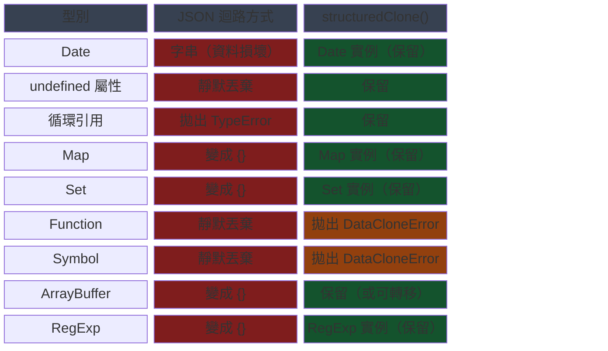

# 結構化複製與 `structuredClone()`

在 JavaScript 中複製物件，是一門權衡取捨的學問。淺複製（`Object.assign`、展開語法）
共享巢狀引用：修改複製品中的巢狀物件，同樣會修改原始物件。透過
`JSON.parse(JSON.stringify(obj))` 進行深複製，看似解決了這個問題，卻帶來了另一類
型的失敗。它靜默地丟棄 `undefined` 值、將 `Date` 物件轉換為字串、完全捨棄函式和
Symbol，在循環引用（circular reference）時拋出錯誤，並且對 `Map`、`Set`、
`ArrayBuffer` 和 `RegExp` 靜默地失敗。這些不是邊界情況 — 它們是生產環境程式碼中
的常見型別，而這些失敗是靜默的資料損壞，而非被拋出的錯誤。對於初次接觸這個問題
的開發者，這種靜默性是最具危險性的地方：`JSON.stringify` 不會拋出錯誤告知資料
遺失，程式碼繼續執行，問題只在下游邏輯消費損壞資料時才浮現。

`structuredClone()` 自 2022 年起在所有主流瀏覽器中可用，並在 Node.js 17+ 中支援，
它使用結構化複製演算法（Structured Clone algorithm）執行深複製 — 這正是
`postMessage`、`IndexedDB` 和 History API 所使用的同一套演算法。它能正確地複製
`Date`、`Map`、`Set`、`RegExp`、`ArrayBuffer`、`TypedArray`、`Blob`、`Error` 以及
循環引用。它不複製函式、DOM 節點，也不保留類別實例的原型鏈。對於無法複製的型別，
它會立即拋出 `DataCloneError`，而非靜默地丟棄資料。失敗模式是明確的，這使得錯誤
可被診斷，而非被隱藏。`structuredClone()` 是同步的：它在回傳之前完成整個深複製
操作，不涉及任何非同步機制，這使它在效能要求嚴格的路徑中可以安全使用。

結構化複製演算法早於 `structuredClone()` 這個全域函式而存在。它一直以來可以透過
`MessageChannel`、`History.pushState()` 和其他平台 API 間接存取。在全域函式被標準
化之前，開發者使用 `MessageChannel` 的迴路方式來複製物件 — 將值傳送到一個連接埠，
並在 `message` 事件處理器中從另一個連接埠讀取結果。那種模式看起來像同步的，實際上
卻是非同步的，且需要非常繁瑣的樣板程式碼。理解這個演算法，能夠釐清所有這些 API
的行為，而不只是全域函式本身。當 `postMessage` 傳輸一個值、當 IndexedDB 序列化一
筆記錄、當 History API 儲存狀態時，執行的都是同一套演算法，限制與能力在這些情境中
都是相同的。理解演算法本身，也解釋了為何某些物件在 `postMessage` 中無法傳遞：它
們不是 `postMessage` 的限制，而是結構化複製演算法的邊界，兩者共享同一套規則。

深複製的需求在實際工程中遠比表面上廣泛：狀態管理函式庫在儲存快照前需要深複製；
測試設施在建立夾具（fixture）時需要確保不同測試案例間的資料隔離；設定物件在傳遞
到不信任的子系統前需要複製以防意外修改；撤銷／重做（undo/redo）堆疊需要在每次
狀態變更時儲存完整的資料快照。選擇語意正確的深複製工具，直接決定這些功能的可靠性。

## 使用情境

你正在把一個包含巢狀陣列和 `Date` 值的複雜物件從 Web Worker 傳回主執行緒。`JSON.parse(JSON.stringify(obj))` 對純物件有效，但會把 `Date` 實例轉換成字串，並丟棄 `undefined` 值。結構化複製演算法——被 `postMessage` 內部使用，並以 `structuredClone()` 直接暴露——執行的深複製能正確保留 `Date`、`Map`、`Set`、`ArrayBuffer` 和其他無法以 JSON 序列化的型別。

## 設計思維

### 結構化複製演算法

結構化複製演算法定義了一組精確的型別，可在執行情境之間被序列化和反序列化。支援的
型別包括：基本型別（string、number、boolean、null、undefined、BigInt）、普通物件和
陣列、`Date`、`RegExp`、`Map`、`Set`、`ArrayBuffer` 及所有 `TypedArray` 變體、
`DataView`、`Blob`、`File`、`FileList`、`ImageBitmap`、`ImageData`、`Error`（包括
所有內建錯誤子類別），以及物件圖（object graph）中的循環引用。演算法遞迴地遍歷物件
圖，為每個節點建立新的記憶體配置以構建重複的圖。循環引用得以保留：若兩個屬性指向
同一個物件，複製品的對應屬性也將指向同一個被複製的物件，而非獨立的副本。

不支援的型別包括函式、`Symbol` 值、DOM 節點和類別原型鏈。當演算法遇到不支援的型別
時，會拋出 `DataCloneError`，而非靜默地丟棄值或轉換它。這是刻意設計的：靜默的損壞
比明確的錯誤更難偵測。演算法同樣不保留屬性描述器（property descriptor）、getter、
setter 或不可列舉屬性。複製品是自有可列舉屬性值的快照，而非屬性描述器映射的結構性
複製。這一區別對於使用計算屬性、透過 getter 進行惰性初始化，或使用凍結原型鏈的
物件而言尤為重要。凡在程式碼中見到 `Object.defineProperty` 或 `Object.freeze` 被
用於賦予物件特殊語意的地方，`structuredClone()` 在複製後都不會保留這些語意 —
複製品的屬性都是可寫、可列舉、可配置的普通屬性。若某個物件的不可變性對業務邏輯
至關重要，需在複製後手動重新套用 `Object.freeze`。

### structuredClone() 與 JSON 迴路方式

JSON 迴路方式和 `structuredClone()` 在資料保真度上有根本的差異。JSON 序列化將物件
轉換為字串表示再轉回，而這個迴路本質上是有損的：JSON 規範沒有 `undefined`、函式、
Symbol、`Map`、`Set`、型別化 `Date`、`RegExp` 或循環引用的表示形式。`undefined`
屬性在輸出中被靜默地丟棄。`Date` 物件被轉換為 ISO 8601 字串 — 解析步驟產生的是
字串，而非 `Date`。`Map` 和 `Set` 變成沒有結構保留的普通物件和陣列。循環引用導致
`JSON.stringify` 拋出 `TypeError`。這些失敗都不會在回傳值中指示出來 — 結果物件看
起來合法，只是遺失了資料。

`structuredClone()` 忠實地保留所有受支援的型別。以 `structuredClone()` 複製的
`Date` 仍然是 `Date` 實例。`Map` 仍然是 `Map`。`Set` 仍然是 `Set`。`RegExp` 保留
其旗標。具有循環引用的物件，複製後循環引用依然完整。這個演算法設計目標是正確性，
而非字串序列化，因此不需要將值轉換為中間字串格式。唯一的失敗是明確的：當演算法
遇到無法處理的型別時，同步拋出 `DataCloneError`。這使得 `structuredClone()` 適合
作為純資料的預設深複製原語，`JSON.stringify` 則適合產生用於傳輸、儲存或顯示的字串
輸出 — 這是兩種不同的用途，不應混為一談。

在效能方面，`structuredClone()` 對大型物件的複製速度通常比 JSON 迴路方式更快，因
為它不需要進行字串序列化與反序列化，而是直接在記憶體中進行圖的遍歷與配置。然而，
對於純粹由基本型別構成的小型純物件，JSON 迴路方式有時因 V8 的 JSON 解析器高度優
化而略有優勢。這種效能差異在絕大多數應用情境中可忽略不計；選擇應以語意正確性為
優先，而非以效能為由選擇語意不正確的工具。若效能是瓶頸，應以分析工具測量後再決定，
而非事先假設。

### 轉移清單

`structuredClone()` 接受第二個參數 `{ transfer: [arrayBuffer] }`，允許
`ArrayBuffer` 實例被轉移而非複製。轉移（transfer）將緩衝區的所有權移交給複製品，
並將原始緩衝區歸零。轉移之後，任何嘗試讀取或寫入原始緩衝區的操作，根據存取方式的
不同，會產生零長度或 `TypeError`。原始的 `byteLength` 變為 0。這與 `postMessage`
轉移清單使用的機制相同 — 當 `postMessage` 呼叫包含轉移清單時，列出的緩衝區會被
移動到接收端情境，而不複製其位元組。

轉移的動機是記憶體效率。一個持有圖像資料、音訊樣本或大型二進位有效負載的
`ArrayBuffer`，可能佔用數十到數百 MB。複製它在複製操作期間使記憶體佔用翻倍。轉移
完全避免了這種重複：位元組不被複製，所有權記錄被更新。因此，轉移是將大型二進位資
料傳遞給 Web Worker 的正確方式，而非複製。代價是傳送端情境在轉移後立即失去對緩衝
區的存取。需要保留引用的程式碼，必須先複製再轉移副本，或者必須重構以確保緩衝區在
任一時刻只在一個情境中需要。

轉移的語意與 Rust 的所有權轉移（move）語意相似：轉移後，原始的「擁有者」不再擁
有資源，試圖使用它在 JavaScript 中表現為 `byteLength` 為 0、讀取傳回零值，而非拋
出例外（這是與 Rust 的一個不同點）。這種設計讓接收端能確保它持有的是唯一一份資料
副本，無需擔心傳送端在轉移後修改緩衝區內容。在設計 Worker 通訊協定時，應明確區
分哪些資料是「傳送並遺忘」（適合轉移），哪些是「傳送並繼續使用」（需要複製或透
過 `SharedArrayBuffer` 共享）。

### MessageChannel 作為 2022 年前的替代方案

在 `structuredClone()` 作為全域函式可用之前，同步深複製的標準替代方案是使用
`MessageChannel`。一個頻道有兩個連接埠；透過一個連接埠傳送值，會將其結構化複製品
遞交到另一個連接埠。該模式涉及建立頻道、在一個連接埠上監聽 `message` 事件、透過
另一個連接埠傳送值，以及從事件的 `data` 屬性中捕獲複製品。儘管在粗略閱讀中看起來
像同步的，訊息遞交實際上是非同步的，這意味著該模式必須被包裝在 `Promise` 中，或
在事件迴圈能夠刷新微任務佇列的情境中使用。

全域的 `structuredClone()` 函式用一個同步的、明確的 API 取代了這種模式。它接受一個
值、執行演算法，並立即回傳複製品 — 無需頻道、無需事件監聽器、無需非同步。這個函
式還使程式碼中的意圖清晰可見：看到 `structuredClone(x)` 的讀者，立刻知道發生了什
麼；而 `MessageChannel` 模式需要對這個替代方案有所了解才能理解。這段歷史背景很有
用，因為它解釋了為何演算法獨立於全域函式而存在，以及為何舊程式碼庫中可能仍然包含
這種模式。在審查或遷移此類程式碼時，`MessageChannel` 深複製慣用語是替換為
`structuredClone()` 的直接候選。

在 Node.js 環境中，`structuredClone()` 自 v17.0.0 起作為全域函式可用，不需要任何
`require` 或 `import`。對於需要支援更早版本 Node.js 的專案，可以從
`v8.deserialize(v8.serialize(value))` 獲得類似的效果，但這是 V8 引擎的內部序列化
格式，而非標準的結構化複製演算法，其支援的型別集合略有不同。專案在選擇深複製策略
前，應確認目標執行環境是否已支援 `structuredClone()`；若目標是現代瀏覽器和
Node.js 18+ LTS，可以無條件使用全域函式。

### 選擇正確的複製策略

正確的複製策略取決於資料的形狀和操作的需求。淺複製（`Object.assign` 或展開語法）
在資料是扁平的，或對巢狀物件的共享引用是刻意設計的情況下是正確的——例如，合併設定
物件時，巢狀子物件被視為不透明引用。`structuredClone()` 在資料包含不應在原始物件和
複製品之間共享的巢狀可變物件時是正確的——例如，在修改前從現有狀態物件衍生新的狀態
物件時。自訂的 `clone()` 方法在資料是必須保留行為的類別實例，或複製邏輯非常規（例
如，複製品需要生成新的唯一 ID 而非複製來源的 ID）時是正確的。

常見的錯誤是在更精確的工具足夠的情況下，使用通用工具。由基本型別鍵值對構成的扁平
物件不需要 `structuredClone()`——展開語法足夠且更快。從不被修改的不可變值物件根本
不需要複製——它可以安全地透過引用共享。將 `structuredClone()` 普遍地作為防禦性習慣
使用，在更廉價的策略也安全的情況下增加了不必要的配置成本。理解資料模型——巢狀值是
否可以被修改、實例是否必須保留原型、結果是否會跨越序列化邊界——決定了哪種策略是
適當的。

## 最佳實踐

**應該（SHOULD）對所有純資料物件的深複製操作使用 `structuredClone()`，取代
`JSON.parse(JSON.stringify(obj))`。** JSON 迴路方式靜默地損壞 `Date` 值（轉換為
字串）、`undefined` 屬性（丟棄）、`Map` 和 `Set` 實例（轉換為普通物件），並且在
循環引用時拋出錯誤。`structuredClone()` 對其所支援的所有型別預設是正確的，對不支
援的型別拋出 `DataCloneError`，而非靜默地損壞資料。JSON 迴路方式在複製情境中唯一
合理的使用案例，是當結果需要是可用於傳輸或儲存的 JSON 安全純物件時 — 在這種情況
下，有損的轉換是刻意的，並應明確記錄。在程式碼審查中，每次見到 JSON 迴路方式
被用於複製操作時，都應確認作者是否了解其資料型別的損失，若不是刻意為之，則應替
換為 `structuredClone()`。

**必須（MUST）在透過 `postMessage` 將大型 `ArrayBuffer` 或 `TypedArray` 資料傳遞給
Web Worker 時使用 `transfer` 選項，而非複製。** 轉移將緩衝區的所有權移交給接收端
情境，並將傳送端的視圖歸零。這避免了在記憶體中重複大型二進位資料 — 對於數十 MB
範圍的有效負載，複製與轉移之間的差異，就是峰值記憶體翻倍與不翻倍的差異。緩衝區
在轉移後在傳送端情境中不可使用，因此任何需要保留引用的程式碼都必須相應地重構。
對大型緩衝區不使用轉移，會造成不必要的 GC 壓力，以及在記憶體受限環境中潛在的
記憶體不足狀況。在使用 `structuredClone()` 進行本地複製並隨後以轉移方式將緩衝區
傳送給 Worker 時，正確的做法是先複製緩衝區（保留本地副本），再將複製品以轉移方
式傳送：`const copy = buffer.slice(0); worker.postMessage(copy, [copy]);`。

**禁止（MUST NOT）將 `JSON.parse(JSON.stringify(obj))` 作為通用的深複製方式。** JSON 迴路方式是字串序列化格式，而非複製機制：它靜默地丟棄 `undefined` 屬性、將 `Date` 物件轉換為 ISO 字串、將 `Map` 和 `Set` 實例轉換為普通的空物件，並且在循環引用時同步拋出 `TypeError`。結果物件在外觀上看似合法，卻攜帶損壞的值，使得錯誤難以追蹤到複製的位置。`structuredClone()` 是所有純資料深複製使用案例的正確替代品。JSON 迴路方式只在目標是產生用於傳輸或儲存的 JSON 安全字串表示時才合適——而非用於記憶體中的物件複製。

**禁止（MUST NOT）依賴 `structuredClone()` 複製類別實例並保留其方法。** 類別實例
在複製中失去其原型鏈；結果僅是一個只具有自有可列舉屬性的普通物件。對複製品呼叫
方法，會拋出 `TypeError: clone.method is not a function`。若類別實例必須在複製操作
後保留其方法，則需在類別上實作一個 `clone()` 方法，從來源物件的自有資料建構一個
新實例；或使用複製建構子模式，即靜態工廠方法接受純資料物件並回傳一個完整初始化的
實例。這種模式也使類別的複製契約明確且可測試。在採用領域驅動設計（DDD）模式的
程式碼庫中，值物件（value object）應實作明確的 `clone()` 或 `copy(overrides)` 方
法，而非依賴通用複製函式；這使得複製語意成為型別介面的一部分，讓使用者無需了解
內部實作就能安全地複製物件。

## 視覺呈現



## 範例

```js
const original = {
  date: new Date('2025-01-01'),
  map: new Map([['key', 'value']]),
  set: new Set([1, 2, 3]),
  nested: { arr: [1, 2, 3] },
};
original.self = original; // 循環引用

const clone = structuredClone(original);

clone.nested.arr.push(4);
console.log(original.nested.arr); // [1, 2, 3] — 未受影響

console.log(clone.date instanceof Date); // true — Date 被保留
console.log(clone.map instanceof Map);   // true — Map 被保留
console.log(clone.self === clone);       // true — 循環引用被保留

// JSON 迴路方式的對比：
// JSON.stringify(original) — 因循環引用拋出 TypeError
// JSON.parse(JSON.stringify({ date: new Date() })).date — 字串，而非 Date

// 轉移範例：將 ArrayBuffer 移交給 Web Worker 而不複製
const buffer = new ArrayBuffer(1024 * 1024 * 64); // 64 MB
const transferred = structuredClone(buffer, { transfer: [buffer] });
console.log(buffer.byteLength);      // 0 — 原始緩衝區已歸零
console.log(transferred.byteLength); // 67108864 — 複製品持有位元組
```

## 常見錯誤

在包含 `Date` 值的物件上使用 `JSON.parse(JSON.stringify(obj))`，是最常見的深複製
錯誤。`Date` 被 `JSON.stringify` 序列化為 ISO 字串，從 `JSON.parse` 中以普通字串
的形式出現。之後在複製屬性上呼叫 `.getTime()` 或 `.toLocaleDateString()` 的程式碼，
會拋出 `TypeError`。這個失敗在複製的位置是不可見的 — 它只有在複製資料被使用時才
會浮現，通常遠離複製發生的地方。`structuredClone()` 消除了這個失敗模式：複製的
`Date` 就是一個 `Date`。

期待 `structuredClone()` 複製帶有原型方法的類別實例，是第二個常見錯誤。複製品是一
個普通物件。定義在類別原型上的方法不是實例的自有屬性，因此不包含在複製品中。若類
別有一個 `serialize()` 方法，而程式碼呼叫 `clone.serialize()`，它會拋出錯誤。正確
的做法是在類別上實作一個建構新實例的 `clone()` 方法，或使用值物件模式將資料與行為
分離，讓複製操作始終作用於純資料而非類別實例。這個錯誤在引入 ORM 或 Domain 模型
的程式碼庫中特別常見，因為開發者往往在充分理解前就假設框架物件可以用通用工具複製。
TypeScript 並不能防止這個問題：即使型別系統顯示複製品具有與原始物件相同的型別，
執行時的原型鏈已被移除，方法呼叫仍會失敗。

在轉移就足夠的情況下複製大型 `ArrayBuffer` 資料，是一個效能錯誤。在原始緩衝區複製
後不再需要的情境中 — 例如為 Web Worker 準備資料時 — 不使用 `transfer` 選項的
`structuredClone(buffer)` 會複製所有位元組，使峰值記憶體翻倍。`transfer` 選項正是
為這種情境而存在的。不了解轉移選項的開發者，只有在處理大型有效負載或進行記憶體分
析時，才會發現記憶體成本，而此時這種模式可能已在程式碼庫中廣泛存在。識別轉移的
使用時機：凡是在複製後立即廢棄原始緩衝區的模式，以及在多執行緒架構中明確將緩衝
區的所有權從主執行緒移交給 Worker 的模式，都是轉移的正確使用場景。程式碼審查時，
任何對 `postMessage` 傳遞大型 `ArrayBuffer` 的呼叫，若未包含轉移清單，都應標記
為需確認是否應改用轉移。

## 相關 FEE

結構化複製演算法是多個平台功能的基礎，理解它有助於深入理解以下主題：

- FEE-300 — JavaScript 核心與執行環境總覽
- FEE-405 — Web Worker 與並行（postMessage 與轉移）
- FEE-404 — 儲存與狀態持久化（IndexedDB 使用結構化複製演算法）

## 參考資料

- MDN: structuredClone() — https://developer.mozilla.org/en-US/docs/Web/API/Window/structuredClone
- MDN: 結構化複製演算法 — https://developer.mozilla.org/en-US/docs/Web/API/Web_Workers_API/Structured_clone_algorithm
- HTML Living Standard: Structured serialization — https://html.spec.whatwg.org/multipage/structured-data.html
- TC39: Resizable ArrayBuffer proposal — https://github.com/tc39/proposal-resizablearraybuffer
- Node.js Docs: structuredClone — https://nodejs.org/api/globals.html#structuredclonevalue-options
- MDN: ArrayBuffer.prototype.transfer() — https://developer.mozilla.org/en-US/docs/Web/JavaScript/Reference/Global_Objects/ArrayBuffer/transfer
