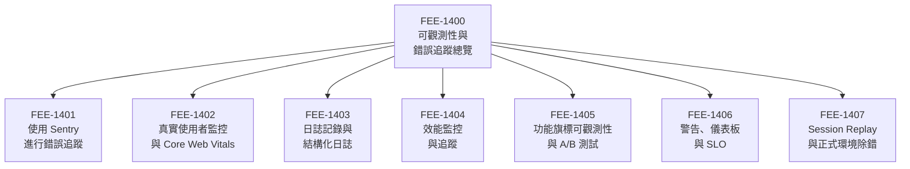

# 可觀測性與錯誤追蹤總覽

:::info
本類別涵蓋前端可觀測性的三大支柱 — 錯誤追蹤、真實使用者監控（RUM），以及 session replay — 同時包含 source map 流程、警告機制，以及功能旗標可觀測性，共同構成完整的正式環境能見度策略。
:::

## 背景脈絡

成功部署程式碼，並不等於知道它是否正常運作。一個通過 CI、成功部署、且在開發者瀏覽器中正確載入的 build，仍然可能對一定比例的真實使用者是壞掉的 — 在執行 Chrome 108 的舊款 Android 裝置上、在封鎖特定網域的企業網路中、在啟用了系統層級字型縮放的螢幕上，或是在不穩定的連線環境下，一次超時的請求就足以讓一個 200ms 的互動變成永遠不會消失的 loading 轉圈。

本地開發環境與正式環境之間的這道落差，正是前端可觀測性存在的核心問題。後端工程師向來能取得伺服器日誌、請求追蹤（traces），以及資料庫查詢指標。前端工程師歷來什麼都沒有。錯誤在使用者的瀏覽器中悄悄發生，stacktrace 在分頁關閉的那一刻消失，而第一個出了問題的信號，往往是一張客服工單或一則 App Store 評論，而不是自動化的警告。

這個差異是結構性的。後端服務擁有自己的執行環境：伺服器在團隊的掌控之下，日誌是集中的，每一個請求都是可觀測的。前端應用程式運行在團隊無法控制的瀏覽器中、運行在從未見過的裝置上、以及運行在可能與測試套件完全不同的網路環境中。如果不主動為失敗進行儀器化（instrument），失敗就是不可見的。

**三大支柱。** 前端可觀測性圍繞著三種互補的資料來源組織而成：

- **錯誤（Errors）** 告訴你什麼壞掉了。JavaScript 例外、未處理的 Promise rejection、失敗的網路請求，以及 React error boundary — 這些都會產生錯誤事件。錯誤追蹤工具 — 其中 Sentry 使用最為廣泛 — 會捕捉這些事件，連同 stacktrace、裝置指紋、瀏覽器版本、使用者身份（如果有的話），以及導致失敗的一連串操作記錄（breadcrumbs）。沒有錯誤追蹤，你從使用者那裡聽說錯誤；有了它，你在使用者回報之前就能發現。

- **效能（Real User Monitoring）** 告訴你體驗何時劣化。合成測試（Synthetic tests）在受控環境的快速硬體與快速連線上執行。真實使用者監控（RUM）則從你的使用者實際擁有的完整裝置與網路分佈中，捕捉真實頁面載入的 Core Web Vitals — LCP、INP、CLS。p50 LCP 為 1.8s 的同時，p95 LCP 可能是 8.2s。合成測試讓你看到前者；RUM 讓你兩者都看到。

- **使用者行為（Session Replay）** 告訴你使用者做了什麼。錯誤日誌告訴你表單送出失敗。Session replay 讓你看到使用者填寫了三次表單、在第三次時點了兩下送出，然後面對空白畫面等了六秒後放棄離開。行為資料彌合了「發生了錯誤」與「這就是使用者流失的原因」之間的鴻溝。

三大支柱是互補的，而非重複的。錯誤事件告訴你例外類型與行號。RUM 告訴你頁面在錯誤觸發前是否已經很慢。Session replay 向你展示產生錯誤的那個狀態之前，使用者完整的互動序列。三者合用，能將平均診斷時間（MTTD）縮短到任何單一資料來源都難以企及的程度。

**Source maps：整個體系的關鍵。** 正式環境的 JavaScript 是壓縮且打包過的。一個來自壓縮 bundle 的 stacktrace 看起來是這樣的：

```
TypeError: Cannot read properties of undefined (reading 'id')
    at t (main.a3f8d2.js:1:84234)
    at r (main.a3f8d2.js:1:91847)
```

沒有 source map，這份 stacktrace 在功能上毫無用處。Source maps — 建置過程中生成的、將編譯後位置對應回原始碼位置的檔案 — 將上述輸出轉換為：

```
TypeError: Cannot read properties of undefined (reading 'id')
    at getUserDisplayName (src/utils/user.ts:47:12)
    at renderHeader (src/components/Header.tsx:23:8)
```

Source maps 必須在部署流程中上傳至錯誤追蹤平台（詳見 FEE-1500），且不應公開提供 — 它們會暴露你的原始碼。上傳動作發生在 CI 中建置步驟之後、CDN 部署期間或之前。

**可觀測性回饋迴路。** 可觀測性不是一次性的設定。它是一個持續的回饋迴路：

1. 程式碼部署到正式環境。
2. 真實使用者遭遇問題 — 錯誤、載入緩慢、令人困惑的互動。
3. 錯誤與效能事件被可觀測性 SDK 捕捉，並傳送至平台。
4. 平台彙整事件、偵測到回歸（錯誤率飆升、LCP 劣化），並觸發警告。
5. 工程師開啟平台，閱讀 stacktrace，與 session replay 相互印證，診斷根本原因。
6. 修復方案被實作、測試，並部署。
7. 平台確認錯誤率回到基準線。

這個迴路將「正式環境壞掉」到「正式環境修好」的時間，從數天壓縮到數小時甚至數分鐘。從未為應用程式進行儀器化的團隊，往往在第一次加入錯誤追蹤時，才發現自己已經有默默運行了數個月的未偵測錯誤。

**為何前端團隊歷來略過這件事。** 可觀測性本質上是不可見的。你沒有為之儀器化的錯誤，就是你永遠看不見的錯誤 — 從團隊的角度來看，它們根本不存在。這產生了一種危險的平衡：團隊相信應用程式運作正常，因為他們沒有收到錯誤回報；而實際上，他們之所以沒有收到回報，是因為他們根本沒有接收的機制。

儀器化的成本很低 — 加入 Sentry SDK 並上傳 source maps 大約是幾個小時的工作。操作上的回報是永久性的：每一次未來的部署都附帶了正式環境的能見度。跳過可觀測性的決定很少是刻意做出的，幾乎總是因為從未停下來問：「如果這個在正式環境壞掉了，我們怎麼知道？」

### 本類別涵蓋內容

- **FEE-1401 — 使用 Sentry 進行錯誤追蹤：** SDK 設定、source map 上傳、release 追蹤、issue 分類工作流，以及警告路由。對於剛開始建立前端可觀測性的團隊而言，這是標準的起點。

- **FEE-1402 — 真實使用者監控與 Core Web Vitals：** 從真實頁面載入中捕捉 LCP、INP 與 CLS；欄位資料（field data）與實驗室資料（lab data）的差異；p75 目標設定；以及將 RUM 資料整合進部署決策。

- **FEE-1403 — 日誌記錄與結構化日誌：** 從前端程式碼發送結構化日誌、將日誌傳輸至集中式彙整工具，以及使用 log correlation ID 將前端事件與後端追蹤串聯。

- **FEE-1404 — 效能監控與追蹤：** 前端發起請求的分散式追蹤（distributed tracing）、waterfall 分析、慢速交易偵測，以及在 CI 中強制執行效能預算。

- **FEE-1405 — 功能旗標可觀測性與 A/B 測試：** 追蹤使用者收到哪個旗標變體、將旗標狀態與錯誤率及效能指標相關聯，以及在錯誤率於推出後飆升時安全回滾功能旗標。

- **FEE-1406 — 警告、儀表板與 SLO：** 為前端指標定義服務水準目標（SLO）、建立能呈現正確信號的儀表板，以及調整警告門檻以降低雜訊同時不遺漏回歸。

- **FEE-1407 — Session Replay 與正式環境除錯：** 錄製與重播使用者 session、隱私控制（在 replay 中遮蔽 PII）、使用 replay 診斷錯誤脈絡，以及結合 replay 與錯誤事件資料進行根本原因分析。

## 設計思維

### 為何三大支柱互補

每一個支柱回答不同的問題，且沒有任何一個能完整回答其他兩個的問題。

錯誤追蹤回答：「有什麼壞掉了，確切是什麼？」它擅長精確診斷 — 你能得到 stacktrace、瀏覽器版本、作業系統，以及先前事件的序列。但它無法告訴你，錯誤觸發之前頁面是否已經劣化，也無法告訴你使用者在錯誤發生前是否已感到困惑。

真實使用者監控回答：「使用者規模化的體驗如何？」它捕捉真實裝置與連線的完整效能分佈。一個儀表板顯示 p95 LCP 在一次部署後從 3.1s 跳升至 6.4s，能給你精確且可行的信號 — 但它無法告訴你使用者主觀的體驗為何，也無法讓你看出某個特定錯誤是否與這次變慢相關。

Session replay 回答：「使用者實際上做了什麼？」它展示憤怒點擊（rage click）、無效點擊（dead click）、捲動深度、表單放棄，以及錯誤發生那一刻精確的 DOM 狀態。但它無法直接給你聚合的統計圖像 — 你在某個 session 中看到的，究竟是一個模式，還是一個偶發案例。

三者合用，形成完整的畫面：錯誤追蹤捕捉回歸，RUM 量化其範圍與持續時間，session replay 則揭示產生問題的使用者體驗。

### 為何 source maps 是整個體系的關鍵

沒有 source maps，正式環境的錯誤追蹤就降格為一份壓縮後位置參照的日誌，需要手動翻查建置產物才能解讀。這不是理論上的顧慮 — 未上傳 source maps 就部署的團隊，往往發現 Sentry 的 issue 無從著手，並停止進行 triage，使得整個儀器化失去意義。

Source maps 同時帶有安全性隱患：它們包含你的原始碼。在 CDN 上公開提供它們，等於向任何願意查看的人暴露你的智慧財產以及潛在的敏感邏輯。正確的做法是在部署流程中將它們上傳至錯誤追蹤平台，並從公開的 CDN 中排除 — 平台在伺服器端解碼 stacktrace，只將人類可讀的結果呈現出來。

### 將可觀測性視為部署的前提，而非事後補充

可觀測性工具在第一次部署時就存在，才能發揮最大的價值。「等使用者更多再加錯誤追蹤」這個常見模式反轉了優先順序：早期使用者群正是默默失敗最具破壞力的時候（產品剛推出時使用者信任很脆弱），也是團隊最有能力快速調查並修復問題的時候（程式碼庫更小、團隊對脈絡更熟悉）。

將可觀測性視為部署的前提 — 就像測試或 linting 一樣 — 能將團隊的操作基準，從「我們假設它正常運作」轉變為「我們知道它正常運作，因為我們有信號。」

## 視覺化

### 可觀測性回饋迴路

下圖展示從部署到診斷到修復的持續循環。每個階段都是一個明確的步驟：在一個階段未被偵測到的問題，在下一個階段才有第一次被發現的機會。這個迴路隨著每次部署重複執行，隨著警告門檻的調整與 source maps 的持續更新而不斷緊縮。


### 分類導覽圖

下圖展示本類別七篇子文章如何涵蓋完整的可觀測性堆疊，從原始錯誤捕捉，到警告機制，再到以 replay 為基礎的除錯。



## 相關 FEE

- [FEE-1401：使用 Sentry 進行錯誤追蹤](./1401.md) — SDK 設定、source map 上傳、issue 分類，以及警告路由
- [FEE-1402：真實使用者監控與 Core Web Vitals](./1402.md) — 從真實使用者捕捉 LCP、INP、CLS；p75 目標設定；欄位資料與實驗室資料
- [FEE-1403：日誌記錄與結構化日誌](./1403.md) — 結構化前端日誌、集中式彙整，以及追蹤相關聯
- [FEE-1404：效能監控與追蹤](./1404.md) — 分散式追蹤、waterfall 分析，以及 CI 效能預算
- [FEE-1405：功能旗標可觀測性與 A/B 測試](./1405.md) — 旗標變體與錯誤率的相關性，以及安全回滾模式
- [FEE-1406：警告、儀表板與 SLO](./1406.md) — SLO 定義、儀表板設計，以及警告門檻調整
- [FEE-1407：Session Replay 與正式環境除錯](./1407.md) — 錄製使用者 session、PII 遮蔽，以及以 replay 進行根本原因分析
- [FEE-1500：CI/CD 與部署總覽](../CI%20CD%20and%20Deployment/1500.md) — 部署流程中的 source map 上傳
- [FEE-1100：測試策略總覽](../Testing%20Strategies/1100.md) — 在問題抵達可觀測性層之前攔截它們的測試套件
