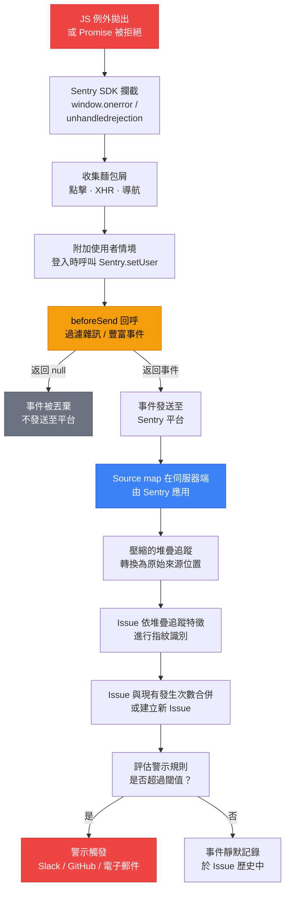

# 使用 Sentry 進行錯誤追蹤

## 背景脈絡

每一個 JavaScript 應用程式都會在正式環境中拋出例外。DOM 操作與網路回應之間存在競爭條件、第三方腳本干擾全域狀態、舊版瀏覽器對規範的解讀各有差異，而使用者也總能找到開發者未曾預料的操作路徑。例外的發生是必然的——問題在於團隊是否看得見。

若沒有適當的監控工具，錯誤就是隱形的。使用者遇到空白畫面、關掉分頁、繼續下一件事。團隊只有在使用者主動發出客服工單、且工單被路由到工程部門時，才能得知問題的存在。大多數使用者不會填寫工單。團隊因此活在一種虛假的平靜之中——沒有問題被回報，是因為根本沒有機制接收問題回報，而非真的沒有問題。

錯誤追蹤填補了這個缺口。嵌入應用程式中的 SDK 會捕獲每一個未處理的例外、未處理的 Promise 拒絕、網路失敗，以及手動回報的錯誤。每個事件都附帶堆疊追蹤（stacktrace）、瀏覽器與作業系統指紋、導致錯誤的麵包屑序列，以及可選的已登入使用者身份資訊。這些事件會傳送到一個平台，該平台按根本原因將事件分群、追蹤頻率變化，並在超過閾值時觸發警示。

**Sentry** 是這個領域的主流平台。它於 2010 年作為開源 Django 錯誤記錄器起家，後來發展成為業界標準的全端錯誤追蹤平台。其主導地位建立在以下幾個面向上：

- **開源起源與自架選項。** 核心平台為開源（sentry.io/from-source）。對資料所在地有嚴格要求的團隊可在自有基礎設施上運行完整平台。大多數團隊使用托管雲端版本，但開源選項消除了供應商鎖定的風險。
- **業界最佳的 Source Map 支援。** Sentry 是第一個將 source map 上傳納入 SDK 工作流程一等公民的平台，提供官方的 Vite、webpack 和 Rollup 插件，在建置步驟中自動處理上傳流程。
- **豐富的 SDK 生態系統。** 所有主流框架都有官方 SDK：`@sentry/react`、`@sentry/vue`、`@sentry/angular`、`@sentry/svelte`、`@sentry/browser`（純 JS）、`@sentry/node`（Node.js 伺服器端），以及 `@sentry/nextjs`（Next.js 全端專案）。
- **Issue 生命週期管理。** Sentry 將每個分群的錯誤視為具有明確生命週期的 Issue：新建、已看見、已忽略、已解決。版本追蹤功能可顯示已解決的 Issue 是否在後續部署中重現。

理解完整的 Sentry 工作流程——SDK 初始化、source map 上傳、麵包屑、使用者情境、版本追蹤、雜訊過濾與警示設定——是這個可觀測性類別中所有其他實踐的基礎。

## 原則

- 必須（MUST NOT）不將 source map 提交至公開套件或在公開 CDN 上提供服務。
- 應該（SHOULD）在 CI 中建置完成後立即將 source map 上傳至 Sentry，然後在 CDN 部署前刪除 `.map` 檔案。
- 應該（SHOULD）在使用者完成驗證後立即透過 `Sentry.setUser()` 設定使用者情境。
- 應該（SHOULD）設定 `beforeSend` 以在事件到達平台前過濾雜訊。
- 應該（SHOULD）為每次正式環境部署建立 Sentry Release 並關聯提交記錄。
- 應該（SHOULD）設定警示規則，在數分鐘內將高嚴重性錯誤路由至 Slack 或 GitHub Issues。
- 應該（SHOULD）使用 `Sentry.addBreadcrumb()` 為不會自動產生麵包屑的重要應用程式事件添加標注。

## 設計思維

### Sentry 為何勝出

錯誤追蹤市場中有多個競爭者——Datadog RUM、Rollbar、Bugsnag、LogRocket、Highlight——但 Sentry 在前端團隊中擁有最高的市占率。原因是結構性的，而非行銷的結果：

**Source map 支援是一等公民。** 競爭對手大多將 source map 視為附加功能。Sentry 則建置了官方的建置工具整合（`@sentry/vite-plugin`、`@sentry/webpack-plugin`），將完整的上傳生命週期作為建置設定的一部分處理。「在 CI 中上傳 source map」的摩擦，從複雜的多步驟 Shell Script 降低到三行插件設定。

**自架性消除了導入障礙。** 有資料主權要求、GDPR 義務，或安全審查流程禁止第三方資料共享的企業團隊，可以在本地運行 Sentry。大多數 SaaS 錯誤追蹤競爭對手沒有自架路徑。這使 Sentry 成為一大部分市場的唯一選擇，進而為 SDK 生態系統的持續投資提供資金。

**版本追蹤與提交整合。** Sentry 的版本追蹤模型——每次部署建立一個命名的 Release、關聯提交範圍、追蹤哪些 Issue 在該 Release 中出現或重現——從根本上改變了除錯工作流程。工程師不再問「這個錯誤是什麼時候開始發生的？」，而是問「哪個版本引入了這個錯誤？」，並能在一次點擊中得到答案。

### 為何 source map 必須在 CI 中上傳，而非提交至版本庫

Source map 包含你的原始程式碼。從 TypeScript 檔案生成的 source map 包含 TypeScript 原始碼，包括變數名稱、註解、內部 API 路徑，以及沒有理由對外公開的商業邏輯。將 source map 提交至版本庫並在 CDN 上提供服務，等同於在已編譯輸出旁邊公開你的源碼。

正確的做法是：
1. 在 CI 中建置應用程式，產生 `.js` 和 `.js.map` 檔案。
2. 透過插件或 `sentry-cli` 將 `.map` 檔案上傳至 Sentry。
3. 從建置輸出中刪除 `.map` 檔案。
4. 將 `.js` 檔案（不含 `.map` 檔案）部署至 CDN。

Sentry 在伺服器端使用已上傳的 source map 解析堆疊追蹤。可讀的堆疊追蹤只對你的 Sentry 組織的已驗證成員可見。公開套件中不包含任何 source map 參考。

### 為何 `beforeSend` 是必要的

一個在正式環境中剛完成監控部署的應用程式，通常會產生遠超預期的事件量。主要的雜訊來源有：

- **瀏覽器擴充功能。** 廣告攔截器、密碼管理器、無障礙工具和開發者擴充功能都在頁面情境中運行 JavaScript。它們拋出的例外會出現在你的 `window.onerror` 處理器中，並被回報至 Sentry，彷彿是你的錯誤。
- **第三方腳本的未處理 Promise 拒絕。** 分析標籤、A/B 測試平台和客服聊天工具通常會附著在頁面上，並從它們自己的網路程式碼中產生未處理的拒絕。
- **使用者連線造成的網路錯誤。** 在不穩定行動連線上的使用者，如果在會話中途失去連線，會產生 `TypeError: Failed to fetch` 事件——這些事件無法採取行動，因為是連線中斷，而非你的程式碼問題。
- **已知的良性錯誤。** 部分瀏覽器在正常運作中會拋出 `"ResizeObserver loop limit exceeded"` 或 `"Script error."`（無有用細節的跨來源腳本錯誤）。

若不進行過濾，這些事件會淹沒 Issue 追蹤器，埋葬真正的錯誤，並耗盡事件配額。`beforeSend` 是 `Sentry.init()` 中在每個事件發送前執行的回呼函式。它可以檢查事件並返回 `null` 以丟棄它，或在發送前修改事件。一個設定良好的 `beforeSend` 可以在不遺漏任何真實錯誤訊號的情況下，將入站事件量減少 60–90%。

### 為何版本追蹤改變了除錯工作

事故應對中最昂貴的部分通常不是修復——而是診斷。「哪一行壞了？」可以用堆疊追蹤回答。「這是什麼時候開始壞的？」需要將錯誤頻率的時間變化與部署時間戳進行關聯。「哪次部署引入了這個問題？」需要手動交叉比對錯誤峰值與部署記錄。

Sentry 的版本追蹤自動回答了後兩個問題。當一個 Release 被建立並關聯了提交記錄後，平台可以顯示：
- 該 Release 中部署的確切提交範圍。
- 哪些 Issue 在這個 Release 中首次出現。
- 哪些先前已解決的 Issue 在這個 Release 中重現。
- 負責引入新 Issue 的提交的團隊成員。

這將事故應對從多步驟的鑑識調查，轉變為單畫面查閱。工程師看到錯誤、看到它出現在 Release `1.4.7` 中、點擊進入提交範圍，並在幾分鐘內找出有問題的變更。

## 最佳實踐

**必須（MUST）在應用程式進入點的最前面初始化 Sentry SDK，優先於任何可能拋出例外的其他匯入。** 在框架初始化之後才呼叫 `Sentry.init()` 會導致早期啟動階段的錯誤完全無法被捕獲。團隊必須（MUST）確保在進入點檔案中，`Sentry.init()` 先於任何框架設定匯入執行。

**禁止（MUST NOT）將 source map 提交至公開套件或從 CDN 提供服務。** Source map 包含原始 TypeScript 原始碼，包括變數名稱、內部 API 路徑和商業邏輯。團隊必須（MUST）在 CI 建置步驟中使用官方 Vite 或 webpack 插件將 `.map` 檔案上傳至 Sentry，然後在 CDN 部署前刪除這些 `.map` 檔案，確保它們不會出現在公開套件中。

**必須（MUST）設定 `beforeSend` 以在事件到達 Sentry 前過濾雜訊。** 若不進行過濾，瀏覽器擴充功能錯誤、第三方腳本拒絕和瀏覽器良性怪癖會在新的正式環境部署後數天內耗盡事件配額。團隊必須（MUST）在上線前設定 `beforeSend`，並應該（SHOULD）同時使用 `ignoreErrors` 處理已知的良性模式，例如 `"Script error."` 和 `"ResizeObserver loop limit exceeded"`。

**應該（SHOULD）在 `Sentry.init()` 中設定 `release` 並為每次正式部署關聯提交記錄。** 沒有 Release 識別符，平台就無法回答「哪次部署引入了這個錯誤？」這個問題。Release 字串應該（SHOULD）在 CI 建置時作為環境變數注入（例如 `VITE_RELEASE=$(git rev-parse --short HEAD)`），以確保在 `Sentry.init()` 和建置插件設定中使用相同的值。

**應該（SHOULD）在登入成功後立即呼叫 `Sentry.setUser()`，並在登出時呼叫 `Sentry.setUser(null)`。** 附加使用者情境能讓團隊篩選所有影響特定使用者的錯誤並主動聯繫受影響使用者。團隊應該（SHOULD）只記錄不透明的內部使用者 ID——禁止（MUST NOT）使用電子郵件地址或真實姓名，以避免在 Sentry 平台上產生 GDPR 資料保留義務。

**應該（SHOULD）以錯誤率而非原始錯誤計數設定告警規則，並設定 `enabled: import.meta.env.PROD` 以防止開發工作階段消耗事件配額。** 原始計數閾值在每次流量高峰時都會觸發，無論應用程式是否真的壞了。團隊應該（SHOULD）設定快速燃燒告警（錯誤率 > 2% 持續 10 分鐘）和迴歸告警（已解決的 Issue 在新 Release 中重現），並附上 runbook URL。

## 視覺化

### 錯誤捕獲與處理流程

下圖展示了從 JavaScript 例外到可行動警示的完整路徑。Sentry 的 SDK 在拋出點攔截錯誤，附加整個會話中收集到的麵包屑和使用者情境，將事件傳送至平台，平台再應用已上傳的 source map 產生可讀的堆疊追蹤，最後將事件與具有相同指紋的其他事件進行分群。



## 範例

### SDK 設定：React

安裝 SDK 並在應用程式渲染前進行初始化。`dsn`（資料來源名稱）是在 Sentry 專案設定中找到的專案專屬 URL。它可以安全地提交——它識別專案，但不授予對 Issue 資料的寫入權限。

```bash
npm install @sentry/react
```

```ts
// src/main.tsx
import * as Sentry from "@sentry/react";
import { createRoot } from "react-dom/client";
import App from "./App";

Sentry.init({
  dsn: "https://examplePublicKey@o0.ingest.sentry.io/0",
  environment: import.meta.env.MODE,          // "production" | "staging" | "development"
  release: import.meta.env.VITE_RELEASE,      // 由 CI 注入，例如 "1.4.7"
  tracesSampleRate: 0.1,                       // 10% 的交易用於效能監控
  replaysSessionSampleRate: 0.05,             // 5% 的會話用於 Session Replay
  replaysOnErrorSampleRate: 1.0,              // 包含錯誤的會話 100% 錄製

  beforeSend(event) {
    // 丟棄來自瀏覽器擴充功能的事件（非從你的來源載入的腳本）
    const frames = event.exception?.values?.[0]?.stacktrace?.frames ?? [];
    const hasExtensionFrame = frames.some(
      (f) =>
        f.filename?.startsWith("chrome-extension://") ||
        f.filename?.startsWith("moz-extension://")
    );
    if (hasExtensionFrame) return null;

    // 丟棄通用網路錯誤——無法採取行動
    const message = event.exception?.values?.[0]?.value ?? "";
    if (message === "TypeError: Failed to fetch") return null;
    if (message.includes("ResizeObserver loop")) return null;

    return event;
  },

  ignoreErrors: [
    "Script error.",                          // 無細節的跨來源腳本錯誤
    /^Non-Error exception captured/,          // Sentry SDK 內部：非 Error 物件被拋出
  ],
});

const root = createRoot(document.getElementById("root")!);
root.render(<App />);
```

### SDK 設定：Vue

```bash
npm install @sentry/vue
```

```ts
// src/main.ts
import { createApp } from "vue";
import { createRouter } from "vue-router";
import * as Sentry from "@sentry/vue";
import App from "./App.vue";
import router from "./router";

const app = createApp(App);

Sentry.init({
  app,
  dsn: "https://examplePublicKey@o0.ingest.sentry.io/0",
  environment: import.meta.env.MODE,
  release: import.meta.env.VITE_RELEASE,
  integrations: [
    Sentry.browserTracingIntegration({ router }),
  ],
  tracesSampleRate: 0.1,
  beforeSend(event) {
    const message = event.exception?.values?.[0]?.value ?? "";
    if (message === "TypeError: Failed to fetch") return null;
    return event;
  },
});

app.use(router);
app.mount("#app");
```

### SDK 設定：純 JavaScript

對於沒有框架的專案，直接使用 `@sentry/browser`。

```bash
npm install @sentry/browser
```

```ts
import * as Sentry from "@sentry/browser";

Sentry.init({
  dsn: "https://examplePublicKey@o0.ingest.sentry.io/0",
  environment: process.env.NODE_ENV,
  release: process.env.RELEASE_VERSION,
  beforeSend(event) {
    const message = event.exception?.values?.[0]?.value ?? "";
    if (message === "TypeError: Failed to fetch") return null;
    return event;
  },
});
```

### 設定使用者情境

在登入成功後立即呼叫 `Sentry.setUser()`。這會將後續所有錯誤事件與已驗證的使用者關聯，讓你可以搜尋「所有影響使用者 X 的錯誤」，並主動聯繫受影響的使用者。

```ts
// src/auth/authService.ts
import * as Sentry from "@sentry/react";

export function onLoginSuccess(user: { id: string; email: string; role: string }) {
  Sentry.setUser({
    id: user.id,
    email: user.email,
    role: user.role,
  });
}

export function onLogout() {
  // 清除使用者情境，避免後續事件被歸因於前一位使用者
  Sentry.setUser(null);
}
```

### 自訂麵包屑

Sentry 會自動為 DOM 點擊、XHR 和 fetch 請求、`console.log` 呼叫，以及瀏覽器導航事件收集麵包屑。對於不會產生自動麵包屑的應用程式層級事件——使用者在多步驟表單中前進、收到 WebSocket 訊息、評估 Feature Flag——請手動添加。

```ts
import * as Sentry from "@sentry/react";

function handleCheckoutStep(step: string) {
  Sentry.addBreadcrumb({
    category: "checkout",
    message: `使用者前進到步驟：${step}`,
    level: "info",
    data: {
      step,
      timestamp: Date.now(),
    },
  });
  // ... 繼續結帳邏輯
}
```

### 手動捕獲錯誤

對於已捕獲但不想重新拋出的例外：

```ts
import * as Sentry from "@sentry/react";

async function loadUserProfile(userId: string) {
  try {
    const response = await fetch(`/api/users/${userId}`);
    if (!response.ok) {
      throw new Error(`載入 ${userId} 的個人資料時發生 HTTP ${response.status}`);
    }
    return await response.json();
  } catch (error) {
    Sentry.captureException(error, {
      tags: { feature: "user-profile" },
      extra: { userId },
    });
    return null; // 優雅降級
  }
}
```

對於非例外的資訊性訊息：

```ts
Sentry.captureMessage("收到包含未預期貨幣的付款 Webhook", "warning");
```

### Source Map 上傳：Vite 插件

`@sentry/vite-plugin` 套件將 source map 上傳作為 Vite 建置流程的一部分處理。它在建置完成後將 source map 上傳至 Sentry，然後從輸出目錄中刪除它們。

```bash
npm install @sentry/vite-plugin --save-dev
```

```ts
// vite.config.ts
import { defineConfig } from "vite";
import { sentryVitePlugin } from "@sentry/vite-plugin";

export default defineConfig({
  build: {
    sourcemap: true, // 必須啟用，插件才能找到 source map
  },
  plugins: [
    sentryVitePlugin({
      org: "your-sentry-org-slug",
      project: "your-sentry-project-slug",
      authToken: process.env.SENTRY_AUTH_TOKEN, // 設定於 CI 密鑰中，絕不寫死
      release: {
        name: process.env.VITE_RELEASE,  // 與注入 Sentry.init() 的值相同
        deploy: {
          env: process.env.NODE_ENV ?? "production",
        },
      },
      sourcemaps: {
        // 上傳建置輸出中的所有 .map 檔案
        assets: "./dist/**",
        // 上傳後刪除 .map 檔案，使其不被部署至 CDN
        filesToDeleteAfterUpload: "./dist/**/*.map",
      },
    }),
  ],
});
```

`SENTRY_AUTH_TOKEN` 是在 Sentry 專案設定中建立的內部整合 Token（設定 > Auth Tokens）。它對指定組織的 Release 和 source map 具有寫入權限。請將其儲存為 CI 密鑰（GitHub Actions secret、GitLab CI 變數等）——絕不提交至版本庫。

### Source Map 上傳：webpack

對於基於 webpack 的專案（Create React App、自訂 webpack 設定）：

```bash
npm install @sentry/webpack-plugin --save-dev
```

```js
// webpack.config.js
const { sentryWebpackPlugin } = require("@sentry/webpack-plugin");

module.exports = {
  devtool: "source-map",
  plugins: [
    sentryWebpackPlugin({
      org: "your-sentry-org-slug",
      project: "your-sentry-project-slug",
      authToken: process.env.SENTRY_AUTH_TOKEN,
      release: {
        name: process.env.RELEASE_VERSION,
      },
      sourcemaps: {
        assets: "./build/**",
        filesToDeleteAfterUpload: "./build/**/*.map",
      },
    }),
  ],
};
```

### 透過 sentry-cli 進行版本追蹤

對於偏好將部署步驟作為 Shell 命令管理的團隊，`sentry-cli` 提供了相同的功能。這種模式在已將部署步驟管理為 Shell 命令的 Pipeline 中很常見。

```bash
# 安裝 sentry-cli
npm install -g @sentry/cli

# 建立 Release
sentry-cli releases new "$RELEASE_VERSION"

# 關聯提交記錄（需要在 Sentry 中設定版本庫整合）
sentry-cli releases set-commits "$RELEASE_VERSION" --auto

# 上傳 source map
sentry-cli sourcemaps upload ./dist \
  --release "$RELEASE_VERSION" \
  --url-prefix "~/static/js"

# 完成 Release
sentry-cli releases finalize "$RELEASE_VERSION"

# 標記 Release 為已部署
sentry-cli releases deploys "$RELEASE_VERSION" new -e production
```

### CI Pipeline 整合（GitHub Actions）

```yaml
# .github/workflows/deploy.yml
name: Deploy

on:
  push:
    branches: [main]

jobs:
  build-and-deploy:
    runs-on: ubuntu-latest
    steps:
      - uses: actions/checkout@v4
        with:
          fetch-depth: 0  # sentry-cli 提交關聯需要完整歷史

      - uses: actions/setup-node@v4
        with:
          node-version: "20"

      - run: npm ci

      - name: 設定 Release 版本
        run: echo "VITE_RELEASE=$(git rev-parse --short HEAD)" >> $GITHUB_ENV

      - name: 建置（透過 Vite 插件上傳 source map，然後刪除 .map 檔案）
        run: npm run build
        env:
          SENTRY_AUTH_TOKEN: ${{ secrets.SENTRY_AUTH_TOKEN }}
          VITE_RELEASE: ${{ env.VITE_RELEASE }}

      - name: 部署至 CDN
        run: |
          # 此時 ./dist 包含 .js 檔案但沒有 .map 檔案
          # （Vite 插件在上傳後已將其刪除）
          aws s3 sync ./dist s3://your-bucket/static/
        env:
          AWS_ACCESS_KEY_ID: ${{ secrets.AWS_ACCESS_KEY_ID }}
          AWS_SECRET_ACCESS_KEY: ${{ secrets.AWS_SECRET_ACCESS_KEY }}
```

### 警示規則

在 Sentry 的專案設定中，警示規則定義了何時以及向哪裡發送通知。正式環境前端的基線警示設定：

| 規則 | 條件 | 動作 |
|---|---|---|
| 新 Issue 警示 | 建立了新 Issue | Slack #frontend-alerts |
| 錯誤峰值 | 5 分鐘內錯誤數 > 100 | Slack #frontend-alerts + PagerDuty |
| 迴歸警示 | 已解決的 Issue 在新 Release 中重現 | Slack #frontend-alerts |
| 高優先級使用者影響 | 錯誤影響 > 50 位獨立使用者 | Slack #frontend-on-call |

Sentry 也與 GitHub 整合以自動為新錯誤建立 Issue，並與 Jira 整合以將 Sentry Issue 連結至 Sprint 工作項目。

## 常見錯誤

### 使用 `console.error` 代替 `Sentry.captureException`

`console.error` 寫入瀏覽器控制台，對錯誤追蹤而言是不可見的。在 catch 區塊中用 `console.error` 記錄的已捕獲例外，在正式環境中會靜默消失。任何值得記錄的已捕獲例外，都值得回報至 Sentry。將 catch 區塊中的 `console.error(err)` 替換為 `Sentry.captureException(err)`，並接以優雅降級邏輯。

### 在非正式環境中取樣

在開發環境中設定 `tracesSampleRate: 1.0` 會用本地開發會話的事件淹沒平台。請始終根據環境設定 DSN 和取樣率。常見的做法是只在 `import.meta.env.MODE === "production"` 時呼叫 `Sentry.init()`，或在 init 設定中設定 `enabled: import.meta.env.PROD`。

```ts
Sentry.init({
  dsn: "https://examplePublicKey@o0.ingest.sentry.io/0",
  enabled: import.meta.env.PROD, // 在開發或測試環境中不發送事件
  tracesSampleRate: 0.1,
});
```

### 不將提交記錄與 Release 關聯

沒有提交關聯的版本追蹤可以顯示哪個 Release 引入了錯誤，但無法顯示是哪個提交或作者。透過在你的組織中安裝 Sentry GitHub / GitLab 整合，並向 `sentry-cli releases set-commits` 傳遞 `--auto`（或在 Vite 插件設定中啟用自動關聯）來啟用提交關聯。這需要 CI 工作流程中的 `actions/checkout` 以 `fetch-depth: 0` 執行。

## 相關 FEE

- [FEE-1400：可觀測性與錯誤追蹤概觀](./1400.md) — 類別情境與前端可觀測性的三大支柱
- [FEE-1402：真實使用者監控與 Core Web Vitals](./1402.md) — 從真實使用者捕獲效能指標，以補充錯誤資料
- [FEE-1403：日誌記錄與結構化日誌](./1403.md) — 結構化日誌透過 traceId 補充 Sentry 錯誤事件，用於業務層級稽核追蹤與關聯
- [FEE-1405：功能旗標可觀測性與 A/B 測試](./1405.md) — 將 Feature Flag 情境附加至錯誤事件，以將錯誤與 Flag 變體相關聯
- [FEE-1406：告警、儀表板與服務等級目標](./1406.md) — 錯誤預算與消耗率框架，用於管理 Sentry 警示閾值的設定與審查
- [FEE-1407：工作階段重播與正式環境除錯](./1407.md) — 將 Session Replay 與 Sentry 錯誤事件相關聯以進行根本原因分析
- [FEE-1205：軟體供應鏈安全](../Security/1205.md) — lockfile 與 SRI 減少未驗證程式碼進入正式環境，補充錯誤監控的覆蓋範圍
- [FEE-1500：CI/CD 與部署概觀](../CI%20CD%20and%20Deployment/1500.md) — Source map 上傳作為部署 Pipeline 中的必要步驟

## 參考資料

- [Sentry JavaScript SDK 文件](https://docs.sentry.io/platforms/javascript/)
- [Sentry React SDK 文件](https://docs.sentry.io/platforms/javascript/guides/react/)
- [Sentry Vue SDK 文件](https://docs.sentry.io/platforms/javascript/guides/vue/)
- [@sentry/vite-plugin on npm](https://www.npmjs.com/package/@sentry/vite-plugin)
- [Sentry Source Maps 文件](https://docs.sentry.io/platforms/javascript/sourcemaps/)
- [Sentry Release 追蹤](https://docs.sentry.io/product/releases/)
- [sentry-cli releases 文件](https://docs.sentry.io/product/cli/releases/)
- [Sentry beforeSend 文件](https://docs.sentry.io/platforms/javascript/configuration/filtering/)
- [Sentry 警示規則文件](https://docs.sentry.io/product/alerts/)
