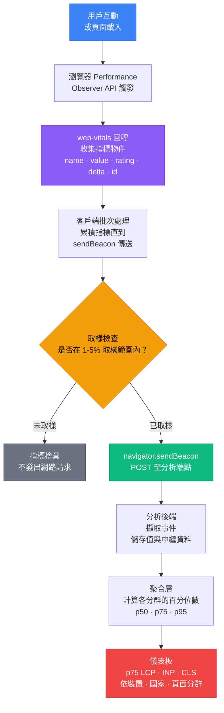

# 真實用戶監控與 Core Web Vitals

## 背景脈絡

效能不是一份報告上的數字，而是分散在數百萬台裝置、網路環境與使用情境中的真實體驗。在開發者的 M2 MacBook Pro 上、透過快速辦公室 Wi-Fi 量測得到的 Lighthouse 分數 95，對於一位使用四年前低階 Android 手機、在訊號不穩的 LTE 環境下瀏覽的用戶而言，幾乎毫無參考價值。

實驗室效能與現場效能之間的這道鴻溝，正是**真實用戶監控（Real User Monitoring，RUM）**要解決的核心問題。RUM 從實際用戶工作階段中收集效能指標：真實的裝置、真實的瀏覽器、真實的網路，以及真實的頁面載入——包含所有 Lighthouse 從未見過的第三方腳本、A/B 測試酬載，以及功能旗標覆寫。

**Core Web Vitals** 是 Google 在 2020 年推出的標準化以用戶為中心的效能指標集合，並自 2021 年起納入 Google 搜尋排名。它們衡量感知品質的三個維度：

- **LCP（Largest Contentful Paint，最大內容繪製）：** 主要內容出現的速度有多快？LCP 測量從頁面導航開始，到視窗中最大的圖片或文字區塊完成渲染所需的時間。
- **INP（Interaction to Next Paint，互動到下一次繪製）：** 頁面的互動響應感覺如何？INP 測量從用戶輸入（點擊、觸碰、鍵盤按鍵）到下一次頁面繪製的延遲。INP 在 2024 年 3 月取代了 FID（First Input Delay），因為 FID 只測量瀏覽器開始處理第一次互動前的延遲，而 INP 則測量頁面整個生命週期中所有互動的完整端對端互動成本。
- **CLS（Cumulative Layout Shift，累積版面配置位移）：** 版面配置的穩定性如何？CLS 測量非預期的視覺位移——當沒有設定尺寸的圖片延遲載入、動態內容插入到現有內容上方，或字型在渲染過程中交換時，元素在初始渲染後發生移動的情況。

每個指標有三個評分區間：

| 指標 | 良好 | 需要改善 | 差 |
|------|------|----------|-----|
| LCP | < 2.5s | 2.5s – 4s | > 4s |
| INP | < 200ms | 200ms – 500ms | > 500ms |
| CLS | < 0.1 | 0.1 – 0.25 | > 0.25 |

由 Google 維護的 `web-vitals` JavaScript 函式庫，透過瀏覽器的 Performance Observer API 提供了收集這三個指標（以及 FCP 和 TTFB）的穩定介面。它是任何 RUM 管線的標準監測層。

除了 Google 排名之外，Core Web Vitals 的重要性在於：它們是網頁平台目前最接近用戶體驗品質共同語彙的東西。LCP 低於 2.5s 代表用戶能快速看到內容。INP 低於 200ms 代表互動感覺即時。CLS 低於 0.1 代表版面配置值得信賴。當一個團隊承諾在生產環境中維持這些閾值——以 p75 為基準、跨真實裝置量測——他們就是在承諾一個具體的用戶體驗標準。

## 設計思維

### 為何 RUM 在生產監控上優於 Lighthouse

Lighthouse 是一種合成監控工具：它在受控環境（Chrome DevTools Protocol、特定的 CPU 節流等級、特定的網路節流預設）中，於單一裝置上執行一次有腳本的頁面載入，在單一時間點產生結果。它具有確定性和可重現性，因此非常適合作為 CI 品質門檻和開發期間的開發者回饋工具。WebPageTest 是另一個強大的合成監控工具，支援多步驟腳本、自訂連線限速配置和詳細的瀑布圖分析——但它與所有合成監控工具共享相同的根本限制：在受控的實驗室環境中執行，而非在真實用戶的設備和網路上。

但生產環境並非受控環境。真實用戶透過以下環境存取你的應用程式：

- 裝置從上個月發布的旗艦手機，到配備單顆緩慢 CPU 核心的四年前低階 Android。
- 網路從千兆光纖，到時斷時續的邊緣 LTE。
- 瀏覽器版本包括最新版 Chrome，但也有 Firefox ESR、舊款 iPhone 上的 Safari，以及平價 Android 裝置上的 Samsung Internet。
- 包含你的 CI Lighthouse 從未載入的第三方分析腳本、A/B 測試酬載和 Cookie 同意橫幅的工作階段。
- 首次訪客的冷快取狀態，以及回訪用戶的暖快取狀態。

Lighthouse 分數告訴你在某一組特定條件下效能看起來如何。RUM 告訴你效能在用戶實際體驗的條件分佈中看起來如何。這兩個數字往往差距甚大。Lighthouse LCP 為 1.8s（良好）的頁面，若有相當比例的用戶使用低速行動裝置，很容易出現 p75 現場 LCP 為 4.2s（差）的情況。

關於是否投資伺服器端渲染、圖片最佳化、JavaScript 分割或快取策略的生產決策，必須由現場資料驅動，而非實驗室資料。Lighthouse 是開發工具。RUM 是生產監測儀器。

### 為何 INP 取代了 FID

FID（First Input Delay）只測量用戶第一次互動和瀏覽器第一次有機會回應之間的延遲——而非互動實際花了多長時間處理，也不測量第一次之後的任何後續互動。一個頁面可以有良好的 FID 分數，同時在第一次點擊後進行大量資料處理時完全失去響應。

INP（Interaction to Next Paint）於 2022 年作為實驗性指標推出，並在 2024 年 3 月取代 FID 成為 Core Web Vital，它測量頁面整個生命週期中互動的端對端延遲。對於每次互動（點擊、觸碰、鍵盤輸入），INP 測量從輸入事件到下一次畫面繪製的時間。回報的 INP 值是整個工作階段中觀測到的最差互動延遲（允許少量離群值，以避免單一異常事件主導分數）。

這代表 INP 能揭露 FID 遺漏的真實響應性問題：長時間執行的事件處理器、由用戶操作觸發的大量重新渲染、阻塞主執行緒的同步儲存存取，以及延遲畫面繪製的第三方腳本。

### 為何 p75 是正確的百分位數

當一個團隊回報「我們的平均 LCP 是 2.1s」，他們隱藏了一個關鍵的分佈情況。平均值 2.1s 可能代表：

- 90% 的用戶 LCP 為 1.5s，10% 的用戶 LCP 為 8.6s——嚴重的尾部問題影響十分之一的用戶。
- 50% 的用戶為 1.0s，50% 的用戶為 3.2s——雙峰分佈，半數用戶效能差。

平均值掩蓋了慢尾用戶的體驗，而這些用戶往往正是使用最差裝置和連線的用戶——通常也是最沒有其他平台選擇的用戶。

Google 的 Chrome UX Report（CrUX）使用 **p75** 作為搜尋排名的閾值：URL 在 Google 搜尋中的 Core Web Vitals 評分，是由現場量測的第 75 百分位數是否落在良好、需要改善或差的區間來決定。p75 代表 75% 的用戶體驗到等於或優於回報值的效能。針對 p75 最佳化，意味著為大多數真實用戶最佳化，而非只為最佳情況的用戶最佳化。

p75 比 p95 或 p99（更嘈雜且更難改善）更具可行性，也比 p50（中位數，隱藏了較差的一半分佈）更誠實。

### 為何大規模流量下需要取樣

在大規模流量下，將每個用戶工作階段的每個指標事件傳送到分析端點是昂貴的。一個每日有 100 萬訪客的網站，每次頁面載入收集五個指標（LCP、INP、CLS、FCP、TTFB），每天就會產生 500 萬個分析事件。以標準分析數據擷取成本計算，這將成為可觀的基礎設施支出——而從 100 萬個數據點增加到 100 萬個數據點的邊際價值為零。

對 100 萬個工作階段取 1% 的樣本，可提供 10,000 個數據點——足以以緊密信賴區間估計 p75 的統計量。5% 的樣本提供 50,000 個數據點，對於依裝置類別、地理區域或頁面範本進行分群已綽綽有餘。

正確的取樣率取決於流量量：

- 高流量網站（每日工作階段 100 萬以上）：1–2% 取樣
- 中等流量網站（每日工作階段 10 萬至 100 萬）：5–10% 取樣
- 低流量網站（每日工作階段低於 10 萬）：100%（無需取樣）

取樣應基於工作階段（每個工作階段決定一次，而非每個指標事件），以確保被取樣工作階段的所有指標都一起回報，保留在同一次訪問中關聯 LCP、INP 和 CLS 的能力。

## 最佳實踐

**必須（MUST）使用 `web-vitals` 函式庫中的 `onINP` 測量互動響應性——禁止（MUST NOT）使用已棄用的 `onFID`。** INP 在 2024 年 3 月正式取代 FID 成為 Core Web Vital，它測量頁面整個生命週期中的端對端互動延遲。團隊必須（MUST）將現有的 FID 監測工具遷移至 INP；舊儀表板中的 FID 資料應該（SHOULD）僅視為歷史資料。

**必須（MUST）以 p75 百分位數——而非平均值——回報 Core Web Vitals。** Google 的排名演算法以真實 Chrome 工作階段的第 75 百分位數評估 URL 的 Core Web Vitals。平均值 2.0s 的 LCP 可能掩蓋雙峰分佈，其中半數用戶體驗到 3.5s LCP。團隊必須（MUST）設定分析後端使用百分位數聚合（例如 ClickHouse 中的 `quantile(0.75)(value)`）。

**應該（SHOULD）使用 `navigator.sendBeacon`——而非 `fetch`——將 RUM 指標事件提交至分析端點。** 工作階段後期收集的指標（特別是 INP）如果使用 `fetch` 回報，在用戶導航離開時有遺失的風險。團隊應該（SHOULD）同時監聽 `visibilitychange` 事件，在 `document.visibilityState === 'hidden'` 時刷新指標佇列。

**應該（SHOULD）以工作階段為單位進行取樣——而非以每個指標事件為單位——然後再傳送資料至分析端點。** 在 `sessionStorage` 中對每個工作階段做一次取樣決策，並對該工作階段的所有指標統一套用。按指標取樣會產生不一致的資料集，使同一工作階段的 LCP 和 INP 無法互相關聯。

**應該（SHOULD）在做出效能結論前，依頁面範本、裝置類別和瀏覽器對 RUM 資料進行分群。** 整個網站的單一 p75 LCP 聚合值掩蓋了結帳頁面在行動裝置上 LCP 為 4.5s 的問題。團隊應該（SHOULD）將 CrUX 和自有 RUM 管線的現場資料視為生產效能決策的權威依據；Lighthouse 應該（SHOULD）僅作為開發階段的工具。

**必須（MUST）以工作階段為單位做取樣決策，而非以每個指標為單位。** 在 `sessionStorage` 中對每個工作階段做一次取樣決策，並對該工作階段的所有指標統一套用。按指標取樣會產生不一致的資料集，使同一工作階段的 LCP 和 INP 無法互相關聯。團隊應該（SHOULD）依流量量設定取樣率：超過 100 萬每日工作階段取 1–2%，10 萬至 100 萬取 5–10%，10 萬以下不取樣（100%）。

## 視覺化

### RUM 管線

以下圖表顯示從用戶互動到監控儀表板中可見的 p75 分佈的路徑。當瀏覽器確定一個指標時，`web-vitals` 觀察器就會觸發，資料在客戶端進行批次處理以減少網路請求，並將批次傳送到將指標聚合成百分位分佈的分析端點。



## 範例

### 安裝與設定 `web-vitals` 函式庫

```bash
npm install web-vitals
```

此函式庫為每個指標提供個別的函式。每個函式接受一個回呼，接收具有一致結構的指標物件：

```ts
import { onLCP, onINP, onCLS, onFCP, onTTFB } from 'web-vitals';

// 每個回呼接收：{ name, value, rating, delta, id, navigationType }
onLCP(console.log);
onINP(console.log);
onCLS(console.log);
```

`rating` 欄位一律為 `'good'`、`'needs-improvement'` 或 `'poor'` 之一——函式庫會自動套用標準閾值。

### 將指標傳送至分析端點

建議的模式是在指標觸發時收集它們，並在用戶離開頁面時使用 `navigator.sendBeacon` 批次傳送，以確保請求在頁面卸載時也能完成：

```ts
// src/lib/vitals.ts
import { onLCP, onINP, onCLS, onFCP, onTTFB, type Metric } from 'web-vitals';

const queue: Metric[] = [];
let scheduled = false;

function scheduleFlush() {
  if (scheduled) return;
  scheduled = true;
  if (typeof requestIdleCallback !== 'undefined') {
    requestIdleCallback(flush, { timeout: 2500 });
  } else {
    setTimeout(flush, 0);
  }
}

function flush() {
  if (queue.length === 0) return;
  const body = JSON.stringify({
    metrics: queue.map((m) => ({
      name: m.name,
      value: m.value,
      rating: m.rating,
      id: m.id,
      navigationType: m.navigationType,
    })),
    url: location.href,
    timestamp: Date.now(),
  });
  // sendBeacon 在頁面卸載時仍能運作；fetch 則不行
  navigator.sendBeacon('/api/vitals', new Blob([body], { type: 'application/json' }));
  queue.length = 0;
  scheduled = false;
}

function collect(metric: Metric) {
  queue.push(metric);
  scheduleFlush();
}

addEventListener('visibilitychange', () => {
  if (document.visibilityState === 'hidden') flush();
});
addEventListener('pagehide', flush);

export function initVitals() {
  onLCP(collect);
  onINP(collect);
  onCLS(collect);
  onFCP(collect);
  onTTFB(collect);
}
```

在應用程式啟動時呼叫一次 `initVitals()`：

```ts
// src/main.ts
import { initVitals } from './lib/vitals';

initVitals();
// ... 其餘應用程式初始化
```

### 加入取樣機制

在回報路徑中加入以工作階段為單位的取樣決策，每個工作階段決定一次並儲存在 `sessionStorage`：

```ts
// src/lib/vitals.ts（含取樣）
import { onLCP, onINP, onCLS, onFCP, onTTFB, type Metric } from 'web-vitals';

const SAMPLE_RATE = 0.05; // 5% 的工作階段

function shouldSample(): boolean {
  const key = 'rum_sampled';
  const stored = sessionStorage.getItem(key);
  if (stored !== null) return stored === '1';
  const sampled = Math.random() < SAMPLE_RATE;
  sessionStorage.setItem(key, sampled ? '1' : '0');
  return sampled;
}

function sendMetric(metric: Metric) {
  const body = JSON.stringify({
    name: metric.name,
    value: metric.value,
    rating: metric.rating,
    id: metric.id,
    url: location.href,
  });
  navigator.sendBeacon('/api/vitals', new Blob([body], { type: 'application/json' }));
}

export function initVitals() {
  if (!shouldSample()) return; // 未取樣的工作階段提前退出

  onLCP(sendMetric);
  onINP(sendMetric);
  onCLS(sendMetric);
  onFCP(sendMetric);
  onTTFB(sendMetric);
}
```

### 分析端點（Node.js / Edge Function）

一個接收指標事件並轉發到時序儲存或分析平台的最小端點：

```ts
// api/vitals.ts（Next.js API route 或 Vercel Edge Function）
import type { NextRequest } from 'next/server';

export const runtime = 'edge';

export async function POST(req: NextRequest) {
  const body = await req.json();
  const { name, value, rating, id, url } = body;

  // 轉發至你的分析後端（例如 ClickHouse、BigQuery、Datadog）
  await fetch(process.env.ANALYTICS_INGEST_URL!, {
    method: 'POST',
    headers: {
      'Content-Type': 'application/json',
      'Authorization': `Bearer ${process.env.ANALYTICS_TOKEN}`,
    },
    body: JSON.stringify({
      metric: name,
      value,
      rating,
      event_id: id,
      page_url: url,
      ts: Date.now(),
    }),
  });

  return new Response(null, { status: 204 });
}
```

### Vercel Speed Insights

對於部署在 Vercel 上的應用程式，Speed Insights 提供內建的 Core Web Vitals RUM，除了安裝套件外，零設定即可使用：

```bash
npm install @vercel/speed-insights
```

在 React 應用程式中：

```tsx
// src/main.tsx
import { SpeedInsights } from '@vercel/speed-insights/react';

export function App() {
  return (
    <>
      {/* 你的應用程式 */}
      <SpeedInsights />
    </>
  );
}
```

對於使用 `inject` 函式的框架無關方式：

```ts
import { inject } from '@vercel/speed-insights';

inject();
```

Vercel Speed Insights 在 Vercel 儀表板中聚合指標，並按路由、裝置類型和國家呈現 p75 值。資料來自真實用戶工作階段，而非合成量測。

### Datadog RUM

對於已使用 Datadog 進行基礎設施監控的組織，Datadog RUM 將 Core Web Vitals 整合到與 APM 追蹤和基礎設施指標相同的可觀測性平台：

```bash
npm install @datadog/browser-rum
```

```ts
// src/lib/datadog.ts
import { datadogRum } from '@datadog/browser-rum';

datadogRum.init({
  applicationId: 'YOUR_APPLICATION_ID',
  clientToken: 'pub_XXXXXXXXXXXXXXXXXXXXXXXXXXXXXXXX',
  site: 'datadoghq.com',
  service: 'your-frontend-service',
  env: import.meta.env.MODE,
  version: import.meta.env.VITE_RELEASE,
  sessionSampleRate: 5,            // 5% 的工作階段
  sessionReplaySampleRate: 1,      // 1% 的工作階段錄製 Session Replay
  trackUserInteractions: true,     // 啟用 INP 追蹤
  trackResources: true,            // 追蹤資源時序
  trackLongTasks: true,            // 追蹤長時間任務（> 50ms）
  defaultPrivacyLevel: 'mask-user-input',
});
```

Datadog RUM 自動收集 LCP、INP 和 CLS，並在 Core Web Vitals 儀表板中按瀏覽器、裝置、國家和頁面呈現 p50/p75/p95 分佈。

### Cloudflare Browser Insights

Cloudflare Browser Insights 是內建在 Cloudflare 代理層的零設定 RUM 工具。對於已使用 Cloudflare 代理的網站，可在 Cloudflare 儀表板的 **Speed → Browser Insights** 中啟用，無需安裝任何 JavaScript SDK。

啟用後，Cloudflare 會從真實瀏覽器工作階段收集 Core Web Vitals（LCP、INP、CLS）和頁面載入指標。結果會依國家、瀏覽器和連線類型分類顯示在 Cloudflare 儀表板中。

**適合場景：** 已使用 Cloudflare 的團隊，需要基本 RUM 但不想新增 JavaScript 依賴。它不支援自訂事件追蹤、用戶上下文或自訂維度——這些需求請改用 Datadog RUM 或 Vercel Speed Insights。

### 從 Google Search Console 讀取 CrUX 資料

Google Search Console 的 Core Web Vitals 報告顯示來自 Chrome UX Report（CrUX）的現場資料——這是 Google 聚合的真實 Chrome 用戶工作階段。這是 Google 排名演算法評估你的 Core Web Vitals 的權威來源。

導航路徑：Google Search Console > 體驗 > Core Web Vitals。

報告顯示：
- 評級為良好、需要改善或差的 URL 數量。
- 哪些特定 URL 有 LCP、INP 或 CLS 問題。
- 行動裝置和桌機是否有顯著差異。

CrUX 資料是 28 天滾動彙整的 Chrome 工作階段。它不是即時的，且不支援細粒度分群，但它是 Google 如何感知你的效能的權威視角。

如需程式化存取，CrUX API 位於 `https://chromeuxreport.googleapis.com/v1/records:queryRecord`。

## 常見錯誤

### 忽略動態內容造成的 CLS 退步

CLS 退步通常由以下原因引入：
- 沒有明確 width/height 屬性的圖片輪播
- 在初始渲染後插入到頁面內容上方的 Cookie 同意橫幅
- 伺服器端渲染的列表被高度不同的客戶端渲染列表取代
- 網頁字型在字型交換期間造成文字重排

CLS 退步通常在 RUM 資料中出現，早於被視覺發現。監控 p75 CLS，並對超過 0.1 的退步設定警示。

## 相關 FEE

- [FEE-1400：可觀測性與錯誤追蹤總覽](./1400.md) — 類別背景和前端可觀測性的三大支柱
- [FEE-1401：使用 Sentry 進行錯誤追蹤](./1401.md) — Sentry 用於捕獲 JavaScript 例外和效能追蹤
- [FEE-1404：OpenTelemetry 瀏覽器追蹤](./1404.md) — 從瀏覽器到後端的分散式追蹤，補充 RUM 指標資料
- [FEE-1405：功能旗標可觀測性與 A/B 測試](./1405.md) — LCP 和 INP 作為 A/B 實驗的預先指定護欄指標；將 Core Web Vitals 作為 PostHog 事件回報以進行各變體分析
- [FEE-1406：Core Web Vitals 的 SLO](./1406.md) — 為 LCP、INP 和 CLS 定義和設定服務等級目標的警示

## 參考資料

- [web-vitals 函式庫 GitHub](https://github.com/GoogleChrome/web-vitals)
- [Core Web Vitals — web.dev](https://web.dev/articles/vitals)
- [INP 取代 FID 公告 — Google Search Central](https://developers.google.com/search/blog/2023/05/introducing-inp)
- [CrUX API 文件](https://developer.chrome.com/docs/crux/api/)
- [Google Search Console Core Web Vitals 報告](https://support.google.com/webmasters/answer/9205520)
- [Vercel Speed Insights 文件](https://vercel.com/docs/speed-insights)
- [Datadog RUM 文件](https://docs.datadoghq.com/real_user_monitoring/application_monitoring/browser/)
- [Cloudflare Browser Insights](https://developers.cloudflare.com/web-analytics/)
- [navigator.sendBeacon — MDN](https://developer.mozilla.org/en-US/docs/Web/API/Navigator/sendBeacon)
- [Chrome UX Report — web.dev](https://developer.chrome.com/docs/crux/)
