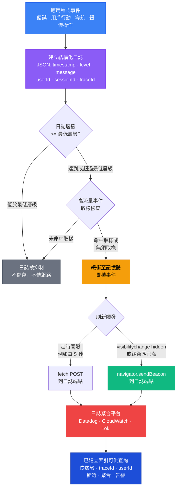

# 日誌記錄與結構化日誌

## 背景脈絡

每個有一定規模的前端應用程式，遲早都會遇到一個無法在本地環境重現的問題：用戶回報「結帳壞了」，但只在 Safari 上、只在星期二、只在購物車放了特定商品組合時才會發生。沒有日誌，你只能憑空重建過去的狀況。有了日誌，你就有一份記錄：發生了什麼、什麼時候發生、在什麼情境下發生。

但在生產環境中真正有用的日誌，並不是開發過程中隨意散落在程式碼各處的 `console.log`。那些日誌對人類可讀，但轉瞬即逝——它們出現在開發者的瀏覽器 DevTools 中，分頁一關就消失了。生產環境的可觀測性需要的是截然不同的日誌形式：結構化、機器可解析、格式一致的記錄，可以被日誌聚合平台攝取、用篩選器查詢、聚合成指標，並接到告警規則上。

**結構化日誌**是將日誌記錄以 JSON 物件形式輸出（具備一致的資料綱要），而非以自由格式字串輸出的實踐。與其這樣：

```
[ERROR] Payment failed for user john@example.com at 2026-04-10T09:12:44Z
```

結構化日誌記錄長這樣：

```json
{
  "timestamp": "2026-04-10T09:12:44.123Z",
  "level": "error",
  "message": "Payment failed",
  "userId": "u_8f3a2c",
  "sessionId": "s_9d1e4b",
  "traceId": "4bf92f3577b34da6a3ce929d0e0e4736",
  "errorCode": "PAYMENT_DECLINED",
  "orderId": "ord_2025_0041"
}
```

這個差異不只是外觀問題。日誌平台攝取第一種格式時，必須套用脆弱的正規表達式解析才能取出任何結構化資訊。攝取第二種格式時，可以立即依 `level:error` 篩選、依 `errorCode` 分組、依 `traceId` 連結對應的後端追蹤，並在 `PAYMENT_DECLINED` 的錯誤率超過閾值時發出告警——完全不需要任何自訂解析設定。

前端日誌橫跨兩種截然不同的執行環境。在**瀏覽器**中，應用程式可以存取 DOM、用戶互動事件、導航歷史和瀏覽器 API——但沒有持久化儲存，且任何用來傳送日誌的對外網路請求都可能因頁面卸載而被取消。在 **SSR 和 Node.js 伺服器情境**中（Next.js API 路由、Nuxt 伺服器中介層、Remix loader），應用程式在伺服器上執行，有長期存活的程序、檔案系統存取和同步 I/O 可用。

每種環境需要量身打造的日誌策略。本文同時涵蓋這兩種情境，以及將它們連接到集中式日誌平台的日誌管線。

## 設計思維

### 為何結構化日誌優於 `console.log`

`console.log('Payment failed for', user.email)` 產生一個非結構化字串。這個字串在瀏覽器 DevTools 中對人類可讀，但對任何自動化系統而言幾乎是不透明的。當來自數千個並發用戶工作階段的日誌抵達日誌聚合平台時，每個事件都是一個字串，必須經過解析才能被使用。

Datadog、AWS CloudWatch、Grafana Loki 等日誌平台可以攝取原始文字並套用以正規表達式為基礎的解析規則。但這會產生脆弱的依賴關係：解析規則與確切的字串格式緊密耦合，因此任何日誌訊息的變更——哪怕只是增加一個詞——都可能悄悄破壞解析器，使所有衍生的指標和告警失效。

結構化日誌完全避免了這個問題。具備穩定綱要的 JSON 物件可以直接被攝取。欄位可以立即查詢。不需要解析設定。篩選器、聚合和告警規則參照欄位名稱（`level`、`errorCode`、`traceId`），而非字串模式。當 `message` 欄位改變時，針對 `errorCode: "PAYMENT_DECLINED"` 的篩選不受影響。

實際意涵：使用 `console.log` 的團隊，若想回答「過去一小時有多少用戶遇到付款錯誤，依錯誤碼分類？」，必須手動解析日誌或建立並維護脆弱的解析規則。使用結構化日誌的團隊，用日誌平台中的一個篩選查詢就能回答這個問題。

### 為何頁面卸載時要使用 `sendBeacon`

瀏覽器的標準資料傳送機制——`fetch` 和 XHR——與頁面的生命週期綁定。當用戶離開頁面、關閉分頁，或瀏覽器程序終止時，所有進行中或待傳送的 `fetch` 或 XHR 請求都會被取消。這是設計使然：瀏覽器在頁面卸載時終止所有與該頁面相關的網路活動。

對大多數應用程式資料來說，這沒問題。但對日誌傳遞而言，這造成了一個關鍵的缺口。診斷價值最高的日誌事件，往往是在導航或頁面關閉前的瞬間發生的：導致用戶放棄結帳流程的錯誤、分頁關閉前最後一次互動時發生的崩潰、用戶離開前記錄的效能事件。

`navigator.sendBeacon(url, data)` 正是為了解決這個問題而設計的。它佇列一個小型 HTTP POST 請求，瀏覽器承諾即使在頁面卸載時也會傳遞。從應用程式的角度來看，這個請求是射後不理的：沒有回應回呼。瀏覽器在頁面生命週期結束後處理實際的傳輸。

關鍵限制在於資料格式：`sendBeacon` 接受 `Blob`、`FormData`、`URLSearchParams` 或字串。對於 JSON 酬載，將序列化後的字串包裝在具有正確 MIME 類型的 `Blob` 中：

```ts
navigator.sendBeacon(
  '/api/logs',
  new Blob([JSON.stringify(payload)], { type: 'application/json' })
);
```

### 為何批次處理很重要

一個每天服務 10 萬名活躍用戶、每個工作階段記錄 10 個事件的生產前端應用程式，每天產生 100 萬個日誌事件。如果每個日誌事件都觸發一個單獨的 HTTP POST 到日誌攝取端點，那就是每天 100 萬個網路請求——產生可觀的伺服器負載、明顯增加用戶的資料用量，並為應用程式增加延遲（每次日誌呼叫都會佇列一個網路請求）。

批次處理透過在記憶體中累積日誌事件，並在定期刷新間隔（例如每 5 秒）或緩衝區達到大小閾值（例如 50 個事件）時批量傳送來解決這個問題。每天 100 萬個事件，在每 5 秒刷新的情況下，變成大約 20 萬個網路請求——而實際上更少，因為許多工作階段不到 5 秒。

兩種刷新觸發條件應該同時存在：
- **定時刷新**：透過 `setInterval` 執行，確保即使在長時間工作階段中日誌也能定期傳遞。
- **可見性變更刷新**：在 `document.visibilityState === 'hidden'` 時觸發，在頁面卸載前刷新緩衝區。使用 `sendBeacon` 確保傳遞。

### 為何 PII 出現在日誌中是合規地雷

日誌記錄通常在日誌聚合平台中儲存 30–90 天。日誌平台的存取權限往往比生產資料庫更廣——可能由 DevOps 團隊、安全團隊共享，有時還包括提供平台本身的第三方供應商。

記錄電子郵件地址、全名、住址或任何其他個人識別資訊，意味著這些資料現在被複製到日誌儲存系統中，在日誌保留期間被保存，並且可以被所有有日誌存取權的人查看——無論主要資料庫中存在什麼資料存取控制。

在 GDPR 框架下，這會產生資料處理義務：被記錄的 PII 是個人資料記錄，受到刪除權、存取權和資料外洩通知要求的約束。用戶要求刪除其資料時，也必須從日誌儲存中刪除其資料——這對大多數日誌平台來說在操作上非常複雜，甚至在實務上不可能實現。

正確的做法是記錄不透明識別碼而非 PII：

| 不要記錄 | 改為記錄 |
|---------|--------|
| `user.email` | `user.id`（不透明的內部 ID） |
| `user.name` | `user.id` |
| `paymentCard.number` | `paymentCard.lastFour` 或 `paymentCard.tokenId` |
| `user.address` | 工作階段或匿名化的區段 ID |

若業務需要將日誌記錄關聯到特定用戶（例如支援調查），這個對應關係在應用程式資料庫中完成，而非在日誌平台中。

### 為何日誌層級很重要

日誌層級——`debug`、`info`、`warn`、`error`——有兩個作用。在開發時，它們讓開發者可以篩選主控台，只顯示關心的事件。在生產環境中，它們控制哪些事件根本不會被傳送到日誌平台。

一個常見的做法是依環境設定最低日誌層級：

- **開發環境**：`debug` 及以上（全部記錄）
- **測試環境**：`info` 及以上
- **生產環境**：`warn` 及以上（如果 info 層級日誌對追蹤用戶旅程有用，也可以是 `info`）

在生產環境傳送 `debug` 層級日誌，是日誌量爆炸和不必要成本的常見來源。Debug 日誌是為開發時期的診斷輸出設計的——元件掛載/卸載週期、API 請求細節、內部狀態轉換——在生產應用程式中會產生龐大的量。將生產環境的最低層級設定為 `warn` 或 `info`，可確保只儲存和計費可操作的事件。

層級順序：`debug < info < warn < error`。層級達到或超過設定最低值的事件會被記錄；低於最低值的事件會被抑制。

## 最佳實踐

**禁止（MUST NOT）在任何日誌記錄中記錄個人識別資訊（PII）。** 電子郵件地址、全名、支付卡資料和原始用戶輸入儲存在日誌平台中，會在通常與第三方供應商共享的系統上產生 GDPR 資料保留和刪除義務。團隊必須（MUST）只記錄不透明的內部識別碼（例如 `user.id`），並且必須（MUST）由日誌記錄器實作——而非呼叫端——強制執行此約束。

**必須（MUST）在頁面卸載時使用 `navigator.sendBeacon` 傳送日誌——而非 `fetch` 或 XHR。** 當用戶導航離開、關閉分頁或瀏覽器程序終止時，`fetch` 請求會被瀏覽器取消。診斷價值最高的日誌事件——導致結帳放棄的錯誤、分頁關閉前發生的崩潰——正是最有可能遺失的。團隊必須（MUST）監聽 `visibilitychange` 事件並在 `document.visibilityState === 'hidden'` 時刷新，這比 `beforeunload` 在行動瀏覽器上更可靠。

**必須（MUST）將日誌事件在記憶體中批次處理，並以定時間隔刷新，而非每次日誌呼叫各發送一個 HTTP 請求。** 每天有 10 萬名活躍用戶的正式環境應用程式，若每個日誌事件觸發一個請求，每天就會產生 100 萬個網路請求，增加延遲和伺服器負載。團隊必須（MUST）至少實作 5 秒定時刷新和緩衝區大小刷新（例如 50 個事件），可見性變更刷新則應使用 `sendBeacon` 確保傳遞。

**應該（SHOULD）使用具備一致綱要的結構化 JSON 日誌——而非 `console.log`。** 攝取自由格式字串的日誌平台必須套用脆弱的正規表達式解析才能提取結構化資料。一致的綱要（`timestamp`、`level`、`message`、`userId`、`sessionId`、`traceId`）讓平台可以立即依層級篩選、依錯誤碼分組，並透過 `traceId` 與後端追蹤關聯，無需任何解析設定。團隊應該（SHOULD）在日誌記錄器實作中強制執行基礎綱要，確保每筆記錄自動包含上下文欄位。

**應該（SHOULD）依環境設定最低日誌層級：開發環境使用 `debug`，正式環境使用 `info` 或 `warn`。** Debug 日誌包含元件生命週期事件和內部狀態轉換，在正式環境中會產生龐大的量。團隊應該（SHOULD）在正式環境設定 `minLevel: 'info'` 或 `minLevel: 'warn'`，防止 debug 層級雜訊消耗日誌平台儲存配額並遮蔽可操作事件。

**應該（SHOULD）在任何環境中使用 Pino（Node.js/SSR）或結構化瀏覽器日誌記錄器，而非 `console.log`。** 在正式環境瀏覽器情境中，`console.log` 對任何監控系統都是不可見的，在用戶關閉 DevTools 時就消失了。對於伺服器端情境（Next.js API 路由、Nuxt 中介層、Express），Pino 將換行符分隔的 JSON 寫入 stdout，日誌收集器（Datadog Agent、Fluent Bit、CloudWatch Agent）可以不需額外設定就直接轉發。

**應該（SHOULD）以可設定的比率（例如 5–10%）對高流量日誌事件——詳細的用戶互動追蹤、導航事件——進行取樣，以避免日誌平台超載。** 每天有大量活躍用戶的正式環境應用程式，詳細的互動追蹤若不加以取樣，可能每天產生數億筆日誌記錄，遠超日誌平台的儲存配額且徒增成本。應在日誌記錄器層實作取樣邏輯，以確保取樣行為一致，而非散落在各呼叫端。

## 視覺化

### 日誌管線

下圖顯示從應用程式事件到日誌平台中可查詢記錄的路徑。事件以一致的 JSON 綱要建立，累積在記憶體緩衝區中，定期刷新或在頁面隱藏時使用 `sendBeacon` 刷新，並由日誌平台攝取後建立索引以供查詢。



## 範例

### 具備批次處理與 `sendBeacon` 的瀏覽器日誌記錄器

以下實作提供了一個精簡但符合生產標準的瀏覽器日誌記錄器：結構化 JSON 輸出、記憶體內批次處理、定時刷新，以及在頁面隱藏時使用 `sendBeacon` 保證刷新。

```ts
// src/lib/logger.ts

type LogLevel = 'debug' | 'info' | 'warn' | 'error';

interface LogRecord {
  timestamp: string;
  level: LogLevel;
  message: string;
  userId?: string;
  sessionId?: string;
  traceId?: string;
  [key: string]: unknown;
}

interface LoggerConfig {
  endpoint: string;
  minLevel: LogLevel;
  flushIntervalMs: number;
  maxBufferSize: number;
  userId?: string;
  sessionId?: string;
}

const LEVEL_RANK: Record<LogLevel, number> = {
  debug: 0,
  info: 1,
  warn: 2,
  error: 3,
};

export class BrowserLogger {
  private buffer: LogRecord[] = [];
  private timer: ReturnType<typeof setInterval> | null = null;
  private config: LoggerConfig;

  constructor(config: LoggerConfig) {
    this.config = config;
    this.startFlushTimer();
    this.registerUnloadFlush();
  }

  private isAboveMinLevel(level: LogLevel): boolean {
    return LEVEL_RANK[level] >= LEVEL_RANK[this.config.minLevel];
  }

  private createRecord(
    level: LogLevel,
    message: string,
    fields?: Record<string, unknown>
  ): LogRecord {
    return {
      timestamp: new Date().toISOString(),
      level,
      message,
      userId: this.config.userId,
      sessionId: this.config.sessionId,
      ...fields,
    };
  }

  private enqueue(record: LogRecord): void {
    this.buffer.push(record);
    if (this.buffer.length >= this.config.maxBufferSize) {
      this.flush();
    }
  }

  debug(message: string, fields?: Record<string, unknown>): void {
    if (!this.isAboveMinLevel('debug')) return;
    this.enqueue(this.createRecord('debug', message, fields));
  }

  info(message: string, fields?: Record<string, unknown>): void {
    if (!this.isAboveMinLevel('info')) return;
    this.enqueue(this.createRecord('info', message, fields));
  }

  warn(message: string, fields?: Record<string, unknown>): void {
    if (!this.isAboveMinLevel('warn')) return;
    this.enqueue(this.createRecord('warn', message, fields));
  }

  error(message: string, fields?: Record<string, unknown>): void {
    if (!this.isAboveMinLevel('error')) return;
    this.enqueue(this.createRecord('error', message, fields));
  }

  flush(useBeacon = false): void {
    if (this.buffer.length === 0) return;

    const records = [...this.buffer];
    this.buffer = [];

    const payload = JSON.stringify({ logs: records });
    const blob = new Blob([payload], { type: 'application/json' });

    if (useBeacon) {
      // 射後不理；頁面卸載時仍有效
      navigator.sendBeacon(this.config.endpoint, blob);
    } else {
      // 活躍工作階段期間盡力傳送；導航時可能被取消
      fetch(this.config.endpoint, {
        method: 'POST',
        body: blob,
        keepalive: true, // 在部分瀏覽器中允許請求在頁面消失後繼續
      }).catch(() => {
        // 靜默忽略——日誌傳遞是盡力而為
      });
    }
  }

  private startFlushTimer(): void {
    this.timer = setInterval(() => {
      this.flush();
    }, this.config.flushIntervalMs);
  }

  private registerUnloadFlush(): void {
    // visibilitychange + 'hidden' 是現代、行動裝置可靠的卸載訊號
    document.addEventListener('visibilitychange', () => {
      if (document.visibilityState === 'hidden') {
        this.flush(true); // 使用 sendBeacon 確保傳遞
      }
    });
  }
}
```

在應用程式啟動時初始化日誌記錄器一次，並以單例形式匯出：

```ts
// src/lib/logger.ts（續）

export const logger = new BrowserLogger({
  endpoint: '/api/logs',
  minLevel: import.meta.env.PROD ? 'info' : 'debug',
  flushIntervalMs: 5000,
  maxBufferSize: 50,
  userId: undefined,   // 驗證後設定
  sessionId: crypto.randomUUID(),
});
```

用戶驗證後，更新日誌記錄器的情境。常見做法是在日誌記錄器類別上提供一個 `setContext` 方法：

```ts
// src/auth.ts
import { logger } from './lib/logger';

async function onLoginSuccess(userId: string) {
  // 設定不透明的用戶 ID——絕不使用電子郵件地址
  logger.setContext({ userId });
  logger.info('User authenticated', { method: 'password' });
}
```

### 高流量事件的日誌取樣

並非所有日誌事件都有相同的診斷價值。導航事件和通用的頁面瀏覽日誌在每次路由變更時觸發，每個工作階段可能觸發數十次。在大規模情況下全量記錄這些事件會增加成本，但收益不成比例。對高流量事件類別套用取樣：

```ts
// src/lib/sampling.ts

const samplingDecisions = new Map<string, boolean>();

export function shouldSample(category: string, rate: number): boolean {
  if (samplingDecisions.has(category)) {
    return samplingDecisions.get(category)!;
  }
  const decision = Math.random() < rate;
  samplingDecisions.set(category, decision);
  return decision;
}
```

```ts
// 在路由守衛中使用
import { logger } from './lib/logger';
import { shouldSample } from './lib/sampling';

router.afterEach((to) => {
  // 導航日誌取樣率 10%；導航錯誤永遠記錄
  if (shouldSample('navigation', 0.10)) {
    logger.info('Page navigation', { path: to.path, name: to.name });
  }
});
```

錯誤事件不應該取樣——每個錯誤事件都有診斷意義。

### 使用 Pino 進行伺服器端日誌記錄

對於 SSR 環境（Next.js、Nuxt、Remix、Express），使用 **Pino**——一個高效能的 Node.js JSON 日誌記錄器。Pino 預設將結構化 JSON 寫入 stdout，由日誌收集器（Datadog Agent、CloudWatch Agent、Fluent Bit）接收並轉發到聚合平台。

```bash
npm install pino
npm install -D pino-pretty  # 在開發環境提供人類可讀的輸出
```

```ts
// src/server/logger.ts
import pino from 'pino';

const logger = pino({
  level: process.env.LOG_LEVEL ?? 'info',
  // 生產環境寫入 JSON；開發環境使用 pino-pretty 提高可讀性
  transport:
    process.env.NODE_ENV !== 'production'
      ? { target: 'pino-pretty', options: { colorize: true } }
      : undefined,
});

export default logger;
```

結構化欄位作為第一個引數傳入任何日誌方法：

```ts
// src/server/api/payment.ts
import logger from '../logger';

export async function processPayment(orderId: string, userId: string) {
  logger.info({ orderId, userId }, 'Payment processing started');

  try {
    const result = await paymentProvider.charge(orderId);
    logger.info({ orderId, userId, chargeId: result.id }, 'Payment succeeded');
    return result;
  } catch (err) {
    logger.error(
      { orderId, userId, err },
      'Payment processing failed'
    );
    throw err;
  }
}
```

Pino 會自動序列化 `err` 物件（包含 `message`、`stack` 和 `code`）。每個日誌事件的輸出是單一 JSON 行——非常適合日誌收集器。

注意此處的 `userId` 是內部不透明識別碼，而非電子郵件地址。

### 日誌攝取端點

瀏覽器日誌記錄器將日誌 POST 到一個伺服器端點，該端點驗證酬載並轉發至日誌平台：

```ts
// api/logs.ts（Next.js App Router 路由處理器）
import type { NextRequest } from 'next/server';
import logger from '@/server/logger';

export async function POST(req: NextRequest) {
  let body: unknown;

  try {
    body = await req.json();
  } catch {
    return new Response('Invalid JSON', { status: 400 });
  }

  if (
    typeof body !== 'object' ||
    body === null ||
    !Array.isArray((body as { logs?: unknown }).logs)
  ) {
    return new Response('Invalid payload', { status: 400 });
  }

  const { logs } = body as { logs: unknown[] };

  for (const record of logs) {
    // 驗證並轉發每筆記錄到日誌平台
    // 生產環境中轉發至 Datadog Logs、CloudWatch 或 Loki
    logger.info({ browserLog: record }, 'Browser log received');
  }

  return new Response(null, { status: 204 });
}
```

### Datadog Logs 整合

Datadog Logs 可以透過 Datadog 瀏覽器 SDK 直接接收瀏覽器日誌，不需要自訂日誌端點：

```bash
npm install @datadog/browser-logs
```

```ts
// src/lib/datadog-logs.ts
import { datadogLogs } from '@datadog/browser-logs';

datadogLogs.init({
  clientToken: 'pub_XXXXXXXXXXXXXXXXXXXXXXXXXXXXXXXX',
  site: 'datadoghq.com',
  service: 'your-frontend-service',
  env: import.meta.env.MODE,
  forwardErrorsToLogs: true,      // 自動捕獲未處理的錯誤
  sessionSampleRate: 100,         // 100% 的工作階段（高流量時調整）
});

// 只設定不透明 ID 的用戶情境
datadogLogs.setUser({ id: 'u_8f3a2c' });

// 使用結構化欄位記錄日誌
datadogLogs.logger.info('Checkout initiated', { orderId: 'ord_2025_0041' });
datadogLogs.logger.error('Payment failed', { errorCode: 'DECLINED' });
```

當日誌記錄中存在 `traceId` 時，Datadog Logs 會自動與 Datadog APM 追蹤關聯。

### AWS CloudWatch Logs（Node.js）

對於在 AWS 基礎設施上執行的應用程式，CloudWatch Logs 是標準的日誌目的地。使用 Pino 時，日誌寫入 stdout，由 CloudWatch Agent 或 ECS/Lambda 的日誌驅動程式收集：

```ts
// 不需要 SDK 整合——Pino 寫入 stdout，
// CloudWatch Agent 自動傳送日誌串流。
// 在 ECS 任務定義或 EC2 user data 中設定日誌群組。

import logger from './logger';
logger.info({ requestId: 'req_abc123', userId: 'u_8f3a2c' }, 'Request processed');
```

CloudWatch Logs Insights 支援針對 JSON 欄位的結構化查詢語法：

```
fields @timestamp, level, message, userId
| filter level = "error"
| sort @timestamp desc
| limit 50
```

## 相關 FEE

- [FEE-1400：可觀測性與錯誤追蹤總覽](./1400.md) — 類別背景與前端可觀測性的三大支柱
- [FEE-1401：使用 Sentry 進行錯誤追蹤](./1401.md) — 用 Sentry 捕獲 JavaScript 例外；Sentry 與結構化日誌是互補的——Sentry 用於錯誤追蹤，結構化日誌用於稽核軌跡和業務事件
- [FEE-1404：效能監控與追蹤](./1404.md) — Trace ID 源自分散式追蹤層；在每筆日誌記錄中包含 `traceId` 以實現日誌與追蹤的關聯
- [FEE-1407：工作階段重播與正式環境除錯](./1407.md) — LogRocket 結合工作階段回放與日誌捕獲；結構化日誌補充回放，有助於除錯複雜的狀態問題

## 參考資料

- [navigator.sendBeacon — MDN](https://developer.mozilla.org/en-US/docs/Web/API/Navigator/sendBeacon)
- [Pino — Node.js logger](https://github.com/pinojs/pino)
- [Winston — Node.js logger](https://github.com/winstonjs/winston)
- [Datadog Browser Logs SDK](https://docs.datadoghq.com/logs/log_collection/javascript/)
- [LogRocket — Frontend monitoring](https://logrocket.com)
- [AWS CloudWatch Logs — Structured logging](https://docs.aws.amazon.com/AmazonCloudWatch/latest/logs/CWL_QuerySyntax.html)
- [GDPR and logging — practical guidance](https://gdpr.eu/article-5-how-personal-data-should-be-processed/)
- [visibilitychange event — MDN](https://developer.mozilla.org/en-US/docs/Web/API/Document/visibilitychange_event)
- [Grafana Loki — log aggregation](https://grafana.com/oss/loki/)
