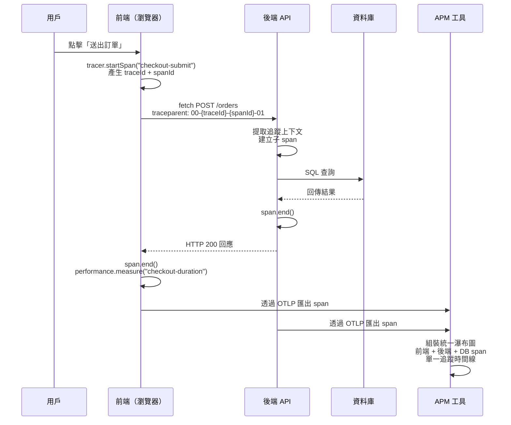

# 效能監控與追蹤

## 背景脈絡

用戶點擊「送出訂單」。某個地方很慢。慢的是處理點擊的 JavaScript？是網路往返？是後端解析請求？是資料庫查詢？是回應渲染？沒有分散式追蹤，答案是「我們不知道——加更多日誌，希望能重現問題。」有了分散式追蹤，答案是一張瀑布圖，從用戶手勢到最終繪製，每個 span 都有精確的時間，橫跨整個系統。

前端效能監控長期以來都是孤立運作的。真實用戶監控（RUM）工具捕獲瀏覽器端指標——首字節時間（TTFB）、最大內容繪製（LCP）、JavaScript 執行時間——但在網路邊界就停了。後端 APM 工具捕獲伺服器端延遲——API 處理時間、資料庫查詢時間、下游服務呼叫——但在請求抵達伺服器時才開始。「用戶點擊」到「請求抵達伺服器」之間的缺口——網路排隊、DNS 解析、TLS 握手、連線建立——對兩種工具都是不可見的。

**分散式追蹤**填補了這個缺口。透過將追蹤上下文從前端傳播到每個對外 HTTP 請求中（透過 `traceparent` 標頭），前端 span 和後端 span 就成為同一條邏輯追蹤的一部分。APM 工具可以顯示一個統一的瀑布圖：用戶點擊 → 前端處理 → 網路 → 後端處理器 → 資料庫查詢 → 回應 → 瀏覽器渲染。每個階段都可見、可測量、可歸因到根本原因。

**OpenTelemetry** 是 CNCF 支持的、供應商中立的分散式追蹤、指標和日誌標準。它提供了統一的 SDK（`@opentelemetry/sdk-web`、`@opentelemetry/auto-instrumentations-web`），可自動對瀏覽器 API（fetch、XHR、文件載入、頁面導航）進行插樁，並透過 OpenTelemetry 協定（OTLP）將追蹤匯出到任何相容的後端——Datadog APM、Honeycomb、Grafana Tempo、Jaeger。採用 OpenTelemetry 意味著插樁一次，輸出到任何地方。

除了分散式追蹤，瀏覽器還提供了兩個被低估的 API，在本地層面補充追蹤。**Long Tasks API**（帶有 `longtask` 入口類型的 `PerformanceObserver`）報告任何阻塞主執行緒超過 50 毫秒的任務。這些任務直接導致糟糕的 Interaction to Next Paint（INP）評分，因為在長任務執行時，瀏覽器無法回應用戶輸入。**用戶計時 API**（`performance.mark()` / `performance.measure()`）允許在應用程式碼中放置任意自訂計時標記——標記結帳流程的開始和結束、文件上傳、任何用戶互動——並以毫秒精度測量。這些標記會在瀏覽器 DevTools 中顯示，並可匯出到 APM 後端。

## 原則

- 應該（SHOULD）在應用程式啟動時初始化 OpenTelemetry `WebTracerProvider`，並為 fetch 和文件載入註冊自動插樁。
- 應該（SHOULD）在所有對外部 API 的 `fetch` 呼叫中傳播 `traceparent` 標頭，以實現分散式追蹤關聯。
- 應該（SHOULD）使用 `performance.mark()` 和 `performance.measure()` 對關鍵用戶互動（表單提交、結帳流程、文件上傳、模態開關）計時。
- 應該（SHOULD）在生產環境中使用 `PerformanceObserver` 監控長任務，並將其報告給 APM 後端或 RUM 工具。
- 不應該（SHOULD NOT）僅依賴自動插樁——手動 span 增加了語意上下文（操作名稱、用戶意圖、業務實體 ID），這是自動化工具無法推斷的。
- 應該（SHOULD）將追蹤匯出到 OTLP 相容的後端（Datadog、Honeycomb、Grafana Tempo、Jaeger），而非使用供應商特定的 SDK，以避免供應商鎖定。
- 應該（SHOULD）為業務上下文附加 span 屬性：`user.id`、`order.id`、`session.id`、`feature.flag`——不記錄個人識別資訊（PII）。

## 設計思維

### 為何 OpenTelemetry 是正確的長期選擇

前端監控領域是碎片化的：Datadog RUM、New Relic Browser、Dynatrace、Honeycomb、Grafana Cloud 等都提供專有的瀏覽器 SDK。採用其中一個，就意味著要針對該供應商的 API 編寫插樁程式碼。切換供應商——或為一部分服務增加第二個供應商——就意味著要重新插樁。

OpenTelemetry 透過提供供應商中立的插樁 API 解決了這個問題。`@opentelemetry/sdk-web` SDK 建立和管理 span。`OTLPTraceExporter` 將這些 span 傳送到任何 OTLP 相容的後端。切換或增加供應商時，只需要改變匯出器端點這一個設定。現有的插樁程式碼——每個 `tracer.startSpan()` 呼叫、每個屬性、每個 `performance.mark()` 整合——保持不變。

OpenTelemetry 由雲原生計算基金會（CNCF）支持，已達到「已畢業（graduated）」的成熟度等級，意味著它在生產環境中穩定，由包括 Google、Microsoft、AWS、Datadog 和 Honeycomb 在內的廣泛貢獻者聯盟維護。每個主要的 APM 供應商要麼已經原生支援 OTLP 攝取，要麼提供了 OTLP 到供應商的管線。這不是一個可能被放棄的小眾開源專案——它是可觀測性插樁的新興行業標準。

實際意涵：今天投資在 OpenTelemetry 插樁上會帶來複利效益。每個 span、每個屬性、每個自訂計時標記都成為一項資產，無需重新插樁就能與未來的任何 APM 後端配合使用。

### 為何跨前後端的分散式追蹤具有變革性

一個延遲投訴出現了：「結帳頁面很慢。」沒有分散式追蹤，調查是碎片化的。前端團隊在 DevTools 中查看網路瀑布圖——API 呼叫花了 1.8 秒。後端團隊查看他們的 APM 儀表板——`POST /orders` 處理器花了 200ms。差異如何解釋？網路？TLS？慢的 CDN？重試？調查需要在兩個沒有共同參考點的系統之間手動交叉對照時間線。

有了分散式追蹤，在用戶點擊的那一刻，前端就生成了一個唯一的追蹤 ID。這個追蹤 ID 透過 `traceparent` 標頭傳播到後端。後端在同一條追蹤下建立子 span。資料庫查詢、下游 API 呼叫和非同步任務都成為後端 span 的子 span。回應返回時，前端結束其 span。

在 APM 工具中，一條時間線顯示：前端 span（fetch 前 20ms 的處理）→ 網路（340ms，包括 TLS）→ 後端處理器（180ms）→ 資料庫查詢（1.2 秒——真正的瓶頸）→ 回應解析（12ms）→ React 重新渲染（45ms）。瓶頸是資料庫查詢。前端團隊和後端團隊看的是同一張瀑布圖。調查用分鐘而非數天完成。

這種跨團隊、跨系統的共享時間線，是分散式追蹤的核心價值。這在孤立的監控工具下是不可能實現的。

### 為何長任務對 INP 至關重要

Interaction to Next Paint（INP）測量從用戶互動（點擊、按鍵、觸碰）到下一次視覺更新的時間。要讓 INP 快速，瀏覽器必須能夠快速回應互動。在主執行緒被正在執行的 JavaScript 任務佔用時，瀏覽器無法處理用戶輸入。

任何耗時超過 50 毫秒的 JavaScript 任務都被歸類為**長任務（Long Task）**。在長任務期間，用戶輸入會被排隊但不會被處理。一個在 200ms 長任務執行期間觸發的點擊，要等到長任務完成才能被回應——導致該互動的 INP 達到 200ms 以上，這已進入「需要改進」或「差」的範圍。

長任務對開發者來說往往是不可見的。它們不拋出錯誤。它們不出現在網路瀑布圖中。它們在 Chrome DevTools 效能面板中以紅色標記的任務出現，但開發者很少對生產工作階段進行剖析。`longtask` PerformanceObserver 入口類型是程式化的等效工具：它在生產環境中、對真實用戶、在真實硬體上觸發，並提供實際的任務時間。在生產環境中監控長任務提供了持續的 INP 降級風險訊號——以及可以與其他追蹤和用戶互動事件關聯的時間資訊（長任務發生的時間、在哪個框架中）。

### 為何 `performance.mark()` 被低估

`performance.mark()` 在瀏覽器的效能時間線中放置一個命名的時間戳記。`performance.measure()` 在兩個標記之間建立一個命名的持續時間。兩者都是原生瀏覽器 API——零依賴、除標記本身外零開銷、在所有現代瀏覽器中均可用。

這些標記在 Chrome DevTools 效能面板的時間線上顯示為帶標籤的注釋。它們出現在 Firefox Profiler 中。它們可以被程式化讀取並包含在追蹤或 RUM 酬載中。它們與 OpenTelemetry 整合：OpenTelemetry web SDK 可以讀取包括用戶計時標記在內的 `PerformanceObserver` 入口，並從它們建立 span。

它們被低估的原因是沒有任何自動化工具能夠添加它們。RUM SDK 可以自動插樁 `fetch` 呼叫和頁面載入，因為這些是具有可觀察事件的標準瀏覽器 API。RUM SDK 無法知道「用戶點擊提交按鈕」和「確認模態出現」之間的這段時間，在語意上具有「結帳提交延遲」的意義。這種語意意義只存在於應用程式碼中。在應用程式碼的正確位置加上 `performance.mark('checkout-submit-start')` 和 `performance.mark('checkout-submit-end')`，是捕獲這段時間的唯一方法——而且它什麼成本都不需要。

對關鍵用戶互動進行 `performance.mark()` 插樁的團隊，獲得了關於最重要用戶旅程的計時資料，這是任何供應商提供的工具都無法複製的。這是目前最高槓桿、最低成本的效能插樁技術。

## 最佳實踐

**必須（MUST）始終在 `finally` 區塊中結束 span——絕不只在正常路徑結束。** 未結束的 span 會被 `BatchSpanProcessor` 無限期保存在記憶體中，且永遠不會匯出至 APM 後端。在長時間運行的應用程式中，洩漏的 span 會累積並造成記憶體壓力。團隊必須（MUST）在每個 `tracer.startSpan()` 呼叫周圍包裹 try/catch/finally，並在 `finally` 區塊中無條件呼叫 `span.end()`。

**禁止（MUST NOT）在瀏覽器套件中暴露 OTLP 收集器憑證或 API 金鑰。** 瀏覽器套件內容是公開可讀的。團隊必須（MUST）透過自己的後端端點（例如 Next.js API 路由或 Express 處理器）代理 OTLP 追蹤匯出，讓收集器驗證金鑰存放在伺服器端環境變數中，永遠不進入客戶端套件。

**必須（MUST）僅將 `traceparent` 標頭傳播限制在自有 API 域名。** 將 W3C 追蹤上下文標頭注入至第三方域名（Stripe、Google Analytics、支付處理商）的請求，會將追蹤 ID 洩漏給外部方，並可能觸發 CORS 預檢請求失敗。團隊必須（MUST）使用明確的自有 API 來源許可清單設定 `propagateTraceHeaderCorsUrls`。

**應該（SHOULD）將 OpenTelemetry `WebTracerProvider` 的初始化作為應用程式進入點的第一個匯入，在任何框架設定之前。** `fetch` 和 XHR 的自動插樁在初始化時註冊；在初始化之前發出的任何網路請求都不會被追蹤。團隊應該（SHOULD）將追蹤匯出至 OTLP 相容的後端（Datadog、Honeycomb、Grafana Tempo），而非使用供應商特定的 SDK，以避免鎖定。

**應該（SHOULD）使用 `performance.mark()` 和 `performance.measure()` 對關鍵用戶互動進行插樁，捕獲自動插樁無法推斷的業務有意義時間。** 自動插樁能捕獲 fetch 呼叫和頁面載入，因為它們有可觀察的瀏覽器事件。它無法知道「用戶點擊提交」到「確認模態出現」之間的時間，在語意上是結帳提交延遲。團隊應該（SHOULD）在每個關鍵用戶旅程的開始和結束放置標記，並在讀取後清理，防止長工作階段中的記憶體增長。

**應該（SHOULD）在生產環境中使用 `PerformanceObserver` 監控長任務，並回報所有超過 50ms 的任務——而非只有超過 200ms 的。** 長任務直接導致 INP 差：任何超過 50ms 的任務都是規範定義的邊界，超過此閾值後用戶輸入會被排隊而非立即處理。團隊應該（SHOULD）將長任務時間和開始時間回報至 APM 後端；過濾掉 200ms 以下的任務會丟棄 51–200ms 範圍內常見的 INP 貢獻者。

## 視覺化

### 分散式追蹤：從用戶點擊到 APM

下圖展示了分散式追蹤從瀏覽器中的用戶互動到 APM 工具中的統一瀑布圖的完整路徑。`traceparent` 標頭是將前後端 span 連結成單一追蹤的線索。



## 範例

### 1. OpenTelemetry SDK 設定

安裝所需套件：

```bash
npm install @opentelemetry/sdk-web \
  @opentelemetry/exporter-trace-otlp-http \
  @opentelemetry/sdk-trace-base \
  @opentelemetry/auto-instrumentations-web \
  @opentelemetry/instrumentation
```

在應用程式啟動時初始化 provider——在任何用戶互動可能發生之前：

```ts
// src/lib/tracing.ts

import { WebTracerProvider } from '@opentelemetry/sdk-web'
import { OTLPTraceExporter } from '@opentelemetry/exporter-trace-otlp-http'
import { BatchSpanProcessor } from '@opentelemetry/sdk-trace-base'
import { getWebAutoInstrumentations } from '@opentelemetry/auto-instrumentations-web'
import { registerInstrumentations } from '@opentelemetry/instrumentation'

const exporter = new OTLPTraceExporter({
  // 在生產環境中，透過你自己的後端代理，
  // 以避免將 OTLP 收集器端點直接暴露給瀏覽器。
  url: '/api/otlp/v1/traces',
})

const provider = new WebTracerProvider()
provider.addSpanProcessor(new BatchSpanProcessor(exporter))
provider.register()

// 自動插樁：fetch、XHR、文件載入、頁面導航
registerInstrumentations({
  instrumentations: [
    getWebAutoInstrumentations({
      '@opentelemetry/instrumentation-fetch': {
        propagateTraceHeaderCorsUrls: [
          /https:\/\/api\.yourcompany\.com/,
        ],
      },
      '@opentelemetry/instrumentation-xml-http-request': {
        propagateTraceHeaderCorsUrls: [
          /https:\/\/api\.yourcompany\.com/,
        ],
      },
    }),
  ],
})

export const tracer = provider.getTracer('frontend-app', '1.0.0')
```

`propagateTraceHeaderCorsUrls` 選項非常重要：SDK 只會在符合所提供模式的 URL 請求中注入 `traceparent` 標頭。這可以防止追蹤上下文洩漏到第三方域名（CDN、分析工具、支付處理商）。

在應用程式入口點呼叫此模組一次：

```ts
// src/main.ts
import './lib/tracing'   // 必須是第一個 import
import { createApp } from 'vue'
import App from './App.vue'

createApp(App).mount('#app')
```

### 2. 手動建立 Span

自動插樁捕獲 fetch 呼叫和頁面載入。對於具有業務意義的操作——結帳流程、文件上傳、搜尋互動——建立手動 span 以捕獲語意上下文：

```ts
// src/features/checkout/checkout.service.ts
import { tracer } from '@/lib/tracing'
import { SpanStatusCode } from '@opentelemetry/api'

export async function submitOrder(cartId: string, userId: string): Promise<OrderResult> {
  const span = tracer.startSpan('checkout.submit', {
    attributes: {
      'cart.id': cartId,
      'user.id': userId,           // 不透明 ID，不是電子郵件
      'checkout.step': 'submit',
    },
  })

  try {
    const result = await fetch('/api/orders', {
      method: 'POST',
      headers: { 'Content-Type': 'application/json' },
      body: JSON.stringify({ cartId }),
      // traceparent 由 fetch 插樁自動注入
    })

    if (!result.ok) {
      span.setStatus({ code: SpanStatusCode.ERROR, message: `HTTP ${result.status}` })
      throw new Error(`Order submission failed: ${result.status}`)
    }

    const order = await result.json() as OrderResult
    span.setAttribute('order.id', order.id)
    span.setStatus({ code: SpanStatusCode.OK })
    return order
  } catch (err) {
    span.recordException(err as Error)
    span.setStatus({ code: SpanStatusCode.ERROR })
    throw err
  } finally {
    span.end()  // 即使在錯誤時也要結束 span
  }
}
```

重點說明：
- `span.end()` 在 `finally` 區塊中——確保即使拋出例外也會被呼叫。
- 業務上下文（`cart.id`、`order.id`）作為 span 屬性添加——不記錄 PII。
- `span.recordException()` 捕獲錯誤堆疊追蹤並將其與 span 關聯。
- 子 `fetch` span（由自動插樁建立）會自動成為這個手動 span 的子 span，因為 OpenTelemetry 會傳播活躍的上下文。

### 3. `traceparent` 標頭與 W3C Trace Context

`traceparent` 標頭格式由 W3C Trace Context 標準規範：

```
traceparent: 00-{traceId}-{parentSpanId}-{traceFlags}
```

其中：
- `00` — 版本（目前規範固定為 `00`）
- `{traceId}` — 32 個十六進位字元（128 位元追蹤 ID），每個用戶請求唯一
- `{parentSpanId}` — 16 個十六進位字元（64 位元 span ID），識別發送端 span
- `{traceFlags}` — 2 個十六進位字元；`01` 表示「已取樣」（告訴後端記錄這條追蹤）

具體範例：

```
traceparent: 00-4bf92f3577b34da6a3ce929d0e0e4736-00f067aa0ba902b7-01
```

`tracestate` 標頭是供應商特定擴充的可選伴侶：

```
tracestate: dd=s:1;o:rum,honeycomb=...
```

當 OpenTelemetry fetch 插樁注入 `traceparent` 時，後端 SDK（OpenTelemetry Node.js、OpenTelemetry Java 等）會自動提取追蹤上下文並建立子 span。`traceId` 在雙方是相同的——這就是讓 APM 工具能夠組裝統一瀑布圖的關鍵。

### 4. `performance.mark()` 和 `performance.measure()`

使用用戶計時 API 測量關鍵用戶互動的時間。這些標記是免費的、原生的，無需任何函式庫即可在 DevTools 中顯示：

```ts
// src/features/checkout/CheckoutForm.vue（Composition API）
import { tracer } from '@/lib/tracing'

async function handleSubmit() {
  performance.mark('checkout-submit-start')

  try {
    await submitOrder(cartId.value, userId.value)
    performance.mark('checkout-submit-end')
    performance.measure('checkout-submit-duration', 'checkout-submit-start', 'checkout-submit-end')
    const entries = performance.getEntriesByName('checkout-submit-duration', 'measure')
    const measure = entries.at(-1)
    if (measure) {
      console.log(`Checkout submit: ${measure.duration.toFixed(1)}ms`)
    }
    performance.clearMarks('checkout-submit-start')
    performance.clearMarks('checkout-submit-end')
    performance.clearMeasures('checkout-submit-duration')
  } catch (err) {
    performance.mark('checkout-submit-error')
    throw err
  }
}
```

可重複使用的輔助函式，同時建立 span 和效能標記：

```ts
// src/lib/perf.ts

export function markAndMeasure(name: string, startMark: string, endMark: string): number {
  performance.measure(name, startMark, endMark)
  const entries = performance.getEntriesByName(name, 'measure')
  const duration = entries.at(-1)?.duration ?? 0
  // 清理以避免在長時間工作階段中記憶體增長
  performance.clearMeasures(name)
  performance.clearMarks(startMark)
  performance.clearMarks(endMark)
  return duration
}
```

### 5. Long Tasks API

在生產環境中使用 `PerformanceObserver` 監控長任務，並將其與追蹤一起報告給 APM 後端：

```ts
// src/lib/long-tasks.ts

export function observeLongTasks(onLongTask: (duration: number, startTime: number) => void): void {
  if (!('PerformanceObserver' in window)) return

  try {
    const observer = new PerformanceObserver((list) => {
      for (const entry of list.getEntries()) {
        if (entry.duration > 50) {
          onLongTask(entry.duration, entry.startTime)
        }
      }
    })

    // buffered: true 可捕獲在觀察者註冊前就已發生的長任務
    observer.observe({ type: 'longtask', buffered: true })
  } catch {
    // 此瀏覽器不支援 longtask 入口類型；靜默跳過
  }
}
```

與 OpenTelemetry 初始化一起連接到應用程式啟動中：

```ts
// src/lib/tracing.ts（續）

import { observeLongTasks } from './long-tasks'

observeLongTasks((duration, startTime) => {
  // 為長任務建立 span，使其出現在追蹤瀑布圖中
  const span = tracer.startSpan('browser.long-task', {
    startTime: performance.timeOrigin + startTime,
    attributes: {
      'long_task.duration_ms': Math.round(duration),
    },
  })
  span.end(performance.timeOrigin + startTime + duration)

  // 同時報告給指標端點以進行聚合
  navigator.sendBeacon(
    '/api/metrics',
    new Blob(
      [JSON.stringify({ event: 'long_task', duration, startTime })],
      { type: 'application/json' }
    )
  )
})
```

超過 100ms 或 200ms 的長任務是 INP 降級的強烈指標，應觸發對當時正在執行的 JavaScript 的調查。

### 6. Resource Timing：偵測慢速 CDN 資源

Resource Timing API 暴露了頁面所有 fetch 資源的載入時間。在生產環境中用它偵測慢速 CDN 資源：

```ts
// src/lib/resource-timing.ts

export function observeSlowResources(thresholdMs = 1000): void {
  if (!('PerformanceObserver' in window)) return

  const observer = new PerformanceObserver((list) => {
    for (const entry of list.getEntries()) {
      const resource = entry as PerformanceResourceTiming
      const duration = resource.responseEnd - resource.startTime

      if (duration > thresholdMs) {
        console.warn('[resource-timing] 慢速資源：', resource.name, duration.toFixed(0) + 'ms')
        // 回報給 APM
        navigator.sendBeacon(
          '/api/metrics',
          new Blob(
            [JSON.stringify({
              event: 'slow_resource',
              url: resource.name,
              duration_ms: Math.round(duration),
              transferSize: resource.transferSize,
              initiatorType: resource.initiatorType,
            })],
            { type: 'application/json' }
          )
        )
      }
    }
  })

  observer.observe({ type: 'resource', buffered: true })
}
```

### 7. Navigation Timing

Navigation Timing API 提供當前頁面載入的詳細指標：

```ts
const [navEntry] = performance.getEntriesByType('navigation') as PerformanceNavigationTiming[]

if (navEntry) {
  const ttfb = navEntry.responseStart - navEntry.requestStart
  const domContentLoaded = navEntry.domContentLoadedEventEnd - navEntry.startTime
  const pageLoad = navEntry.loadEventEnd - navEntry.startTime

  console.log({
    ttfb: `${ttfb.toFixed(1)}ms`,
    domContentLoaded: `${domContentLoaded.toFixed(1)}ms`,
    pageLoad: `${pageLoad.toFixed(1)}ms`,
    navigationType: navEntry.type,  // 'navigate' | 'reload' | 'back_forward' | 'prerender'
  })
}
```

Navigation Timing 由 `@opentelemetry/auto-instrumentations-web` 的 Document Load instrumentation 自動收集。手動存取時，`performance.getEntriesByType('navigation')` 返回當前頁面的單一條目。

### 8. APM 後端整合

#### Datadog APM

Datadog 透過 OTLP 原生攝取 OpenTelemetry 追蹤。設定匯出器指向 Datadog OTLP 端點：

```ts
const exporter = new OTLPTraceExporter({
  url: 'https://otlp.datadoghq.com/v1/traces',  // US 區域 OTLP 端點
  headers: {
    'DD-API-KEY': import.meta.env.VITE_DD_API_KEY,
  },
})
```

在生產環境中，透過你自己的後端（Next.js API 路由或 Express 端點）代理 OTLP，而非將 API 金鑰暴露在瀏覽器套件中。

#### Honeycomb

```ts
const exporter = new OTLPTraceExporter({
  url: 'https://api.honeycomb.io/v1/traces',
  headers: {
    'x-honeycomb-team': import.meta.env.VITE_HONEYCOMB_API_KEY,
    'x-honeycomb-dataset': 'frontend',
  },
})
```

#### Grafana Tempo

Grafana Tempo 直接接受 OTLP。將匯出器指向你的 Tempo OTLP 端點，並使用 Grafana Cloud API 金鑰進行驗證。追蹤可以在 Grafana 的 Explore 視圖中查詢，並且當 Loki 日誌行中包含相同的 `traceId` 時，可以與日誌行關聯。

#### Jaeger

Jaeger 從 1.35 版開始支援 OTLP 攝取。本地開發環境：

```bash
docker run -p 4318:4318 -p 16686:16686 jaegertracing/all-in-one
```

然後在匯出器設定中設定 `url: 'http://localhost:4318/v1/traces'`。位於 `http://localhost:16686` 的 Jaeger UI 會顯示所有接收到的追蹤。

## 常見錯誤

### 使用 `performance.mark()` 但不清理舊的入口

```ts
// 錯誤：標記會在多次呼叫中累積；getEntriesByName 返回所有標記
performance.mark('upload-start')
await uploadFile(file)
performance.mark('upload-end')
performance.measure('upload-duration', 'upload-start', 'upload-end')
const entries = performance.getEntriesByName('upload-duration')
// 第一次呼叫時 entries 可能有 1 個入口，第二次有 2 個，以此類推
const duration = entries[0].duration  // 錯誤——始終返回第一個（最舊的）入口

// 正確：使用 entries.at(-1) 取得最新的，或讀取後清理
const duration = entries.at(-1)?.duration ?? 0
performance.clearMeasures('upload-duration')
performance.clearMarks('upload-start')
performance.clearMarks('upload-end')
```

### 高流量應用程式不取樣追蹤

在生產規模下匯出 100% 的追蹤可能成本高昂。在 `WebTracerProvider` 上設定基於頭部的取樣：

```ts
import { TraceIdRatioBasedSampler } from '@opentelemetry/sdk-trace-base'

const provider = new WebTracerProvider({
  sampler: new TraceIdRatioBasedSampler(0.1),  // 取樣 10% 的追蹤
})
```

無論取樣比率如何，始終對包含錯誤的追蹤進行取樣，這可以透過 `ParentBasedSampler` 或在收集器中使用基於尾部的取樣來實現。

## 相關 FEE

- [FEE-1400：可觀測性與錯誤追蹤總覽](./1400.md) — 類別背景；追蹤是前端可觀測性三大支柱之一，與錯誤追蹤和日誌記錄並列
- [FEE-1402：真實使用者監控與 Core Web Vitals](./1402.md) — INP 直接由主執行緒上的長任務引起；本文提供了在生產環境偵測長任務的插樁方法
- [FEE-1403：日誌記錄與結構化日誌](./1403.md) — 在每條結構化日誌記錄中包含 `traceId`，以在 APM 平台中實現日誌與追蹤的關聯
- [FEE-1406：告警、儀表板與服務等級目標](./1406.md) — 定義基於追蹤衍生指標的告警閾值：p95 結帳延遲、長任務頻率、按 span 名稱統計的錯誤率

## 參考資料

- [OpenTelemetry JavaScript — Web SDK](https://opentelemetry.io/docs/languages/js/getting-started/browser/)
- [W3C Trace Context 規範](https://www.w3.org/TR/trace-context/)
- [Long Tasks API — MDN](https://developer.mozilla.org/en-US/docs/Web/API/PerformanceObserver/observe)
- [User Timing API — MDN](https://developer.mozilla.org/en-US/docs/Web/API/Performance/mark)
- [PerformanceObserver — MDN](https://developer.mozilla.org/en-US/docs/Web/API/PerformanceObserver)
- [Resource Timing API — MDN](https://developer.mozilla.org/en-US/docs/Web/API/PerformanceResourceTiming)
- [Datadog APM — OpenTelemetry 攝取](https://docs.datadoghq.com/tracing/trace_collection/opentelemetry/)
- [Honeycomb — 瀏覽器 OpenTelemetry](https://docs.honeycomb.io/send-data/javascript/browser-js/)
- [Grafana Tempo — OpenTelemetry](https://grafana.com/docs/tempo/latest/getting-started/tempo-in-grafana/)
- [Jaeger — OpenTelemetry 支援](https://www.jaegertracing.io/docs/latest/opentelemetry/)
- [CNCF OpenTelemetry — 專案頁面](https://www.cncf.io/projects/opentelemetry/)
- [Interaction to Next Paint (INP) — web.dev](https://web.dev/inp/)
