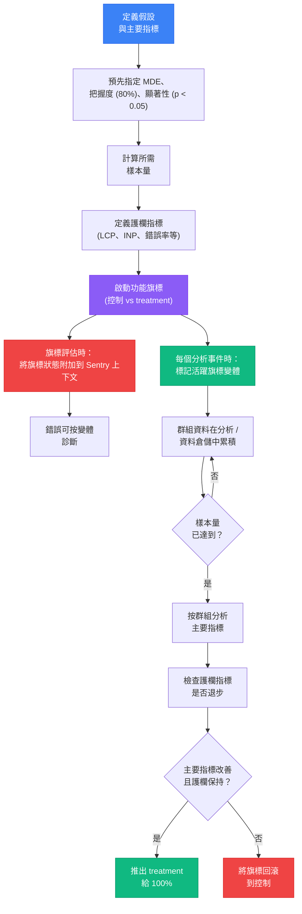

# 功能旗標可觀測性與 A/B 測試

## 背景脈絡

一個生產環境的錯誤出現在 Sentry 上。堆疊追蹤指向新的結帳流程。值班工程師花了兩個小時在本地重現問題——才發現根本無法重現。這個錯誤只影響被分配到功能旗標 `checkout-v2` 的 treatment 變體的使用者。旗標狀態從未附加到錯誤報告中。這次調查花了兩小時，原本只需要兩分鐘。

功能旗標和可觀測性在任何嚴謹的功能交付管線中都是深度交織的。旗標是生產程式碼中的一個分支。每個分支都是潛在的失敗點。當錯誤發生在分支程式碼路徑上時，錯誤報告必須攜帶分支上下文——使用者所在的變體——否則診斷就是不完整的。變體 B 對控制組的 50% 使用者可能完全穩定，但對 treatment 組的 50% 使用者卻系統性地失敗。沒有錯誤事件中的旗標狀態，錯誤的範圍就是不可見的。

同樣的原則延伸到產品分析。功能旗標是執行 A/B 實驗的機制：一個變體看到舊行為，另一個看到新行為。衡量新行為是否改善了它被設計要改善的指標——轉換率、工作階段時長、任務完成時間、Core Web Vitals——需要將旗標分配連接到事件流。每個被追蹤的事件必須標記上是哪個變體產生的，這樣分析才能在相同指標上比較 treatment 群組與控制群組。

**A/B 測試**——或更廣泛地說，實驗——提供了嚴謹進行這種比較的統計框架。直觀的做法（推出實驗、看一週的數字、決定是否有效）是不可靠的。它容易受到 p-hacking 的影響：如果你每天查看結果，一旦某個指標超過門檻就停止實驗，那麼結果是假陽性的概率遠遠高於名義上的 5% 顯著性門檻。嚴謹的實驗在事前指定假設，計算以 80% 把握度（power）檢測出有意義效果所需的最小樣本量，在樣本量達到之前持續執行實驗，然後才評估結果。

**護欄指標（Guardrail metrics）**完成了整個圖景。改善主要指標——比如說，注冊轉換率——但讓護欄指標退步——比如說，最大內容繪製（LCP）——的實驗不是凈收益。推出它會傷害使用者，因為主要指標未能捕捉到的維度的體驗在退步。每個實驗都需要一組預先定義的護欄指標，無論主要指標顯示什麼，這些指標都不得退步超過容許門檻。

這項工作的工具生態已經相當成熟。**PostHog** 在單一開源 SDK 中提供功能旗標、產品分析和工作階段重播——使其成為還沒有這些系統的團隊的最低摩擦起點。**GrowthBook** 是開源的，設計用於連接現有的資料倉儲（BigQuery、Snowflake、Redshift），使其成為分析資料已在倉儲中的團隊的正確選擇。**LaunchDarkly Experimentation** 和 **Statsig** 是商業平台，提供企業級旗標管理、實驗基礎設施和開箱即用的統計分析。

## 原則

- 應該（SHOULD）將活躍的功能旗標狀態作為 Sentry 上下文或標籤附加到錯誤報告中，使變體程式碼路徑上的錯誤無需手動重現即可診斷。
- 應該（SHOULD）在捕獲事件時，以當時活躍的旗標變體標記每個分析事件，使 A/B 實驗分析能夠正確分割群組。
- 應該（SHOULD）在啟動之前（而非觀察結果之後）為每個 A/B 實驗定義護欄指標（包括 Core Web Vitals，特別是 LCP 和 INP）。
- 不應該（SHOULD NOT）在達到預先指定的樣本量之前偷看 A/B 測試結果——在開始實驗之前確定所需樣本量。
- 應該（SHOULD）在計算樣本量之前預先指定最小可檢測效果（MDE）和目標統計把握度（80% 是標準值）。
- 應該（SHOULD）對於還沒有獨立旗標管理、產品分析和工作階段重播系統的團隊，使用 PostHog 作為默認起點。

## 設計思維

### 為何錯誤上下文中的旗標狀態不是可選的

考慮背景脈絡部分中生產場景的簡化版本。結帳流程在一個旗標後面。變體 A（控制）使用現有的 Stripe 整合。變體 B（treatment）使用新的支付處理商。新支付處理商的 SDK 中發生了一個錯誤——在一個新處理商以不同於 Stripe 的格式回傳的欄位上出現了空引用。

在 Sentry 中，錯誤顯示為 `checkout.service.ts` 中的 `TypeError: Cannot read properties of null`。堆疊追蹤指向特定的一行。錯誤被標記為高嚴重性。值班工程師開啟事件。沒有旗標上下文，事件看起來像是一般的結帳錯誤——可能影響任何使用者的事情。工程師在本地使用自己的帳號重現結帳流程，而他們在控制變體中。沒有錯誤。工程師標記為「無法重現」並關閉工單。錯誤繼續影響所有 treatment 使用者。

將旗標上下文附加到 Sentry 事件——`flag.checkout-v2: treatment` 作為標籤，或者列出所有活躍旗標的 `feature_flags` 上下文物件——工程師立即看到這個錯誤只對 `checkout-v2` 的 `treatment` 變體中的使用者發生。調查範圍縮小到新的支付處理商 SDK。修復在一小時內部署完成。

這就是為什麼 `Sentry.setContext('feature_flags', { flagName: variant })` 或 `Sentry.setTag('flag.checkout-v2', 'treatment')` 必須在旗標評估時呼叫，而不是事後可選地添加。效能成本可以忽略不計。診斷價值是不成比例的高。

### 為何 p-hacking 破壞實驗有效性

假設一個團隊對新的引導流程啟動了一個實驗。三天後，treatment 變體的轉換率為 12.3%，而控制組為 11.1%——相對提升了 10.8%。團隊停止實驗並推出 treatment。六個月後，該產品領域的 A/B 測試結果持續顯示比初始實驗建議的效果小得多。團隊感到困惑。

發生的事情是 p-hacking。團隊每天查看結果。在第三天，結果跨越了 p < 0.05 的門檻，他們就停止了。但每天查看的情況下，在多週實驗期間結果至少一次跨越門檻的概率——即使沒有真實效果——遠高於 5%。第三天的「顯著」結果是早期資料中方差造成的假陽性，而不是真實的訊號。

正確的做法是循序漸進的：在啟動之前定義假設和主要指標，計算以 p < 0.05 的 80% 把握度檢測 MDE 所需的樣本量，在樣本量達到之前持續執行實驗，並在那一刻只評估一次結果。不提前停止。不偷看。樣本量的預先指定是控制假陽性率的機制。

GrowthBook 和 Statsig 等工具實現了循序檢定和始終有效的 p 值，允許更頻繁的查看而不膨脹假陽性率——但這些方法需要配置和理解。對於剛開始的團隊，默認做法更簡單：選擇樣本量，等待達到，然後看一次。

### 為何 PostHog 是默認推薦

從頭開始的團隊面臨一個選擇：分別組建旗標管理（LaunchDarkly）、產品分析（Mixpanel 或 Amplitude）和工作階段重播（FullStory 或 LogRocket）的堆疊——每個都有自己的 SDK、自己的事件架構、自己的計費和自己的資料模型——或者使用 PostHog，它在單一開源 SDK 中提供所有三者，共享單一事件流。

單一 SDK 模型對旗標可觀測性有具體優勢：PostHog 自動記錄捕獲每個事件時哪些旗標是活躍的。不需要額外的插樁步驟來用旗標變體標記事件。`posthog.capture('checkout-completed', { properties })` 已經知道當前使用者哪些旗標是活躍的，因為 PostHog SDK 在內部管理旗標狀態。實驗群組分析是內建的。

PostHog 也支援自行託管（AGPL 授權），適合有資料合規要求的團隊，並在託管雲產品上提供慷慨的免費層。對於超過 PostHog 統計分析能力或需要對已在資料倉儲中的資料運行實驗的團隊，GrowthBook 提供了一個開源遷移路徑，無需重新插樁事件流。

### 為何護欄指標至關重要

一個實驗將注冊轉換率從 8% 提升到 9.5%——在統計上顯著的 18.75% 相對提升。產品團隊欣喜若狂。實驗推出了。兩週後，效能監控儀表板顯示注冊頁面的 LCP 從 1.8 秒退步到 3.1 秒。Core Web Vitals 分數從「良好」降至「需要改進」。因為 Google 的 Core Web Vitals 訊號惡化，自然搜索流量下降。這個「獲勝」實驗的凈業務影響是負面的。

這是護欄指標失敗模式。新的注冊流程——也許是更豐富的英雄區塊或更重的動畫——改善了實驗設計要測量的轉換指標，同時悄悄地讓效能退步。因為 LCP 沒有被預先指定為護欄，實驗期間沒有人查看它。等到注意到退步時，功能已經推出給 100% 的使用者。

護欄指標將「實驗只有在改善主要指標的同時不顯著傷害任何護欄時才算獲勝」這一原則操作化。護欄在啟動前預先指定——LCP、INP、累計版面位移（CLS）、JavaScript 錯誤率、API 錯誤率——帶有明確的容許門檻（例如，「treatment 群組的 LCP 不得增加超過 100ms」）。如果任何護欄被突破，無論主要指標結果如何，實驗都被阻止推出。

## 視覺化

### 實驗生命週期

下圖展示了功能旗標實驗的完整生命週期，從假設定義到推出或回滾的決策。旗標狀態同時輸入錯誤追蹤管線（Sentry 上下文）和分析管線（事件屬性），實現了錯誤診斷和統計分析兩者。



## 範例

### 1. PostHog 設定與旗標評估

安裝 PostHog SDK：

```bash
npm install posthog-js
```

在應用程式啟動時初始化 PostHog，在任何旗標被評估或事件被捕獲之前：

```ts
// src/lib/posthog.ts
import posthog from 'posthog-js'

posthog.init('<your-project-api-key>', {
  api_host: 'https://us.i.posthog.com',
  // 自動捕獲頁面瀏覽、點擊和表單提交
  autocapture: true,
  // 跨頁面載入持久化旗標分配（使用 localStorage）
  persistence: 'localStorage+cookie',
})

export { posthog }
```

評估旗標並使用其變體：

```ts
// src/features/checkout/checkout.service.ts
import { posthog } from '@/lib/posthog'

export function getCheckoutVariant(): string | boolean {
  // 回傳變體字串 ('control' | 'treatment') 或簡單旗標的布林值
  return posthog.getFeatureFlag('checkout-v2') ?? 'control'
}

export function isNewCheckoutEnabled(): boolean {
  return posthog.isFeatureEnabled('checkout-v2') === true
}
```

捕獲標記了活躍旗標狀態的分析事件：

```ts
// PostHog 自動在每個捕獲的事件中包含所有活躍旗標。
// 若需要明確控制，將旗標值作為屬性傳遞：

posthog.capture('checkout-completed', {
  cartTotal: cart.total,
  itemCount: cart.items.length,
  checkoutVariant: posthog.getFeatureFlag('checkout-v2'),
  paymentMethod: cart.paymentMethod,
})
```

### 2. 將旗標狀態附加到 Sentry 錯誤上下文

在旗標評估時呼叫此函式，在渲染或執行任何特定於變體的程式碼之前。這確保了旗標狀態在 Sentry 作用域中，以便後續任何錯誤都能使用：

```ts
// src/lib/flagObservability.ts
import * as Sentry from '@sentry/browser'
import { posthog } from './posthog'

/**
 * 將所有活躍的 PostHog 功能旗標附加到當前 Sentry 作用域。
 * 在使用者被識別且旗標載入後呼叫一次。
 */
export function attachFlagsToSentry(): void {
  // posthog.getActiveFeatureFlags() 回傳旗標鍵的陣列
  const activeFlags = posthog.getActiveFeatureFlags() ?? []

  const flagContext: Record<string, string | boolean> = {}
  for (const flagKey of activeFlags) {
    const variant = posthog.getFeatureFlag(flagKey)
    if (variant !== undefined) {
      flagContext[flagKey] = variant
    }
  }

  // 設為 Sentry 上下文——在每個事件的「額外資料」區塊可見
  Sentry.setContext('feature_flags', flagContext)

  // 同時設定個別標籤以便在 Sentry 問題搜索中快速過濾
  // 例如，搜索：flag.checkout-v2:treatment
  for (const [key, value] of Object.entries(flagContext)) {
    Sentry.setTag(`flag.${key}`, String(value))
  }
}
```

在使用者被識別後，將此函式整合到應用程式啟動流程中：

```ts
// src/auth/authService.ts
import * as Sentry from '@sentry/browser'
import { posthog } from '@/lib/posthog'
import { attachFlagsToSentry } from '@/lib/flagObservability'

export async function onLoginSuccess(user: User): Promise<void> {
  // 1. 在 Sentry 和 PostHog 中識別使用者
  Sentry.setUser({ id: user.id, email: user.email })
  posthog.identify(user.id, { email: user.email, plan: user.plan })

  // 2. 等待 PostHog 為此使用者載入旗標決策
  await new Promise<void>((resolve) => posthog.onFeatureFlags(() => resolve()))

  // 3. 將旗標附加到 Sentry 作用域
  attachFlagsToSentry()
}
```

對於在執行時評估的特定旗標（例如，使用者首次到達結帳頁面時），在那一刻更新 Sentry 上下文：

```ts
// src/features/checkout/CheckoutPage.vue
import { onMounted } from 'vue'
import { posthog } from '@/lib/posthog'
import * as Sentry from '@sentry/browser'

onMounted(() => {
  const checkoutVariant = posthog.getFeatureFlag('checkout-v2') ?? 'control'

  // 在評估時更新 Sentry 標籤
  Sentry.setTag('flag.checkout-v2', String(checkoutVariant))

  // 渲染相應的變體
  if (checkoutVariant === 'treatment') {
    renderNewCheckout()
  } else {
    renderLegacyCheckout()
  }
})
```

### 3. GrowthBook 整合

GrowthBook 是分析資料已在 BigQuery、Snowflake、Redshift 或其他資料倉儲中的團隊的正確選擇。GrowthBook 直接從倉儲讀取實驗結果，使用 SQL 定義的指標，而不要求所有事件流經專有分析平台。

```bash
npm install @growthbook/growthbook
```

```ts
// src/lib/growthbook.ts
import { GrowthBook } from '@growthbook/growthbook'
import * as Sentry from '@sentry/browser'

export const gb = new GrowthBook({
  apiHost: 'https://cdn.growthbook.io',
  clientKey: import.meta.env.VITE_GROWTHBOOK_CLIENT_KEY,
  // 確定旗標分配時呼叫——用於附加到 Sentry
  onFeatureUsage(featureKey, result) {
    Sentry.setTag(`flag.${featureKey}`, String(result.value))
  },
  // 在非生產環境中為 QA 覆蓋啟用開發模式
  enableDevMode: import.meta.env.DEV,
})

// 從 GrowthBook CDN 載入功能
await gb.init({ timeout: 2000 })

// 設定用於定向和實驗分配的使用者屬性
gb.setAttributes({
  id: user.id,
  country: user.country,
  plan: user.plan,
  deviceType: navigator.userAgent.includes('Mobile') ? 'mobile' : 'desktop',
})
```

使用 GrowthBook 評估旗標：

```ts
// 布林旗標
const isNewDashboardEnabled = gb.isOn('new-dashboard')

// 多變量旗標（回傳功能值，或者如果未分配則回傳默認值）
const checkoutVariant = gb.getFeatureValue('checkout-variant', 'control')
// checkoutVariant: 'control' | 'treatment-a' | 'treatment-b'
```

### 4. 啟動前的樣本量計算

在啟動實驗之前，使用以下輸入計算所需樣本量：

- **基線轉換率**：主要指標的當前率（例如，8% 的結帳完成率）
- **MDE（最小可檢測效果）**：值得檢測的最小改善（例如，1 個百分點的絕對值，即從 8% 到 9%）
- **統計把握度**：80%（標準值）——如果真實效果存在，檢測到它的概率
- **顯著性門檻**：p < 0.05（5% 的假陽性率）

雙比例 z 檢定的標準每變體樣本量公式：

```ts
// src/lib/sampleSize.ts

/**
 * 計算雙比例 z 檢定每個變體所需的樣本量。
 *
 * @param baselineRate   - 當前轉換率（例如，0.08 表示 8%）
 * @param mde            - 最小可檢測效果，絕對變化（例如，0.01 表示 1pp）
 * @param power          - 期望的統計把握度（默認：0.80）
 * @param alpha          - 顯著性水準（默認：0.05，雙尾）
 * @returns              - 每個變體所需的樣本量（整數）
 */
export function calculateSampleSize(
  baselineRate: number,
  mde: number,
  power = 0.80,
  alpha = 0.05
): number {
  const treatmentRate = baselineRate + mde
  const pooledRate = (baselineRate + treatmentRate) / 2

  // alpha/2 的 z 分數（雙尾）和把握度的 z 分數
  // alpha=0.05 時的 z_alpha_2：1.96
  // power=0.80 時的 z_power：0.842
  const zAlpha2 = 1.96   // 用於 alpha = 0.05，雙尾
  const zPower = 0.842   // 用於 power = 0.80

  const numerator =
    Math.pow(zAlpha2 * Math.sqrt(2 * pooledRate * (1 - pooledRate)) +
      zPower * Math.sqrt(baselineRate * (1 - baselineRate) + treatmentRate * (1 - treatmentRate)), 2)

  const denominator = Math.pow(mde, 2)

  return Math.ceil(numerator / denominator)
}

// 使用範例：
// calculateSampleSize(0.08, 0.01) => ~3,474 個使用者每個變體（共 6,948 個）
// 運行實驗，直到每個變體至少有 3,474 個使用者，然後評估一次。
```

在啟動前在共享實驗簡報中記錄預先指定的參數。此簡報是防止提前停止的合約協議。

### 5. 使用 PostHog 和 Core Web Vitals 監控護欄指標

將 Core Web Vitals 作為 PostHog 事件捕獲，以便在實驗分析中按旗標變體分割：

```ts
// src/lib/webVitals.ts
import { onLCP, onINP, onCLS, onFCP, onTTFB } from 'web-vitals'
import { posthog } from './posthog'

function reportVital(name: string, value: number, rating: string): void {
  posthog.capture('web_vital', {
    metric: name,
    value: Math.round(name === 'CLS' ? value * 1000 : value),
    rating,
    // PostHog 自動將活躍的旗標變體附加到此事件
    // 因此實驗分析可以比較每個變體的 LCP
    url: window.location.pathname,
  })
}

onLCP(({ name, value, rating }) => reportVital(name, value, rating))
onINP(({ name, value, rating }) => reportVital(name, value, rating))
onCLS(({ name, value, rating }) => reportVital(name, value, rating))
onFCP(({ name, value, rating }) => reportVital(name, value, rating))
onTTFB(({ name, value, rating }) => reportVital(name, value, rating))
```

安裝 `web-vitals` 套件：

```bash
npm install web-vitals
```

實驗運行並達到樣本量後，在 PostHog（或你的資料倉儲）中查詢按 `checkout-v2` 旗標變體分割的 `web_vital` 事件：

```sql
-- 範例：比較控制組和 treatment 組的中位 LCP
SELECT
  properties ->> 'flag.checkout-v2' AS variant,
  percentile_cont(0.50) WITHIN GROUP (ORDER BY (properties ->> 'value')::int) AS p50_lcp,
  percentile_cont(0.75) WITHIN GROUP (ORDER BY (properties ->> 'value')::int) AS p75_lcp,
  COUNT(*) AS sample_count
FROM events
WHERE
  event = 'web_vital'
  AND properties ->> 'metric' = 'LCP'
  AND timestamp BETWEEN '2026-03-01' AND '2026-03-21'
GROUP BY variant
```

如果 treatment 變體顯示 p75 LCP 比控制組高超過 100ms，則護欄被突破——即使主要轉換指標有所改善。

### 6. 使用 Statsig 進行企業級實驗

Statsig 提供了內建循序檢定和貝氏分析的託管實驗平台。將 Statsig 與其他可觀測性工具一起初始化：

```ts
import StatsigClient from 'statsig-js'

await StatsigClient.initialize('<client-sdk-key>', {
  userID: user.id,
  email: user.email,
  custom: { plan: user.plan },
})

// 評估實驗
const experiment = StatsigClient.getExperiment('checkout_experiment')
const checkoutVariant = experiment.get('variant', 'control')

// 記錄事件（Statsig 記錄此使用者所在的實驗組）
StatsigClient.logEvent('checkout_completed', cart.total, {
  paymentMethod: cart.paymentMethod,
})

// 附加到 Sentry
Sentry.setTag('flag.checkout-experiment', checkoutVariant)
```

Statsig 的控制台顯示帶有信賴區間、循序檢定 p 值的實驗結果，如果在 Statsig 儀表板中配置，還可以自動護欄指標追蹤。

## 常見錯誤

### 在渲染變體程式碼之前未附加旗標狀態

```ts
// 錯誤：旗標狀態在變體渲染後才附加——如果在
// renderTreatmentCheckout() 期間發生錯誤，Sentry 事件將沒有旗標上下文
const variant = posthog.getFeatureFlag('checkout-v2')
renderTreatmentCheckout()
Sentry.setTag('flag.checkout-v2', String(variant))  // 太晚了

// 正確：在執行任何特定於變體的程式碼之前附加旗標狀態
const variant = posthog.getFeatureFlag('checkout-v2')
Sentry.setTag('flag.checkout-v2', String(variant))  // 先設定
if (variant === 'treatment') {
  renderTreatmentCheckout()
} else {
  renderControlCheckout()
}
```

### 偷看結果並提前停止

```ts
// 錯誤：在 N 天後查看結果並在 p < 0.05 時停止
// 這是 p-hacking——假陽性率遠高於 5%

// 正確：預先指定樣本量並且只評估一次
const REQUIRED_SAMPLE_SIZE_PER_VARIANT = 3_474  // 啟動前計算好
// 在兩個變體都達到 >= 3,474 個使用者之前不查看結果
```

預先指定的樣本量必須在旗標啟動前記錄在實驗簡報中。提前停止——即使結果看起來「明顯顯著」——也會使統計保證失效。

### 對多個連續實驗使用相同的旗標鍵

```ts
// 錯誤：重用旗標鍵意味著參與實驗 1 的使用者
// （當 'new-header' 意味著某件事時）與實驗 2 的使用者混在一起
// （當 'new-header' 意味著另一件事時）
const variant = posthog.getFeatureFlag('new-header')

// 正確：每個實驗使用版本化或描述性的旗標鍵
const variant = posthog.getFeatureFlag('header-redesign-2026-q1')
```

旗標鍵重用會污染實驗群組。在第一個實驗中被分配到 `control` 的使用者可能在第二個實驗中被分配到 `treatment`，但他們的歷史事件仍然附加了舊的分配。分析必須過濾到實驗日期範圍內的事件，或者完全使用新的鍵。

### 不為回訪使用者持久化旗標分配

使用者必須在每次訪問時都看到相同的變體。如果旗標分配在每次頁面載入時重新隨機化，使用者可能星期一看到控制，星期二看到 treatment。這會導致：

- 不一致的使用者體驗（在變體之間閃爍）
- 被污染的分析資料（單一使用者貢獻到兩個群組）

PostHog 透過 `localStorage+cookie` 自動處理持久化。GrowthBook 要求在每個工作階段設定相同的使用者屬性——包括穩定的 `id`。對於匿名使用者，在首次訪問時分配一個 UUID 並將其持久化在 `localStorage` 中。

### 推出突破護欄的實驗

```ts
// 實驗達到樣本量後：
// 主要指標：轉換率從 8.0% 改善到 9.4%（p = 0.023）✓
// 護欄：treatment 群組的 LCP 從 1800ms 增加到 3200ms ✗

// 錯誤：因為主要指標是正面的就推出
await flagClient.setFlagToTreatmentForAll('checkout-v2')

// 正確：因為護欄被突破就回滾
await flagClient.setFlagToControlForAll('checkout-v2')
// 在重新運行實驗之前調查 LCP 退步問題
```

護欄突破不是警告——它們是阻止推出的條件。儘管護欄被突破仍然推出實驗，為護欄是可選的設立了先例，這使它們變得毫無意義。

## 相關 FEE

- [FEE-1400：可觀測性與錯誤追蹤概覽](./1400.md) — 類別脈絡；功能旗標可觀測性是橫跨三大支柱的橫切關注點
- [FEE-1401：使用 Sentry 進行錯誤追蹤](./1401.md) — 用於將旗標狀態附加到錯誤事件的 Sentry 上下文和標籤 API
- [FEE-1402：真實使用者監控與 Core Web Vitals](./1402.md) — LCP 和 INP 作為每個 A/B 實驗的護欄指標
- [FEE-1407：工作階段重播與正式環境除錯](./1407.md) — 旗標狀態在重播情境中可見；針對特定使用者啟用詳細遠端除錯日誌由功能旗標控制
- [FEE-1505：部署中的功能旗標](../CI%20CD%20and%20Deployment/1505.md) — 功能旗標所實現的漸進式推出、金絲雀發布和部署生命週期

## 參考資料

- [PostHog JavaScript SDK](https://posthog.com/docs/libraries/js)
- [PostHog 功能旗標文件](https://posthog.com/docs/feature-flags)
- [GrowthBook JavaScript SDK](https://docs.growthbook.io/lib/js)
- [GrowthBook — 連接到資料倉儲](https://docs.growthbook.io/warehouses)
- [LaunchDarkly Experimentation](https://launchdarkly.com/features/experimentation/)
- [Statsig — JavaScript SDK](https://docs.statsig.com/client/javascript-sdk)
- [Sentry setContext 文件](https://docs.sentry.io/platforms/javascript/enriching-events/context/)
- [Sentry setTag 文件](https://docs.sentry.io/platforms/javascript/enriching-events/tags/)
- [web-vitals npm 套件](https://www.npmjs.com/package/web-vitals)
- [Google — A/B 測試中的統計顯著性](https://support.google.com/analytics/answer/2695010)
- [Evan Miller — 樣本量計算器](https://www.evanmiller.org/ab-testing/sample-size.html)
- [Netflix Tech Blog — 實驗平台](https://netflixtechblog.com/it-is-all-a-bout-testing-the-netflix-experimentation-platform-4e1ca458c15b)
- [Microsoft — A/B 測試中偷看的危險](https://www.microsoft.com/en-us/research/group/experimentation-platform-exp/)
