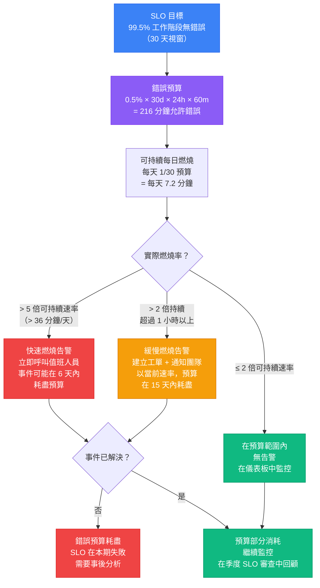

# 告警、儀表板與服務等級目標

## 背景脈絡

一個沒有人採取行動的可觀測系統，不過是多了幾個步驟的日誌記錄系統。指標持續流入，儀表板的面板不斷累積，Sentry 每天捕獲數千個錯誤——然而工程師卻停止查看，因為資訊量太過龐大，或者因為每次響應告警都是虛驚一場。可觀測系統最具破壞性的失敗模式不是資料缺失，而是**告警疲勞**：對告警系統的信任逐漸侵蝕，直到工程師學會忽略它。那個真正重要的告警，也被一起忽略了。

要將可觀測資料轉化為工程師信任並採取行動的系統，需要三個環環相扣的要素。第一，**設計良好的告警**——在真正指示使用者受損的條件下觸發，而非在隨流量自然波動的條件下觸發。第二，**SLO（服務等級目標）**——以可量測的使用者結果（錯誤預算與燃燒率）來框架討論，而非模糊的可用率目標。第三，**儀表板**——圍繞「值班工程師現在需要知道什麼？」的問題設計，而非「我們有哪些資料可以展示？」

**錯誤率**與**原始錯誤計數**的區別是根本性的。一個每小時處理 10,000 個請求、產生 100 個錯誤的應用程式，錯誤率為 1%。同一個應用程式在流量高峰期每小時處理 100,000 個請求、產生 1,000 個錯誤，錯誤率仍然只有 1%——完全相同。若以原始計數設定告警，後者會觸發，儘管應用程式表現完全一樣。反過來，若流量降到每小時 1,000 個請求而錯誤仍維持 100 個，錯誤率就是 10%——這是嚴重的退步——但原始計數並未增加。以**率**告警能對流量量進行正規化；以**計數**告警則不行。

**前端 SLO** 以工程師可以操作的方式定義使用者體驗的可量測品質標準。一組典型的前端 SLO：99.5% 的頁面載入無錯誤（錯誤預算為 0.5% 的工作階段）、p75 LCP 低於 2.5 秒、p75 INP 低於 200 毫秒。這些目標不是理想性的——它們直接對應使用者體驗到的「應用程式正常運作」。當 SLO 以錯誤預算和燃燒率追蹤時，告警問題就轉化了：不再是「這個指標是否超過閾值？」，而是「我們消耗錯誤預算的速度是否比可持續速率快？」

**錯誤預算燃燒率**是相對於可持續速率，錯誤預算被消耗的速率。在 30 天內，99.5% 可用性 SLO 允許 0.5% × 30 × 24 × 60 = 216 分鐘的允許停機或錯誤級別降級。在 6 天內燃燒完整 216 分鐘就是 5 倍的燃燒率（每天 1/30 的可持續速率）。大於 5 倍的**快速燃燒告警**能捕捉到即將耗盡錯誤預算的事件。持續大於 2 倍的**緩慢燃燒告警**則能捕捉到慢性降級——在不觸發快速燃燒的情況下，在月末之前耗盡預算。

**Runbook（應急手冊）** 在告警與響應之間形成閉環。凌晨 3 點觸發的告警只有在值班工程師知道該做什麼時才有用。沒有 runbook，工程師每次都要在壓力下從頭重建響應程序。從告警直接連結的 runbook——作為告警標注中的 URL——規定了：告警代表什麼、首先要檢查哪些指標、要採取什麼行動（回滾、擴容、通知），以及若初始行動未能解決問題時的上報路徑。

## 設計思維

### 為何錯誤率優於原始錯誤計數作為告警依據

考慮同一應用程式的兩個情境。在典型的週二，應用程式每小時服務 5,000 個工作階段，產生 25 個 JavaScript 錯誤——錯誤率 0.5%。在行銷活動的週六，應用程式每小時服務 50,000 個工作階段，產生 250 個 JavaScript 錯誤——仍然是 0.5% 的錯誤率。如果告警配置為原始計數閾值每小時 50 個錯誤，週六活動會在凌晨 2 點觸發呼叫。工程師調查，發現錯誤率 0.5% 與正常運作完全相同，然後回去睡覺。他們也不再相信這個告警。

現在假設週三早上一次部署引入了一個 bug。工作階段維持每小時 5,000 個，但錯誤上升到 500 個——錯誤率 10%。以閾值 50 為基礎的原始計數告警立即觸發。但每次高流量事件也會觸發。值班工程師被幾個月的假陽性磨損，延誤了調查。這是告警疲勞造成真正的危害。

使用基於率的告警，閾值為 2% 錯誤率，週六活動不產生告警（0.5% 錯誤率，遠低於閾值）。週三的部署在 10% 錯誤率時立即觸發告警。「告警觸發」與「確實有問題」之間的相關性大幅提高。工程師回應更快，因為他們學到告警是可信賴的。

### 為何 SLO 優於可用率目標

「五個九」（99.999% 可用率）是一個流行的目標，但卻是一個糟糕的操作工具。它對使用者體驗什麼也沒說。一個可用率完美但對 30% 使用者呈現空白畫面的應用程式（由於不觸發健康檢查失敗的 JavaScript 錯誤），達到了可用率目標，但同時製造了糟糕的使用者體驗。

SLO 以結果為導向。「99.5% 的頁面載入無 JavaScript 錯誤」量測的是使用者實際體驗到的東西。「p75 LCP 低於 2.5 秒」量測的是頁面對大多數使用者是否感覺快速。「p75 INP 低於 200 毫秒」量測的是互動是否感覺響應及時。這些目標與 Google 用來定義「良好」效能的 Core Web Vitals 閾值一致——它們根據真實使用者感知進行了校準，而不是伺服器健康狀況。

錯誤預算使 SLO 在操作上有用。在 30 天內 99.5% 無錯誤的 SLO 意味著 0.5% 的工作階段可能有錯誤——即允許 216 分鐘的等效停機時間。有了錯誤預算，團隊可以回答：「這個月我們用了多少預算？我們的燃燒速度是否比可持續速率快？我們能否部署這個有風險的功能，還是說我們已經燒掉足夠多的預算，需要等到下個月？」這些是與決策相關的問題。「我們的可用率是否超過 99.999%？」不是。

### 為何告警疲勞是最大的可觀測性失敗模式

告警疲勞遵循可預測的軌跡。團隊第一次設置可觀測系統，針對所有看起來重要的事情創建告警：錯誤計數 > 100、p95 延遲 > 2 秒、CPU 使用率 > 80%、記憶體 > 70%、請求率峰值 > 2 倍、JavaScript 錯誤計數 > 50。第一週，他們響應每個告警。第三週，大多數告警因為無害原因定期觸發（流量峰值、定期任務、常規變異）。工程師開始暫停告警。第二個月，值班輪換中有隱性知識：哪些告警可以忽略。三個月後，真實事件觸發了那些一直被忽略的告警，花了兩個小時才注意到。

解決方案不是更好的工具——而是無情地精簡。每個告警應該對兩個問題都回答「是」：(1) 這個條件是否可靠地指示使用者受損？(2) 這個條件是否需要人類立即行動？如果任一問題的答案是「有時候」或「視情況而定」，告警應該被調整或移除。季度審查流程強制提出問題：「過去 90 天，這個告警觸發了多少次，有多少次需要行動？」頻繁觸發但很少需要行動的告警是假陽性，應該被刪除或轉換為供參考監控的儀表板面板。

### 為何 Runbook 是必不可少的

Runbook 的價值與使用時的時間壓力成正比。在上班時間觸發的告警，針對非緊急情況，在熟悉的系統上，不需要文件也可以應對——工程師可以按自己的節奏調查。但凌晨 3 點觸發的告警，針對不熟悉的元件，由兩個月前加入的新團隊成員處理——完全是另一種情況。

沒有 runbook，響應是：打開儀表板，試著理解告警的含義，搜尋 Slack 歷史記錄查找之前的事件，聯繫寫這個系統的人，等待回應。有了 runbook，響應是：點擊告警中的 runbook 連結，按照診斷步驟操作，採取文件化的行動，確認解決。

Runbook 也封裝了機構知識。第一次解決事件時，解決步驟在某人的腦海中。Runbook 在下次事件之前捕獲這些步驟。維護 runbook 的團隊會發現，隨著每次 runbook 的迭代，事件解決時間縮短，因為每次解決都為文件化程序增添了新內容。

每個 Grafana 告警面板、每個 Sentry 告警規則、每個 Datadog 監控器都應該包含指向該特定告警條件 runbook 的 `runbook_url` 標注。

## 最佳實踐

**必須（MUST）以錯誤率（%）告警，而非原始錯誤計數。** 原始計數閾值在每次流量峰值時觸發，無論應用程式是否真的有問題；相同的 0.5% 錯誤率在每小時 5K 工作階段時產生 25 個錯誤，在 50K 工作階段時產生 250 個錯誤。團隊必須（MUST）在 Grafana 中使用 PromQL 比率、Sentry 的錯誤率告警類型或 Datadog 的錯誤率監控作為主要告警條件——而非原始事件計數閾值。

**必須（MUST）在生產環境啟用之前，將每條告警規則連結到告警標注中的 runbook URL。** 沒有 runbook 的告警，是在最糟糕的時機——凌晨 3 點、面對不熟悉的元件——將文件責任委派給值班工程師。團隊必須（MUST）在每個 Grafana 告警面板、每條 Sentry 告警規則和每個 Datadog 監控器上包含 `runbook_url` 標注；列出三個最可能原因的草稿 runbook，遠比什麼都沒有要好得多。

**應該（SHOULD）定義涵蓋錯誤率、p75 LCP 和 p75 INP 的前端 SLO，並追蹤錯誤預算燃燒率，而非時間點閾值違規。** 30 天內 99.5% 無錯誤工作階段的 SLO 產生 216 分鐘的錯誤預算；基於此預算的燃燒率告警（快速燃燒 >5 倍、慢速燃燒持續 >2 倍）能同時捕捉急性事件和慢性降級。團隊應該（SHOULD）以使用者結果——頁面載入無 JavaScript 錯誤、互動感覺響應及時——而非伺服器健康指標（如可用率或 CPU 使用率）來表達 SLO。

**應該（SHOULD）為每個 SLO 錯誤預算同時配置快速燃燒和慢速燃燒告警視窗。** 單一短視窗燃燒率告警（例如，1 小時速率 > 5 倍）在短暫的流量峰值期間會產生假陽性。團隊應該（SHOULD）要求短視窗和長視窗同時超過閾值（例如，快速燃燒同時要求 1 小時和 5 分鐘速率 > 5 倍；慢速燃燒同時要求 6 小時和 30 分鐘速率 > 2 倍），以大幅降低假陽性率。

**應該（SHOULD）每季進行告警審查，移除或調整任何每週觸發超過一次但不需要行動的告警。** 告警疲勞遵循可預測的軌跡：團隊針對所有事情創建告警，開始忽略嘈雜的告警，最終錯過真正重要的那個。團隊應該（SHOULD）追蹤過去 90 天每條告警的觸發頻率和行動率，刪除行動率低於 25% 的任何告警。

**不應該（SHOULD NOT）為不直接指示使用者受損或不需要立即人工行動的指標創建告警。** CPU 使用率、記憶體百分比和請求率峰值是背景脈絡——不是前端值班輪換的可操作訊號。團隊應該（SHOULD）將不可操作的指標轉換為儀表板參考面板而非呼叫告警，並應該（SHOULD）將儀表板設計圍繞「值班工程師現在需要知道什麼？」而非「有哪些資料可用？」

## 視覺化

### SLO 錯誤預算燃燒率流程

以下圖表展示了錯誤預算如何從每月 SLO 目標，通過每日燃燒率監控，流向快速和緩慢燃燒告警，最終到達 SLO 合規或失敗。



## 範例

### 1. Sentry 告警配置（錯誤率）

在 Sentry 中，創建基於錯誤率而非原始錯誤計數的告警規則。導航至 Alerts > Create Alert Rule > Issues。在「Alert Conditions」下，選擇「Error rate」作為指標類型。

對於具有典型流量的生產環境，實用的起始配置：

```
告警規則：前端錯誤率 - 緊急
環境：production
指標：Error rate
閾值：10 分鐘內錯誤率 > 2%
行動：通知 #alerts-critical（Slack）、呼叫值班人員（PagerDuty）
Runbook URL：https://wiki.example.com/runbooks/frontend-error-rate-critical

告警規則：前端錯誤率 - 警告
環境：production
指標：Error rate
閾值：30 分鐘內錯誤率 > 0.5%
行動：通知 #alerts-warning（Slack）
Runbook URL：https://wiki.example.com/runbooks/frontend-error-rate-warning
```

對於 Sentry Performance 監控中的效能告警，在 p75 LCP 和 p75 INP 上設定閾值：

```
告警規則：LCP 退步 - 警告
指標：p75 LCP
閾值：15 分鐘內 p75 LCP > 2500ms
篩選條件：Transaction = page-load
行動：通知 #performance-alerts（Slack）
Runbook URL：https://wiki.example.com/runbooks/lcp-regression
```

### 2. Grafana 告警規則（PromQL — 錯誤率）

在 Grafana 中，告警規則使用 PromQL 查詢定義。以下規則在 5 分鐘 JavaScript 錯誤率超過 2% 時觸發：

```yaml
# 簡化的告警規則結構，僅供說明。
# 正式 Grafana Unified Alerting 匯出需要 datasourceUid、
# model 包裝物件，以及數學表達式中的 $A/$B 前綴。
# 建議透過 Grafana UI 生成並匯出正式的告警 YAML。
# Grafana 告警規則定義（YAML 匯出格式）
apiVersion: 1
groups:
  - orgId: 1
    name: Frontend SLO Alerts
    folder: Frontend
    interval: 1m
    rules:
      - uid: frontend-error-rate-critical
        title: 前端 JavaScript 錯誤率緊急
        condition: C
        data:
          - refId: A
            # 每 5 分鐘的錯誤事件數
            expr: sum(rate(frontend_js_errors_total[5m]))
          - refId: B
            # 每 5 分鐘的總頁面載入數
            expr: sum(rate(frontend_page_loads_total[5m]))
          - refId: C
            # 錯誤率百分比
            expr: (A / B) * 100
        noDataState: NoData
        execErrState: Error
        for: 10m
        annotations:
          summary: "前端錯誤率超過 2% 閾值"
          runbook_url: "https://wiki.example.com/runbooks/frontend-error-rate-critical"
          description: "錯誤率已超過 2% 達 10 分鐘。請查看 Sentry 中的主要錯誤類型。"
        labels:
          severity: critical
          team: frontend
        isPaused: false
```

使用標準 Prometheus 指標的 HTTP API 錯誤率告警：

```promql
# 前端 API 呼叫的錯誤率（5xx 響應）
rate(http_requests_total{status=~"5..", service="frontend-api"}[5m])
/
rate(http_requests_total{service="frontend-api"}[5m])
```

這個比率返回 0 到 1 之間的值。乘以 100 得到百分比。當超過 0.02（2%）時告警。

### 3. Grafana 中的 SLO 錯誤預算追蹤

在 Grafana 儀表板中定義一個 SLO 面板，顯示當前日曆月的剩餘錯誤預算：

```promql
# 99.5% 工作階段無錯誤 SLO 的剩餘錯誤預算（%）
# 假設有 frontend_sessions_total 和 frontend_sessions_with_errors_total 計數器

# 月初至今視窗的當前錯誤率
(
  increase(frontend_sessions_with_errors_total[30d])
  /
  increase(frontend_sessions_total[30d])
) * 100
```

將其顯示為具有閾值的 Stat 面板：
- 綠色：低於 0.25%（剩餘超過一半預算）
- 黃色：0.25%–0.45%（預算正在消耗，在正常範圍內）
- 紅色：高於 0.45%（預算即將耗盡，接近 SLO 違規）

對於燃燒率監控，顯示相對於可持續每日速率的 1 小時燃燒率：

```promql
# 1 小時燃燒率，作為可持續速率的倍數
# 可持續速率 = 0.5% / 30 天 = 0.0167% / 天 = 0.000694% / 小時
(
  increase(frontend_sessions_with_errors_total[1h])
  /
  increase(frontend_sessions_total[1h])
)
/
(0.005 / 30 / 24)
```

值為 1.0 表示以完全可持續的速率燃燒。在 >5（快速燃燒）和持續 >2（緩慢燃燒）時告警。

### 4. Datadog SLO 與監控配置

在 Datadog 中，從 SLOs 頁面創建 SLO。選擇「Metric-based SLO」：

```
SLO 名稱：前端無錯誤工作階段
SLO 類型：Metric
良好事件：frontend.sessions.total - frontend.sessions.with_errors
總事件：frontend.sessions.total
目標：99.5%
時間視窗：滾動 30 天
```

從 SLO 詳細頁面為 SLO 創建燃燒率告警。Datadog 原生支持多視窗燃燒率告警：

```
告警：Fast Burn（約 0.7% 預算/小時 → 5x 消耗率 → 約 6 天耗盡）
長視窗：1 小時燃燒率 > 5 倍
短視窗：5 分鐘燃燒率 > 5 倍
嚴重性：Critical
通知：@pagerduty-frontend-oncall
消息：
  前端錯誤率 SLO 正在快速燃燒。
  當前燃燒率：目前值 倍可持續速率。
  Runbook：https://wiki.example.com/runbooks/frontend-slo-fast-burn

告警：Slow Burn（約 0.3% 預算/小時 → 2x 消耗率 → 約 15 天耗盡）
長視窗：6 小時燃燒率 > 2 倍
短視窗：30 分鐘燃燒率 > 2 倍
嚴重性：Warning
通知：#frontend-alerts（Slack）
消息：
  前端錯誤率 SLO 的燃燒速度高於可持續速率。
  以當前速率，預算將在 15 天內耗盡。
  Runbook：https://wiki.example.com/runbooks/frontend-slo-slow-burn
```

### 5. PagerDuty 與 OpsGenie 值班路由

值班路由確保在任何時間，正確的人員接收到緊急告警。將 Grafana、Sentry 和 Datadog 與 PagerDuty 或 OpsGenie 整合。

PagerDuty 中前端告警的整合模式：

```
服務：Frontend Production
升級策略：
  第 1 級（0 分鐘）：值班前端工程師（每週輪換）
  第 2 級（15 分鐘）：前端技術主管
  第 3 級（30 分鐘）：工程經理

告警路由規則：
  severity=critical, team=frontend → Frontend Production 服務
  severity=warning, team=frontend → Frontend Warnings 服務（不呼叫，僅 email）
  SLO 快速燃燒 → Frontend Production（立即呼叫）
  SLO 緩慢燃燒 → Frontend Warnings（通知，不呼叫）
```

### 6. 以行動力為導向的儀表板設計

前端可觀測儀表板應該在 30 秒內回答值班工程師的問題。設計原則：如果一個面板不能幫助工程師決定是否行動、或應該做什麼，就移除它。

前端值班儀表板的推薦面板布局：

```
第 1 行：SLO 狀態（現在最重要的三個數字）
├── 剩餘錯誤預算（Stat，當月）
├── 燃燒率（Gauge，當前 1 小時速率 vs. 可持續速率）
└── SLO 合規性（Stat，30 天視窗——綠色/紅色）

第 2 行：錯誤訊號（什麼故障了、影響了多少使用者）
├── 錯誤率 %（時間序列，24 小時，標記告警閾值）
├── 按計數排列的前 5 個錯誤（表格，Sentry 資料，最近 1 小時）
└── 受錯誤影響的使用者數（Stat，最近 1 小時）

第 3 行：效能訊號（應用程式是否快速？）
├── p75 LCP（時間序列，24 小時，標記 2500ms 閾值）
├── p75 INP（時間序列，24 小時，標記 200ms 閾值）
└── p75 TTFB（時間序列，24 小時）

第 4 行：流量背景（正規化參考）
├── 每分鐘頁面載入次數（時間序列）
└── 按端點的 API 錯誤率（長條圖，前幾個端點）
```

刻意從值班儀表板中排除的面板：CPU 使用率（前端團隊無法操作）、記憶體圖表（背景，不是行動）、每個頁面的每個指標（僅頂層聚合——從 Sentry 或 APM 向下鑽取特定頁面）。

### 7. OpenSLO — SLO 即程式碼

OpenSLO 是一種基於 YAML 的、供應商中立的規範，用於將 SLO 定義為程式碼。它允許 SLO 定義與應用程式程式碼一起版本控制，並跨不同後端（Nobl9、Datadog、Grafana）應用。

```yaml
# slo/frontend-error-free-sessions.yaml
apiVersion: openslo/v1
kind: SLO
metadata:
  name: frontend-error-free-sessions
  displayName: 前端無錯誤工作階段
spec:
  description: >
    99.5% 的前端頁面載入無 JavaScript 錯誤完成。
    在滾動 30 天視窗內量測。
  service: frontend
  indicator:
    metadata:
      name: session-error-rate
    spec:
      ratioMetric:
        counter: true
        good:
          metricSource:
            type: Prometheus
            spec:
              query: increase(frontend_sessions_total[30d]) - increase(frontend_sessions_with_errors_total[30d])
        total:
          metricSource:
            type: Prometheus
            spec:
              query: increase(frontend_sessions_total[30d])
  timeWindow:
    - duration: 30d
      isRolling: true
  budgetingMethod: Occurrences
  objectives:
    - displayName: "99.5% 無錯誤"
      target: 0.995
      op: gte
  alertPolicies:
    - fastBurnAlertPolicy
    - slowBurnAlertPolicy
```

### 8. Runbook 結構

從告警連結的 runbook 應該在兩頁內回答四個問題：

```markdown
# Runbook：前端錯誤率緊急

## 這個告警的含義
生產前端的 JavaScript 錯誤率在過去 10 分鐘超過 2%。
這意味著超過 1/50 的使用者工作階段遭遇 JavaScript 錯誤。
這通常表示部署失敗、第三方 API 故障，或資料格式不匹配。

## 首先：檢查影響範圍
1. 打開 Sentry → Issues，按「Users Affected」排序，最近 1 小時
2. 識別主要錯誤：消息是什麼？哪個元件？
3. 檢查錯誤計數趨勢：是在上升還是穩定？
4. 檢查錯誤集中在哪個瀏覽器/作業系統（Sentry → Tags）

## 採取的行動

### 如果過去 2 小時有部署
1. 在 GitHub Actions 或 CI/CD 儀表板中查看部署記錄
2. 如果錯誤與部署時間相關：啟動回滾
3. 回滾命令：`gh workflow run deploy.yml -f environment=production -f action=rollback`
4. 確認回滾後 5 分鐘內錯誤率下降

### 如果沒有發生部署
1. 檢查第三方 API 是否故障（Stripe 狀態、Auth0 狀態等）
2. 檢查 Sentry → Performance 中的網路錯誤率
3. 如果是第三方問題：更新狀態頁面並通知利益相關者，不需要程式碼行動
4. 如果原因不明：上報至第 2 級（前端技術主管）

## 上報
若錯誤率在 20 分鐘後仍超過 2% 且沒有明確原因：
通過 PagerDuty 呼叫前端技術主管（第 2 級升級在 15 分鐘後自動啟動）。

## 解決確認
當錯誤率連續 10 分鐘降至 2% 以下時，告警自動解除。
```

## 相關 FEE

- [FEE-1400：可觀測性與錯誤追蹤概述](./1400.md) — 類別背景；告警和 SLO 是三個可觀測性支柱之上的操作化層
- [FEE-1401：使用 Sentry 進行錯誤追蹤](./1401.md) — Sentry 是 JavaScript 錯誤率告警和受影響使用者通知的主要告警來源
- [FEE-1402：Core Web Vitals](./1402.md) — p75 LCP 和 p75 INP 是效能 SLO 目標；FEE-1402 涵蓋如何量測它們
- [FEE-1404：效能監控與追蹤](./1404.md) — 追蹤衍生指標（p95 span 延遲、Long Task 頻率）供此處定義的 Grafana 告警規則使用

## 參考資料

- [Google SRE Book — Alerting on SLOs](https://sre.google/workbook/alerting-on-slos/)
- [Google SRE Book — Error Budgets](https://sre.google/sre-book/embracing-risk/)
- [Grafana — Alert rules documentation](https://grafana.com/docs/grafana/latest/alerting/alerting-rules/)
- [Grafana — SLO plugin](https://grafana.com/docs/plugins/grafana-slo-app/latest/)
- [Sentry — Alert rules documentation](https://docs.sentry.io/product/monitors-and-alerts/alerts/)
- [Datadog — SLOs documentation](https://docs.datadoghq.com/service_level_objectives/)
- [Datadog — Burn rate alerts](https://docs.datadoghq.com/service_level_objectives/burn_rate/)
- [PagerDuty — Escalation policies](https://support.pagerduty.com/main/docs/escalation-policies)
- [OpsGenie — Alert routing](https://support.atlassian.com/opsgenie/docs/what-is-alert-routing/)
- [OpenSLO specification](https://openslo.com/)
- [Nobl9 — OpenSLO tooling](https://nobl9.com/openslo/)
- [The SLO Book — Alex Hidalgo](https://www.oreilly.com/library/view/implementing-service-level/9781492076803/)
- [Prometheus — Recording rules for SLO burn rate](https://prometheus.io/docs/practices/rules/)
- [Alertmanager — Routing configuration](https://prometheus.io/docs/alerting/latest/configuration/)
